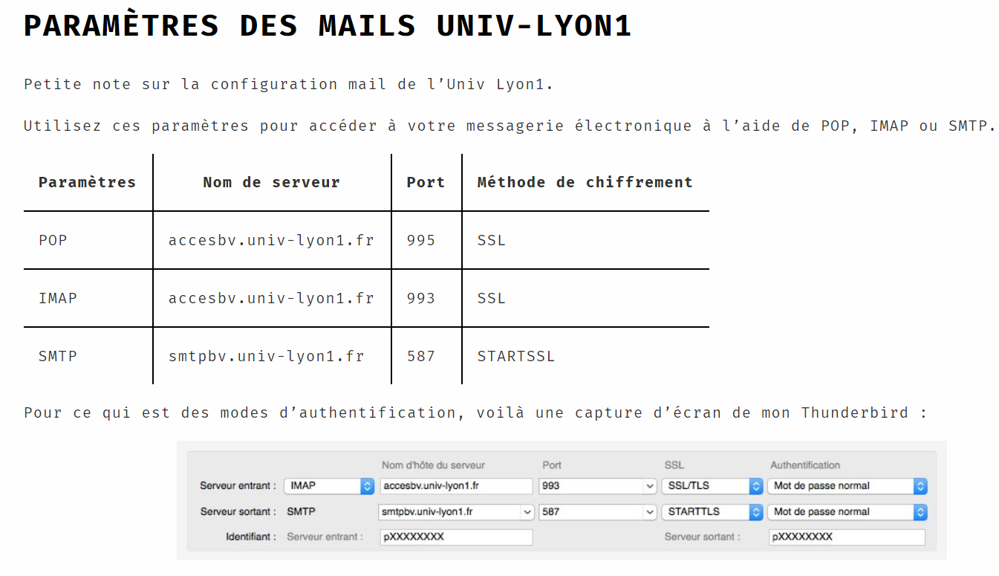

# Accueil

| Paramètres | Nom de serveur | Port | Méthode de chiffrement |
| :---: | :--- | :--- | :--- |
| POP | accesbv.univ-lyon1.fr | 995 | SSL |
| IMAP | accesbv.univ-lyon1.fr | 993 | SSL |
| SMTP | smtpbv.univ-lyon1.fr | 587 | STARTSLL |









