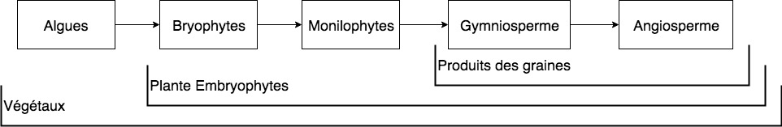

# Biodiversité

## Introduction à la biodiversité


#### Définitions

**Biodiversité :** La biodiversité est la diversité biologique observable à tous les niveaux.  
Ensemble des êtres vivants.


Il existe 3 niveaux d’échelle de diversité 

1. Diversité génétique
2. Diversité spécifique
3. Diversité écosystémique

## Biodiversité Animale

### Prairie

### Aquatique

### Foret

## Biodiversité Végétale

### Définitions

Le terme **végétal** est bien **différents** du terme **plante**.


**Végétal :** Être vivant **eucaryote pluricellulaire**, généralement **autotrophe au carbone** \(présence de **chloroplastes**\) dont les cellules sont entourées par une paroi et qui possède un **thalle** \(lame foliacée aplatie\) ou des **organes différenciés, cormus** \(racine, tige, feuille\).  
**Remarque :** Les champignons et Mycètes ne sont plus considéré comme des végétaux et les algues pluricellulaire sont parfois rangé dans les protistes.  
**A savoir :** Embryophytes, Fabrique de l'amidon

**Embryophytes :** Aussi appelé Cormophytes, rassemblent ce qu'on appelle les plantes terrestres. \([Source](https://fr.wikipedia.org/wiki/Embryophyta)\)  
Elles forment un groupe monophylétique. Ce terme de plantes terrestres n'interdit pas que certaines d'entre elles se soient par la suite adaptées aux milieux aquatiques \(à la manière des cétacés chez les animaux\) ou que leur fécondation reste en milieu aquatique.  
Avec les algues vertes, ou chlorophytes lato sensu \(groupe paraphylétique\), elles constituent le règne des plantes vertes et le clade des chlorobiontes caractérisé par l'association des chlorophylles a et b et l'amidon stocké dans les plastes.  
Les embryophytes sont définies par la présence d'un embryon végétal.

**Cormophytes :** Ensemble des plantes dont l'appareil végétatif est un cormus.

**Chloroplaste :** La chloroplaste est **l'organite** responsable de la **photosynthèse**.

**Photosynthèse** : Fabrication de matière organique à partir de matière minérale \( $$CO_2,H_2O, etc $$ \) et d'énergie lumineuse qui se déroule chez les végétaux chlorophylliens.

**Matière minérale :** Ensemble des molécules qui **ne contiennent pas** de **carbone réduit**.  
- La matière minérale comprend les différentes formes de carbone oxydés comme le dioxyde de carbone et le monoxyde de carbone, les sulfates, les nitrates, les phosphates, les nitrites, l'ammonium, l'eau ....

**Matière organique :** Molécule fabriquée par les **êtres vivants** à **partir** de **carbone réduit**, d'hydrogène, d'oxygène, d'azote, de soufre et de phosphore.

**Carbone réduit :** Atome de carbone dont **au moins un des quatre** électrons célibataires de la couche externe participe à **une liaison**, le plus souvent avec un atome d'**hydrogènes**.

**Autotrophe :** Propriété d'un être vivant qui consiste à fabriquer de la matière organique à partir de matière minéral et d'énergie.  
**-**Si l'énergie est la lumière, la cellule est phototrophe / Si elle est d'origine chimique, la cellule est chimiotrophe.

**Autotrophe au carbone :** Capacité d'un être vivant qui synthétise sa propre matière organique à partir de matière minéral \( $$CO_2$$ \) et d'énergie.

**Thalle :** **Appareil végétatif** des "végétaux primitifs : **thallophytes**" constitué de cellules isolées \(Algue unicellulaire, levures\), de filaments ramifiés \(mycélium des mycètes\) ou d'un tissu parenchymateux lamellaire \(algues\) par opposition à l'appareil végétatif présentant des feuilles, tiges, et des racines.

**Appareil végétatif :** Ensemble des organes d'une plante \(**thalle** chez les thallophytes, **cormus** chez les cormophytes : racine, tige, feuille\) qui assurent sa croissance.


### Grand groupe des végétaux

1. Algues
2. Bryophytes \(Mousses\)
3. Monophysites \(Fougères, Prêles\)
4. Gymnosperme \(Pin, Sapin\)
5. Angiosperme \(Plantes à fleurs\)


Le groupe des angiosperme est le dernier à être arriver sur terre est donc **le plus complexe**, de ce fait il s'est mieux **adapté à son environnement**, les angiospermes représentent environ **95%** des végétaux terrestre.


### Focus sur les angiosperme

#### Feuille


#### **Définition**

**Feuille :** Organe aplati, généralement de couleur verte, qui assure l'essentiel de la photosynthèse et les échange d'eau et de gaz avec l'atmosphère.  
  
**Limbe :** Partie élargie et aplatie de la feuille qui assure la photosynthèse.

**Marge :** La marge est le contour du limbe.

**Nervure :** Ligne saillante formée par les faisceaux conducteurs de la feuille.

**Pétiole :** Structure de petite dimension, à symétrie bilatérale, **reliant le limbe** de la feuille à la **tige** qui convient les **vaisseaux conducteurs de sève.**

**Bourgeon :** Structure constituée par de très jeunes feuilles \(Bourgeon foliaire\) ou de très jeunes fleurs \(Bourgeon florale\) situé sur un axe relativement court, terminé par un méristème apical caulinaire, et protégé par des feuilles modifiées, les écailles.

**Tige :** Organe généralement aérien, plus ou moins dressé et ramifié, sur lequel se développent des bourgeons qui se différencient soit en feuilles, soit en fleurs, soit en axes secondaires \(rameaux\) qui, à leur tour, portent des feuilles ou des fleurs.



Une feuille simple est bien différente qu'une feuille composée.  
Pour trouver une feuille il faut situer ou est le bourgeon, qui est la "Base" de cette dernière.


* Marge du limbe : Entière / Dentée / Lobée
* Nervure : Pénée / Palmée / Parallèle.

## Définitions


**Indigène :** Par convention, on dit qu'une espèce est indigène si elle était déjà présente au sein d'une aire géographique avant l'an 1500. Si elle est apparue après l'an 1500, elle ne sera qualifiée d'indigène que si elle s'est installée sur cette aire géographique indépendamment de toute activité humaine \(ex : qui n'a pas été transportée par bateau …\)

**Exotique :** Une espèce exotique est définie comme une espèce introduite par l'homme après l'an 1500 dans une aire géographique ou elle n'était pas présente.


## Ressources



* [Nowatera](http://www.nowatera.be/)
* [Dictionaire de SVT par Michel Breuil](https://www.decitre.fr/livres/dictionnaire-de-svt-9782091520155.html)
* [Wikipédia](https://fr.wikipedia.org/wiki/Portail:Botanique)



