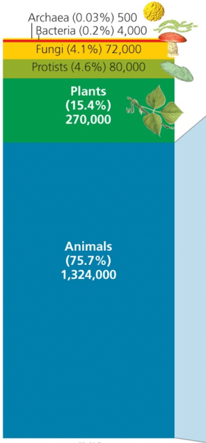
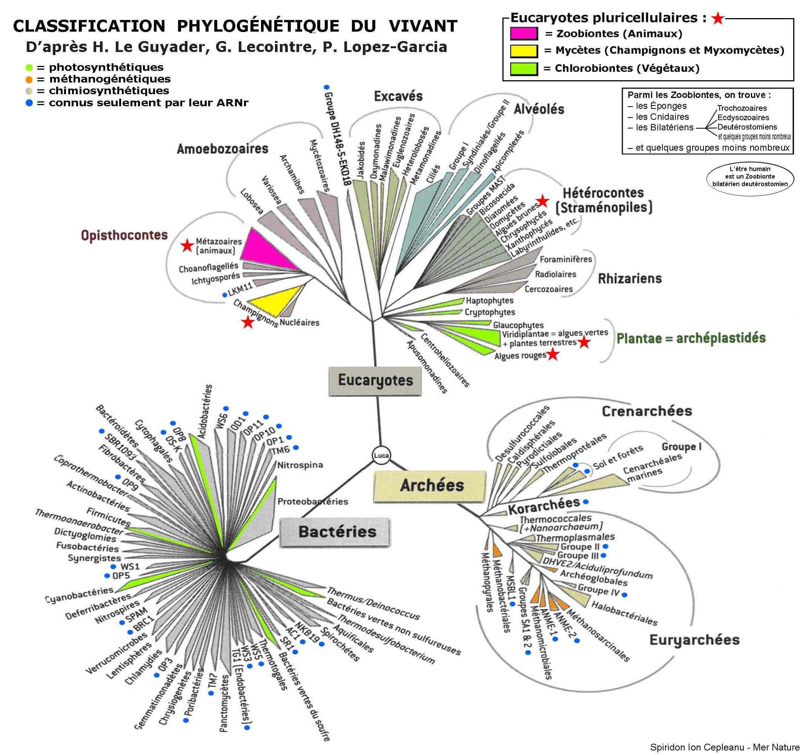

# Biodiversité

## Cours sur la Biodiv végétale ou animale





## Introduction à la biodiversité


**Biodiversité :** La biodiversité est la diversité biologique observable à tous les niveaux. Diversité des écosystèmes, diversité des espèces, diversité génétiques au sein des espèces.


Il existe 3 niveaux d’échelle de diversité

1. Diversité génétique
2. Diversité spécifique
3. Diversité écosystémique

### Qu'est ce que la biodiversité ?

La biodiversité est la diversité biologique, diversité du vivants et des êtres vivants.

* Forme multiple dans la nature avec leur variété et leur variabilité \(Organisation, fonction, génétique\)
* Diversité des écosystèmes, des espèces et des gènes, dans l'espace et dans le temps.

### Qu'est ce que le vivant ?


* Système vivant **complexe**, connexe, organisé. Constitué d'une ou de plusieurs cellules vivantes \(**Unicellulaire** ou **Pluricellulaire**\)
* Capable de s'**auto-construire**, élaborer sa propre matière et sa propre structure
* Capable de se procurer de la matière et l'énergie nécessaire à son fonctionnement et sa **reproduction**
* Capable de se **reproduire** et de donner naissance à d'autre organismes vivants \(Reproductions végétative ou sexuée\)
* Nécessite un environnement favorable pour survivre
* Matière vivante fondée sur la chimie organique avec comme base le carbone.


### Qu'est ce qu'un animal ?

Les animaux sont aussi appelé métazoaire


* Être vivant eucaryote
* Pluricellulaire
* Hétérotrophe
* Mobile \(à un stade de son évolution\)
* contenant du collagène


### Qu'est ce qu'un végétale ?

Les végétaux n'ont pas de caractère spécifiques, voici la liste des plus pertinents


* Cellule **eucaryote**
* Cellule qui contient **parois**, **plastes** et **vacuole**
* **Autotrophe** pour le **carbone**
* Photosynthèse oxygénique
* Production de **métabolite** **secondaires** 


## Qu'est ce qu'une cellule ?


* Unité structurale et fonctionnelle des êtres vivants, formée de molécules organique \(Carbone, Hydrogène, Oxygène, Azote\), les propriété du vivant s'observe à son échelle
* Entouré d'une membrane plasmique \(Bicouche lipidique\)
* Complexité d'organisation
* Echange de la matière et de l'énergie avec son environnement
* Douée de métabolisme \(Ensemble des réaction chimiques faisant intervenir des enzymes, permettant de synthétiser de la matière\)
* Peut se diviser


### Origine de la vie, première trace de vie ?

Les premières traces de vie ont été découvertes avec des fossiles datant d'environs -**3.5Ga** avec un assemblage microbien, le stromatolite \(**Bactérie et micro-organisme**\) en Australie.  
Fossile découverts datant de la même période avec cette fois ci des filament microbiens.  
Ce sont donc des **Bactérie** **unicellulaire** **procaryote**.

#### Premier eucaryote ?

Ensuite viens l'apparition des premières cellules **eucaryotes,** environ de **-2.7Ga à -1.5Ga,** découverte de molécule de **chlolestane** produite exclusivement par des eucaryotes.  
Découverte ensuite d'un fossile daté de **-1.5Ga** qui prouve de manière indiscutable l'apparition des **eucaryotes** durant cette période.

La théorie **endosymbiotique** explique l'apparition des premières cellules eucaryote. Avec l'ajout de deux partie importante et différente de la cellule.  
Mitochondrie : Endosymbiose d'une protéobactérie  
Chloroplaste : Endosymbiose d'une cyanobactérie


Mitochondrie on leur propre ADN


#### Premier organisme eucaryote coloniaux / pluricellulaire

Cette apparition massive des cellules eucaryote pluricellulaire est en cohérence avec l'augmentation de l'oxygène atmosphérique durant la même période, environ -2.4Ga.

#### Premier organisme photosynthétique

* La photosynthèse est apparue à un moment unique avec l'apparition des Cyanobactérie.
* Date d'apparition est d'environ **-3.4Ga à -2.7Ga**

### Diversification du vivant

La faune édiacara à été découverte avec un fossile datant de -600Ma. On entre dans la période du Cambrien, Paléozoïque.

En **1909** **Charles D. Walcott**, découvre les **schistes de Burgess** \(-505Ma\)

#### Paléozoïque

Le vivant se diversifie, dans une première partie dans le milieu marin. Durant le Paléozoïque la diversité s'accélère, avec l'apparition des Arthropodes, Vers, Mollusque, Coraux, Algue, 1er tétrapodes, 1er insectes, 1er organisme terrestres et 1er plantes terrestres \(Mousses, Fougères, Gymnospermes\).  
Les systèmes terrestres se développent, végétaux vasculaires, insectes \(Hexapodes\), vertébrés aquatiques et vertébrés terrestres.

#### Mésozoïque ~252Ma

Apparition des dinosaures, les 1er oiseaux, 1er mammifères, les continuité de la diversifications des insectes, les Conifères et les 1er Angiospermes.

#### Cénozoïque

Apparition des Grands Mammifères, continuité des oiseaux et angiospermes

## Grand personnages de la biodiversité

#### Des Grecque au Romain de -372 à 79

* Théophraste avec Historia Plantarum avec la référence des végétaux de son environnement ainsi que des descriptions et classification.
* Aristote avec un ouvrage sur les Animaux, nomination et classification
* Pline l'Ancien avec Historia Naturalis

#### Au 18é siècle en Suède

Carl von Linée, naturaliste, invente le système de nomenclature, en 1750, et attribut des noms aux espèces végétales et animales.

* Hiérarchie naturelles et fixisme
* 7 niveaux et nomenclature binomiale

#### 19e Siècle

Charles Darwin émet la théorie de l'évolution des espèces et de la sélection naturel. La classification traduit l'histoire de l'évolution.

* Variation des individus
* Les individus les plus adaptés au milieu survivent et se reproduisent
* Augmentation de la fréquence des caractéristiques avantageuses

#### 20e Siècle

Will Hennig mets en place la phylogénie et les liens de parenté entre différentes espèces.  
Cladograme

#### 21e Siècle

Guillaume Lecointre

## L'arbre du vivant


**LUCA** **:** Last Universal Commun Ancestral


#### Virus


Un virus n'est pas un être vivant

* Pas de noyaux, d'organites, métabolisme
* Inerte en dehors de la cellule hôte

C'est un parasite.


#### Mobilité des êtres vivants

Les eucaryote au cours de leurs vie sont forcément en mouvement, soit de manière tracté, **Bicontes**, soit en propulsion **Unicontes.**


Les cellules bicontes sont mobiles avec deux flagelle tracteurs

Les cellules unicontes sont mobiles avec un flagelle propulseur


### Arbre phylogénétique


* L'arbre phylogénétique traduit l'histoire de l'évolution
* A été élaboré par Darwin avec sa théorie de l’évolution
* Montre les liens de parenté entre groupe d'être vivants sur le plan de l'évolution
* Ne reconnais que des groupe monophylétique \(Clade\)



#### Définition

**Clade :** Groupe Monophylétique reprenant l'ancêtre commun et **Tous** ses descendants

**Plésiomorphe :** Ancêtre A possède un caractère X à l’état ancestrale

**Apomorphe :** A' possède un caractère dérivé

**Synapomorphie :** Innovation, caractère nouveau


## Définitions


**Indigène :** Par convention, on dit qu'une espèce est indigène si elle était déjà présente au sein d'une aire géographique avant l'an 1500. Si elle est apparue après l'an 1500, elle ne sera qualifiée d'indigène que si elle s'est installée sur cette aire géographique indépendamment de toute activité humaine \(ex : qui n'a pas été transportée par bateau …\)

**Exotique :** Une espèce exotique est définie comme une espèce introduite par l'homme après l'an 1500 dans une aire géographique ou elle n'était pas présente.

**Procaryote :**

**Eucaryote :**

**Espèce :**


## Ressources



* [Nowatera](http://www.nowatera.be/)
* [Dictionaire de SVT par Michel Breuil](https://www.decitre.fr/livres/dictionnaire-de-svt-9782091520155.html)
* [Wikipédia](https://fr.wikipedia.org/wiki/Portail:Botanique)



* [Biologie de Neil Campbell](https://www.decitre.fr/livres/biologie-9782761350655.html)
* [Classification du viant de Guillaume Lecointre Tome 1](https://www.decitre.fr/livres/classification-phylogenetique-du-vivant-9782701182940.html)
* [Classification du viant de Guillaume Lecointre Tome 2](https://www.decitre.fr/livres/classification-phylogenetique-du-vivant-9782410003857.html)
* [L'origine des espèces Charles Darwin](https://www.decitre.fr/livres/l-origine-des-especes-9782081221079.html)



