# Biodiversité Animal

## Les métazoaires


#### Définition

Animaux constitués de plusieurs cellules formant des tissus bien individualisés aux fonctionnement coordonnées Les principaux groupes de métazoaire sont

* Les vers nématodes
* Les annélides
* Les mollusques
* Les arthropodes
* Les vertébrés


### Diversité animale

Le nombre d'espèces des **métazoaire** **connus** est environ **1,25 millions**, on estime à **10 millions la totalité**

### Métazoaire dans l'arbre du vivant

Les métazoaires font parties de la branche de l'arbre des vivants, celle des eucaryotes. Ce sont tous des **unicontes** \(Cellule mobile avec un flagelle propulseur\)

## Passage à la pluricellularité

### Origine des métazoaire

**Choanoflagellées**

Les **choanoflagellées** sont les plus proches **parents des métazoaire**  
Ce sont des **bactérivores**, **unicellulaire** qui vivent soit solitaire soit en formant des colonies et vivent dans le milieu **marin** ou **dulcicoles**. Il en existe environs 120 espèces

Pour survivre les choanoflagellées peuvent former des colonies de plusieurs individus, qui sont reliées par des **jonctions**, **ponts intercellulaires**, et ont une **matrice extracellulaire**. Ils sont un modèle d’étude sur **l'origine de la pluricellularité** des métazoaire.

#### Etat pluricellulaire

* Augmente la taille des organismes
* Cellules spécialisées dans une fonction
* Regroupement de cellules qui forme un tissu
* Regroupement de tissus qui forme un organe
* Regroupement d'organe qui forme un système


La spécialisation d'une cellule permet d'augmenter son efficacité

* Échapper au prédateurs
* Occuper des niches écologique libres
* Résistance au conditions environnementales difficiles
* Cellules **somatiques** \(Corps\) et **germinales** \(Gamètes\)


### Caractéristique principale des métazoaire

Toutes cellules d'un **métazoaire** contient du **collagène.** C'est une molécule caractéristique.  
Collagène de type 4


* Contient du **collagène**, protéine fibreuse de structure, matrice extra-cellulaire
* **Pluricellulaires**
* **Hétérotrophe**
* **Diploïdes**, par contre les cellules reproductrices sont Haploïdes  Mais aussi
* Généralement **mobile** \(Au moins **au stade larvaire**\)
* Cellules reproductrice mâle : **spermatozoïde**
* **Cellules nerveuses** \(neurones\)


### Les porifères

Les porifères sont porteurs de pores. C'est une branche des métazoaire, leur monophylie est discuté. Appelée couramment éponge

#### Caractéristique des porifères

* Pas de système nerveux central avec neurotransmetteurs
* Organisme **aquatique** **sessiles**, simple, **criblés de pores**
* Cellules spécialisé, présence de _**choanocytes**_
* Cellules faiblement attachées, **pas de tissus**

#### Organisation des porifères

Malgré leur différents formes et organisation, leur différences ne permet pas de les classés dans différentes branche phylogénétique. Grace à l'eau qui passe dans l'atrium par les pores inhalants \(ostiole\), les nutriments et l'oxygène circules au sein du porifère

* Ascon
* Sycon
* Leucon

#### Choanocytes

Les choanocytes sont des cellules spécialisé pour pomper l'eau et capturer les particules en suspension. Elle pratique la phagocytose et permette donc à nourrir le porifère


Constitution d'une cellule choanocyte

* Flagelle
* Collerette
* Vacuole digestive


#### Parois du corps


Le corps du porifère est entouré de parois.   
****Paroi externe composé de **picanodermes**, regroupant plusieurs cellules aplaties **pinacocytes**, et composé d'un **endosquelette de spicules** \(Lui confère la protection, composé d'anti-appétant, inhibant de croissance\).   
Paroi interne composé de **choanoderme**, formé de **choanocytes**.   
Entre les deux parois il y a le **mésoglé** \(Gel\), composés de **Porocytes tubulaires \(Pores\)**


#### Amibocytes

Les cellules amibocytes sont totipotente

* Reproduction sexuée
* Reproduction asexuée
* Régénération
* Digestion et transfert de nutriments

#### Fonctionnement des porifères


Les porifères ne possèdent pas de cavité interne



**Respiration :** Une respiration très mince donc par diffusion \(pas d'organe spécifique\)  
**Nutritions / Digestion :** Choanocytes, phagocytose, vésicules digestives et amibocytes  
**Leur régimes alimentaire :** Suspensivore microphages même si il existe des cas de parasitisme et de prédation  
**Reproduction :** hermaphrodite ou sexes séparés  
**Reproduction asexué :** régénération, bouturage, gemmules \(dormance, conditions difficiles\)  
**Reproduction sexué :** Amibocytes se différencient en gamètes dans mésoglée  
**Excrétion / Osmorégulation :** diffusion de $$NH_4$$ 


#### Importance écologique


* Situés dans les zones littorales et sub-littorales 
* Filtration : réduction de turbidité de l'eau
* Abris pour de nombreux animaux
* Nourriture pour certains poissons 
* Utilisé pour la biotechnologies et pour les antibiotiques


#### Grande lignée de porifères


* Les Demosponges
  * 8000 espèces environs soit 80% total
  * Présentes  dans tous les environnements
* Les Hexactinellides ou éponges de verre
  * 1000 espèces, qui sont toutes constituées de spicules de silices à 6 pointes
  * Milieu marin profond, environ 200m, et froid
  * Pas de choanoderme \(Un choanosyncytium - syncytium : cellules à plusieurs noyaux\)
* Les Calciponges ou éponges de calcaire
  * Milieu marin en eaux peu profondes et chaudes
  * Récifs coralliens
* Les Homoscléromorphes
  * Eaux marines peu profondes
  * Eponges encroûtantes 
  * Pas ou peu de spicules \( $$CaCO_3$$ ou $$SiO_2$$ \)
  * Collagène de type 4 et lame basale


### Les caractéristiques des Eumétazoaires


* Différenciation cellulaire poussé
  * Cellules musculaires
  * Cellules nerveuse et sensorielle, il y a existence de synapse chimiques et donc de système nerveux
* Cavité digestive bien différenciée
  * Bouche
  * Cellules sécrétrices d'exoenzymes
* Lame basale complexe
  * Diversité des molécules de structure
* **Epithélium**
  * lame basale : couche complexe de molécule dans la matrice extra cellulaire
  * 2 couches superposées :
    * lamina lucida
    * lamina densa
  * Complexe de jonction


### A savoir impérativement


* Métazoaires et Eumétazoaires
* Porifères \(Spongiaires\) - Choanocytes
  * Pinacoderme / Mésoglée / Choanoderme
  * Porocyte / Sclérocyte / Amibocyte
  * Diversité des porifère
    * Démosponges
    * Hexactinellides
    * Calciponges
    * Homoscléromorphes
* Savoir refaire les schémas principaux


## Cnidaires et Bilatériens

### Embryogenèse précoce

Lors de l'embryogenèse précoce il y a deux grande étapes, le clivage et la gastrulation

#### Clivage

Le clivage est la division rapide et rapprochées \(Mitoses\) qui fragmentent l’œuf en cellules filles : blastomères, il n'y à pas d'accroissement de taille


Il existe de modes de clivages

* Clive partiel ou **Méroblastique**
  * **Séparé** en **deux** **parties**, **embryon** et **réserves**
  * Viteluse de réserve
  * Commun chez les oiseaux, "poissons", serpents etc
* Clivage total ou **Holoblastique**
  * Il y a deux blastomères
    * Si il sont de taille égale \(**clivage radiale**\) alors c'est un **Coéloblastula**
    * Si il sont macromère et micromère \(**clivage spirale**\) alors c'est un **Stéréoblastula**


#### Gastrulation

Le **rythme** de **division** est **ralenti** et il y a **mouvement** des **cellules**, **mouvements** morphogénétiques \(feuillet embryonnaire\), suie à ce mouvement il y a formation d'un **Archenteron** et **Blastopore**.

**Archenteron** est **l'intestin** **embryonnaire**, et le **blastopore** la 1ère **ouverture** **embryonnaire**

Suite à cette gastrulation il y formation de deux feuillet embryonnaire, l'endoderme et l'ectoderme.

**L'endoderme** permet la **nutrition** et **l'ectoderme** est un **contact** avec **l'extérieur**, **épithélium**, et à un **système nerveux**

#### 2 ou 3 feuillets embryonnaire ?

#### Diploblastique - Triploblastique

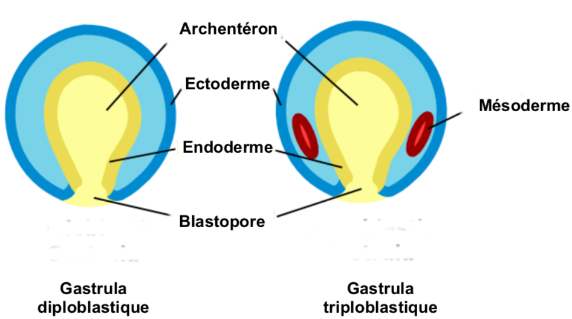


Malgré le fait que les **cnidaires** et les **cténophores** on **deux feuillet embryonnaire**, il **ne sont pas un clade**


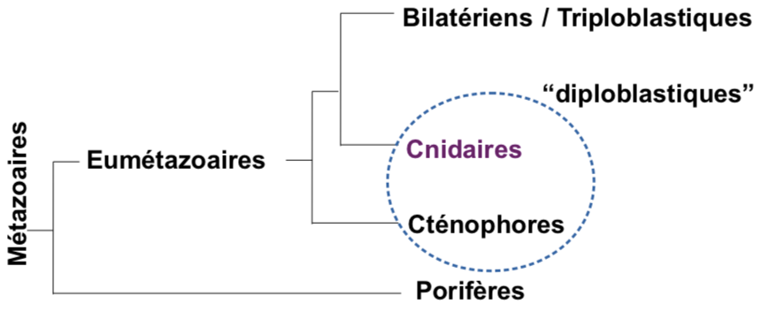

### Les Cténophores


Le **colloblaste** est le caractère propre au **cténophores**.

Ils ont des **tentacules**, sont **transparents** et ont des **cils** **iridescents**


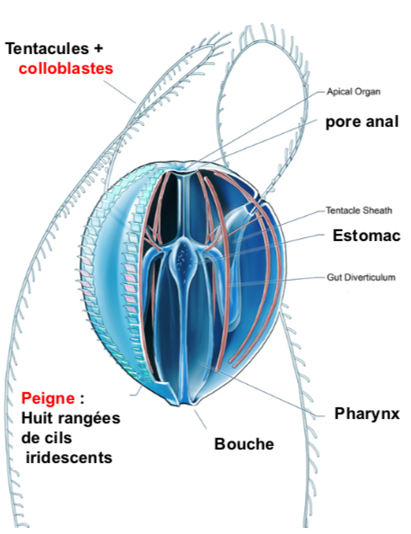

### Cnidaires


Les **cnidaires** ont plusieurs **formes**, une forme **fixe** appelé **polype** et une forme **mobile** dite **méduse**, une espèces peut être polype et méduse.  
Voici une listes de caractères pour les cnidaires

* Symétrie radiale, diploblastique
* Tissus différenciés
* Stade larvaires, planula
* Vive en milieu aquatique
* On du mésoglée **\(Le mésoglée n'est pas un tissus, c'est de la gélatine\)**
* Fécondation externe


#### Larve planula

#### Polype

#### Méduse

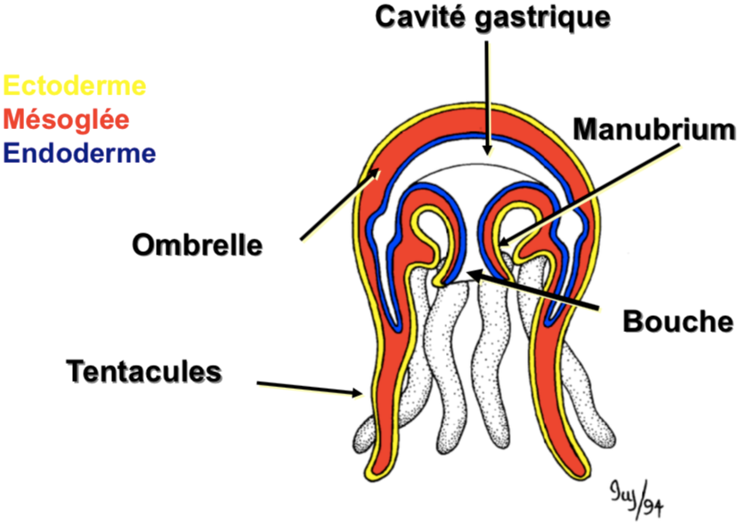

#### Trois groupes principaux de cnidaires

Contient environs 15 000 espèces

#### Lignée des médusozoaires

#### Les hydrozoaires


Contient environs 9000 espèces

1. Stade polype
2. Bourgeons médusaires
3. Méduse mâle ou femelle assure la reproduction via une fécondation externe dans le milieux


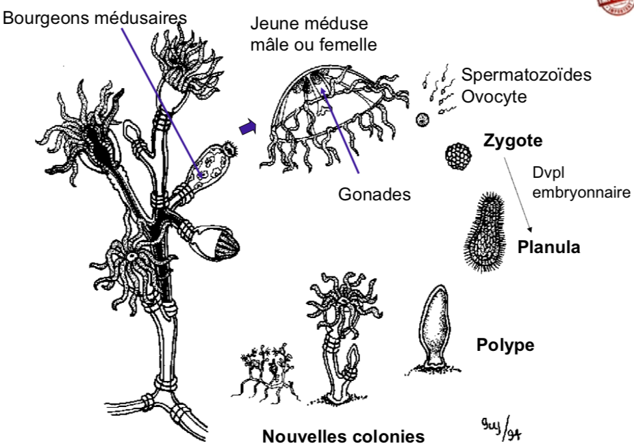

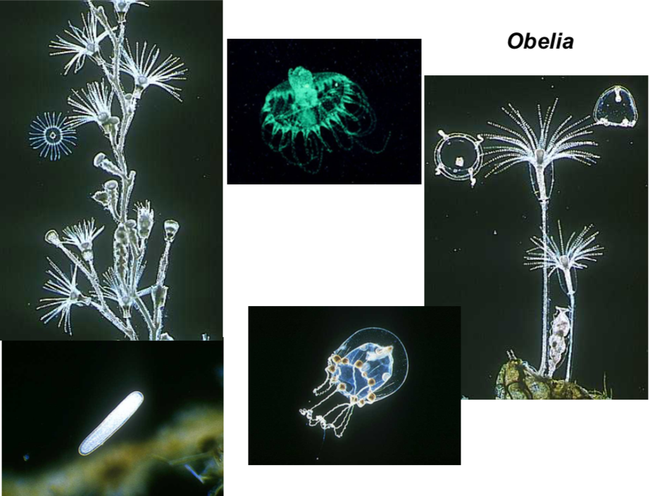

#### Les Scyphozoaires


Forme méduse dominante, il y a division par **strobilisation.**

Chaque pétale sur le polype donne une méduse


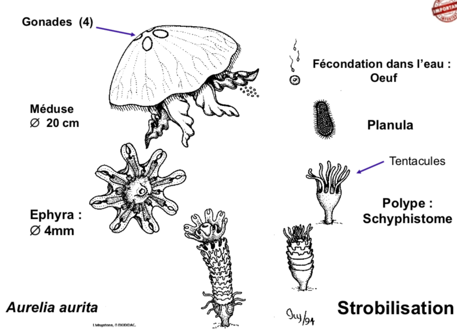

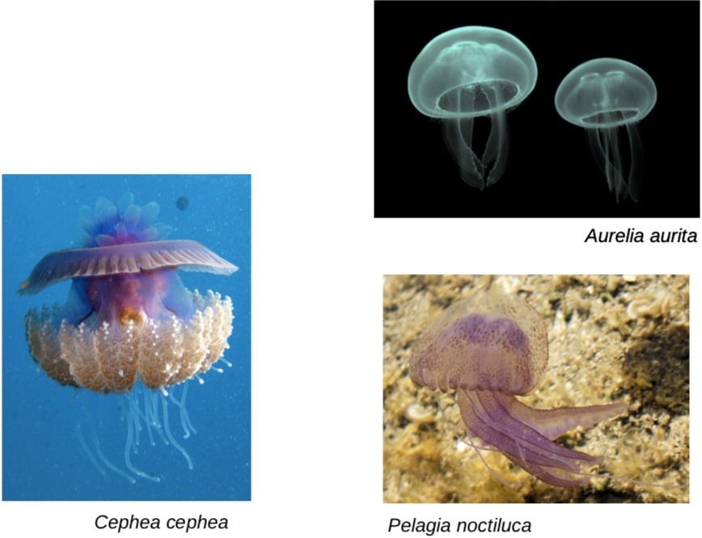

#### Anthozoaires


**Seulement** **polype**, produit des gamètes dans l'environnement 

* Coraux
* Anémone


#### Caractéristique des cnidaires


* Paroi externe : épiderme \(Origine ectoderme\)
  * Cnidocytes \(Utile pour tuer et capturer les proies, faire fuir les prédateurs\)
    * Opercules
    * Cnidocil excitable
    * Crochets
    * Capsule : venin
  * Cellule Épithelio-musculaire
  * Cellule interstitielle
* Paroi interne : gastroderme \(origine endoderme\) \(Absorbe la nourriture\)
  * Cellule digestive
  * Cellule musculaire
  * Cellule glandulaire
* Mésoglée


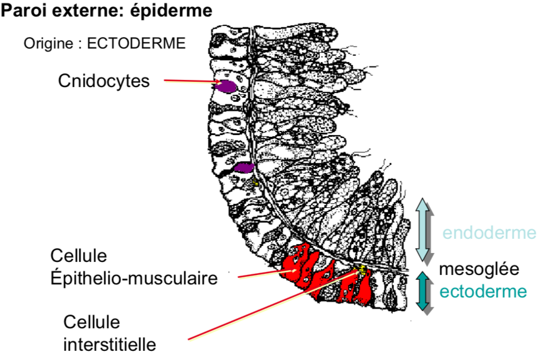

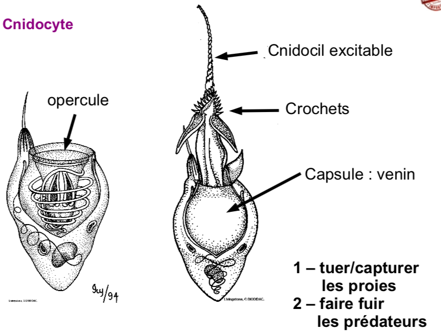

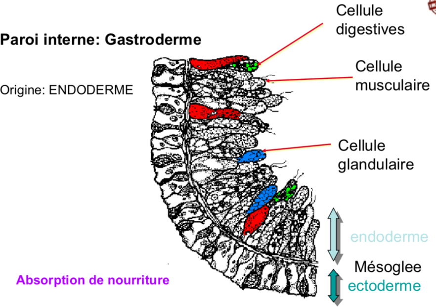

#### Point de vue fonctionnel


* Respiration par diffusion car très simple et fin
* Nutrition
  * Cnidocytes
  * Digestion extra et intra cellulaire
  * Carnivore
* Reproduction en plusieurs phases
  * Phase asexuée : bourgeon et régénération
  * Phase sexuée : fertilisation externe et planula
* Excrétion / Osmorégulation avec diffusion de $$NH_4$$ 
* Sens et Système nerveux
  * Réseaux nerveux peu développé
  * Méduse : Cellules sensorielle sensible à la lumière


#### Importance écologique


* Abri pour les animaux et nourritures de certains poissons
* Peu de prédateurs 
  * Etoiles de mer
  * Tortues marines
  * Nudibranches


### Conséquence de la triploblastie


Apparition du feuillet mésoderme en plus de l'ectoderme et de l'endoderme. Le mésoderme apparaît à partir des parois de l'archentéron.  
Liste du devenir des différent feuillet

* Endoderme
  * Nutrition
  * Respiration
* Mésoderme
  * Soutient et tous le reste
* Ectoderme
  * Contact avec l’extérieur
  * Système nerveux
  * Épithélium

La triploblastie est aussi appelé bilatérien


#### Deux mise en place

Il y a deux mode de mise en place de cœlome, **schizocœlie** et **entérocœlie**


Le cœlome n'est pas un caractère phylogénétique


## Protostomiens

### Devenir du blastopore


Lors de l'évolution de l'embryon, le blastopore peut devenir, soit la bouche et l'être est alors un protostomien, ou alors l'anus, la bouche est une ouverture secondaire du tube digestif et l'être est alors un deutérostomien


#### Protostomiens

#### Deutérostomiens

### Spiraliens

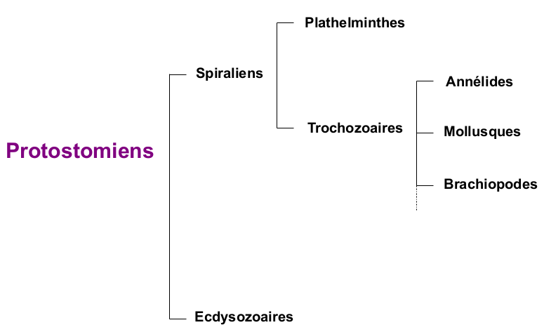


Les protostomiens spiraliens se différencies grâce à différent caractère

* Caractère moléculaire
  * gènes de l'ARN ribosomique 18S
  * gènes Hox \(développement\)
* **Clivage spiral** lors de embryogenèse précoce   


### Plathelminthes


Il existe deux grande forme de plathelminthes

* Forme libre
  * Planaires \(Ou Turbellariés\)
* Forme "parasite"
  * Cestodes
  * Trématodes


#### Planaires


Les plathelminthe sont des **acœlomate**, **prédateur**. Malgré que la bouche soit au niveau du ventre, leur tête est bien à l'avant de l'animal. \(Tête  = concentration système nerveux\)  
**Système excréteur** \(protonéphridie formée de **cellules flammes**\)  
L'animal est remplie de **mésenchyme** d'origine mésodermique et de liquide, c'est un hydrosquelette qui transporte des gaz et les aliments.

La particularité des acœlomate est leur forme plate, cette forme leur permet de respirer par diffusion


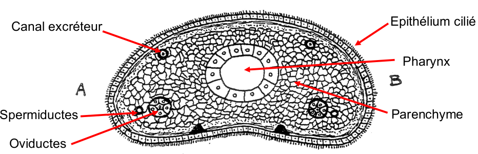

#### Système excréteur

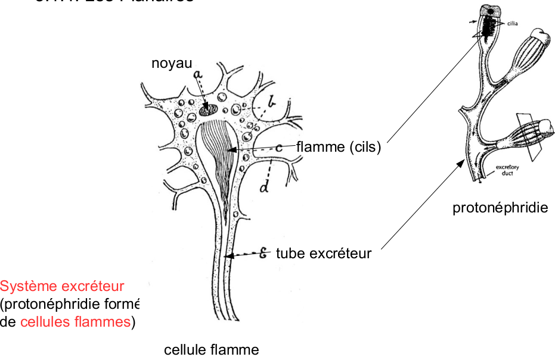


#### Mouvement

* Squelette hydrostatique 
* Cils et mucus

#### Reproduction

La reproduction des planaires est complexe. Hermaphrodisme à fécondation croisée \(insémination hypodermique chez certaines espèces\)  
Gamètes mâles produits avant les gamètes femelles : protandrie  
Stade larvaire: Planaire marine = larve de Muller  
    
Régénération par fission transversale ou par architomie  
 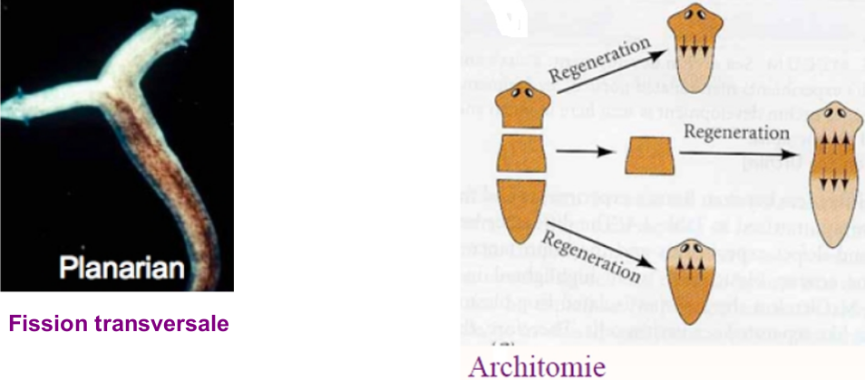 

#### Nutrition

Prédateur : les planaires s'attaquent aux invertébrés blessés \(pharynx dévaginable\)


#### Les formes parasites des plathelminthes

#### Trématodes


Les formes parasites des spiraliens sont dotés de **ventouses** ou **crochets**. Il en existe deux types, les **trématodes** et les **cestodes**



Les plathelminthes parasites sont pathogènes pour l'homme avec en exemple le  Schistosoma mansoni \(maladie Bilharziose\) 500 000 décès par an et environs 600 millions de personnes concernés.


#### Cycle de vie

1. Embryon dans l’hôte
2. Miracidium
3. Deux génération dans un hôte escargot
4. Cercaire \(Vie dans l'eau\) qui pénètre dans l’hôte Homme
5. Vie adulte dans l’hôte final Homme \(Intestin\)

#### Cestodes


Les cestodes ont des **ventouses** et des **crochets**, sont constitué d'une **zone de bourgeonnement**, qui forme des **empilement** de **proglottis**. C'est une unité indépendante formant le **strobile**, constitué **essentiellement d'organes sexuelles**. C'est un animal **hermaphrodites**. Peut mesurer environ 10 mètre


#### Fonctionnement des plathelminthes


* Respiration et circulation : Diffusion \("Vers plat"\), souvent métabolisme anaérobie
* Alimentation et digestion : Extra et Intracellulaire
* Reproduction 
  * Sexuée : Hermaphrodisme à fécondation croisée / Auto
  * Asexuée : Régénération \(Fission binaire et architomie\)
* Excrétion : Protonéphridie \(Cellules flammes\)


### Trochozoaires

#### Larve Trochophore


L'une des **synapomorphie** des **trochozoaires** et le fait qu'ils sont tous au stade larvaires au début de leur vie, appelées **larve trochophore**. Ces larves sont très **diverses**, et sont composés d'une ou plusieurs couronnes de cils leur permettant leur déplacement.



Les deux mésoblastes se divisent en petites cellules formant deux bandes de mésoderme 

* Progressent vers l'avant avec l'allongement larvaire 
* Se creusent d'une cavité cœlomique

Chaque segment prend le nom de **métamère.** Formation du **cœlome** à partir d'une fente du mésoderme: **schizocoelie**


#### Larve trochophore des mollusques


Chez les mollusques la larve trochophore à une **coquille** et est appelée **larve véligère**

Il y a une croissance ventro-dorsale et les bandelettes mésodermiques ne se segmentent pas et ne se creusent pas. Il y a qu'une seule cavité cœlomique autour cœur, rein et gonade


#### Annélides


Les annélides représentent environ **15000 espèces**. Ce sont des **vers annelés**, **triploblastique,** **protostomiens, hyponeuriens**, **cœlomates** et **métamérisés**.


## Cœlome


Le cœlome le regroupement des cavités secondaire d'un animal. C'est une cavité creusé dans le mésoderme, délimité par une couche de cellules appelé péritoine ou mésothélium

* Sac poumon -&gt; Plèvre
* Sac cœur -&gt; Péricarde
* Sac gastrique -&gt; Péritoine

Le cœlome permet une augmentation de la complexité


La cavité primaire est l'archentéron, qui est l'intestin primitif au stade embryonnaire, c'est la première cavité qui traverse l'embryon en cours de développement et qui communique avec l'extérieur par le blastopore. Formé au cours de la gastrulation, cet organe tubulaire est entouré de l'endoderme nouvellement formé et deviendra l'appareil digestif de l'organisme.

Le **blastopore** est **l'orifice** de la **blastula** faisant communiquer **l’archentéron** avec **l’extérieur**. Il résulte de l’invagination du matériel superficiel **lors** de la **gastrulation** et constituera **l’anus** chez les **deutérostomiens** et la **bouche** chez les **protostomiens**.

Il existes différents système chez un métazoaire

* Système digestif
* Système nerveux
* Système respiratoire
* Système circulaire
* Système reproducteur
* Système excréteur

### Acœlomate


Les acœlomates sont les animaux qui n'ont pas de cavité interne


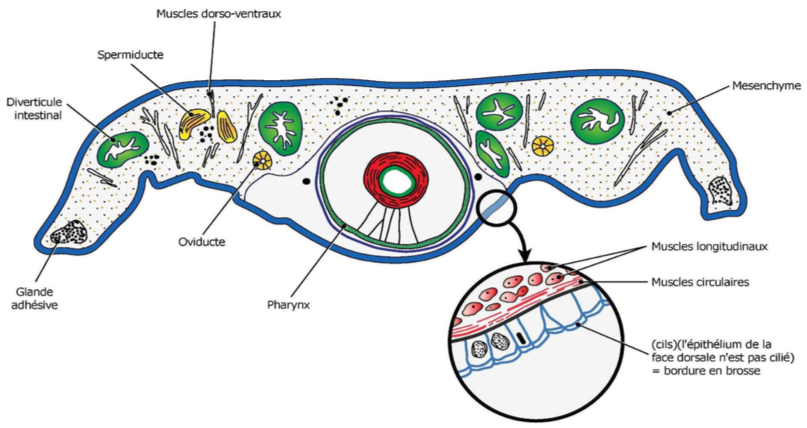

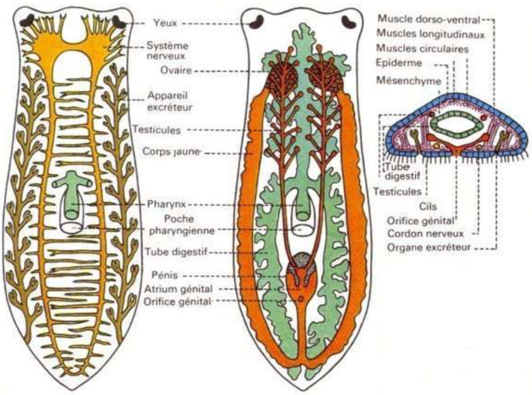

### Pseudocœlomates et Cœlomates

#### Pseudocœlomates


Cavité présente mais pas dans le mésoderme

La formation du pseudocœlome est différente de celle du cœlome puisqu’il se développe à partir de la blastocoele mais possède les mêmes fonctions


#### Cœlomates


Cavité formé dans le mésoderme


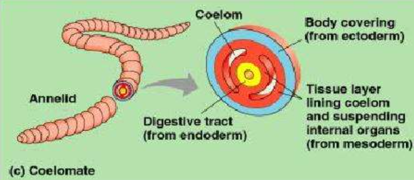


Cavité générale d'un organisme triploblastique délimitée de toute part par un feuillet mésodermique appelé péritoine.


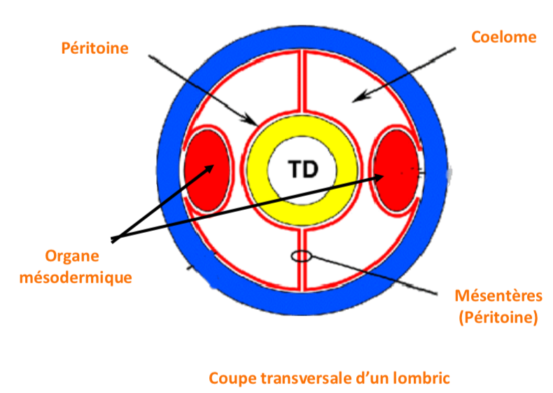

#### Avantages


L'avantage des cœlomates et pseudocœlomates sont les suivants

* Donne de la place aux organes
* Le fluide dans le cœlome permet la rigidité \(Squelette liquide, hydrosquelette\)
* Organe protégé du changement de température
* Absorbe les chocs


## Définitions


Unicontes :

Bicontes :

Eucaryotes :

Opisthocontes : 

Cellules somatique :

Cellules germinales :

Collagène :

Porifères :

Choanocytes :

Sessile :

Phagocytose :

Amibocytes : 

Totipotente : 

Asexuée :

Turbidité :

Cnidaires :

Bilatériens :

Blastomère :

Feuillet embryonnaire : 

Épithélium : 

Larve planula :

Ectoderme :

Mésoderme :

Endoderme :

Épithélium :

Cnidocytes :

Pharynx :

Larve :

Hyponeurien : 

Epineurien :


#### Prairie

#### Aquatique

#### Foret

