# Biodiversité Animal

## Les métazoaires


#### Définition

Animaux constitués de plusieurs cellules formant des tissus bien individualisés aux fonctionnement coordonnées Les principaux groupes de métazoaire sont

* Les vers nématodes
* Les annélides
* Les mollusques
* Les arthropodes
* Les vertébrés


### Diversité animale

Le nombre d'espèces des **métazoaire** **connus** est environ **1,25 millions**, on estime à **10 millions la totalité**

### Métazoaire dans l'arbre du vivant

Les métazoaires font parties de la branche de l'arbre des vivants, celle des eucaryotes. Ce sont tous des **unicontes** \(Cellule mobile avec un flagelle propulseur\)

## Passage à la pluricellularité

### Origine des métazoaire

**Choanoflagellées**

Les **choanoflagellées** sont les plus proches **parents des métazoaire**  
Ce sont des **bactérivores**, **unicellulaire** qui vivent soit solitaire soit en formant des colonies et vivent dans le milieu **marin** ou **dulcicoles**. Il en existe environs 120 espèces

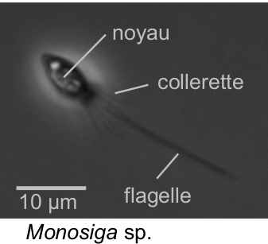

Pour survivre les choanoflagellées peuvent former des colonies de plusieurs individus, qui sont reliées par des **jonctions**, **ponts intercellulaires**, et ont une **matrice extracellulaire**. Ils sont un modèle d’étude sur **l'origine de la pluricellularité** des métazoaire.

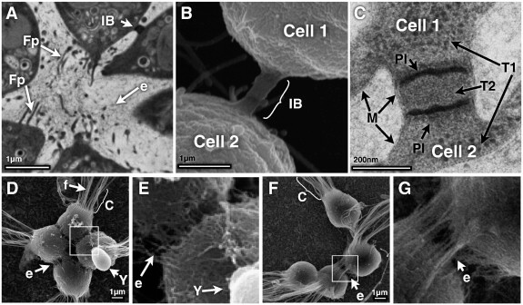

#### Etat pluricellulaire

* Augmente la taille des organismes
* Cellules spécialisées dans une fonction
* Regroupement de cellules qui forme un tissu
* Regroupement de tissus qui forme un organe
* Regroupement d'organe qui forme un système

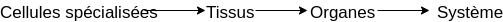


La spécialisation d'une cellule permet d'augmenter son efficacité

* Échapper au prédateurs
* Occuper des niches écologique libres
* Résistance au conditions environnementales difficiles
* Cellules **somatiques** \(Corps\) et **germinales** \(Gamètes\)


### Caractéristique principale des métazoaire

Toutes cellules d'un **métazoaire** contient du **collagène.** C'est une molécule caractéristique.  
Collagène de type 4


* Contient du **collagène**, protéine fibreuse de structure, matrice extra-cellulaire
* **Pluricellulaires**
* **Hétérotrophe**
* **Diploïdes**, par contre les cellules reproductrices sont Haploïdes  Mais aussi
* Généralement **mobile** \(Au moins **au stade larvaire**\)
* Cellules reproductrice mâle : **spermatozoïde**
* **Cellules nerveuses** \(neurones\)


### Les porifères

Les porifères sont porteurs de pores. C'est une branche des métazoaire, leur monophylie est discuté. Appelée couramment éponge

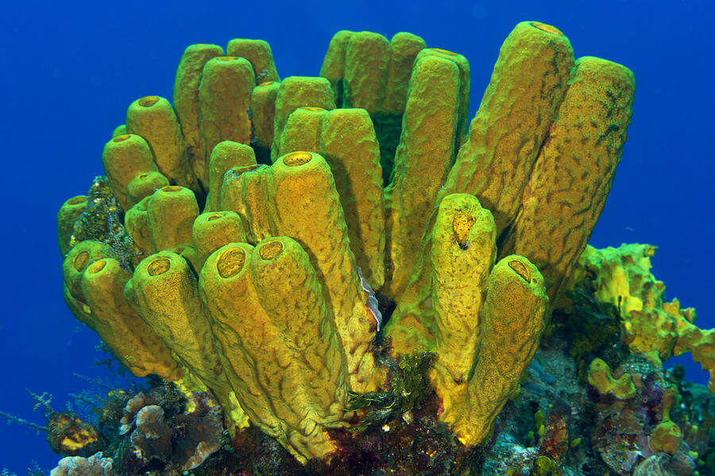

#### Caractéristique des porifères

* Pas de système nerveux central avec neurotransmetteurs
* Organisme **aquatique** **sessiles**, simple, **criblés de pores**
* Cellules spécialisé, présence de _**choanocytes**_
* Cellules faiblement attachées, **pas de tissus**

#### Organisation des porifères

Malgré leur différents formes et organisation, leur différences ne permet pas de les classés dans différentes branche phylogénétique. Grace à l'eau qui passe dans l'atrium par les pores inhalants \(ostiole\), les nutriments et l'oxygène circules au sein du porifère

* Ascon
* Sycon
* Leucon

#### Choanocytes

Les choanocytes sont des cellules spécialisé pour pomper l'eau et capturer les particules en suspension. Elle pratique la phagocytose et permette donc à nourrir le porifère


Constitution d'une cellule choanocyte

* Flagelle
* Collerette
* Vacuole digestive


#### Parois du corps


Le corps du porifère est entouré de parois.   
****Paroi externe composé de **picanodermes**, regroupant plusieurs cellules aplaties **pinacocytes**, et composé d'un **endosquelette de spicules** \(Lui confère la protection, composé d'anti-appétant, inhibant de croissance\).   
Paroi interne composé de **choanoderme**, formé de **choanocytes**.   
Entre les deux parois il y a le **mésoglé** \(Gel\), composés de **Porocytes tubulaires \(Pores\)**


#### Amibocytes

Les cellules amibocytes sont totipotente

* Reproduction sexuée
* Reproduction asexuée
* Régénération
* Digestion et transfert de nutriments

#### Fonctionnement des porifères


Les porifères ne possèdent pas de cavité interne



**Respiration :** Une respiration très mince donc par diffusion \(pas d'organe spécifique\)  
**Nutritions / Digestion :** Choanocytes, phagocytose, vésicules digestives et amibocytes  
**Leur régimes alimentaire :** Suspensivore microphages même si il existe des cas de parasitisme et de prédation  
**Reproduction :** hermaphrodite ou sexes séparés  
**Reproduction asexué :** régénération, bouturage, gemmules \(dormance, conditions difficiles\)  
**Reproduction sexué :** Amibocytes se différencient en gamètes dans mésoglée  
**Excrétion / Osmorégulation :** diffusion de $$NH_4$$ 


#### Importance écologique


* Situés dans les zones littorales et sub-littorales 
* Filtration : réduction de turbidité de l'eau
* Abris pour de nombreux animaux
* Nourriture pour certains poissons 
* Utilisé pour la biotechnologies et pour les antibiotiques


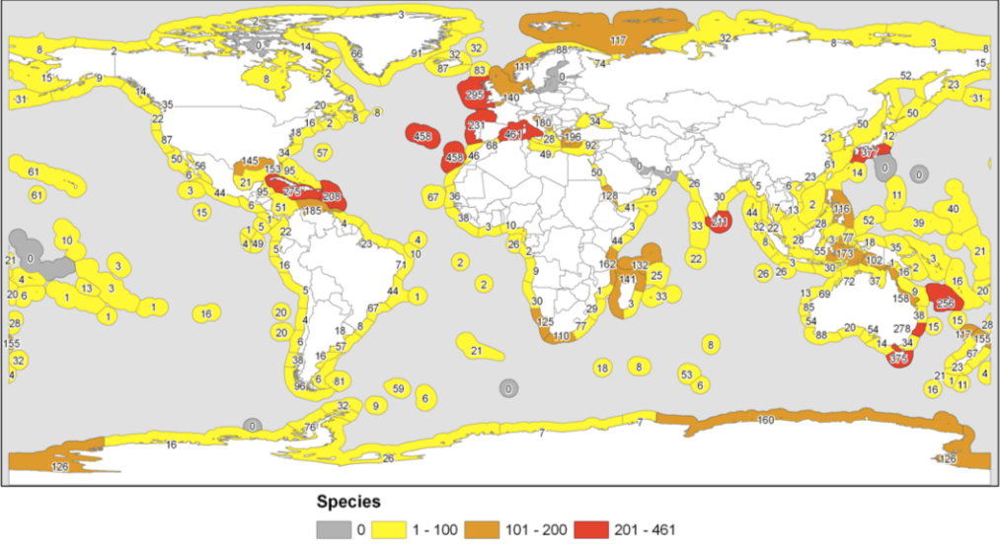

#### Grande lignée de porifères


* Les Demosponges
  * 8000 espèces environs soit 80% total
  * Présentes  dans tous les environnements
* Les Hexactinellides ou éponges de verre
  * 1000 espèces, qui sont toutes constituées de spicules de silices à 6 pointes
  * Milieu marin profond, environ 200m, et froid
  * Pas de choanoderme \(Un choanosyncytium - syncytium : cellules à plusieurs noyaux\)
* Les Calciponges ou éponges de calcaire
  * Milieu marin en eaux peu profondes et chaudes
  * Récifs coralliens
* Les Homoscléromorphes
  * Eaux marines peu profondes
  * Eponges encroûtantes 
  * Pas ou peu de spicules \( $$CaCO_3$$ ou $$SiO_2$$ \)
  * Collagène de type 4 et lame basale


### Les caractéristiques des Eumétazoaires


* Différenciation cellulaire poussé
  * Cellules musculaires
  * Cellules nerveuse et sensorielle, il y a existence de synapse chimiques et donc de système nerveux
* Cavité digestive bien différenciée
  * Bouche
  * Cellules sécrétrices d'exoenzymes
* Lame basale complexe
  * Diversité des molécules de structure
* **Epithélium**
  * lame basale : couche complexe de molécule dans la matrice extra cellulaire
  * 2 couches superposées :
    * lamina lucida
    * lamina densa
  * Complexe de jonction


### A savoir impérativement


* Métazoaires et Eumétazoaires
* Porifères \(Spongiaires\) - Choanocytes
  * Pinacoderme / Mésoglée / Choanoderme
  * Porocyte / Sclérocyte / Amibocyte
  * Diversité des porifère
    * Démosponges
    * Hexactinellides
    * Calciponges
    * Homoscléromorphes
* Savoir refaire les schémas principaux


## Cnidaires et Bilatériens

### Embryogenèse précoce

Lors de l'embryogenèse précoce il y a deux grande étapes, le clivage et la gastrulation

#### Clivage

Le clivage est la division rapide et rapprochées \(Mitoses\) qui fragmentent l’œuf en cellules filles : blastomères, il n'y à pas d'accroissement de taille

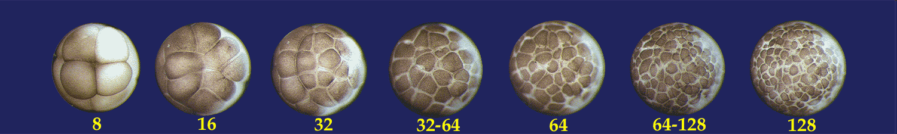


Il existe de modes de clivages

* Clive partiel ou **Méroblastique**
  * **Séparé** en **deux** **parties**, **embryon** et **réserves**
  * Viteluse de réserve
  * Commun chez les oiseaux, "poissons", serpents etc
* Clivage total ou **Holoblastique**
  * Il y a deux blastomères
    * Si il sont de taille égale \(**clivage radiale**\) alors c'est un **Coéloblastula**
    * Si il sont macromère et micromère \(**clivage spirale**\) alors c'est un **Stéréoblastula**


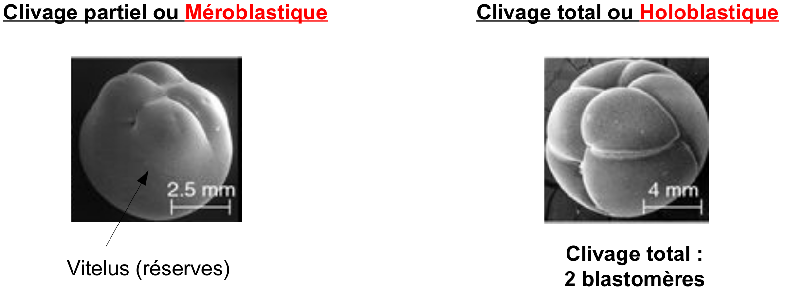

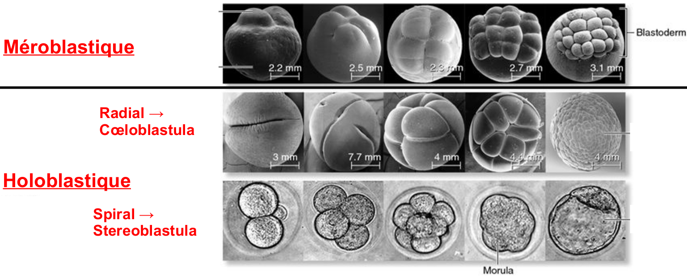

#### Gastrulation

Le **rythme** de **division** est **ralenti** et il y a **mouvement** des **cellules**, **mouvements** morphogénétiques \(feuillet embryonnaire\), suie à ce mouvement il y a formation d'un **Archenteron** et **Blastopore**.

**Archenteron** est **l'intestin** **embryonnaire**, et le **blastopore** la 1ère **ouverture** **embryonnaire**

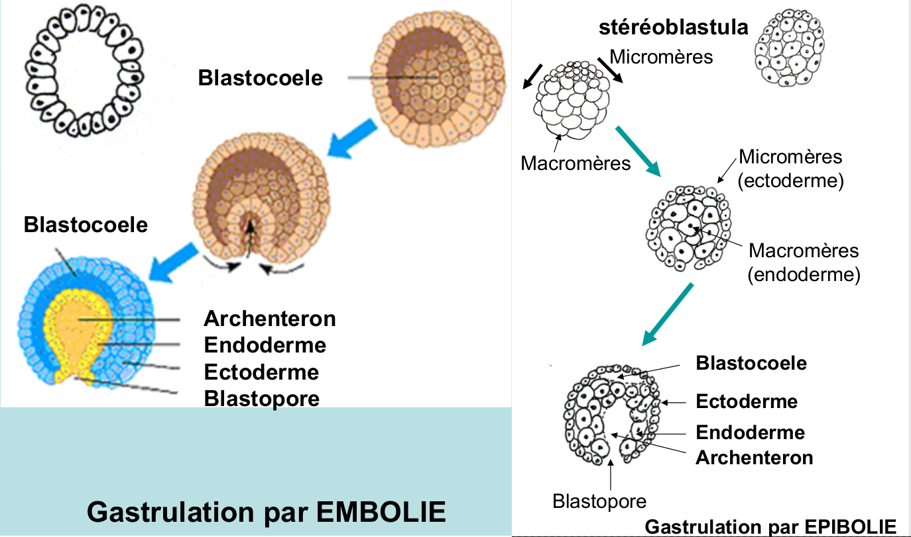

Suite à cette gastrulation il y formation de deux feuillet embryonnaire, l'endoderme et l'ectoderme.

**L'endoderme** permet la **nutrition** et **l'ectoderme** est un **contact** avec **l'extérieur**, **épithélium**, et à un **système nerveux**

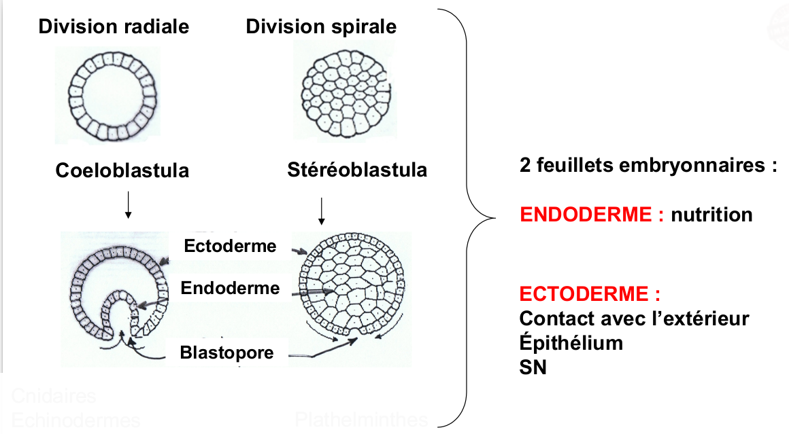

## Définitions


Unicontes :

Bicontes :

Eucaryotes :

Opisthocontes : 

Cellules somatique :

Cellules germinales :

Collagène :

Porifères :

Choanocytes :

Sessile :

Phagocytose :

Amibocytes : 

Totipotente : 

Asexuée :

Turbidité :

Cnidaires :

Bilatériens :

Blastomère :

Feuillet embryonnaire : 

Épithélium : 


## Résultat du TP "Etang"

#### Prairie

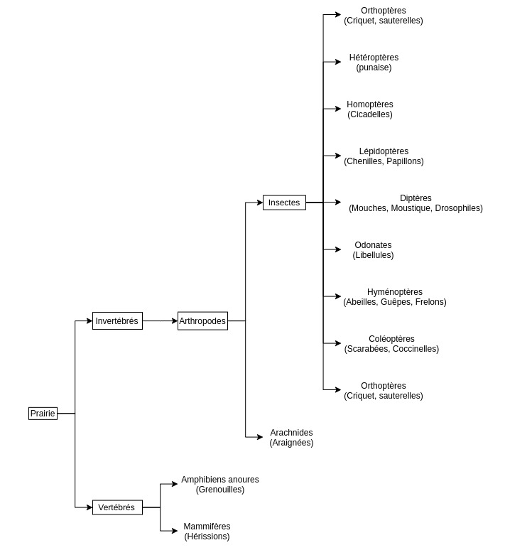

#### Aquatique

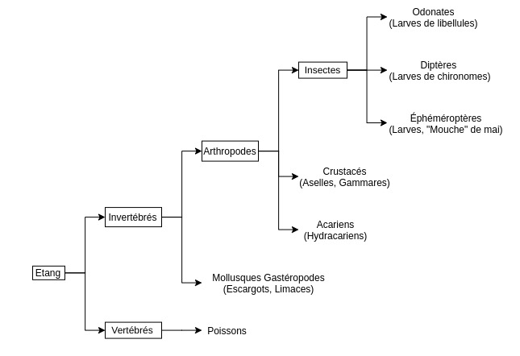

#### Foret

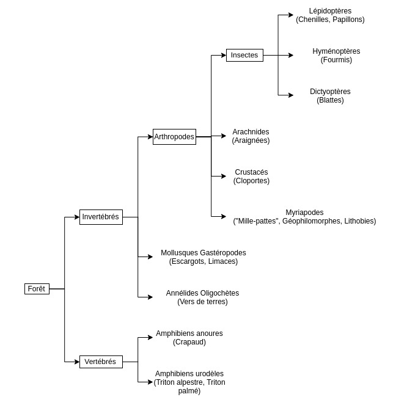

