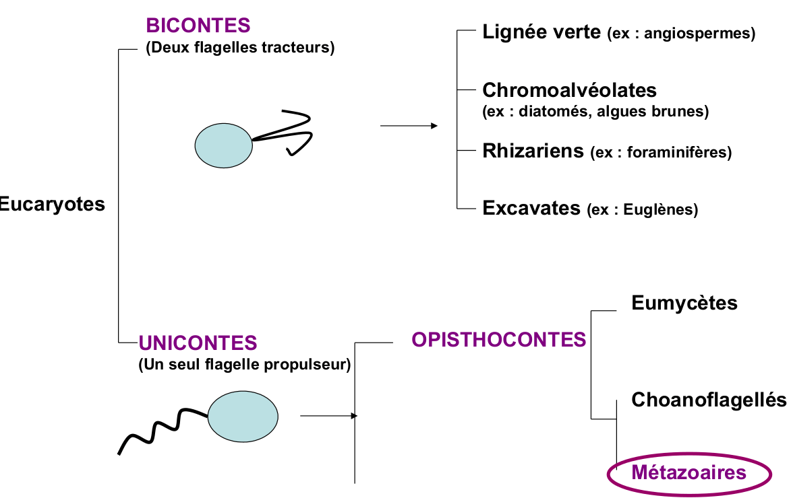
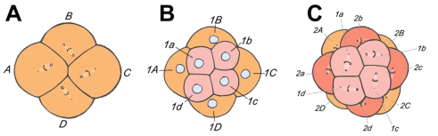
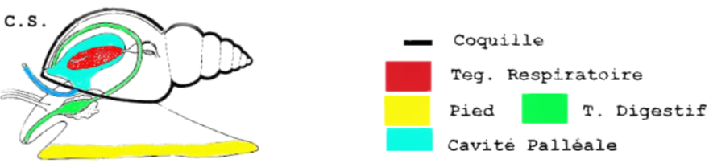

# Biodiversité Animal

## Les métazoaires


Animaux constitués de plusieurs cellules formant des tissus bien individualisés aux fonctionnement coordonnées Les principaux groupes de métazoaire sont

Le nombre d'espèces des **métazoaire** **connus** est environ **1,25 millions**, on estime à **10 millions la totalité**


#### Métazoaire dans l'arbre du vivant

Les métazoaires font parties de la branche de l'arbre des vivants, celle des eucaryotes. Ce sont tous des **unicontes** \(Cellule mobile avec un flagelle propulseur\)

## Passage à la pluricellularité

### Origine des métazoaire

**Choanoflagellées**

Les **choanoflagellées** sont les plus proches **parents des métazoaire**  
Ce sont des **bactérivores**, **unicellulaire** qui vivent soit solitaire soit en formant des colonies et vivent dans le milieu **marin** ou **dulcicoles**. Il en existe environs 120 espèces

Pour survivre les choanoflagellées peuvent former des colonies de plusieurs individus, qui sont reliées par des **jonctions**, **ponts intercellulaires**, et ont une **matrice extracellulaire**. Ils sont un modèle d’étude sur **l'origine de la pluricellularité** des métazoaire.

#### Etat pluricellulaire

* Augmente la taille des organismes
* Cellules spécialisées dans une fonction
* Regroupement de cellules qui forme un tissu
* Regroupement de tissus qui forme un organe
* Regroupement d'organe qui forme un système


La spécialisation d'une cellule permet d'augmenter son efficacité

* Échapper au prédateurs
* Occuper des niches écologique libres
* Résistance au conditions environnementales difficiles
* Cellules **somatiques** \(Corps\) et **germinales** \(Gamètes\)


### Caractéristique principale des métazoaire

Toutes cellules d'un **métazoaire** contient du **collagène.** C'est une molécule caractéristique.  
Collagène de type 4


* Contient du **collagène**, protéine fibreuse de structure, matrice extra-cellulaire
* **Pluricellulaires**
* **Hétérotrophe**
* **Diploïdes**, par contre les cellules reproductrices sont Haploïdes  Mais aussi
* Généralement **mobile** \(Au moins **au stade larvaire**\)
* Cellules reproductrice mâle : **spermatozoïde**
* **Cellules nerveuses** \(neurones\)


### Les porifères

Les porifères sont porteurs de pores. C'est une branche des métazoaire, leur monophylie est discuté. Appelée couramment éponge

#### Caractéristique des porifères


* Pas de système nerveux central avec neurotransmetteurs
* Organisme **aquatique** **sessiles**, simple, **criblés de pores**
* Cellules spécialisé, présence de _**choanocytes**_
* Cellules faiblement attachées, **pas de tissus**


#### Organisation des porifères

Malgré leur différents formes et organisation, leur différences ne permet pas de les classés dans différentes branche phylogénétique. Grace à l'eau qui passe dans l'atrium par les pores inhalants \(ostiole\), les nutriments et l'oxygène circules au sein du porifère

#### Choanocytes


Les choanocytes sont des cellules spécialisé pour pomper l'eau et capturer les particules en suspension. Elle pratique la phagocytose et permette donc à nourrir le porifère. Elles sont constituées d'une **flagelle**, **collerette** et des **vacuoles digestives**


#### Parois du corps


Le corps du porifère est entouré de parois.   
****Paroi externe composé de **picanodermes**, regroupant plusieurs cellules aplaties **pinacocytes**, et composé d'un **endosquelette de spicules** \(Lui confère la protection, composé d'anti-appétant, inhibant de croissance\).   
Paroi interne composé de **choanoderme**, formé de **choanocytes**.   
Entre les deux parois il y a le **mésoglé** \(Gel\), composés de **Porocytes tubulaires \(Pores\)**


#### Amibocytes


Chez les éponges ou Porifères, les amibocytes sont des cellules qui ont une grande variété de fonctions et qui sont mobiles utilisant des pseudopodes.  
Les cellules amibocytes sont totipotente



* Reproduction sexuée et asexuée
* Régénération
* Digestion et transfert de nutriments


#### Fonctionnement des porifères


Les porifères ne possèdent pas de cavité interne



**Respiration :** Une respiration très mince donc par diffusion \(pas d'organe spécifique\)  
**Nutritions / Digestion :** Choanocytes, phagocytose, vésicules digestives et amibocytes  
**Leur régimes alimentaire :** Suspensivore microphages même si il existe des cas de parasitisme et de prédation  
**Reproduction :** hermaphrodite ou sexes séparés  
**Reproduction asexué :** régénération, bouturage, gemmules \(dormance, conditions difficiles\)  
**Reproduction sexué :** Amibocytes se différencient en gamètes dans mésoglée  
**Excrétion / Osmorégulation :** diffusion de $$NH_4$$ 


#### Importance écologique


* Situés dans les zones littorales et sub-littorales 
* Filtration : réduction de turbidité de l'eau \(eaux troubles\)
* Abris pour de nombreux animaux
* Nourriture pour certains poissons 
* Utilisé pour la biotechnologies et pour les antibiotiques


#### Grande lignée de porifères


* Les **Demosponges**
  * 8000 espèces environs soit 80% total
  * Présentes  dans tous les environnements
* Les **Hexactinellides** ou éponges de verre
  * 1000 espèces, qui sont toutes constituées de spicules de silices à 6 pointes
  * Milieu marin profond, environ 200m, et froid
  * Pas de choanoderme \(Un choanosyncytium - syncytium : cellules à plusieurs noyaux\)
* Les **Calciponges** ou éponges de calcaire
  * Milieu marin en eaux peu profondes et chaudes
  * Récifs coralliens
* Les **Homoscléromorphes**
  * Eaux marines peu profondes
  * Eponges encroûtantes 
  * Pas ou peu de spicules \( $$CaCO_3$$ ou $$SiO_2$$ \)
  * Collagène de type 4 et lame basale


### Les caractéristiques des Eumétazoaires


* Différenciation cellulaire poussé
  * Cellules musculaires
  * **Cellules nerveuse et sensorielle**, il y a existence de **synapse chimiques** et donc de **système nerveux**
* **Cavité digestive** bien différenciée
  * Bouche
  * Cellules sécrétrices d'exoenzymes
* **Gène Hox** contrôlant le développement
* Lame basale complexe
  * Diversité des molécules de structure
* **Epithélium**
  * lame basale : couche complexe de molécule dans la matrice extra cellulaire
  * 2 couches superposées :
    * lamina lucida
    * lamina densa
  * Complexe de jonction


## Cnidaires et Bilatériens

### Embryogenèse précoce

Lors de l'embryogenèse précoce il y a deux grande étapes, le clivage et la gastrulation

#### Clivage

Le clivage est la division rapide et rapprochées \(Mitoses\) qui fragmentent l’œuf en cellules filles : blastomères, il n'y à pas d'accroissement de taille


Il existe de modes de clivages

* Clive partiel ou **Méroblastique**
  * **Séparé** en **deux** **parties**, **embryon** et **réserves**
  * Viteluse de réserve
  * Commun chez les oiseaux, "poissons", serpents etc
* Clivage total ou **Holoblastique**
  * Il y a deux blastomères
    * Si il sont de taille égale \(**clivage radiale**\) alors c'est un **Coéloblastula**
    * Si il sont macromère et micromère \(**clivage spirale**\) alors c'est un **Stéréoblastula**


#### Gastrulation

Le **rythme** de **division** est **ralenti** et il y a **mouvement** des **cellules**, **mouvements** morphogénétiques \(feuillet embryonnaire\), suie à ce mouvement il y a formation d'un **Archenteron** et **Blastopore**.

**Archenteron** est **l'intestin** **embryonnaire**, et le **blastopore** la 1ère **ouverture** **embryonnaire**

Suite à cette gastrulation il y formation de deux feuillet embryonnaire, l'endoderme et l'ectoderme.

**L'endoderme** permet la **nutrition** et **l'ectoderme** est un **contact** avec **l'extérieur**, **épithélium**, et à un **système nerveux**

#### 2 ou 3 feuillets embryonnaire ?

#### Diploblastique - Triploblastique


Malgré le fait que les **cnidaires** et les **cténophores** on **deux feuillet embryonnaire**, il **ne sont pas un clade**


### Les Cténophores


Le **colloblaste** est le caractère propre au **cténophores**.

Ils ont des **tentacules**, sont **transparents** et ont des **cils** **iridescents**


### Cnidaires


Les **cnidaires** ont plusieurs **formes**, une forme **fixe** appelé **polype** et une forme **mobile** dite **méduse**, une espèces peut être polype et méduse.  
Voici une listes de caractères pour les cnidaires

* Symétrie radiale, diploblastique
* Tissus différenciés
* Stade larvaires, planula
* Vive en milieu aquatique
* On du mésoglée **\(Le mésoglée n'est pas un tissus, c'est de la gélatine\)**
* Fécondation externe


#### Larve planula


La larve planula, est une larve ciliée, aplatie, à symétrie radiale et nageant librement, qui résulte de la fécondation d'un gamète femelle par un gamète mâle chez diverses variétés de cnidaires Scyphozoa et Hydrozoa, mais aussi qui se génère directement à partir d'un polype chez les Anthozoa.


#### Polype

#### Méduse

#### Cnidocytes


Les cnidocytes, synapomorphie des cnidaires, sont des cellules urticantes regroupées sur l'ectoderme \(Tentacules\), qui permet de tuer / capturer les proies, et faire fuir les prédateurs


#### Trois groupes principaux de cnidaires

Contient environs 15 000 espèces

#### Lignée des médusozoaires

#### Les hydrozoaires


Contient environs 9000 espèces

1. Stade polype
2. Bourgeons médusaires
3. Méduse mâle ou femelle assure la reproduction via une fécondation externe dans le milieux


#### Les Scyphozoaires


Forme méduse dominante, il y a division par **strobilisation.**

Chaque pétale sur le polype donne une méduse


#### Anthozoaires


**Seulement** **polype**, produit des gamètes dans l'environnement 

* Coraux
* Anémone


#### Caractéristique des cnidaires


* Paroi externe : épiderme \(Origine ectoderme\)
  * Cnidocytes \(Utile pour tuer et capturer les proies, faire fuir les prédateurs\)
    * Opercules
    * Cnidocil excitable
    * Crochets
    * Capsule : venin
  * Cellule Épithelio-musculaire
  * Cellule interstitielle
* Paroi interne : gastroderme \(origine endoderme\) \(Absorbe la nourriture\)
  * Cellule digestive
  * Cellule musculaire
  * Cellule glandulaire
* Mésoglée


#### Point de vue fonctionnel


* Respiration par diffusion car très simple et fin
* Nutrition
  * Cnidocytes
  * Digestion extra et intra cellulaire
  * Carnivore
* Reproduction en plusieurs phases
  * Phase asexuée : bourgeon et régénération
  * Phase sexuée : fertilisation externe et planula
* Excrétion / Osmorégulation avec diffusion de $$NH_4$$ 
* Sens et Système nerveux
  * Réseaux nerveux peu développé
  * Méduse : Cellules sensorielle sensible à la lumière


#### Importance écologique


* Abri pour les animaux et nourritures de certains poissons
* Peu de prédateurs 
  * Etoiles de mer
  * Tortues marines
  * Nudibranches


### Conséquence de la triploblastie


Apparition du feuillet mésoderme en plus de l'ectoderme et de l'endoderme. Le mésoderme apparaît à partir des parois de l'archentéron.  
Liste du devenir des différent feuillet

* Endoderme
  * Nutrition
  * Respiration
* Mésoderme
  * Soutient et tous le reste
* Ectoderme
  * Contact avec l’extérieur
  * Système nerveux
  * Épithélium

La triploblastie est aussi appelé bilatérien


#### Deux mise en place

Il y a deux mode de mise en place de cœlome, **schizocœlie** et **entérocœlie**


Le cœlome n'est pas un caractère phylogénétique


## Protostomiens spiraliens

### Devenir du blastopore


Lors de l'évolution de l'embryon, le blastopore peut devenir, soit la bouche et l'être est alors un protostomien, ou alors l'anus, la bouche est une ouverture secondaire du tube digestif et l'être est alors un deutérostomien



Les protostomiens spiraliens se différencies grâce à différent caractère

* Caractère moléculaire
  * gènes de l'ARN ribosomique 18S
  * gènes Hox \(développement\)
* **Clivage spiral** lors de embryogenèse précoce   


### Plathelminthes


Il existe deux grande forme de plathelminthes, forme libre **planaire** \(ou Turbellariés\) et **forme** "**parasite**" **Cestodes** et **Trématodes**


#### Planaires


Les plathelminthes turbellariés sont des **acœlomate**, **prédateur**. Malgré que la bouche soit au niveau du ventre, leur tête est bien à l'avant de l'animal. \(Tête  = concentration système nerveux\)  
**Système excréteur** \(protonéphridie formée de **cellules flammes**\)  
L'animal est remplie de **mésenchyme** d'origine mésodermique et de liquide, c'est un hydrosquelette qui transporte des gaz et les aliments.

La particularité des acœlomate est leur forme plate, cette forme leur permet de respirer par diffusion


#### Système excréteur


#### Mouvement

* Squelette hydrostatique 
* Cils et mucus

#### Reproduction

La reproduction des planaires est complexe. Hermaphrodisme à fécondation croisée \(insémination hypodermique chez certaines espèces\)  
Gamètes mâles produits avant les gamètes femelles : protandrie  
Stade larvaire: Planaire marine = larve de Muller  
    
Régénération par fission transversale ou par architomie  
  

#### Nutrition

Prédateur : les planaires s'attaquent aux invertébrés blessés \(pharynx dévaginable\)


#### Les formes parasites des plathelminthes

#### Trématodes


Les formes parasites des spiraliens sont dotés de **ventouses** ou **crochets**. Il en existe deux types, les **trématodes** et les **cestodes**



Les plathelminthes parasites sont pathogènes pour l'homme avec en exemple le  Schistosoma mansoni \(maladie Bilharziose\) 500 000 décès par an et environs 600 millions de personnes concernés.


#### Cycle de vie

1. Embryon dans l’hôte
2. Miracidium
3. Deux génération dans un hôte escargot
4. Cercaire \(Vie dans l'eau\) qui pénètre dans l’hôte Homme
5. Vie adulte dans l’hôte final Homme \(Intestin\)

#### Cestodes


Les cestodes ont des **ventouses** et des **crochets**, sont constitué d'une **zone de bourgeonnement**, qui forme des **empilement** de **proglottis**. C'est une unité indépendante formant le **strobile**, constitué **essentiellement d'organes sexuelles**. C'est un animal **hermaphrodites**. Peut mesurer environ 10 mètre


#### Fonctionnement des plathelminthes


* Respiration et circulation : Diffusion \("Vers plat"\), souvent métabolisme anaérobie
* Alimentation et digestion : Extra et Intracellulaire
* Reproduction 
  * Sexuée : Hermaphrodisme à fécondation croisée / Auto
  * Asexuée : Régénération \(Fission binaire et architomie\)
* Excrétion : Protonéphridie \(Cellules flammes\)


### Trochozoaires

#### Larve Trochophore


L'une des **synapomorphie** des **trochozoaires** et le fait qu'ils sont tous au stade larvaires au début de leur vie, appelées **larve trochophore**. Ces larves sont très **diverses**, et sont composés d'une ou plusieurs couronnes de cils leur permettant leur déplacement.



Les deux mésoblastes se divisent en petites cellules formant deux bandes de mésoderme 

* Progressent vers l'avant avec l'allongement larvaire 
* Se creusent d'une cavité cœlomique

Chaque segment prend le nom de **métamère.** Formation du **cœlome** à partir d'une fente du mésoderme: **schizocoelie**


#### Larve trochophore des mollusques


Chez les mollusques la larve trochophore à une **coquille** et est appelée **larve véligère**

Il y a une croissance ventro-dorsale et les bandelettes mésodermiques ne se segmentent pas et ne se creusent pas. Il y a qu'une seule cavité cœlomique autour cœur, rein et gonade


#### Annélides


Les annélides représentent environ **15000 espèces**. Ce sont des **vers annelés**, **triploblastique,** **protostomiens, hyponeuriens**, **cœlomates, métamérisés et possédant un système circulatoire clos**.



Cas rare d’animal possédant un système circulatoire fermé.



Si tous les métamères sont **identiques** alors il y a **métamérie** **homonome**.

Si **différenciations** entre les métamères il y a **métamérie** **hétéronome**


La métamérisation à un effet limité sur la paroi du corps


Mais par-contre à un effet important sur le **système** **nerveux** et **excréteur**. Il y a une **répétition** à **l'identique** du **système** **excréteur** dans **chaque** **métamère**.


#### 3 Grand type d'annélides


* **Polychètes**
  * Animaux marin vagile ou sédentaire
  * Chaque métamère porte des expansion latérales, les parapodes. d'une multitudes de **soies** \(d'ou le polychètes\)
  * Ils ont des sexes séparés
* **Clitellates**
  * Annélides hermaphrodites qui possèdent un épaississement de l'épiderme à maturité sexuelle; le clitellum, qui permet la sécrétion d'un cocon reproducteur
  * Ils sont oligochètes et comporte peu de soies et pas de parapodes
* **Achètes**
  * Aussi appelé sangsue, ne possèdent ni parapodes ni soies
  * Métamérie peu visible, possède une ventouse anal et parfois buccale
  * Animaux prédateurs ou hématophages \(ectoparasites\)



Le tube digestif possède une invagination **médio-dorsale le typhlosolis** permet une augmentation de la surface d'échange. Possède des tissus chloragogène


#### Fonctionnement des annélides


* Respiration : Cutanée + parfois parapodes
* Nutrition / digestion : Tube digestif classique \(filtre terre ou hématophage\) et typhlosolis
* Reproduction : Hermaphrodite ou gonochorique Régénération \(asexuée\)
* Excrétion : Tissus chloragogène \(rein d’accumulation\) et metanéphridies
* Sens et système nerveux : Système nerveux hyponeurien métamérisé
* _**Système circulation sanguin clos !**_


#### Importance écologique


Bioturbation des sédiments marins

* Homogénéisation de la matière organique
* Oxygénation des niveaux profonds
* Stimulation des communautés microbiennes

2 tonnes de vers de terres à l'hectare en 1950, à moins de 100 kilos de nos jours


#### Mollusques


Il existe environ 80 000 espèces de mollusque, ils sont proche des annélides mais ne sont **pas** **métamérisés** et subissent une **régression** du **cœlome**. Ils ont une symétrie bilatérale. La synapomorphie des mollusques est la présence d'une **radula**

Composé de trois grandes parties

* Tête : Yeux, Tentacules sensoriels, Bouche **\(Radula\)**
* **Pied** : Locomotion, très musculeux
* Masse viscérale : un **manteau** qui sécrète la **coquille** qui limite une **cavité palléale** contenant les **branchies**



Le tube digestif d'une larve véligère subis trois modification

* Flexion gastrique : tube digestif en U \(bouche proche de l'anus\)
* Spiralisation : la masse viscérale s'enroule sur elle-même
* Rotation à 180° : la cavité palléale s'ouvre au-dessus de la tête


#### Gastéropodes


* Aquatique ou terrestre
* Coquille univalve spiralée +/- régressé
* Nombreuse variation anatomique au sein du groupe
  * Meme plan d'organisation

Principales innovations

* Coquille univalve spiralée
* Cavité palléale +/- modifiée \(Respiration\)
* Radula +/- modifier \(Alimentation\)


#### Céphalopodes


1. Cavité palléale : ventrale et orientée vers l'avant
2. Pied : couronne de tentacules + entonnoir servant à la propulsion
3. Bouche équipée d'une radula et d'un "bec de perroquet »
4. Poche du noir \(annexe du rectum\)
5. Système nerveux très cérébralisé vers l'avant
6. Coquille réduite et interne



* Animal aquatique
* De taille très variable
* Vitesse de locomotion très variable
* Coquille univalve +/- régressée
  * Meme plan d'architecture

Principales innovations

* Pied \(Préhension des proies\)
* Cavité palléale \(locomotion par propulsion\)
* Circulation en grande partie endiguée
* ‘véritable’ encéphale \(fusion des ggl. nervx. en un complexe supra-oesophagien\)


#### Bivalve


* Coquille formée de 2 valves calcaires + charnière
* Pas de flexion du corps
* Pied ventral en "hache"
* Cavité palléale de grande taille avec lames branchiales
* Bouche avec 4 palpes labiaux

Evolution : Nutrition par filtration, Acéphale, Pertes secondaires de radula


#### Fonctionnement et écologie des mollusques


* Respiration et circulation : Cténidies \(branchies\) ou poumons, système circulatoire ouvert \(Sauf les céphalopodes\)
* Alimentation et digestion : Radula \(Sauf les bivalves\)
* Reproduction sexuée \(parfois Hermaphrodite\), larve trochophore \(Nommée Véligère\)
* Ecologie 
  * Herbivores, filtreurs, prédateurs et proies Vecteur de parasites

    Espèces invasives


## Protostomiens Ecdysozoaires


Deux synapomorphies, **la cuticule \(chitine\)** recouvrant le corps et **la mue cuticulaire ou ecdysis**


#### Structure de la cuticule

Couche externe secrété par l'épiderme, formant un exosquelette \(Squelette interne\), qui contient de la chitine, dépôt de calcite chez les pancrustacés, la mue cuticulaire implique une croissance discontinu.

* Robuste et efficace et permet la limitation de la diffusion
* Couteux à produire, augmente le poids et implique une mue

La cuticule se créer sur la lame basale et l'épithélium et est constitué de 3 parties


* Endocuticule
  * Epaisse et solide, chitine + protéine, non tannée et donc souple
* Exocuticule
  * Couche dure de scléroprotéine, tannage de protéines, dépôt de sel minéraux
* Epicuticule
  * Couche la plus externe, très fine, cément surface, cire en dessous, couche de cuticuline \(lipides\)


#### Ecdysis ou mue cuticulaire

L'ecdysis est le rejet de la cuticule, c'est un renouvellement de l'exosquelette extensible : nécessaire à la croissance. L'ancienne cuticule est appelée exuvie


1. **Mitoses des cellules de l'épiderme** : accroître sa surface
2. **Décollement de l'ancienne cuticule** : apolyse sécrétion d'un liquide exuvial \(enzyme de lyse\)
3. **Synthèse d'une nouvelle cuticule deux cuticules** incomplètes + liquide exuvial
4. **Exuviation** : rejet de l'ancienne cuticule ou exuvie Durcissement de la nouvelle cuticule


### Nématodes

Les nématodes, sont des vers ronds, parasites ou libres de petite taille, avec un nombre d'espèces d'environ 25000


* Epiderme : secrète une cuticule riche en collagène
* Nombre fixe de cellules : croissance par augmentation du volume cellulaire
* Pseudocœlomate : cavité interne remplie de plasma, pas de système circulatoire et respiratoire, hydrosquelette
* Ensemble d'organes tubulaires : digestif, reproducteur, nerveux

Cycle de base de vie des nématodes, 4 stades larvaires, un stade juvénile et un stade adulte


#### Fonctionnement nématodes


* Respiration - Circulation : diffusion
* Nutrition - digestion : très souvent parasites, quelques formes libres \(présent dans le sol\)
* Excrétion \(Osmorégulation\) : cellule de rénette
* Reproduction : Hermaphrodite ou Gonochorique – très prolifique
* Cryptobiose : arrêt du métabolisme


### Arthropodes

Les arthropodes sont des triploblastiques protostomiens, avec un plan d'organisation métamérie et présence d'un cœlome, qui représente 80% de la diversité animale, qui ont colonisés tous les milieux terrestres, aériens et aquatiques.


* La métamérisation conduisant à une "tagmatisation"
* Des appendices articulés
* Un système respiratoire complexe


#### Tagmatisation

La tagmatisation est la spécialisation des parties du corps, l'extrémité avant est appelé Prostomium ou Acron et l'extrémité arrière est appelée Pygidium ou Telson non métamérisés

#### Métamérisation

Chaque métamère porte une paire d'appendices \(primitivement\),un appendices est une série de tubes rigides articulés implantés dans les pleurites

#### Appendice arthropodien

Appendice formé d'articles rigides reliés par des membranes articulaires souples mis en mouvement par des muscles internes fixés à la cuticule par des apodèmes

#### Système respiratoire

Selon les tailles et les environnement il existe différents systèmes respiratoires, pour les petits organismes, il y a respiration cutanée à travers la cuticule. Pour les plus grand organismes, il y a des organes spécialisés, branchies, poumons, trachées \(stigmates\)

#### Diversité chez les arthropodes


Les arthropodes représentes 80% de la biodiversité et sont présents partout autour de nous

* Chelicériformes
  * Pygnogonides
  * Chelicerate \(Munis de chélicère\)
    * Arachnides \(4 Paires de pattes, 2 tagme\) Aranéides, Scorpions, Opilions, Pseudoscorpion, Amblypyges, Acariens \(Tique\)
* Antennates \(Mandibulates\)
  * Myriapodes
  * Pancrustacés \(Larve Nauplius\)
    * Malacostracé \(3 Paires de pattes mâchoires, 1 paire de pince ravisseuse, 4 paires de pattes locomotrices\)
    * Hexapodes \(Respiration trachéenne, une seule paire d'antennes, 3 tagmes, thorax porte 3 paires d'appendices locomoteurs, certaines espèces ailées\)

Cette diversité est notamment du à leur succès en terme de résistance et développement au cours de l'évolution, grâce à un exosquelette solide et imperméable, la métamorphose et coévolution avec les plantes à fleurs, leur yeux composés



Il existe 3 grands types de développement chez les hexapodes

* Holométaboles : La larve passe par un stade nymphal pour devenir adulte
* Hétérométaboles : La larve se développe directement en adulte
* Amétaboles : La larve ressemble déjà à l'adulte


#### Point de vue fonctionnel


* Respiration - Circulation : Circulation ouverte, respiration par branchies, trachées, poumons
* Nutrition - digestion : Très diversifié
* Excrétion : Organes spécialisés
* Reproduction : Sexuée


## Deutérostomiens

Au niveaux embryologie, les deutérostomiens sont caractérisés par un clivage radial, **Coeloblastula** et la gastrulation avec la présence d'un mésoderme et le blastopore deviens l'anus. Constitué de deux grands clades, les échinodermes et les chordés.

### Échinodermes

Les échinodermes se développent en deux stades larvaires, une phase larve dipleurula et une phase larve **Pluteus**

#### Morphologie


Il y à présence de deux structure importantes

* Endosquelette mésodermique
* Système aquifère \(Ambulacraire\) constitué de podia \(Pied\) et d'un anneau centrale et permet la mobilité de l'animal \(Vérin hydraulique\)
* Présence d'une symétrie pentaradiée
* Présence de 5 paires de gonades


#### Diversité


* Crinoïdes composé d'un pied, pédoncule, calice, couronne
* Astérides \(Etoile de mer\)
* Échinides \(oursin\)
* Holothuries \(Concombre de mer\)
* Ophiures \(Etoile de mer avec cercle centrale\)


#### Point de vue fonctionnel


* Respiration - Circulation : Diffusion à travers papules \(Branchie dermiques ciliées\) et podia, Système ambulacraire
* Excrétion \(osmorégulation\) : Diffusion de $$NH_4^+$$ 
* Nutrition et digestion : Prédateur \(Etoile de mer\), Brouteur \(Oursin\), Suspensivore \(holoturies\)
* Système nerveux : Epithélioneurien, sn dans l'ectoderme
* Reproduction : Sexe séparés et sexuée, grand pouvoir de régénération


### Chordés

Les chordés sont représentée par 3 grand groupes, céphalochordés et les vertébrés et urochordé

#### Synapomorphie


* Chorde \(ou notochorde\): axe rigide dorsal \(situé sous le tube nerveux, servant de soutien à l'organisme Constitué de tissus fibreux non osseux\)
* Tube nerveux dorsal
* Pharynx percé de fentes pharyngiennes \(fentes branchiales\)
* Queue post-anale


## Cœlome


Le cœlome le regroupement des cavités secondaire d'un animal. C'est une cavité creusé dans le mésoderme, délimité par une couche de cellules appelé péritoine ou mésothélium

* Sac poumon -&gt; Plèvre
* Sac cœur -&gt; Péricarde
* Sac gastrique -&gt; Péritoine

Le cœlome permet une augmentation de la complexité


La cavité primaire est l'archentéron, qui est l'intestin primitif au stade embryonnaire, c'est la première cavité qui traverse l'embryon en cours de développement et qui communique avec l'extérieur par le blastopore. Formé au cours de la gastrulation, cet organe tubulaire est entouré de l'endoderme nouvellement formé et deviendra l'appareil digestif de l'organisme.

Le **blastopore** est **l'orifice** de la **blastula** faisant communiquer **l’archentéron** avec **l’extérieur**. Il résulte de l’invagination du matériel superficiel **lors** de la **gastrulation** et constituera **l’anus** chez les **deutérostomiens** et la **bouche** chez les **protostomiens**.

Il existes différents système chez un métazoaire

* Système digestif
* Système nerveux
* Système respiratoire
* Système circulaire
* Système reproducteur
* Système excréteur

### Acœlomate


Les acœlomates sont les animaux qui n'ont pas de cavité interne


### Pseudocœlomates et Cœlomates

#### Pseudocœlomates


Cavité présente mais pas dans le mésoderme

La formation du pseudocœlome est différente de celle du cœlome puisqu’il se développe à partir de la blastocoele mais possède les mêmes fonctions


#### Cœlomates


Cavité formé dans le mésoderme



Cavité générale d'un organisme triploblastique délimitée de toute part par un feuillet mésodermique appelé péritoine.


#### Avantages


L'avantage des cœlomates et pseudocœlomates sont les suivants

* Donne de la place aux organes
* Le fluide dans le cœlome permet la rigidité \(Squelette liquide, hydrosquelette\)
* Organe protégé du changement de température
* Absorbe les chocs


## Définitions


**Unicontes :** Organismes ayant à au moins un stade de son évolution un flagelle propulseur, ils se différencies en deux groupe monophylétique, Amoebozoaires et Opistochontes

**Bicontes :** Organisme ayant à au moins un stade de son évolution deux flagelles tracteurs

**Eucaryotes :** Organismes dont la ou les cellules possèdent un noyaux

**Opisthocontes :** Organismes qui possèdent des mitochondries à crêtes aplaties et un flagelle postérieur propulseur

**Cellules somatique :** L'ensemble des cellules somatiques, appelé soma, sont toutes les cellules formant le corps d'un organisme multicellulaire, c'est-à-dire toutes les cellules n'appartenant pas à la lignée germinale, telles que les gamètes, ou les cellules germinales.

**Cellules germinales :** L'ensemble des cellules germinales, ou germen \(qui sont issues des cellules souches\), d'un animal ou d'un végétal sont les cellules qui sont susceptibles de former les gamètes : spermatozoïdes et ovocytes \(chez les animaux\) qui proviennent des spermatogonies et ovogonies, qui par mitose donnent des ovocytes et des spermatocytes et par méiose donnent les spermatozoïdes et les ovules, ou des oosphères et des grains de pollen \(chez les végétaux\). Elles constituent avec les cellules somatiques l'une des deux lignées cellulaires obtenues à partir d'une cellule-œuf.Collagène :

**Vagile :** Qualifie un organisme capable de se déplacer dans son environnement

**Sessile :** Se dit d’un animal fixé au sol de manière permanente

**Phagocytose :** Capacité pour une cellule d'ingérer un élément du non-soi ou pour certaines cellules de consommer des bactéries

**Totipotence :** La totipotence est, en biologie, la propriété d’une cellule de se différencier en n’importe quelle cellule spécialisée et de se structurer en formant un être vivant multicellulaire 

**Bilatériens :** Appelé aussi Triploblastique, ce sont des organisme ayant une symétrie bilatérale et un développement en trois feuillet embryonnaires, ectoderme, endoderme et mésoderme

**Feuillet embryonnaire :** Tissus de l'embryon formé au cours de la gastrulation et dont les cellules ne sont pas encore différenciées mais déterminées.

**Épithélium :** Tissu formé de cellules jointives et fortement liées entre elles par des desmosomes et ancré sur la lame basale. Les tissus épithéliaux recouvrent les surfaces internes \(cavités\) et externes des organismes pluricellulaires. Ils interviennent dans des fonctions de protection \(épiderme\), de sécrétions \(épithélium glandulaire\), d'absorption \(épithélium digestif\)

**Ectoderme :** Feuillet embryonnaire qui donne, au cours du développement embryonnaire, l'épiderme et ses dérivés \(poils, glandes cutanées\) et le système nerveux

**Mésoderme :** Feuillet embryonnaire qui se forme après l'ectoblaste et l'endoblaste entre lesquels il s'insinue au cours de la gastrulation

**Endoderme :** Feuillet embryonnaire qui donne, au cours du développement, le tube digestif et ses dérivés , ainsi que les poumons

**Pharynx :** Partie antérieur du tube digestif des Cordé conduisant à l'œsophage

**Hyponeuriens :** Animal ayant un système nerveux ventrale

**Epineurien :** Animal ayant un sytème  nerveux dorsale \(Au-dessus du tube digestif\)

**Bioturbation :** Perturbation provoquée dans un sédiment par l'activité des différents organismes qui l'habitent \(pistes d'organismes rampants,  terriers d'organismes fouisseurs\)

**Métamérisation :** processus de découpage du mésoblaste le long de l'axe antéro-postérieur de l'animal qui naissance à des unités répétitives, les métamères

**Métamères :** Unité élémentaire des animaux métamérisé \(annélides, arthropodes, vertébrés\), fondamentalement creusée d'une paire de vésicules cœlomiques \(cœlome\) formée, au cours du développement embryonnaire, par métamérisation

Gonade :


