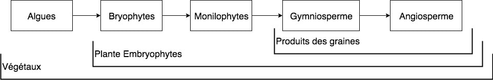
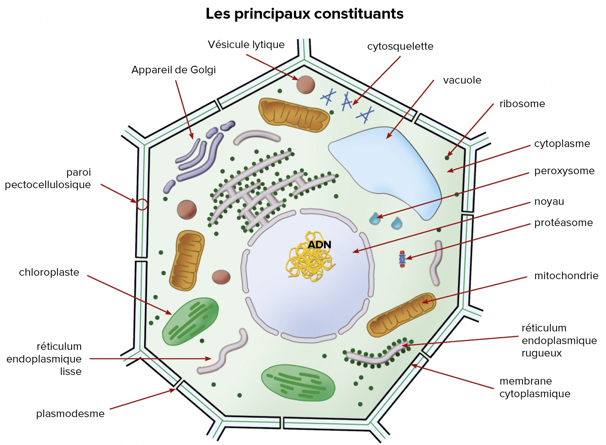
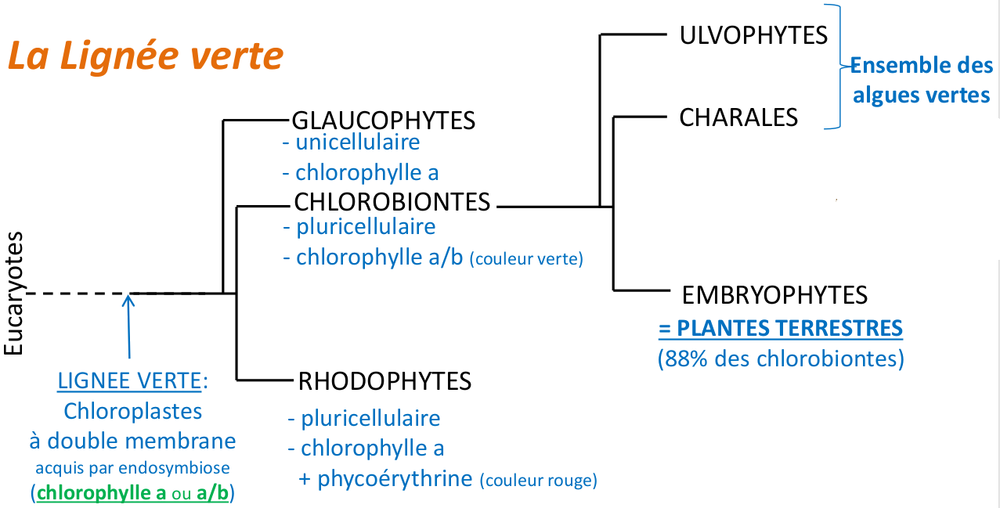
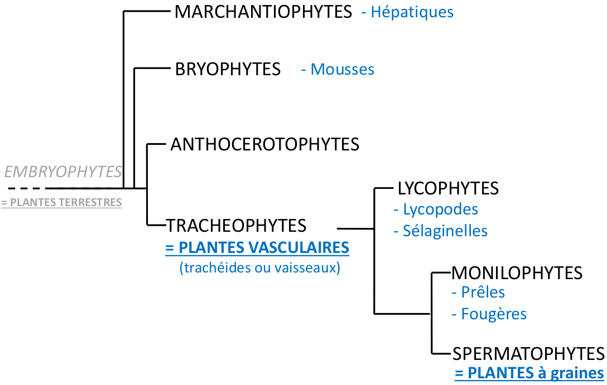
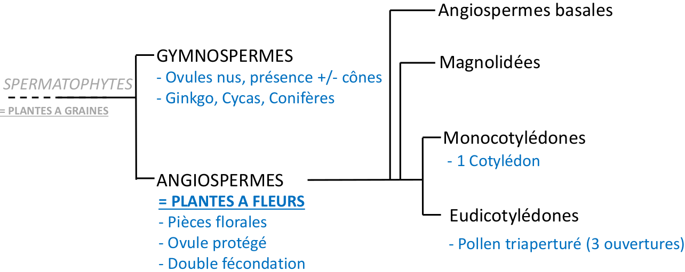
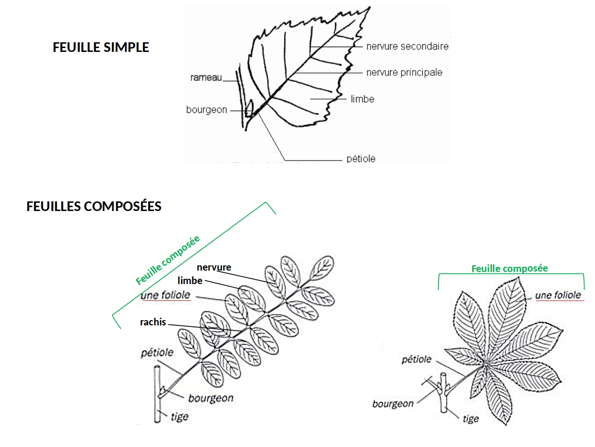

# Biodiversité Végétale

## Application de la biodiversité végétal

La biodiversité végétale permet notamment de comprendre le fonctionnement et l'évolution des plantes, les protéger lors de construction, pour les utilisée dans le système économique et social, et de comprendre les différent services systémique.

Biochimie moléculaire, Physiologie Végétale, Pathologie Végétale, **Histologie végétale, Morphologie végétale, Taxinomie et Systématique \(Classement des végétaux\)**, _\*\*_biogéographie végétale.

## Définitions

Le terme **végétal** est bien **différents** du terme **plante**.


**Végétal :** Être vivant **eucaryote pluricellulaire**, généralement **autotrophe au carbone** \(présence de **chloroplastes**\) dont les cellules sont entourées par une paroi et qui possède un **thalle** \(lame foliacée aplatie\) ou des **organes différenciés, cormus** \(racine, tige, feuille\).  
**Remarque :** Les champignons et Mycètes ne sont plus considéré comme des végétaux et les algues pluricellulaire sont parfois rangé dans les protistes.  
**A savoir :** Embryophytes, Fabrique de l'amidon

**Embryophytes :** Aussi appelé Cormophytes, rassemblent ce qu'on appelle les plantes terrestres. \([Source](https://fr.wikipedia.org/wiki/Embryophyta)\)  
Elles forment un groupe monophylétique. Ce terme de plantes terrestres n'interdit pas que certaines d'entre elles se soient par la suite adaptées aux milieux aquatiques \(à la manière des cétacés chez les animaux\) ou que leur fécondation reste en milieu aquatique.  
Avec les algues vertes, ou chlorophytes lato sensu \(groupe paraphylétique\), elles constituent le règne des plantes vertes et le clade des chlorobiontes caractérisé par l'association des chlorophylles a et b et l'amidon stocké dans les plastes.  
Les embryophytes sont définies par la présence d'un embryon végétal.

**Cormophytes :** Ensemble des plantes dont l'appareil végétatif est un cormus.

**Chloroplaste :** La chloroplaste est **l'organite** responsable de la **photosynthèse**.

**Photosynthèse** : Fabrication de matière organique à partir de matière minérale \( $$CO_2,H_2O, etc$$ \) et d'énergie lumineuse qui se déroule chez les végétaux chlorophylliens.

**Matière minérale :** Ensemble des molécules qui **ne contiennent pas** de **carbone réduit**.

* La matière minérale comprend les différentes formes de carbone oxydés comme le dioxyde de carbone et le monoxyde de carbone, les sulfates, les nitrates, les phosphates, les nitrites, l'ammonium, l'eau ....

**Matière organique :** Molécule fabriquée par les **êtres vivants** à **partir** de **carbone réduit**, d'hydrogène, d'oxygène, d'azote, de soufre et de phosphore.

**Carbone réduit :** Atome de carbone dont **au moins un des quatre** électrons célibataires de la couche externe participe à **une liaison**, le plus souvent avec un atome d'**hydrogènes**.

**Autotrophe :** Propriété d'un être vivant qui consiste à fabriquer de la matière organique à partir de matière minéral et d'énergie.  
**-**Si l'énergie est la lumière, la cellule est phototrophe / Si elle est d'origine chimique, la cellule est chimiotrophe.

**Autotrophe au carbone :** Capacité d'un être vivant qui synthétise sa propre matière organique à partir de matière minéral \( $$CO_2$$ \) et d'énergie.

**Thalle :** **Appareil végétatif** des "végétaux primitifs : **thallophytes**" constitué de cellules isolées \(Algue unicellulaire, levures\), de filaments ramifiés \(mycélium des mycètes\) ou d'un tissu parenchymateux lamellaire \(algues\) par opposition à l'appareil végétatif présentant des feuilles, tiges, et des racines.

**Appareil végétatif :** Ensemble des organes d'une plante \(**thalle** chez les thallophytes, **cormus** chez les cormophytes : racine, tige, feuille\) qui assurent sa croissance.

**Lamelle moyenne :** Couche composée principalement de **pectine** située **entre les deux parois** de cellules **végétales** adjacentes


## Grand groupe des végétaux

1. Algues
2. Bryophytes \(Mousses\)
3. Monophysites \(Fougères, Prêles\)
4. Gymnosperme \(Pin, Sapin\)
5. Angiosperme \(Plantes à fleurs\)


Le groupe des angiosperme est le dernier à être arriver sur terre est donc **le plus complexe**, de ce fait il s'est mieux **adapté à son environnement**, les angiospermes représentent environ **95%** des végétaux terrestre.


## Qu'est ce qu'un végétal ?

### Construction des cellules végétales


Les parties importante d'une cellule végétales sont le noyaux et les organites listées ci-dessous

* **Noyaux** \(Entouré d'une enveloppe nucléaire\)
* **Cytoplasme** \(Contient de l'eau et des ions\)
* **Membrane plasmique** \(Délimite le cytoplasme\)
* **Mitochondrie** \(Respiration, produit du $$H_2O_2$$ toxique pour la plante\)
* **Réticulum endoplasmique** \(Produit des lipide et protéine\)
* **Appareil de Golgi** \(Réservoir de protéine\)
* **Péroxysome** \(Dégrade le $$H_2O_2$$ en $$H_2O$$ et $$O_2$$ \)
* **Ribosome** \(Fabrique des protéine\)
* **Vacuole** délimité par une membrane, le **Tonoplaste**
* **Lamelle moyenne** est le **ciment** entre les **cellules végétales**


#### Cellule végétale en cours

#### Cellule végétale

### Caractéristiques principales d'un végétal


* **Cellule Eucaryote**
* **Photosynthèse oxygénique**
* **Autotrophe** pour le **carbone**
* Métabolisme secondaires
* **Paroi, Plaste, Vacuole** au niveau de la cellule végétale.
* La taille des cellules allant de $$30\mu m \ à \ 120\mu m$$ 


### Comment fonctionne la photosynthèse

Les chlorophylles dans les chloroplastes permettent la photosynthèse grâce à l’énergie solaire.

### Métabolite secondaire

En plus des **métabolites primaires** \(ADN, ARN, lipide, glucides etc etc\) les végétaux peuvent produire des métabolites secondaire pour se **protéger** \(Odeur, Gout\) ou pour la **dissémination des graines** et du pollen \(Couleur\)

### Les différentes fonctions des plastes

Une cellules végétales peut avoir plusieurs plastes différentes


**Chloroplaste :** Permet la photosynthèse, Synthèse acide gras, fixation carbone, azote et souffre  
**Chromoplaste :** Permet l'attraction des pollinisateurs et dissémilateurs de graine grâce au changement de couleur  
**Amyloplastes :** Sert de réserve et de géo-perception \(Permet au racine de pousser vers le bas\)


### La vacuole

La vacuoles est délimitée par un **tonoplaste**. La vacuole à plusieurs rôle au sein de la cellule


* Stockage d'eau et de nutriments de manière transitoire
* Croissance
* Soutient \(par pression et turgescence\)
* Élimination des déchets et éléments toxiques de la plante
* Défense et attraction avec la production de pigments, tanin et autre molécules


### Parois


#### Définition

Matrice extracellulaire entourant la **membrane plasmique** des cellules des **végétaux** **chlorophylliens**.  
La paroi primaire, caractéristique des cellules jeunes, est constitué par des micro fibrilles de cellulose \(25 à 30%\) disposées dans tous les sens, ce qui lui permet d'être extensible, de pectines \(jusqu’à 35%\), d'hémicellulose \(15 à 25%\) et de glycoprotéines \(5 à 10%\). Son épaisseur est de 1 et 3 µm. La **paroi secondaire** se forme au cours de la différenciation de la cellule, elle est plus épaisse, moins hydratée, contient une proposition plus importante de cellulose mais pas de pectine. Elle se situe **sous la paroi primaire**



La **paroi primaire** assure un rôle de régulation de la **croissance cellulaire**


Il existe deux types de parois pour les cellules végétales, paroi primaire et secondaire.  
La communication entre les cellules se fait par les petites perforations au niveaux des parois qu'on appelle **plasmodesme,** qui permet de communiquer de **cytoplasme** d'une cellule à une autre, si il y a un groupe de plasmodesme alors on est en présence d'une **ponctuation.**


**Symplasme :** Ensemble des **cytoplasmes** communiquant par le biais de **plasmodesmes**

**Apoplasme :** Ensemble des parois des cellules et des espaces de vide \(Cellules mortes + parois\)


La paroi primaire contient différents éléments important utiles pour la plantes

* Eau à 60 - 70%
* Micro-fibrilles de cellulose
* Hémicellulose
* Pectines
* Protéines
* Enzymes
* Calcium \(0.5% - 1%\)

La paroi secondaire sert notamment de soutient pour le végétal, majoritairement constitué de cellulose et d'eau, elle se dépose ultérieurement sur la paroi primaire, elle est toujours constitué de 3 couches.

Les parois des cellules végétales ont différentes spécialisation, mais ne sont pas obligatoirement présente sous cette forme.  
**Lignification :** Incrustation **lignine** \(Hydrophobe, insoluble\), cela entraîne la **mort de la cellule**, \*\*Tissus type Xylène et Sclérenchyme

Subérification : **Incrustation subérine \(lipide\), forme le** suber\*\* \(Liège, écorce\)

**Cutinisation :** Dépôt de cires \(Epiderme\)

### Pour conclure

Les végétaux comprend **toutes les algues**, qui produisent de la **chlorophylle a , a/b, a/c** et divers pigments ainsi que que les plantes **embryophytes**, qui produisent de la **chlorophylle a/b**.  
En L1 c'est la **lignée verte** qui nous intéresse, donc **une partie des algues** et tous les **embryophytes**

## La lignée verte, les grands groupes des végétaux

### Arbre phylogénique des différents groupe de la lignée verte

## Focus sur les angiosperme

### Feuille


#### **Définition**

**Feuille :** Organe aplati, généralement de couleur verte, qui assure l'essentiel de la photosynthèse et les échange d'eau et de gaz avec l'atmosphère.

**Limbe :** Partie élargie et aplatie de la feuille qui assure la photosynthèse.

**Marge :** La marge est le contour du limbe.

**Nervure :** Ligne saillante formée par les faisceaux conducteurs de la feuille.

**Pétiole :** Structure de petite dimension, à symétrie bilatérale, **reliant le limbe** de la feuille à la **tige** qui convient les **vaisseaux conducteurs de sève.**

**Bourgeon :** Structure constituée par de très jeunes feuilles \(Bourgeon foliaire\) ou de très jeunes fleurs \(Bourgeon florale\) situé sur un axe relativement court, terminé par un méristème apical caulinaire, et protégé par des feuilles modifiées, les écailles.  
**Le bourgeon ne fais pas partie de la feuille !**

**Tige :** Organe généralement aérien, plus ou moins dressé et ramifié, sur lequel se développent des bourgeons qui se différencient soit en feuilles, soit en fleurs, soit en axes secondaires \(rameaux\) qui, à leur tour, portent des feuilles ou des fleurs.



Une feuille simple est bien différente qu'une feuille composée.  
Pour trouver une feuille il faut situer ou est le bourgeon, qui est la "Base" de cette dernière.


* Marge du limbe : Entière / Dentée / Lobée
* Nervure : Pénée / Palmée / Parallèle.


Le **bourgeon** ne fais pas partie de la **Feuille**


## Ressources



* [Nowatera](http://www.nowatera.be/)
* [Dictionaire de SVT par Michel Breuil](https://www.decitre.fr/livres/dictionnaire-de-svt-9782091520155.html)
* [Wikipédia](https://fr.wikipedia.org/wiki/Portail:Botanique)



* [Biologie de Neil Campbell](https://www.decitre.fr/livres/biologie-9782761350655.html)
* [Classification du viant de Guillaume Lecointre Tome 1](https://www.decitre.fr/livres/classification-phylogenetique-du-vivant-9782701182940.html)
* [Classification du viant de Guillaume Lecointre Tome 2](https://www.decitre.fr/livres/classification-phylogenetique-du-vivant-9782410003857.html)
* [L'origine des espèces Charles Darwin](https://www.decitre.fr/livres/l-origine-des-especes-9782081221079.html)



