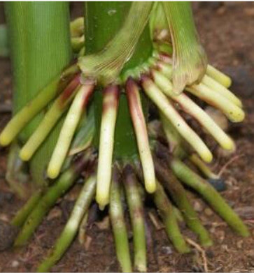

# Biodiversité Végétale

La biodiversité végétale permet notamment de comprendre le fonctionnement et l'évolution des plantes, les protéger lors de construction, pour les utilisée dans le système économique et social, et de comprendre les différent services systémique.

Biochimie moléculaire, Physiologie Végétale, Pathologie Végétale, **Histologie végétale, Morphologie végétale, Taxinomie et Systématique \(Classement des végétaux\)**

## Qu’est ce qu’un végétal

**Un végétal c'est toutes les algues et les plantes \(Embryophytes\), il y a environs 298 000 espèces.**


* Cellules eucaryotes
* Autotrophe pour le carbone
* Photosynthèse **oxygénique**
* Production de métabolites secondaires
* Cellules avec **paroi, vacuole et plastes**


### Caractéristique principales des végétaux

**Photosynthèse**

Les chlorophylles dans les chloroplastes permettent la photosynthèse grâce à l’énergie solaire.

**Métabolites secondaires**


En plus des métabolites primaires \(ADN, ARN, lipide, glucides etc etc\) les végétaux peuvent produire des métabolites secondaire pour se protéger \(Odeur, Gout\) ou pour la dissémination des graines et du pollen \(Couleur\)


### Cellule végétales

Les cellules végétales sont **eucaryotes**, d'une taille d'environ **100μm**.


* **Noyaux** \(Entouré d'une enveloppe nucléaire\)
* **Cytoplasme** \(Contient de l'eau et des ions\)
* **Membrane plasmique** \(Délimite le cytoplasme\)
* **Mitochondrie** \(Respiration, produit du $$H_2O_2$$ toxique pour la plante\)
* **Réticulum endoplasmique** \(Produit des lipide et protéine\)
* **Appareil de Golgi** \(Réservoir de protéine\)
* **Péroxysome** \(Dégrade le $$H_2O_2$$ en $$H_2O$$ et $$O_2$$ \)
* **Ribosome** \(Fabrique des protéine\)
* **Vacuole** délimité par une membrane, le **Tonoplaste**


**Vacuole**


La vacuole est délimitée par le **tonoplaste** et éffectue différent rôle

* Stockage eau et nutriments \(transitoire\)
* Croissance \(par stockage eau\)
* Soutien \(par pression et turgescence\)
* Elimination \(déchets, éléments toxiques pour cellule\)
* Défense, attraction \(petites molécules, types pigments, tanins\)


**Parois**


La paroi primaire d'une cellule est composée à **70% d'eau**, de **microfibrilles de cellulose**, **d'hémicellulose**, **pectines**, **protéines** et **enzymes**.

Certaines cellules on la possibilité d'avoir deux parois. La paroi secondaire se situes sous la paroi primaire, et ont des **fibres de celluloses orientées.**

**Lamelle moyenne** est le **ciment** entre les cellules végétales. La circulation des substances entre les cellules par **voie symplastique** ou **voie apoplastique**



Les parois peuvent avoir des spécialisation

* Lignification, Incrustation lignine \(hydrophobe, insoluble\)
  * Mort cellulaire
  * Tissus type Xylème et Sclérenchyme
* Subérification, Incrustation de subérine \(lipide\)
  * Suber \(liège, écorce\)
* Cutinisation, Dépôts de cires
  * Epiderme

Et assurent différents rôle

* Définition et maintien de la forme \(port érigé, forme cellules\)
* Croissance contrôlée \(élasticité des parois primaires\)
* Maintien intégrité cellulaire \(importance de la pression de turgescence sur la paroi\)
* Barrière protectrice
* Défense \(imprégnations substances chimiques de type lignine, cutine...\)
* Soutien / Rigidité \(paroi + lignification : cellule très rigide = tissu de soutien\)


**Plastes**


* Chloroplastes
  * Photosynthèse
  * Synthèse acides gras
  * Métabolisme : \(fixation carbone, azote, souffre\)
* Amyloplastes
  * Réserve
  * Géoperception
* Chromoplastes
  * Attraction de pollinisateurs et disséminateurs


### Explication de l'apparition de végétaux terrestre

#### Besoin des organisme végétaux


Tous végétaux à besoin de ressources pour se développer. Lumière, Eau, Dioxyde de carbone, Dioxygène et des éléments minéraux \(N, P, K, Fe, Mg, Mn, Ca\)


#### Dans les milieux aquatiques


Qualification d'une plante aquatique

* L'eau n'est pas limitante
* Gaz et éléments minéraux accessibles \(Dissous dans l'eau\)
* Il n'y à pas de gravité \(Economie de ressource\)
* La lumière se réverbère sur la surface de l'eau
* Inertie thermique
* L'eau est un vecteur de dissimulation


#### Dans les milieux terrestres

Lorsque le végétal est en milieu terrestre il subis différente contrainte qui n'existait pas dans le milieu aquatique

#### Contrainte


* Lumière pouvant être limitante \(Sous couvert végétal\)
* Eau pouvant être limitante
* Gaz présent dans l'air
* Limitation des minéraux dans le sol
* Influence de la gravité
* Variation climatique
* Dessèchement lié à l'air


#### Solution

Pour se faire les plantes se sont adapté et ont crée des système qui répondent à ces problématiques


* Mobiliser l'eau du sol et les élément minéraux
* Agir contre la gravité
* Capter les gaz dans l'air ambiant
* Se protéger des pertes en eau
* Mettre en place des lieux de stockage pour résister au variation climatique
* être compétitif pour intercepter la lumière et occuper l'espace


## Arbre phylogénétique des végétaux


1. Algues
2. Bryophytes \(Mousses\)
3. Monophysites \(Fougères, Prêles\)
4. Gymnosperme \(Pin, Sapin\)
5. Angiosperme \(Plantes à fleurs\)

   Le groupe des angiosperme est le dernier à être arriver sur terre est donc **le plus complexe**, de ce fait il s'est mieux **adapté à son environnement**, les angiospermes représentent environ **95%** des végétaux terrestre.


### Lignée Verte


La lignée verte est une partie des algues \(Produise de la chlorophylle a ou a/b\) et l’ensemble des plantes \(Embryophytes\)


### Embryophyte

### Trachéophyte

### Focus Gymnosperme

#### Synapormophie

### Focus Angiosperme

#### 

#### Monocotylédone

#### Dicotylédone

## Plan organisation Histologique

### Méristème


**Méristème :** ensemble de cellules ayant gardé des propriétés embryonnaires et capables de se diviser, les méristèmes assurent l'**histogenèse**



La plante assure la croissance via le fonctionnement des méristèmes primaires.La production de nouvelles cellules et tissus se faire par les méristèmes en plusieurs étapes 

1. Production de cellules au niveau des méristèmes par division \(mitoses\)
2. Croissance cellulaire, la cellule grandit, par synthèse et étirement de paroi \(élastique\) il y a formation du tissu embryonnaire \(Parenchyme fondamentale\)
3. Différenciation cellulaire ou différenciation des tissus


#### Méristèmes primaires


Les méristèmes primaires se situent au apex de la plante, **méristème caulinaire et racinaire**, il assurent l'**organogenèse** avec la création des tissus primaires.


#### Méristèmes secondaires


Les méristèmes secondaires sont une assise génératrice issue du méristème primaire, responsable de la croissance en épaisseur par la mise en place de tissus secondaires \(méristème histogène\). Il existe 2 types de méristèmes secondaires

* Cambium = assise génératrice libéro-ligneuse \(=&gt; tissus secondaires de conduction\)
* Phellogène = assise génératrice subéro-phellodermique \(=&gt; tissus secondaires de revêtement\)

  **Les méristèmes secondaires ne sont pas présents chez toutes les plantes**

* Très importance chez les plantes dites ligneuses \(buisson bas, buisson, arbuste, arbre\)
* Plus restreinte chez les plantes herbacées \(herbes autres que Monocotylédones\)


### Tissus Primaire

Les tissus primaires sont issus du fonctionnement des méristèmes primaires et les cellules sont désorganisées.

#### Parenchyme fondamentale


Aussi appelé tissus embryonnaire

* Cellules vivantes
* Paroi primaire pectocellulosique mince \(pas de paroi secondaire\)
* Noyau volumineux
* Vacuoles petites et nombreuses
* Forme isodiamétrique \(approximativement sphérique\)
* Parfois avec méats
* Plastes indifférenciés
* Mitochondries nombreuses
* Tissu sans fonction métabolique précise \(totipotence des cellules\)


#### Revêtement


* Epiderme
  * Tissu de recouvrement/protection des tiges et feuilles
  * Une seule couche de cellules \(assise\)
  * Composé de plusieurs types cellulaires \(c.épidermiques, c.stomatiques, poils épidermiques\)
  * Recouvert d’une cuticule
* Rhizoderme
  * Tissu de recouvrement/protection des jeunes racines
* Zone subéreuse
  * Présent chez les racines plus vielles qui perdent le rhizoderme


#### Tissus fondamentaux

#### Parenchymes


Le parenchyme assure les fonction dans le métabolisme de la plante

* Photosynthèse =&gt; Chlorenchyme
* Stockage de réserves =&gt; Amylenchyme
* Circulation des gaz =&gt; Aérenchyme 
* Stockage de l’eau =&gt; Hydrenchyme
* Parenchyme cortical \(Situé sous l'épiderme\)


#### Tissus de soutien


Il y a deux tissus de soutien primaires, le **collenchyme** et **sclérenchyme**, ils assurent la rigidité grâce au parois épaissie des cellules. Situés principalement dans les **tiges** et les **feuilles**


#### Collenchyme


* Paroi **primaire pectocellulosique épaissie**
* **Pas de paroi secondaire**
* Cellules **vivantes**
* Il est **localisé** en **surface** des **organes**
* Espèces végétale **herbacées** et **jeunes ligneuse**
* Il existe **3 types** de collenchyme
  * Rond ou Annulaire
  * Angulaire
  * Lamellaire ou tangentiel


#### Sclérenchyme


* Paroi **primaire** et paroi **secondaire** lignifiées
* **Cellules mortes**
* Est composé de plusieurs types cellulaire


#### Endoderme et pericycle

Tissus présents dans la racine, ils se situent à la limite du cylindre centrale et de l'écorce

#### Péricycle


* Tissus **vivant, petite cellules peu différenciées**
* Une **seule couche** de cellules
* Couche la **plus externe du cylindre centrale**
* **Rôle** dans la **ramification** des **racines**


#### Endoderme


* Tissus **vivant**, paroi partiellement **lignifiées** ou **subérifiées**
* Couche la plus **interne** de la **zone** **corticale**
* Rôle dans **l'absorption** =&gt; filtre


#### Tissus sécréteurs

Il y a une grande variété de substance produites par

* Des cellules isolées
* L'épidermes ou des poils sécréteurs
* Poche / Canaux sécréteurs

  Les tissus sécréteurs permettent plusieurs fonction pour les plantes


* Communication avec d'autre plantes \(Molécule odorante, attirer et séduire les pollinisateurs\)
* Repousser les herbivores


#### Tissus de conductions primaire

Les tissus de conduction primaires assurent la conduction de sèves chez les trachéophytes et sont formés par le procambium. L'ensemble xylème et phloème primaire se nomme faisceaux libéro-ligneux


* Xylème transporte sève brut
* Phloème transporte sève élaborée


#### Xylème primaire


Présent dans la feuille, la tige et la racine, il assure 3 fonction

* Conduction de **sève brut**
  * Fabrication de vaisseaux tout au long de la croissance de la plante =&gt; plus les vaisseaux sont formés tard plus les vaisseaux sont lignifiés
* Soutien
  * Cellules mortes
  * Paroi épaissie \(Paroi primaire et secondaire\)
  * Peu ou pas de ponctuation, lumiière de la cellule étroite
* Réserve et metabolisme
  * Parenchyme **xymélien** \(ou **ligneux**\)
  * Cellules vivantes, parois primaire cellulosiques ou lignifiées
  * Stockage eau, amidon



Durant la fabrication du xylème il y a création de proto et métaxylème

* Protoxylème : Vaisseaux imparfaits \(Crée en premier\)
  * Cellules s’allongent encore.
  * Parois transversales présentes entre les éléments de vaisseaux =&gt; Vaisseaux annelés, spiralés.
* Métaxylème : Vaisseaux parfaits \(Crée en dernier\)
  * Cellules ne s’allongent plus.
  * Les vaisseaux sont constitués d’éléments de vaisseaux sans paroi transversale =&gt; Vaisseaux rayés, réticulés, ponctués

    Le sens Sens de différenciation des vaisseaux du xylème primaire permet de faire la

    distinction au niveau histologique entre tige et racine, différenciation centrifuge pour la tige et centripète pour les racines


#### Phloème primaire


Présent dans la feuille, la tige et la racine, il assure 3 fonction

* Conduction de **sève élaborée** grâce au tube criblé
* Soutien
* Réserve

  Il est constitué

* Tube criblé
* Cellules compagne
  * collée contre tube criblé -&gt; Maintien en vie l’élément de tube criblé
* Parenchyme libérien \(Parenchyme phloèmien\)
  * Cellules vivantes, allongées, à parois cellulosiques.
  * Stockage, sécrétion

    **Phloème primaire est un tissu complexe composé de plusieurs types cellulaires.**
* Tissu complexe à cellules vivantes et à parois cellulosiques
* Allongement possible des cellules
* toujours à différenciation centripète


### Tissus Secondaire

#### Tissus secondaires de conduction


Les tissus secondaires de conduction sont produits par le **cambium**, situés au niveaux des racines et des tiges. Le fonctionnement du cambium est rythmique.

* Xylème secondaire
* Phloème secondaire

  C'est grâce à la division périclines du cambium qu'il y a production de nouvelles cellules

* Vers l’extérieur formation du phloème secondaire \(= liber\)
* Vers l’intérieur formation du xylème secondaire \(= bois\)


#### Xylème secondaire


* Produit de façon interne
* Contient uniquement des vaisseaux parfait \(métaxylème\)
* Fibre
* Parenchyme


#### Phloème secondaire


* Produit de façon externe
* Même types cellulaire que le phloème primaire
  * Élément tube criblé
  * Cellule compagne
  * Parenchymes phloèmien
  * Fibres phloèmiennes


#### Pachyte


L'ensemble xylème secondaire et phloème secondaire se nomme **pachyte**, et peut exister de manière continu ou discontinu


#### Tissus de revêtement


La croissance importante en épaisseur liée au fonctionnement du cambium conduit au déchirement des tissus primaires de revêtement, la plante dois donc en créer de nouveau avec des tissus de revêtement secondaire pour protéger les organes \(Tiges, Racine\), au niveau de certaines plantes \(ligneuses\) via le phellogène grâce à la division périclines du phellogène permettant la production de nouvelles cellules

* Formation de suber \(ou liège\) vers l’extérieur
  * Le suber \(cellules mortes à paroi subérifiée + cire\) est imperméable à l’eau et aux gaz
  * Cependant possibilité de zone ou le suber est désorganiser pour permettre les échanges gazeux, se sont les **lenticelles**
* Formation de phelloderme vers l’intérieur


### Récapitulatif

## Plan organisation Morphologique

### Graine

Le point de départ des angiosperme est la graine, formée de différentes parties

### Jeune Pousse

### Bourgeon

### Tige


Organe végétatif à symétrie radiale qui porte généralement des feuilles et des bourgeons. Généralement aérienne et à croissance verticale. Phototropisme positif et géotropisme négatif, la tige permet le soutient de la plante et la circulation de la sève entre les feuilles et les racines


#### Origine de la tige


La tige provient du groupe gemmule et tigelles, elle est rattaché à la racine par le collet, la tige porte les cotylédons, feuilles et le bourgeon terminal \(Apical\). Les tiges sont un empilement de phytomères.


#### Diversité des tiges


* Tiges aériennes 
  * orthotropes, dressées et autoporteuses
  * orthotropes, dressées et non-autoporteuses
  * Plagiotropes
    * Stolon \(Fraisier\)
  * Réduite \(Port en rosette, pissenlit, Grassette\)
* Tiges souterraines
  * Á croissance horizontale \(plagiotrope\) \(Rhizome -&gt; iris, Tubercule -&gt; pomme de terre\)
  * A croissance verticale \(Orthotrope\) \(Bulbe -&gt; oignon, Corme -&gt; Crocus\)


#### Croissance de la tige


La croissance de la tige s'effectue par la croissance du bourgeon apical \(Terminal\), chez les plantes ligneuse le bourgeon est protégé par des écailles, chez une plante herbacé il n'est pas protégé.


#### Organisation de l'apex caulinaire

#### Fonctionnement de l'apex caulinaire

#### Plante ligneuse


Pour les plantes ligneuse la croissance se passe en deux étapes

* Mise en place des phytomères -&gt; Organogenèse \(!! origine superficielle = exogène des feuilles et des bourgeons\)
* Accroissement des cellules du phytomère : Elongation

Fonctionnement rythmé, moment de repos du méristème.


#### Plante Herbacé


**Organogenèse** et **elongation** **simultanées**


#### Structure de la tige


Tissus primaires

* De revêtement
  * Epiderme
* Fondamentaux
  * Parenchyme cortical
  * Collenchyme et Sclérenchyme
* De conduction
  * Xylème primaire \(Avec Proto et Métaxylème\)
  * Phloème primaire



Et pour distinguer une racine ?

* Symétrie radiale
* Xylème primaire superposé au phloème primaire
* Vaisseaux du xylème primaire avec un sens de différenciation centrifuge
* Cylindre centrale plus développer que l'écorce
* Présence de tissus de soutien \(Collenchyme et Sclérenchyme\)


#### Tissus secondaire

Chez certains végétaux il y a production de tissus secondaire et de croissance en épaisseur de la tige \([Voir ici](https://kevinrousseau80.gitbook.io/licence-svt/biodiversite/biodiversite-vegetale#racine)\). Uniquement chez certaines plantes


Production de tissus **secondaire** de **conduction** via le **cambium**, le **phloème** **secondaire** et **xylème** **secondaire**. Et production de tissus **secondaire** de **revêtement** via le **phellogène**, le **suber** et **phelloderme** \([voir ici](https://kevinrousseau80.gitbook.io/licence-svt/biodiversite/biodiversite-vegetale#phellogene-mise-en-place-de-tissus-secondaire-de-revetement)\)


#### Structure histologique

#### Architecture et développement


Croissance rythmique = arrêts de croissance et présence d’unités de croissance

Croissance continue = pas d’arrêts de croissance



* Développement **monopodial**
  * L’axe 1 poursuit son fonctionnement végétatif
  * Croissance via le bourgeon terminal
* Développement **sympodial**
  * L’axe 1 ne poursuit pas son fonctionnement végétatif \(méristème se transforme et/ou meurt\)
  * Croissance via des bourgeons axillaires


#### Différenciation rameaux

### Racine

Le système racinaire d'une végétale angiosperme est bien différents selon les espèces et assure des rôle plus ou moins différents.


* Volume racinaire très variable selon les espèces
* Racine généralement souterraine \(sauf exception\)
* Phototropisme négatif ⬇
* Géotropisme positif ⬇

  Différent rôle

* Ancrage
* Stockage de réserve
* Acquisition de ressource du sol
* Multiplication végétative \(Assure la reproduction de la plante de manière asexuée\)


#### Origine et diversité des racines


La **racine « vraie »** dérive de la **radicule** elle est rattachée à la tige au **collet** et peut se ramifier.

Il existe aussi des **racines "adventives"** racines formées sur d’autres organes \(tige, feuille\), ne dérivant pas de la radicule. Le **développement** **possible** de racines **adventives** à partir de **n’importe quel organe** permet la **multiplication** **végétative** des **individus**.


#### Morphologie des racines


Les racines se diversifies en trois grands type :

* Pivotant
* Fasciculé
* Mixte


#### Croissance de la racine


La croissance de la racine se fait par un **méristème primaire**, le **méristème racinaires** \(apical\), et est protégé par la **coiffe**. La coiffe crée ses cellules suite au détachement de cellules \(cellule desquamantes\)  
Le géotropisme des racines est induits par la coiffe, la perception de la gravité repose sur les statolithes présent dans la coiffe


 

La croissance se fait en 3 étapes

1. Production de cellules \(M\)
2. Elongation / croissance cellulaire
3. Différenciation cellulaire /maturation

#### Structure de la racine

#### Structure morphologique


Pour rappel il existe trois grand type de morphologies, pivotant, mixte et fasciculé.

* Partie plus âgée
  * Rhizoderme a desquamé
  * Racine protégée par la zone subéreuse / subéroïde
* Absorption : grande surface de contact avec le sol \(poils unicellulaires potentiellement ramifiés\)
* Zone glabre : Rhizoderme non encore différencié
* Coiffe : manchon de cellules facilitant la pénétration \(+ zone méristématique\) Racine principale de la racine dans le sol. Cellules se multiplient vite pour se renouveler



Chez certaines racines âgées \(**plantes** **ligneuses**\) protection assurée par suber \(**protection** **secondaire**\)


#### Structure histologique


#### Tissus primaires

* Revêtement
  * **Rhizoderme** \(cellules rhizodermiques + poils absorbants\)
  * **Zone subéreuse ou subéroïde** : \(racines plus âgées\) cellules de parenchyme imprégnées de subérine
* Fondamentaux
  * **Parenchyme** \(= **amylenchyme**\) **cortical** : stockage.
  * **Endoderme** : couche interne de la zone corticale. Rôle de filtre dans l’absorption des éléments minéraux.
  * **Péricycle** : couche la plus externe du cylindre central . Rôle dans la ramification de la racine
* Conduction
  * **Xylème** **primaire** \(présence proto- et métaxylème\)
  * **Phloème** **primaire**



#### Pour distinguer une racine ?

1. Symétrie radiale
2. Alternance du phloème primaire et du xylème primaire
3. Différenciation centripète du xylème primaire


#### Tissus secondaires

Chez certains végétaux il y a production de tissus secondaire et de croissance en épaisseur de la racine \([Voir ici](https://kevinrousseau80.gitbook.io/licence-svt/biodiversite/biodiversite-vegetale#racine)\). Uniquement chez certaines plantes


Production de tissus **secondaire** de **conduction** via le **cambium**, le **phloème** **secondaire** et **xylème** **secondaire**. Et production de tissus **secondaire** de **revêtement** via le **phellogène**, le **suber** et **phelloderme** \([voir ici](https://kevinrousseau80.gitbook.io/licence-svt/biodiversite/biodiversite-vegetale#phellogene-mise-en-place-de-tissus-secondaire-de-revetement)\)


#### Ramification de la racine


* Se fait à partir du péricycle
* Origine profonde \(endogène\) de la ramification racinaire


#### Symbiose racinaire


**Symbiose mycorhizienne** la plus répandue à l’échelle planétaire \(80% des espèces végétales\)

Il existe différents types de symbiose mycorhizienne en fonction de la position du champignon par rapport aux racines :

* Ectomycorhizes \(sur la racine\)
* Endomycorhizes \(dans la racine\)

Echanges de ressources entre les partenaires :

* Absorption de l’eau et des éléments minéraux du sol facilitée par la présence de mycorhizes autour des racines \(peuvent assurer jusqu’à 70% des besoins nutritifs de la plante\)
* En contrepartie, la plante assure la nutrition carbonée de son partenaire mycorhizien


### Feuille


#### **Définition**

**Feuille :** Organe aplati, généralement de couleur verte, qui assure l'essentiel de la photosynthèse et les échange d'eau et de gaz avec l'atmosphère.

**Limbe :** Partie élargie et aplatie de la feuille qui assure la photosynthèse.

**Marge :** La marge est le contour du limbe.

**Nervure :** Ligne saillante formée par les faisceaux conducteurs de la feuille.

**Pétiole :** Structure de petite dimension, à symétrie bilatérale, **reliant le limbe** de la feuille à la **tige** qui convient les **vaisseaux conducteurs de sève.**

**Bourgeon :** Structure constituée par de très jeunes feuilles \(Bourgeon foliaire\) ou de très jeunes fleurs \(Bourgeon florale\) situé sur un axe relativement court, terminé par un méristème apical caulinaire, et protégé par des feuilles modifiées, les écailles.  
**Le bourgeon ne fais pas partie de la feuille !**

**Tige :** Organe généralement aérien, plus ou moins dressé et ramifié, sur lequel se développent des bourgeons qui se différencient soit en feuilles, soit en fleurs, soit en axes secondaires \(rameaux\) qui, à leur tour, portent des feuilles ou des fleurs.

**Foliole :** Division d'une feuille composée en unités élémentaires \(Contrairement au feuille, les folioles ne possèdent pas de bourgeons\)



Une feuille simple est bien différente qu'une feuille composée.  
Pour trouver une feuille il faut situer ou est le bourgeon, qui est la "Base" de cette dernière.



#### Nervation

* Marge du limbe
  * Entière
  * Dentée
  * Lobée
* Nervure
  * Pénée
  * Palmée
  * Parallèle



Le **bourgeon** ne fais pas partie de la **Feuille**


#### Phyllotaxie

Il existe 4 grandes phyllotaxie


* Alterne spiralée
* Alterne distique
* Opposée décussée
* Verticillée


## Adaptation aux condition environnemental

## Travaux pratique

### Reconnaître qu'elle tissus nous observons


1. Tissus simple ou complexe
2. Cellules alignées ou non alignées 
3. Forme des cellules
4. Couleur de la paroi
5. Paroi normal \(fine\) ou épaissie
6. Positionnement du tissu


### Utilisation de différents colorants

Lors des travaux pratiques pour découvrir les fondements des cellules, nous allons utilisées différents colorants

* Rose à rouge violacé : paroi pecto-cellulosique
* Vert à turquoise : paroi secondairement imprégnée de lignine
* Jaunâtre : composées lipidiques \(cutine, subérine\) de la cuticule, de la paroi subérifiée

### Aide au schéma

### Faisceaux libéraux ligneux

### Coupe transversale tige herbacé

### Correction CC

## Sortie Tête d'or

* Apparition des angiosperme il y a environs 100 millions d'années, eucalyptus 100 mètre de haut record..

#### Épiphyte

* Épiphyte tel que Zamia pseudoparasitica qui pousse sur les troncs d'arbres et s'ancre avec ses racines. NB : C'est la seule espèce de la division des Gymnospermes qui est épiphyte.
* Le guy n'est pas épiphyte mais hémiparasite car c'est une plante parasite qui n'a pas de racine

#### Monocotylédone

* Orchidée, environs 25000 espèces, terrestre ou épiphyte, limbe en gouttière pour ramener au racine l'eau, racine sans poils absorbant, plante adaptée à la sécheresse
  * Vanille forme liane, racine dans le sol, donc terrestre, grimpe pour accéder à la lumière, racine adventive sur les racine pour s'accrocher au support.
* Broméliacée, feuillage tire au blanc, feuille épaisse, plante adaptée à la sécheresse
* Tillandsia ou fille de l'air, famille de l'ananas. Épiphyte, pas de racine, poils morphologie parapluie, cellule qui se gorge d'eau, et de referme si trop chaud, sel minéraux par le vent. Multiplication végétative. \(Broméliacée\)
* L'agave, plante monocotylédone, fleur pointue appeler dent pour se défendre des animaux, présence de sclérenchyme dans les feuilles, parenchymes aquifère présent dans la tige, tige peu présent. Feuille blanchâtre grâce à la pruine. Création de la tequila grâce au parenchyme.
* Cactus, plante xérophyte, stockage des tiges, plante verticale pour réduire la perte d'eau, crête et creux alterner pour crée des zone d'ombre permet d'avoir plus de 50% de la surface à l'ombre, permet de choisir ou ouvrir les appareil somatique, une plante perd forcément de l'eau.
  * Figuier de barbari, forme de tige plate, permet d'augmenter la surface de photosynthèse, cladode. Feuille sont toutes les épines, pour la défense et ne perd plus d'eau.
* Palmier, stipe, racine adventive, pas de ramifications monocotyledone, rzdicule dégénère et autre système fait les racines, ps de tissus secondaire. Ensemble de faisceaux libéraux ligneux, tissus de soutient de type sclerznchyme et collenchyme. Très grande feuille et petiole.
* Pandanys, Angiosperme monocotyledone, feuille Allonger, sans petiole et base élargie. Feuille angenante, nervure primaire et secondaire dans la lonbgueur et impression de parallélisme. Peut se ramifier, racine en échasses, adventive. Sol instable. Système de compensation d'équilibre.
* Cocotier, stipe, feuille grande et gênante. Feuille de type pêne. Racine adventive
* Bananier, nervure parallèle, tige qui porte les fruits, tige visible est un ensemble de feuille petiole. Duplication végétative. Croissance annuel.
* Bambou, tissus lignée mais pas de type xyleme, sclerznchyme qui assure le soutient, tige creuse et cylindrique, deux type foliaire. Une sur la tige en protection pour le bourgeon et feuille issus du bourgeon tige plus feuille. Racine adventive plus Rhyzome

#### Dicotylédone

Euphorbe, tige parenchyme aquifère, aile pour faire de l'ombre, plus de feuille en haut de la plante, nervation plate. Présence temporaire des feuilles, quand suffisant d'eau, printemps et saison des pluie, boost la plante pour produire fleur et fruit, perte de feuille pour réduire perte en eau.

Baobab, adaptation à la sécheresse. Tronc très développer. Parenchyme aquifère dans le tronc très développer. Pas de feuille saison sèche.

Buli provient de la multiplication végétative, micro tige qui ensuite développe des racine adventive, puis des feuille et redonne une plante entière \(Kalanchoe\)

Plante cailloux litophe, deux tiges, parenchyme aquaiphere, devenir petit pour diminuer et jouer sur le rapport surface volume.

#### Plante carnivore

Toute angiosperme, la plus part dicotylédone mais quelques espèces monocotylédones, ce sont des plantes qui possède carence en nitrate et ion, et qui vivent généralement dans un environnement tourbière, très charger en matière organique, gorge d'eau et ph acide, qui n'est pas assimilable par une plante. Environnement sablonneux et environnement aquatique, oligotrophe. Passif mixte et actif, type de piège. Modification de foliere, lymbe ou ~~périple~~ ou les deux, Toute plante produise des fleurs, polyniser par des insecte. Qui ne sont pas attirer par les nectaire produit par les pièges. Grande distance piège et fleur

* Piège forme de cornée, sarracenie, développement d'une feuille, haut lymbe et basse le petiol, luminosite attire les insecte plus nectar, plus substance enivrante. Surface interne du corne ne permet pas de remonter, plus poils vers le bas, empêche le vol. Zbsorbtion de molécule protéines au niveau des feuilles.
* Drosera, piège mixte, petiole plus lymbe, limbe remplie de poils doter de goûté de sécrétion. Collante, lymbe fait un mouvement pour bloquer l'insecte.
* Dionee, piège actif piège en mâchoire, petiole plus lymbe. Lymbe forme le piège. Petiole plus epais, philode, pour la photosynthèse, charnière médiane, nervure médiane, mouvement rapide, au centième de seconde, fermeture en deux temps, première phase pas de orocution danzime, donc diminution des dépende inutiles. Face intérieur du lymbe, poils sensitive grave à l'urée dégager par l'animal en panique, production danzime deuxième phase du piège et fermé complètement le piège.
* Utriculaire plante aquatique carnivore, oligotrophe, grosse poche en dispositif de clape, n'importe quel arthropodes peut être capturer, utricule vide sans proie, lorsque rencontre des poils et d'un animal ouverture du pore et aspire, se remplis d'eau et referme le clamer sous la pression de l'eau. Ensuite l'eau va diminuer, plus prois grâce au poils et activé les znzime avec Zbsorbtion des feuilles.
* Plante liane, heliamphoras, pièges à l'extrémité de la feuille, piège en urne. Nepintgece, piège rempli de liquide,

#### Gymnosperme

Zamia, gymnosperme, différence au élément conducteur, pas de vaisseaux au niveau du xyleme, remplacer par les trachéide. Couleur blanche pruine, cuticule épaisse. Rigidités des élément pour éviter de bouger et diminuer la perte d'eau, orientation en v pour le soleil vers le haut, ombicuite

Sycas, gymnosperme, tissus secondaire, cone pour les mâle et feuille peut développer pour les femelles, Cycas, reoroduction en cone

#### Vie aquatique

* Fougère, plante aquatique, marsilea , stratégie, système racinaire au fond et feuille à la surface.
* Deuxième stratégie plante flottante, lymbe couvertes de poils et rend la surface hydrophobe, contribue à la flottaison de la plante
* Rhyzome avec racine adventive, petiole inséré de manière centrale, permet de mettre la plante en corner si monter des eaux, lymbe hydrophobe, lotus
* Plante helophyte, papyrus, parenchyme aeriphere dans la tige.
* Lentille d'eau, plante sans feuille, cladode, système de reproduction végétatif, une racine...
* Aune, hygrophyte

#### Trachéophyte

Cyatheaceae, une feuille, tronc se forme de la tige centrale et des petiole autour, stipe. Racine adventive.

Cyprès chauve, floride, plante marécageux. Sol anoxique, racine mes en place des pneumatpphore, pour assurer la respiration

#### Feuille

Feuille anastomose, recoupement des nervure primaire secondaire et tertiaire. Plus les faisceaux sont plus proche plus c'est efficaces.

## Définitions

Le terme **végétal** est bien **différents** du terme **plante**.


**Végétal :** Être vivant **eucaryote pluricellulaire**, généralement **autotrophe au carbone** \(présence de **chloroplastes**\) dont les cellules sont entourées par une paroi et qui possède un **thalle** \(lame foliacée aplatie\) ou des **organes différenciés, cormus** \(racine, tige, feuille\).  
**Remarque :** Les champignons et Mycètes ne sont plus considéré comme des végétaux et les algues pluricellulaire sont parfois rangé dans les protistes.  
**A savoir :** Embryophytes, Fabrique de l'amidon

**Embryophytes :** Aussi appelé Cormophytes, rassemblent ce qu'on appelle les plantes terrestres. \([Source](https://fr.wikipedia.org/wiki/Embryophyta)\)  
Elles forment un groupe monophylétique. Ce terme de plantes terrestres n'interdit pas que certaines d'entre elles se soient par la suite adaptées aux milieux aquatiques \(à la manière des cétacés chez les animaux\) ou que leur fécondation reste en milieu aquatique.  
Avec les algues vertes, ou chlorophytes lato sensu \(groupe paraphylétique\), elles constituent le règne des plantes vertes et le clade des chlorobiontes caractérisé par l'association des chlorophylles a et b et l'amidon stocké dans les plastes.  
Les embryophytes sont définies par la présence d'un embryon végétal.

**Cormophytes :** Ensemble des plantes dont l'appareil végétatif est un cormus.

**Chloroplaste :** La chloroplaste est **l'organite** responsable de la **photosynthèse**.

**Photosynthèse** : Fabrication de matière organique à partir de matière minérale \( $$CO_2,H_2O, etc$$ \) et d'énergie lumineuse qui se déroule chez les végétaux chlorophylliens.

**Matière minérale :** Ensemble des molécules qui **ne contiennent pas** de **carbone réduit**.

* La matière minérale comprend les différentes formes de carbone oxydés comme le dioxyde de carbone et le monoxyde de carbone, les sulfates, les nitrates, les phosphates, les nitrites, l'ammonium, l'eau ....

**Matière organique :** Molécule fabriquée par les **êtres vivants** à **partir** de **carbone réduit**, d'hydrogène, d'oxygène, d'azote, de soufre et de phosphore.

**Carbone réduit :** Atome de carbone dont **au moins un des quatre** électrons célibataires de la couche externe participe à **une liaison**, le plus souvent avec un atome d'**hydrogènes**.

**Autotrophe :** Propriété d'un être vivant qui consiste à fabriquer de la matière organique à partir de matière minéral et d'énergie.  
**-**Si l'énergie est la lumière, la cellule est phototrophe / Si elle est d'origine chimique, la cellule est chimiotrophe.

**Autotrophe au carbone :** Capacité d'un être vivant qui synthétise sa propre matière organique à partir de matière minéral \( $$CO_2$$ \) et d'énergie.

**Thalle :** **Appareil végétatif** des "végétaux primitifs : **thallophytes**" constitué de cellules isolées \(Algue unicellulaire, levures\), de filaments ramifiés \(mycélium des mycètes\) ou d'un tissu parenchymateux lamellaire \(algues\) par opposition à l'appareil végétatif présentant des feuilles, tiges, et des racines.

**Appareil végétatif :** Ensemble des organes d'une plante \(**thalle** chez les thallophytes, **cormus** chez les cormophytes : racine, tige, feuille\) qui assurent sa croissance.

**Lamelle moyenne :** Couche composée principalement de **pectine** située **entre les deux parois** de cellules **végétales** adjacentes

**Tégument :** **Tissu** ou ensemble de tissus et de leur production qui **recouvre** et **délimite** le **corps** d'un être **vivant**

**Pectocellulosique :** Qualifie la **paroi** des cellules végétales qui contient de la **cellulose** et de la **pectine**

**Parenchyme :** Tissu végétal formé de cellules peu spécialisées, dont les parois restent minces \( Ce sont des tissus de constitutions qui peuvent cependant accomplir des fonctions spécialisées\)

**Parenchyme cortical :** Parenchyme situé dans les tiges ou les racines sous le tissu épidermique. \(D'une manière générale, un parenchyme cortical désigne un tissus qui se trouve à la périphérie d'un organe\)

**Sclérenchyme :** Tissus de soutien formé de cellules mortes à paroi épaisse entièrement **lignifiée**. \(Le sclérenchyme se trouve essentiellement dans les organes en croissance sous forme de **fibres** allongées et de **sclérites**\)

**Lignifié :** Se dit d'un tissu, d'un organe, ou d'une plante devenu **ligneux** à la suite du dépôt de **lignine** dans la **paroi** des cellules \(Comme la lignine se dépose dans les parois, l'adjectif **lignifiée** est à employer plutôt pour les cellules et les tissus\)

**Lignine :** Catégorie de substances, **peu** **dégradables**, **non** **glucidiques** résultant de la copolymérisation de 3 alcool aromatiques \(monolignols\) formés à partir de la phénylalanine. \(Les lignines sont colorées en jaune, jaune brun et **l'humus** leur doit sa couleur. Dans les lamelles moyenne elles assurent la soudure irréversible des cellules entre elles. Ce matériau hydrophobe et rigide à permis la formation de végétaux à port arborescent capable de transporter l'eau sous tension sur de longues distances, des racines au feuilles.

**Suber \(liège\) :** Tissu secondaire protecteur mis en place par l'assise subéro-phellodermique dans les troncs, les branches et les racines. \(De point de vue fonctionnel, le suber remplace l'épiderme qui est tombé. Le suber est formé de cellules empilées radialement, remplies d'air et dont la paroi imprégnée de **subérine** est imperméable à l'eau et au gaz. Cette imperméabilité est à l'origine de leur mort. En conséquence tous les tissus situés à l'extérieur meurent et tombent , ils constituent le **rhytidome** ou **écorce** du language commun.

**Subérine :** Catégorie de substances de nature lipidiques et donc hydrophobe, déposées dans les parois du **suber** et associées à de la **lignine** dans les parois épaissies de l'endoderme et du périderme racinaires

**Endoderme :** Assise formée d'une seule épaisseur de cellules qui correspond à la dernière couche de cellules du parenchyme cortical.

**Sève brute :** Solution aqueuse fabriqué à partir de l'eau et des ions puisés dans le sol par les racines contenant aussi de la matière organique libérée par les organes de réserve souterrains. \( La sève brute circule dans la plante dans les vaisseaux du bois \(**Xylème**\). Compte tenu de son sens de déplacement, elle est aussi qualifiée de sève ascendante.

**Sève élaborer :** Solution aqueuse formée dans les feuilles par accumulation de la matière organique provenant de l'**assimilation chlorophyllienne.** \( La sève élaborée utilise des conduits appelés **tube criblés**, qui constituent le **phloème.** Elle est aussi appelée sève descendante.

**Faisceaux libéraux ligneux :** est une partie du système vasculaire d'une plante vasculaire

**Procambium :** Tissu issu des **méristèmes primaires** racinaire et caulinaire à l'origine de la différenciation du xylème et du phloème primaire.

**Inertie Thermique :** L'inertie thermique d'un matériau représente sa résistance au changement de température lorsque intervient une perturbation de son équilibre thermique.

**Pachyte :**

**Phyllotaxie :**

**Phototropisme :**

**Géotropisme :**

**Symbiose mutualiste :** relations entre deux organismes à bénéfices mutuels \(temporaires ou durables\)

**Épiphyte :** Les épiphytes sont des trachéophytes qui vivent sur les tronc, les branches et parfois les feuilles d'un arbre hôte, sans être enraciné dans le sol. Vivre sur un support organique, hors du sol, revient à vivre en milieu oligotrophe.

**Vélamen :** Ou voile, formé de plusieurs assises de cellules mortes à parois subéro-ligneuse ponctuées. Ces cellules absorbent l'eau atmosphériques et la conduisent vers l'intérieur des racines

**Mésophylle :** partie interne d'une feuille. Constitué de parenchyme chlorophyllien \(chlorenchyme\), c'est le siège principal de la photosynthèse. Il est recouvert par l'épiderme et parcouru par un réseau de nervures et de faisceaux conducteurs plus fins

**Cladode :** Rameaux spécialisés ayant l'apparence d'une feuille et assurant les mêmes fonctions \(photosynthèse et respiration, réserves\). Les cladodes sont courts, aplatis et formés d'un seul entrenœud. Les phylloclades sont constitués de plusieurs entrenœuds aplatis

**Symplasme :** Ensemble des cytoplasmes communiquant par les plasmodesmes

**Apoplasme :** Ensemble des parois et des espaces vides entre cellules \(cellules mortes et parois\)


## Ressources



* [Nowatera](http://www.nowatera.be/)
* [Dictionaire de SVT par Michel Breuil](https://www.decitre.fr/livres/dictionnaire-de-svt-9782091520155.html)
* [Wikipédia](https://fr.wikipedia.org/wiki/Portail:Botanique)



* [Biologie de Neil Campbell](https://www.decitre.fr/livres/biologie-9782761350655.html)
* [Classification du viant de Guillaume Lecointre Tome 1](https://www.decitre.fr/livres/classification-phylogenetique-du-vivant-9782701182940.html)
* [Classification du viant de Guillaume Lecointre Tome 2](https://www.decitre.fr/livres/classification-phylogenetique-du-vivant-9782410003857.html)
* [L'origine des espèces Charles Darwin](https://www.decitre.fr/livres/l-origine-des-especes-9782081221079.html)



