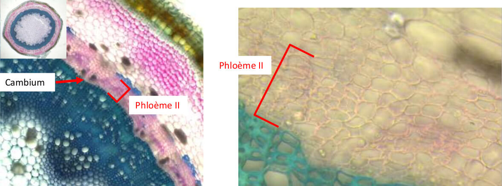

# Biodiversité Végétale

## Application de la biodiversité végétal

La biodiversité végétale permet notamment de comprendre le fonctionnement et l'évolution des plantes, les protéger lors de construction, pour les utilisée dans le système économique et social, et de comprendre les différent services systémique.

Biochimie moléculaire, Physiologie Végétale, Pathologie Végétale, **Histologie végétale, Morphologie végétale, Taxinomie et Systématique \(Classement des végétaux\)**

## Définitions

Le terme **végétal** est bien **différents** du terme **plante**.


**Végétal :** Être vivant **eucaryote pluricellulaire**, généralement **autotrophe au carbone** \(présence de **chloroplastes**\) dont les cellules sont entourées par une paroi et qui possède un **thalle** \(lame foliacée aplatie\) ou des **organes différenciés, cormus** \(racine, tige, feuille\).  
**Remarque :** Les champignons et Mycètes ne sont plus considéré comme des végétaux et les algues pluricellulaire sont parfois rangé dans les protistes.  
**A savoir :** Embryophytes, Fabrique de l'amidon

**Embryophytes :** Aussi appelé Cormophytes, rassemblent ce qu'on appelle les plantes terrestres. \([Source](https://fr.wikipedia.org/wiki/Embryophyta)\)  
Elles forment un groupe monophylétique. Ce terme de plantes terrestres n'interdit pas que certaines d'entre elles se soient par la suite adaptées aux milieux aquatiques \(à la manière des cétacés chez les animaux\) ou que leur fécondation reste en milieu aquatique.  
Avec les algues vertes, ou chlorophytes lato sensu \(groupe paraphylétique\), elles constituent le règne des plantes vertes et le clade des chlorobiontes caractérisé par l'association des chlorophylles a et b et l'amidon stocké dans les plastes.  
Les embryophytes sont définies par la présence d'un embryon végétal.

**Cormophytes :** Ensemble des plantes dont l'appareil végétatif est un cormus.

**Chloroplaste :** La chloroplaste est **l'organite** responsable de la **photosynthèse**.

**Photosynthèse** : Fabrication de matière organique à partir de matière minérale \( $$CO_2,H_2O, etc$$ \) et d'énergie lumineuse qui se déroule chez les végétaux chlorophylliens.

**Matière minérale :** Ensemble des molécules qui **ne contiennent pas** de **carbone réduit**.

* La matière minérale comprend les différentes formes de carbone oxydés comme le dioxyde de carbone et le monoxyde de carbone, les sulfates, les nitrates, les phosphates, les nitrites, l'ammonium, l'eau ....

**Matière organique :** Molécule fabriquée par les **êtres vivants** à **partir** de **carbone réduit**, d'hydrogène, d'oxygène, d'azote, de soufre et de phosphore.

**Carbone réduit :** Atome de carbone dont **au moins un des quatre** électrons célibataires de la couche externe participe à **une liaison**, le plus souvent avec un atome d'**hydrogènes**.

**Autotrophe :** Propriété d'un être vivant qui consiste à fabriquer de la matière organique à partir de matière minéral et d'énergie.  
**-**Si l'énergie est la lumière, la cellule est phototrophe / Si elle est d'origine chimique, la cellule est chimiotrophe.

**Autotrophe au carbone :** Capacité d'un être vivant qui synthétise sa propre matière organique à partir de matière minéral \( $$CO_2$$ \) et d'énergie.

**Thalle :** **Appareil végétatif** des "végétaux primitifs : **thallophytes**" constitué de cellules isolées \(Algue unicellulaire, levures\), de filaments ramifiés \(mycélium des mycètes\) ou d'un tissu parenchymateux lamellaire \(algues\) par opposition à l'appareil végétatif présentant des feuilles, tiges, et des racines.

**Appareil végétatif :** Ensemble des organes d'une plante \(**thalle** chez les thallophytes, **cormus** chez les cormophytes : racine, tige, feuille\) qui assurent sa croissance.

**Lamelle moyenne :** Couche composée principalement de **pectine** située **entre les deux parois** de cellules **végétales** adjacentes

**Tégument :** **Tissu** ou ensemble de tissus et de leur production qui **recouvre** et **délimite** le **corps** d'un être **vivant**

**Pectocellulosique :** Qualifie la **paroi** des cellules végétales qui contient de la **cellulose** et de la **pectine**

**Parenchyme :** Tissu végétal formé de cellules peu spécialisées, dont les parois restent minces \( Ce sont des tissus de constitutions qui peuvent cependant accomplir des fonctions spécialisées\)

**Parenchyme cortical :** Parenchyme situé dans les tiges ou les racines sous le tissu épidermique. \(D'une manière générale, un parenchyme cortical désigne un tissus qui se trouve à la périphérie d'un organe\)

**Sclérenchyme :** Tissus de soutien formé de cellules mortes à paroi épaisse entièrement **lignifiée**. \(Le sclérenchyme se trouve essentiellement dans les organes en croissance sous forme de **fibres** allongées et de **sclérites**\)

**Lignifié :** Se dit d'un tissu, d'un organe, ou d'une plante devenu **ligneux** à la suite du dépôt de **lignine** dans la **paroi** des cellules \(Comme la lignine se dépose dans les parois, l'adjectif **lignifiée** est à employer plutôt pour les cellules et les tissus\)

**Lignine :** Catégorie de substances, **peu** **dégradables**, **non** **glucidiques** résultant de la copolymérisation de 3 alcool aromatiques \(monolignols\) formés à partir de la phénylalanine. \(Les lignines sont colorées en jaune, jaune brun et **l'humus** leur doit sa couleur. Dans les lamelles moyenne elles assurent la soudure irréversible des cellules entre elles. Ce matériau hydrophobe et rigide à permis la formation de végétaux à port arborescent capable de transporter l'eau sous tension sur de longues distances, des racines au feuilles.

**Suber \(liège\) :** Tissu secondaire protecteur mis en place par l'assise subéro-phellodermique dans les troncs, les branches et les racines. \(De point de vue fonctionnel, le suber remplace l'épiderme qui est tombé. Le suber est formé de cellules empilées radialement, remplies d'air et dont la paroi imprégnée de **subérine** est imperméable à l'eau et au gaz. Cette imperméabilité est à l'origine de leur mort. En conséquence tous les tissus situés à l'extérieur meurent et tombent , ils constituent le **rhytidome** ou **écorce** du language commun.

**Subérine :** Catégorie de substances de nature lipidiques et donc hydrophobe, déposées dans les parois du **suber** et associées à de la **lignine** dans les parois épaissies de l'endoderme et du périderme racinaires

**Endoderme :**  Assise formée d'une seule épaisseur de cellules qui correspond à la dernière couche de cellules du parenchyme cortical.

**Sève brute :** Solution aqueuse fabriqué à partir de l'eau et des ions puisés dans le sol par les racines contenant aussi de la matière organique libérée par les organes de réserve souterrains. \( La sève brute circule dans la plante dans les vaisseaux du bois \(**Xylème**\). Compte tenu de son sens de déplacement, elle est aussi qualifiée de sève ascendante.

**Sève élaborer :** Solution aqueuse formée dans les feuilles par accumulation de la matière organique provenant de l'**assimilation chlorophyllienne.** \( La sève élaborée utilise des conduits appelés **tube criblés**, qui constituent le **phloème.** Elle est aussi appelée sève descendante.

**Faisceaux libéraux ligneux :** est une partie du système vasculaire d'une plante vasculaire

**Procambium :** Tissu issu des **méristèmes primaires**  racinaire et caulinaire à l'origine de la différenciation du xylème et du phloème primaire. ****

**Pachyte :**

**Phyllotaxie :**

**Phototropisme :**

**Géotropisme :**

**Symbiose mutualiste :** relations entre deux organismes à bénéfices mutuels \(temporaires ou durables\)


## Grand groupe des végétaux

1. Algues
2. Bryophytes \(Mousses\)
3. Monophysites \(Fougères, Prêles\)
4. Gymnosperme \(Pin, Sapin\)
5. Angiosperme \(Plantes à fleurs\)


Le groupe des angiosperme est le dernier à être arriver sur terre est donc **le plus complexe**, de ce fait il s'est mieux **adapté à son environnement**, les angiospermes représentent environ **95%** des végétaux terrestre.


## Qu'est ce qu'un végétal ?

### Construction des cellules végétales


Les parties importante d'une cellule végétales sont le noyaux et les organites listées ci-dessous

* **Noyaux** \(Entouré d'une enveloppe nucléaire\)
* **Cytoplasme** \(Contient de l'eau et des ions\)
* **Membrane plasmique** \(Délimite le cytoplasme\)
* **Mitochondrie** \(Respiration, produit du $$H_2O_2$$ toxique pour la plante\)
* **Réticulum endoplasmique** \(Produit des lipide et protéine\)
* **Appareil de Golgi** \(Réservoir de protéine\)
* **Péroxysome** \(Dégrade le $$H_2O_2$$ en $$H_2O$$ et $$O_2$$ \)
* **Ribosome** \(Fabrique des protéine\)
* **Vacuole** délimité par une membrane, le **Tonoplaste**


#### Cellule végétale en cours


**Lamelle moyenne** est le **ciment** entre les cellules végétales


#### Cellule végétale

### Caractéristiques principales d'un végétal


* **Cellule Eucaryote**
* **Photosynthèse oxygénique**
* **Autotrophe** pour le **carbone**
* Métabolite secondaires
* **Paroi, Plaste, Vacuole** au niveau de la cellule végétale.
* La taille des cellules allant de $$30\mu m \ à \ 120\mu m$$ 


### Comment fonctionne la photosynthèse

Les chlorophylles dans les chloroplastes permettent la photosynthèse grâce à l’énergie solaire.

### Métabolite secondaire

En plus des **métabolites primaires** \(ADN, ARN, lipide, glucides etc etc\) les végétaux peuvent produire des métabolites secondaire pour se **protéger** \(Odeur, Gout\) ou pour la **dissémination des graines** et du pollen \(Couleur\)

### Les différentes fonctions des plastes

Une cellules végétales peut avoir plusieurs plastes différentes


**Chloroplaste :** Permet la photosynthèse, Synthèse acide gras, fixation carbone, azote et souffre  
**Chromoplaste :** Permet l'attraction des pollinisateurs et dissémilateurs de graine grâce au changement de couleur  
**Amyloplastes :** Sert de réserve et de géo-perception \(Permet au racine de pousser vers le bas\)


### La vacuole

La vacuoles est délimitée par un **tonoplaste**. La vacuole à plusieurs rôle au sein de la cellule


* Stockage d'eau et de nutriments de manière transitoire
* Croissance
* Soutient \(par pression et turgescence\)
* Élimination des déchets et éléments toxiques de la plante
* Défense et attraction avec la production de pigments, tanin et autre molécules


### Parois


#### Définition

Matrice extracellulaire entourant la **membrane plasmique** des cellules des **végétaux** **chlorophylliens**.  
La paroi primaire, caractéristique des cellules jeunes, est constitué par des micro fibrilles de cellulose \(25 à 30%\) disposées dans tous les sens, ce qui lui permet d'être extensible, de pectines \(jusqu’à 35%\), d'hémicellulose \(15 à 25%\) et de glycoprotéines \(5 à 10%\). Son épaisseur est de 1 et 3 µm. La **paroi secondaire** se forme au cours de la différenciation de la cellule, elle est plus épaisse, moins hydratée, contient une proposition plus importante de cellulose mais pas de pectine. Elle se situe **sous la paroi primaire**



La **paroi primaire** assure un rôle de régulation de la **croissance cellulaire**

Les **parois** contienne **toutes** de la **cellulose**


Il existe deux types de parois pour les cellules végétales, paroi primaire et secondaire.  
La communication entre les cellules se fait par les petites perforations au niveaux des parois qu'on appelle **plasmodesme,** qui permet de communiquer de **cytoplasme** d'une cellule à une autre, si il y a un groupe de plasmodesme alors on est en présence d'une **ponctuation.**


**Symplasme :** Ensemble des **cytoplasmes** communiquant par le biais de **plasmodesmes**

**Apoplasme :** Ensemble des parois des cellules et des espaces de vide \(Cellules mortes + parois\)


La paroi primaire contient différents éléments important utiles pour la plantes

* Eau à 60 - 70%
* Micro-fibrilles de cellulose
* Hémicellulose
* Pectines
* Protéines
* Enzymes
* Calcium \(0.5% - 1%\)

La paroi secondaire sert notamment de soutient pour le végétal, majoritairement constitué de cellulose et d'eau, elle se dépose ultérieurement sur la paroi primaire, elle est toujours constitué de 3 couches.

Les parois des cellules végétales ont différentes spécialisation, mais ne sont pas obligatoirement présente sous cette forme.  
**Lignification :** Incrustation **lignine** \(Hydrophobe, insoluble\), cela entraîne la **mort de la cellule**, \*\*Tissus type Xylène et Sclérenchyme

Subérification : **Incrustation subérine \(lipide\), forme le** suber\*\* \(Liège, écorce\)

**Cutinisation :** Dépôt de cires \(Epiderme\)

### Pour conclure

Les végétaux comprend **toutes les algues**, qui produisent de la **chlorophylle a , a/b, a/c** et divers pigments ainsi que que les plantes **embryophytes**, qui produisent de la **chlorophylle a/b**.  
En L1 c'est la **lignée verte** qui nous intéresse, donc **une partie des algues** et tous les **embryophytes**

## La lignée verte, les grands groupes des végétaux

### Arbre phylogénique des différents groupe de la lignée verte

## La conquête des milieux terrestre

### Besoin des organisme végétaux

Tous végétaux à besoin de ressources pour se développer


* Lumière
* Eau
* $$C0_2$$
* $$0_2$$ 
* Element minéraux \(N, P, K, Fe, Mg, Mn, Ca\)


### Dans les milieux aquatiques

Qualification d'une plante aquatique


* L'eau n'est pas limitante
* Gaz et éléments minéraux accessibles \(Dissous dans l'eau\)
* Il n'y à pas de gravité \(Economie de ressource\)
* La lumière se réverbère sur la surface de l'eau
* Inertie thermique
* L'eau est un vecteur de dissimulation



#### Définition

**Inertie Thermique :** L'inertie thermique d'un matériau représente sa résistance au changement de température lorsque intervient une perturbation de son équilibre thermique.


### Dans les milieux terrestres

Lorsque le végétal est en milieu terrestre il subis différente contrainte qui n'existait pas dans le milieu aquatique

#### Contrainte


* Lumière pouvant être limitante \(Sous couvert végétal\)
* Eau pouvant être limitante
* Gaz présent dans l'air
* Limitation des minéraux dans le sol
* Influence de la gravité
* Variation climatique
* Dessèchement lié à l'air


#### Solution

Pour se faire les plantes se sont adapté et ont crée des système qui répondent à ces problématique


* Mobiliser l'eau du sol et les élément minéraux
* Agir contre la gravité
* Capter les gaz dans l'air ambiant
* Se protéger des pertes en eau
* Mettre en place des lieux de stockage pour résister au variation climatique
* être compétitif pour intercepter la lumière et occuper l'espace


## Focus sur les angiosperme


Pour faire simple un angiosperme à des tiges des feuilles et des racines


### Graine

Le point de départ des angiosperme est la graine, formée de différentes parties


* Gemmule
* Première feuille
* Tigelle
* Radicule
* Cotylédon \(réserve\)
* Tégument \(Entoure le cotylédon\)




### Feuille


#### **Définition**

**Feuille :** Organe aplati, généralement de couleur verte, qui assure l'essentiel de la photosynthèse et les échange d'eau et de gaz avec l'atmosphère.

**Limbe :** Partie élargie et aplatie de la feuille qui assure la photosynthèse.

**Marge :** La marge est le contour du limbe.

**Nervure :** Ligne saillante formée par les faisceaux conducteurs de la feuille.

**Pétiole :** Structure de petite dimension, à symétrie bilatérale, **reliant le limbe** de la feuille à la **tige** qui convient les **vaisseaux conducteurs de sève.**

**Bourgeon :** Structure constituée par de très jeunes feuilles \(Bourgeon foliaire\) ou de très jeunes fleurs \(Bourgeon florale\) situé sur un axe relativement court, terminé par un méristème apical caulinaire, et protégé par des feuilles modifiées, les écailles.  
**Le bourgeon ne fais pas partie de la feuille !**

**Tige :** Organe généralement aérien, plus ou moins dressé et ramifié, sur lequel se développent des bourgeons qui se différencient soit en feuilles, soit en fleurs, soit en axes secondaires \(rameaux\) qui, à leur tour, portent des feuilles ou des fleurs.

**Foliole :** Division d'une feuille composée en unités élémentaires \(Contrairement au feuille, les folioles ne possèdent pas de bourgeons\)



Une feuille simple est bien différente qu'une feuille composée.  
Pour trouver une feuille il faut situer ou est le bourgeon, qui est la "Base" de cette dernière.



#### Nervation

* Marge du limbe
  * Entière
  * Dentée
  * Lobée
* Nervure
  * Pénée
  * Palmée
  * Parallèle



Le **bourgeon** ne fais pas partie de la **Feuille**


#### Photo feuille composée

### Phyllotaxie

Il existe 4 grandes phyllotaxie


* Alterne spiralée
* Alterne distique
* Opposée décussée
* Verticillée


### Système racinaire

### Jeune pousse

### Bourgeon

## Production de nouvelles cellules

### Définition


**Apex :** Extrémité pointue d'un organe, les apex racinaire et caulinaire possèdent des méristèmes primaire apicaux

**Caulinaire :** Qui se rapporte à la tige

**Organogène :** Relatif à la formation d'organe de l'être vivant


### Introduction

Une plante cherche à croitre en hauteur et longueur ainsi qu'en épaisseur grâce à la production de cellules qui forment des tissus


**Tissu :** **Ensemble** de **cellules** d'un **type** particulier **regroupées** en une **unité** **fonctionnelle**  
Exemple : Tissus nerveux, musculaire, sanguin, conjonctif... L'étude des tissus est l'objet de l'histologie


### Production de nouvelles cellules par le fonctionnement de méristèmes

#### Définition méristème


**Méristème** : **Tissu végétal** indifférencié dont les **cellules** se **multiplient** par **mitose** et assurent la **formation** de **tissus**, puis d'**organes nouveaux**


La production de cellules se fait en plusieurs étapes  
Etape 1 : Production de cellules au niveau des méristème par division \(Mitose\)  
Etape 2 : Croissance cellulaire, la cellule grandit par synthèse et étirement de la paroi, il y a formation du tissu embryonnaire  
Etape 3 : Différenciation cellulaire et des tissus, modification structurale et biochimique des cellules pour assurer une fonction particulière dans l'organe. 

* Changement de taille et de forme
* Changement cellulaire réorganiser \(Vacuole regroupé, différenciation des plastes\), ou disparait
* Modification possible des parois


Le méristème assure **l'histogenèse**


### Ou se situe les méristèmes

Les méristèmes sont situés aux extrémités de la plante, il y a **deux types de méristèmes** différents, méristème **primaire** et **secondaire**.


* Méristème primaire en **position** **apicale**, qui assure la croissance en **longueur** en produisant des **tissus** **primaires**
* Méristème secondaire, **Cambium** et **Phellogène**, qui assure la croissance en **épaisseur** de la plante en produisant des **tissus** **secondaire**


## Diversité et fonction des tissus impliqué dans la croissance en longueur de la plante


Pour tous ce qui est de la croissance en longueur et hauteur, tous les tissus sont issus du fonctionnement du méristème primaire, ce sont des tissus primaires



Il y à 3 grand types de tissus

* Revêtement et protection
* Conducteur de sèves
* Fondamentaux \(Soutien, réserve, sécrétion...\)


Certains constitué de cellules identiques \(tissu simple\), d'autre de différent type cellulaire \(tissu complexe\)

### Méristème primaire

Les méristème sont présent au extrémité haut et bas de la plante


* Bourgeon **apicale**
* Bourgeon **auxiliaire**
* Bout des racines



Les **méristèmes** **primaires** sont **organogènes** 


## Tissus primaires


Les tissus primaires sont forcément issus d'un méristème primaire, il y a un agencement irrégulier des cellules qui les composent


#### Schéma de représentation des tissus primaires

### Tissus de revêtement primaire

Ils sont en surface des organes et joue un rôle de protection

#### Epiderme


C'est un tissus de protection/revêtement des tiges et des feuilles, il est constitué d'une seule couche de cellules, mais composé de plusieurs types cellulaires \(cellules épidermique, cellules somatiques, poiles épidermiques\) et recouvert d'un cuticule  
Les cellules épidermique sont translucides


Les cuticules permettent à la plantes d'éviter de perdre trop d'eau, c'est une couche de protection externe de cire.

L'épiderme est aussi constitué de stomates, ils sont généralement située sur la face intérieur de la feuille, mais ce n'est pas toujours le cas, car ils doivent se protéger de la chaleur  


Le stomate est un tissus d'échange, qui permet à la plante des échanges gazeux grâce à l'ouverture et fermeture du stomate, ils permettent la régulation des flux hydrique au seins de la plante


#### Poils épidermiques

Il existe une grande diversité de poiles épidermique, adaptés à tous types d'environnement, et de fonction protecteurs ou prédateurs, ils jouent des rôles bien différents


* Absorption de l'humidité de l'air
* Sécrétion
* Attraction des pollinisateurs
* Accrochage


#### Rhizoderme

Le rhizoderme, appelé aussi assis pilifère, est le tissus de revêtement/protection des jeunes racines, il est d'une seule couche de cellulaire d'épaisseur

Plus les racines sont âgés moins le rhizoderme est présent. Il diminue jusqu'a disparaitre. Les racine n'absorbent alors presque plus de nutriment et sont recouverte d'une zone subéreuse

### Tissus fondamentaux

#### Parenchyme


Tissu végétale formé de cellules peu spécialisées, dont les parois reste mince  
Ce sont des tissus de constitution qui peuvent cependant accomplir des fonctions spécialisées. \(Comprenant des cellules isodiamétriques\)


* Photosynthèse
* Stockage de réserve
* Circulation des gaz
* Stockage de l'eau

### Tissus de soutien

Les tissus de **soutient** aident à maintenir la plante **dressé**, la **rigidité** est permise grâce a des **cellules** **jointives** et une **parois** très **épaisse** de celle ci, ont les trouves particulièrement dans les **feuilles** et les **tiges**


Il existe deux types de tissus de soutient

* **Collenchyme**
* **Sclérenchyme**


#### Collenchyme


* Paroi **primaire** **pectocellulosique** **épaissie**
* **Pas** de paroi **secondaire**
* Cellules **vivantes**
* Il est **localisé** en **surface** des **organes**
* Espèces végétale **herbacées** et **jeunes** **ligneuse**
* Il existe **3 types** de collenchyme
  * Rond ou Annulaire
  * Angulaire
  * Lamellaire ou tangentiel


#### Sclérenchyme


* Paroi **primaire** et paroi **secondaire** lignifiées
* **Cellules mortes**
* Est composé de plusieurs types cellulaire


#### Endoderme et pericycle

Généralement présent dans les tissus racinaire, il se situe à la limite du cylindre centrale et de l'écorce

#### Péricycle


* Tissus **vivant**, **petite** **cellules** **peu** **différenciées**
* Une **seule couche** de cellules
* Couche la **plus externe du cylindre centrale**
* **Rôle** dans la **ramification** des **racines**


#### Endoderme


* Tissus **vivant**, paroi partiellement **lignifiées** ou **subérifiées**
* Couche la plus **interne** de la **zone** **corticale**
* Rôle dans **l'absorption** -&gt; filtre


#### **Tissus sécréteur**

Il y a une grande variété de substance produites par

* Des cellules isolées
* L'épidermes ou des poils sécréteurs
* Poche / Canaux sécréteurs

Les tissus sécréteurs permettent plusieurs fonction pour les plantes


* Communication avec d'autre plantes \(Molécule odorante, attirer et séduire les pollinisateurs\)
* Repousser les herbivores


### Tissus de conductions primaire

Assure la conduction de sèves des trachéophyte


Les tissus de conductions primaires ont me rôle de **transmettre** les différentes **sèves** dans l'ensemble de la plante, il en existe deux types de sèves, la **sève brute** qui circule dans le **xylème** et la **sèves élaboré** qui circule dans le **phloème**. Les tissus **xylème** et **phloème** sont produits par les **méristèmes primaires procambiums**.  
  
Le **xylème** transporte **l'eau** et les **éléments** **minéraux** vers la **tige** et les **feuilles**, alors que le **phloème** transporte les **sucres** produits par les feuilles vers les **racines**.  
Le xylème et phloème  sont des **faisceaux libéro ligneux**


#### Xylème primaire

Présent dans les feuille tige et racines il assure 3 fonction principales


* Conduction de sève brut \(Fonction principale\)
* Soutien \(Légèrement\)
* Réserve et métabolisme


Le xylème est apparu avec les monilophytes suite à la colinisation du milieu terrestre qui ramène deux contraintes avec lui, la gravité et l'embolie

#### Xylème primaire chez les monilophytes

* Soutient et conduction grâce au trachéide scalariforme
* Paroi secondaire lignifiée, constitué de cellule morte allongée
* Zone de perméabilité, ponctuations
* Conduction en baïonnettes peu efficace, il n'y à pas de fonction de réserve

#### Xylème primaire chez les gymnospermes

Assure le soutient et la conduction 

* Trachéide à ponctuation aréolées
* Cellules mortes allongées \(Paroi 1 et 2 lignifiées\)
* Système de conduction plus efficaces

Ainsi que la réserve et métabolisme

* Parenchyme
* Cellule vivante isodiamétrique \(Stockage amidon\)

#### Xylème primaire chez les angiospermes

Assure le soutien 

* Fibre \(sclérenchymateuse\)
* Cellule morte très allongée
* Paroi épaissie et lignifiée \(P1 et P2\)
* Peu ou pas de ponctuations, lumière de la cellule étroite

Ainsi que la réserve et métabolisme 

* Parenchyme xymélien \(ou ligneux\)
* Cellule vivante, paroi 1 cellulosique ou lignifiées
* Stockage d'eau et d'amidon
* Cellules associés au vaisseaux \(CAV\)
  * Cellule vivante, paroi mince cellulosique
  * Métabolisme actif

Conduction grâce au vaisseaux, qui comporte plusieurs éléments. Cellules de grande taille, morte à paroi épaissies \(P1 et P2\), lignifiées, ponctuées. La fabrication des vaisseaux se fait tout au long de la vie de la plante, plus les vaisseaux sont formés tard plus les vaisseaux sont lignifiés.


Il existe plusieurs types de vaisseaux, les premiers vaisseaux fabriqués sont des **protoxylèmes** et ceux fabriqués quand la plante est plus développée sont les **métaxylèmes**


#### Protoxylème

Les protoxylèmes sont les premiers vaisseaux fabriqués par la plante, de ce fait ils sont imparfait. Les cellules s'allongent, constitué de parois transversales entre les vaisseaux. Vaisseaux annelé, spiralés. 

#### Métaxylème

Les métaxylèmes sont considérés comme des vaisseaux parfaits, les cellules ne s'allongent plus, les vaisseaux sont constitués d'éléments de vaisseaux sans paroi transversale, vaisseaux rayés, réticulés, ponctués.


Le sens de différenciations des vaisseaux du xylème primaire permet de faire la distinction au niveau histologie entre tige et racine.

* Différenciation centrifuge des vaisseaux du xylème primaire pour la tige
* Différenciation centripète des vaisseaux du xylème primaire pour les racines


#### Phloème primaire

Présent dans les feuilles, tiges et racines. Ils assurent 3 fonctions


* Conduction de sève élaborée \(Fonction principale\)
* Soutient
* Réserve


**Constitué de** 


* Tube criblé \(conduction\)
* Cellules compagnes
* Parenchyme libérien \(Parenchyme phloèmien\) métabolisme et réserve
* Fibre \(soutient\)


* Tissu complexe à cellules vivantes et à parois cellulosiques
* Allongement possible des cellules
* Toujours à différenciation centripète


Phloème primaire est un tissu complexe composé de plusieurs types cellulaire


#### Constitution des phloème primaire

**Tubes criblés** -&gt; conduction de sèves élaborée \(Glucides\)  
Élément du tube criblé :   
- Grosse cellule vivante avec parois transversales criblées  
- Sans noyaux, ni vacuoles, ni ribosome, ni REG \(Constitué de quelques plastes et mitochondries\)

**Cellule compagne** -&gt; collée contre le tube criblé  
- Maintient en vie l'élément du tube criblé

**Parenchyme phloèmien** \(ou libérien\)  
- Cellule vivantes, allongées, à parois cellulosiques  
- Stockage et sécrétion

**Fibre phloèmiennes** \(ou libériennes\) sclérenchymateuses   
- Cellules vivantes allongées  
- Paroi cellulosique ou lignifiée, épaissie  
- Participe au soutient de la plante

#### Disposition des tissus conducteurs primaires chez les angiospermes

Les différentes dispositions des xylèmes primaires et phloèmes primaires permet la distinction histologiques entre les feuilles, la tige et les racines


Chez les **tiges** et les **feuilles** la disposition du **Xylème** primaire et **Phloème** primaire est **superposé**

Dans les **racines** la disposition est **alterné**



La **disposition** des **tissus** **conducteurs** **primaires** résulte du **fonctionnement** du **méristème** **primaires**, le **procambium**


## Diversité et fonction des tissus impliqué dans la croissance en épaisseur de la plante

C'est grâce à l'intervention des méristème secondaire que les plantes peuvent s'épaissir, mais cette fonction **n'est pas disponible pour toute les plantes.** Présent au niveau des tiges, feuilles et racines.

* **Très important** chez les plantes dites **ligneuse** \(Buisson bas, buisson, arbuste, arbre\)
* **Plus restreinte** chez les plantes **herbacées** \(Herbe autre que monocotylédones\)


Les **Monocotylédones** n'ont pas de méristèmes secondaires, pas de cambium donc pas de tissus secondaires.


### Méristème secondaire


C'est une assise **génératrice** issus du méristème primaire, responsable de la **croissance** en **épaisseur** par la mise en **place** de **tissus** **secondaires**, on dit que c'est un **méristème** **histogène**

Il existe **deux** **types** de **méristèmes** **secondaires**

* **Cambium**
  * Assise génératrice libéro-ligneuse \(=&gt; **Tissus** **secondaire** de **conduction**\)
* **Phellogène**
  * Assise génératrice subéro-phellodermique \(=&gt; **Tissus** **secondaire** de **revêtement**\)


### Cambium, Tissus secondaire de conduction

Les tissus secondaires de conductions sont produits par le **cambium,** ce sont le **xylème secondaire** et **phloème secondaire.** Présent au niveau des racines, tiges et feuilles de certaine plante.

#### Production de xylème et phloème secondaire

La division périclines du cambium permettent la production de nouvelles cellules.

#### Explication de la division du cambium

#### Xylème secondaire


* Produit de façon interne
* Contient uniquement des vaisseaux parfait \(métaxylème\)
* Fibre
* Parenchyme


#### Phloème secondaire


* Produit de façon externe
* Même types cellulaire que le phloème primaire
  * Élément tube criblé
  * Cellule compagne
  * Parenchymes phloèmien
  * Fibres phloèmiennes


#### Représentation schéma des tissus secondaire avec cambium

#### Notion de pachytes \(Pakyte\)


La disposition du cambium peut être continue ou discontinue entres les faisceaux libéraux ligneux, ce qui donne la mise en place continue ou discontinue de tissus conducteurs secondaires


#### Résultat de productions des tissus secondaires au niveau des organes

#### Tige

#### Racine

### Phellogène, Mise en place de tissus secondaire de revêtement


La croissance importante en épaisseur liée au fonctionnement du cambium conduit au déchirement des tissus primaires de revêtement

La plante dois donc en créer de nouveau avec des tissus de revêtement secondaire pour protéger les organes \(Tiges, Racine\), au niveau de certaines plantes \(ligneuses\)



Fonctionnement du phellogène

* Formation de **suber** \(ou **liège**\) vers l’extérieur
* Formation du **phelloderme** vers l’intérieur

il y a division périclines du phellogène permettant la production de nouvelles cellules


#### Suber


Cellules mortes à paroi subérifiée plus de la cire, ce qui la rend imperméable aux gaz et à l'eau. 

Il peut y avoir la présence de zone ou le suber est désorganiser pour permettre les échange gazeux, ont les appelles les **lenticelles**


### Autre croissance secondaire

Exceptionnellement, il peut y avoir croissance secondaire chez les espèces présentant pas de cambium ou de phellogène \(Palmier, Dragonnier\)  
On appelle ça la croissance secondaire diffuse \(Pas assuré par une assise mais par des cellules dispersée dans la plante\)

## Racine

Le système racinaire d'une végétale angiosperme est bien différents selon les espèces et assure des rôle plus ou moins différents.


* Volume racinaire très variable selon les espèces
* Racine généralement souterraine \(sauf exception\)
* Phototropisme négatif ⬇
* Géotropisme positif ⬇

Différent rôle

* Ancrage 
* Stockage de réserve
* Acquisition de ressource du sol
* Multiplication végétative \(Assure la reproduction de la plante de manière asexuée\)


### Origine et diversité des racines


La **racine « vraie »** dérive de la **radicule** elle est rattachée à la tige au **collet** et peut se ramifier.

Il existe aussi des **racines "adventives"** racines formées sur d’autres organes \(tige, feuille\), ne dérivant pas de la radicule. Le **développement** **possible** de racines **adventives** à partir de **n’importe quel organe** permet la **multiplication** **végétative** des **individus**.


#### Morphologie des racines


Les racines se diversifies en trois grands type :

* Pivotant
* Fasciculé
* Mixte


### Croissance de la racine


La croissance de la racine se fait par un **méristème primaire**, le **méristème racinaires** \(apical\), et est protégé par la **coiffe**. La coiffe crée ses cellules suite au détachement de cellules \(cellule desquamantes\)  
Le géotropisme des racines est induits par la coiffe, la perception de la gravité repose sur les statolithes présent dans la coiffe


   

La croissance se fait en 3 étapes

1. Production de cellules \(M\)
2. Elongation / croissance cellulaire
3. Différenciation cellulaire /maturation

### Structure de la racine

#### Structure morphologique


Pour rappel il existe trois grand type de morphologies, pivotant, mixte et fasciculé.

* Partie plus âgée
  * Rhizoderme a desquamé
  * Racine protégée par la zone subéreuse / subéroïde
* Absorption : grande surface de contact avec le sol \(poils unicellulaires potentiellement ramifiés\)
* Zone glabre : Rhizoderme non encore différencié
* Coiffe : manchon de cellules facilitant la pénétration \(+ zone méristématique\) Racine principale de la racine dans le sol. Cellules se multiplient vite pour se renouveler



Chez certaines racines âgées \(**plantes** **ligneuses**\) protection assurée par suber \(**protection** **secondaire**\)


#### Structure histologique


#### Tissus primaires

* Revêtement
  * **Rhizoderme** \(cellules rhizodermiques + poils absorbants\)
  * **Zone subéreuse ou subéroïde** : \(racines plus âgées\) cellules de parenchyme imprégnées de subérine
* Fondamentaux
  * **Parenchyme** \(= **amylenchyme**\) **cortical** : stockage.
  * **Endoderme** : couche interne de la zone corticale. Rôle de filtre dans l’absorption des éléments minéraux.
  * **Péricycle** : couche la plus externe du cylindre central . Rôle dans la ramification de la racine
* Conduction
  * **Xylème** **primaire** \(présence proto- et métaxylème\)
  * **Phloème** **primaire**



#### Pour distinguer une racine ?

1. Symétrie radiale
2. Alternance du phloème primaire et du xylème primaire
3. Différenciation centripète du xylème primaire


#### Tissus secondaires

Chez certains végétaux il y a production de tissus secondaire et de croissance en épaisseur de la racine \([Voir ici](https://kevinrousseau80.gitbook.io/licence-svt/biodiversite/biodiversite-vegetale#racine)\). Uniquement chez certaines plantes


Production de tissus **secondaire** de **conduction** via le **cambium**, le **phloème** **secondaire** et **xylème** **secondaire**. Et production de tissus **secondaire** de **revêtement** via le **phellogène**, le **suber** et **phelloderme** \([voir ici](https://kevinrousseau80.gitbook.io/licence-svt/biodiversite/biodiversite-vegetale#phellogene-mise-en-place-de-tissus-secondaire-de-revetement)\)


### Ramification de la racine


* Se fait à partir du péricycle
* Origine profonde \(endogène\) de la ramification racinaire


### Symbiose racinaire


**Symbiose mycorhizienne** la plus répandue à l’échelle planétaire \(80% des espèces végétales\)

Il existe différents types de symbiose mycorhizienne en fonction de la position du champignon par rapport aux racines :

* Ectomycorhizes \(sur la racine\)
* Endomycorhizes \(dans la racine\)

Echanges de ressources entre les partenaires : 

* Absorption de l’eau et des éléments minéraux du sol facilitée par la présence de mycorhizes autour des racines \(peuvent assurer jusqu’à 70% des besoins nutritifs de la plante\)
* En contrepartie, la plante assure la nutrition carbonée de son partenaire mycorhizien


## Tige


Organe végétatif à symétrie radiale qui porte généralement des feuilles et des bourgeons. Généralement aérienne et à croissance verticale.

Phototropisme positif et géotropisme négatif, la tige permet le soutient de la plante et la circulation de la sève entre les feuilles et les racines


### Origine de la tige


La tige provient du groupe gemmule et tigelles, elle est rattaché à la racine par le collet, la tige porte les cotylédons, feuilles et le bourgeon terminal \(Apical\). Les tiges sont un empilement de phytomères.


### Diversité des tiges


* Tiges aériennes 
  * orthotropes, dressées et autoporteuses
  * orthotropes, dressées et non-autoporteuses
  * Plagiotropes
    * Stolon \(Fraisier\)
  * Réduite \(Port en rosette, pissenlit, Grassette\)
* Tiges souterraines
  * Á croissance horizontale \(plagiotrope\) \(Rhizome -&gt; iris, Tubercule -&gt; pomme de terre\)
  * A croissance verticale \(Orthotrope\) \(Bulbe -&gt; oignon, Corme -&gt; Crocus\)


### Croissance de la tige


La croissance de la tige s'effectue par la croissance du bourgeon apical \(Terminal\), chez les plantes ligneuse le bourgeon est protégé par des écailles, chez une plante herbacé il n'est pas protégé.


#### Organisation de l'apex caulinaire

#### Fonctionnement de l'apex caulinaire

#### Plante ligneuse


Pour les plantes ligneuse la croissance se passe en deux étapes

* Mise en place des phytomères -&gt; Organogenèse \(!! origine superficielle = exogène des feuilles et des bourgeons\)
* Accroissement des cellules du phytomère : Elongation

Fonctionnement rythmé, moment de repos du méristème.


#### Plante Herbacé


**Organogenèse** et **elongation** **simultanées**


### Structure de la tige


Tissus primaires

* De revêtement
  * Epiderme
* Fondamentaux
  * Parenchyme cortical
  * Collenchyme et Sclérenchyme
* De conduction
  * Xylème primaire \(Avec Proto et Métaxylème\)
  * Phloème primaire



Et pour distinguer une racine ? 

* Symétrie radiale
* Xylème primaire superposé au phloème primaire
* Vaisseaux du xylème primaire avec un sens de différenciation centrifuge
* Cylindre centrale plus développer que l'écorce
* Présence de tissus de soutien \(Collenchyme et Sclérenchyme\)


#### Tissus secondaire

Chez certains végétaux il y a production de tissus secondaire et de croissance en épaisseur de la tige \([Voir ici](https://kevinrousseau80.gitbook.io/licence-svt/biodiversite/biodiversite-vegetale#racine)\). Uniquement chez certaines plantes


Production de tissus **secondaire** de **conduction** via le **cambium**, le **phloème** **secondaire** et **xylème** **secondaire**. Et production de tissus **secondaire** de **revêtement** via le **phellogène**, le **suber** et **phelloderme** \([voir ici](https://kevinrousseau80.gitbook.io/licence-svt/biodiversite/biodiversite-vegetale#phellogene-mise-en-place-de-tissus-secondaire-de-revetement)\)


#### Structure histologique

#### Architecture et développement


Croissance rythmique = arrêts de croissance et présence d’unités de croissance

Croissance continue = pas d’arrêts de croissance



* Développement **monopodial**
  * L’axe 1 poursuit son fonctionnement végétatif
  * Croissance via le bourgeon terminal
* Développement **sympodial**
  * L’axe 1 ne poursuit pas son fonctionnement végétatif \(méristème se transforme et/ou meurt\)
  * Croissance via des bourgeons axillaires


#### Différenciation rameaux

## Feuille

## A savoir !

### Représentation schématique des Xylèmes et Phloèmes

## Travaux pratique

### Reconnaître qu'elle tissus nous observons


1. Tissus simple ou complexe
2. Cellules alignées ou non alignées 
3. Forme des cellules
4. Couleur de la paroi
5. Paroi normal \(fine\) ou épaissie
6. Positionnement du tissu


### Utilisation de différents colorants

Lors des travaux pratiques pour découvrir les fondements des cellules, nous allons utilisées différents colorants

* Rose à rouge violacé : paroi pecto-cellulosique
* Vert à turquoise : paroi secondairement imprégnée de lignine
* Jaunâtre : composées lipidiques \(cutine, subérine\) de la cuticule, de la paroi subérifiée

### Aide au schéma

### Faisceaux libéraux ligneux

### Coupe transversale tige herbacé

### Correction CC

## Sortie Tête d'or

### Définition


**Épiphyte :** Les épiphytes sont des trachéophytes qui vivent sur les tronc, les branches et parfois les feuilles d'un arbre hôte, sans être enraciné dans le sol. Vivre sur un support organique, hors du sol, revient à vivre en milieu oligotrophe.


## Ressources



* [Nowatera](http://www.nowatera.be/)
* [Dictionaire de SVT par Michel Breuil](https://www.decitre.fr/livres/dictionnaire-de-svt-9782091520155.html)
* [Wikipédia](https://fr.wikipedia.org/wiki/Portail:Botanique)



* [Biologie de Neil Campbell](https://www.decitre.fr/livres/biologie-9782761350655.html)
* [Classification du viant de Guillaume Lecointre Tome 1](https://www.decitre.fr/livres/classification-phylogenetique-du-vivant-9782701182940.html)
* [Classification du viant de Guillaume Lecointre Tome 2](https://www.decitre.fr/livres/classification-phylogenetique-du-vivant-9782410003857.html)
* [L'origine des espèces Charles Darwin](https://www.decitre.fr/livres/l-origine-des-especes-9782081221079.html)



