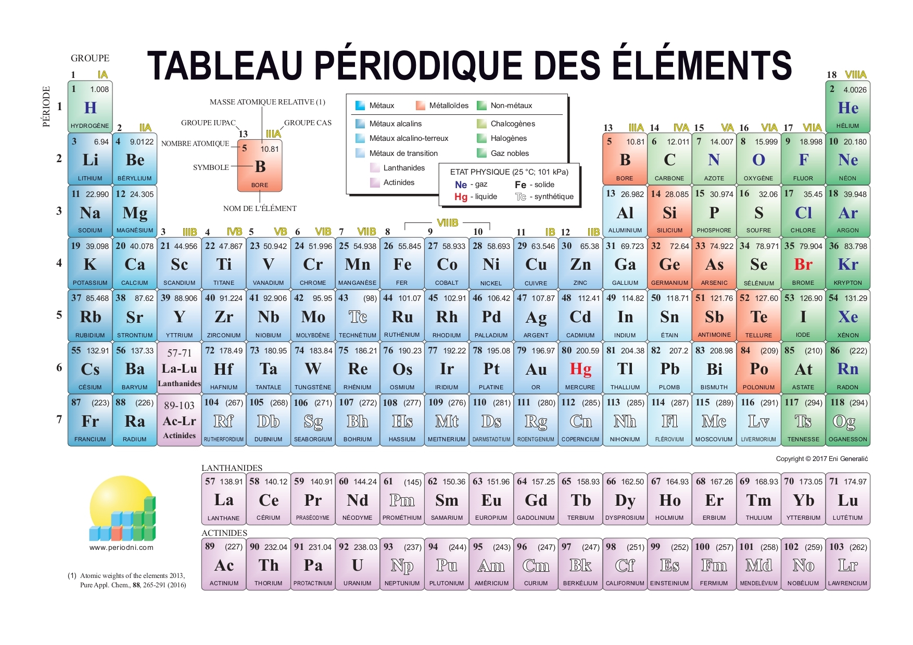

# Biomolécule

## Bien commencer

### Atome

Un atome est formé d'un noyau et d'un nuage électronique. Les nucléons protons et les neutrons composent le noyau, et les électrons gravitent autour du noyau.


Le nombre d’électron correspond au numéro atomique. Trouvable dans le [tableau périodique.](https://kevinrousseau80.gitbook.io/licence-svt/biomolecule#ressources)



La formation des **liaisons** et les p**ropriétés chimique** dépendent des **électrons** et plus précisément des électrons situés sur la "couche externe" dite **couche de valence**.


### Structure électronique

La position des électrons est définie par une fonction d'onde Ψ. \(Psi\)  
Ψ² représente la probabilité maximum de trouver l'electron considéré dans un certains volume de l'espace.  
Ce volume est l'orbitale qui est caractérisée par une série de 3 nombre quantique : $$n$$ , $$l$$ , $$m_l$$ 

1. Le nombre quantique principale, $$n$$ , caractérise la **taille** et l’**énergie de la couche** considérée et correspond à un **nombre entier**.
2. Le nombre quantique secondaire ou azimutale, $$l$$ , caractérise la géométrie de l'orbitale et correspond à un entier allant de 0 à $$n^{-1}$$ \(  $$0 \leq l \leq n^{-1}$$ \).
3. Le nombre quantique magnétique $$m_l$$, caractérise l'orientation prise par l'orbitale et correspond à un entier allant de $$-l \leq m_l \leq +l$$ 
4. Le dernier nombre quantique est S \(spin\) qui détermine la rotation de l'électron

#### Équation pour le nombre maximum d'électron par couche

$$max\ 2n^2 (électrons) \begin{cases}  n=1 \qquad couche\ K\\  n=2 \qquad couche\ L\\  n=3 \qquad couche\ M\end {cases}$$ 

#### Forme de l'orbitale de l'atome

| Numéro azimutale | Forme de l'orbitale |
| :--- | :--- |
| $$l=0$$  | Orbitale s |
| $$l=1 $$  | Orbitale p |
| $$l=2$$  | Orbitale d |
| $$l=3$$  | Orbitale l |

### Ressource pour la chimie organique

Les 4 atomes principaux du vivant sont, l'Oxygène, le Carbone, l'Hydrogène et l'Azote.

$$
O - C - H - N
$$


#### Définitions

#### _**Biomolécule**_

Une biomolécule est une molécule présente naturellement dans un organisme vivant et qui participe à son métabolisme et à son entretien, par exemple les glucides, les lipides, les protéines, l'eau et les acides nucléiques.

#### _**Molécule**_

Une molécule est un ensemble d'atomes \(au moins deux\) identiques ou non, unis les uns aux autres par le biais de liaisons chimiques. Ces dernières sont les résultats de la mise en commun d'un certain nombre d'électrons gravitant sur la couche externe des atomes.


#### Ressources



* [Listes de biomolécules](https://fr.wikipedia.org/wiki/Liste_de_biomol%C3%A9cules)
* [Modélisation de molécules](http://molview.org/)







### Information complémentaire


* Liaisons fragile double oxygène \( O - O \)
* L'atome de Fluor est présent dans 30% des médicament
* De l'atome de Lithium \(Li\) à l'atome de Francium \(Fr\) du groupe 1 du tableau périodiques, sont des métaux alcalins. Il réagissent fortement à l'eau.


## Chimie Organique


_**Chimie Organique :**_ La chimie organique est la chimie du carbone et des ses composés, naturels ou synthétique.


#### Nombre de liaisons des principaux atomes de la chimie organique

| Atome | Liaisons |
| :--- | :---: |
| Carbone \(C\) | 4 |
| Azote \(N\) | 3 |
| Oxygène \(O\) | 2 |
| Hydrogène \(H\) | 1 |

#### Liste des grandes familles des molécules organiques


Bien démarrer dans les nomenclature.

* Les nomenclatures sont de forme : **Préfixe - Squelette - Suffixe**
* Le groupe caractéristique détermine le **Suffixe**

[Sources](https://www.lachimie.fr/organique/nomenclature/) / [Sources](https://www.unine.ch/files/live/sites/macrochem/files/shared/Cours/Nomenclature.pdf)


**Chaine carbonée principale**

Si la chaine principale est le carbonée alors le préfixe sera un de ci dessous

| Nombre de Carbone | Préfixe | Nombre de Carbone | Préfixe |
| :--- | :--- | :---: | ---: |
| 1 | Méth | 6 | Hex |
| 2 | Eth | 7 | Hept |
| 3 | Prop | 8 | Oct |
| 4 | But | 9 | Non |
| 5 | Pent | 10 | Déca |

#### Molécules organiques

<table>
  <thead>
    <tr>
      <th style="text-align:left">Mol&#xE9;cules</th>
      <th style="text-align:left">Suffixe</th>
    </tr>
  </thead>
  <tbody>
    <tr>
      <td style="text-align:left">Alcanes</td>
      <td style="text-align:left">-ane</td>
    </tr>
    <tr>
      <td style="text-align:left">Alkyles</td>
      <td style="text-align:left">-yle</td>
    </tr>
    <tr>
      <td style="text-align:left">Acides Carboxyliques</td>
      <td style="text-align:left">
        
-o&#xEF;que

        
Acide /

      </td>
    </tr>
    <tr>
      <td style="text-align:left">Alc&#xE8;nes</td>
      <td style="text-align:left">-&#xE8;ne</td>
    </tr>
    <tr>
      <td style="text-align:left">Alcool</td>
      <td style="text-align:left">-ol</td>
    </tr>
    <tr>
      <td style="text-align:left">Alcynes</td>
      <td style="text-align:left"></td>
    </tr>
    <tr>
      <td style="text-align:left">Ald&#xE9;hydes</td>
      <td style="text-align:left"></td>
    </tr>
    <tr>
      <td style="text-align:left">Amides</td>
      <td style="text-align:left">-amide</td>
    </tr>
    <tr>
      <td style="text-align:left">Amines</td>
      <td style="text-align:left">-amine</td>
    </tr>
    <tr>
      <td style="text-align:left">C&#xE9;tones</td>
      <td style="text-align:left">-one</td>
    </tr>
    <tr>
      <td style="text-align:left">Esters</td>
      <td style="text-align:left">-oate</td>
    </tr>
    <tr>
      <td style="text-align:left">Ether-Oxydes</td>
      <td style="text-align:left"></td>
    </tr>
    <tr>
      <td style="text-align:left">Noyaux Benz&#xE9;niques</td>
      <td style="text-align:left"></td>
    </tr>
  </tbody>
</table>