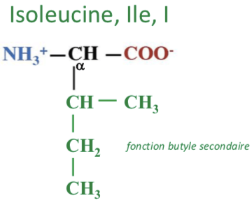
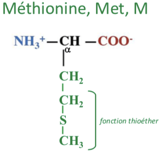
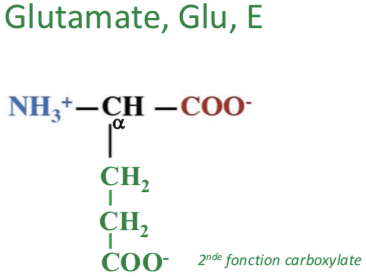
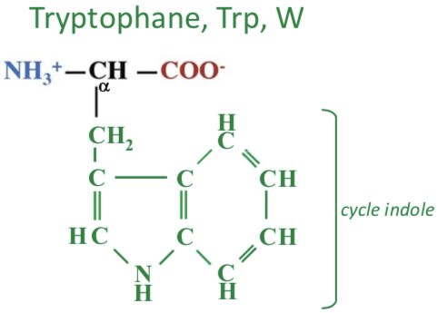

# Acides aminés

## Les acides aminés courant et rare

Il y a 21 acide aminés incorporés dans les protéines chez l'Homme

Un acide aminé rare présent dans certains micro organismes, la pyrrolysine

Acide aminé modifié : Hydroxyproline, Hydroxylysine, Phosphosérine

#### Listes et noms des acides amines

### Structure acides aminés

R est une chaine latéral propre à chaque acide aminé de composition, structure et masse très variable

### Unité de mesure des acides aminés

Pour les acides aminés l'unité utilisé est le dalton DA


* Acide aminé le plus léger : Glycine \(R = H, 1Da\) avec masse moléculaire 75 Da
* Acide aminé le plus lourd : Tryptophane \(R = 130 Da\) avec masse moléculaire 204 Da
* Masse moléculaire moyenne des acides aminés est de 110 Da


### Acide aminé à chaine carboné aliphatique

Acide aminé ou R chaine carboné est non aromatique

#### Glycine

Est le plus petit des acides aminés, avec un poid de 75Da, précurseur de nombreuse molécule \(Porphyrine, Créatine, Glutathion\), neurotransmetteur.

#### Alanine

Pèse environ 89 Da, deuxième acide aminé le plus présent \(après la leucine\), chaine latérale non polaire

#### Valine

Nom provient de la valériane \(Plante herbacée\), pèse 117 Da, Acide aminé essentiel, chaine latérale non polaire

#### Leucine

Acide Aminé le plus fréquent, pèse 131 Da, à un aspect de poudre blanche \(Leukos = Blanc\), Acide Aminé essentiel, Chaine latéral non polaire

#### Isoleucine

Pèse 131 Da, Isomère de leucine, Acide aminé essentiel, chaine latéral non polaire

### Acide aminé avec groupement alcool


R contient une fonction alcool


#### Sérine

Pèse 105 Da, homologue hydroxylé de l'alanine, chaine latéral polaire

#### Thréonine

Pèse 119 Da, Acide Aminé essentiel, chaine latéral polaire

### Acide Aminé avec du Soufre


R contient du Soufre


#### Cystéine

Pèse 121 Da, Chaine latéral polaire ionisable \(-SH / -S-\), non chargé à pH 7  
Homologue soufré de la sérine  
Ponts disulfures intra ou inter caténaires

#### Méthionine

Pèse 149 Da, Acide aminé N-terminal des protéines, Acide aminé essentiel

### Acide aminé avec fonction amine


R contient une fonction amine


#### Lysine

Pèse 146 Da, Acide aminé essentiel, chaine latérale polaire chargée à pH 7

#### Arginine

Pèse 174 Da, Chaine latérale polaire chargé à pH 7, Acide Aminé essentiel chez le nourrisson uniquement \(semi-essentiel\)

### Acides aminés avec une chaine latérale acide


R contient acide carboxylique


#### Aspartate

Pèse 133 Da, précurseur de l'asparagine, Chaine polaire chargé à pH 7

#### Glutamate

Pèse 147 Da, Découvert par action d'H2SO4 sur le gluten \(colle, partie protéique des grains de céréales\), chaine latérale polaire chargée à pH7

### Acides aminés avec fonction amide


R contient une fonction amide


#### Asparagine

Pèse 132 Da, Produit à partir de l'acide aspartique, chaine latérale polaire non ionisable

#### Glutamine

Pèse 146 Da, chaine latéral polaire non ionisable, **indispensable dans le métabolisme des bases azotées**

### **Acides aminés avec un cycle non aromatique**

#### **Histidine**

Pèse 155 Da, chaine latérale polaire ionisable \(=NH+ / =N\), non chargé à pH 7**.** Acide aminé essentielle chez les nourrisson uniquement \(semi-essentiel\)

#### Proline

Pèse 115 Da, C alpha fait partie du cycle, seul acide aminé représentant une amine secondaire. Chaine latéral non polaire. **Acide aminé à la base de la structure de la triple hélice de collagène.**

### **Acides aminés avec un cycle aromatique**


R contient un cycle aromatique \(cycle composé que de carbone centrales\)


**Phenylalanine**

Pèse 165 Da, Acide Aminé essentiel, chaine latérale non polaire.

**Tyrosine**

Pèse 181 Da, chaine latérale polaire non chargé à pH 7 et ionisable \(-OH / -O-\). Présence d'une fonction phénol, du grec "tyri" \(fromage\) -&gt; découvert dans la caséine.

**Tryptophane**

Pèse 204 Da, chaine latérale non polaire, le plus rare des 21 acides aminés, acides aminé essentiel.

## Technique d'analyse des acides aminés

### Analyse par électrophorèse

Méthode de séparation de molécules  
Basé sur la différence d'affinité des molécules : Pour une phase stationnaire ou fixe \(solide ou liquide\) et une phase mobile \(liquide \(CPL\) ou gazeuse \(CPG\)\)

4 Grands type de chromatographie, en fonction de la propriété physico-chimique sur laquelle repose la séparation : 

* Poids moléculaire : Chromatographie d'exclusion / Gel-filtration / Tamisage moléculaire
* Polartié : chromatographie hydrophobe
* Charge : chromatographie échangeuse d'ions \(cations ou anions\)
* Affinité : chromatographie d'affinité

### Analyse par chromatographie

Colonne, par gravité ou sous pression \(FPLC, fast performance liquid chromatography\)

#### Chromatographie ionique ou échangeuse d'ions

Phase stationnaire : billes de polymère chargées  
Séparation de molécules de charges différentes  
Séparation des AA en fonction de leur pHi et du pH de la colonne, ou de la force ionique  
Sortie des molécules = élution


Elution :  Séparation de deux substances adsorbées, entrainées par un solvant.


### Dosage par polarimétrie

A part la glycine, tous les acides aminés sont des molécules chirale \(asymétrique\);   
Chirale : Possèdent un Carbone asymétrique \(C\) avec 4 substituants différents. Molécules asymétrique il y a donc deux formes non superposables et donc deux formes images l'une de l'autre dans un miroir, appelée énantiomères; Les acides aminé peuvent donc être de série D ou L  
L'ordre est toujours : NH3 -&gt; COO -&gt; R -&gt; H

Les acides aminés protéinogènes sont de série L  
Pour identifier les formes D et L d'un AA on peut utiliser les propriétés physiques, notamment les propriété optiques différentes avec la loi de BIOT, avec le pouvoir rotatoire spécifique

Les molécules lévogyre \(-\) dévie la lumière vers la gauche alors que les molécules dextrogyre \(+\) dévie la lumière vers la droite \(Aucun rapport avec la série D et L\)

### Dosage par spectrométrie

La plupart des acide aminés n'absorbent pas la lumière visible -&gt; Leur solution sont incolores  
Seuls les acides aminés avec un noyau aromatique \(Phénylalanine, Tyrosine, Tryptophane\) absorbent dans l'ultraviolet \(UV\)

