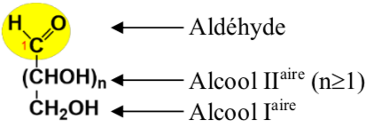

# Biochimie

## Introduction

Les glucides on plusieurs utilités

* En tant que réserve
  * Glycogène chez les animaux \(80-110g dans le foie, muscle glycogène 400-500g\)
  * Amidon chez les animaux
* Élement de structure
  * Cellulose dans les parois des végétaux
  * La chitine dans l'exosquelette d'invertébré
* Composant de molécule essentielles
  * Le riboze dans l'ATP \(adénosine triphosphate\)
  * Le riboze et le désoxyribose dans les acides nucléiques

### Classification des glucides


**Osides :** Ils contiennent des oses liés par des liaisons covalentes, liaisons osidiques

**Hétérosides :** Partie glucidique et partie non glucidique \(Protéine, lipide etc\)

**Holosides :** Ne contient que des oses

**Oligosides :** Le nombre de oses est de 2 à 10

**Polyosides :** Le nombre de oses est supérieur à 10


#### Notion d'unité


**Ose :** Monomère / **Polyoside :** Polymère

**Acide aminée :** monomère / **Protéine :** Polymère


## Oses \(Monosaccharides\)

### Formule d'un ose


 $$C_nH_{2n}O_n$$ noté aussi $$C_n(H_2O)_n$$ 

Les **oses** sont **polyalcools** et contenant un **carbonyle** \(**Aldéhyde** ou **Cétone**\) [Voir nomenclature et fonction](https://kevinrousseau80.gitbook.io/licence-svt/biomolecule/chimie-organique#fonction-chimie-organique)


#### Exemple glucose

La formule brut du glucose est $$C_6H_{12}O_6$$ et sa masse moléculaire est de   
$$(6\times12)+(12\times 1)+(16\times 12)=180g.mol^{-1} \ ou \ Dalton$$ 

#### Formule générale d'un aldose


Un aldose à forcément un alcool secondaire ou plus, et l'aldéhyde est numéroté 1 dans la nomenclature


#### Formule générale d'un cétose


Un cétose n'a pas forcément d'alcool secondaire et le cétone est forcément numéroté 2 en nomenclature


#### Formule des alcools primaires, secondaires et tertiaires

#### Classification des oses


Les oses peuvent être classés en fonction de leur nombre d'atome de carbones

Aldo**pent**ose \(5 carbones\) ou Céto**hex**ose \(6 carbones\)


## Définition





