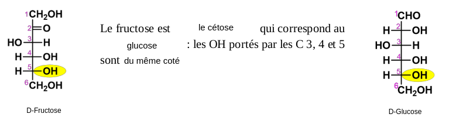

# Biochimie

## Introduction

Les glucides on plusieurs utilités

* En tant que réserve
  * Glycogène chez les animaux \(80-110g dans le foie, muscle glycogène 400-500g\)
  * Amidon chez les animaux
* Élement de structure
  * Cellulose dans les parois des végétaux
  * La chitine dans l'exosquelette d'invertébré
* Composant de molécule essentielles
  * Le riboze dans l'ATP \(adénosine triphosphate\)
  * Le riboze et le désoxyribose dans les acides nucléiques

### Classification des glucides


**Osides :** Ils contiennent des oses liés par des liaisons covalentes, liaisons osidiques

**Hétérosides :** Partie glucidique et partie non glucidique \(Protéine, lipide etc\)

**Holosides :** Ne contient que des oses

**Oligosides :** Le nombre de oses est de 2 à 10

**Polyosides :** Le nombre de oses est supérieur à 10


#### Notion d'unité


**Ose :** Monomère / **Polyoside :** Polymère

**Acide aminée :** monomère / **Protéine :** Polymère


## Oses \(Monosaccharides\)

### Formule d'un ose


 $$C_nH_{2n}O_n$$ noté aussi $$C_n(H_2O)_n$$ 

Les **oses** sont **polyalcools** et contenant un **carbonyle** \(**Aldéhyde** ou **Cétone**\) 


#### Exemple glucose

La formule brut du glucose est $$C_6H_{12}O_6$$ et sa masse moléculaire est de   
$$(6\times12)+(12\times 1)+(16\times 12)=180g.mol^{-1} \ ou \ Dalton$$ 

#### Formule générale d'un aldose


Un aldose à forcément un alcool secondaire ou plus, et l'aldéhyde est numéroté 1 dans la nomenclature


#### Formule générale d'un cétose


Un cétose n'a pas forcément d'alcool secondaire et le cétone est forcément numéroté 2 en nomenclature


#### Formule des alcools primaires, secondaires et tertiaires

#### Classification des oses


Les oses peuvent être classés en fonction de leur nombre d'atome de carbones

Aldo**pent**ose \(5 carbones\) ou Céto**hex**ose \(6 carbones\)


### Isomérie


* Une molécule chirale possède au moins un carbone stéréogène \(Centre chiral, noté C\*\)
* Nomenclature absolue du centre chiral : Règle séquentielles de Cahn, Ingold, Prélog
  * Les 4 substituants sont classé par ordre de priorité selon l'ordre décroissant des numéros atomiques des atomes liés au C\* \(a&gt;b&gt;c&gt;d\)
  * On regarde suivant l'atome qui est derrière \(Ici d\)
  * Séquence a,b,c
    * Sens des aiguilles d'une montre : configuration R \(rectus\)
    * Sens contraire des aiguille d'une montre : configuration S \(sinister\)
* 2 isomères sont l'image l'un de l'autre dans un miroir, qui ne peuvent pas être superposées. Ce sont 2 énantiomère


#### Différentes représentation des isomère


En biochimie la projection de Fisher est la plus utilisée, de ce fait on regarde dans le sens de visé du carbone stéréogène entre l'hydrogène et l'alcool \(OH\)



* L'énantiomère D \(dexter\), le OH porté par le C\* est à droite
  * Aussi appeler énantiomère R
* L'énantiomère L \(Laevus\), le OH porté par le C\* est à gauche 
  * Aussi appeler énantiomère S


### Filiation

Tableau pour la série D des aldoses et cétoses, valable à gauche si l'alcool est à gauche et ainsi nommé série L


Tous les oses sont classés dans deux catégories. Cette classification repose sur la position de la fonction alcool secondaire porté par le carbone stéréogène le plus éloigné de la fonction aldéhyde ou cétone

* Si le groupe OH est à gauche sur la projection de Fisher l'ose appartient à la série L
* Si le groupe OH est à droite sur la projection de Fisher l'ose appartient à la série D

La plus grande majorité des oses naturels sont de série D


### Aldoses

Les aldoses sont des oses qui ont une fonction aldéhyde en sur le premier carbone.

#### Aldotrioses


Les aldotrioses aussi appelé Glycéraldhéyde ont une chaîne carbonée principale de 3 carbones et un seul carbone stéréogène, il y a donc 2 stéréiosomère et un couple d'énantiomère


#### Aldotétroses


Les aldotétroses aussi appelés Erythrose si tous les alcool sont du même cotés ou alors Thréose si les alcools sont alternés ont une chaîne carbonée principale de 4 carbones et 2 carbones stéréogènes, il y a donc 4 stéréiosomère et 2 couple d'énantiomère



**Épimère :** Deux isomères qui ne **diffèrent que par la configuration d'un seul carbone** stéréogène

Ici le L-Thréose est l'épimère en 3 du D-Erythrose


#### Aldopentoses


Les aldopentoses ont une chaîne carbonée principale de 5 carbones et 3 carbones stéréogènes, il y a donc 8 stéréiosomères et 4 couple d'énantiomère  
Ici ça sera le D-Ribose qui est important


#### Aldohexoses


Les aldohexoses ont une chaîne carbonée principale de 6 carbones et 4 carbones stéréogènes, il y a donc 16 stéréiosomères et 8 couples d'énantiomères  
Ici ça sera le D-Glucoses qui est très important et le D-Mannose et D-Galactose important


### Cétoses


Le cétose le plus simple n'a pas de centre chiral, c'est le **Déhydroxyacétone.** Les cétoses on une fonction cétone au carbone 2 


#### Cétotétroses


Les cétotétroses ont une chaîne principale carbonée de 4 carbones et 1 seul carbone stéréogènes, soit 2 stéréoisomères et 1 couple d'énantiomère


#### Cétopentoses


Les cétotétroses ont une chaîne principale carbonée de 5 carbones et 2 carbones stéréogènes. Soit 4 stéréoisomères et 2 couples d'énantiomères


#### Cétohexoses


Les cétohexoses ont une chaîne principale carbonée de 6 carbones et 3 carbones stéréogènes. Soit 8 stéréoisomères et 4 couples d'énantiomères. Le cétohexose le plus important est le Fructose. Il ressemble fortement au glucose.  
Liste des cétohexoses, D- et L-Psicose, **D- et L-Fructose**, D- et L-Sorbose, D- et L-Tagatose


## Définition





