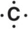

# Biomolécule A

## Hybridation des orbitale atomique


**Les liaisons** résultent de la mise en commun d'un doublet électronique entre deux atomes

**Les orbitales hybrides** permettent de simuler la **déformation des orbitales atomiques.**

C'est grâce à l'état excité de l'atome qui peut y avoir des orbitale hybride.


4 Orbitales atomiques contenant chacune 1 électron donne 3 possibilité de combinaisons.

### Hybridation Sp3 $$Sp_3$$ \(Tétragonal\)


L'un des atomes utilisant cette hybridation est le $$Carbone \ Sp_3$$ \(Liaisons simple\)


$$1 \ OA_s+3 \ OA_p$$ --&gt;  

Les 4 orbitales hybride sont orientés suivant 4 directions d'un **tétraèdre régulier**.   
Chaque orbitale hybride fait un angle de **109.28°** avec ses voisines et **contient 1 électron**.  
Les 4 électrons seront engagés dans **4 liaisons** $$\sigma$$\(sigma\)\(Recouvrement axial\)

### Hybridation Sp2 $$Sp_2$$ \(Trigonal\)


L'un des atomes utilisant cette hybridation est le $$Carbone \ Sp_2$$ 


$$3Oh \ sp_2 + 1 \ OA \quad libre \ \pi$$ --&gt;  

### Hybridation Sp $$Sp$$

$$1 \ OA_s + 1\ OA_p$$ --&gt;  

2 orbitales p "pures" **orthogonales** aux 2 orbitales Hybrides

### Etat fondamentale et excité de l'azote et de l'oxygène


Liaison orbitale atomique "classique" est nommé $$\sigma$$ \(sigma\)

Liaison orbitale hybride est nommé $$\pi$$ \(pi\)


#### Azote

* Hybridation sp3
* Hybridation sp2 
* Hybridation sp

#### Oxygène

* Hybridation sp3
* Hybridation sp2

## Couche de valence des atomes principaux de la chimie organique

* [ ] Faire un tableau périodique des principaux éléments de la chimie organique avec leurs électrons de valence


Le nombre d'électrons de valence correspond au nombre d'électrons disponible sur la couche externe de l'atome


### Tableau récapitulatif des électrons de valences

| Atome | Nb d'électrons  de valences | Valence + Doublet non liant | Forme des liaisons |
| :--- | :---: | :--- | :---: |
| H | $$1e^-$$  | Valence 1 |    |
| C | $$4e^-$$  | Valence 4 |   |
| N | $$5e^-$$  | Valence 3 + 1 Doublet  non liant |   |
| O | $$6e^-$$  | Valence 2 + 2 Doublet  non liant |   |
| F \(Cl , Br, I\) | $$7e^-$$  | Valence 1 + 3 Doublet  non liant |   |

## Structure de Lewis

Il existe différentes types de liaisons


#### Définitions

_**Liaison Ionique :**  Liaison faible électrostatique entre deux groupements de signe opposés ou entre un anion et un cation_

_**Liaison Covalente :** L_iaison chimique dans laquelle deux atomes se partagent deux électrons \(un électron chacun ou deux électrons venant du même atome\) d'une de leurs couches externes afin de former un doublet d'électrons liant les deux atomes. C'est une des forces qui produit l'attraction mutuelle entre atomes.

_**liaison covalente de coordination :**_ \(anciennement connue sous le nom de liaison dative\) est une description de la liaison covalente entre deux atomes pour lesquels les deux électrons partagés dans la liaison proviennent du même atome.


### Environnement électronique d'un atome

Il existe 3 différentes règles pour représenter en deux dimension la structure électronique des atomes dans une molécule.


_**Règle générale :**_ Les atomes se lient entre eux de manière à acquérir si possible la configuration électronique du gaz rare le plus voisin dans la classification périodique.

_**Règle du duet :**_ l'Atome d'Hydrogène se lie de manière à a ce que sa couche de valence comporte un duet d'électron

_**Règles de l'octet :**_ Tous les autres atomes se lient entre eux de manière à ce que leur couche de valence comporte, si possible, un octet d'électrons


* Atomes avec couche de valence à 1 au extrémité
* Atome avec couche de valence plus élevé au centre
* On détermine le nombre $$\nu $$ \(Nu\) d'électrons de valence et on en déduit $$\nu/2$$ paire d'électrons à répartir

### Ecriture sous forme brut

On priorise le carbone et l'hydrogène, et ensuite par ordre alphabétique

$$C_n H_x$$ 

