# Biomolécule A

## Hybridation des orbitale atomique


**Les liaisons** résultent de la mise en commun d'un doublet électronique entre deux atomes

**Les orbitales hybrides** permettent de simuler la **déformation des orbitales atomiques.**

C'est grâce à l'état excité de l'atome qui peut y avoir des orbitale hybride.


4 Orbitales atomiques contenant chacune 1 électron donne 3 possibilité de combinaisons.

### Hybridation Sp3 $$Sp_3$$ \(Tétragonal\)


$$Csp_3$$ = 4 liaisons simples $$\sigma$$ 

Qui est constitué que de liaisons simple.


#### Exemple pour le carbone Sp3

$$1 \ OA_s+3 \ OA_p$$ --&gt;  

Les 4 orbitales hybride sont orientés suivant 4 directions d'un **tétraèdre régulier**.   
Chaque orbitale hybride fait un angle de **109.28°** avec ses voisines et **contient 1 électron**.  
Les 4 électrons seront engagés dans **4 liaisons** $$\sigma$$\(sigma\)\(Recouvrement axial\)

### Hybridation Sp2 $$Sp_2$$ \(Trigonal\)


$$Csp_2$$ = 3 Liaisons $$\sigma$$ et une liaison $$\pi$$ 

Une hybridation Sp2 est constitué d'au moins une liaison double 


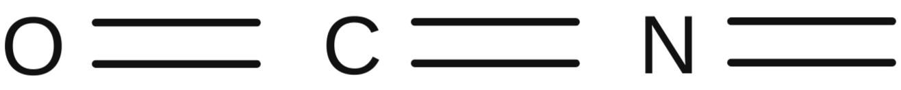

$$3Oh \ sp_2 + 1 \ OA \quad libre \ \pi$$ --&gt;  

### Hybridation Sp $$Sp$$ \(Linéaire\)


$$Csp_2$$ =  2 Liaisons $$\sigma$$ et 2 liaisons $$\pi$$ 

Qui est constitué d'une liaison triple


$$1 \ OA_s + 1\ OA_p$$ --&gt;  

2 orbitales p "pures" **orthogonales** aux 2 orbitales Hybrides

### Etat fondamentale et excité de l'azote et de l'oxygène


Liaison orbitale atomique "classique" est nommé $$\sigma$$ \(sigma\)

Liaison orbitale hybride est nommé $$\pi$$ \(pi\)


#### Azote

* Hybridation sp3 \(3 Liaisons simples\)
* Hybridation sp2 \(1 Liaison double\)
* Hybridation sp \(1 Liaison triple\)

#### Oxygène

* Hybridation sp3 \(2 Liaison Simples\)
* Hybridation sp2 \(1 Liaison double\)

## Couche de valence des atomes principaux de la chimie organique


Le nombre d'électrons de valence correspond au nombre d'électrons disponible sur la couche externe de l'atome


### Tableau récapitulatif des électrons de valences

| Atome | Nb d'électrons  de valences | Valence + Doublet non liant | Forme des liaisons |
| :--- | :---: | :--- | :---: |
| H | $$1e^-$$  | Valence 1 |    |
| C | $$4e^-$$  | Valence 4 |   |
| N | $$5e^-$$  | Valence 3 + 1 Doublet  non liant | 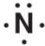  |
| O | $$6e^-$$  | Valence 2 + 2 Doublet  non liant | 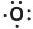  |
| F \(Cl , Br, I\) | $$7e^-$$  | Valence 1 + 3 Doublet  non liant |   |

## Structure de Lewis

Il existe différentes types de liaisons


#### Définitions

_**Liaison Ionique :**  Liaison faible électrostatique entre deux groupements de signe opposés ou entre un anion et un cation_

_**Liaison Covalente :** L_iaison chimique dans laquelle deux atomes se partagent deux électrons \(un électron chacun ou deux électrons venant du même atome\) d'une de leurs couches externes afin de former un doublet d'électrons liant les deux atomes. C'est une des forces qui produit l'attraction mutuelle entre atomes.

_**liaison covalente de coordination :**_ \(anciennement connue sous le nom de liaison dative\) est une description de la liaison covalente entre deux atomes pour lesquels les deux électrons partagés dans la liaison proviennent du même atome.


### Environnement électronique d'un atome

Il existe 3 différentes règles pour représenter en deux dimension la structure électronique des atomes dans une molécule.


_**Règle générale :**_ Les atomes se lient entre eux de manière à acquérir si possible la configuration électronique du gaz rare le plus voisin dans la classification périodique.

_**Règle du duet :**_ l'Atome d'Hydrogène se lie de manière à a ce que sa couche de valence comporte un duet d'électron

_**Règles de l'octet :**_ Tous les autres atomes se lient entre eux de manière à ce que leur couche de valence comporte, si possible, un octet d'électrons


* Atomes avec couche de valence à 1 au extrémité
* Atome avec couche de valence plus élevé au centre
* On détermine le nombre $$\nu $$ \(Nu\) d'électrons de valence et on en déduit $$\nu/2$$ paire d'électrons à répartir

### Ecriture sous forme brut

On priorise le carbone et l'hydrogène, et ensuite par ordre alphabétique

$$C_n H_x$$ 

## Théorie de VSEPR

L’écriture de VSEPR consiste à étudier la géométrie d'un atome A en regardant le nombre d'atome X ou de doublet non liant E qui l'entoure.  
La formule s'écrit donc $$AX_nE_m$$ 


Il existe 3 principales géométries en chimie organique

* $$AX_4$$ \(Tétraédrique / Trigonal\)
* $$AX_3$$ \(Trigonale / Plane\)
* $$AX_2$$ \(Diagonale / linéaire\)


### Tableau récapitulatif des forme géométrique

## Représentation plane \(Topologique\)

Les formules moléculaires peuvent s'écrire de différentes manières, développé, semi-développé et topologique. Pour des raison de simplicité et de cohérence géométrique.

**Développé :**  

**Semi-développé :** $$H_3C-CH_2-CH_2-CH_3$$ 

**Topologique :**  


Atome autre que le Carbone on précise l'hydrogène


Butane - 1 - ol :  


Triple liaison carbone, il n'y à pas d'hydrogène



#### Tips

Si il y a un nombre impaire d'atome d'azote \(N\) alors il y aura un nombre impaire d'atome d'hydrogène \(H\)


## Fonctions moléculaire

### Hydrocarbure

Une molécule de formule brut $$C_nH_m$$ sera appelée hydrocarbure saturé si $$m = 2n+2$$ et insaturé ou cyclique si $$m < 2n+2$$ 


Catégorie de molécules organique formée exclusivement de carbone et d'hydrogène qui constitue l'essentiel des combustibles fossiles.


* Alcane    --&gt; $$C_nH_{2n+2}$$ 
* Alcènes  --&gt; $$C_nH_{2n}$$ 
* Alcyne    --&gt; $$C_nH_{2n-2}$$ 

Il est possible de calculer le nombre d'insaturation et/ou Cycle d'une molécule d'hydrocarbure.  
Avec la formule qui utilise ces atomes $$C_x \ H_y \ N_z \ X_u$$ \(X correspond au Fluor, Chlore, Brome et Iode\)

On recherche donc le nombre n d'insaturation et/ou cycle

$$
n=x-\frac{y}{2}+\frac{z}{2}-\frac{u}{4}+1
$$


#### Exemple

Si le nombre n est 2 il y a 4 possibilités de liaison/cycle

* 2 liaisons double
* 1 liaison triple
* 1 liaison double et 1 cycle
* 2 cycles

Une liaison double correspond à $$n=1$$ et une liaison triple à $$n = 2$$ 


### Fonction chimie organique


La **valence** d'une fonction **correspond** au **nombre** **d'atome** **d'hydrogène** qui ont été **substitués** par un **hétéro-atome** en se référant à **l'alcane** **saturé** **correspondant**


## Nomenclature

### Exemple nomenclature

#### Hydrocarbure


* Trouver la chaine **carbonée** la plus **longue** et la nommer
* Retrouver les **insaturations** présentes sur cette chaines carbonée
* Retrouver tous les **substituants** sur la chaine carbonée **\(Alcane, Alcène, Alcyne \(Liaison simple, double, triple\)\)**
* **Numéroter** les **atomes** de **carbones** de la chaine carbonée en commençant par **l'extrémité** le plus **proche** de **l'insaturation** la plus **propriétaire** ou alors d'un **substituant**
* **Ranger** les **substituants** dans l'ordre **alphabétique**, chacun étant **précédé** du **numéro** de l'atome de carbone de la chaine cartonné auquel il est lié, puis ajouter la racine de **l'alcane** correspondant à la chaine carbonée,  et pour finir **l'insaturation** **précédée** du **numéro** de **l'atome** de **carbone** de la chaine carbonée qui **débute** cette insaturation


#### Molécules fonctionnelles


* Trouver la **chaine** **carbonée** la plus **longue** et la nommer
* Retrouver les **fonctions** et les **insaturations** présentes sur cette chaine carbonée
* **Numéroté** les **atomes** de **carbones** de la chaine carbonée en commençant par **l'extrémité** le plus **proche** de la **fonction** **prioritaire**. Les **insaturations** ne sont pas **considérées** comme **fonction**, et seront **mises** en **suffixe** **d'insaturation**
* Ranger les **fonctions** non **prioritaires** par **ordre** **alphabétique**, chacun étant **précédée** du **numéro** de **l'atome** de **carbone** de la chaine carbonée auquel elle est liée, puis ajouter la **racine** de **l'alcane** correspondant à la chaine carbonée, **ajouter** le **suffixe** **d'insaturation** précédé du numéro de l'atome de carbone de la chaine carbonée, et finir le nom ****par le **suffixe** de la fonction **prioritaire** **précédé** du **numéro** de **l'atome** de **carbone** de la chaine carbonée auquel elle est liée


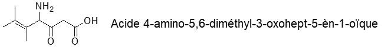


* Ether Oxyde n'est jamais prioritaire


### Exercice 5-2

#### Molécule A

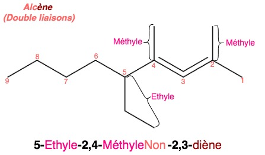

#### Molécule B

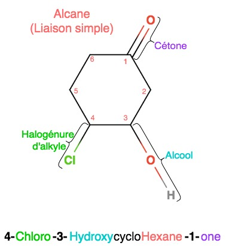

#### Molécule C

#### Molécule F

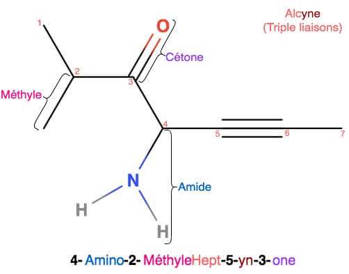

## Isomérie de constitution

Si les molécules possède la même formule brut elles peuvent se distinguer en 3 types possibles.

* Isomérie de squelette -&gt; chaîne carboné principale différente  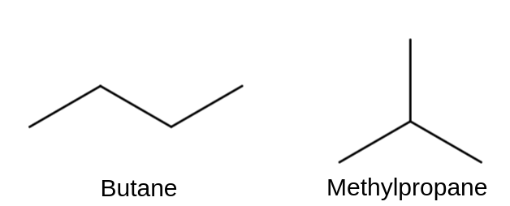 
* Isomérie fonctionnelle -&gt; position des fonctions  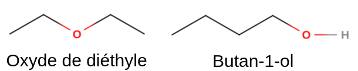 
* Isomérie de position -&gt; Groupe fonctionnel sur une position différente  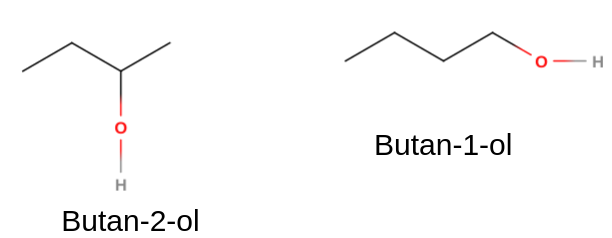 


Un isomère de constitution est parfaitement déterminé lorsque l ’on connaît :

* son squelette carboné
* son groupe fonctionnel ou insaturation
* la position où ce groupe est fixé sur le squelette.

Il est alors représenté au moyen d ’une formule plane.


#### Mise en place de l'isomérie

## Représentation

La Stéréoisomérie est la différence de disposition des atomes dans l'espace, il existe plusieurs méthode de représentation des structures tridimensionnelle comme les représentation de Cram et de Newman, dont le point commun est la perspective Cavalière.

### Représentation Cram

### Représentation  Perspective Cavalière

### Projection de Fischer


Ce mode de représentation est utilisé essentiellement dans la chimie des sucres.

**Chaîne carbonée verticale avec le carbone le plus oxydé** \(de plus faible indice\) vers le haut.


1. Projection en deux dimension, 1er chaîne carbonée la plus longue vertical 
2. Fonction la plus oxydée en haut \( $$CO_2H>CHO>CH_2OH>CH_3$$ \)
3. Carbone extrémité en arrière

### Projection de Newman


* La molécule est regardée dans l’axe de la liaison entre deux atomes voisins.
* l’atome de devant est représenté par un cercle ; l’atome de derrière est

  masqué par celui de devant.


### Conformation cyclohexane

Il existe deux conformations, conformation "chaise" et conformation "bateau". Du fait de sa grand instabilité, à température ambiante, la conformation "bateau" et très peu présente. Dans la conformation chaise il existe :

* 6 liaisons axiales \(Ax\) perpendiculaires au "plan moyen du cycle" et disposées de part et d'autre de ce plan, respectivement vers le haut et vers le bas
* 6 liaisons équatoriales \(Eq\) faisant un angle faible \(15°\) avec ce plan moyen, également alternées par rapport à lui

Le **conformère** **chaise** le plus **stable** est celui qui met tous les **substituants** \(atome ou groupe d'atome qui substitue l'hydrogène\) en position **équatorial**. S'il n'est pas possible d'avoir tous les **substituants** en position **équatoriale**, le **plus** **stable** est celui qui a le regroupement le plus **volumineux** en position **équatoriale** afin **d'éviter les interactions di-axiale 1-3**

Si un **cycle** porte **deux** **substituants** sur **deux** **atomes** **différents**, alors il existe une isomérie cyclanique en fonction de leur position relative. On parlera d’isomérie **cis** si les deux substituants sont du même **côté** du **plan** moyen du **cycle**, et d’isomérie **trans** s’ils sont de **part** et **d’autre** du **plan** moyen du **cycle**.

## Stéréoisomérie de conformation


 Deux isomères sont des composés ayant la même formule brute mais dont les molécules sont différentes

Des **stéréoisomères** sont des composés ayant **même formule de constitution** \(même chaîne carbonée, mêmes fonctions dans les mêmes positions\) et qui **différent** par **l’agencement spatial** de leurs **atomes**.  
Les différents arrangements des atomes qui résultent de la rotation autour d’une liaison simple sont appelés **conformations** et une conformation particulière est appelée **conformère**.


### Cas de l'éthane


L'ethane $$CH_3 - CH_3$$  constitue l’exemple le plus simple de la chaîne saturée acyclique formée par un enchaînement de 2 carbones reliés par une liaison simple s . Autour de cette liaison, il peut y avoir possibilité de rotation.

Les 2 groupes CH3 peuvent tourner librement l’un par rapport à l’autre. On a donc une infinité d’arrangements différents qui sont des conformations différentes de la même molécule.



Il existe **deux** **conformation** **particulières**

* Conformation **éclipsé** \(Chaque atome d'hydrogène sont vis à vis les uns des autres\)
* Conformation **décalé** \(Les atomes d'hydrogènes sont décalé au maximum les uns des autres\)

On passe d'une conformation à l'autre par des rotations de 60 degrés



On dit que 2 conformations décalées successives sont séparées par une **barrière d’énergie** \(ou **barrière de potentiel**\) qui vaut dans l’éthane 12,5 KJ.mol-1.  
La **rotation a donc lieu en permanence**, mais, statistiquement, à un instant donné, il y a dans l’éthane **plus de molécules décalées** \(plus stables\) que de molécules éclipsées.  
A tout moment elle se modifie, et cela **exclut d’ailleurs que l’on puisse isoler les molécules possédant une certaine conformation**.


### Cas du cyclohexane


 Le **cycle cyclohexanique présente un intérêt particulier** car il est présent dans la structure de nombreux composés naturels \(stéroïdes, terpènes...\)  
Le cyclohexane peut prendre deux conformations principales dénommées « **forme chaise** » et « **forme bateau** ».


### Isomérie cis trans dans les cyclohexane

#### Substitution en 1,2

#### Substituant identique

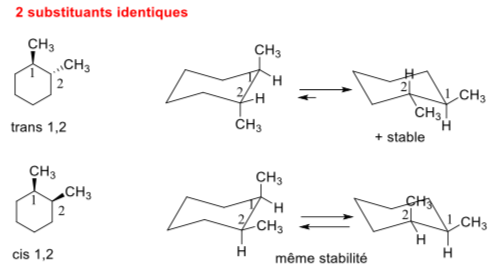


* Dans le cas **Trans 1,2**, comme les substituant sont **identiques**, ils prennent la **même** **place** dans **l'espace** et sont donc **plus stable** lorsque les deux substituants sont en position équatorial, car il y a le **moins** **d'interactions** **diaxiales** **1,3**.
* Dans le cas **Cis 1,2**, les deux conformations sont **identiques** et ont donc la **même stabilité**


#### Substituants différents

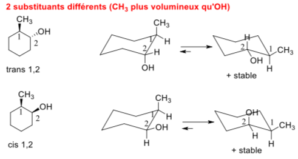


* Dans le cas **Trans 1,2**, comme les **substituants** sont **différents**, il faut tenir compte de leur **place** dans **l'espace**. L' $$OH$$ prend moins de place que le $$CH_3$$ , donc la conformation la plus stable sera celle qui aura en position équatorial le substituant le plus volumineux, ici le $$CH_3$$
* Dans le cas **Cis 1,2**, la conformation la plus stable est celle qui a le **substituant** le **plus volumineux** en position **équatorial** et **minimise les interactions diaxiales 1,3**


#### Substitutions 1,3

#### Substituants identiques

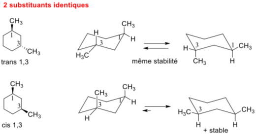


* Dans le cas de **Trans 1,3**, comme les substituant sont **identiques**, ils prennent la **même** **place** dans **l'espace** et ont donc une **stabilité** **équivalente** peut importe la conformation chaise.
* Dans le cas **Cis 1,3**, la conformation la plus stable est celle ou les **substituants** sont tous en **positions** **équatorial**


#### Substituants différents

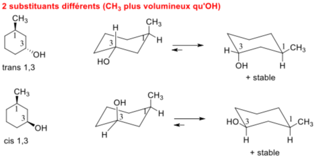


* Dans le cas **Trans 1,3**, la conformation la plus stable est celle qui à le **substituant** le plus **volumineux** en position **équatorial**
* Dans le cas **Cis 1,3**, la conformation la plus stable est celle qui qui à les **deux** **substituants** en positions **équatorial** et **minimise donc les interactions diaxiales 1,3**


## Stéréoisomérie de configuration


 Les **stéréoisomères de configuration** sont des composés ayant **la même  
 formule de constitution** \(même chaîne carbonée, mêmes fonctions dans les mêmes positions\) et qui **différent par l’agencement spatial** des **atomes** **sans tenir compte des dispositions différentes dues aux rotations autour de simples liaisons** \(-&gt; stéréoisomères de conformation\).  
Ce sont des molécules différentes, que l’on peut **isoler** et **transformer l’une en l’autre** **qu’après rupture et formation d’au moins une liaison covalente**. Il n’y a **pas d’équilibre** entre elles.


### Définition


**Chiralité :** un composé chimique est dit chiral \(du grec χείρ : la main\) s'il n'est pas superposable à son image dans un miroir

**Achiralité :** qui n'est pas chirale

**Énantiomères :** stéréoisomères qui sont images l’un de l’autre dans un miroir \(par rapport à un plan\) et qui ne sont pas superposables

**Diastéréoisomères :** stéréoisomères qui ne sont pas images l’un de l’autre dans un miroir et qui ne sont pas superposables

**Carbone stéréogène :** Carbone $$sp^3$$ ayant **4 liaisons** $$\sigma$$ avec des **substituants différents \(atomes** ou **groupes d'atomes différents\)**


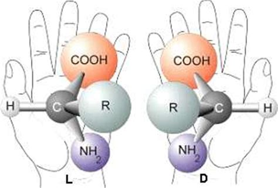

#### Chirale


On dit qu'une molécule est **chirale** si :

1. Elle a **un carbone stéréogène**
2. Elle n'a **pas de centre de symétrie** ou de **plan de symétrie.**
3. Elle a **plusieurs carbones stéréogènes** avec des **substituants différents** 


#### Achirale


On dit qu'une molécule est **achirale** si :

1. Elle **n'a pas de carbone stéréogène**
2. Elle **à un plan, un axe ou un centre de symétrie**


### Énantiomère


Stéréoisomères qui sont images l’un de l’autre dans un miroir \(par rapport à un plan\) et qui ne sont pas superposables, ce sont donc des **molécules** **chirales**


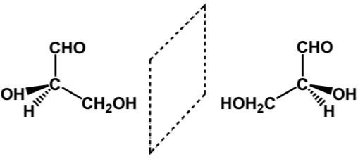

### Activité optique 

### Configuration absolue

### Diastéréoisomérie

