# Concentration et PH

## Solution


Une solution est constitué d'une espèce chimique appelée **soluté**, dissoute dans un liquide appelé **solvant**.  
Une solution aqueuse est une solution dont le **solvant est l'eau.**


### **Grandeur caractéristique**

#### **Solution global**

* Volume V en litre \(L\)
* Masse m en gramme \(g\)
* Masse volumique en $$\rho$$= masse d'un litre de solution $$\rho = \frac{m}{V} (g/L)$$
* Densité \(sans unité\) $$d=\frac{\rho}{\rho_{(eau)}}$$ $$\rho{(eau)}=1kg/L=1000g/L$$

#### Soluté

* masse de X : $$m_x$$\(g\)
* masse molaire du soluté X : $$M_x$$\(g/mol\) Mx représente la masse d'une mole du soluté X ou la somme des masses molaires atomiques des éléments
* Quantité de matière ou nombre de moles de soluté X dissous : $$n_X$$ \(mol\) Avec $$n_X=\frac{m_x}{M_x}$$
* Concentration molaire en X : Cx \(mol/L\) $$C_x=\frac{n_x}{V}$$
* Titre massique ou concentration massique en X : tx \(g/L\) $$t_x=\frac{m_x}{V}$$

#### Relation entre grandeur

$$t_x=C_x\times M_x$$   &lt;--&gt;  $$t_x=W_x\times \rho = W_x\times d \times \rho_{eau }$$  
Soit   
$$C_x=\frac{W_x \times d \times \rho_{eau}}{M_x}$$

### Notion de PPM

1ppm = 1mg dans $$10^6$$mg de solution, soit **1ppm = 1mg de soluté dans 1L de solution**

## Molécule d'eau

Molécule polaire, coudée et non linéaire. Électronégativité de Oxygène &gt; Hydrogène. A l'inverse les hydrocarbure sont des composée apolaire  
Composé polaire -&gt; Hydrophile  
Composé apolaire -&gt; Hydrophobe

3 étapes :   
- Séparations des molécules de soluté  
- Séparation des molécules de solvant  
- Formation d'interaction soluté-solvant

## Force intermoléculaire

### Introduction

#### Il existe 3 états de la matière :

* Gazeux : Molécule éloignée, pas de volume, pas de forme propre
* Solide : Contact ainsi que **forme et volume propre**
* Liquide : Contact entre molécules, **Volume propre** sans forme propre

Liquide et solide : état condensé de la matière \(contact entre molécule\)

#### Changement d'état

Transformation avec température qui diminue : Gaz -&gt; Liquide -&gt; Solide  
Il y a rapprochement des molécules et perte d’énergie cinétique \(vitesse diminue\)  
Ce changement d'état est liée aux force attraction entre les molécule liées à des interaction électrostatique.  
Cohésion des liquides et des solides.  
Plus la force d'attraction augmente =&gt; plus la cohésion augmente

#### 3 Types de liaisons

* **Liaison forte**, mise en commun de deux électrons entre deux atomes :  Liaison covalente $$N_2$$ / Liaison dative $$^+NH_4$$ / Liaison ionique $$NaCl$$ Energie : quelque centaine de $$kJ/mol$$, **C'est le squelette des molécules**
* **Liaison hydrogène** : Solution aqueuse, Acide aminés, Biomolécules Energie : quelque dizaine \(10-30\) $$kJ/mol$$
* **Liaison faible :** Cohésion liquide, solides / Interaction en phase gaz Energie : quelque \(1-10\) $$kJ/mol$$


Force d'interaction électrostatique entre les molécules : Force de Van Der Waals


### Liaison hydrogène

Nature

Liaison H entre un atome H lié par covalence à un atome électronégatif \(A\) ET un atome électronégatif \(B\), dit accepteur de liaison H

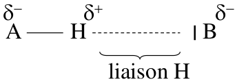

Liaison H plus faible, donc plus longue que covalente  
Liaison H = $$12-30kJ/mol$$alors que liaison covalente = $$100kJ/mol$$  
La liaison H est essentiellement directionnelle Si les atomes impliqués sont alignés alors il y a Interactions électrostatiques maximales

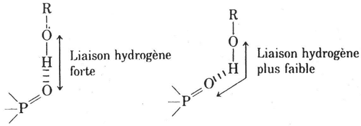

#### Liaison hydrogène dans les peptides

Les liaison hydrogène permette la création de structure en 3D

#### Conséquence

**1 \) Liaison hydrogène intermoléculaire  
-** Evolution des températures d’ébullition et de fusion avec la masse molaire : Pour une colonne de molécule du tableau périodique , le point d’ébullition et de fusion augmente

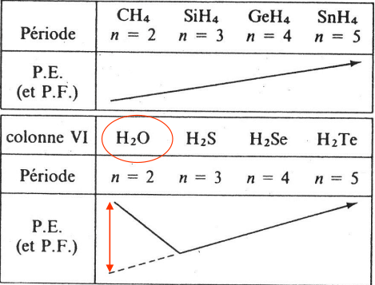

Avec un cas particulier ici l'H2O car il y a beaucoup de liaisons hydrogène intermoléculaire, donc le PEb réel &gt;&gt; PE attendu  
- Chaleur de changement d’état Liaisons H =&gt; énergie de fusion et de vaporisation augmente  
**- Solubilité :** Molécules polaires : insolubles dans solvants organiques \(hydrocarbures : hexane, toluène...\) qui eux sont apolaires de ce fait, Les composés doivent former des liaisons H avec le solvant pour se solubiliser dans un solvant polaire \(eau, NH 3 liq\)

**2\) Liaison hydrogène intramoléculaire**  
- Diminution des constantes physiques  
- Liaisons H intramoléculaire =&gt; molécules sont plus isolées, **les liaisons hydrogènes intramoléculaire diminue la température d’ébullition.**  
- Solubilité : Liaison hydrogène intramoléculaire, les molécules sont plus reliés sur elles memes, il y à donc moins d’interactions avec le solvant et donc moins soluble dans les solvant polaire  
Liaison H intramoléculaire diminue la Solubilité dans des solvants polaires

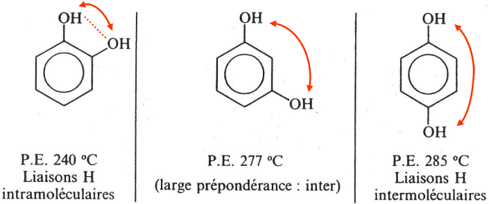

### Liaison ionique

Liaison très soluble dans l'eau, interactions électrostatiques résultant des forces d’attraction entre deux fonctions polaires de charges électriques opposées

### Force de Van Der Walls

#### Nature des forces VDW

FWDW résulte de 3 types d'interactions électroniques attractive intermoléculaire \(entre pôles chargés + et -\)

**Dipole-dipole : Force de keesom**  
Force s'exerçant entre dipôle permanents, un dipole permanent est une molécule polaire qui possède un moment dipolaire u0. Ces dipôles s’orientent les uns / aux autres  
**Dipôle permanent -dipôle induit : Forces de Debye**  
Effet d'induction de Debye, les molécule polaire A créent un champ électrique, si une molécule non polaire B vient prêt de A, il se créer une polarisation induite \(charges locales\) dans B qui disparaît quand B s’éloigne de A =&gt; dipôle induit

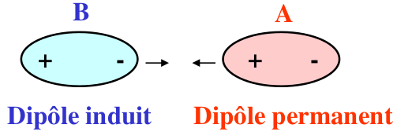

**Dipôle instantané - dipôle instantané : Forces de London**  
Quand la température diminue, un gaz apolaire peut devenir liquide, puis solide \($$H_2, N_2$$\); **force de cohésion** entre les molécule apolaire. Mouvement incessant d’électrons dans une molécule entraîne  moment dipolaire instantané non nul bien que la moyenne dans le temps soit nulle. Interaction entre dipôles instantanés de molécules voisines. Chaque dipôle polarise les molécules voisines

#### Force

L’énergie mise en jeu par ces 3 effets conduit à une Energie potentielle attractive   
- Seules forces d’interaction dans les molécules apolaires  
- Contribution principale à la cohésion moléculaire  
- Elles augmentent avec la masse molaire  
**Distance intermoléculaire**  
Interactions de VDW attractives &lt;-&gt; Molécules attirées les unes vers les autres, MAIS À très courte distance : énergie répulsive \(impénétrabilité des nuages électroniques\)  
A distance intermédiaire : équilibre entre les forces VDW attractives et les forces répulsives

#### Conséquence

**Constante physique  
-** Si le nombre d’électrons Z augmente ou la taille des molécule d'une même série augmente, il y a alors augmentation des forces de van der walls  
- Si les FVDW augmente alors il y a une attraction plus forte entre les molécules, **vaporisation plus difficiles,** induit une constante physique qui augmente.

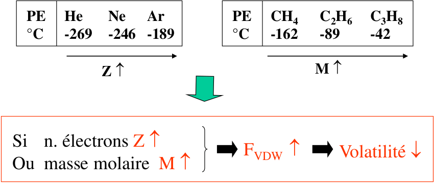

**Solubilité**  
Composé soluble dans un solvant si interactions composé / solvant aussi fortes que celles solvant / solvant  
Hydrocarbures : molécules à squelette hydrocarboné -&gt; Interactions uniquement de type VDW  
Hydrocarbures \(apolaires\) insolubles dans l’eau \(polaire\) -&gt; hydrophobes, par contre ils sont très solubles entre eux

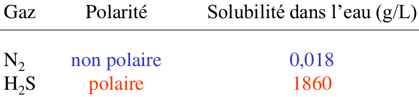

### Interaction Hydrophobe

Mélange eau + hydrocarbure \(hexane\) -&gt; 2 phases liquides non solubles : non miscibles car  
- Pas d’interactions favorables entre les composés hydrophobes et l’eau  
- Liaisons H entre molécules d’eau plus nombreuses quand molécules non polaires rassemblées \(phase distincte\)


Interactions hydrophobes conséquence de la tendance des molécules d’eau à exclure les groupes non polaires

* Séparation de phase :
  * phase aqueuse polaire
  * phase organique apolaire

Cependant Peu d’affinité particulière entre substances apolaires  
En présence de composés polaires et hydrophobes Les molécules non polaires s’agglutinent  agrégats  
Dans les macromolécules biologiques, les régions non polaires sont enfouies à l’intérieur des molécules


## Réaction chimique

#### Définition


**Réactif :** composé chimique qui vont se transformer =&gt; possibilité d'être totalement consommé

**Produit :** Composé qui va se former

**Coefficient stœchiométrique :** proportion nécessaire entre les réactifs et les produits


#### Réaction totale

Les réactions totale \(quantitative\) sont symbolisées avec une seule flèche.  
Consommation des réactif jusqu'à l'épuisement, la consommation totale des réactifs. Il faut équilibrer une les réactions avec le nombre d'atome et les charges.  
$$\alpha A+\beta B \rightarrow \gamma C + \chi D$$  
Il y à donc deux cas possible   
- Cas 1 :   
En réaction totale on peut donc écrire $$\frac{nA}{\alpha} = \frac{nB}{\beta}$$ \(nA et nB concentration\) on à placé exactement les proportions requise tout A et B sont consommés. il s'est formé C et D dans des proportions particulière.  
On peut donc écrire $$\frac{nA}{\alpha} = \frac{nB}{\beta} = \frac{nC}{\gamma} = \frac{nD}{\chi}$$   
- 2e cas :   
Si $$\frac{nA}{\alpha} \neq \frac{nB}{\beta}$$la réaction s’arrête que si l'un des réactifs s'épuisent, on le nomme **réactif limitant.**  
Si A est limitant et B est en excès alors $$\frac{nA}{\alpha} < \frac{nB}{\beta}$$il y a donc ce qui reste de B et C et D qui se forment.  
$$\frac{nA}{\alpha} = \frac{nC}{\gamma} = \frac{nD}{\chi}$$


Pour vérifier si réaction totale on calcul la constante de réaction Kr, avec comme critère **Kr &gt; 1000**  
La constante de réaction implique les **concentrations molaire des réactifs et les produits** à **l'état final !**  
$$Kr = \frac{\lvert C \lvert^\gamma \lvert D \lvert^\chi}{\lvert A \lvert^\alpha \lvert B \lvert^\beta}$$  
Toutes les concentrations son en mol/L \(ou M\) et ne sont jamais égale à 0  
Eau -&gt; solvant $$\lvert H_2O \lvert = 1 $$\(concentration eau = 1 mol/L\)


#### Réaction non total \(Kr &lt; 1000\)

Si la réaction n'est pas totale on écris une double flèches, on ne consomme pas tous les réactfs \(Acide faible\)/équilibre chimique  
$$A + B \rightleftharpoons  2C$$  
Les réactifs ne sont pas totalement consommé, une partie seulement réagis \(x\)  
Système faible, réaction partiel, x est calculé à partir de Kr

$$Kr = \frac{\lvert C \lvert^2}{\lvert A \lvert |vert B \lvert} = \frac{x^2}{(n_A-x)(n_B-x)}$$si nA = nB alors $$Kr = \frac{x^2}{(n-x)^2}$$-&gt; $$\sqrt{Kr} = \frac{x}{n-x}$$

## Équilibre acide base

#### Solution aqueuse


**Acide :** molécule qui est capable de donner un proton \(H+\)  
**Base :** molécule qui accepte un proton \(H+\)  
**Proton :** Particule avec une charge + dans le noyau  
**Ph :** Potentiel à Hydrogène \(mesurer avec une électrode la différence de potentiel\)

$$PH = -log\lvert H_3O^+\lvert$$avec H3O+ en mol/L $$\lvert H_3O^+\lvert = 10^{-Ph}$$

$$PKa = -log Ka$$ =&gt; $$Ka = 10^{-pKa}$$

Ph et Ka n'ont pas d'unité


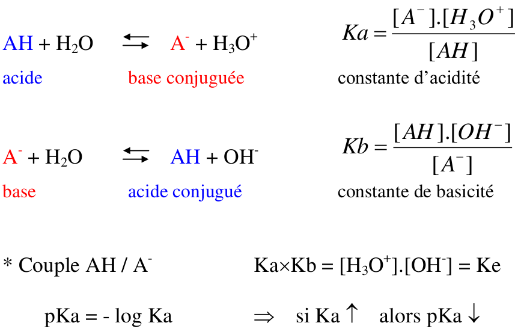

### Ampholyte \(Amphotère\)

Molécule capable soit de céder, soit d’accepter un proton : peut donc être acide ou base

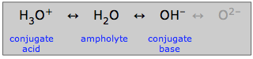

### Autoprotolyse de l'eau \(APE\)

L'eau peut accepter un proton H⁺ \(donne $$H_3O^+$$\) ou donner un proton H^+ \(forme OH⁻\)

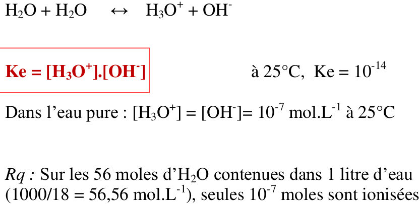

## Acide et Base

### Espèce acido-basiques


**Acide :** espèce chimique \(molécule ou ion\) susceptible de libérer un proton  
**Base :** espèce chimique \(molécule ou ion\) susceptible de capter un proton

**Espèce spectatrice :** espèce chimique qui ne joue ni le rôle d’acide ni celui de base donc n’influe pas sur le pH.   
**Amphotère ou ampholyte :** espèce chimique \(molécule ou ion\), qui est l’acide d’un couple et la base d’un autre couple


Plus un acide est fort : Plus sont Ka est grand et plus son pKa est petit, et plus sa base conjuguée est faible.

### Classement des couples selon leur pKa

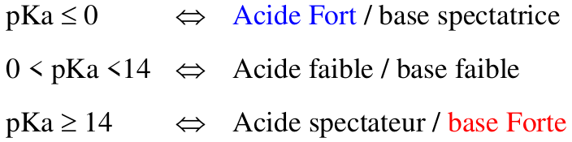

### Définition du Ph

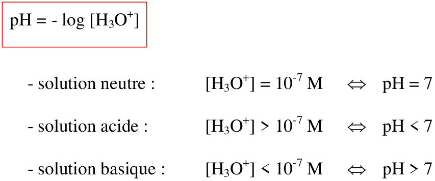

### Électrolytes Forts \(entièrement dissociés\) 

#### Cas pour un monoacide Fort

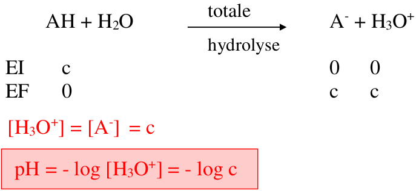


Après calcul, vérification de l’hypothèse : on néglige l’autoprotolyse de l’eau en milieu acide si pH &lt; 6,5  
****Exemples : HCl, HBr, HI, $$HNO_3$$ , $$HCLO_4$$


#### Cas d'une base forte

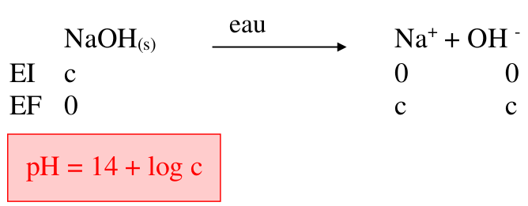


Vérification de l’hypothèse : on néglige l’autoprotolyse de l’eau en milieu basique si pH &gt; 7,5  
Exemples : NaOH, KOH, LiOH


### Électrolytes faible \(réaction équilibrée avec l'eau\)

#### Cas d'un acide faible \(0 &lt; pKa &lt; 14\)

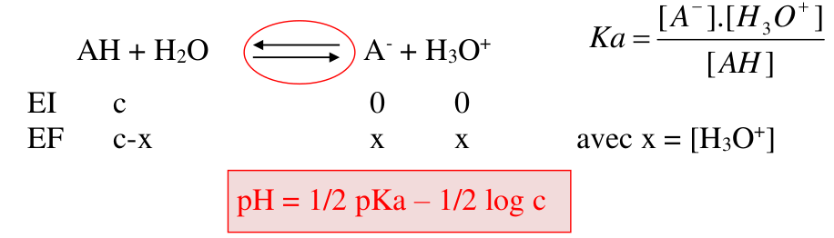


Vérifications des hypothèses :   
1 ère approximation : vraie si pH &lt; 6,5  
2 ème approximation : vraie si \[H 3 O + \] &lt; c/10

Exemples : RCOOH, HF, $$NH^+_4$$


#### Cas d'une base faible \(0 &lt; pKa &lt;14\)

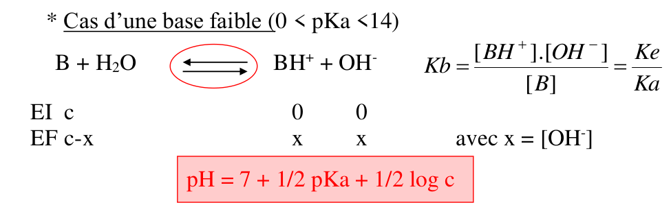


Vérifications des hypothèses :   
1 ère approximation : vraie si pH &gt; 7,5   
2 ème approximation : vraie si \[OH - \] &lt; c/10

Exemples : RCOO- , F- , $$NH^+_3$$\(NH2\)


### Acides aminés et espèces amphotères

Les acides aminés possèdent un acide et une base il y a donc deux réactions dans l'eau.

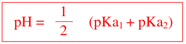

