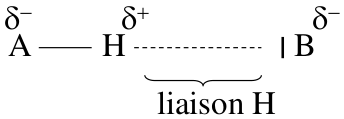
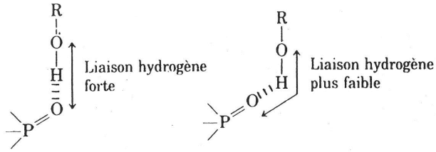
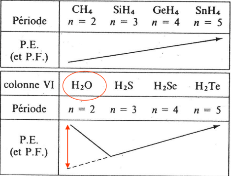

# Biomolécule B

## Solution


Une solution est constitué d'une espèce chimique appelée **soluté**, dissoute dans un liquide appelé **solvant**.  
Une solution aqueuse est une solution dont le **solvant est l'eau.**


### **Grandeur caractéristique**

#### **Solution global**

* Volume V en litre \(L\)
* Masse m en gramme \(g\)
* Masse volumique en $$\rho$$= masse d'un litre de solution $$\rho = \frac{m}{V} (g/L)$$
* Densité \(sans unité\) $$d=\frac{\rho}{\rho_{(eau)}}$$ $$\rho{(eau)}=1kg/L=1000g/L$$

#### Soluté

* masse de X : $$m_x$$\(g\)
* masse molaire du soluté X : $$M_x$$\(g/mol\) Mx représente la masse d'une mole du soluté X ou la somme des masses molaires atomiques des éléments
* Quantité de matière ou nombre de moles de soluté X dissous : $$n_X$$ \(mol\) Avec $$n_X=\frac{m_x}{M_x}$$
* Concentration molaire en X : Cx \(mol/L\) $$C_x=\frac{n_x}{V}$$
* Titre massique ou concentration massique en X : tx \(g/L\) $$t_x=\frac{m_x}{V}$$

#### Relation entre grandeur

$$t_x=C_x\times M_x$$   &lt;--&gt;  $$t_x=W_x\times \rho = W_x\times d \times \rho_{eau }$$  
Soit   
$$C_x=\frac{W_x \times d \times \rho_{eau}}{M_x}$$

### Notion de PPM

1ppm = 1mg dans $$10^6$$mg de solution, soit **1ppm = 1mg de soluté dans 1L de solution**

## Molécule d'eau

Molécule polaire, coudée et non linéaire. Électronégativité de Oxygène &gt; Hydrogène. A l'inverse les hydrocarbure sont des composée apolaire  
Composé polaire -&gt; Hydrophile  
Composé apolaire -&gt; Hydrophobe

3 étapes :   
- Séparations des molécules de soluté  
- Séparation des molécules de solvant  
- Formation d'interaction soluté-solvant

## Force intermoléculaire

### Introduction

#### Il existe 3 états de la matière :

* Gazeux : Molécule éloignée, pas de volume, pas de forme propre
* Solide : Contact ainsi que **forme et volume propre**
* Liquide : Contact entre molécules, **Volume propre** sans forme propre

Liquide et solide : état condensé de la matière \(contact entre molécule\)

#### Changement d'état

Transformation avec température qui diminue : Gaz -&gt; Liquide -&gt; Solide  
Il y a rapprochement des molécules et perte d’énergie cinétique \(vitesse diminue\)  
Ce changement d'état est liée aux force attraction entre les molécule liées à des interaction électrostatique.  
Cohésion des liquides et des solides.  
Plus la force d'attraction augmente =&gt; plus la cohésion augmente

#### 3 Types de liaisons

* **Liaison forte**, mise en commun de deux électrons entre deux atomes :  Liaison covalente $$N_2$$ / Liaison dative $$^+NH_4$$ / Liaison ionique $$NaCl$$ Energie : quelque centaine de $$kJ/mol$$, **C'est le squelette des molécules**
* **Liaison hydrogène** : Solution aqueuse, Acide aminés, Biomolécules Energie : quelque dizaine \(10-30\) $$kJ/mol$$
* **Liaison faible :** Cohésion liquide, solides / Interaction en phase gaz Energie : quelque \(1-10\) $$kJ/mol$$


Force d'interaction électrostatique entre les molécules : Force de Van Der Waals


### Liaison hydrogène

Nature

Liaison H entre un atome H lié par covalence à un atome électronégatif \(A\) ET un atome électronégatif \(B\), dit accepteur de liaison H

Liaison H plus faible, donc plus longue que covalente  
Liaison H = $$12-30kJ/mol$$alors que liaison covalente = $$100kJ/mol$$  
La liaison H est essentiellement directionnelle Si les atomes impliqués sont alignés alors il y a Interactions électrostatiques maximales

#### Liaison hydrogène dans les peptides

Les liaison hydrogène permette la création de structure en 3D

#### Conséquence

**1 \) Liaison hydrogène intermoléculaire**  
Evolution des températures d’ébullition et de fusion avec la masse molaire : Pour une colonne de molécule du tableau périodique , le point d’ébullition et de fusion augmente

Avec un cas particulier ici l'H2O car il y a beaucoup de liaisons hydrogène intermoléculaire, donc le PEb réel &gt;&gt; PE attendu

