# Glucides


Le cycle le plus stable des cétose est la forme furane, alors que le cycle le plus stable des aldose est la forme pyrane


## Tautomérie céto-énolique

* Transposition réversible d'une molécule \(qui possède un H sur le C en a du carbonyle\) en un isomère
* Catalysée par les bases, en milieu alcalin = solution alcalines diluées et température ambiante

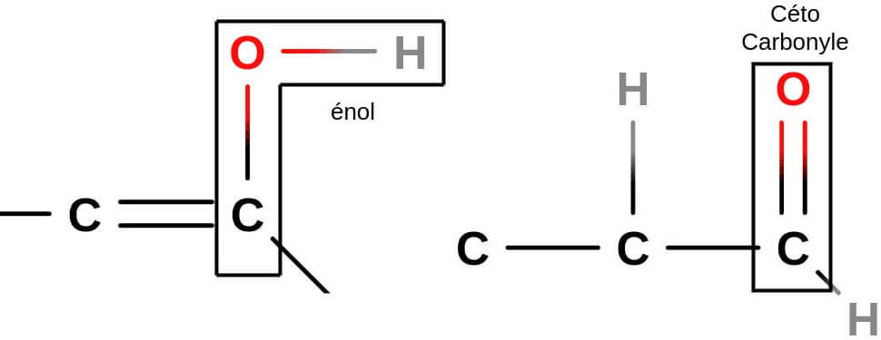

En présence de concentration élevée de base et à chaud :  
- Oses = réarrangement moléculaires, dégradation, polymérisation  
- Osides et certains polyosides sont stables

#### Fonction réductrice


Fonction aldéhydiques ou cétoniques \(forme linéaire non cyclique\) mise en évidence du pouvoir réducteur des oses par le test de la liqueur de Fehling \(Oxydation -C=O\)  
Mutarotation, équilibre forme Alpha, Beta et linéaire, oxydable grâce à la forme linéaire  
**Attention ! Osides pas possible** 


* Les aldoses peuvent peuvent réduire des sols métalliques \(en milieu alcalin et à chaud\) jusqu'au stade métal
* On utilise une sel cuivrique \($$Cu^{2+}$$\) maintenant en solution dans le tartrate double de sodium et de potassium \(Liqueur de Fehling = solution de $$Cu^{2+}$$

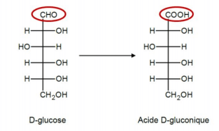


Sucre réducteur + $$2Cu^{2+} \to$$Sucre oxydé + $$2Cu^+$$


En milieu alcalin : \($$Cu_2O$$forme un précipité rouge brique\)

$$
2Cu^++2OH^- \to 2CuOH \to Cu_2O+H_2O
$$

#### Notion Oxydant/Réducteur


**Oxydant :** Espèce chimique pouvant **fixer** un ou plusieurs électron $$e^-$$  
- Provoque une oxydation = **Perte électrons**

**Réducteur :** Espèce chimique pouvant **céder** un ou plusieurs électron $$e^-$$  
- Capable de provoquer une réduction = **gain électrons**


Couple oxydant / réducteur \(Oxy/Red\) : Oxydant + $$n^{e^-}$$= réducteur

Soit réaction d'oxydo-réduction : $$ox1 + red2 = red1 + ox2$$

Il y a donc deux demi équations :  
$$oxy1 + ne^-=red1$$  
$$red2=oxy2+ne^-$$ 

## Propriété chimique des oses

### Isomérisation en milieu alcalin : Interversion des oses

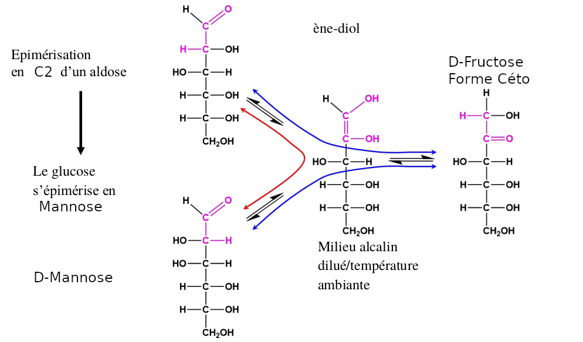

Interconversion d'un aldose en cétose =&gt; Le glucose s'isomérise en Fructose

### Oxydation

#### Oxydation par la liqueur de Fehling

$$R\text-CHO+3OH^-\to R\text-COO^-+2H_2O+2e^-$$  
$$2Cu^++2OH^-+2e^- \to Cu_2O+H_2O$$  
$$R\text-CHO+2Cu^{2+}+5OH^- \to R\text-COO^-+Cu_2O+3H_2O$$

#### Oxydation douce par le diiode en milieu alcalin :

Dismutation du diiode en hypoiodite $$IO^-$$ et iodure $$I^-$$  
$$I_2+2OH^- \to IO^-+I^-+H2O$$  
Oxydation de l'aldose en aldonate  
$$R\text-CHO+IO^-+OH^- \to R\text-COO^-+I^-+H_2O$$  
Bilan  
$$I_2+3OH^-+R\text-CHO \to R\text-COO^-+2I^-+2H_2O$$


Le glucose donne le gluconate, le mannose donne le mannonate et le galactose le galactonate etc etc

Attention ! Les cétose ne réagissent pas avec l'iode


#### Oxydation enzymatique

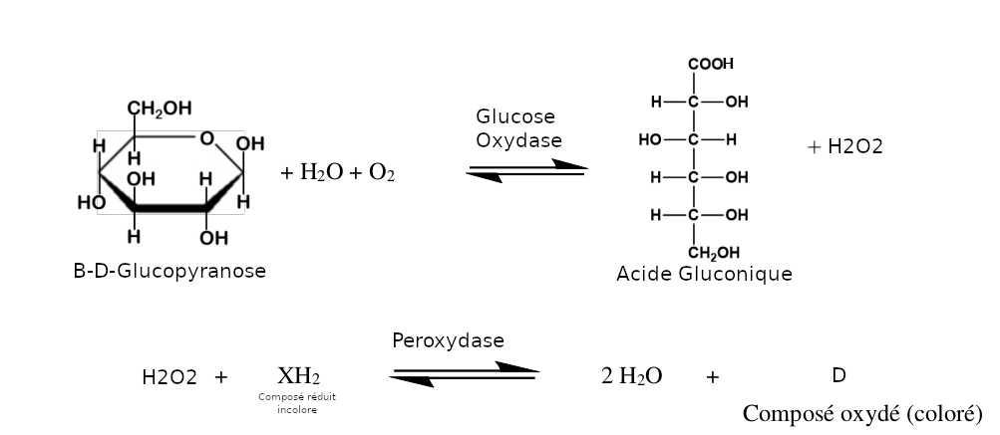

#### Oxydation en acide uronique

### Réduction

#### Réduction par les borohydrures alcalins \( $$NaBH_4$$ ou $$LiBH_4$$ \)

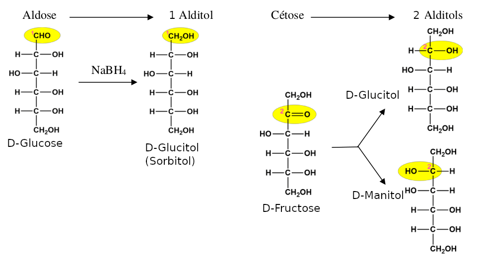


Alditole ne peut se cycliser \(Pas de fonction carbonyle\)


#### Methylation par le méthanol \( $$CH_3\text-OH$$ \)

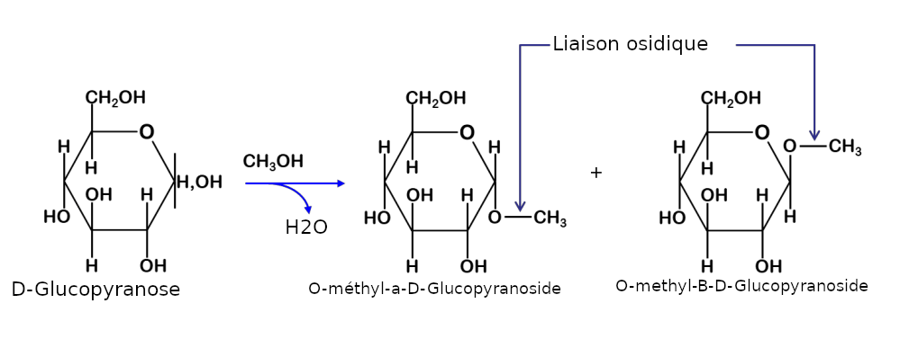


Un aldéhyde réagit avec deux molécules de méthanol, alors que le glucose se combine avec une seule molécule pour donner deux isomères \(a et B-methylglucose\)


#### Permethylation par l'iodure de méthyle \( $$ICH_3$$ \)

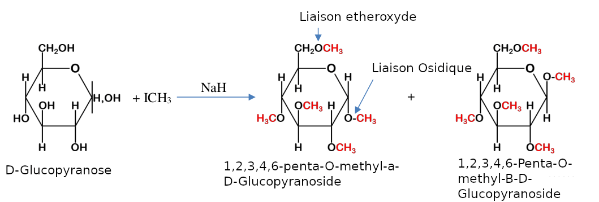

## Oligosides \(Oligosaccharides\)


Oli de 2 à a 10


### Liaison osidique

Une liaison osidique \(ou glycosidique\) est formée par condensation :

* De l'hydroxyle \(OH\) hémiacétalique pour les aldoses ou hémicétalique pour les cétoses porté par le carbone anomérique \(C1 pour les aldoses et C2 pour les cétoses\)
* D'un groupement -OH \(ou -$$NH_2$$ou -SH\) d'une autre molécule

### Diholosides

Lorsque la liaison osidique s'établit entre deux oses, on obtient un diholoside et on parle de liaison **O-Glycosidique**

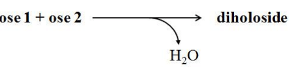

Il y deux possibilité :

* Si la liaison osidique est établie entre les OH hémiacétalique \(Hémicétalique\) du 1er ose et un OH alcoolique du 2e ose, le diholoside est réducteur et nommée **glycosyl-glycose**
* Si les OH hémiacétaliques \(ou hémicétaliques\) des deux oses sont impliqués dans la liaison, le diholoside obtenue est non réducteur nommé **glycosyl-glycoside**


Les liaisons osidiques peuvent être hydrolysées par des exo-enzymes spécifiques appelées glycosidas ou osidases  
Elle sont spécifiques :

* De l'ose qui a engagé son OH anomérique dans la liaison osidique qui est hydrolysée
* De la nature de cet ose \(Glucose, Galactose\)
* De la série D ou L
* De sa forme cyclique \(Furanique ou Pyranique\)
* De l'anomérie de la liaison osidique a ou B


#### Maltose / Isomaltose

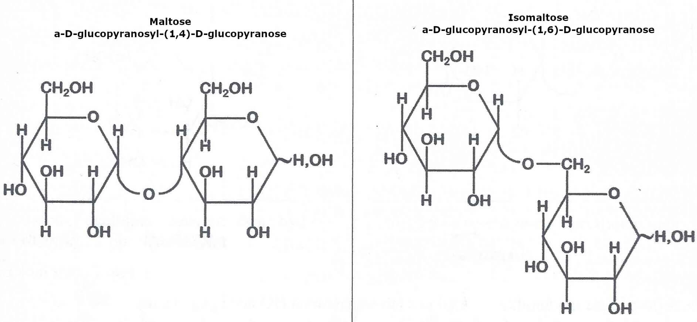


Fabrication bière \(Malt = Orge germé\)

* **Maltage :** Germination de l'orge \(Trempage + Aération\) grain germé \(Malt vert\) grillé, séché puis broyé
* **Brassage :** Malt mélangé avec de l'eau puis chauffé par palier de température \(Action des enzymes : protéases, B-amylases et a-amylases\)
  * Filtration de la partie liquide et extraction des sucres
  * Cuisson, ajout de houblon \(acides qui stérilisent, conservent et donne l'amertume\)
* **Fermentation :** 
  * Ébullition, filtration puis cuve de fermentation \(+Levure\) anaérobie glucose -&gt; alcool \(éthanol\) + CO2
  * Garde \(Quelques semaine à 0°C\)
* **Embouteillage :** 
  * Bière soutirée \(mise en bouteille\), encapsulation et pasteurisation.


#### Lactose et le Cellobiose

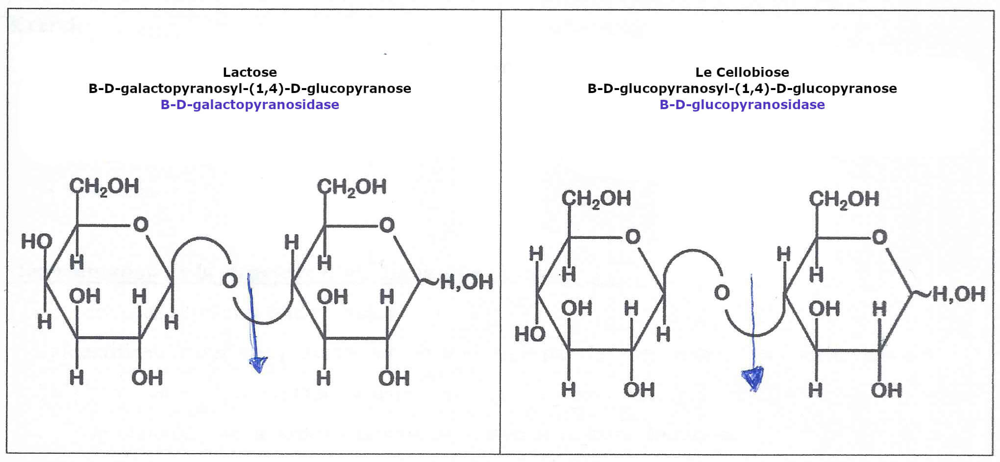

Dans l'intestin le lactose est hydrolysée par une lactase, en glucose et galactose qui peuvent être absorbés. Une déficience en lactase peut provoquer une intolérance en lactose, pour pallier le problème on peut remplace le lait par des yaourt


* Lactobacillus bulgarius : Dégrade en glucose et galactose en acide lactique
  * Acide lactique à un rôle antiseptique
  * Acide lactique acidifie le milieu
  * Précipitation des protéines du lait, particulier de la caséine
  * Favoriser l'assimilation de calcium
* Streptococcus thermophilus
  * Élabore des produits aromatiques, ces bactéries digèrent aussi partiellement les protéines du lait
* Bifidobacteria et L.acidophilus
  * Ce sont  des probiotiques présent dans la "Flore intestinale" \(Microbiote\)


#### Saccharose / Tréhalose


* Raffinage du sucre
  * Betterave lavées, découpées et plongées dans l'eau chaude, le sucre se diffuse dans l'eau
  * Solution qui contient 13% de sucre \(g pour 100ml\) et 3% d'impureté
  * Impureté éliminées par addition de lait de chasse et de CO2
  * Jus épuré filtré puis concentré $$\to$$solution devient 63% de sucre
  * Cuisson sous vide : Obtention de cristaux de sucre
  * Sucre blanc lavé par pulvérisation de vapeur, puis sèche \(Air chaud\)


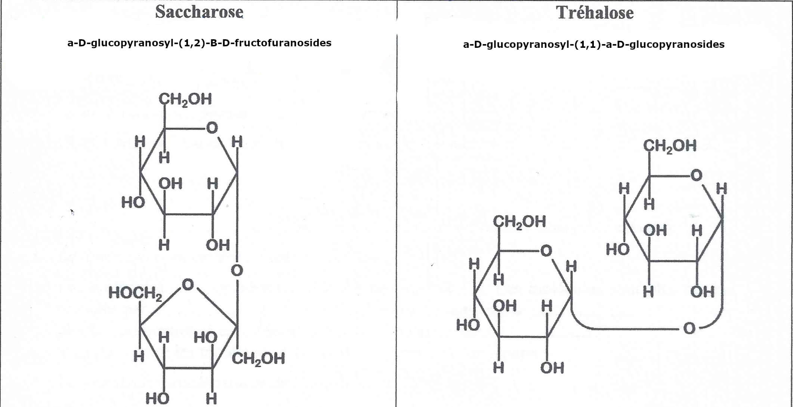

**Le tréhalose** est un diholosides **non réducteur** \(Les deux OH anomériques sont dans la liaison osidique\)  
- Principale glucides circulant dans l’hémolymphe des insectes, composant de certains champignons et algues  
- Digestion par le **tréhalase,** très spécifique \(Intestin mammifères, insectes et quelques micro organismes\)  
- De nombreux organisme l'accumulent en réponse à des chocs thermique \(Froid ou Chaud\). Notamment les **tardigrade** ce qui leur permet de survivre à des conditions extrêmes en supprimant l'eau contenus dans leurs cellules  
- Stabilisant alimentaire  
- Cryoprotectant pour la conservation d'organes biologique

### Analyse structurale des oligosaccharides

Combinaison de méthode biochimique pour déterminer la nature de différent oligosaccharides

* Composition globale : Hydrolyse en milieu acide fort \(HCL Acide Chlorhydrique\) concentré à 100-110% pendant plusieurs heures =&gt; Monosaccharides. Puis séparation et identification des oses présent par CCM \(Chromatographie sur Couche Mince\)
* Détermination d'un éventuel pouvoir réducteur \(Test à la liqueur de fehling\)
* Position de la liaison osidique, perméthylation \(ICH3/NaH\) puis hydrolyse en milieu acide =&gt; -OH libre engagé dans la liaison osidique
* Configuration anomérique des liaisons osidique, hydrolyse enzymatique par des glycosidases spécifiques

### Détermination de la structure d'un diholoside

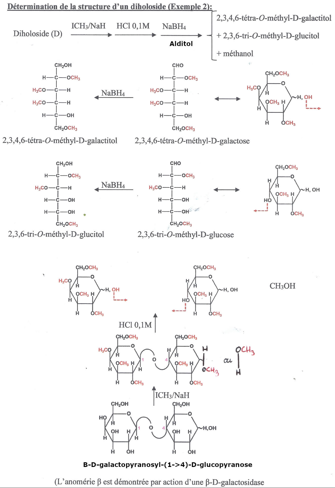

### Triholosides

#### Raffinose


**Raffinose** **:**  α-D-galactopyranosyl-\(1$$\to$$6\)-α-D-glucopyranosyl-\(1$$\to$$2\)-β-D-fructofuranoside  
Ou α-D-galactopyranosyl-\(1$$\to$$6\)-saccharose


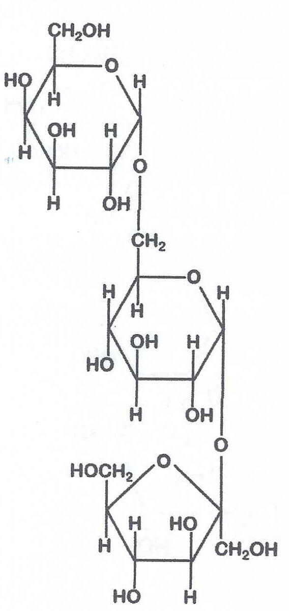


Présent dans les choux, fermenter pendant la digestion dans l'intestin, accompagnant le saccharose dans les jus de betteraves. Eliminé lors du raffinage


## Polyosides \(Polysaccharides\)

Il existent les homopolyosides et les hétéropolyosides, il peuvent avoir une structure linéaire ou ramifié.   
Les homopolyosides trouvable dans la nature sont :   
- Homopolyosides de réserve : Amidon, Glycogène  
- Homopolyosides de structure : Cellulose

### Amidon

On trouve de forme de structure, **Amylopectine** à 70% et **Amylose** à 30%. 

**Amylose :** Homopolyoside linéaire, formée de D-Glucopyranose relié par des liaison $$\alpha (1 \to 4)$$, quelque centaine à quelques milliers de glucoses. Structure linéaire, 6 résidus de glucose par tour d'hélice. L'hélice est stabilisée par des liaison hydrogène entre les groupement hydroxyles et les molécules d'eau.  
En présence **d'iiode, l'amidon donne une coloration bleu foncée,** plus ou moins intense selon sa concentration  
**Amylopectine :** Homopolyosides ramifié, formée de D-Glucopyranoses liés par des liaisons $$\alpha (1 \to 4)$$, des dizaines de milliers de glucoses. Ramification par des liaisons $$\alpha (1 \to 6)$$tous les 20 à 25 résidus de glucose environ.  
Extrémité réductrice la ou se situe l'hydroxyle du polymère, et l'extrémité non réductrice représente par le carbone 4 au bout de la molécule.

### Glycogène

Polyosides de réserve des animaux, présent dans le foie et dans les muscles.   
- Structure similaire à celle de l'amylopectine, homopolyoside ramifié de D-Glucopyranose liés par des liaisons $$\alpha (1 \to 4)$$  
- Ramification par des liaisons $$\alpha (1 \to 6)$$toutes les 8 à 12 unités de glucose, structure en buisson.   
- Dégradation par phosphorylase \(Foie et muscle\) : $$(glucose)_n+P_i\to(Glucose)_{n-1}+glucose-1-phosphate$$  
- Dégradation par des amylases alimentaires qui libèrent principalement du maltose

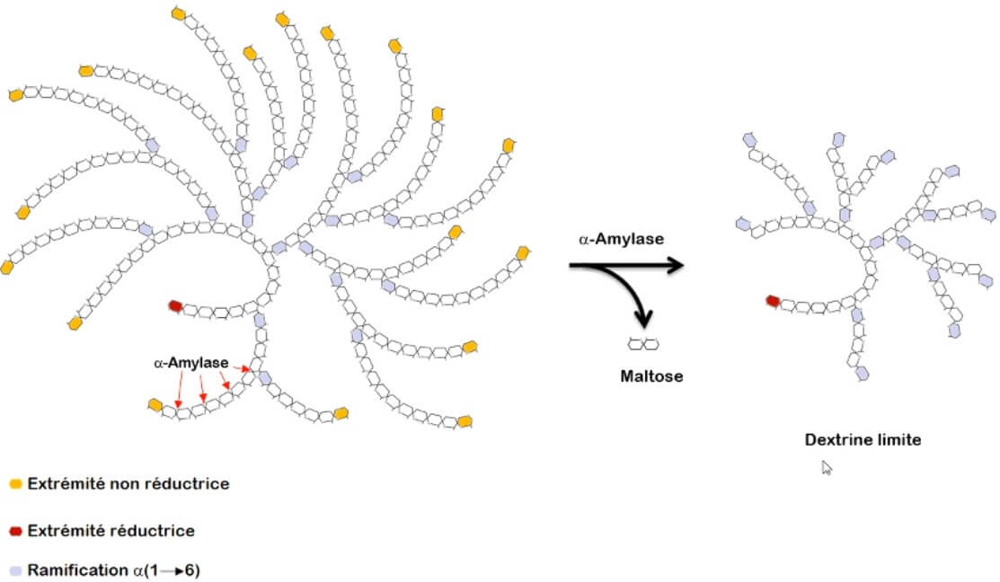

### Cellulose

Homopolyosides de structure, en masse, c'est la biomolécule la plus importante à la surface de la terre. Elle constituerait la moitié du Carbone organique disponible sur la planète.  
- Homopolyosides majeur des végétaux  
- Principal constituant des parois cellulaires végétales  
- Présent chez certaines bactéries  
- Polymère de D-Glucose linéaire dont les unités glucoses sont reliées par des liaions $$\beta (1\to4)$$  
- Structure plate  
- Hydrolyse de cellulose par des cellulases libère du cellobiose, lui-même hydrolysé par des cellobiases en glucose.

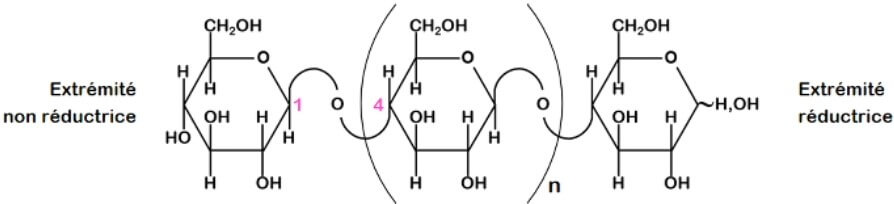

Orientation "tête-bêche" de résidus consécutifs de glucose \(les oses sont retournés d'un angle de 180 degré l'un par rapport à l'autre\) stabilisée par des liaisons hydrogène  
La rotation des oses autour de la liaison osidique est bloquée, la molécule est étirée sous forme d'un ruban.

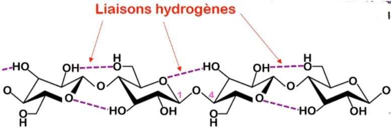

## Hétérosides

#### **O-hétérosides**

Réaction des oses avec les alcools, un oses qui établit une liaison osidique n'est plus réducteur et la mutarotation n'est plus possible. Les liaisons osidiques peuvent être hydrolysées par HLC 0,1 M ou en présence d'une glycosidase spécifique

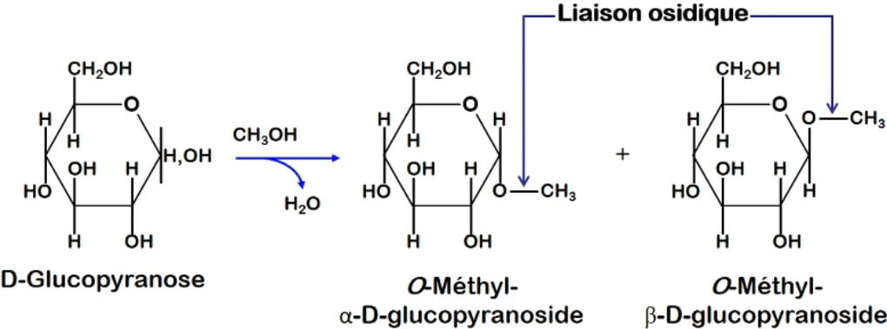

#### N-hétérosides

Réaction des oses avec les amines, exemple : Nucléoside \(base azotée + ribose ou désoxyribose\)

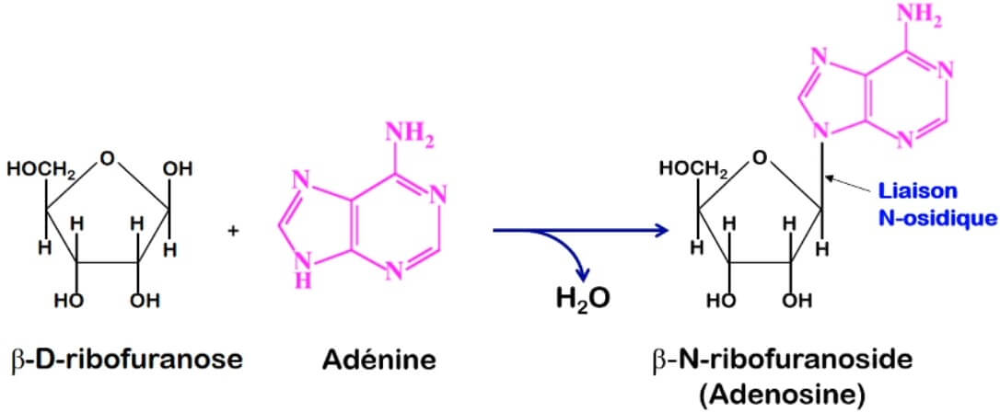

#### S-hétérosides

Réaction des oses avec les mercaptans \(thiols\)

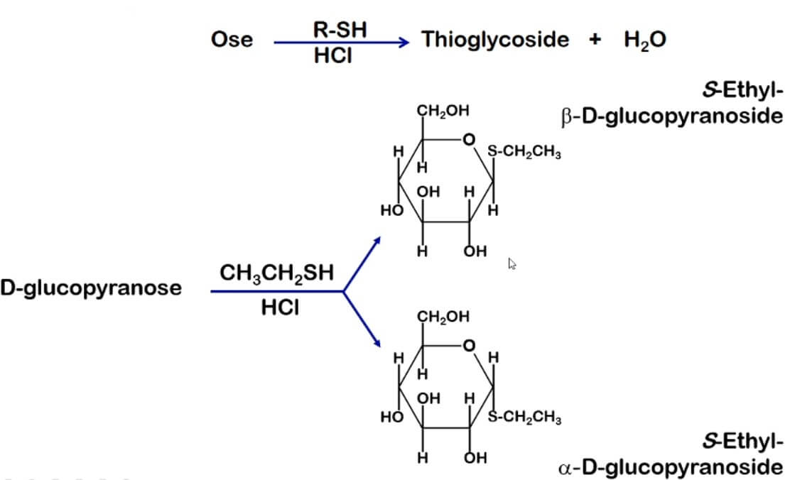

#### Hétérosides-phosphate

Condensation des oses avec l'acide phosphorique

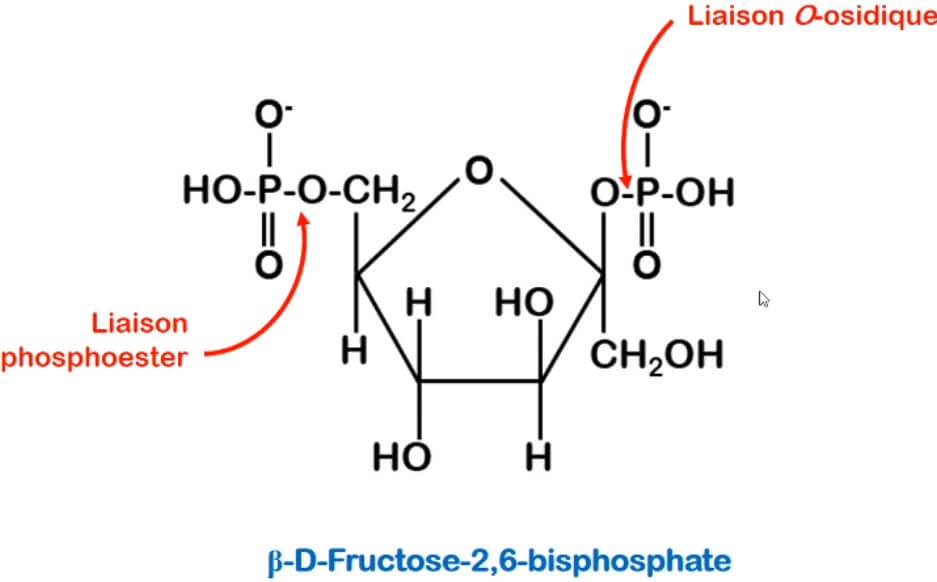

