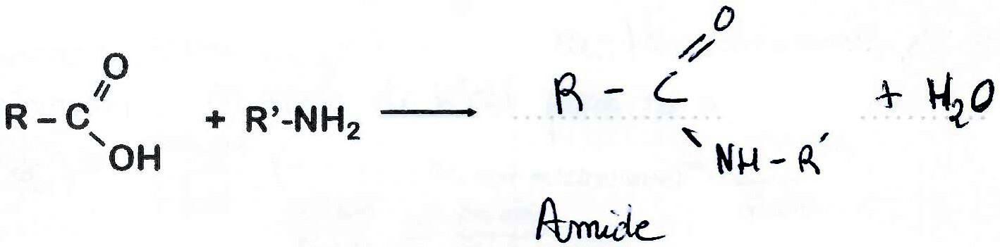
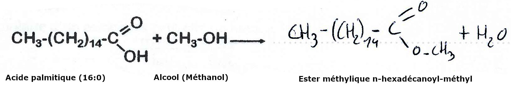
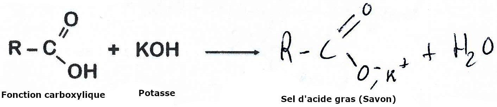

# Lipides

## Définition, rôle et classification des lipides

### Définition


Les lipides se définissent part une **propriété physique**, ils sont **insoluble dans l'eau** et soluble dans les solvant organiques non polaire \(Chloroforme, acétone\)


### Classification des lipides

* Les lipides simple \(Homolipides\)
  * Acide gras
  * Acylglycérols
  * Cérides
  * Stérols
* Les lipides complexes \(Hétérolipides\)
  * Glycérophosopholipides
  * Sphingolipides
  * Lipophile \(Vitamine\)

## Acide gras

### Acide gras saturés


Formule brut : $$C_nO_2H_{2n}$$

Formule semi développer : $$CH_3-(CH_2)_{n-2}-COOH$$

Avec pour fonction, un acide carboxylique, soit une fonction ionisée carboxylate $$COO^-$$


#### Numérotation des acides gras

La numérotation des acides gras commence toujours par la fonction carboxylique en 1

#### Nomenclature

Le nom systématique : **\[nC\] an oïque**  
Avec **\[nC\]** : le nombre d'atomes de carbones  
**an** : Indique la saturation de la chaîne \(Alcane\)  
**oïque** : Fonction carboxylique

Un symbole : **n:x** ou $$C_n:x$$ avec \(**x** le nombre de double liaison \(Dans les acides gras, pas de double liaisons donc 0\) et **n** le nombre de carbone\)

Et le nom commun rappelant l'origine de l'acide gras

#### Acide gras à connaitre

<table>
  <thead>
    <tr>
      <th style="text-align:left">Longueur relative</th>
      <th style="text-align:left">nC</th>
      <th style="text-align:center">
        
Nom syst&#xE9;matique

        
Acide -

      </th>
      <th style="text-align:left">Symbole</th>
      <th style="text-align:center">
        
Nom commun

        
Acide -

      </th>
      <th style="text-align:left">Remarque</th>
    </tr>
  </thead>
  <tbody>
    <tr>
      <td style="text-align:left">Cha&#xEE;ne courte</td>
      <td style="text-align:left">4</td>
      <td style="text-align:center">butano&#xEF;que</td>
      <td style="text-align:left">4:0</td>
      <td style="text-align:center">Butyrique</td>
      <td style="text-align:left">Beurre</td>
    </tr>
    <tr>
      <td style="text-align:left">Cha&#xEE;ne moyenne</td>
      <td style="text-align:left">12</td>
      <td style="text-align:center">dod&#xE9;cano&#xEF;que</td>
      <td style="text-align:left">12:0</td>
      <td style="text-align:center">Laurique</td>
      <td style="text-align:left">V&#xE9;g&#xE9;tales</td>
    </tr>
    <tr>
      <td style="text-align:left">Cha&#xEE;ne moyenne</td>
      <td style="text-align:left">14</td>
      <td style="text-align:center">t&#xE9;trad&#xE9;cano&#xEF;que</td>
      <td style="text-align:left">14:0</td>
      <td style="text-align:center">Myristique</td>
      <td style="text-align:left">V&#xE9;g&#xE9;tale</td>
    </tr>
    <tr>
      <td style="text-align:left">Cha&#xEE;ne moyenne</td>
      <td style="text-align:left">16</td>
      <td style="text-align:center">hexad&#xE9;cano&#xEF;que</td>
      <td style="text-align:left">16:0</td>
      <td style="text-align:center">Palmitique</td>
      <td style="text-align:left">V&#xE9;g&#xE9;tale</td>
    </tr>
    <tr>
      <td style="text-align:left">Cha&#xEE;ne moyenne</td>
      <td style="text-align:left">18</td>
      <td style="text-align:center">octad&#xE9;cano&#xEF;que</td>
      <td style="text-align:left">18:0</td>
      <td style="text-align:center">St&#xE9;arique</td>
      <td style="text-align:left">Graisse Animal</td>
    </tr>
  </tbody>
</table>### Acide gras insaturés

Les acides gras insaturés sont composé de 1 ou plusieurs liaison non conjuguée \(Non collé les une aux autres\)


Formule brut : $$C_nH_{2n-2x}O_2$$ \(Avec n : nombre de carbone ; x : nombre de double liaison\)

x=1 $$C_nH_{2n-2}O_2 \to$$ acide gras monoéthyléniques  
x=2 $$CnH_{2n-4}O_2\to$$acide gras diéthyléniques  
x=3 $$CnH_{2n-6}O_2\to$$acide gras triéthyléniques


#### Configuration des chaînes d'acides gras

Les liaisons peuvent être linéaire si simple, ou Z \(cis\) / E \(trans\) si double

#### Nomenclature

Le nom systématique : **pconf-\[nC\] \(x\) én oïque**  
Avec   
**P** : Position des doubles liaisons  
**Conf :** Configuration des doubles liaisons \(Z ou E\)  
**\[nC\]** : le nombre d'atomes de carbones  
**x :** Nombre de double liaisons  
**én** : Alcéne \(Double liaisons\)  
**oïque** : Fonction carboxylique

Un symbole : $$(n:x)\Delta^p$$ ****ou $$C_{n:x}(\Delta^p)$$ avec \(**x** le nombre de double liaison, **n** le nombre de carbone et $$\Delta$$le placement des doubles liaisons\)

Et le nom commun rappelant l'origine de l'acide gras

#### Numérotation des acides gras insaturés

Les acides gras insaturés peuvent être classés par série : la numérotation se faire à partir de l'atome de carbone du méthyle côté distal \($$\omega$$\) \(Le dernier carbone en nomenclature classique\)  
Ou numérotation normale : atome de Carbones numérotés à partir du carboxyle terminal

#### Acide gras insaturés à connaitre

<table>
  <thead>
    <tr>
      <th style="text-align:left">nC</th>
      <th style="text-align:center">
        
n double

        
liaisons

      </th>
      <th style="text-align:left">
        
Nom syst&#xE9;matique

        
Acide -

      </th>
      <th style="text-align:left">Symbole</th>
      <th style="text-align:left">S&#xE9;rie</th>
      <th style="text-align:left">
        
Nom commun

        
Acide -

      </th>
      <th style="text-align:left">Remarque</th>
    </tr>
  </thead>
  <tbody>
    <tr>
      <td style="text-align:left">18</td>
      <td style="text-align:center">1</td>
      <td style="text-align:left">9Z-octad&#xE9;c&#xE9;no&#xEF;que</td>
      <td style="text-align:left"></td>
      <td style="text-align:left"></td>
      <td style="text-align:left">Ol&#xE9;ique</td>
      <td style="text-align:left">Huile d&apos;olive</td>
    </tr>
    <tr>
      <td style="text-align:left">18</td>
      <td style="text-align:center">2</td>
      <td style="text-align:left">9Z,12Z-octad&#xE9;cadi&#xE9;no&#xEF;que</td>
      <td style="text-align:left"></td>
      <td style="text-align:left"></td>
      <td style="text-align:left">Linol&#xE9;ique</td>
      <td style="text-align:left">Huile de lin</td>
    </tr>
    <tr>
      <td style="text-align:left">18</td>
      <td style="text-align:center">3</td>
      <td style="text-align:left">9Z,12Z,15Z-octad&#xE9;catri&#xE9;no&#xEF;que</td>
      <td style="text-align:left"></td>
      <td style="text-align:left"></td>
      <td style="text-align:left">&#x3B1;-linol&#xE9;nique</td>
      <td style="text-align:left">Huile de poissons</td>
    </tr>
    <tr>
      <td style="text-align:left">18</td>
      <td style="text-align:center">3</td>
      <td style="text-align:left">6Z,9Z,12Z-octad&#xE9;catri&#xE9;no&#xEF;que</td>
      <td style="text-align:left"></td>
      <td style="text-align:left"></td>
      <td style="text-align:left">y-linol&#xE9;nique</td>
      <td style="text-align:left">Isom&#xE8;re de position du &#x3B1;</td>
    </tr>
    <tr>
      <td style="text-align:left">20</td>
      <td style="text-align:center">4</td>
      <td style="text-align:left">
        
5Z,8Z,11Z,14Z-

        
icosat&#xE9;tra&#xE9;no&#xEF;que

      </td>
      <td style="text-align:left"></td>
      <td style="text-align:left"></td>
      <td style="text-align:left">Arachidonique</td>
      <td style="text-align:left">Animaux</td>
    </tr>
    <tr>
      <td style="text-align:left">22</td>
      <td style="text-align:center">6</td>
      <td style="text-align:left"></td>
      <td style="text-align:left"></td>
      <td style="text-align:left"></td>
      <td style="text-align:left">DHA</td>
      <td style="text-align:left">Huile de poisson</td>
    </tr>
  </tbody>
</table>### Propriété physique

#### Solubilité

* Le caractères amphiphile des acide gras les rend plus ou moins solubles
* La présence de doubles liaisons diminue le caractère apolaire des molécules
* Les acides gras ayant moins de 6 carbones sont solubles dans l'eau
* La solubilité diminue avec la longueur de la chaîne carbonée

#### Les acides gras et les détergents sont des molécules amphiphiles :

#### Organisation des lipides dans l'eau


**Micelles :** Assemblage sphérique de molécule d'acides gras ou de détergents


#### Concentration micellaire critique \(CMC\)


**CMC :** Concentration en molécule amphiphile au-delà de laquelle elles s'organisent en micelles


#### Point de fusion


**Point de fusion :** Température à laquelle une substance passe de l'état solide à liquide


* La température de fusion augmente avec la longueur des acides gras saturés
  * Acide laurique $$(C_{12:0}) \to 44,3°C$$
  * Acide myristique $$(C_{14:0}) \to 53,9°C$$
  * Acide palmitique$$(C_{16:0}) \to 63,1°C$$
  * Acide stéarique$$(C_{18:0}) \to 69,9°C$$
* Pour un même nombre d'atomes de carbone l'insaturation de la chaîne carbonée diminue le point de fusion
  * Acide stéarique $$(C_{18:0}) \to 69,9°C$$
  * Acide oléique $$(C_{18:1}) \to 13,4°C$$
  * Acide linoléique$$(C_{18:2}) \to -5°C$$
  * Acide a-linolénique$$(C_{18:3}) \to -11°C$$

### Propriété chimique

#### Réaction avec les amines

#### Réaction avec les alcools

_Formation des cérides \(Acide gras + alcool aliphatique\) :_

#### Réaction avec les KOH \(Potasse\)

#### Indice de saponification \($$I_s$$\)


**Indice de saponification Is :** Quantité de potasse nécessaire pour saponifier 1g de matière grasse \(Ester acide gras\), exprimé en mg  
Is ne permet pas la détermination de la masse molaire



Lors de la saponification on peut dire :  
n mole de KOH pour n mole d'ester $$\to$$Donc $$n_{(KOH)}=n_{(ester)}\to\frac{m_{KOH}}{M_{KOH}}=\frac{m_{Ester}}{M_{Ester}}$$  
Donc $$m_{KOH}=M_{KOH}\times\frac{m{Ester}}{M{Ester}}$$  
$$I_s=m_{KOH}\times1000$$

La masse molaire d'acide gras peut être déduite de la valeur de Is  
$$M_ester=\frac{m_{ester}}{m_{KOH}}\times M_{KOH}$$


#### Indice d'acide \( $$I_A$$ \) : Réaction de neutralisation


Indice d'Acide : Quantité de potasse, exprimé en mg, nécessaire pour neutraliser 1g d'acide dans la matière grasse


La valeur $$I_A$$permet de déterminer la quantité d'acides gras libres présents dans la matière grasse : il s'agit de l'acidité résiduelle

#### Indice d'ester \( $$I_E$$ \)


Indice d'ester : Quantité de potasse, exprimé en mg, nécessaire pour saponifier 1g de matière grasse, l'acidité résiduelle ayant été éliminée  
$$I_E=I_S-I_A$$


#### Propriétés des acides gras éthyléniques

#### Hydrogénation

#### Addition d'halogènes


Indice d'iode \($$I_I$$\) : Quantité de d'iode, exprimé en **cg**, nécessaire pour saturer les doubles liaisons contenues dans 1g de matière


#### Oxydation

## Méthode séparation et de dosage

### Chromatographie sur Couche Mince \(CCM\)


La CCM est principalement une chromatographie d'**Adsorption**.   
- La phase stationnaire est un adsorbant solide \(Gel de Silice\)  
- La phase mobile est constituée par un solvant ou un mélange de solvants


### Chromatographie en Phase Gazeuse


Séparation des lipides rendus volatils par formation de dérivés \(ester méthylique\)


Le Tr augmente avec soit une chaîne carboné plus longue et/ou la présence de double liaisons  
Caractérisation des composés par le temps de rétention Tr quantification des composé par la surface des pics ou la hauteur \(Si le pic est étroit\)

## Glycérolipides

### Structure


Si les acides gras sont identiques alors ce sont des **acylglycérols homogènes**   
Si au moins deux acides gras sont différent alors ce sont des **acylglycérols hétérogènes**


#### **Triglycérides**

### **Propriétés chimique**

#### **Hydrolyse alcaline**


Lors d'une réaction de saponification : **1 mole** de triglycérol est saponifié par **3 moles** de KOH  
Donc :  
 $$n_{KOH}=3n_{triglycérol}$$ 


### Hydrolyse enzymatique


Les enzyme sont spécifique à la liaison ciblé


La lipase pancréatique est régio-sélective

## Glycérophospholipides

### Structure

### Propriétés physiques

#### Solubilité

La partie riche en oxygène, le glycérols et l'acide phosphorique va se positionner dans la phase aqueuse, On peut donc dire que la partie Hydrophile polaire.   
Les chaîne acyle des acide gras \(carbonée\) vont interagir avec la phase lipidique \(Phase huileuse\). On peut donc dire que c'est la partie apolaire

#### Formation de micelles et liposomes

### Propriétés chimiques

#### Hydrolyse acide

## Définition


**Polaire :** Formation possible de liaison hydrogène

**Monoéthylénique :** Formule brute : CnH2n-2xO2 où n est un nombre pair et x le nombre d'insaturations. Pour x=1 on parle d'acide gras monoéthylénique, x=2 d'acide gras diéthylénique, x=3 d'acide triéthylénique


