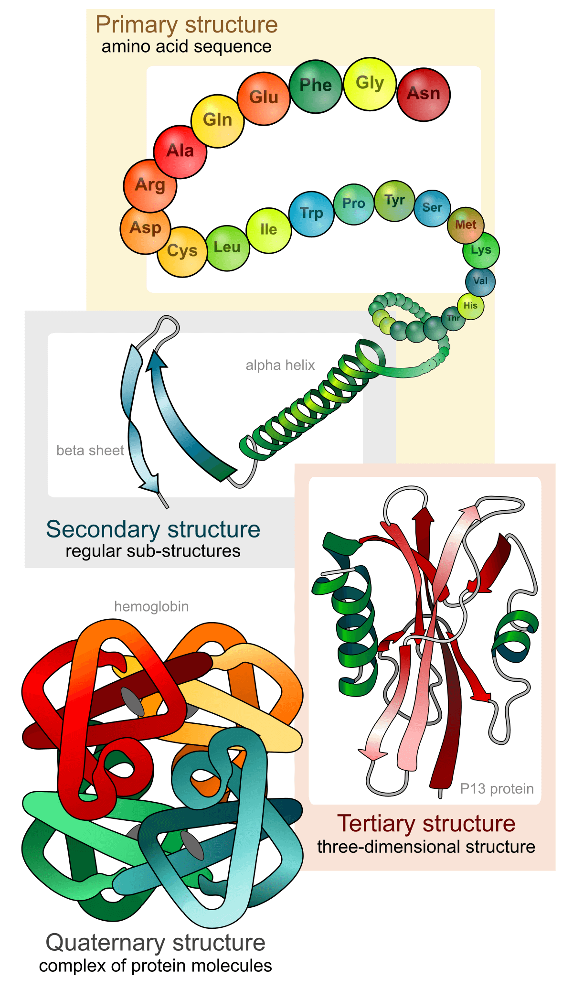
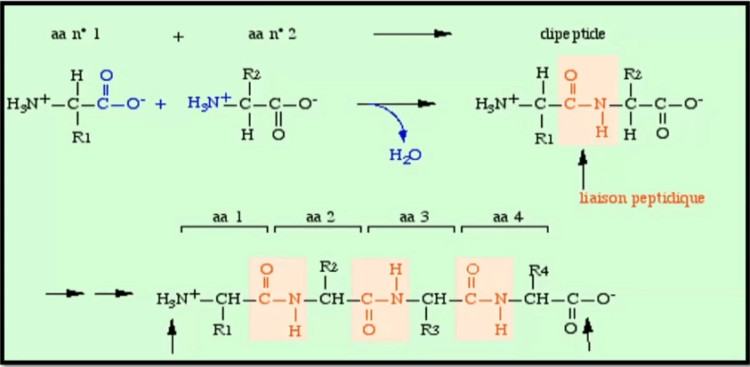

---
aliases:
  - protéines
---

# index

La synthèse de protéine nécéssite la présence d'ARN de transfert.

## Introduction

Molécule présente universellement dans le monde animal, par leur abondance cellulaire, assurent des fonctions vitales tant structurales et dynamiques. Les protéines participent à de nombreuses fonctions :

* Créer et maintenir une structure : Les protéines du cytosquelette, les protéines des tissus de soutien
* Transformer : Les enzymes catalysent l'essentiel des réactions chimique du vivant
* Reconnaitre et se défendre : les immunoglobulines
* Bouger et se déplacer : Les protéines à fonction motrice, les protéines des mouvement intracellulaires
* Transporter : Les transporteurs de petites molécules dont l'oxygène
* Informer et signaler : les recepteurs et leur ligands

Les protéines doivent leur spécificité à leur séquence, liée à l'ADN \(porteur de l'information génétique\)

### Définition

Peptide : enchaînement d'un nombre d'acide aminés inférieur à 50

* Si le nombre d'acide aminé est inférieur à 10 alors on à un **oligopeptide**
* Si le nombre d'acide aminé est supérieur à 10 alors on à un **polypeptide**

Protéine : Enchaînement d'un nombre d'acide aminé au delà de 50 Composée d'une ou de plusieurs chaîne peptidiques :

* Les protéines avec une chaîne polypeptidique sont des protéines monomérique ou de monomère
* Les protéines qui sont composées de plusieurs chaines polypeptidiques sont  des protéines multimériques
* Si les chaines polypeptidiques sont identiques, les proteines sont dite homomultimérique
* Si les chaines sont différentes, les protéines sont dite hétéromultimériques

## **Structure des protéines**

### **Structure primaire**

Ordre des acides aminés le long de la chaîne polypeptidique

La structure primaire est l'ordre dans lequel les acides aminés sont soudés par des liaisons peptidiques en une chaine polypeptidique

#### **Liaison peptidique**

La liaison est de type amide substituée : élimination d'eau entre les groupes $\alpha -COO$ et $\alpha -NH\_3^+$ de deux aminoacides

La chaine latérale ne participe pas à la liaison peptidique

Les aminoacides engagés dans une chaine peptidique sont appelés résidus. Leur nom est celui de l'aminoacide auquel on ajoute le suffixe "-yl"

#### **Caractéristique de la liaison peptidique**

La liaison peptidique est polaire Structure rigide et plane, la liaison peptidique est stabilisée par mésomérie et ne peut subirde libre rotation Les 4 atomes de liaison \(C, H, O et N\) sont dans un même plan : Encombrement stérique minimisé; rigidité de la liaison peptidique conduit à un squelette déini et stable

Longueur et angles : La longueur d'une liaison peptidique est de 1,32 A = 132 pm \(1,32.10^-10 m\) Elle est donc plus courte qu'une liaison simple ordinaire \(1,49 A\) mais plus longue qu'une liaison double \(1,27A\)

#### **Configuration : liaisons peptidiques cis et trans**

L'encombrement stérique entre les chaines latérales portées par les deux carbones $\alpha$ défavorise la configuration cis par rapport à la configuration trans étirée -&gt; La marjorité des liaisons peptidiques est de configuration trans

Exception : la configuration cis la plus commune est un lien X-Pro, 10% des résidus de proline dans une protéine se trouvent en configuration cis La proline et les glycines sont souvent absentes des structures secondaires, elle servent à rompre les structures secondaires

#### **Stabilité de la liaison peptidique**

L'hydrolyse de la liaison peptidique est favorisée thermodynamiquement :

* LA liaison peptidique est stable en condition physiologiques. Par contre elle est rapidement hydrolysée en conditions extreme
* La formation de cette liaison nécessite de l'énergie qui est apportée par l'hydrolyse de liaisons phosphates très énergétiques \(ATP\) au cours de la traduction

**Liaison isopeptidique**

Une liaison isopeptidique ou liaison peptidoïde est une liaison peptidique qui fait intervenir un groupement acide carboxylique ou amine de la chaine latérale d'un acide aminé

**Les peptides naturels**

Peptide régulier et irrégulier :

* Un peptide est régulier lorsque son hydrolyse libère uniquement des acides aminés de la série L
* Il est irrégulier lorsqu'il libère des acides aminés de la série D ou des radicaux autres que des acides aminés

Synthèse peptidique in vivo :

* Les peptides ribosomiques sont synthétisés par traduction de l'ARNm et sont utilisé comme molécule signal ou comme hormone peptidique
* Les peptides non ribosomiques représentent une famille très diverse de produits naturels avec de très nombreuses activités biologiques et de propriétés pharmacologiques

#### **Classification structurale des peptides**

Les peptides peuvent appartenir à 4 classes différentes : Structure linéaire, ramifiée, cyclique et semi-cyclique

#### **Structure linéaire**

C'est le cas le plus courant

Sa structure spatiale dépendra uniquement des chaines latérales des acides aminés. Il est possible que deux résidus Cystéines forment un pont disulfure intra-chaine ou extra-chaine, lui imposant alors une conformation

#### **Structure ramifiée**

Les acides aminés peuvent parfois former des liaisons amides à partir de leur chaine latérale

On parle de liaison peptidoïde ou liaison isopeptidique

Elle peut être formée à partir d'un résidu possédant une fonction NH3 \(Arginine ou Lysine\) ou COOH \(Acide Aspartique ou Glutamique\) sur sa chaine latérale

#### **Structure cyclique**

Cette structure est observée lorsque les acides aminés N-ter et C-ter sont liés.

Le peptides n'a alors plus d'extrémité

#### **Structure semi-cyclique**

Cette fois-ci, une seule extrémités de la chaine forme une liaison peptidoïde ou isopeptidique avec un résidus de la chaine

Ainsi l'acide aminé N-ter peut se lier à un résidu Asp ou Glu tandis qu'un résidu C-ter peut se lier à un résidu Arg ou Lys

### **Structure secondaire**

Repliement local des acides aminés en hélices, en feuillets, ou en d'autres formes similaires

### **Structure tertiaire**

Agencement stable dans l'espace de ces hélices et feuillets

### **Structure quaternaire**

Agencement des sous-unités entre elles, quand la protéine est constituée de plusieurs sous-unités indépendantes

