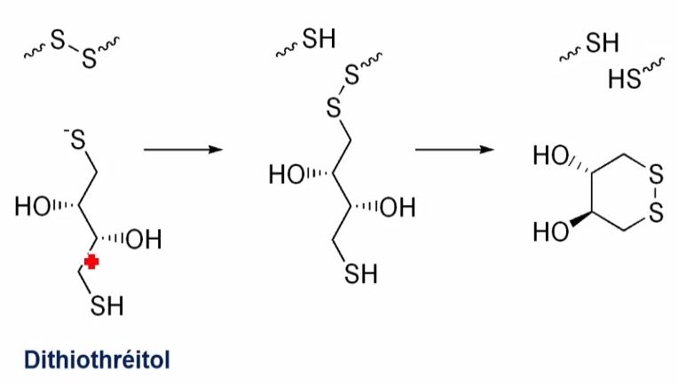

---
aliases:
  - protéines
---

# Protéine

La synthèse de protéine nécéssite la présence d'ARN de transfert.

## Introduction

Molécule présente universellement dans le monde animal, par leur abondance cellulaire, assurent des fonctions vitales tant structurales et dynamiques. Les protéines participent à de nombreuses fonctions :

* Créer et maintenir une structure : Les protéines du cytosquelette, les protéines des tissus de soutien
* Transformer : Les enzymes catalysent l'essentiel des réactions chimique du vivant
* Reconnaitre et se défendre : les immunoglobulines
* Bouger et se déplacer : Les protéines à fonction motrice, les protéines des mouvement intracellulaires
* Transporter : Les transporteurs de petites molécules dont l'oxygène
* Informer et signaler : les recepteurs et leur ligands

Les protéines doivent leur spécificité à leur séquence, liée à l'ADN \(porteur de l'information génétique\)

### Définition

Peptide : enchaînement d'un nombre d'acide aminés inférieur à 50

* Si le nombre d'acide aminé est inférieur à 10 alors on à un **oligopeptide**
* Si le nombre d'acide aminé est supérieur à 10 alors on à un **polypeptide**

Protéine : Enchaînement d'un nombre d'acide aminé au delà de 50 Composée d'une ou de plusieurs chaîne peptidiques :

* Les protéines avec une chaîne polypeptidique sont des protéines monomérique ou de monomère
* Les protéines qui sont composées de plusieurs chaines polypeptidiques sont  des protéines multimériques
* Si les chaines polypeptidiques sont identiques, les proteines sont dite homomultimérique
* Si les chaines sont différentes, les protéines sont dite hétéromultimériques

## **Structure des protéines**

### **Structure primaire**

Ordre des acides aminés le long de la chaîne polypeptidique

La structure primaire est l'ordre dans lequel les acides aminés sont soudés par des liaisons peptidiques en une chaine polypeptidique

#### **Liaison peptidique**

La liaison est de type amide substituée : élimination d'eau entre les groupes $\alpha -COO$ et $\alpha -NH\_3^+$ de deux aminoacides

La chaine latérale ne participe pas à la liaison peptidique

Les aminoacides engagés dans une chaine peptidique sont appelés résidus. Leur nom est celui de l'aminoacide auquel on ajoute le suffixe "-yl"

#### **Caractéristique de la liaison peptidique**

La liaison peptidique est polaire Structure rigide et plane, la liaison peptidique est stabilisée par mésomérie et ne peut subirde libre rotation Les 4 atomes de liaison \(C, H, O et N\) sont dans un même plan : Encombrement stérique minimisé; rigidité de la liaison peptidique conduit à un squelette déini et stable

Longueur et angles : La longueur d'une liaison peptidique est de 1,32 A = 132 pm \(1,32.10^-10 m\) Elle est donc plus courte qu'une liaison simple ordinaire \(1,49 A\) mais plus longue qu'une liaison double \(1,27A\)

#### **Configuration : liaisons peptidiques cis et trans**

L'encombrement stérique entre les chaines latérales portées par les deux carbones $\alpha$ défavorise la configuration cis par rapport à la configuration trans étirée -&gt; La marjorité des liaisons peptidiques est de configuration trans

Exception : la configuration cis la plus commune est un lien X-Pro, 10% des résidus de proline dans une protéine se trouvent en configuration cis La proline et les glycines sont souvent absentes des structures secondaires, elle servent à rompre les structures secondaires

#### **Stabilité de la liaison peptidique**

L'hydrolyse de la liaison peptidique est favorisée thermodynamiquement :

* LA liaison peptidique est stable en condition physiologiques. Par contre elle est rapidement hydrolysée en conditions extreme
* La formation de cette liaison nécessite de l'énergie qui est apportée par l'hydrolyse de liaisons phosphates très énergétiques \(ATP\) au cours de la traduction

**Liaison isopeptidique**

Une liaison isopeptidique ou liaison peptidoïde est une liaison peptidique qui fait intervenir un groupement acide carboxylique ou amine de la chaine latérale d'un acide aminé

**Les peptides naturels**

Peptide régulier et irrégulier :

* Un peptide est régulier lorsque son hydrolyse libère uniquement des acides aminés de la série L
* Il est irrégulier lorsqu'il libère des acides aminés de la série D ou des radicaux autres que des acides aminés

Synthèse peptidique in vivo :

* Les peptides ribosomiques sont synthétisés par traduction de l'ARNm et sont utilisé comme molécule signal ou comme hormone peptidique
* Les peptides non ribosomiques représentent une famille très diverse de produits naturels avec de très nombreuses activités biologiques et de propriétés pharmacologiques

#### **Classification structurale des peptides**

Les peptides peuvent appartenir à 4 classes différentes : Structure linéaire, ramifiée, cyclique et semi-cyclique

#### **Structure linéaire**

C'est le cas le plus courant

Sa structure spatiale dépendra uniquement des chaines latérales des acides aminés. Il est possible que deux résidus Cystéines forment un pont disulfure intra-chaine ou extra-chaine, lui imposant alors une conformation

#### **Structure ramifiée**

Les acides aminés peuvent parfois former des liaisons amides à partir de leur chaine latérale

On parle de liaison peptidoïde ou liaison isopeptidique

Elle peut être formée à partir d'un résidu possédant une fonction NH3 \(Arginine ou Lysine\) ou COOH \(Acide Aspartique ou Glutamique\) sur sa chaine latérale

#### **Structure cyclique**

Cette structure est observée lorsque les acides aminés N-ter et C-ter sont liés.

Le peptides n'a alors plus d'extrémité

#### **Structure semi-cyclique**

Cette fois-ci, une seule extrémités de la chaine forme une liaison peptidoïde ou isopeptidique avec un résidus de la chaine

Ainsi l'acide aminé N-ter peut se lier à un résidu Asp ou Glu tandis qu'un résidu C-ter peut se lier à un résidu Arg ou Lys

#### Technique d'analyse de la séquence primaire

* Permet de connaître son identité
* Permet d'indentifier le gène
* Permet de comparer des séquence, indentification des résidus les plus conservés; étude de l'évolution; application clinique

#### **Détermination de la structure d'un peptide**

La détermination de la structure primaire d'un peptide est conduite en deux étapes : \(Ces deux étapes ont comme point commun l'hydrolyse de la liaison peptidique\)

* Détermination de la composition en aminoacides
* Détermination de l'ordre des enchainements des résidus

#### **Hydrolyse de la liaison peptidique**

La liasion peptidique est très stable, son hydrolyse spontanée est quasiment nul. C'est pour cela que l'on réalise des traitements

* Traitement acide
  * **Polypeptidique + HCM 6M, à 100-120°C pendant 24 heures**
  * Certains résidus sont dégradés dans ces conditions sévère. Le tryptophane est dégradé
  * L'hydrolyse acide convertit asparagine en acide aspartique et glutamine en acide glutamique \(du NH4+ est éliminé\)
  * L'hydrolyse totale acide détruisant moins d'acide aminés, elle est en conséquence la méthode d'hydrolyse la plus utilisée
* Traitement basique
  * **Polypeptides + NaOH 6m, à 100°C pendant 4 à 8 heures**
  * Dans ces conditions, Arginine, Cystidine, Sérine, Thréonine sont décomposées et d'autres résidus sont désaminées et racémisés
* Enzymatiques par des endopeptidases \(endo à l'interieur\)
  * Trypsine : coupe en C-terminal des résidus basiques Lysine et Arginine
  * Chymotrypsine \(Kymo\) : coupe en C-terminal des résidus aromatiques Phenylalanine, Tyrosine, Tryptophane
  * Endoprotéase V8
  * Papaïne : coupure arès Arginine, Lysine, Acide Glutamique, Histidine, Glycine, Tyrosine
* Chimique : Bromure de cyanogène : Coté C-terminal de Methionine, qui est ensuite convertie en homosérine lactone en milieu acide

  **Coupure spécifique des liaisons peptidiques**

  Si polypeptide de plus de 50 résidus, on ne peut détermeiner directement sa séquence : on va couper en peptides plus petits que l'on va purifier et séquencer puis on rassemble le puzzle

#### **Analyse N-terminale**

Détermination de la nature du résidu N-terminal : 

* Aminopeptidase
  * Enzyme de la famille des exopeptidases
  * Son fonctionnement est **récurent** pour libérer seulement le premier AA, l'enzyme doit agir pendant un temps très court
  * L'AA libéré est identifié par chromatographie
* Réaction avec le fluoro-2,4-dinitrobenzène \(réactif de Sanger : DNFB\) Donne le premier acide aminé
* Réaction avec le chlorure de dansyle \(produit final plus stable et fluorescent + sensible\)

  Séquençage N-terminal : Dégradation d'Edman

#### **Analyse C-terminale**

Il n'y pas de processus comparable à la dégradation d'Edman pour l'analyse séquentielle des résidus C-terminal -&gt; Réaction enzymatique \(exopeptidase\)

Les carboxypeptidases détachent les acides aminés terminaux les auns après les autres

**Les carboxypeptidases inactives lorsque le peptide est cyclique, ou lorsque la fonction COOG de l'extrémité C-terminale est bloqué par un groupement chimique \(amide, ester de methyle\)**

4 Carboxypeptidases : A, B, C et Y

* La carboxypeptidase A, hydrolyse la liaison peptidique du côté C-terminal de tous les acides aminés \(libération de l'AAn\)
  * A l'exception de Proline, Arginine et Lysine \(si Pro\_n, Arg\_n, Lys\_n\)
  * Ou si proline est l'avant dernier acide aminé \(Pro\_n-1\)
* La carboxypeptidase B, hydrolyse uniquement la liaison peptidique du côté C-terminal de l'arginine et la lysine \(Uniquement si Arg\_n ou Lys\_n, libération de Arginine ou Lysine\)
  * Pas de coupure pour tous les autres AA en C-terminale
  * Pas de coupure si Proline est l'avant dernier acide aminé \(Pro\_n-1\)
* Les carboxypeptidases C et Y, hydrolysent la liaison peptidique du côté C-terminal de tous les acides aminés

### **Structure secondaire**

Repliement local des acides aminés en hélices, en feuillets, ou en d'autres formes similaires La structure secondaire décrit le repliement local de la hcaine principale d'une protéine. La structure secondaire est caractérisée par deux motif structuraux \(Hélice alpha, Feuillet Béta\) dont la propriété princiape est de stabiliser la structure de la protéine par des liaisons hydrogènes intramoléculaires

#### Liaison hydrogène

Cette liaison s'établit entre un donneur de liaison hydrogène et un accepteur. Le donneur est un composé à H acide, un hétéroatome \(azote, oxygène, souffre\) porteur d'un atome hydrogène \(comme dans les amines, alcools, thiols, acides et dérivés\) L'accepteur est composé d'un hétéroatome \(uniquement azote, oxygène ou fluor\) porteur de doublet libres

#### Hélice Alpha

L'hélice est une structure comapcte, de forme cylindrique caractérisée par un repliement hélicoïdale périodique de la chaine polypeptidique. -&gt; Structure en forme de bâtonnet Dans la littérature et dans les structures tridimensionelles des protéines, les hélices alpha sont représentées sous forme de ruban Conformation repliée impliquant des liaison hydrogènes répétitives entres atomes de la chaine principale \(NH et CO\) des résidus i et i+4

Caractéristique : Hélice droite, 3,6 résidus par tour, 0,54 nm \(5,4A\) de pas par tour, la liaison hydrogène est parallèle à l'axe, longueur de la liaison H 0,286 nm, la longueur maximale d'une halice est environ 20 acide aminés, les chaines latérales R sont projectées vers l'exterieur de l'helice

La configuration L des acides aminés privilégie un enroulement à droite de l'hélice. L'hélice tourne dans le sens des aiguilles d'une montre de l'extrémité N-ter à l'extrémité C-term

Si les AA tournés vers l'exterieur sont hydrophobes : l'hélice alpha est hydrophobe Si les AA tournés vers l'exterieur sont hydrophiles : l'hélice alpha est hydrophiles Si les résidus hydrophobes sont sur une face et les résidus hydrophiles sur l'autre face, l'hélice alpha sera amphipatique \(ou amphiphile\)

Les hélices alpha qui traversent intégralement la membrane sont appelées hélices transmembranaires.

* Ces hélices sont très majoritairement constituées de résidus hydrophobes et sont donc cpable d'interagir avec les phospholipides de la membrane
* Ce sont des interactions de type hydrophobe

#### **Feuillet béta**

#### **Boucles et tours**

### Structure tertiaire

Agencement stable dans l'espace de ces hélices et feuillets La structure tertiaire est la resultante des arrangements des structures secondaires entre elles aboutissant à la forme global spécifique de la protéine Nous ne pouvons accéder à la coanissance de la structure tertiaire d'une protéine uniquement à travers : Une étude cristallographique aux rayons X; Une étude par résonance magnétique nucléaire \(RMN\) La structure tertiaire d'une protéine dépend de sa structure primaire, ainsi que de son environnement.Les conditions locales de chaque compartiment cellulaire, le solvant, la force ionique, la viscosité et la concentration contribuent à moduler la conformation

#### Maintien de la structure

Les chaines latérales jouent un role dans la stabilité de la structure tertiarie, grace à différents types d'interactions non covalentes et un type d'interaction covalente

**Liaisons hydrogènes**

Les liaisons hydrogènes ne se font pas entre les liaisons peptidiques mais entre chaines latérales Elle interviennent parmi les résidus dont les chaines latérales présentent des groupements :

* Alcools, hétérocycles : Ser,Thr,Tyr,Asn,Gln,Cys,Trp
* Acides carboxyliques : Asp, Glu
* Amines : Lys,Arg,His

**Liaisons Ioniques**

Seulement entre les acides aminés ionisés à PH 7  
A résidus anioniques : Asp, Glu  
A résidus cationiques : Lys, Arg, His  
C'est le résultat de la formation de ponts salins entre les chaines latérales de charges opposées

**L'effet hydrophobe**

Cette interaction est le resultat de multiples facteurs permettant aux acides aminés hydrophobes de minimiser leur contact avec les molécules d'eau

les acides aminés hydrophobe migrent vers le coeur de la protéine \(Groupement cyclique de la phénylalaline et de la tyrosine\)

**Liaisons covalentes**

Les cystéines peuvent créer des liaisons covalentes par l'intermédiaires de leurs atomes de souffre. La molécule résultante de la liaison de deux cystéines est la cystine.

Formation des ponts disulfures par oxydation, rupture des ponts disulfures par différentes méthodes.

**Rupture du pont disulfure**

Méthode douce et réversibles par réduction au B-mercapto-éthanol =&gt; Résidus thiols \(dans cette méthode, la réduction est réversible par retour dans un milieu oxydant\)  
Le dithiothréitol \(DTT\) est un agent réducteur fort, dont l'efficacité résulte de sa capacité à former un cycle à six atomes avec un pont disulfure interne.

### **Structure quaternaire**

Agencement des sous-unités entre elles, quand la protéine est constituée de plusieurs sous-unités indépendantes  
Ce type de structure ne concerne que facultativement les protéines globulaire.  
Il s'agit de l'association de sous-unités dans une même molécule protéique. Une sous unité à l'état libre est un monomère. La protéine est un oligomère. Si le nombre de sous unités associé est supérieur 8 on parle alors de protéine polymérique ou multimère  
Ces sous-unités sont reliés entre elles par les mêmes liaisons que les structures tertiaire :

* Electrostatique \(Lys / Asp =&gt; NH3+ / COO-\)
* Hydrogènes \(Ser-OH\)
* Hydrophobes entre plusieurs résidus apolaire
* Ponts disulfures

Exemple : Hémoglobine, 4 sous unité, 2 sous unité alpha \(141 acides aminés\) et 2 beta \(146 acides aminés\)  
**Avantage**  
Fonction de signalisation ou de controle \(l'enzyme protéine-kinase dépendante de l'AMP cyclique\)

