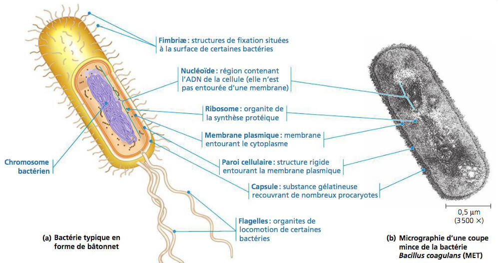

# Cellule à l'organisme

## Historique

1665 : Robert Hooke observa une fine coupe d’un bouchon de liège - cellules, ces petites structures vides formant le liège   
1839 : Schwann et Schleiden -première fois le terme de cellules vivantes « tous les organismes sont faits de petites unités : les cellules ».  
C'est le premier axiome de la théorie cellulaire.

### Les deux points fondamentaux


Les **propriétés** d’**une cellule** sont celles de **toutes les cellules**

Les cellules sont des **structures instables** indispensables pour leur fonctionnement


### La théorie cellulaire

* La cellule est l'unité de base vivante structurale et fonctionnelle de tous les organismes vivants \(1830\) =&gt; Il existe deux types de cellules avec et sans noyau :  - La cellule procaryote - La cellule eucaryote \(vrai noyau\)
* Toute cellule provient d'une autre cellule, c'est le principe de la division Division -&gt; Différenciation -&gt; mort

## Différenciation cellulaire et ses conséquences


**Différenciation :** Acquisition caractéristique propre qui sont en lien avec la fonction de la cellule


La différenciation cellulaire apporte comme conséquence une spécialisation des cellules, les cellules sont organisées de façon plus en plus complexe  
Cellule -&gt; Tissu -&gt; Organe -&gt; Système \(organisme\)

Il y a 4 types de tissus différents  
- Conjonctif  
- Épithélial \(Cellule qui bordent l'organisme, qui sont en relation avec l'extérieur\)  
- Nerveux  
- Musculaire

### Conséquence de la différenciation

#### Mécanisme de coordination communication

Un organisme pluricellulaire est une structure complexe qui exige des processus de communication entre les cellules. Il existe 3 modes de communication des cellules.

Couplage direct : Jonction communicantes entre les cellules  
Contact direct : Jonction d'adhérence  
Communication indirect : Emettrice, Signal, Réceptrice

#### Cohésion des cellules

#### Rétrocontrôle positif ou négatif

#### Ultrastructure

## Définition


**Biogénèse :** La biogenèse est la création d'un nouvel organisme vivant par un ou plusieurs organismes existants, ou encore de nouvelles cellules à partir d'une ancienne.

**Membrane plasmique** :

**Organites :** 

**Cytosol :** Phase liquide dans laquelle baigne les organites cytoplasmique présent à l'intérieur d'une cellule. Le cytosol, constitue avec le cytosquelette, le hyaloplasme.

**Cytoplasme :**

**Endocytose :**

**Différenciation :** Acquisition caractéristique propre qui sont en lien avec la fonction de la cellule

**Totipotentes :** 

**Pluripotente :**


