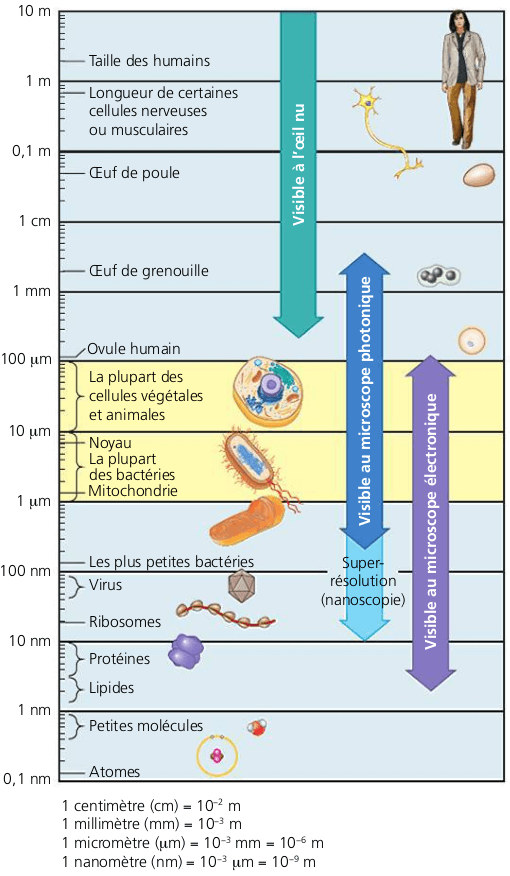
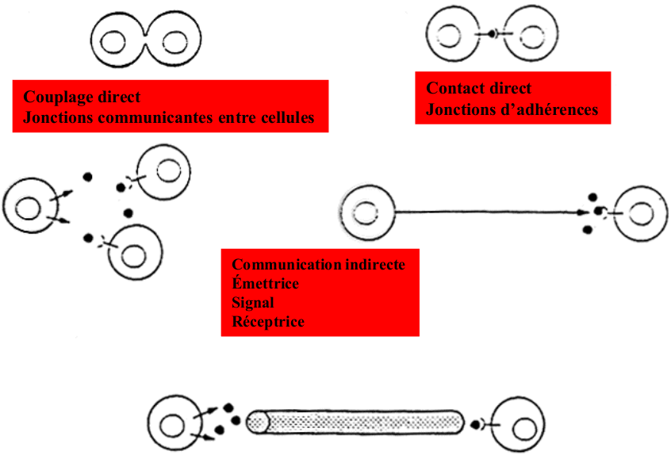
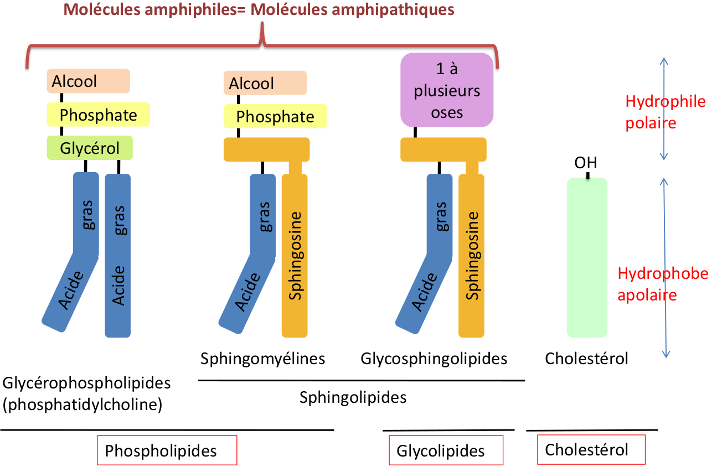
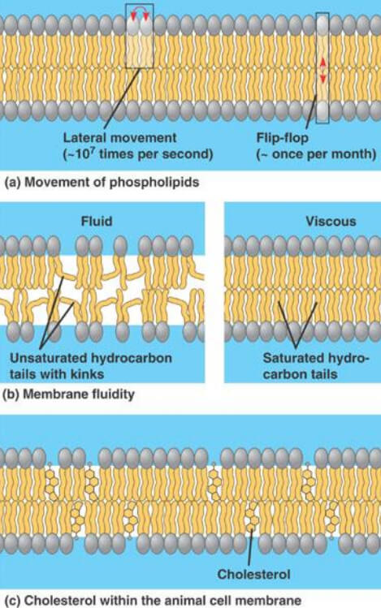
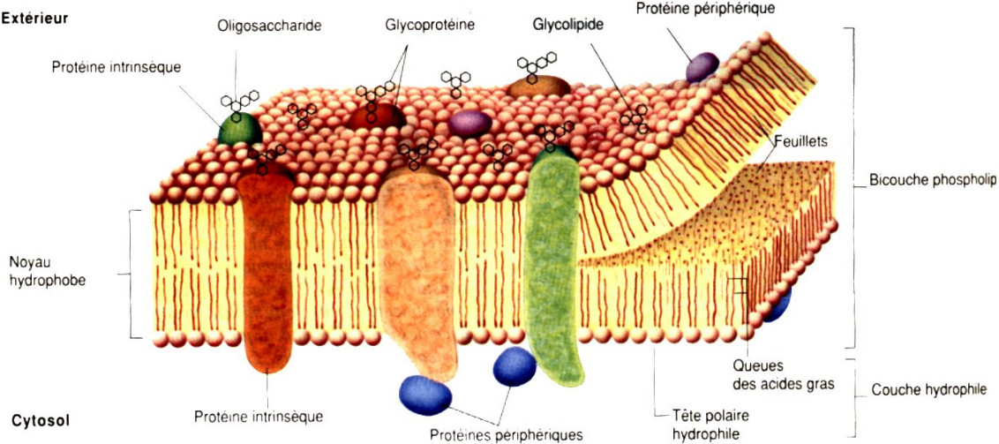
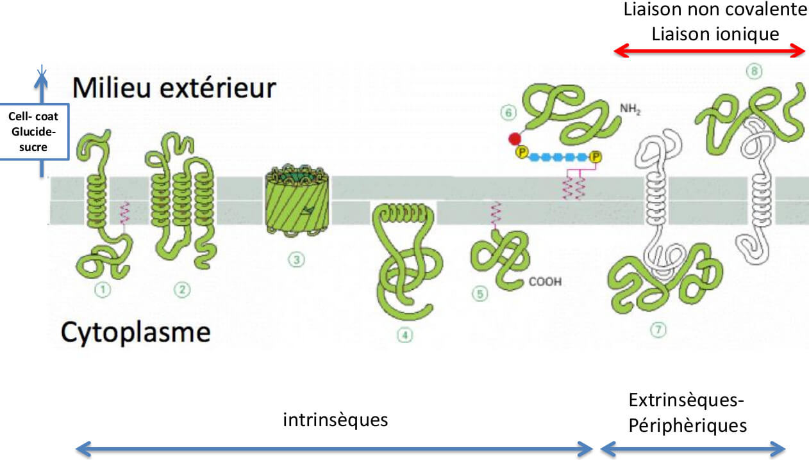
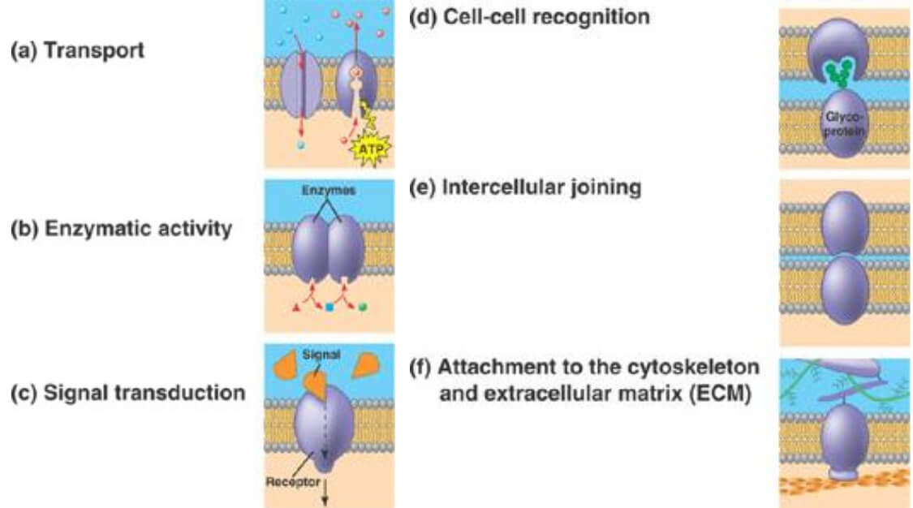
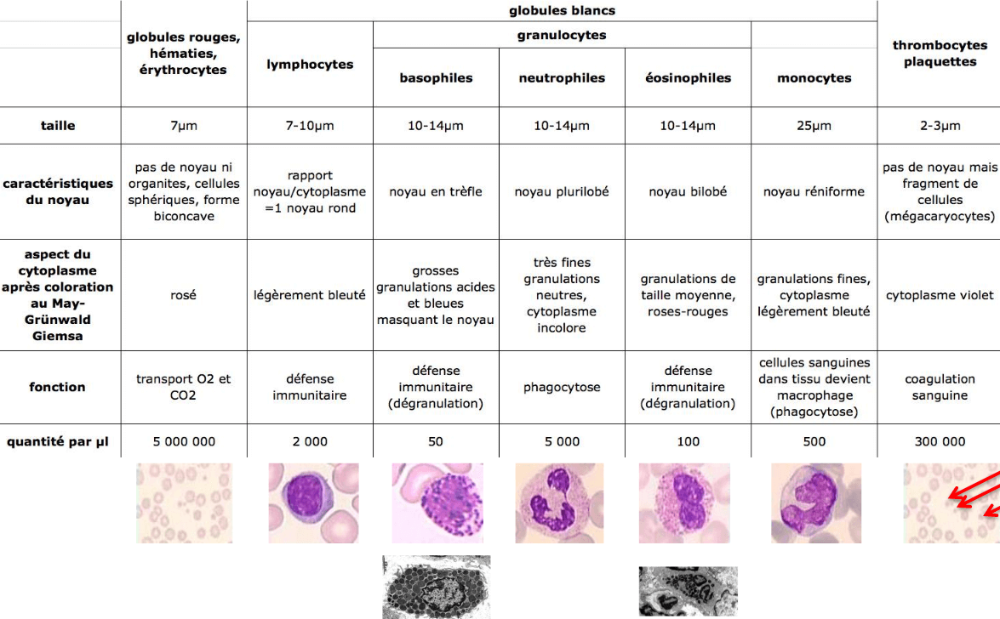

# Cellule à l'organisme

## Historique

1665 : Robert Hooke observa une fine coupe d’un bouchon de liège - cellules, ces petites structures vides formant le liège   
1839 : Schwann et Schleiden -première fois le terme de cellules vivantes « tous les organismes sont faits de petites unités : les cellules ».  
C'est le premier axiome de la théorie cellulaire.

### Les deux points fondamentaux


Les **propriétés** d’**une cellule** sont celles de **toutes les cellules**

Les cellules sont des **structures instables** indispensables pour leur fonctionnement


### La théorie cellulaire

* La cellule est l'unité de base vivante structurale et fonctionnelle de tous les organismes vivants \(1830\) =&gt; Il existe deux types de cellules avec et sans noyau :  - La cellule procaryote - La cellule eucaryote \(vrai noyau\)
* Toute cellule provient d'une autre cellule, c'est le principe de la division Division -&gt; Différenciation -&gt; mort

**AJOUTER IMAGE**

## **Observation des cellules**

Pour observer différent constituant on peut utiliser la loupe, le microscope optique, le microscope électronique à transmission ou à balayage

#### Notion d’échelle

Jusqu’à 200nm visible au microscope optique  
Plus gros que 200nm -&gt; Visible à l’œil, loupe et microscope optique  
200nm visible pour observer 2 points espacé de cette distance

### Loupe

Permet d'observer l'échantillon en entier, il est possible de voir les couleurs sous la peau.

### Microscope optique

Premier microscope optique crée en 1665 par Robert Hooke.  
Pour observer les cellules sur ce genre d'appareil il faut fixer la cellule avec de l'aldéhyde pour enlever l'eau et pouvoir couper l’échantillon à observer. Une fois l'échantillon mis sous aldéhyde on l'englobe  dans de la paraffine pour ensuite découpe en fine lamelle de 5 à 7 um avec un microtome.  
Loi d’Abbe : résolution du microscope résolution maximum = pouvoir séparateur &gt;200 nm

#### Principe du microscope optique à fluorescence.

Principe immunomarquage localisation de protéine\(s\); Où est-ce que cette protéine est exprimée?  
Production anticorps primaire dirigés contre la cible  
Marquage des anticorps par des fluorochromes  
ANTICORPS PRIMAIRES dirigés contre la cible

#### Principe hybridation in situ Localisation d’ADN ou ARN

### Le microscope électronique en transmission

utilise des sélectons, moins puissant que les photons, les échantillons doivent être de 50nm. **L'échantillons est placé sous vide.** Cette coupe de 50nm est faite avec un diamant puis il est positionné sur la grille en métal.  
Utilisation de contrastant pour coloré; acétate d'uranyle et citrate de plomb.  
Plus c'est sombre plus il y a présence de lipides ou protéines

Préparation des échantillons pour la microscopie électronique à transmission \(CF td\)  
Il y a post fixation pour les échantillons au microscope optique pour fixer les lipides.  
Pour observer les élément de l'échantillon on utilise des contrastants pour rendre visible les Protéine fixés aldéhyde et contraster avec l'acétate d’uranyle ou les Lipides fixés avec l'osmium et contraster par le citrate de plomb

### Microscopie électronique à balayage \(MEB\) \(scanning electron microscopy - SEM\)

### Séparation des constituants

* Centrifugation : utilise la capacité des organites de sédimenter en fonction de leur taille et leur densité 
* Chromatographie : séparation sur gel en fonction de leur taille, leur masse molaire.
* électrophorèse et cytométrie en flux

## Différenciation cellulaire et ses conséquences


**Différenciation :** Acquisition caractéristique propre qui sont en lien avec la fonction de la cellule


La différenciation cellulaire apporte comme conséquence une spécialisation des cellules, les cellules sont organisées de façon plus en plus complexe  
Cellule -&gt; Tissu -&gt; Organe -&gt; Système \(organisme\)

Il y a 4 types de tissus différents  
- Conjonctif  
- Épithélial \(Cellule qui bordent l'organisme, qui sont en relation avec l'extérieur\)  
- Nerveux  
- Musculaire

### Conséquence de la différenciation

#### Mécanisme de coordination communication

Un organisme pluricellulaire est une structure complexe qui exige des processus de communication entre les cellules. Il existe 3 modes de communication des cellules.


* **Couplage direct :** Jonction communicantes entre les cellules
* **Contact direct :** Jonction d'adhérence, les constituants ne passent pas, permet juste de **lier les cellules entres elles.** \(Les cellules mettent en oeuvre des forces mécanique qui permettent la cohésion cellule/cellule ou cellule/matrice cellulaire.
* **Communication indirect :** Emettrice, Signal, Réceptrice. Emission de signal par la circulation sanguine en utilisant des hormones.


#### Rétrocontrôle positif ou négatif


Signal aller / retour pour permettre l’arrêt ou la prolongation du signal.


## Protéine

Synthèse d'une protéine nécessite la présence d'ARN de transfert

## Cellule Eucaryote

#### Les ultra structures cellulaires fondamentales

### Les membranes cellulaires

#### Composition global

Les membranes biologique sont constitués  de 30 à 50% de lipides, et de 50 à 70% de protéines. Il y à une faible présence en sucre avec le glycoprotéines et glycolipides \(Pourcentage différent pour chaque cellules\). Présente pour toutes les cellules, elle protège et isole de l’extérieur.

#### Organisation des lipides dans la bicouche

Les lipides membranaires peuvent se comporter en micelle, mono-couche, liposome unilamellaire ou et surtout en **bicouche plane simple \(plus présent ici\)**  
Les lipides membranaires sont représentés a environ 5 000 000/μm2

Ce sont des molécule amphiphiles= Molécules amphipathiques

#### Propriétés des membranes

* Fluidité et asymétrie 
  * Rotation sur place \(très rapide : 1011/sec\)
  * Diffusion latérale \(rapide\) 
  * Changement de feuillet \(lent\)

#### Composition protéique


Protéine intrinsèque, présente dans la membrane  
Protéine extrinsèque ou périphérique  
Manteau cellulaire \(Cell Coat\) : ajout du sucre, **glycocalix,** l'ajour des sucre peut augmenter jusqu'à 100 fois l'épaisseur de la membrane \(700nm de couche de sucre\)


#### Rôle membrane plasmique

* Transport : échange entre milieu intra et extra cellulaire \(perméabilité sélective\) - **Transport passif :** transport composé **sans consommation d'énergie.**  Facilité grâce au protéine 1,2 et 3 \(protéine de transport, intrinsèque qui traverse la membrane\) Diffusion simple, diffusion de composé directement à travers la bicouche lipidique - **Transport actif :**  grâce à une protéine de transport et une consommation d'énergie Diffusion facilité dans le sens ou il faut équilibré la concentration intérieur et extérieur.
* Activité enzymatique : prendre le substrat et le transformé en produit. Protéine 1,2,3,4,5,7 car dans le cytoplasme \(Enzyme dans le cytoplasme\)
* Transmission signal : entre l'extérieur et l'intérieur. Protéine 1,2,3
* Reconnaître cellulaire voisine / s'attacher à la cellule voisine / s'attacher avec le milieux extracellulaire \(protéine 1,2,3,4b,6 et 8\)

#### Différence membrane cellulaire et organite


Membrane organite n'a pas de couche extracellulaire \(car dans la cellule\)


### Noyau


Le noyau est le lieu de la réplication de l'ADN et de la maturation de l'ARN 


Le noyau est composé d'une enveloppe nucléaire, elle même composée d'une membrane externe avec des ribosome, ribosome qui permettent la traduction des Arn en protéine, une membrane interne et un espace membranaire. Collé à la membrane interne on trouve généralement de l'hétérochromatine, dans le noyau des eu chromatine. Enveloppe nucléaire espacé de pore nucléaire d'environs 120nm mais tellement bouché, laissant passer les élément d'environ 9nm.  
Le pore nucléaire à comme caractéristique de permettre les échanges de molécules entre le cytoplasme et le nucléoplasme dans les deux sens.  
La chromatine s'enroule autour des protéines d'histones

#### Euchromatine et hétérochromatine

Hétérochromatine dense et donc fort visible au microscope électronique à transmission, a l'inverse euchromatine est moins condensé est donc plus claire \(blanche\) au microscope électronique à transmission.  
**Nucléole**  
Zone composé du centre fibrillaire composé de **l'ADN qui code pour les ARN ribosomique**  
La zone fibrillaire, l'ADN qui transcrit en ARN ribosomique \(maturation des ARN ribosomiques\)  
La zone granulaire ou il y a assemblage des ARN ribosomique avec des protéines ribosomiques \(ADN dans mitochondrie\)  
Dans les nucléole il y a transcription de l'ADNr en ARNr et formation des sous unités du ribosome

### Le hyaloplasme ou cytosol


Phase plus ou moins liquide d'une cellule comprise entre la membrane plasmique et l’extérieur de la membrane des organites, alors que l'on appelle cytoplasme, le contenue de la cellule, c'est à dire, le hyaloplasme et les organites.


### Ultrastructure membrané

#### Le réticulum endoplasmique granuleux/rugeux

Sur l’extérieur du REG il y à des ribosomes. Ce sont des sac empilé et connecté. Le REG est en lien direct avec le noyau \(par son enveloppe\), Il permet la synthèse des protéines.  
Des vésicules se forment au bord du REG en se détachant de celui-ci.  
L’ARNm sort du noyau, est pris en charge par les polysomes \(Plusieurs ribosomes sur un même ARN\)

#### Le réticulum endoplasmique lisse

Absence de ribosome, tube empilé et connecté, il est en continuité avec le REG \(lien direct\), le REL synthétise des lipides et permet le stockage du calcium.

#### Appareil de Golgi \(Dictyosomes\)


Composé de tous les dictyosomes d'une cellule ! Il sert à la formation des lysosomes  
Les protéines qui sortent du dictyosome vont à l’extérieur de la cellule


L'appareil de golgi est au moins composé de 3 zones \(3 sacs\) cis, médian, trans. Les vésicules se déplace de sac en sac.  
L'appareil de golgi permet la **maturation des protéines** \(Ajout de sucre notamment, glycolyser\) et **lipides du REL**, ensuite il envoi les protéines vers leur destination finale \(centrifuge\)  
La taille de l'appareil de golgi dépend de l'activité cellulaire, les saccules sont en relations d'un coté avec le REL

#### Les vésicules enzymatiques : Lysosomes et peroxysome

**Les lysosomes** contiennent mélange d'enzymes digestives.  
Elles permettent la dégradation intracellulaire :   
- Digestion des substances étrangères \(Bactérie\)  
- Digestion des composants endommagé de la cellule


Les lysosomes sont denses au électrons, proviennent d'un dictyosomes, déversent leur contenu dans d'autre vésicules


Cette mise en évidence du trafic intracellulaire à été observé par l'ajout de radioactivité puis le suivi des protéines.

**Les peroxysomes** sont présent chez tous les eucaryote et permettent l'élimination des molécule toxique part une oxydation et donc élimination des molécules toxiques \(acide gras, alcool etc\)  
Ne provient pas des membranes intracellulaire mais se forment par incorporation des protéines et lipides du cytosol. **Pas de membranes**

**Mitochondrie**

Forme varié, toujours d'un diamètre d'environ 1 um, entouré de deux membranes externe régulière et interne replié en crêtes avec espace intermembranaire entre les deux, matrice et crête.  
Fonction :   
Dans mitochondrie qu'est puisé l’énergie par les molécules organique. Cette énergie est l'ATP. Intervient dans l’apoptose/ Contient son propre ADN.  
Respiration cellulaire, le signal de mort cellulaire vient des mitochondrie, apoptose \(mort cellulaire\). Protéine synthétisé par la mitochondrie.  
ADN mithocondrial, est transmi uniquement par la mère, est circulaire sans introns chez l'homme, 73 gènes \(22 ARNm, 2ARNr et 13 protéines\) 2000 mitochondrie par cellule

### Ultrastructure non membrané

#### Cytosquelette


Tous les éléments du cytosquelette sont des protéines allongées résultant de la polymérisation d'éléments monomériques.   
Le cytosquelette forme un réseau complexe qui s'étend dans tout le cytoplasme. Le cytosquelette est une structure très dynamique qui se réorganise continuellement au cours des différents évènements cellulaires \(maintien de la forme, migration, division, mouvements cellulaires et intracellulaires, ...\)


#### Actine

Microfilament d'actine, protéine la plus abondante avec 5% au moins de la masse protéique.  
- Codée par 6 gènes au moins, homologue à 90% au niveau protéique.  
- Liée à l'ATP et à des protéines de liaison

Fonction de l'actine + myosine :   
- Contraction cellulaire  
- Migration cellulaire  
- Maintien de l'intégrité tissulaire \(la forme cellulaire\)  
- Endocytose

#### Filament intermédiaire

Chaque type cellulaire à un nom différent. Taille variable de 10 à 15nm, présent dans le **cytoplasme** et **noyau**. Il n'y à pas de présence de myosine ! Ils ont un rôle de structure  
Neurone -&gt; Neurofilament dans les maladies humaines. Epithélium -&gt; chératine / Noyau toute cellule -&gt; Lamine  
Soutient de l'enveloppe nucléaire \(rôle de structure\)

#### Microtubule

Les microtubules ne sont pas synthétisés par le centrosome, il partent du centrosomes ! Constitué de tubes dont la paroi est formé de **13** **protofilaments** de dimères de **tubuline alpha et beta.** Ont un diamètre de 20nm ****

Fonction des microtubules :   
- Déplacement des constituants cellulaires Dynéine / Kinésines  
- Mouvement de cils / flagelle : 9 doublé de cestale  
- Intervient dans la division cellulaire, mitose \(attache chromosome et après réplication sépare l'ADN\)

#### Ribosomes

Les ribosomes peuvent être libres dans le cytoplasme ou associés au réticulum endoplasmique rugueux/granuleux  
Traduction d'ARNm lors de la synthèse des protéines

### Cellule végétale

#### Différence entre cellule animal et cellule végétale

La cellule végétale est composé d'une vacuole, de plasmodesme, d'une paroi cellulaire et de chloroplaste. Est n'à pas de centrosome !

#### Paroi cellulosique


La paroi est composé de :

* Fibre de cellulose \(glucide constitué d'une chaine linéaire de molécules de 200 à 14000 D-Glucose
* Un ciment complexe de pectines et d'éléments associés
* De l'eau \(à 80% de la masse de la paroi\)
* Protéine \(Glycoprotéine et enzyme\)
* ions \(associé à l'eau et aux microfibrilles de cellulose\)
* Protéine riche en hydroxyproline qui la rendent moins extensible


#### Plasmodesme

Structure : Canal traversant la paroi végétale, s'ouvre grâce à l'action de l'actine et la tubuline. D'environ 20 à 40nm   
Rôle : Echange via le réticulum endoplasmique lisse de l'eau, les solutés, les protéines et certains virus.

#### Chloroplaste

Lieu de la photosynthèse constitué d'une membrane de thykaloïde, capture l'énergie de la lumière. Organisme autotrophe, car ils produisent de l’énergie de la matière organique \(glucose\) à partir d’éléments inorganiques \(eau\)

#### Mitochondries dans les cellules végétales

La photosynthèse des chloroplaste et la respiration cellulaire des mitochondries sont des réactions inverses. 

#### Appareil vacuolaire

Les cellules des végétaux ont constamment la même taille, c'est grâce à la vacuole que ce contrôle de taille s'effectue. Turgescence et plasmolyse. Le volume du cytosol est constant durant la durée de vie de la cellule.  
La vacuole est délimité par le tonoplaste, elle contient de l'eau, des glucides, protéines, acide aminés, des ions et des pigments.  
Rôle :   
- Homéostasie \(bonne concentration des constituants cellulaire\)  
- Turgescence \(entrée d'eau dans la cellule\)  
- Plasmolyse \(Sortie de l'eau de la cellule\)

## Tissus

### Tissu conjonctif

#### Caractéristique

C’est un tissu de soutien qui emballe les 3 autres tissus. Il s’agit d’un tissu avec des cellules isolées \(fibroblastes\) responsables de la synthèse et de l’organisation de la matrice extracellulaire.  
Synthèse des collagène, les fibres de collagène son organiser de différentes manière, lâche \(mésentère\) et dense \(Derme\)  
Pour les fibres dense elles peuvent être orienté parallèle \(tendon\) ou orienté contreplaqué \(cornée\)  
La matrice extracellulaire est composé de :  
- matériel fibrillaire \(dense au électrons\); collagène et élastine.  
- matériel amorphe ; protéoglycannes \(coeur protéique + glycoaminoglycanes\) // Glycoprotéine \(fibronectine, laminine, tesnacine, intégrine\)  
les granulocytes éosinophiles ont un noyau bilobé et interviennent dans l'allergie et la lutte contre les parasites

La lame basale Composants majeurs   
Structure se décompose deux feuillets   
Fonctions : ???

#### Rôle

Matériel amorphe : glycoprotéines \(ex : fibronectine, laminine, tesnacine, intégrine\)  
Strucutre de laminine / Structure de la fibronectine  
Les intégrines :   
La lame basale : composant majeurs, structure se décompose en deux feuillets  
Fonction ; 

#### Les différents types de tissus conjonctifs

Cartilage  
Recouvre les pièces osseuses du squelette au niveau des articulations mais constitue également la charpente du nez, de l’oreille et des voies aériennes supérieures. Il s’agit d’un tissu conjonctif dur et résistant à la compression.  
Tissus osseux  
Les ostéoblastes – ostéocytes - ostéoclastes  
Sang  
Tissus adipeux  
Graisse blanche / Graisse brune

Tissus adipeux  
Graisse blanche et Graisse brune

#### Coloration

Le noyau est basophile car il contient de l'ADN \(Acide qui réagis avec colorant basique\)  
May-Grünwald Giemsa ****aussi appelée Pappenheim  
Granulocyte basophile coloration bleuté

### Tissus epithéliaux

#### Caractéristique

Caractéristiques du pôle apical : Microvillosités, Les cils  
Caractéristiques du pôle latéral : Interdigitations membranaires

#### Différentes catégories

* Les épithélia à fonction de revêtement 
  * Ce sont des épithélia qui doivent protéger :  pluristratifiés : épiderme  pseudostratifié : trachée  monostratifié: vaisseau, poumon
* Les épithélia à fonction de Sécrétion
  * cellules isolées : cellules caliciformes ou cellules à mucus : intestin ou trachée  La cellule caliciforme Coloration histologique en organisation tubulaire Intestin \(côlon\) en organisation glandulaire : unité = acinus :pancréas ou glande salivaire
  * Différents modes de sécrétions : merocrine, apocrine et holocrine
  * Rétrocontrôle positif et négatif
  * Les glandes endocrine : hypophyse / glande thyroïde
* Les épithélia à fonction d’absorption

#### Les jonctions cellulaires du tissu épithélial

**D’étanchéité**  
Synonymes : Jonction serrée, Jonction occlusive, fonctiond de barrière   
**D’adhérence \(**d’ancrage au pôle latéral des cellules\)  
****Deux catégories selon la protéine du cytosquelette :   
- jonction intermédiaire : Actine \(Synonyme jonction d’adhérence\)  
- Desmosome : filament intermédiaires \(Synonyme : spot desmosome, jonction sous forme de disque\)  
**Intermédiaire**  
Fait intervenir 3 protéine : protéines trans-membranaires \(cadhérines\), protéines de plaque, protéines du cytosquelette : actine  
**Hémidesmosomes**  
Fait intervenir 3 partenaire : protéine cytosquelette, la kératine, protéine plaque, protéine trans-membranaire \(intégrines\)  
Fonction des jonctions d'adhérence,   
**Jonction communicante**  
jonctions gap, jonctions à trous ou lacunaires, jamais au pôle apical

### Tissus nerveux

#### Caractéristiques

Système Nerveux / Neurones / Cellules gliales  
rétrocontrôle positif et négatif  
Synapse axo-dendritique  
Les cellules gliales : L’oligodendrocyte ou la cellule de schwann  
L’oligodendrocyte ou la cellule de schwann  
La myéline  
L’astrocyte

### Tissus musculaire

#### Le tissu musculaire strié squelettique volontaire

Le développement du muscle strié squelettique est appelée la myogenèse  
Type I \(aérobie\), muscle rouge lente  
Type II \(anaérobie\), muscle blanc, rapide fatigable  
Composé de myosine, filament fin d'actine et Tropomyosine-Troponine  
La jonction neuro-musculaire ou plaque motrice \(Synapse\)  
Tubule T  
Le Ca++ se fixe sur la Troponine C. Changement de conformation

#### Le tissu musculaire strié cardiaque involontaire

cellule mononuclée, noyau central, myofibrilles plus organisées, nombreux vaisseaux sanguins  
**Les jonctions cellulaires du tissu musculaire strié cardiaque**  
La strie scalariforme   
Il existe 3 types de jonction : d’adhérence / jonction intermédiaire desmosome \(100F\) de communication  
La strie scaliriforme

#### Le tissu musculaire lisse involontaire

**Les jonctions communicantes :** Impliquée dans le couplage métabolique \(hormonal\) et électrique de deux cellules en permettant le passage de petites molécules ou ions entre leurs cytoplasmes.  
Contraction muscle lisse :   
- Entrée calcium stocké dans cavéoles   
- Activation de la myosine   
- Interaction avec actine  
- Raccourcissement de la cellule

#### Les maladies neuromusculaires 

Les myasthénies  
faiblesse musculaire s’aggravant à l’effort \(4 à 6 cas/ 1 0 0 0 0 0 habitants\)  
**Myasthénies autoimmunes:**  
le recepteur de l’acetylcholine est la cible principale de l’attaque autoimmune \( 8 0 % des patients\)  
myasthénies séropositives  
- Myasthénies séronégatives: anticorps dirigés contre d’autre protéines de la jonction neuromusculaire: acétylcholine est érase, MuSK  
Myasthénies congénitales:  
- maladie rare  
Mutations de gènes codant pour des constituants de la jonction neuromusculaire:  
- Syndrome “canal lent” : mutation du RACh  
- temps d’ouverture du canal trop long  
- Deficit en synthèse AChR ou ACh Est érase

## Définition


**Biogénèse :** La biogenèse est la création d'un nouvel organisme vivant par un ou plusieurs organismes existants, ou encore de nouvelles cellules à partir d'une ancienne.

**Membrane plasmique** :

**Organites :** 

**Cytosol :** Phase liquide dans laquelle baigne les organites cytoplasmique présent à l'intérieur d'une cellule. Le cytosol, constitue avec le cytosquelette, le hyaloplasme.

**Cytoplasme :** Intérieur de la cellule qui comprend le hyaloplasme et les organites à l'exception du noyau

**Endocytose :**

**Différenciation :** Acquisition caractéristique propre qui sont en lien avec la fonction de la cellule

**Totipotentes :** 

**Pluripotente :**

**Hormone :** 

**Thylakoïde :** Compartiment contenu dans les chloroplastes et constitué par un petit sac aplati limité par une membrane contenant des chaînes d'oxydoréduction et des ATP-synthases tournées vers le stroma

**Granulocyte :** Globule blanc non-spécifique

**Fibroblaste :** cellules présentes dans le tissus conjonctifs, aussi appelée cellule de soutien. \(Synthétise la matrice extra cellulaire\)

**Neutrophile :** cellules sanguines appartenant à la lignée blanche. Globule blanc qui ont un rôle important dans le système immunitaire.


