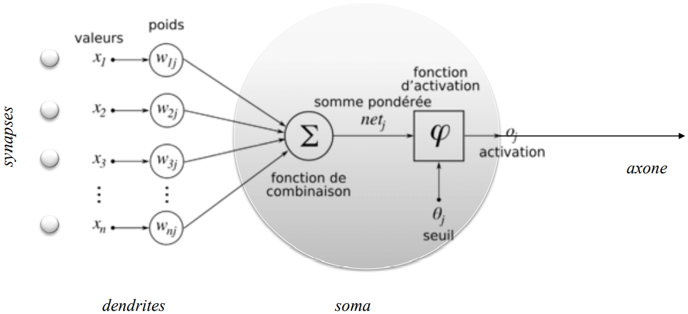
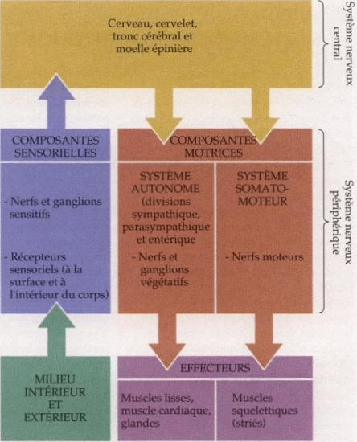
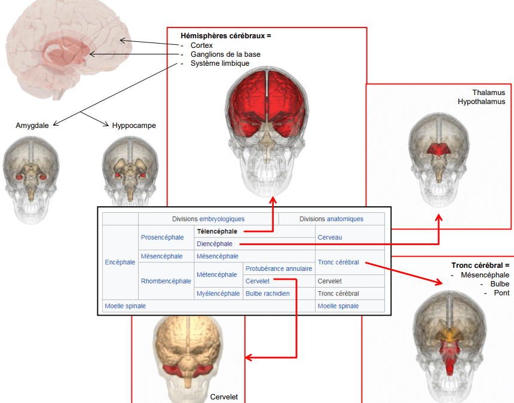
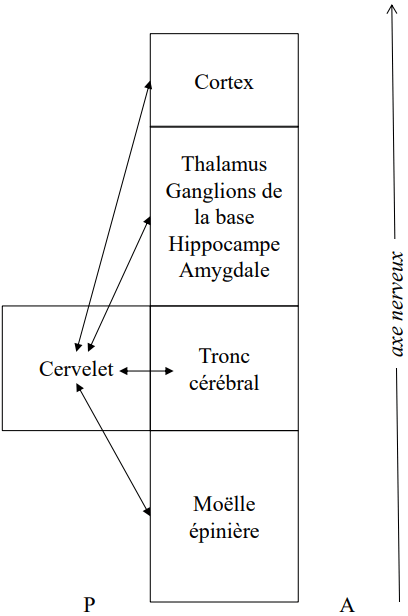

# Système Nerveux

## Introduction neuroscience

Étude des neurones et du système nerveux dans l'ensemble de la biologie en temps normal ou pathologique Les neurones traitent l'information, fait des calculs \(Très peur de neurones transmette QUE de l'information\). Plusieur dentrite se connecte à l'axone par les espace synaptique Les molécules libérée sont des neurotransmetteur. Associer au récepteur post synaptique qui déclenche le signal électrique sur le dentrite \(Potentiel d'action\)

## Le système nerveux, un organe d’interaction avec l’environnement

### Le neurone, unité élémentaire du traitement de l’information

Neuronnes à plusieurs dentrites \(information\) combiné pour en ressortir qu'une seule. Les neurones combines l'information, avec un système de somme pondérée à chaque entrée. Le potentiel d'action est toujours identique, langage du neurone est la fréquence de décharge en Hz. Fonction d'activation sur la sortie / active = appliqué en seuil et en gain \(Pass haut et Pass bas\)

* Pass bas : La douleur est si haute qu'on ne le ressent plus \(fusible\) Moduler les gains en sorties, facteur multiplicateur réhausse \(ou aténue\) le signal 
* Gain = Gérer les ressources pour les repartitions dans l'endroit du corps voulu

### **Le système**

Système nerveux centrale = Cerveau, Cervelet, Tronc cérébrale et moele épinière. Système nerveux périphérique = Tous ce qui part de la moèle épinière Voie afférente : remonte de la périphérie jusqu'au système nerveux centrale Voie éfférente : descend dans le système périphérique

* Cervelet \(Coordone les informations, n'est pas soumis à la hierarchie\)
* Moelle épinière -&gt; Tronc cérébrale -&gt; \(Thalamus, Ganglion de la base, Hippocampe, Amygdale\) -&gt; Cortex

### **Mémoire**

Amygdale : Traitement des émotions, de la valence, du contexte, de l'alerte et de la récompense. \(Système symétrique\)

Hippocampe : Mise en mémoire

