# Système respiratoire

## Anatomie du système respiratoire

**Voies respiratoires supérieures :** Nez, Pharynx et structure associées Voies respiratoires inférieures : Larync, Trachée et Poumons  
**Voies respiratoires inférieures:** Larynx, trachée et poumons

Zone conductrice : Nez, Pharynx, Larynx, Traché, bronche et bronchioles Zone respiratoire : Bronchioles respiratoires, canaux alvéolaire et alvéoles  
Zone respiratoire : Bronchioles respiratoires, canaux alvéolaires et alvéoles

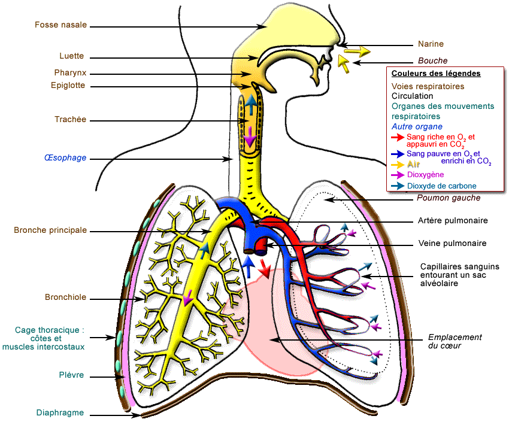

### Différent éléments anatomique

* Nez : Respiration, humidifie et réchauffe l'air, filtration, olfaction et caisse de résonance
* Sinus : Réchauffement et humidification de l'air, Production de mucus, Caisse de résonance pour la voix
* Pharynx : Nasopharynx, l'oropharynx, laryngopharynx; Permet le passage de l'air et des aliments
* Larynx : Fonction Respiratoire, aiguille les aliment vers l'oesophage et role phonatoire \(corde vocale\)
* Trachée : Permet de conduire l'air entre les structures
* Glotte
* Bronches
* Poumons

#### Structure du nez

Structures externes du nez :

* Charpente osseuse: os nasal de la racine du nez;
* Cartilages hyalins recouverts de peau et de muscle \(forme du nez\);
* Tapissé d'une muqueuse;
* Intérieur narines: vestibule;
* Cloison nasale: cartilage hyalin à l'avant et lame perpendiculaire de l'ethmoïde 

  à l'arrière.

Structures internes du nez:

* Sous la boîte crânienne, au dessus de la bouche;
* Communication à l'arrière avec le pharynx: 2 CHOANES;
* Parois latérales: os ETHMOÏDE \(toit\) forme les cornets nasaux supérieur,

  moyen et inférieur;

* Plancher: Palais dur = apophyse palatine du maxillaire et os palatin;

  Arrière: Palais mou = composition musculaire;

  Arrière : os SPHENOÏDAL.

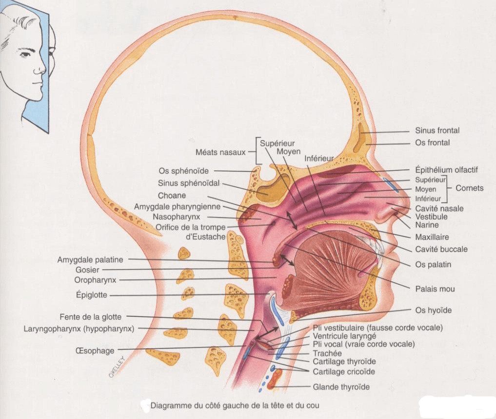

#### Pharynx

Le Nasopharynx \(air\):  
- épith. pseudostratifié cilié;  
- jusqu'au voile du palais mou;  
- 4 ouvertures \(2 choanes et 2 trompes d'Eustache\);  
- Amygdales pharyngienne ou "Adénoïde".

L'Oropharynx \(aliments + air\):  
- épith. pavimenteux stratifié;  
- Palais mou jusqu'à os hyoïde;  
- 1 ouverture: le "Gosier";  
- 2 paires d'Amygdales palatines et linguales.

Le Laryngopharynx \(aliments + air\):  
- épith. pavimenteux stratifié;  
- vers le bas à partir de l'os hyoïde;  
- Oesophage à l'arrière et larynx à l'avant.

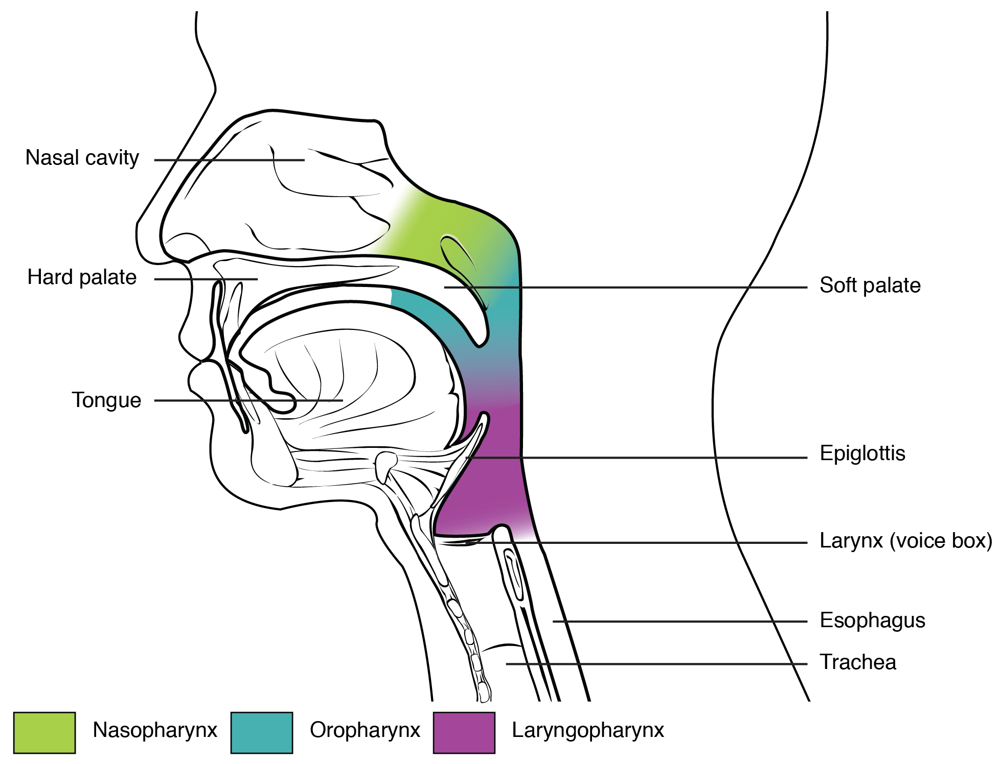

#### Trachée

La trachée est rigide. Son ouverture est permanente grâce à la présence d’anneaux incomplets de cartilage hyalin. Ces anneaux ne font pas le tour entier de la trachée. Un muscle en lie les deux extrémités: le muscle trachéal. Ainsi, lors de la déglutition, le muscle trachéal se contracte \(réflexe\), rapproche les 2 bords des anneaux de cartilage et réduit partiellement et transitoirement le diamètre de la trachée. La diamètre de l’œsophage peut donc augmenter et laisser passer le bol alimentaire. A la fin de la déglutition, le muscle trachéal se relâche et la lumière trachéale retrouve son diamètre initial, propice au passage de l’air lors de la ventilation.

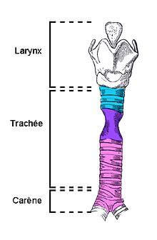

#### Bronchioles

Les vaisseaux sanguins qui envoient le sang du cœur vers la périphérie sont des artères.Les vaisseaux sanguins qui ramènent le sang vers le cœurs sont des veines. Entre artères et veines se trouvent des capillaires sanguins où les échanges gazeux, entre-autre, vont se dérouler. Ainsi, la partie droite du cœur envoie du sang désoxygéné vers les poumons via des artères puis des artérioles pulmonaires \(ces vaisseaux sont représentés en bleu car transportant du sang désoxygéné\). Le sang oxygéné qui quittera les poumons sera oxygéné \(vaisseaux représentés en rouge\) via des veinules puis des veines pulmonaires jusqu’à l’oreillette gauche cardiaque. Le sang oxygéné sera par la suite envoyé dans la circulation systémique \(grande circulation\). Les bronchioles sont les premières branches des voies respiratoires qui ne contiennent plus de cartilage. Elles sont des prolongements des bronches et ont moins d'un millimètre de diamètre, elles permettent l'accès de l'air aux alvéoles. Les capillaires sanguins vont former un maillage qui s’appuiera autour des alvéoles pulmonaires.

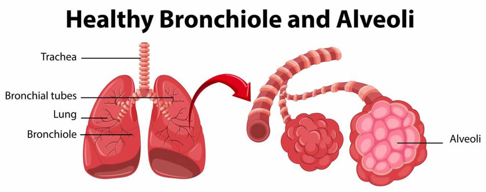

#### Alvéole pulmonaires

La respiration correspond aux échanges de dioxygène \(O2\).Respiration alvéolaire. La ventilation correspond aux mouvements de la cage thoracique pour assurer l’inspiration et l’expiration.La ventilation permet la respiration. La structure des alvéoles pulmonaires :

* une couche \(unique\) de pneumocytes de type 1. Ces cellules épithéliales \(en contact avec de l’air, du milieu externe\) forment un épithélium pavimenteux.Tout autour, des capillaires sanguins forment la maillage dont nous avions parlé. Entre les deux se situe la lame basale.
* Les pneumocytes de type 2 sécrètent le surfactant assurant hydratation, protection des alvéoles et empêchant les alvéoles de s’effondrer sur elles-mêmes \(les alvéoles subissent une force de pression de l’extérieur vers l’intérieur: centripète\). 

  Les macrophages \(« cellules à poussière »\) phagocytent les corps étrangers.

  Une structure importante: la membrane alvéolo-capillaire \(« MAC »; 0,5µm d’épaisseur\) est composée de 3 éléments, une couche de pneumocytes de type 1, de la lame basale et d’une couche de cellules endothéliale \(qui forme la paroi du capillaire\). 

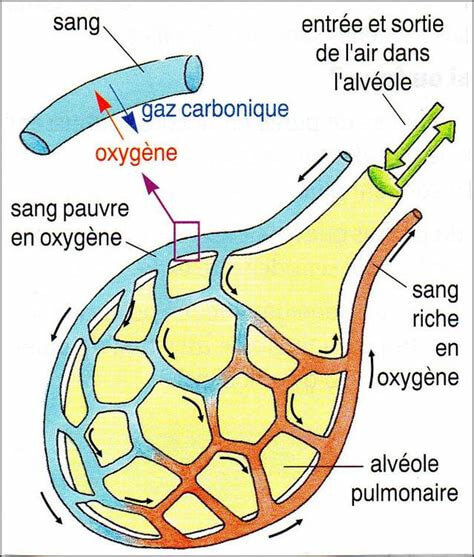


**Endothélium :** tissu de revêtement en contact avec du milieu interne \(endo\) comme le sang.


O2 et C02 vont diffuser au travers de la MAC selon le processus de diffusion simple.  
La diffusion simple intéresse le passage de molécules liposolubles \(ou suffisamment petites comme les gaz\), ne nécessite pas d’énergie et dont le flux net se fera du compartiment où la concentration est la plus élevée vers celle où elle est la plus basse.  
L’air inspiré, dans la lumière de l’alvéole, est plus riche en 02 et plus pauvre en CO2 que le sang arrivant au niveau des capillaires \(sang désoxygéné et riche en C02\).  
Ainsi, par diffusion simple, le flux net d’O2 se fera de l’air alvéolaire vers le sang désoxygéné \(qui va s’enrichir en 02 de ce fait\).  
Le CO2 diffusera, de manière indépendante de l’O2 et en même temps, du sang \(riche en C02\) vers l’air alvéolaire.  
L’air inspiré est riche en 02 et pauvre en C02. L’air expiré sera enrichi en C02 et appauvri en 02.  
Le sang qui arrive est riche en C02 et pauvre en 02. Le sang qui repart vers le cœur sera enrichi en 02 et appauvri en CO2. Ce phénomène se nomme hématose.  
Nous disposons en moyenne de 300 millions d’alvéoles pulmonaires qui donne une surface développée de 70m2.  
Le tissu de soutien de l’arbre bronchique est constitué de tissu conjonctif \(qui joint ensemble\). Ce tissu conjonctif est formé de fibres élastiques qui permettent au poumon de se gonfler et d’être comprimé lors des phases successives d’inspiration et d’expiration.

**Plèvres**

Entre les poumons et la cage thoracique se trouve l’espace pleural rempli de liquide pleural. L’espace pleural est délimité par la plèvre pariétale \(accrochée à la face interne de la cage thoracique\) et la plèvre viscérale \(qui tapisse la face externe de chaque poumon\). Les plèvres sont des membranes séreuses.

Les poumons vont suivre les mouvements de la cage thoracique sans frottements par l’intermédiaire des plèvres et du liquide pleural. En effet, lors de l’inspiration, la cage thoracique augmente de volume et se soulève. La plèvre pariétale suit le mouvement \(elle est accolée à la cage thoracique\). Par effet de succion, grâce au liquide pleural, elle tire vers elle la plèvre viscérale, ce qui provoque une augmentation de volume des poumons \(qui sont des organes élastiques grâce aux fibres élastiques du tissu conjonctif pour rappel\).

L’intérieur des poumons est donc en dépression par rapport à la pression d’air extérieure: l’air entre.

Lors de l’expiration, la cage thoracique comprime la plèvre pariétale qui appuie, via le liquide pleural, sur la plèvre viscérale. Les poumons sont alors comprimés et l’air sort.

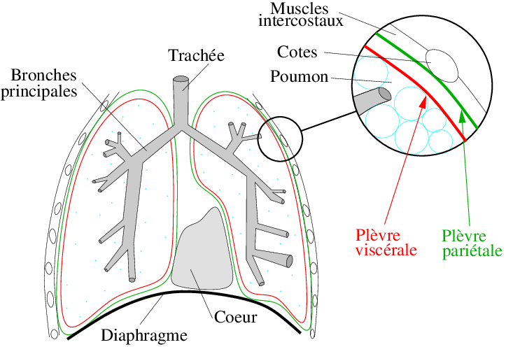

### **Chez les oiseaux**

Puisque l’air circule toujours dans le même sens, les parabronches sont toujours alimentées en air frais. L’air vicié est chassé dans les parabronches par l’air frais qui y entre. 

Chez les mammifères, les alvéoles contiennent toujours un mélange d’air vicié et d’air frais.

### **Loi de dalton**

Chaque gaz dans un mélange, exerce sa propre pression, indépendamment des autres gaz: elle correspond à p.

* Pression atmosphérique \(760 mmHg\)= pO2 + pCO2 + pN2 + pH2O
* pO2 atmosphérique : = 21% X 760 mmHg = 159,6; soit 160 mmHg
* pCO2 atmosphérique : = 0,04% X 760 mmHg = 0,3 mmHg

La pression partielle pour un gaz dans un mélange. Nous en avons l’explication ici grâce à la loi de Dalton. La pression atmosphérique moyenne \(patm\) est de 760mmHg au niveau de la mer. 02, CO2, azote \(N2\), vapeur d’eau \(et gaz rares non mentionnés ici\) sont responsables de la patm. Ainsi, la pression atm est la somme des pressions partielles générées par les autres gaz du mélange. L’air atmosphérique a donc une pO2 de 160mmHg et une pCO2 de 0,3mmHg.

## Echange gazeux

C’est l’air que nous inspirons et qui va se mélanger au volume résiduel \(volume mort\) qui reste dans l’appareil respiratoire à la fin de l’expiration. Cet air résiduel est riche en C02 et pauvre en 02. Ainsi, son mélange avec l’air atm donne, au final, au niveau de l’air alvéolaire une pCO2 de 40 mmHg et une p02 de 105 mmHg. L’O2 diffuse \(flux net\) de l’air alvéolaire vers le sang \(selon un gradient descendant de pO2\). Le flux net de CO2 se fait dans le sens inverse mais selon le même principe \(de la pression partielle la plus élevée vers la plus basse\). Nous assistons ici à la respiration alvéolaire \(échanges d’O2 entre 2 compartiments\). Le sang oxygéné est transporté vers les cellules de nos organes. Nos cellules ont un métabolisme oxydatif. L’O2 est de dernier accepteur d’électrons de la chaine d’oxydo-réduction mitochondriale, nécessaire à la réalisation d’un gradient de proton \(H+\) nécessaire au fonctionnement de l’ATP synthase mitochondriale. La respiration tissulaire se fera également de la pression partielle la plus forte vers la plus basse. Nos cellules consomment de l’02 et produisent du C02. Ainsi, un gradient se produit entre les pression partielles en 02 et C02 entre le sang oxygéné et les cellules. Les gaz diffusent ici aussi par diffusion simple, sans énergie. Le phénomène inverse à l’hématose se produit. Le sang perd progressivement de l’O2 et s’enrichit en CO2 avant de revenir vers les poumons et ainsi de suite.

### hémoglobine

Hémoglobine: 2 chaînes a et 2 chaînes B qui forme 4 hèmes. Chaque hème contient un atome de Fe pouvant fixer un O2. Donc, chaque Hb peut fixer 4 O2 Dans les muscles, O2 transporté par une protéine semblable : myoglobine Une grande partie de l’O2 est transportée dans le sang grâce à l’hémoglobine \(Hb\) 4 hèmes \(noyau Fe\) la composent. Chaque hème peut fixer une molécule d’O2. Ainsi une molécule d’Hb peut transporter, lorsqu’elle est saturée totalement, 4 molécules d’O2.

Saturation de l'hémoglobine \(SaO2\) = \(nombre de O2 fixés à l'hémoglobine / le nombre de site total de l'Hb pouvant se lier à l'O2\) \* 100 Fixation de 1 O2 ==&gt; facilite la fixation des 3 autres Libération de 1 O2 ==&gt; facilite la libération des 3 autres

Le pH modifie l’affinité de l’Hb vis-à-vis de l’O2. Si le Ph augmente alors l'affinité avec de l'O2 de L'hemoglobine augmente et la libération d'O2 diminue. Si l'activité augmente alors le CO2 augmente donc le PH diminue et la libération d'O2 augmente.

Lors d'une activité physique soutenue, le pH de notre sang a tendance à diminuer. Donc, si le pH diminue, notre organisme nécessite un apport plus soutenu en 02. Nous allons alors hyperventiler. En parallèle, l’affinité de l’Hb vis-à-vis de l’02 va diminuer \(quand le pH du sang diminue\).L’Hb libère plus facilement l’02 lorsque le pH baisse. Connaitre ce que signifie la saturation \(Sat\) du sang en 02. Exemple, si 3 sites sur les 4 de fixation de l’O2 sur l’Hb sont occupés par l’O2, la saturation sera de 75%. La « Sat » va de 0% à 100%.

#### Equation de Henderson-Hasselbalch

CO2 + H2O &lt;-&gt; H2CO3 H2CO3 &lt;-&gt; H+ + HCO3-

Donc si CO2 Augmente sang ==&gt; Augmentation H2CO3 ==&gt; diminution pH Si diminution sang ==&gt; diminution H2CO3 ==&gt; Augmentation pH

Le pH diminue lorsque l’activité physique augmente. Il s’agit ici d’un équilibre se faisant dans le sang notamment. Si l’on court, la pCO2 augmente. Il y a donc plus de CO2, ce qui fait « basculer » l’équation vers la droite: production d’H2CO3 \(acide carbonique\), qui donnera H+ et HC03-. Les H+ induisent donc une diminution du pH. Lorsque nous hyperventilerons \(et grâce à l’accélération du rythme cardiaque\), nous ferons entrer de l’O2 dans le sang et éliminerons plus de CO2 que de CO2 produit. L’équation « basculera » de la droite vers la gauche: élimination de H+ et élimination de C02 par la ventilation. Lorsque le pH reviendra à sa valeur de repos, l’hyperventilation cessera.

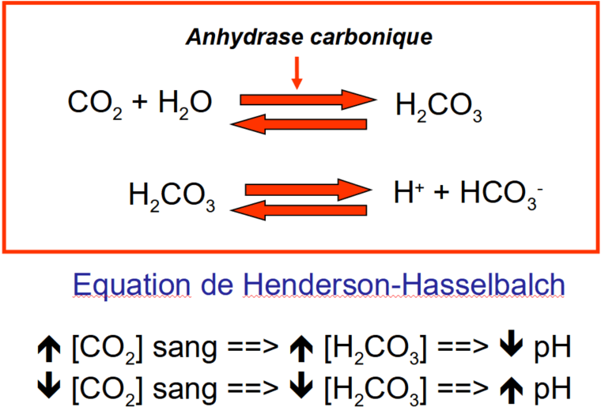

#### Courbe de dissociation Oxygène-Hb

Courbe de dissociation oxygène-Hb à température corporelle normale illustrant le lien entre la saturation de l’Hb et la pO2. A mesure que la pO2augmente, plus d’O2 se combine à l’Hb.

L’air alvéolaire a une p02=105 mmHg. Ici, la saturation est de 100%, ce qui est logique \(sauf problèmes liés à une ou des pathologies\). Au repos, la p02 sanguin est 40 mmHg \(celle du sang désoxygéné qui retourne aux puomons\). La p02 est ici de 40%. Ces deux valeurs de saturation sont les limites d’un plateau sur la courbe ci-dessus. Cela donne plusieurs avantages. Le sang désoxygéné au repos possède une saturation de 40% et pourra encore libérer de l’O2 si soudainement, l’activité physique de la personne augmente \(comme ses besoins en 02\). Plusieurs mécanismes physiologiques se déclencheront comme l’hyperventilation et l’accélération du rythme cardiaque \(tachycardie\).

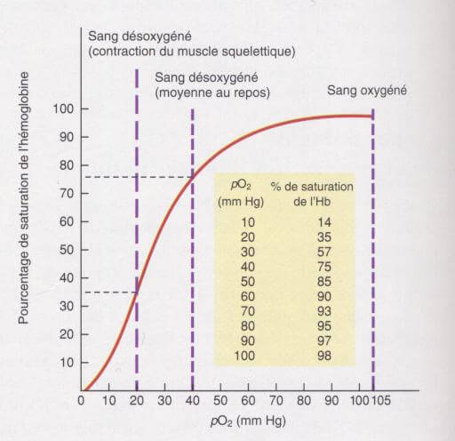

#### L'effet BOHR

En milieu acide, baisse affinité Hb vis-à-vis de l’ O2. Séparation O2-Hb plus facile: EFFET BOHR. Modification de la conformation de l’Hb par la fixation des H+. Un pH moins élevé force l’O2 à quitter l’Hb d’où une plus grande disponibilité de l’ O2 au niveau des tissus. Effet semblable du CO2 sur l’affinité 02-Hb. A mesure que la pCO2 s’élève, l’Hb libère l’O2 plus facilement.

La courbe de référence \(noire\) se décale vers la droite \(courbes roses\) lorsque le pH diminue et lorsque le pCO2 augmente \(ces 2 facteurs sont liés!\). Pour une pression partielle donnée \(par exemple 60 mmHg\), le pourcentage de saturation de l’Hb est plus faible sur la courbe rose que sur celle de la noire. Cela traduit ici que lorsque le pH diminue \(et la pCO2 augmente\), l’affinité de l’Hb vis-à-vis de l’O2 a baissé. En d’autre terme, pour une même pression partielle en 02, l’Hb a libéré davantage \(et plus facilement\) de l’O2, d’où une saturation plus basse. L’inverse est possible \(courbes bleues décalées vers la gauche\) lorsque la PCO2 diminue \(et lorsque le pH augmente\) au dessus des valeurs de repos. Ici, l’affinité de l’Hb pour l’02 augmente et donc le pourcentage de saturation également.

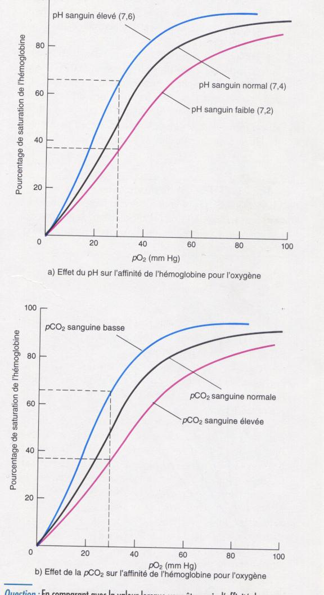

### Vascularisation des poumons

* Veine Cave inférieure vers oreillette droite 
* Ventricule droit vers artères pulmonaires via le tronc pulmonaire \(sg désoxygéné\)
* Veines pulmonaires vers oreillette gauche \(sg oxygéné\)
* Apport sg oxygéné par artères bronchiques drainage sg par veines pulmonaires \(majorité\) et les veines bronchiques.

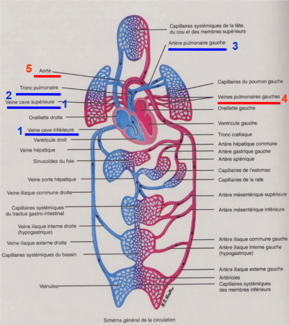

## **Régulation de la fréquence de la ventilation**

L’ensemble des muscles impliqués dans les mouvements inspiratoires et expiratoires appartiennent à la catégorie des muscles striés squelettiques. Ces muscles ont la particularité d’être des muscles dits « volontaires ». Il existe un automatisme de la ventilation, cependant, nous pouvons consciemment prendre le contrôle de notre ventilation \(par une apnée volontaire, en inspirant ou expirant profondément ou encore en baillant ou en soufflant en lisant ce cours…\).

Lorsque nous inspirons, le volume de la cage thoracique augmente: l’espace intercostal \(entre 2 côtes adjacentes\) augmente. Au niveau du sternum et de la colonne vertébrale \(ceci n’est pas valable pour les côtes dites « flottantes »\). Lors d’une inspiration calme et d’une ventilation calme et normale, les muscles inspiratoires principaux se contractent:

* les muscles intercostaux externes repoussent les côtes adjacentes. L’espace intercostal augmente. Lorsque vous inspirez, les côtes d’écartent les unes des autres. 
* Le diaphragme, qui délimite la cavité thoracique de la cavité péritonéale se contracte. De part sa structure, légèrement bombée, le diaphragme en se contractant, va pousser les dernières côtes vers l’extérieur. Ces 2 mécanismes concourent à augmenter le volume de la cage thoracique. L’intérieur des poumons est en dépression par rapport à l’extérieur: l’air entre et donc nous inspirons.

L’expiration calme et normale consiste en l’arrêt de l’inspiration simplement. La cage thoracique, initialement soulevée précédemment revient passivement à sa position de repos en comprimant les poumons. Aucun muscle n’intervient ici. L’intérieur des poumons est en surpression par rapport à l’extérieur: l’air sort et nous expirons.  
Lors d’une ventilation forcée, par exemple lorsque nous courrons, nous déclenchons une succession d’inspiration forcée et d’expiration forcée.  
Lors de l’inspiration forcée, se contractent les muscles précédents \(intercostaux externes et diaphragme\) plus les muscles accessoires \(sterno-cléido-mastoïdiens et scalènes\) qui tirent sur la cage thoracique vers le haut.  
Afin d’accélérer la fréquence de la ventilation, l’expiration est active: des muscles expiratoires se contractent comme les muscles intercostaux internes \(qui rapprochent les côtes adjacentes\) et les muscles abdominaux.

### **Mouvements respiratoires**

**Volume respiratoire : Spirogramme**

Le spirogramme permet de mesurer les volumes ventilatoires. Lorsque l’on inspire, le tracé monte. Il descend lors de l’expiration. Ainsi, pour un individu de corpulence moyenne, vous avez ici la capacité inspiratoire et la capacité expiratoire \(qui donnent la capacité vitale\). La capacité pulmonaire totale est la capacité vitale plus le volume résiduel \(volume mort\).

La fréquence de la ventilation normale est d’environ 12 séquences d’inspiration et d’expiration par minute.

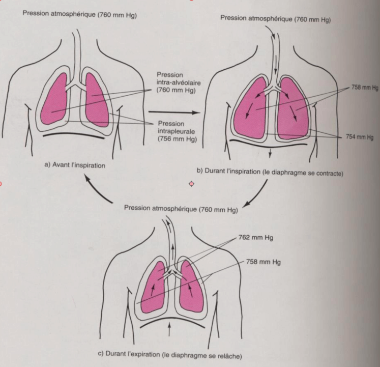

## **Régulation nerveuse de la fréquence de la ventilation**

Centre de contrôle nerveux de la respiration dans le tronc cérébral \(bulbe rachidien et protubérance\). Centre de contrôle envoie des influx aux muscles respiratoires \(12 à 18 fois par minute au repos\). Récepteurs de tension dans les poumons inhibent le centre respiratoire: inspiration ==&gt; inhibition

**Centres respiratoires**

La régulation nerveuse de la ventilation fait intervenir des centres nerveux situés dans le bulbe rachidien au niveau du centre de rythmicité bulbaire \(centre inspiratoire \(CI\) et centre expiratoire \(CE\)\) et dans la protubérance \(centre pneumotaxique \(CP\) et centre apneustique \(CA\)\).  
Comme annoté, lors de l’inspiration, le CI est actif et induit, par voie nerveuse, la contraction des muscles inspiratoires.  
Lors de l’expiration forcée, le CE est actif et, par voie nerveuse, induit la contraction des muscles expiratoires.

Rythme de base de la respiration: Centre de rythmicité bulbaire.

* Inspiration: 2 secondes;
* Expiration: 3 secondes.

Centres pneumotaxique et apneustique: Coordination transition inspiration/ expiration

* Centre pneumotaxique: Inhibiteur du centre inspiratoire.
* Centre apneustique: Active le centre inspiratoire. Domine le centre pneumotaxique.

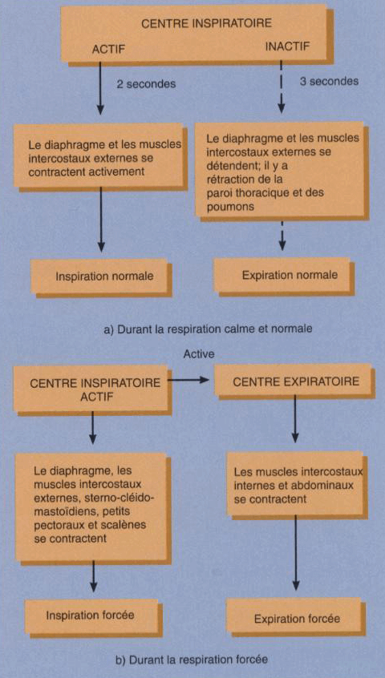

### **Régulation nerveuse de la ventilation**

Différentes étapes impliquées dans la régulation nerveuse de la ventilation. 

1. Au début de l’inspiration, le Centre Apneustique est actif. Il inhibe le Centre Pneumotaxique et active le Centre Inspiratoire.
2. Le CI activé, stimule par voie nerveuse la contraction des muscles inspiratoires.
3. On inspire.
4. lorsque les poumons sont suffisamment gonflés, en fin d’inspiration, des mécanorécepteurs pulmonaires s’activent. Ces récepteurs sont sensibles à l’étirement des poumons qui survient en fin d’inspiration. 
5. l’activation des mécanorécepteurs déclenche le réflexe de Hering-Breuer qui inhibe le CI et le CA. Ce réflexe agit comme un rétrocontrôle du CA et du CI pour bloquer l’inspiration.
6. Le CA inhibé par le reflexe de Hering-Breuer ne peut plus inhiber le CP.
7. Le CP s’active et inhibe le CI. Il provoquera la contraction des muscles expiratoires lors de l’expiration forcée.
8. En fin d’expiration, les poumons ne sont plus étirés. Les mécanorécepteurs ne sont plus activés et le réflexe de Hering-Breuer s’arrête.
9. Le CA et le CI ne sont plus inhibés.
10. Le CA et le CI redeviennent automatiquement actifs et nous revenons au point 1.

Toute cette séquence d’évènements s’enchaine au cours des alternances inspiration-expiration

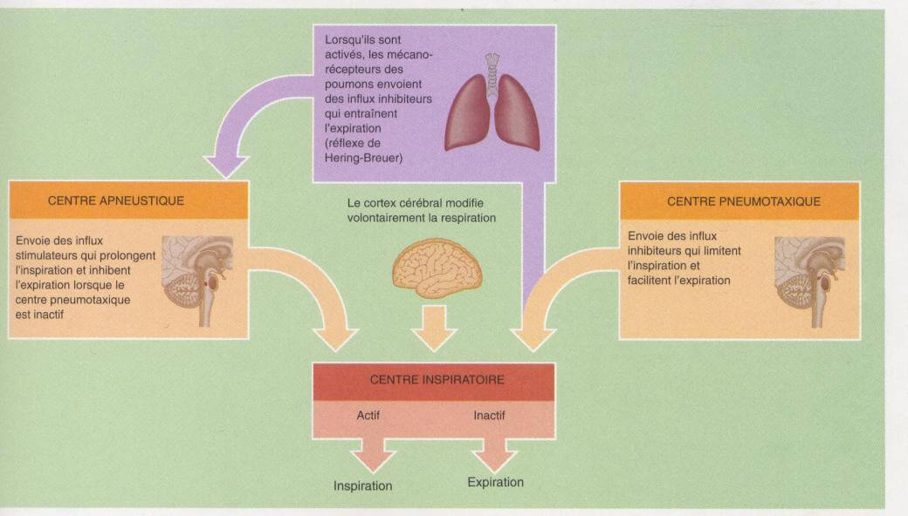

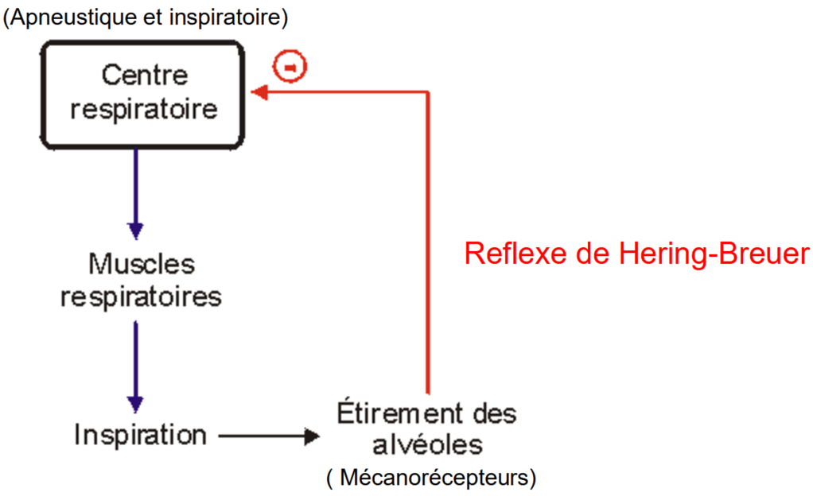

## **Régulation humorale de la fréquence de la ventilation**

Rythme respiratoire contrôlé par:

* CO2 et pH sanguin;
* Concentration en O2.

Un effort physique prolongé va s’accompagner d’une accélération de la fréquence de ventilation. La régulation humorale est responsable de cela. Humoral comme « humeur ». Cette ancienne terminologie décrit des liquides biologiques comme le sang ou le liquide encéphalo-rachidien \(dans lequel « baigne » le système nerveux central\). Les venins étaient appelés « humeurs venimeuses ». Nous trouvons dans l’œil l’humeur aqueuse et l’humeur vitrée. Lorsque nous sommes de « mauvaise humeur », nous aurions des facteurs humoraux qui perturberaient notre comportement comme le pensaient nos ancêtres…. Les facteurs humoraux seront ici: la pression partielle en 02 \(pO2\), la pression partielle en CO2 \(pCO2\) et le pH dans deux liquides biologiques, le sang et le liquide encéphalo-rachidien. Pour commencer, lorsque nous courrons, la pO2 et la pCO2 augmente. Souvenez-vous, lorsque la pCO2 augmente, le pH diminue dans les 2 liquides biologiques. Donc, lorsque la pO2 diminue, que la pCO2 augmente et que le pH diminue, la régulation humorale déclenchera une accélération de la ventilation.

### Loi de dalton, diffusion simple et hémoglobine

Parmi ces 3 paramètres humoraux, pO2, pCO2 et pH, la pCO2 et le pH sont les facteurs prépondérants. En effet, la majorité de l’O2 est transportée fixée à l’hémoglobine \(98,5%\). Les récepteurs sensibles à l’O2 \(chémorecepteur ou chimiorécepteur: récepteur sensible à des molécules chimiques\) ne détectent que l’O2 libre dans le sang, soit 0,5% de la quantité totale d’O2. De faibles variations de la pO2 sanguine passent donc inaperçues. 7% du CO2 est libre dans le sang et surtout, toute augmentation de la pCO2 s’accompagne d’une baisse du pH \(notion d’équilibre acido-basique du milieu intérieur\). Nous en avions déjà parlé dans le cadre de l’effet Bohr.

Le centre respiratoire est sensible au pH Dimunition pH ==&gt; Stimulation du centre respiratoire Augmentation pH ==&gt; Inhibition du centre respiratoire

Donc Dimunition CO2sang ==&gt; Augmentation pH ==&gt; Dimunition ventilation pulmonaire Augmentation CO2sang ==&gt; Dimuntion pH ==&gt; Augmentation ventilation pulmonaire

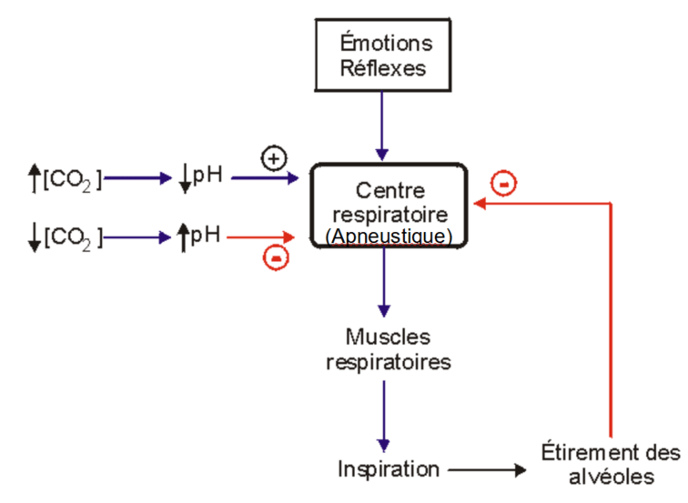

### Centre respiratoire

Le centre respiratoire reçoit aussi des influx nerveux provenant de chémorécepteurs, des récepteurs nerveux sensibles aux concentrations plasmatiques \(dans le sang\) de CO2, d’O2 \(moins\) et de H+. Ces récepteurs sont situés:

* Dans le bulbe rachidien;
* dans la crosse aortique et les carotides \(plus précisément, les sinus carotidiens\).

Hausse de CO2 \(ou baisse de O2 dans le sang\) =&gt; Augmentation de la fréquence respiratoire

## Régulation générale de la ventilation

LEC= liquide extra cérébral = liquide encéphalo-rachidien. Exemple de rétroaction négative: Nous courrons. La pO2 baisse, le pH baisse et la pCO2 augmente dans le sang et le liquide encépahlo-rachidien. La régulation humorale de la ventilation provoquera une hyperventilation. Cette dernière, si efficace, rétablira la valeur des paramètres humoraux à des valeurs de repos. Il y aura ainsi une baisse de la stimulation des centres nerveux et retour à une fréquence ventilatoire de repos

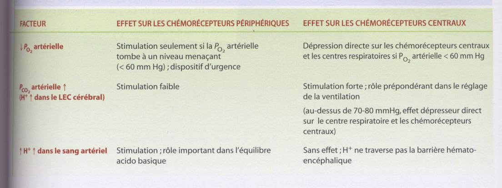

### Hypoxie grave et réaction en chaîne.

Réduction par rétroaction positive de la pression partielle de l’oxygène dans le sang. Une personne se noie. La baisse de la pO2 altère le fonctionnement des cellules nerveuses \(de la régulation nerveuse et de la régulation humorale comme les cellules ayant les chémorécepteurs\). Ces cellules vont cesser progressivement de fonctionner. La personne ne pourra donc plus ventiler seule. La pO2 va donc encore diminuer et ainsi de suite. Cette séquence illustre donc une boucle de rétroaction positive qui traduit donc ici un cercle vicieux.

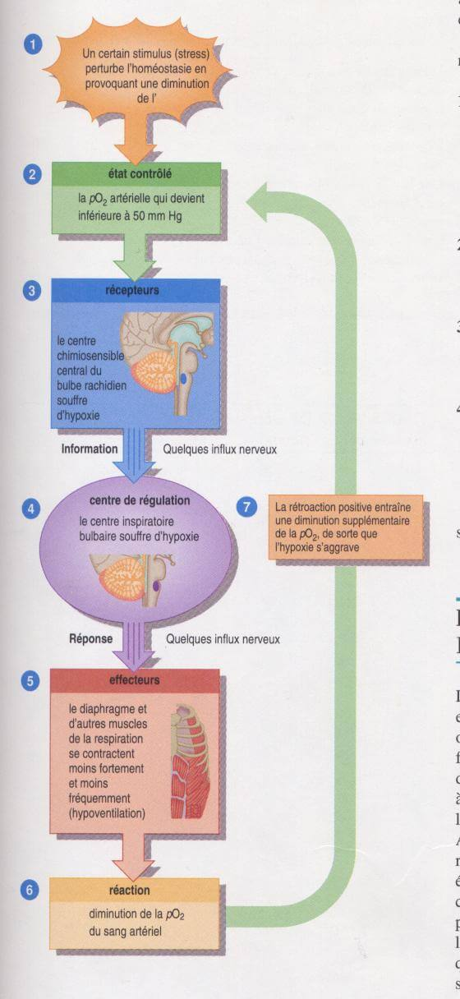

#### Régulation Respiration

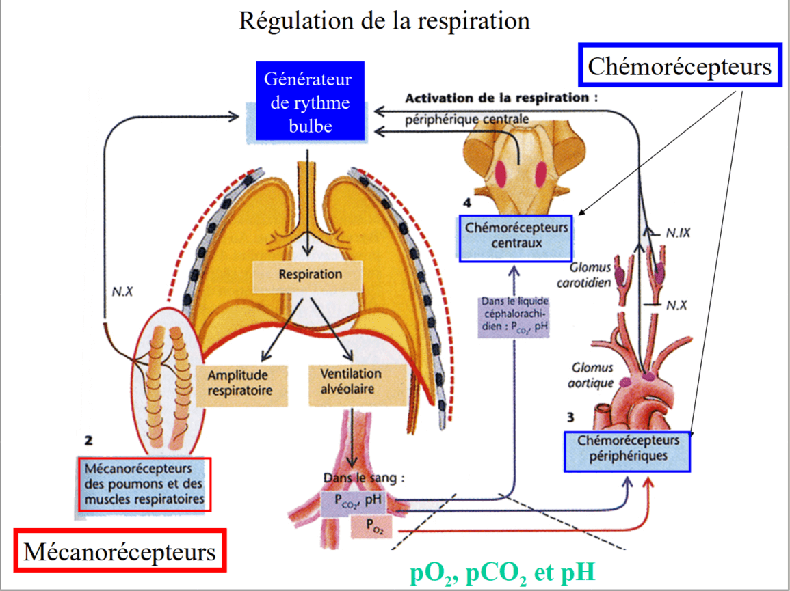

