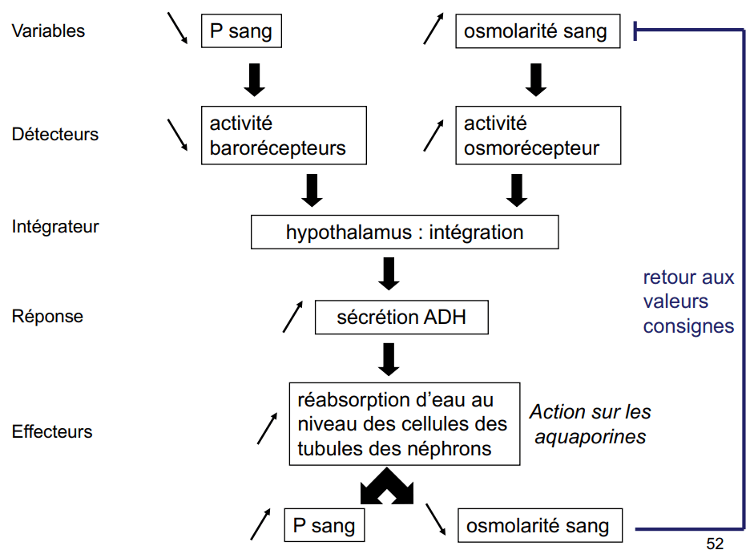
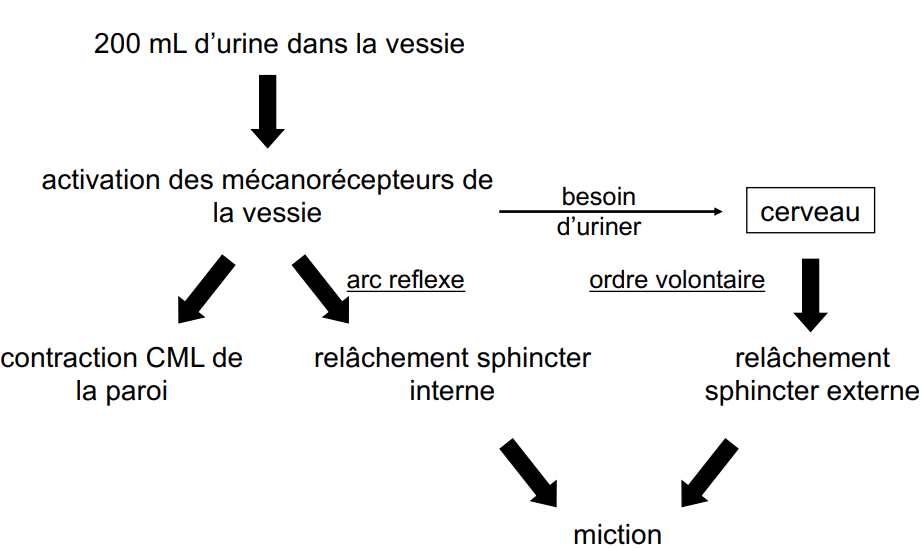

# Système Urinaire

En entrée dans le corp humain il y a des aliments et des boissons mais aussi de l'eau métabolique. \(Interieur des cellules et production d'eau par le biais de son métabolisme, hydrolyse de molécule etc\) Le corp est composé à 60% d'eau. Les niveaux d'entrées et de sorties , c'est l'equilibre hydrique En sortie il y a l'urine, la sueur, selles, évaporation

## Anatomie

* Rein : Lieu de production de l'urine défénitive \(organe\)
* Urétère : Deux canaux \(urétère\) connecté au rein, lieu de transport de l'urine défénitive des reins vers la vessie
* Vessie : Lieu de stockage de l'urine définitive
* Urètre : lieu d'ejection de l'urine définitive \(Chez l'homme structure commune du système génital\)
* Méa Urinaire

**Rein**

Organe très vascularisé qui filtre le sang.

* Capsule fibreuse : Tissu conjonctif et protection mécanique
* Tissu rénal : Dure, compact, couleur brun produit l'urine définitif
* Calices : Branchement qui rejoigne le tissu rénal et permet le passage de l'urine vers l'uretère
* Bassinet : Lieu ou l'urine définitif se deverse
* Urétère
* Artère rénale : Apport en oxygène dans les reins
* Veine rénale : Exporte le CO2

**Composition tissu rénal**

Néfron, unité fonctionel du rein \(1 million par rein\), au niveau de la production d'urine, l'urine en formation.

**Anatomie néfron microscopique**

* Capsul \(de bowman\) : Capsule filtrante connecté à la partie tubulaire
* Tubule contourné proximal : 
* Anse \(de Henle\) 
* Tube contourné distal :
* Canal collecteur : Reçoi plusieurs tubule pour au final convergé l'urine 
* Microvascularisatio des néfrons \(Capsule + capilaire = Corpuscule\) : 
  * Capilaire glomérulaire : gromérule entre deux artériole
  * Artériole afférente : rentre le sang
  * Artériole efférente : sortie le sang
* Appareil juxtaglomérulaire : 
  * cellules juxtaglomérulaires = cellules spécialisées appartenant à l’artériole afférente
  * cellules de la macula densa = cellules spécialisées appartenant à l’anse de Henle

**Role du système urinaire**

Il y a environ 180 litre d'ultrafiltrat produit par jour

Produit en moyenne 1,5 litre d'urine par jour. Participe à la stabilité du milieu interieur. \(Milieu interieur = Liquide qui compose l'organisme qui se trouve à l'exterieur des cellules\)

Pour un Homme de 70kg composé de 40L de liquide.

* Liquide inracellulaire : hyaloplasme = 25L
* Milieu intérieur \(liquide extracellulaire\) :
  * Liquide canalisé \(Plasma et lymphe\) = 3L
  * Liquide interstitiel \(liquide entre les cellules\) = 12 L

Le milieu intérieur est composé de solvant et de soluté avec un pH physiologique à 7,4 et doit être stable Cette stabilité est mit en place par l'homéostasie

Homéostasie : capacité qu’ont les organismes pluricellulaires à garder un milieu intérieur stable, malgré les fluctuations de l’environnement Deux paramètre, 15L de volume, osmolarité : concentration en substance dissociés

## Production de l'urine

#### Les 3 mécanismes de l'élaboration d'urine

Néphron : Lieu de production de l'urine. Micro usine d'épuration. Production d’urine basée sur des échanges permanents entre néphrons/canaux collecteurs et capillaires sanguins.

### Filtration

Écoulement le long du nefron, quand il quite le capillaire prend de l'unrine en formation. Ultrafiltrat : Produit résultant du sang filtré par le glomérule rénal. Il a été débarrassé d'environ 99,97 % de ses protéines \(donc seulement 0,03% des protéines du sang passe le glomérule\) . Il va ensuite passer dans le tubule rénal pour être complètement filtré.

**Barrière de filtration**

paroi des capillaires \(endothélium\), Lame basale et paroi de la capsule sont les triples filtres. Podocyte : cellule épithéliale de la capsule poreuse.

* Filtre 1 : Pore capillaire -&gt; retient les cellule sanguine
* Filtre 2 : Lame basale :
  * filtre mécanique : retient selon la taille des substances \(grosse protéine\) +70KDa
  * Filtre électrique : retient selon la charge électrique ici \(protéine chargé -\)
* Filtre 3 : fente de filtration entre les pieds des podocytes, retient les moyennes protéines

**Les forces de filtration**

P nette de filtration = P sang + P osmotique + P capsule = 5,5 – 2,5 – 1,5 = 1,5 cm Hg

### **La réabsorption**

la nature des substances réabsorbées : Eau, Na+ et Cl- ainsi que des petites protéines, acides aminés et glucose

L'eau le Na+ et le Cl- reste en partie dans la lumière du nefron pour produire l'urine définitive.

Les protéines et le glucose sont réabsorbé dans leur intégralité.

**Mécanisme de réabsorbtion**

Épithélium constitué de jonction sérer qui évite les pertes, comment passer à travers l'épithélium ?

* Transport passif : 
  * Transport diffusion simple 
  * Transport diffusion facilité, par l'usage de protéine intrasèque du liquide suivant le gradient de concentration
* Transport actif pompe ATPase, avec l'usage de protéine membranaire permet de passer les soluté contre leur gradient avec de l'énergie
* Cotransport symport \(même direction\) et antiport \(direction opposé\) transport de molécule différentes une selon le gradient et une contre son gradient
* Transport vésiculaire, petit peptides. 

Ce sont des mécanisme saturable et sélectifs. Protéine adapté pour chaque substance.

**Exemple avec l'eau**

Osmose \(Pression osmotique\) : Mouvement de l'eau d'une région faible de concentration à soluté vers une région à forte concentration de soluté Membrane apicale et membrane basolatérale \(coté \[\[Lame basale\]\]\), transport passif facilité pour l'eau a l'aide d'une protéine, avec des canaux spécialisé les aquaporine et ne fait passer que l'eau.

**Exemple avec sodium Na+**

Cation majoritaire donc doit être régulièrement avec attention, réabsorbtion partielle. Concentration Na extra toujours supérieur à intracellulaire. Apicale : cation donc pas de diffusion simple, mais par la pritéine avec transport passif facilité, canal spécifique. Basolatérale : besoin d'énergie car passe de gradient de concentration faible vers concentration faible, pompe sodium ATPase avec de l'énergie

### Sécrétion

Mouvement des solutés des capilaires pertitubulaire vers la lumière du tubule du néfron. Dernier mécanisme de l'urine en formation, ajout de substance pour produire l'urine définitive Les protons H+ sont beaucoup secrété donc pH de l'urine acide

**Régulation de l'urine définitive**

La régulation de l'urine définitive est le mainteient des paramètre physiologique pour qu'ils ne dépassent pas les limites. Permet donc d'aviter la surproduction d'urine

**Régulation locale**

Autorégulation myogénique, activation très rapide \(2sec\), garde un débit de filtration reinale constant en dépit de la pression artérielle. Régule la production de l'ultrafiltrat produit par unité de temps, locale car uniquement au niveau du rein

* Si augmentation de la pression sanguine globale
* Augmentation de la pression sanguine artériole afférente \(Il y aurai tendance à augmenter la pression glomérulaire et donc l'augmentation du débit de filtration, or ce n'est pas ce qui se passe\)
* Étirement des cellules musculaires lisses de l'artériole afférente
* Contraction des cellules musculaires lisses de l'artériole afférente
* Diminution du diamètre de l'artériole afférente
* **Diminution de la différence de diamètre artériole afférente/efférente**
* Diminution de la pression glomérulaire, ==influs sur un débit filtration constant==

**Régulation hormonale**

**Réabsorption de l'eau**

La régulation hormonale est une régulation systémique, qui implique tout le corp humain. Réabsorbtion de l'eau, hormone anti-diretique \(ADH\) 

* Variables : Diminution pression sanguine ou Augmentation osmoralité sang
* Détecteurs : Activité barorecepteur ou Activité osmorécepteur
* Intégrateur : Hypothalamus intégration
* Réponse : Augmentation de la sécrétion d'ADH
* Effecteur : Augmentation réabsorbtion d'eau au niveau des cellules des tubules des nefrons \(actions sur les aquaporine\)
* Resultat : Augmentation pression sanguine ou Diminution osmoralité sanguine

**Réabsorbtion du sodium**

Système reinine, angiotensine.

* Variables : Diminution Na+ dans l'urine
* Détecteurs : Diminution activité des cellules de la macula dansa \(hanse de Henle\)
* Intégrateur : intégration par les cellules juxtaglomérulaires
* Réponse : Augmentation de la sécrétion de rénine & augmentation du taux d’angiotensine active & augmentation de la sécrétion d’aldostérone
* Effecteur : Augmentation de la réabsorption de sodium au niveau des cellules des tubules des néphrons \(Action directe sur les canaux sodiques\)

## **Élimination de l'urine**

L'urine est un déchet evacuer du corp humain

### **Composition de l'urine**

La composition de l'urine est variable avec environ 0,5 à 2L et une osmoralité de 1200 à 30 mosm/L

Un pH d'environ 6 avec 95% d'eau et 5% de soluté \(uré,ions,acide urique, créatine\)

### **La miction**

L’urine s’accumule dans la vessie d’où elle est évacuée pendant la miction, sous contrôle à la fois involontaire et volontaire

