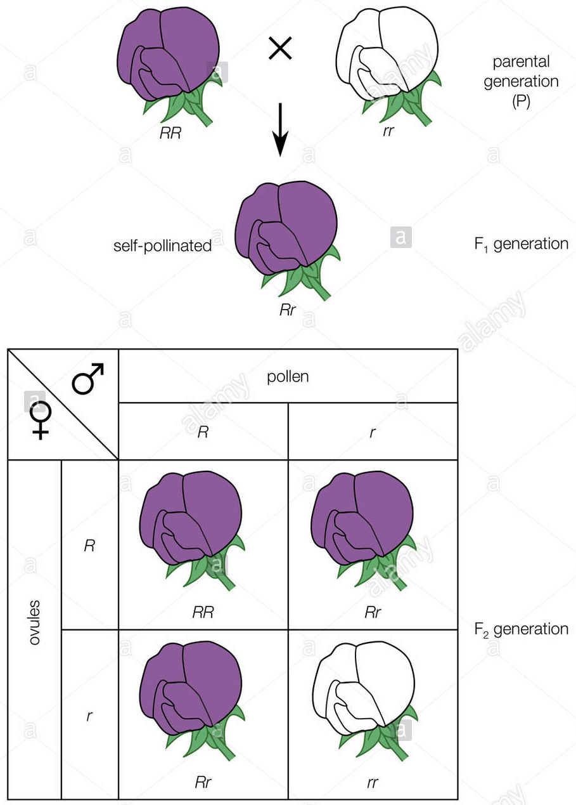
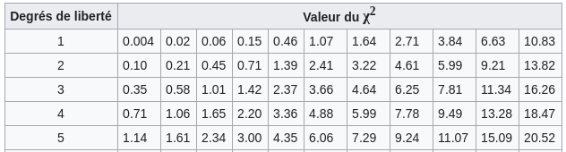
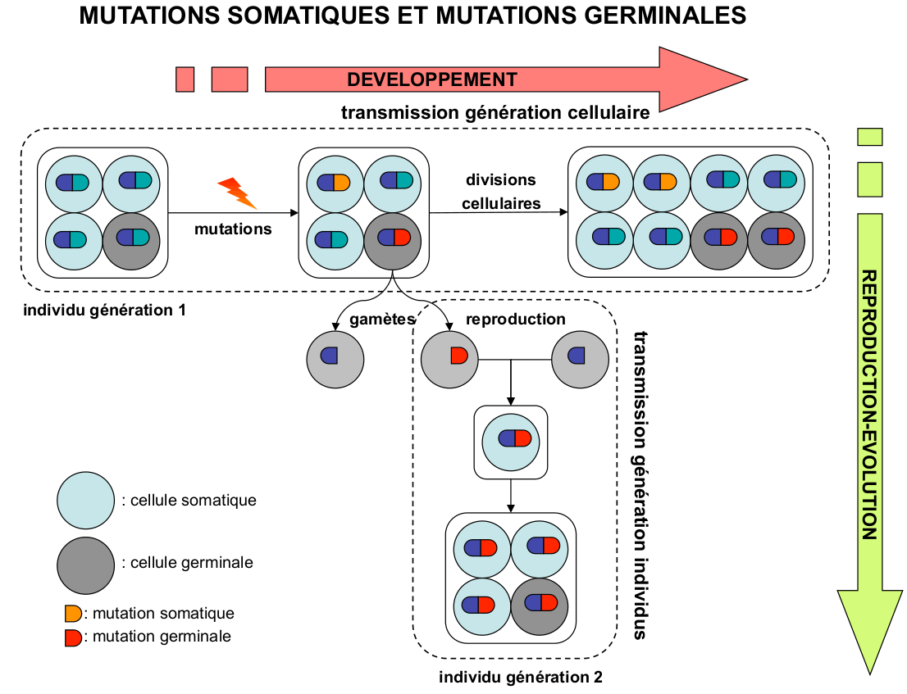
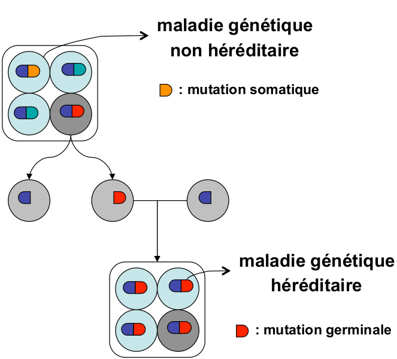
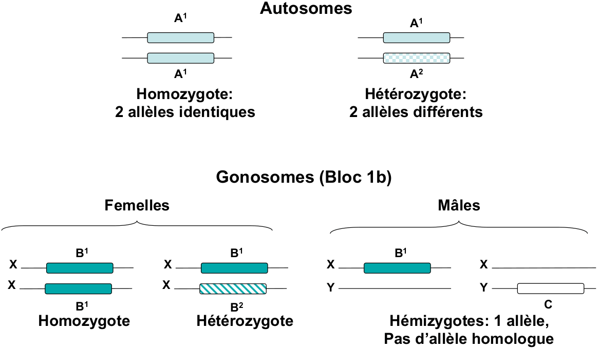
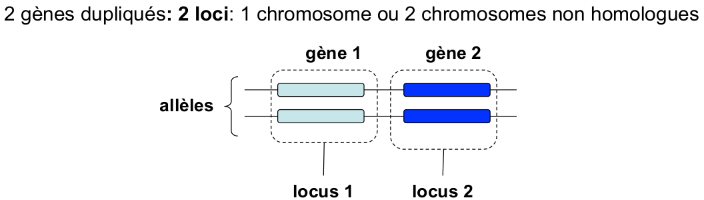
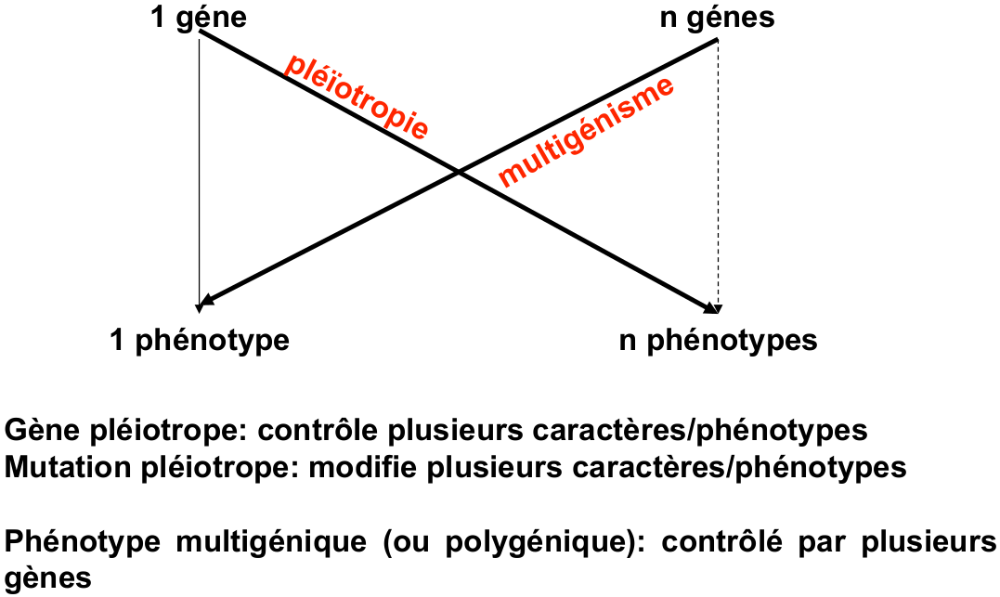
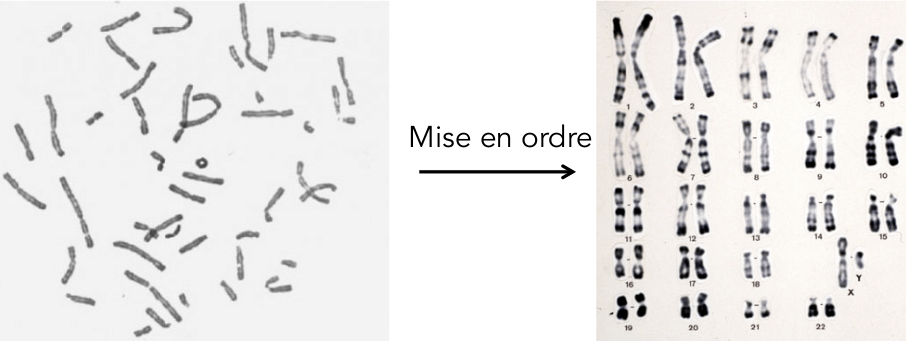
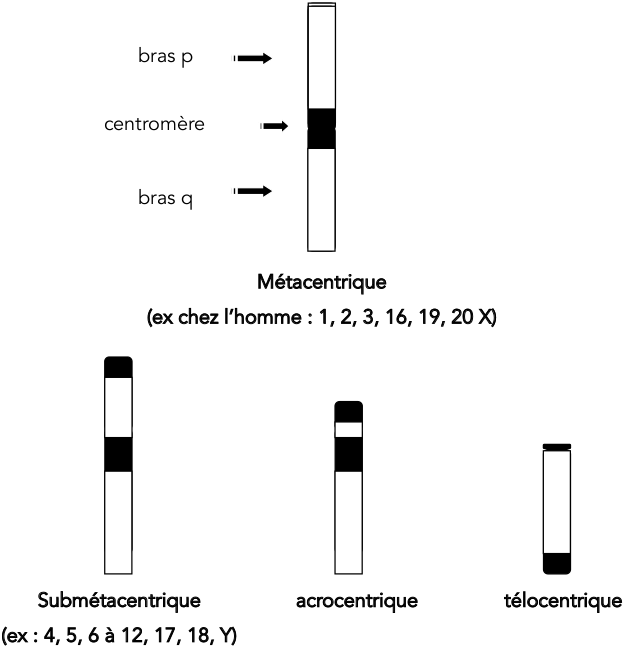
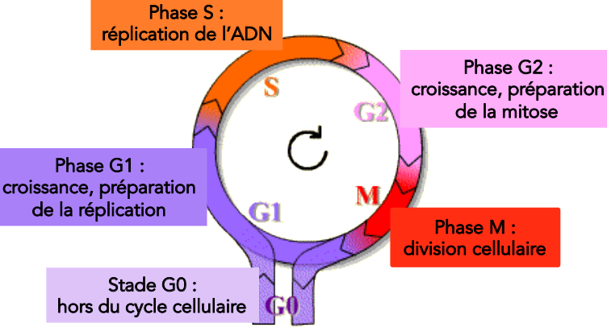

# Génétique

## Transmission héréditaire

Qu'est ce que la génétique : C'est la science de l'hérédité.

* Cellule germinale qui transmette, soma / germen
* Hérédité possible du marquage extérieur, chromatine / Épigénétique

#### Hérédité

Pour travailler sur l'hérédité il faut un croisement entre un mâle et une femelle à reproduction séxué -&gt; **Espèce modèle**, à génération rapide. Choix de caractère qui s'hérite \(Forme, couleur\), et un milieu constant \(Environnement\)

#### Caractère héréditaire

Propriété spécifique d'un organisme qui permet de distinguer deux individus à l'intérieur d'une espèce ou entre espèces.  
**Qualitatif :** \(Discret\) Génétique mendélienne, description, absence / présence  
**Quantitatif :** Se mesure -&gt; Pas en L1

### Loi de Mendel

Comme le petit poids peut s'auto-féconder, il y a eu castration \(couper les étamines\) des sujet pour choisir une femelle et un mâle de chaque espèces. Puis reproduction manuelle, hybridation.  
Pour partir sur de bonne base et observer le croisement entre chaque variété, il à eu recours à des lignées pure \(Consanguinité pour réduire la variation de la descendance\)


Avant croisement il y à donc **isogénisation** des variétés : **Lignées pures.**


On peut mettre en place les mots génotype et phénotype. \(William johannsen \(Danois\) met en terme les mots Génotype, Phénotype et gène\)

#### Mis en place de l'expérience de Mendel

Si on connais la Dominance / Récession alors le **phénotype** doit être écris en **majuscule** pour le **dominant** et **minuscule** et **récession**.  
Le génotype s'écris P/p \(qui représente les deux allèles présent sur les deux chromosomes\) alors que le phénotype s'écrit \[P\]

* Pure : Pure \[Pourpre\] x Pure \[Blanche\]
* Filliale 1 \(F1\) : Hypothèse possible
  * Pourpre 100% -&gt; Dominance \[Pourpre\] &gt; \[Blanc\] \(Homozygote\)
  * Blanc 100% -&gt; Dominance \[Blanc\] &gt; \[Pourpre\] \(Homozygote\)
  * Rose \(Mélange\) -&gt; Pseudo-Dominance \(Hétérozygote\)
* Uniformité des hybride -&gt;

Mendel à aussi étudié des pois aux phénotype ridé ou lisse, l'hypothèse possible de ce phénotype est une mutation sur un gène qui produit les enzymes liés à l'amidon \(dans le cas des pois ridés, il y à carence d'amidon\)

### Outils statistique

#### Test du khi-deux

$$\chi^2 = \sum \frac{(Observé - Théorique)^2}{Théorique}$$   
avec comme degrés de liberté d.d.l le nombre de catégorie phénotypique -1

Si khi-carrer est inférieur à la valeur seuil alors on peut accepter l'hypothèse H0 entre les effectif théoriques et les effectifs observés.

### Mutation et caractère héréditaire

#### Origine des différence de caractère héréditaire


Les différences de caractère héréditaire proviennent des **mutations génétiques** effectuées sur ces gènes. Un gène existe sous différente forme


#### Qu'est ce qu'une mutation ? 


* Un changement de **l'information génétique**
* Un changement dans **la séquence d'un génome**


Mutation spontané \(naturelle\), germinale, somatique et induite \(artificielle\)

#### Germinal et Somatique \(Soma/Germen\)


**Somatique :** Lié à l'ensemble du corps sauf les gamètes  
Soma : Corps

**Division de base :** La mitose

**Méiose :** Production de gamète \(cellule haploïde\)


La biologie du développement, la génétique et l'évolution -&gt; sont basés sur le même principe mais pas avec la même échelle de temps.

**Quelles sont les différences entre maladie génétique et maladie héréditaire ?**

* Une **maladie héréditaire** est forcément une **maladie génétique**
* **Maladie génétique** peut se produire à **différents moments d'expression** et **peut ou ne pas être héréditaire**

### A savoir

L'homme compte à peut prêt 30,000 gènes. Ainsi que 23 paires de chromosomes soit 46 chromosomes au total.  
Gonosome ou hétérochromosome XX ou YY

Différent allèle d'un même gène -&gt; souvent phénotype différents. Prouvé par la mutation du gène white 1 trouvé par Thomas Hunt Morgan en 1909

la **variabilité allélique d'un gène** dans la **nature** amène le **polymorphisme**

#### Convention

Lors d'un démarrage d'une expérience ont part sur un phénotype \(ou allèle\) sauvage, qui correspond au phénotype de référence. Pour ce faire il suffis de prendre au moins 1 individus femelle  fécondée et faire reproduire sa descendance par consanguinité pour obtenir une **lignée pure**.  
Allèle sauvage noté : $$a^+$$ou +  
Allèle mutant noté : $$a^-$$ou - puis \($$a^1-a^2-a^3 \ etc)$$

#### Relation génotype et phénotype

## Cytogénétique

Histoire

* 1831 : Robert Brown - Botaniste  qui identifie des structures dans les cellules végétales qu'il nomme noyau
* 1839 : Jacob Schleiden et Théodore Schaun théorie de la division cellulaire
* 1865 : Gregor Mendel, hérédité et héritage
* 1877 : Walter Flemming - Fondateur de la biologie cellulaire : découvre la chromatine
* 1887 : Boveri persistance chromosomes \(appelé filament\), loi de réduction chromatine au cours de la méiose
* 1888 : Waldeyer, les filaments dans la chromatine, appelée chromosome
* 1903 : Walter Sutton et Boveri : théorie chromosomique de l'hérédité, chromosome sont partit de l'information
* 1910 : Morgan valide l'hypothèse de Sutton par ses études de la couleur de l'oeil de la drosophile \(chromosome sexuel\)

### Organisation de l'information génétique

Les procaryotes ont l'adn dans le cytoplasme, capsule pour protéger les chromosomes  
Les eucaryotes ont l'adn dans le noyau, génome et chromosome protégé par le noyau  
Mouvement broumien, pollen bouge dans le cytoplasme  
Il y a 2 metres de molécules d'ADN dans un noyau d'environ 1um

#### Taille chez les eucaryote

L'homme à environs 3000 Mb \(méga base\), le reccord est détenue par une plante verte avec 80,000 Mb 

Comment faire tenir une chaine de molécule de 2m dans 1um ?   
L'ADN est une molécule fragile : comment la protéger des agression physique ?

### Compactions de la chromatine


Chromatine viens de Chroma, coleur avec laquelle on à trouvé la chromatine.  
Chromatine est le double brin d'ADN associé à des protéines d'histone

Histone : Protéine basique interagissent avec l'ADN, il y a 9 protéine histone par nucléosome

Nucléosome : Unité de base de la chromatine


L'ADN s'enroule autour de H1,H2A,H2B,H3,H4, double hélice d'adn de 2nm de large sur 2m de long. 

Etape de compaction :   
- Repliement en ressort du nucléofilament \(solénoïde\)  
- Repliement en boucle : filament de 300nm d'épaisseur  
- Chromatine condensé en spirale  
- Chromosome métaphasique \(Période courte de la vie d'une cellule\)

### Condensation de la chromatine au cours du cycle cellulaire


Certains neurone ne se divise pas


Interphase : Mitose, G1, Phase S réplication, Phase G2  
Il y a deux état de la chromatine : hétérochromatine condensé, pas d'expression de gènes  
Et l'euchromatine peu condensé, expression des gènes

Phase M de mitose \(division cellulaire\) état maximal de condensation sous forme de chromosome métaphasique  
Les corps de Barr, face interne de l'enveloppe nucléaire

Coordination du chromosome métaphasique  
Chromosome est la chromatine à l'état visible  
2 Chromatides sœurs de même séquence \(voir réplication ADN\), télomère et centromère. Le chromosome à 1 chromatide se décondense

### Organisation du chromosome métaphasique

Le chromosome = état chromatine visible  
2 Chromatide soeurs de même séquence  
Télomère et Centromère, quand le chromosome à une chromatide il se décondense

### Caryotype : mise en évidence des chromosomes métaphasiques et anomalies

L'analyse du caryotype d'un individu permet d'identifier les anomalies de nombres ou de structures des chromosome  
Prélèvement -&gt; Centrifugation -&gt; Culture -&gt; Stimulation de la mitose -&gt; Blocage du fuseau -&gt; Choc hypotonique \(rompre membrane plasmique\), Éclatement, étalement, fixation, coloration  
Chez l'homme : 46 chromosomes = 23 paires de chromosomes homologues \(même taille, mêmes bandes\) sauf si cellules mâles &gt; une paire de chromosomes X et Y

Les chromosomes X et Y sont appelés **gonosomes** ou **hétérosomes** \(liés au sexe\). Les chromosomes non sexuels sont appelés autosomes.  
Il existe donc un duplicat de chromosomes dans la cellule animale somatique: nombre total = 2 n  
Dans un gamète \(ovule ou spermatozoïde\), un seul exemplaire: nombre total = n  
**La ploïdie** caractérise le nombre d’exemplaire de chromosomes dans la cellule

* n chromosomes est haploïde \(ex : gamètes\)
* 2n chromosomes est diploïde \(ex : cellule somatique\)
* xn chromosomes est polyploïde

#### Nomenclature des caryotype

Carte cytogénétique   
Les bandes et sous-bandes visibles après coloration en microscopie à haute résolution sont nommées p1, p2, p3, p11, p12; q1, q2, q3, q11, q12 etc., en allant du centromère vers le télomère.

#### Anomalie de nombres de chromosomes

Euploïdie : diploïdie \(2n\) peut amener à triploïde \(3n\) et monoploïdie \(n\)  
Aneuploïdie : diploïdie \(2n\) peut amener à trisomie \(2n+1\) et tétrasomie \(2n +2\) ou monosomie \(2n-1\) nullisomie \(2n -2\)

#### Anomalie de structure des chromosomes

Délétion : fomation d'un anneau  
Insertion  
Duplication  
inversion paracentrique  
Inversion péricentrique  
Translocation réciproque \(équilibrée\)

## Cycle cellulaire


Ensemble des phases par lesquelles une cellule passe entre 2 divisions successives.


Les phases S et M : deux évènements fondamentaux :  
- réplication de l’ADN au cours de la phase S \(synthèse\)  
- partage égal des chromosomes entre les 2 cellules filles  
Les phases G1 et G2 : deux intervalles \(gap=trou, vide\) qui préparent la cellule aux phases S et M  
Les phases G1, S et G2 constituent l’interphase  
La durée du cycle cellulaire varie en fonction du type cellulaire

### Contrôle du cycle cellulaire

Système de régulation hautement perfectionné, pas de réplication ou de mitose si anomalie \(cellule somatique\)  
Couple CDK - Cycline -&gt; Protéine qui régule cycle cellulaire grâce au kénase \(enryme\)

### Différentes phases

#### Phase G1

La plus longue, la plus variable en durée  
Augmentation du volume de la cellule  
Transcription et traduction de protéines cytoplasmiques

#### Phase S et réplication de l'ADN

Elle dure 6h environ, il y a deux événement majeurs : Réplication de l'ADN et Duplication du centrosome  
Réplication de l'ADN selon un mécanisme semi conservatif : les deux brins se séparent et servent chacun à la synthèse d'un nouveau brin  
On peut l'imager par les chromosome à 1 chromatide qui forme un chromosome à 2 chromatide identique

#### Phase G2

La cellule se prépare à se diviser en synthétisant les protéines nécessaires à la mitose   
La cellule vérifie que la réplication de l’ADN a été effectuée correctement

#### Phase M mitose

Deux événement majeur :   
- La mitose : division nucléaire  
- La cytokinèse : division cytoplasmique

La phase de mitose se divise en 6 phase différente :  
Prophase - Prométaphase - Métaphase - Anaphase - Télophase \(Chromosome visible durant ces phases\) - Cytokinèse

Prophase : Condensation des chromosomes répliqués, migration du centrosomes \(2 aster\)  
Prométaphase : Fragmentation de l'enveloppe nucléaire, les microtubules du cytosquelette interagissent avec les chromosomes  
Métaphase : Alignement des chromosomes sur la plaque métaphasique ou équatoriale, structure bipolaire du fuseau mitotique.  
Anaphase : Ségrégation des chromatides sœurs vers les pôles du fuseau mitotique  
Télophase : Réformation de l'enveloppe nucléaire de chacun des noyaux  
Cytokinèse : Partager et séparation des cytoplasme

### Méiose, division particulière

## Définition


**ADN :** Acide DésoxyriboNucléique. Polymère de désoxyribonucléotides. L'ADN est formé de deux chaines de désoxyribonucléotides antiparallèles \(double hélices\), reliées entre elles par des liaisons hydrogène entre les bases azotées : l'adénine est liée avec la thymine par deux liaisons hydrogène, la guanine à la cytosine par trois liaison hydrogène. La succession de ces paires de bases azotées est le support de l'information génétique. L'ADN se trouve dans le noyau, les mitochondries et les chloroplaste.

**Désoxyribonucléotide :** Espèce chimique constituée d'un acide phosphorique, d'un sucre en carbone 5 \(Désoxyribose\), d'une base azotée, soit purique : adénine \(A\) ou guanine \(G\), soit pyrimidique : cytosine \(C\) ou thymine \(T\)

**Désoxyribose:** Ribose qui a subi une désoxygénation réductrice du carbone 2

**ARN :** Acide ribonucléique. Polymère de ribonucléotides. Il existe des ARNpm, ARNm, ARNt, ARNr et des petits ARN \(ARNsn, ARNsno\)

**Mutation :** Modification de la séquence des nucléotides de l'ADN, ou d'une manière plus générale, toute modification héréditaire du matériel génétique. Dans un organisme pluricellulaire, seules se transmettent à la descendances les **mutation germinales**. Les **mutations somatiques** ne se transmette qu'aux cellules issues par mitose de la cellule mutée, ces cellules forment alors un clone. On distingue les mutations qui apparaissent à la suite d'erreurs de l'ADN polymérase au cours  de la réplication, des mutations qui apparaissent durant les phases G1 et G2 de l'interphase à la suite de l'action d'agents mutagènes et qui sont pas réparées.

**Homozygote :** Individu qui possède pour un même gène le même allèle sur les deux chromosome homologue de la paire

**Hétérozygote :** Individu qui possède sur chaque chromosome homologue de la même paire un allèle différent d'un même gène

**Hémizygote :** Un organisme est dit **hémizygote** pour un gène particulier si ce dernier n'est présent qu'à une seule copie \(et donc présent qu'à un seul allèle\) à un locus donné dans un organisme diploïde.

**Dominance :** Caractéristique d'un allèle d'un gène qui, **chez un hétérozygote**, masque au niveau du phénotype, l'effet d'un allèle du même gène

**Récessivité :** Caractéristique d'un allèle d'un gène qui, **chez un hétérozygote**, ne s'exprime pas dans le phénotype

**Co-dominance :** Allèle d'un gène, **présent chez un hétérozygote**, à l'origine d'un phénotype en général intermédiaire entre ceux des deux homozygote respectifs

**Gène :** Le gène est situé à un endroit bien précis du chromosome \(**locus**\) et **porte l'information génétique.**

**Génome :** Ensemble de toutes les séquence ADN d'un être vivant 

**Allèle :** Plusieurs formes d'un gène **à un locus donné**

**Locus :** Emplacement d’un gène sur le chromosome

**Ségrégation :** Processus qui produit la séparation de deux éléments

**Épistasie :** Situation dans laquelle le phénotype d'un individu dépend d'une part du génotype à un locus donné et d'autre part du génotype à un autre locus

**Haploïde :** Ce dit d'un **organisme ou d'une cellule eucaryote** qui ne possède **qu'un seul lot de chromosome homologues.** \(Les gamètes, les champignons comme les levures ou les Neurospora sont des organisme Haploïde\)

**Diploïde :** Etat d'une cellule ou d'un organisme \(diplonte\) qui possède deux lots de chromosome homologues

**Phénotype :** Caractère **héréditaire** étudié en génétique

**Génotype :** _Information **génétique**_ déterminant un phénotype

**Autosome :** N'importe quel chromosome autre que les chromosome sexuels

**Gonosome :** Appelé aussi Hétérochromosome, chromosome appartenant à une paire responsable de la détermination du sexe : XX pour la femme et XY pour l'homme.

**Pléïotropie :** Effet multiple d'un gène qui n'agit pas que sur un seul caractère phénotypique

**Multigénisme :** Aussi appelée polygénique, se dit d'un caractère du phénotype qui est déterminé par l'action de plusieurs gènes. \(Syn, Multifactoriel\)

**Zygote :**  Cellule diploïde résultant de la fusion de deux gamètes haploïdes


#### Source

[Ressource 1](http://univ.ency-education.com/uploads/1/3/1/0/13102001/genetique1an31-1genetique.pdf)

