# Génétique

## Transmission héréditaire

Qu'est ce que la génétique : C'est la science de l'hérédité.

* Cellule germinale qui transmette, soma / germen
* Hérédité possible du marquage extérieur, chromatine / Épigénétique

#### Hérédité

Pour travailler sur l'hérédité il faut un croisement entre un mâle et une femelle à reproduction séxué -&gt; **Espèce modèle**, à génération rapide. Choix de caractère qui s'hérite \(Forme, couleur\), et un milieu constant \(Environnement\)

#### Caractère héréditaire

Propriété spécifique d'un organisme qui permet de distinguer deux individus à l'intérieur d'une espèce ou entre espèces.  
**Qualitatif :** \(Discret\) Génétique mendélienne, description, absence / présence  
**Quantitatif :** Se mesure -&gt; Pas en L1

### Loi de Mendel

Comme le petit poids peut s'auto-féconder, il y a eu castration \(couper les étamines\) des sujet pour choisir une femelle et un mâle de chaque espèces. Puis reproduction manuelle, hybridation.  
Pour partir sur de bonne base et observer le croisement entre chaque variété, il à eu recours à des lignées pure \(Consanguinité pour réduire la variation de la descendance\)


Avant croisement il y à donc **isogénisation** des variétés : **Lignées pures.**


On peut mettre en place les mots génotype et phénotype. \(William johannsen \(Danois\) met en terme les mots Génotype, Phénotype et gène\)

#### Mis en place de l'expérience de Mendel

Si on connais la Dominance / Récession alors le **phénotype** doit être écris en **majuscule** pour le **dominant** et **minuscule** et **récession**.  
Le génotype s'écris P/p \(qui représente les deux allèles présent sur les deux chromosomes\) alors que le phénotype s'écrit \[P\]

* Pure : Pure \[Pourpre\] x Pure \[Blanche\]
* Filliale 1 \(F1\) : Hypothèse possible
  * Pourpre 100% -&gt; Dominance \[Pourpre\] &gt; \[Blanc\] \(Homozygote\)
  * Blanc 100% -&gt; Dominance \[Blanc\] &gt; \[Pourpre\] \(Homozygote\)
  * Rose \(Mélange\) -&gt; Pseudo-Dominance \(Hétérozygote\)
* Uniformité des hybride -&gt;

Mendel à aussi étudié des pois aux phénotype ridé ou lisse, l'hypothèse possible de ce phénotype est une mutation sur un gène qui produit les enzymes liés à l'amidon \(dans le cas des pois ridés, il y à carence d'amidon\)

### Outils statistique

#### Test du khi-deux

$$\chi^2 = \sum \frac{(Observé - Théorique)^2}{Théorique}$$   
avec comme degrés de liberté d.d.l le nombre de catégorie phénotypique -1

Si khi-carrer est inférieur à la valeur seuil alors on peut accepter l'hypothèse H0 entre les effectif théoriques et les effectifs observés.

### Mutation et caractère héréditaire

#### Origine des différence de caractère héréditaire


Les différences de caractère héréditaire proviennent des **mutations génétiques** effectuées sur ces gènes. Un gène existe sous différente forme


#### Qu'est ce qu'une mutation ? 


* Un changement de **l'information génétique**
* Un changement dans **la séquence d'un génome**


Mutation spontané \(naturelle\), germinale, somatique et induite \(artificielle\)

#### Germinal et Somatique \(Soma/Germen\)


**Somatique :** Lié à l'ensemble du corps sauf les gamètes  
Soma : Corps

**Division de base :** La mitose

**Méiose :** Production de gamète \(cellule haploïde\)


La biologie du développement, la génétique et l'évolution -&gt; sont basés sur le même principe mais pas avec la même échelle de temps.

**Quelles sont les différences entre maladie génétique et maladie héréditaire ?**

* Une **maladie héréditaire** est forcément une **maladie génétique**
* **Maladie génétique** peut se produire à **différents moments d'expression** et **peut ou ne pas être héréditaire**

### A savoir

L'homme compte à peut prêt 30,000 gènes. Ainsi que 23 paires de chromosomes soit 46 chromosomes au total.  
Gonosome ou hétérochromosome XX ou YY

Différent allèle d'un même gène -&gt; souvent phénotype différents. Prouvé par la mutation du gène white 1 trouvé par Thomas Hunt Morgan en 1909

la **variabilité allélique d'un gène** dans la **nature** amène le **polymorphisme**

#### Convention

Lors d'un démarrage d'une expérience ont part sur un phénotype \(ou allèle\) sauvage, qui correspond au phénotype de référence. Pour ce faire il suffis de prendre au moins 1 individus femelle  fécondée et faire reproduire sa descendance par consanguinité pour obtenir une **lignée pure**.  
Allèle sauvage noté : $$a^+$$ou +  
Allèle mutant noté : $$a^-$$ou - puis \($$a^1-a^2-a^3 \ etc)$$

#### Relation génotype et phénotype

## Cytogénétique

Histoire

* 1831 : Robert Brown - Botaniste  qui identifie des structures dans les cellules végétales qu'il nomme noyau
* 1839 : Jacob Schleiden et Théodore Schaun théorie de la division cellulaire
* 1865 : Gregor Mendel, hérédité et héritage
* 1877 : Walter Flemming - Fondateur de la biologie cellulaire : découvre la chromatine
* 1887 : Boveri persistance chromosomes \(appelé filament\), loi de réduction chromatine au cours de la méiose
* 1888 : Waldeyer, les filaments dans la chromatine, appelée chromosome
* 1903 : Walter Sutton et Boveri : théorie chromosomique de l'hérédité, chromosome sont partit de l'information
* 1910 : Morgan valide l'hypothèse de Sutton par ses études de la couleur de l'oeil de la drosophile \(chromosome sexuel\)

### Organisation de l'information génétique

Les procaryotes ont l'adn dans le cytoplasme, capsule pour protéger les chromosomes  
Les eucaryotes ont l'adn dans le noyau, génome et chromosome protégé par le noyau  
Mouvement broumien, pollen bouge dans le cytoplasme  
Il y a 2 metres de molécules d'ADN dans un noyau d'environ 1um

#### Taille chez les eucaryote

L'homme à environs 3000 Mb \(méga base\), le reccord est détenue par une plante verte avec 80,000 Mb 

Comment faire tenir une chaine de molécule de 2m dans 1um ?   
L'ADN est une molécule fragile : comment la protéger des agression physique ?

### Compactions de la chromatine


Chromatine viens de Chroma, coleur avec laquelle on à trouvé la chromatine.  
Chromatine est le double brin d'ADN associé à des protéines d'histone

Histone : Protéine basique interagissent avec l'ADN, il y a 9 protéine histone par nucléosome

Nucléosome : Unité de base de la chromatine


L'ADN s'enroule autour de H1,H2A,H2B,H3,H4, double hélice d'adn de 2nm de large sur 2m de long. 

Etape de compaction :   
- Repliement en ressort du nucléofilament \(solénoïde\)  
- Repliement en boucle : filament de 300nm d'épaisseur  
- Chromatine condensé en spirale  
- Chromosome métaphasique \(Période courte de la vie d'une cellule\)

### Condensation de la chromatine au cours du cycle cellulaire


Certains neurone ne se divise pas


Interphase : Mitose, G1, Phase S réplication, Phase G2  
Il y a deux état de la chromatine : hétérochromatine condensé, pas d'expression de gènes  
Et l'euchromatine peu condensé, expression des gènes

Phase M de mitose \(division cellulaire\) état maximal de condensation sous forme de chromosome métaphasique  
Les corps de Barr, face interne de l'enveloppe nucléaire

Coordination du chromosome métaphasique  
Chromosome est la chromatine à l'état visible  
2 Chromatides sœurs de même séquence \(voir réplication ADN\), télomère et centromère. Le chromosome à 1 chromatide se décondense

### Organisation du chromosome métaphasique

Le chromosome = état chromatine visible  
2 Chromatide soeurs de même séquence  
Télomère et Centromère, quand le chromosome à une chromatide il se décondense

### Caryotype : mise en évidence des chromosomes métaphasiques et anomalies

L'analyse du caryotype d'un individu permet d'identifier les anomalies de nombres ou de structures des chromosome  
Prélèvement -&gt; Centrifugation -&gt; Culture -&gt; Stimulation de la mitose -&gt; Blocage du fuseau -&gt; Choc hypotonique \(rompre membrane plasmique\), Éclatement, étalement, fixation, coloration  
Chez l'homme : 46 chromosomes = 23 paires de chromosomes homologues \(même taille, mêmes bandes\) sauf si cellules mâles &gt; une paire de chromosomes X et Y

Les chromosomes X et Y sont appelés **gonosomes** ou **hétérosomes** \(liés au sexe\). Les chromosomes non sexuels sont appelés autosomes.  
Il existe donc un duplicat de chromosomes dans la cellule animale somatique: nombre total = 2 n  
Dans un gamète \(ovule ou spermatozoïde\), un seul exemplaire: nombre total = n  
**La ploïdie** caractérise le nombre d’exemplaire de chromosomes dans la cellule

* n chromosomes est haploïde \(ex : gamètes\)
* 2n chromosomes est diploïde \(ex : cellule somatique\)
* xn chromosomes est polyploïde

#### Nomenclature des caryotype

Carte cytogénétique   
Les bandes et sous-bandes visibles après coloration en microscopie à haute résolution sont nommées p1, p2, p3, p11, p12; q1, q2, q3, q11, q12 etc., en allant du centromère vers le télomère.

#### Anomalie de nombres de chromosomes

Euploïdie : diploïdie \(2n\) peut amener à triploïde \(3n\) et monoploïdie \(n\)  
Aneuploïdie : diploïdie \(2n\) peut amener à trisomie \(2n+1\) et tétrasomie \(2n +2\) ou monosomie \(2n-1\) nullisomie \(2n -2\)

#### Anomalie de structure des chromosomes

Délétion : fomation d'un anneau  
Insertion  
Duplication  
inversion paracentrique  
Inversion péricentrique  
Translocation réciproque \(équilibrée\)

## Cycle cellulaire


Ensemble des phases par lesquelles une cellule passe entre 2 divisions successives.


Les phases S et M : deux évènements fondamentaux :  
- réplication de l’ADN au cours de la phase S \(synthèse\)  
- partage égal des chromosomes entre les 2 cellules filles  
Les phases G1 et G2 : deux intervalles \(gap=trou, vide\) qui préparent la cellule aux phases S et M  
Les phases G1, S et G2 constituent l’interphase  
La durée du cycle cellulaire varie en fonction du type cellulaire

### Contrôle du cycle cellulaire

Système de régulation hautement perfectionné, pas de réplication ou de mitose si anomalie \(cellule somatique\)  
Couple CDK - Cycline -&gt; Protéine qui régule cycle cellulaire grâce au kénase \(enryme\)

### Différentes phases

#### Phase G1

La plus longue, la plus variable en durée  
Augmentation du volume de la cellule  
Transcription et traduction de protéines cytoplasmiques

#### Phase S et réplication de l'ADN

Elle dure 6h environ, il y a deux événement majeurs : Réplication de l'ADN et Duplication du centrosome  
Réplication de l'ADN selon un mécanisme semi conservatif : les deux brins se séparent et servent chacun à la synthèse d'un nouveau brin  
On peut l'imager par les chromosome à 1 chromatide qui forme un chromosome à 2 chromatide identique

#### Phase G2

La cellule se prépare à se diviser en synthétisant les protéines nécessaires à la mitose   
La cellule vérifie que la réplication de l’ADN a été effectuée correctement

#### Phase M mitose

Deux événement majeur :   
- La mitose : division nucléaire  
- La cytokinèse : division cytoplasmique

La phase de mitose se divise en 6 phase différente :  
Prophase - Prométaphase - Métaphase - Anaphase - Télophase \(Chromosome visible durant ces phases\) - Cytokinèse

Prophase : Condensation des chromosomes répliqués, migration du centrosomes \(2 aster\)  
Prométaphase : Fragmentation de l'enveloppe nucléaire, les microtubules du cytosquelette interagissent avec les chromosomes  
Métaphase : Alignement des chromosomes sur la plaque métaphasique ou équatoriale, structure bipolaire du fuseau mitotique.  
Anaphase : Ségrégation des chromatides sœurs vers les pôles du fuseau mitotique  
Télophase : Réformation de l'enveloppe nucléaire de chacun des noyaux  
Cytokinèse : Partager et séparation des cytoplasme

## Méiose, division particulière


Division cellulaire particulière qui aboutit à la production de cellules sexuelles ou gamètes pour la reproduction.  
Cellule identique en terme de patrimoine génétique  
Spermatozoïde et ovocyte n=23, deux fois moins de patrimoine génétique.


### Schéma méiose théorique

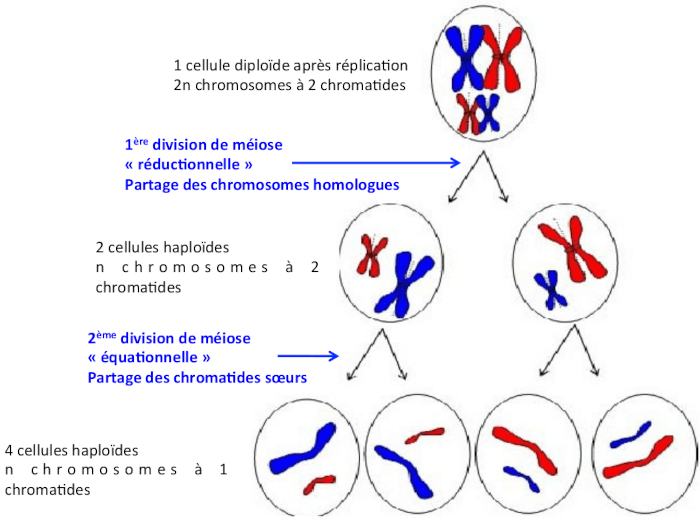

#### Différente phases de la méiose

Méiose 1 :   
- Prophase  
- Métaphase  
- Anaphase  
- Télophase  
Méiose 2 :   
- Prophase  
- Métaphase  
- Anaphase  
- Télophase

#### Prophase de méiose 1 : Brassage intrachromosomique

* Condensation des chromosomes
* Appariement des chromosomes homologues : formation de bivalent
* Echange possible de matériel entre 2 chromosomes homologues : recombinaison \(ou crossing over\) au niveau des chiasmas
* Rupture de l'enveloppe nucléaire

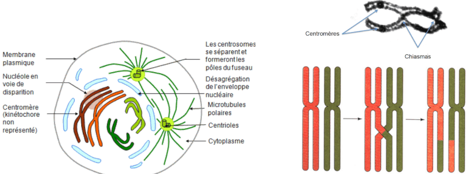

#### **Appariement des chromosomes homologues au niveau du complexe synaptonémal**


La cellule a subi une réplication, chaque chromosome contient 2 chromatides sœurs rattachées par leurs centromères  
**-** condensation partielle des chromosomes \(= leptotène\)  
- les chromosomes homologues s’associent en alignant leurs gènes grâce au complexe synaptonémal \(« échelle » de protéines\) Cette association est un bivalent ou une tétrade \(= zygotène\)


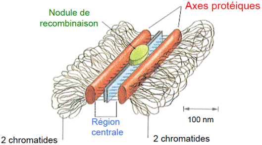

**Métaphase de méiose 1 :**  
- Alignement des chromosomes sur la plaque équatorial  
**Anaphase méiose 1 :**  
- Séparation de chacun des chromosomes d'une même paire et traction vers les pôles \(les chromatides sœurs restent attachées et migrent ensemble\)  
**Télophase de méiose 1 :**  
- Partage du cytoplasme entre les deux cellules filles

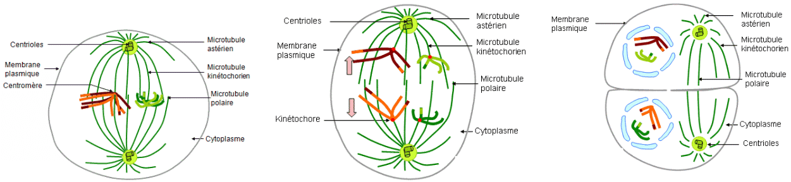

**Prophase de méiose 2 :**  
- Mise en place du fuseau  
**Métaphase de méiose 2 :**  
- alignement des chromosome sur la plaque équatorial  
**Anaphase de méiose 2 :**  
- Partage des chromatides sœurs tractées au pôles opposés  
**Télophase de méiose 2 :**  
- Partage du cytoplasme  
- 4 cellules haploïdes : gamètes !

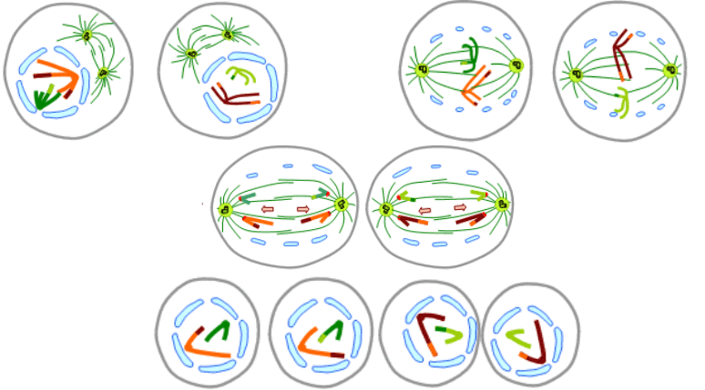


La 2ème division de méiose n’est pas une mitose !!! La méiose a lieu au cours de la formation des gamètes : gamétogenèse

* gamétogenèse mâle = spermatogenèse
* gamétogenèse femelle = ovogenèse


### Spermatogenèse

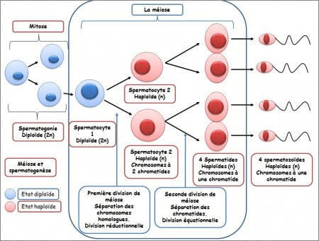

1 spermatocyte primaire donne 4 spermatozoïdes

### Ovogenèse

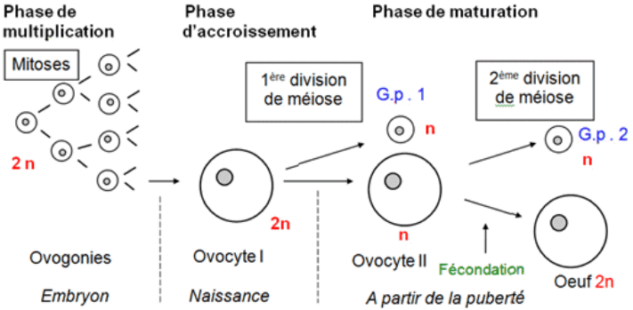

1 ovocyte primaire donne 1 seul ovule

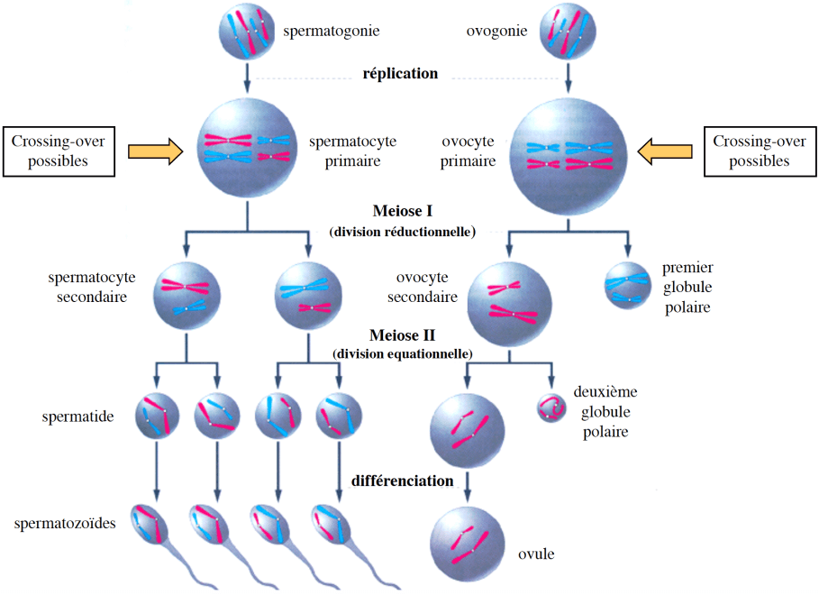

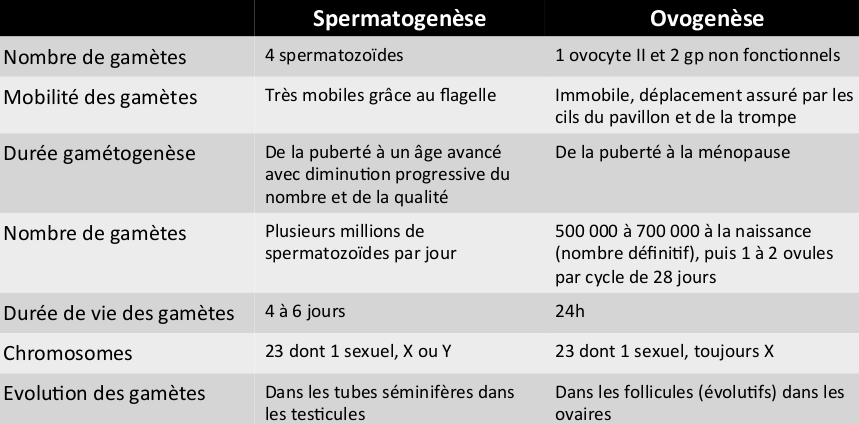

### Brassage génétique

* Diversité génétique entre individus Petites différences de séquences, avec ou sans conséquences : polymorphisme D’où différents allèles pour un même gène à un locus donné : a1, a2, a3...
* Dans une cellule diploïde : 50% des chromosomes paternels 50% des chromosomes maternels
* 2 types de chromosomique: brassage brassage intra-chromosomique en prophase de méiose I : recombinaison brassage inter-chromosomique en anaphase de méiose I : répartition aléatoire des chromosomes

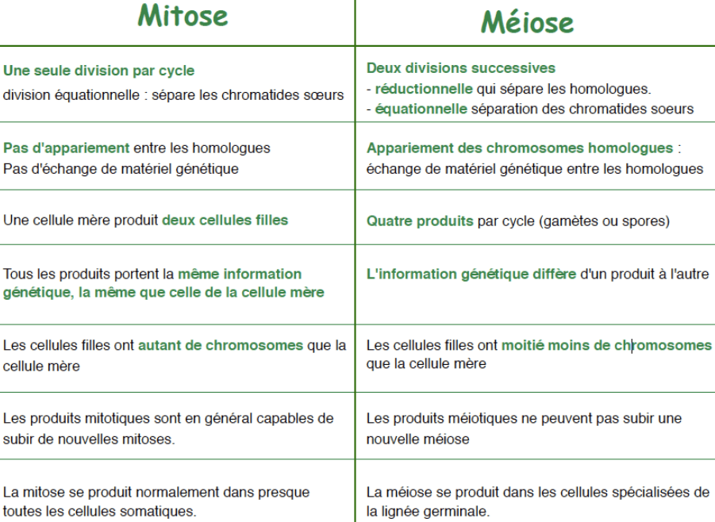

### Hérédité liée à l'X

#### Rappel loi de Mendel

* Première loi : loi de l'uniformité des hybrides de première génération Lorsque les 2 parents sont de souche pure, les hybrides F1 sont de même génotype et phénotype.
* Deuxième loi : loi de pureté des gamètes Les facteurs héréditaires \(gènes\) se séparent dans les gamètes en proportions égales \(50/50\). Un gamète ne contient qu'un facteur correspondant à un seul caractère.
* Troisième loi : Ségrégation indépendante des caractères héréditaires La ségrégation est aléatoire et obéit aux règles statistique.

Les gènes portés par les chromosomes sexuels obéissent exactement au mêmes lois que ceux  portés par les autosomes.  
En 1910 Thomas Morgan montre que certains gènes sont "liés", c'est à dire transmis ensemble, en particulier certains gènes déterminant le sexe.

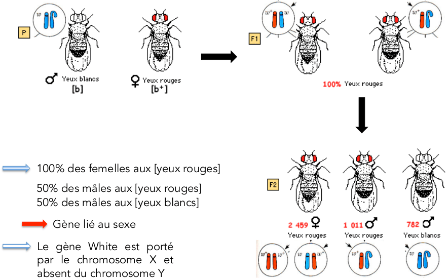

## ADN

### Les acides nucléiques: support de l’information génétique

#### Contexte historique des découvertes sur l’hérédité

* 1865 Gregor Mendel découvre les principes de l'hérédité :  «Facteurs héréditaires « indépendants »  -gardent leur identité de génération en génération »  -relèvent de lois de transmission
* 1910 Thomas Morgan montre que certains facteurs de l'hérédité sont "liés" : \(Travaux sur la mouche drosophile\) - c’est à dire: transmis ensemble - en particulier certains facteurs liés au sexe

Découverte aussi chimique avec :

* 1875-1900 Des cytologistes parviennent à colorer des particules cellulaires, les chromosomes. Il observent leur devenir au cours des divisions cellulaire \(mitose et méiose -&gt; gamète pour reproduction sexué\)
* 1900 Composition chimique simple des acides nucléiques glucide, phosphate et base azotée
* 1920 2 Grandes familles d'acide nucléiques ADN et ARN

Pas encore de lien avec les facteurs Mendel.

Fred Griffith découvre que l'ADN est le support de l'information avec son expérience sur les souris et des bactérie pathogène.  
Interprétation de l'expérience : Un facteur conférant le caractère « virulence » aux bactéries S a été transféré à la souche R lors du mélange et les a rendu pathogènes. Ce principe transformant résiste à la chaleur.

En 1944 il y a purification du principe transformant de Griffith avec une démonstration chimique que l'ADN constitue le matériel génétique \(Oswal Avery, Collin Mac Leod, Maclyn McCarty\)

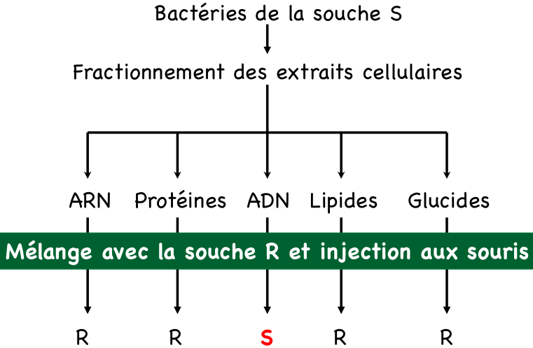


Depuis cette découverte :  
- Confirmation que l'ADN est le support de l'information génétique chez tous :  
   - Les procaryote \(bactérie, arché\)  
   - Les eucaryote \(Plante,Champignon,Métazoaire\)  
   - Et chez certaines famille de virus  
- Chez des virus comme le VIH, le virus de la grippe, l'information génétique est portée par l'ARN


#### Composition chimique des acides nucléiques


Acide nucléique : polymère de nucléotides ou chaine polynucléotidique  
2 types : Acide Ribonucléiques \(ARN\) et Acide désoxyribonucléique \(ADN\)


3 élément fondamentaux des nucléotides :   
- Un glucide \(le ribose \(ADN\) ou désoxyribose \(ARN\)\)  
- Une base azoté \(Purine : Adénine et Guanine // Pyrimidine : Cytosine et Thymine\)  
- Groupement phosphate


Phosphate + ribose \(C5\) + base = ribonucléotide  
Phosphate + désoxyribose \(C5\) + base = désoxyribonucléotide


Une chaîne polynucléotidique = 1 brin Nucléotides reliés entre eux par l’intermédiaire d’un groupement phosphate   
Liaison covalente \(phosphodiester\) entre les carbones 3’ et 5’ de deux glucides voisins  
Chaîne polynucléotidique   
Très important: Pour des raisons thermodynamiques, la polymérisation de l’ADN ou de l’ARN se fait toujours dans le sens 5’ -&gt;3’

#### La structure en double hélice d’ADN

1950 Erwin Chargaff détermine les proportions de bases A,T,C,G dans l’ADN de plusieurs espèces et constate que %A=%T et %C=%G.  
Règle de Chargaff : A=T et C = G ou \(A+G\)/\(C+T\) =1

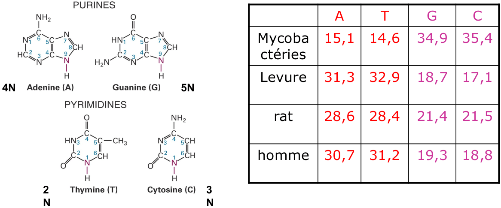

1953 Watson et Crick élucident la structure de la double hélice d'ADN, grâce au découverte de son étudiante Rosalind Franklin  
1962 Crick, Watson et Wilkins ont le prix nobel de médecine.


La structure de l'ADN en double hélice  
Deux chaines s'associent :   
- De façon anti-parallèle  
- De manière complémentaire : Purine avec Pyrimidine \(C avec G et A avec T\)  
- Grâce à des liaisons hydrogènes : 2 liaisons entre A et T // 3 liaisons entre C et G


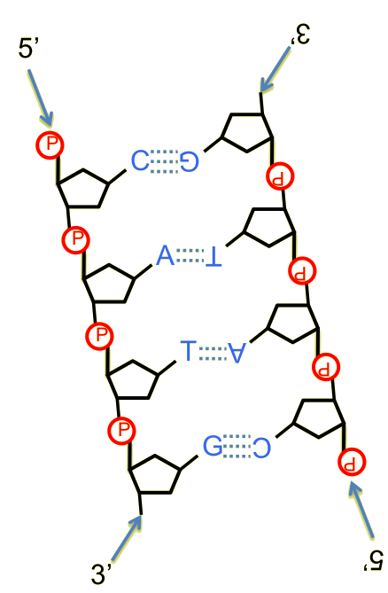

**Configuration spatiale en double hélice**  
Un tour d’hélice = 10 plateaux de bases  
La distance entre 2 plateaux de bases  
Le diamètre axial de l’hélice  
Sens de l’hélice \(variable\)

### Organisation de l’information génétique dans la cellule


Génome : ensemble de l'information génétique d'une cellule ou d'un virus


#### L’organisation de l’information génétique chez les Procaryotes

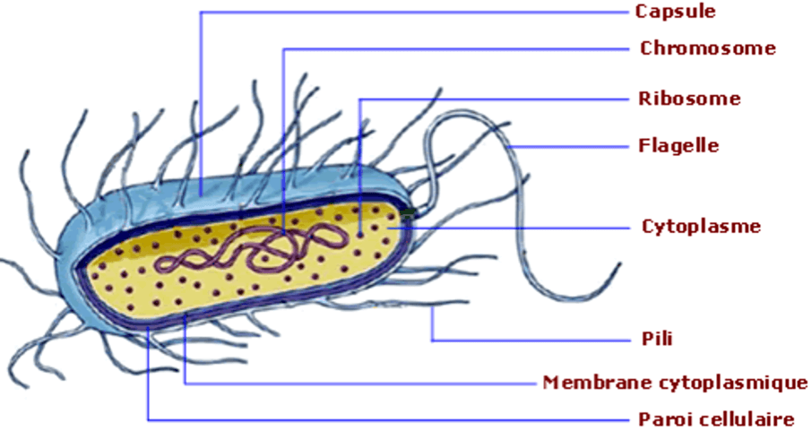


ADN double brin **circulaire**  
Plusieurs configuration spatiales : Superenroulé // relaché  
ADN enrobé de protéines


#### L'organisation du génome nucléaire chez les eucaryote

Le noyau est isolé du cytoplasme par une membrane, ADN localisé dans un compartiment spécialisé \(le noyau\); L'ADN est découpé en plusieurs segments linéaire, les chromosomes.  
Le génome est fragmenté en longs ADN linéaires = chromosomes  
L’ADN est associée à des protéines = la chromatine

Taille des cellules et de leur noyau :   
- Oursin 100um ; Souris 50um ; Algue 50um  
Taille des génomes\(de l’ADN\) de quelques eucaryotes:  
- Souris 2700MegaBase; Insecte 150mégabase et l'homme avec 3.4x10^9pb  
Sur tout le génome, seul 5% chez l'homme code des gènes, et peut être exprimé en protéine.  
L'homme à 22000 gènes et 3.4x10^9pb  
La taille du génome n’est donc pas forcément relié à la complexité de l’organisme et aux nombres de gènes compris dans ce génome

#### Le chromosome: chromatine et nucléosome

1 mètre d'ADN dans un noyau de 6um, il faut donc le compacter.  
**Nucléosome**  
Chromosome : 1 molécule en double brin et des protéine. Protéine acide et protéine basique, les histones.  
L'ADN s'enroule autour de 4 histone puis s'accroche à un 5é.

#### Les chromosomes dans le noyau interphasique

Pendant l'interphase, l'ADN est condensée partiellement. Il y a 2 états de la chromatines :   
- Hétérochromatine, chromatine condensée, expression de gènes inactives.  
- Euchromatine, chromatine peu condensée, expression des gènes active  
Nucléole : site de synthèse des ribosomes.

#### Condensation de la chromatine pendant la division cellulaire

Pendant la phase M il y a condensation maximale de la chromatine  
Structure complexe composée d'ADN et de protéine  
Structure : Chromatine

#### Les divers degrés de condensation de la chromatine

**La fibre de 11nm**  
- L'ADN est enroulé en 2 tours \(146pb\) autour d'un nucléosome  
- Un autre histone relie 2 nucléosome  
- Ressemble à un collier de perle de 2nm  
**Le filament de chromatine de 30nm**  
- La fibre de 10nm peut prendre une forme solénoïde autour d ’ histone H1  
- Chromatine = filament d ’ ADN + protéines nucléaires \(Histones et protéines HMG \(high Mobility Group\) \)  
**Échafaudage du chromosome**   
Chromosome scaffold = Échafaudage du chromosome Echafaudage protéique  
**La chromatine dilatée et condensée  
Le chromosome métaphasique**  
Chromosome le plus représenté, il correspond à l'état de condensation maximale.

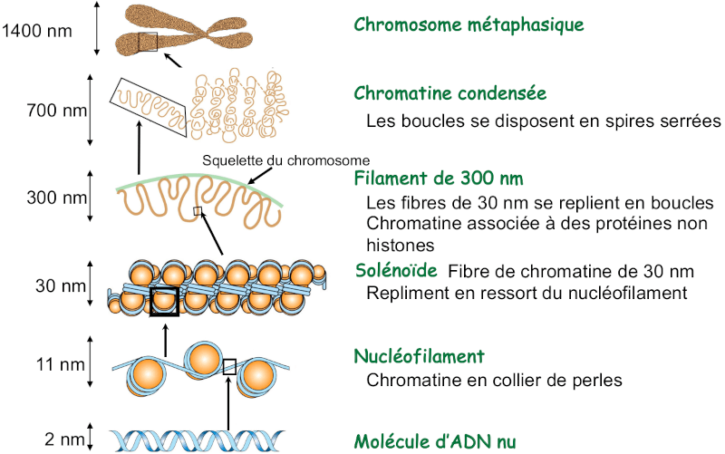

### Les modifications des histones


Toutes les histones sont susceptibles d’être acétylées sur des lysines spécifiques.


### Structure des chromosomes

Organisation du chromosome « métaphasique »: une image caricaturale  
- 2 chromatides: séquences identiques \(cf. réplication\) attachées par le centromère bras long/court  
- centromère: ADN non répliqué ;  -ADN riche en motifs répétés -pas de gènes -point d’attachement des microtubules  
- télomères: extrémités de la chromatide -ADN riche en motifs répétés -pas de gènes -important pour l’intégrité du chromosome

#### Récap


* ADN présent dans le noyau \(mais quelques exceptions cf III\)
* découpés en plusieurs segments linéaires = chromosomes \(chez l’homme

  2n=46\)

* repliés avec différents degrés de condensation en fonction du cycle cellulaire
* l’ADN n’est pas nu: il est emballé par des protéines.


#### Le génome extra-nucléaire chez les Eucaryotes

**De l’information génétique dans les mitochondries**  
Des ADN circulaires sont présents dans la matrice mitochondriale, transmis uniquement par la mère. ADN très petit / ADN nucléaire.  
ADN double-brin circulaire de petite taille 16 000 pb transmis uniquement par la mère  
ADN très petit par rapport aux 3.10 9 pb de l'ADN nucléaire  
1 ¢ : de 300 à 500 mitochondries contenant chacune de 2 à 4 molécules d'ADN mt  
Système génétique exprimant ; quelques protéines essentielles // des ARN de transfert //des ARN ribosomaux  
Réplication  
**Les chloroplastes possèdent aussi un système génétique**  
ADN circulaire plus long ;   
- nombreux gènes essentiels au métabolisme   
-gènes d’ARNt, ARNr   
 -réplication  
**Les virus**  
Dans la nucléocapside virale; Dans la nucléotide au niveau du chromosomes bactérien; des plasmides

### Liaison de l'ADN - Mutation - Réparation


**Mutation :** Une mutation est une modification accidentelle de l'information génétique \(lésion\). Selon la partie du génome touchée, les conséquences d'une mutation peuvent varier.   
Une mutation est héréditaire si la séquence génétique mutée est transmise à la génération suivante \(mutation germinale\).   
Elle favorise la biodiversité et participe à l'évolution des espèces.


#### Mutation induite \(artificielle\)


**Mutagène :** un mutagène est un agent naturel ou anthropique, physique ou chimique qui peut altérer la structure de l'ADN  
Chaque mutagène a une spécificité de mutation et d’efficacité


**Les analogues de bases**

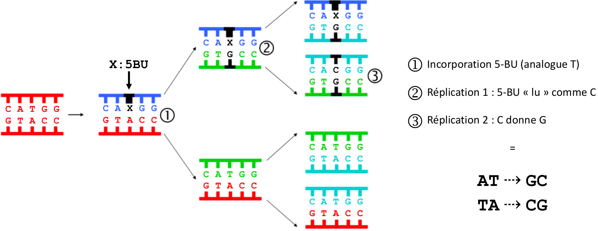

**Les agents alkylants** \(Le gaz moutarde\) **\(Site abasiques\)**  
- Différents groupement de base peuvent être ciblés par l'alkylation  
- La taille des flèches est proportionnelle à la fréquence de l'alkylation

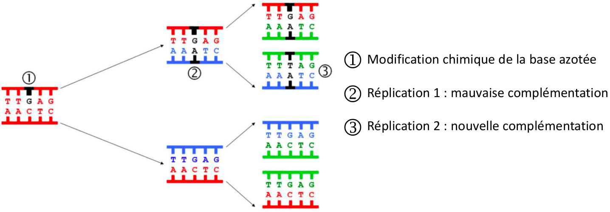

**Les agents intercalant \(Déformation par étirement de l'ADN\)**

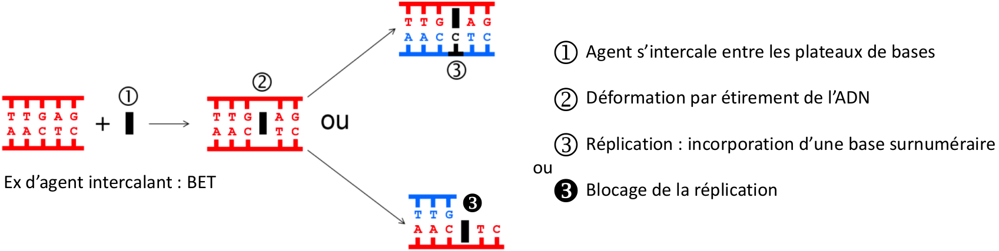

**Les rayonnement UV \(Dimère de Thymine ou Cytosine\)**  
- Les UV sont absorbés par les Thymines et Cytosines adjacent \(TT ou CC\)  
- Création de pont entre TT et CC  
- Déforme l'ADN et perturbe l'activité de l'ADN pool

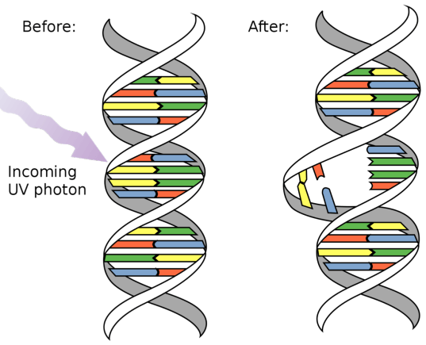

**Les radiations ionisantes \(Cassure simple et double brin\)**  
- Les rayons X et gamma sont assez énergétiques pour produire des radicaux libres \(ions possédant électrons non appariés\) chimiquement très réactifs, notamment avec l’ADN.  
- Cela entraîne des altérations ou pertes de bases, cassures simple brin \(CSB\) ou double brin \(CBD\).  
**Les radiations non ionisantes**

#### Les mutations spontanées \(Naturelle\)

**Dépurination / Démination oxydative**  
- ****Dépurination/déamination oxydative ; - Hydrolyse spontanée de la liaison N-glycosidique \(37°C\) : 10 000 purines et 500 pyrimidines / cellule / 24h = insertion d’une base aléatoire face à un site abasique  
- Déamination oxydative fréquente de la cytosine \(radicaux libres, produits du métabolisme\) : 500 bases / cellule / 24h = transition CG → TA

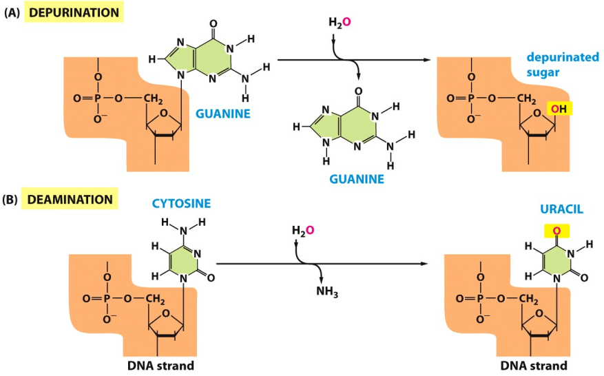

**Erreur de réplication**

* Erreurs de fidélité de l’ADN polymérase lors de la réplication \(vitesse de polymérisation : 500 b/sec\)
* Ces mésappariements engendrent des modifications de bases \(et donc de la séquence initiale\) lors de la réplication suivante.

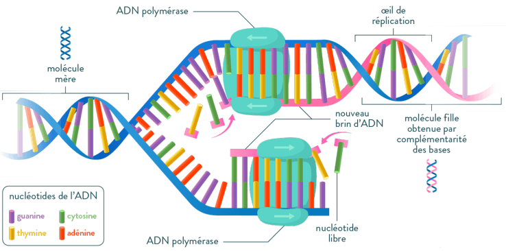

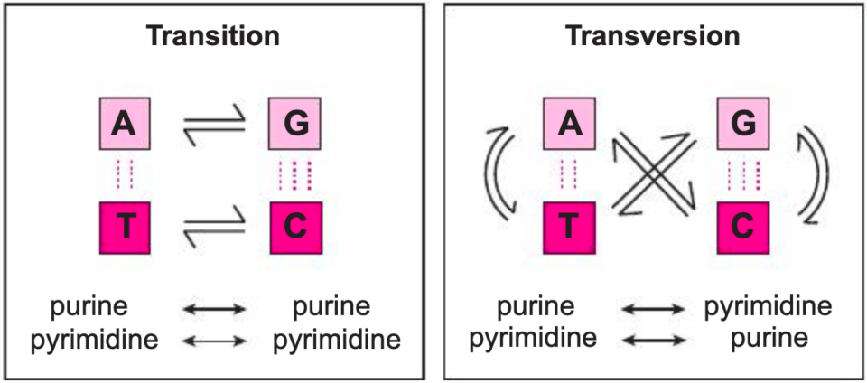

Les transitions représentent 60-70% des mutations dans le génome nucléaire animal.  
Les transitions sont deux fois plus fréquentes que les transversions dans le génome nucléaire et 20 fois plus dans le génome mitochondrial

**Taux de mutation spontanée**


La mutation est un événement **rare,** probabilité qu'il se produise une mutation dans une unité génétique \(base; gène, génome\) pendant une génération cellulaire \(cycle de division \(réplication ; mitose et méiose\)**. Car car système de réparation**


**Chez un procaryote ou un eucaryote unicellulaire**   
L’obtention d’un mutant dépendra du nombre de gène qu’il faut muter pour observer le phénotype:

* mutation d’un gène en particulier : $$10^{-8}$$
* mutation d'un gène parmi plusieurs :$$10^{-6}$$
* Mutation d'un codon particulier d'un gène particulier :$$10^{-10}$$

**Chez un eucaryote pluricellulaire :**

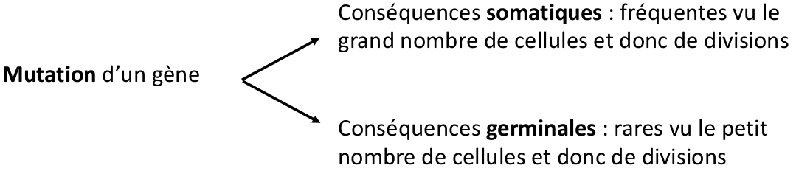


La notion de somatique et germinales n'est valables que chez les organismes pluricellulaire


## Réplication ADN

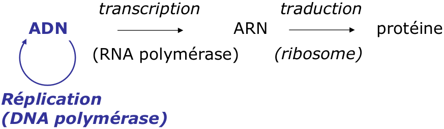

La réplication correspond à la synthèse de l’ADN, chez les Procaryotes, les Eucaryotes

### Modèle de réplication semi-conservateur


Il existe 3 types de modèles de réplication de l'ADN :   
- Modèle conservatif  
- Modèle semi-conservatif  
- Modèle dispersif


#### La réplication de l’ADN est semi-conservative

Lors de la réplication il y a un brin ADN ancien, dit parental, et un brin fils nouvellement synthétisé

#### Expérience de Meselson et Stahl

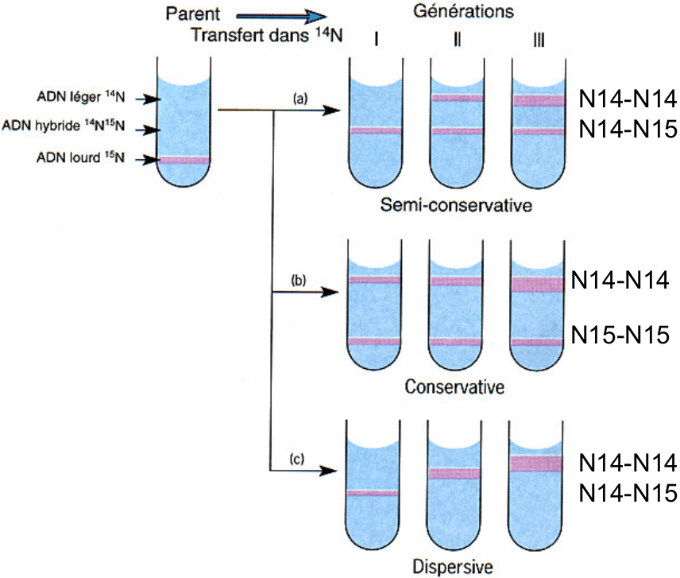

#### les chromosomes arlequins

### La machinerie de réplication de l’ADN

Les composants impliqués dans la réplication de l’ADN  
Séquences d’initiation :

* Les origines \(ori\) et les fourches de réplication

  Protéines

* Protéine initiatrice \(dnaA\)
* Hélicases \(dnaB, dnaC\)
* Topoisomérase \(gyrase\)
* Protéines SSB \(single strand binding protein\)
* Primase \(RNA pol\)
* DNA pol III
* DNA pol I
* Ligase

Les hélicases sont des enzymes qui romptent les liaisons hydrogènes et donc séparent les 2 brins d’ADN  
les protéines SSB maintiennent les deux brins d’ADN simples brins

La réplication est bidiréctionelle  
- 2 Fourches de réplication  
- Ouverture de l’ADN au niveau de l’origine de réplication \(Ori\)  
- Elongation bidirectionnelle ADN néosynthétisé  
- La réplication est terminée. On obtient 2 molécules filles circulaires

#### Les origines et fourches de réplication

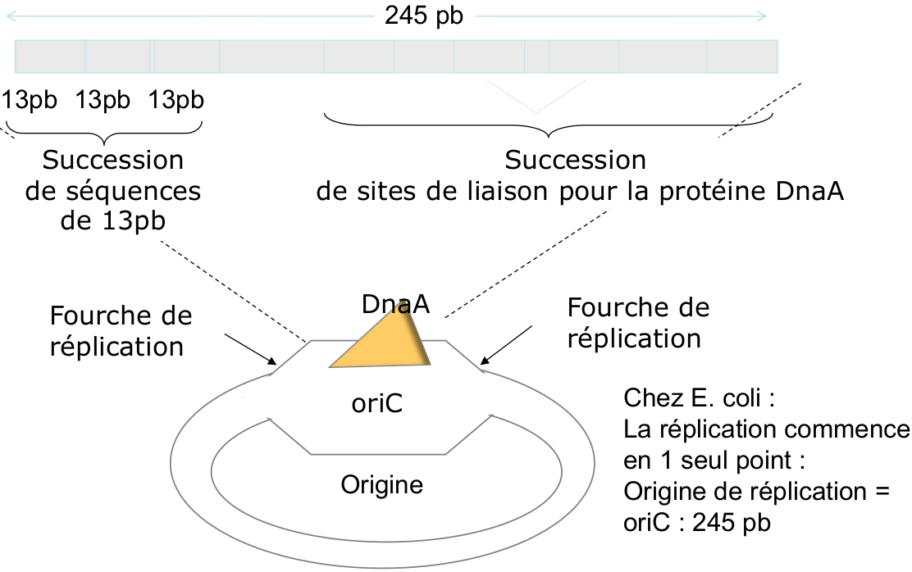

Chez les eucaryotes : plusieurs origines de réplication   
- Levure : ARS \(Autonome Replication sequence\) : environ 400 ARS  
- Drosophile : environ 1 000 séquences de réplication   
- Homme : environ 10 000 séquences de réplication \(chaque zone répliquée fait ~ 100 à 200 kb\)

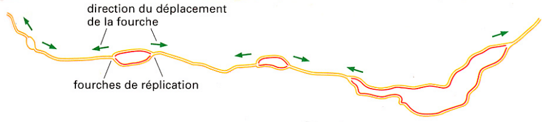

#### les topoisomérases et hélicases

Topoisomérase I : coupe 1 brin, passe un brin par-dessus l’autre et ligue   
Topoisomérase II \(gyrase\) : coupe les 2 brins, détord et ligue \(pour séparer les 2 molécules à la fin de la réplication\)

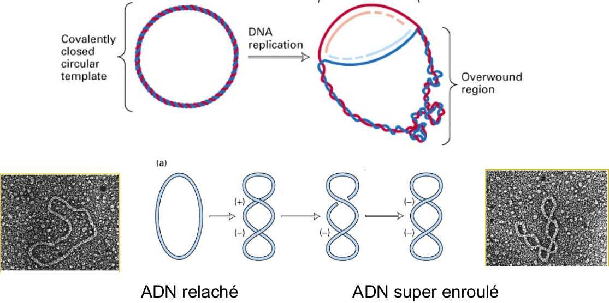

#### les ADN polymérases

Activité d'élongation et polymérisation, l'élongation à toujours lieu dans le sens 5' -&gt; 3'

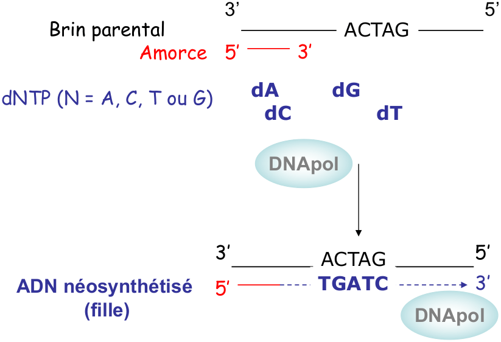

Activité exo 3’-&gt;5’  
Activité de correction 3’-&gt;5’ des erreurs de polymérisation  
Activité exo 5’-&gt;3’  
Dégrade les amorces ARN Dégrade l’ADN double brin

#### Les ADN pol chez les procaryotes 3 DNA pol : I, II et III

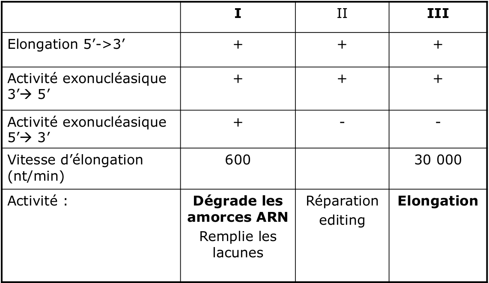

DNA pol III : gros complexe avec plus de 20 sous unités différentes

La ligase et la RNase  
Ligase : lie 2 fragments entre eux  
RNAse : dégrade les amorces d’ARN

### Le mécanisme de réplication chez les procaryotes

#### Initiation de la réplication

Le primosome = dnaA + helicases + primase

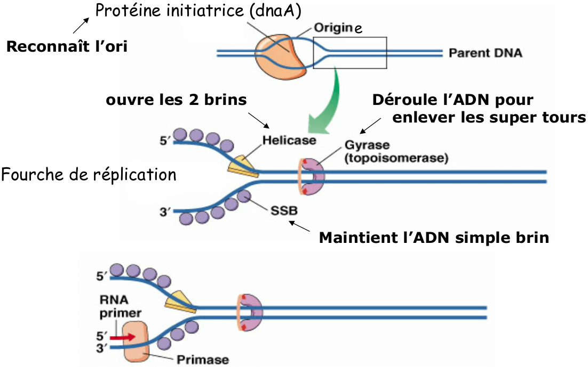

#### Elongation de la réplication

Elongation dans le sens 5’-&gt;3’ par la DNA polIII

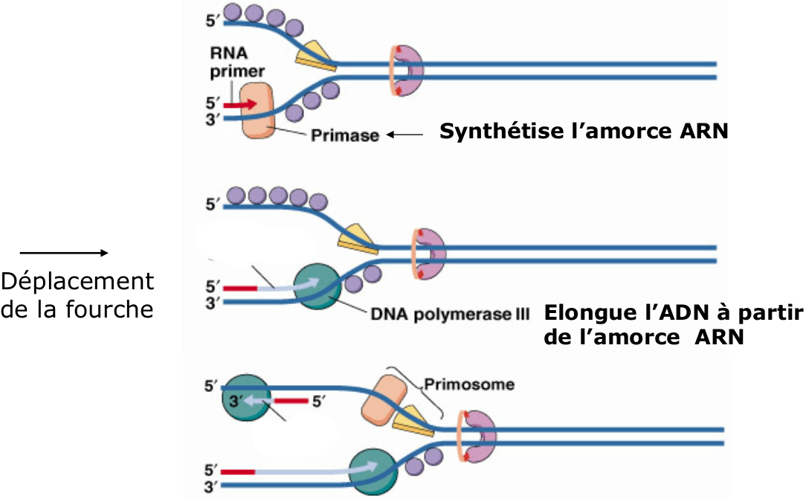

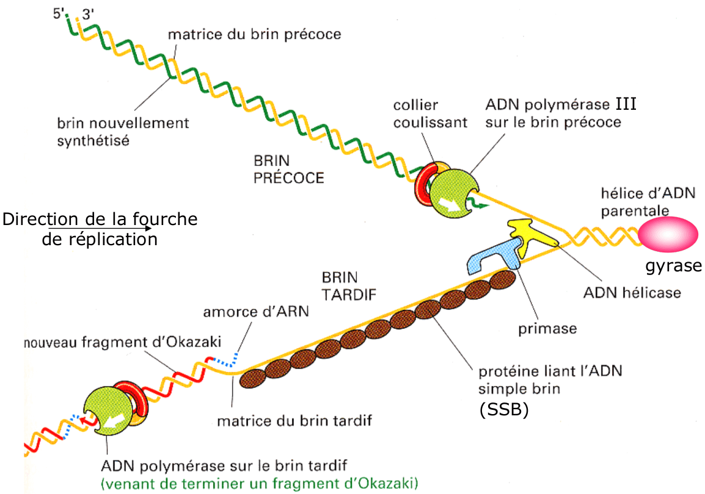

**Le brin continu, le brin discontinu, les fragments d’Okasaki**

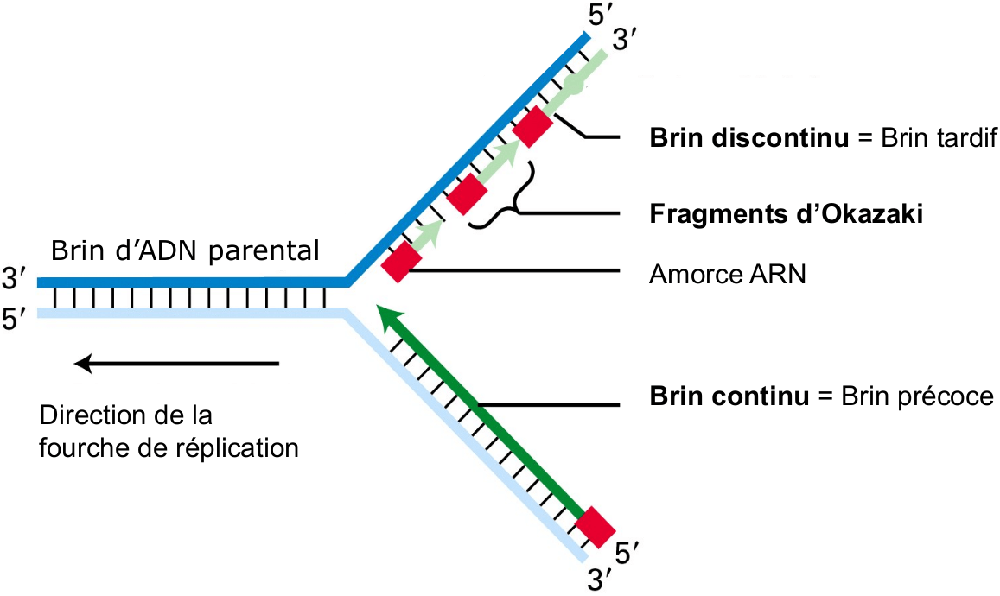

#### Terminaison de la réplication

La DNA pol I dégrade les amorces ARN et comble les lacunes La ligase colle deux fragments entre-eux

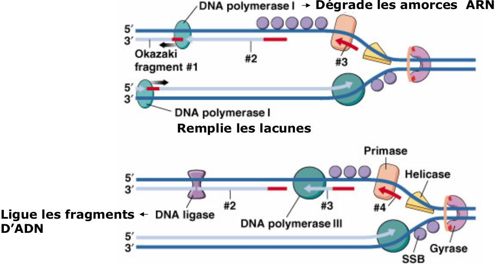

#### Récap


* La protéine initiatrice \(dnaA\) ouvre les 2 brins au niveau de l’origine de réplication 
* Les hélicases \(dnaB, C\) séparent les 2 brins 
* Les protéines SSB maintiennent l’ADNss La gyrase enlève les supertours 
* La primase synthétise l’amorce ARN 
* La DNA pol III élongue l’ADN 
* La DNA pol I \(activité RNAse H\) détruit les amorces ARN 
* La DNA pol I \(activité DNA polymérisation\) comble les lacunes laissées par les amorces
* La ligase lie les fragments d’ADN entres eux


### Autres modèles

#### Le cercle roulant

Réplication des plasmides F chez les bactéries  
Amplification des gènes d'ARNr dans les ovocyte de grenouilles

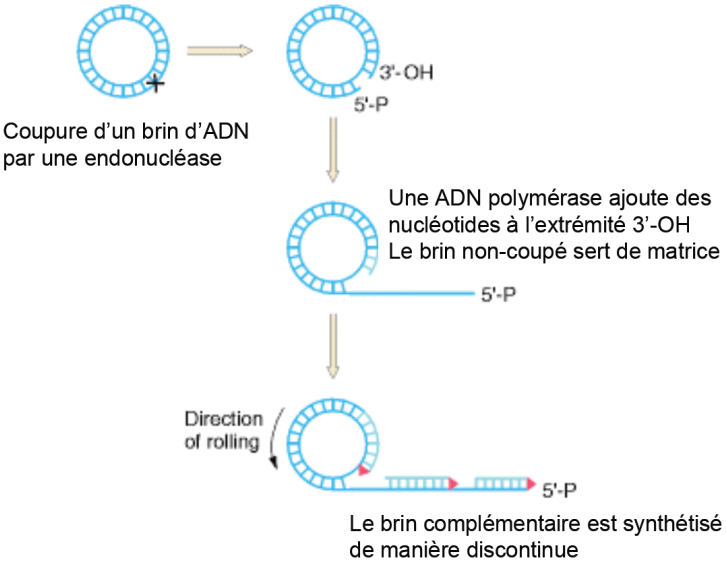

#### La transcription inverse

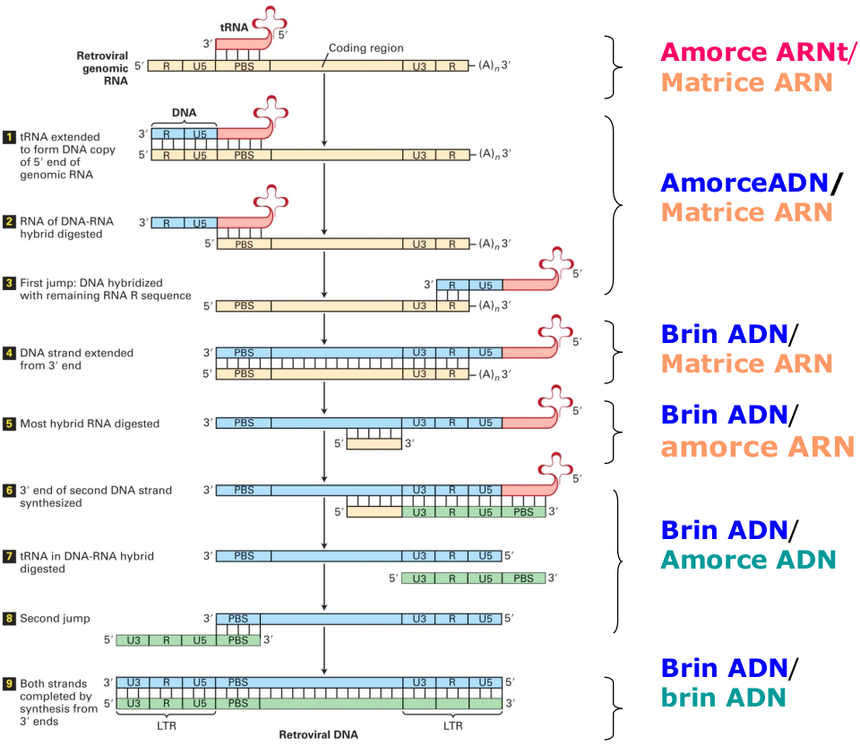

### Réplication chez les eucaryotes

#### Les ADN pol chez les eucaryotes

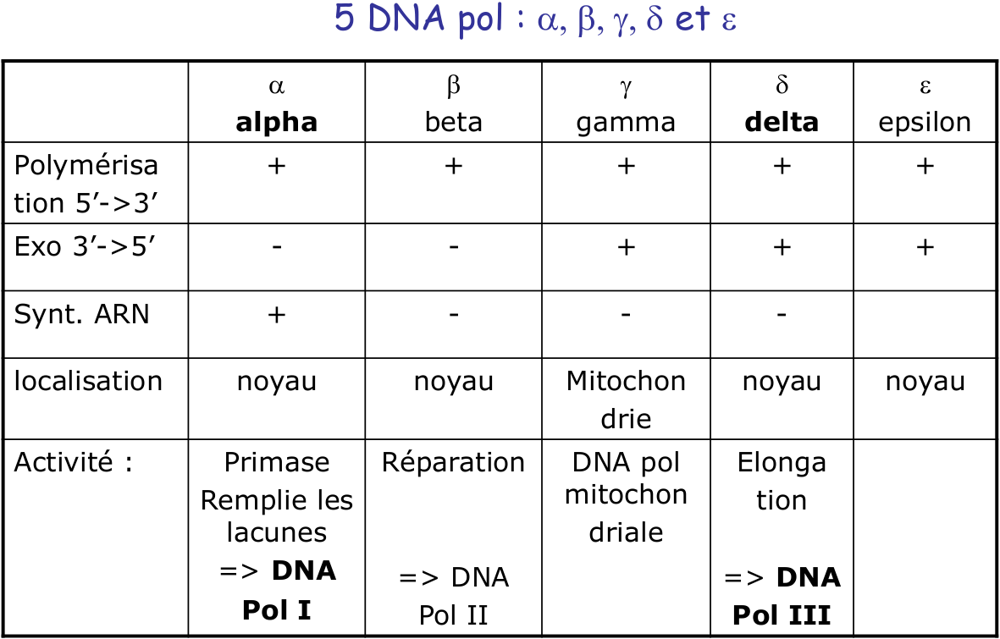

#### Modèle établi pour le virus SV40

* L’antigène Large T reconnaît l’Ori et ouvre les 2 brins d’ADN
* Les protéines RPA maintiennent l’ADN SS
* Sur le brin discontinu, la DNA pol delta \( $$\delta$$ \) élongue l’ADN à partir de l’amorce ARN
* La DNA pol alpha \( $$\alpha$$ \) grâce au facteur RFA Synthétise l’amorce ARN
* La DNA pol $$\delta$$ grâce aux facteurs PCNA et RFC élongue l’ADN à partir de l’amorce ARN

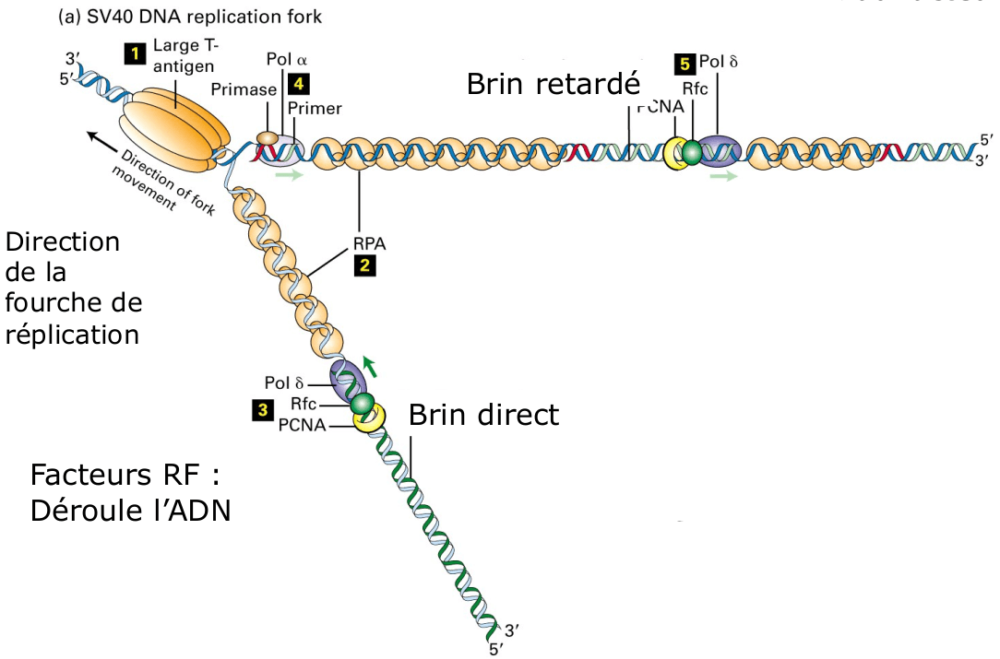

#### Le problème des extrémités chez les eucaryotes

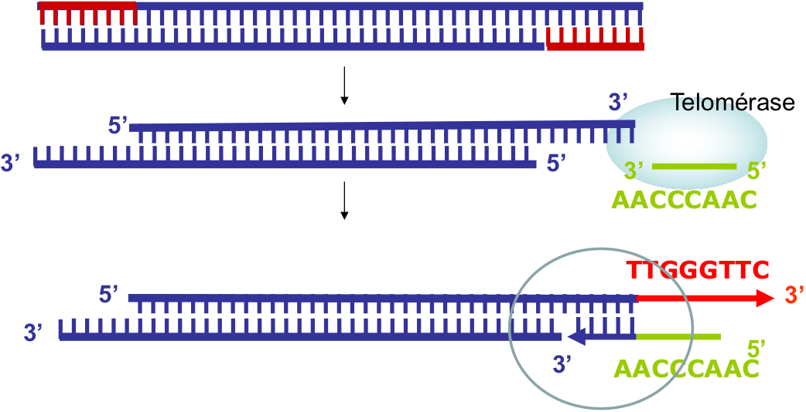

## Définition


**ADN :** Acide DésoxyriboNucléique. Polymère de désoxyribonucléotides. L'ADN est formé de deux chaines de désoxyribonucléotides antiparallèles \(double hélices\), reliées entre elles par des liaisons hydrogène entre les bases azotées : l'adénine est liée avec la thymine par deux liaisons hydrogène, la guanine à la cytosine par trois liaison hydrogène. La succession de ces paires de bases azotées est le support de l'information génétique. L'ADN se trouve dans le noyau, les mitochondries et les chloroplaste.

**Désoxyribonucléotide :** Espèce chimique constituée d'un acide phosphorique, d'un sucre en carbone 5 \(Désoxyribose\), d'une base azotée, soit purique : adénine \(A\) ou guanine \(G\), soit pyrimidique : cytosine \(C\) ou thymine \(T\)

**Désoxyribose:** Ribose qui a subi une désoxygénation réductrice du carbone 2

**ARN :** Acide ribonucléique. Polymère de ribonucléotides. Il existe des ARNpm, ARNm, ARNt, ARNr et des petits ARN \(ARNsn, ARNsno\)

**Mutation :** Modification de la séquence des nucléotides de l'ADN, ou d'une manière plus générale, toute modification héréditaire du matériel génétique. Dans un organisme pluricellulaire, seules se transmettent à la descendances les **mutation germinales**. Les **mutations somatiques** ne se transmette qu'aux cellules issues par mitose de la cellule mutée, ces cellules forment alors un clone. On distingue les mutations qui apparaissent à la suite d'erreurs de l'ADN polymérase au cours  de la réplication, des mutations qui apparaissent durant les phases G1 et G2 de l'interphase à la suite de l'action d'agents mutagènes et qui sont pas réparées.

**Homozygote :** Individu qui possède pour un même gène le même allèle sur les deux chromosome homologue de la paire

**Hétérozygote :** Individu qui possède sur chaque chromosome homologue de la même paire un allèle différent d'un même gène

**Hémizygote :** Un organisme est dit **hémizygote** pour un gène particulier si ce dernier n'est présent qu'à une seule copie \(et donc présent qu'à un seul allèle\) à un locus donné dans un organisme diploïde.

**Dominance :** Caractéristique d'un allèle d'un gène qui, **chez un hétérozygote**, masque au niveau du phénotype, l'effet d'un allèle du même gène

**Récessivité :** Caractéristique d'un allèle d'un gène qui, **chez un hétérozygote**, ne s'exprime pas dans le phénotype

**Co-dominance :** Allèle d'un gène, **présent chez un hétérozygote**, à l'origine d'un phénotype en général intermédiaire entre ceux des deux homozygote respectifs

**Gène :** Le gène est situé à un endroit bien précis du chromosome \(**locus**\) et **porte l'information génétique.**

**Génome :** Ensemble de toutes les séquence ADN d'un être vivant 

**Allèle :** Plusieurs formes d'un gène **à un locus donné**

**Locus :** Emplacement d’un gène sur le chromosome

**Ségrégation :** Processus qui produit la séparation de deux éléments

**Épistasie :** Situation dans laquelle le phénotype d'un individu dépend d'une part du génotype à un locus donné et d'autre part du génotype à un autre locus

**Haploïde :** Ce dit d'un **organisme ou d'une cellule eucaryote** qui ne possède **qu'un seul lot de chromosome homologues.** \(Les gamètes, les champignons comme les levures ou les Neurospora sont des organisme Haploïde\)

**Diploïde :** Etat d'une cellule ou d'un organisme \(diplonte\) qui possède deux lots de chromosome homologues

**Phénotype :** Caractère **héréditaire** étudié en génétique

**Génotype :** _Information **génétique**_ déterminant un phénotype

**Autosome :** N'importe quel chromosome autre que les chromosome sexuels

**Gonosome :** Appelé aussi Hétérochromosome, chromosome appartenant à une paire responsable de la détermination du sexe : XX pour la femme et XY pour l'homme.

**Pléïotropie :** Effet multiple d'un gène qui n'agit pas que sur un seul caractère phénotypique

**Multigénisme :** Aussi appelée polygénique, se dit d'un caractère du phénotype qui est déterminé par l'action de plusieurs gènes. \(Syn, Multifactoriel\)

**Zygote :**  Cellule diploïde résultant de la fusion de deux gamètes haploïdes


#### Source

[Ressource 1](http://univ.ency-education.com/uploads/1/3/1/0/13102001/genetique1an31-1genetique.pdf)

