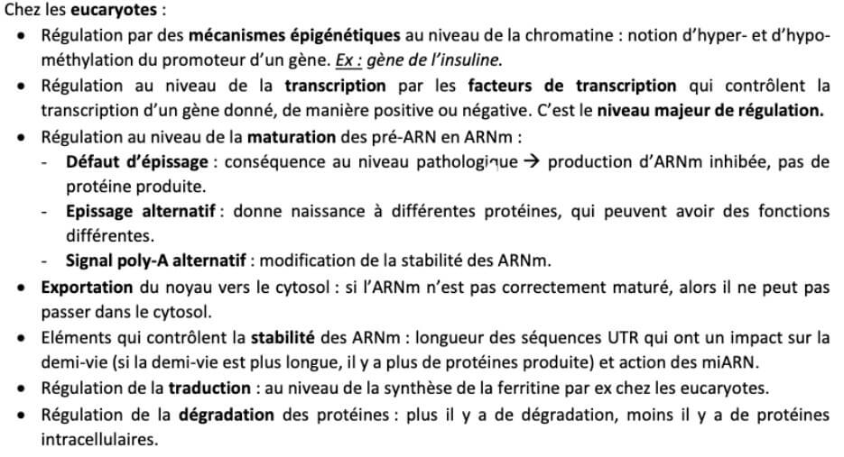
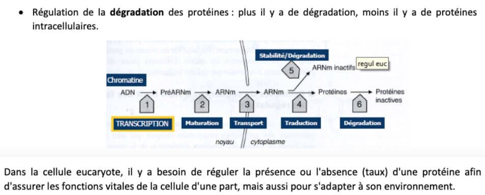

# Expression

## Régulation post-traductionnelle des gènes

Les points de contrôle sont plus nombreux chez les eucaryotes que chez les procaryotes.  
Chez les **procaryotes**, la régulation se fait au niveau de la **transcription** et de la **traduction**.

