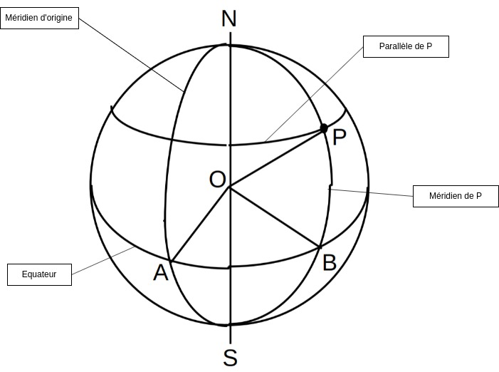
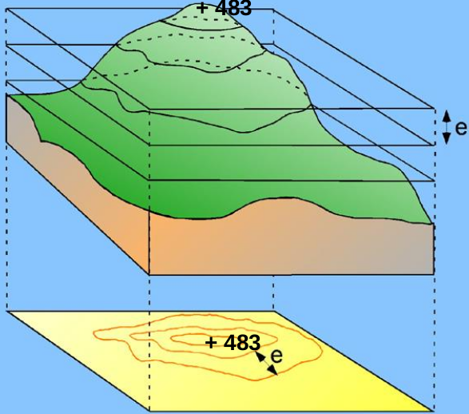
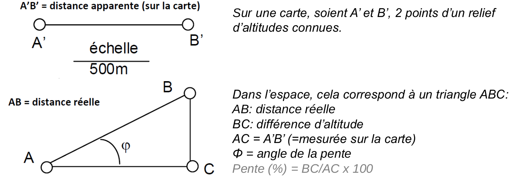
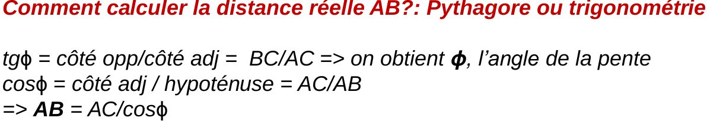
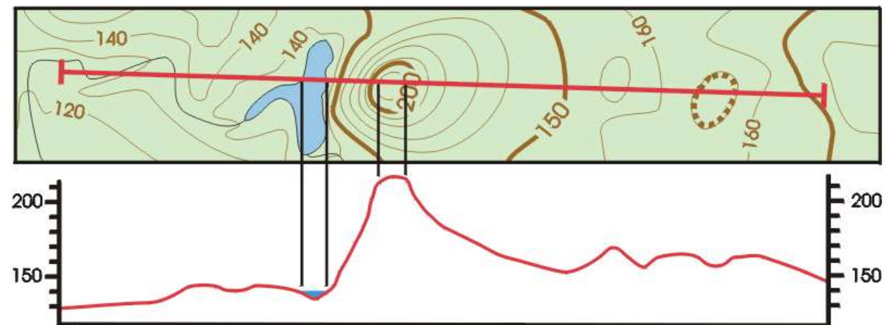
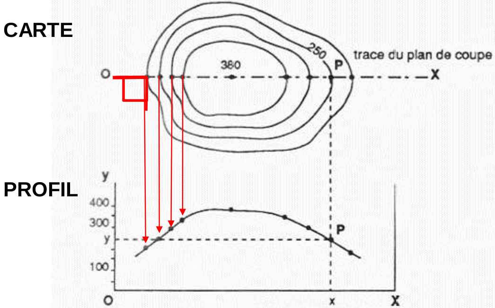
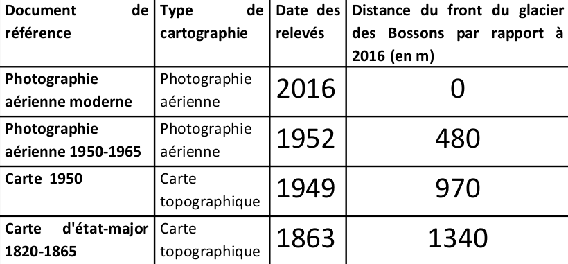
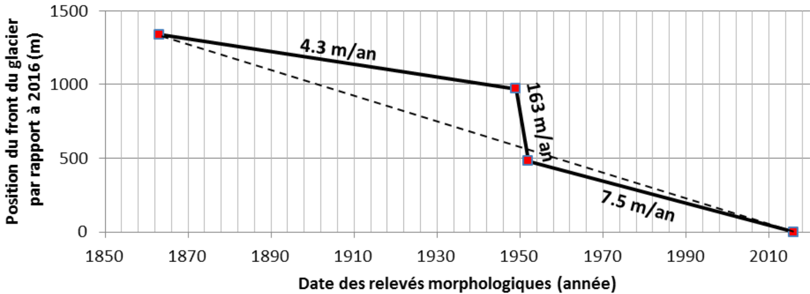
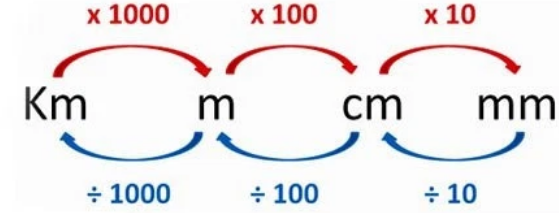
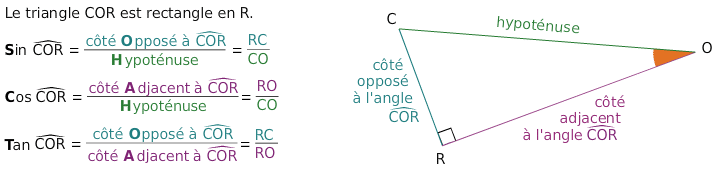

# Cartographie

## Localisation sur une carte topographique

#### Objectifs

* Lecture de carte topographique
* Mesure fontes des glaciers
* Rapport entre la 2D et la 3D

### Définitions


**Carte :** Image **réduite**, **plane** et **symbolique** d'une portion de données spatiales.


### Notion d’échelle


L'échelle d'une carte est le **rapport** entre la **longueur** d'un **objet** sur la **carte** et sa **longueur** **réelle**.  
L'échelle s'exprime sous la forme d'une fraction simple.

Exemple : Une carte est dite "1/50 000" lorsque pour 1cm sur la carte correspond à 50 000cm, soit 500m.


$$1/25000$$ est considéré comme une petite échelle  
 $$1cm$$ sur la carte est égale à $$25000cm$$ en réelle soit $$250m$$ 

$$1/1\ 000\ 000$$ est considéré comme une grande échelle  
 $$1cm$$ sur la carte est égales à $$1\ 000\ 000cm$$ en réelle soit $$10km$$ 

### Système de projection


La carte, plane, représente une portion d'un objet "globalement" sphérique, la Terre.  
On assimilera la terre au "**Géoïde**" : surface du niveau moyen au niveau des océans, forme très proche d'un ellipsoïde de révolution.  
Les dimensions de **l'ellipsoïde WGS84** utilisé sur les cartes **IGN** sont les suivantes : 

_**Rayon équatorial**_ $$a = 6378,137\ km$$ 

_**Rayon polaire**_ $$b = 6356,752 \ km$$ 

_**Aplatissement**_ $$f=(a-b)/a =1/298,257$$ 



**Géoïde :** Surface de référence qui tient compte de ses irrégularité plus précis qu'une sphère ou un ellipsoïde


Il existe plusieurs système de projection, ici on utilisera le système de projection **Universal Transverse Mercator \(UTM\) 31N.**   
Elle est **conforme**, les surfaces y gardent leur forme, mais pas leurs dimensions, et **cylindrique**.


**Une projection** est la mise en correspondance du réseau **méridiens** et **parallèles** avec un réseau **plan** à **coordonnées** **cartésiennes**.

La **France** est dans **3 fuseaux, de 30 à 32.**


### Méridien et Parallèle


**Méridien :** Ligne d'intersection entre un **plan** qui passe par les **pôles** et le **géoïde**. On définit un méridien d'origine, passant par Greenwich à Londres, arc NAS.

**Parallèle :** Ligne marquant l'intersection entre un **plan** **parallèle** au plan **équatorial** et le **géoïde**. Ce parallèle sera celui du point P s'il passe par P.

**Longitude :** C'est une coordonnée géographique représentée par une valeur angulaire, expression du positionnement est-ouest d'un point sur Terre. La longitude de référence sur Terre est le méridien de Greenwich.

**Latitude :** C'est une coordonnée géographique représentée par une valeur angulaire, expression de la position d'un point sur Terre, au nord ou au sud de l'équateur qui est le plan de référence. Lorsqu'ils sont reliés entre eux, tous les endroits de la Terre ayant une même latitude forment un cercle dont le plan est parallèle à celui de l'équateur, d'où l'autre terme « parallèle » permettant de nommer une latitude.


Pour retrouver un point on chercher sa **longitude \(Angle AOB\)** et sa **latitude \(Angle BOP\)**.


**Latitude - BOP :** de 0° à 90° en précisant Nord ou Sud. Parallèle 0 est l’équateur

**Longitude - AOB :** de 0° à 180° en précisant West ou Est. Méridien 0 est Greenwich


Les coordonnées géographiques sont traditionnellement exprimées dans le système sexagésimal, parfois noté « DMS » : degrés \( ° \) minutes \( ′ \) secondes \( ″ \). L'unité de base est le degré d'angle \(1 tour complet = 360°\), puis la minute d'angle \(1° = 60′\), puis la seconde d'angle \(1° = 3 600″\).  
Pour donner une comparaison approximative en distance de ces unités à la surface de la Terre, le périmètre de la Terre qui correspond à 360° est d'environ 40 000 km2. Plus précisément, il est de 40 075,017 km à l'équateur ; par conséquent :

* un degré représente environ 111,319 km \(à l'équateur\) 
* une minute représente environ 1,855 km \(à l'équateur\)
*  une seconde représente environ 30,92 m \(à l'équateur\).

### Coordonnée géographique d'un point


Les coordonnées géographiques sont traditionnellement exprimées dans le système sexagésimal, parfois noté « DMS » : **degrés \( ° \) minutes \( ′ \) secondes \( ″ \)**. L'unité de base est le degré d'angle \(**1 tour complet = 360°**\), puis la minute d'angle \(**1° = 60′**\), puis la seconde d'angle \(**1° = 3 600″**\).


### Coordonnée UTM d'un point


**UTM :** Universal Transverse Mercator


Les coordonnée UTM d'un point sont en Km, la projection UTM se traduit par un **quadrillage N-S et W-E** sur la cartes représentée par des **croix** dont les valeurs qui les sépare est toujours **1Km**. 

Pour trouver les coordonnées d'un point UTM il faut repérer les 4 croix qui entoure ce point et procéder à la récupération des coordonnées kilométrique du point grâce à un système d’abscisse et d’ordonnée \(X et Y\).

## Carte topographique 


Une carte topographique est une carte qui représente les **éléments naturels** \(Relier, cours d'eau, végétation...\) et **artificiels \(Anthropique\)** \(Bâtiments, route...\), le tout est **symbolisé** par des **signes** **conventionnels**.


### Représentation du relief


**Courbe de niveau :** Intersection de la surface topographique avec un plan horizontal d’altitude donnée. Elle forme une ligne d’égale altitude. Elle porte le nom de cette altitude.

**Équidistance :** **Altitude** entre **chaque** **courbe** de **niveau**

**Point coté :** Sommet ou point bas, avec altitude en m


* Pour faciliter la lecture, certaines courbes de niveaux sont **épaisse**, ont les appelle les **courbes maîtresse**
* **L’écartement** **des courbes** donne une idée de la **pente** **\(d’autant + forte que les courbes de niveau sont rapprochées les unes des autres\)**

### Mesure d'une distance et d'une pente


**Distance** **apparente** **:** distance « à vol d’oiseau » = **distance** **mesurée** **directement** **sur la carte** \(dépend de l’échelle\)

**Distance réelle :** est la distance apparente si on tient compte du relief

**Pente :** C'est l'inclinaison de la surface topographique par rapport à l’horizontale


#### Calcul distance réelle AB

## Profil topographique


**Profil topographique :** Est une vue en coupe représentant l’intersection de la surface du sol par un plan vertical


### Construction d'un profil topographique

**Méthode :** Reporter l’altitude du point d’intersection de chaque courbe de niveau le long du plan de coupe

**Echelle horizontale :** c’est **toujours** **l’échelle** de la **carte**


Suite à l'interprétation des profils topographique ont peux en en déduire plusieurs type de vallée

* Vallée en U
* Vallée en V


## Calcul de distance sur carte

Pour se faire nous avons calculé la distance de fonte d'un glacier

#### Résultat de la prise de distance

Pour visualiser la fonte des glaces nous les disposons sur un graphique


[Résultat en question 8 et 9](https://kevinrousseau80.gitbook.io/licence-svt/geoscience/evolution-et-cartographie#question-7)


## Réponse TP

#### Question 1

Sur la carte, $$4cm$$ représente $$1km$$ soit $$1cm = 0.25km = 25\ 000cm$$ on peut donc dire que l'échelle de la carte est $$1/25000$$ 

#### Question 2

Latitudes ~= 45°52,8'N  
Longitude ~= 5°24,6'E

#### Question 3 

Les coordonnées UTM sont 687100 latitude en X et 5083600 longitude en Y.  
Pour se faire X 4mm -&gt; 0.004m x 25000 = 100m et Y 2.4cm -&gt; 0.024m x 25000 = 600m

#### Question 4

Pour localiser le point B de coordonnée UTM x = 686 307 et Y = 5 083 018 il faut repérer le quadrillage qui correspond à ce point et calculer les distance entre le début du quadrillage et le point, Soit  
X : 686 307 - 686 000 = 307m / 25000 = 0.012m = 1.2cm  
Y : 5 083 018 - 5 083 000 = 18m / 25000 = 0,00072m = 0.72mm  

### Séance 3

#### Question 8

La vitesse est le rapport d'une distance sur une période, de ce fait la vitesse de retrait entre chaque mesure est : 

1. $$Année=1949-1863=86a$$ $$Distance = 1340-970=370m$$  De ce fait la vitesse de fonte de la première période est $$Vitesse = \frac{370}{86} = 4,36m/a$$ 
2. $$Vitesse = \frac {970-480}{1952-1949}=\frac {490}{3}=163m/a$$ 
3. $$Vitesse = \frac{480-0}{2016-1952} = \frac{480}{64} =7,5 m/a$$ 

#### Question 9

Pour se faire nous devons trouver la distance actuel du glacier, qui est de 1,3km soit 1300m. Ensuite nous utilisons la moyenne de la vitesse de fonte qui est   
$$Vitesse Moyenne = \frac {4,36+163+7,5}{3}=58m/a$$   
Ensuite nous faisons le rapport de la distance sur la vitesse moyenne et nous obtenons   
 $$Année = \frac{1300}{58}=22 ans$$ 

## Ressources

### Tableau de conversion des mesures principales

### Règle de trigonométrie

