# Evolution

## Théorie de l'évolution

### Histoire des premières pensée sur l'évolution

#### Antiquité

**Platon \(428 - 328 Av JC\)** instaure l'idée que chaque individus d'une espèces est une copie imparfaite d'un modèle parfait et **immuable** et appartient au **monde des idées.  
  
Aristote \(384 - 322 Av JC\)** instaure l'idée d'une hiérarchisation des espèces et de leur durée de vie, immuable. Il place en haut de sa hiérarchisation Dieu et classe les vivants ainsi que les non vivants.  
  
**Anaximandre \(610 - 545 Av JC\)** La vie est provient de l'eau et du soleil, l'homme était un poisson à la base.

#### Moyen Age

**Paracelse \(1493 - 1541\)** Dit que l'homme peut "pousser" dans une jarre grâce à du sang et du fumier de cheval, mais **son expérience n’étant pas reproductible** et donc n'est fondée sur rien. Cela entrave **la science**.  
  
**Pizoto \(\)** Le déluge est l'explication des fossiles présent sur les montagnes, utilise un fait religieux comme idée principale.  
  
**James Husher \(1586 - 1656\)** Dieux à crée la terre un dimanche 23 Octobre 4004 avant JC à midi. Cette version de la création de la terre enlève le temps profond \(La terre n'a alors que 5600 ans\)  
  
**Léonard de Vinci \(\)** Explique que la présence des fossile sur les montagne par empilement est du au fait que cette montagne était, dans les temps profond, une mer ou du moins un lieux de peuplement de ces différents fossiles.  
  
**Carl Von Linée \(\)** Créer le système de classification **Binomiale** des êtres vivants. Dans l'optique de trouver la solution à la création de dieu.  
  
**George Buffon \(\)** Remet en cause la Genèse, 1er fois que l'idée d'une évolution et donc des espèces non immuable est émise.  
  
Denis diderot, Erasmus Darwin, Jean et Pierre lois Morreaux, parlent d'évolutions du monde vivant.

#### Moitié 19é siècle marque les esprit

### Jean Baptiste Lamarck \(1744 - 1829\)

Naturaliste Français il exprime la **théorie transformiste,** publié dans philosophie Zoologique en 1809  
Il est aussi le créateur du mot **Biologie**, expliqué dans son livre "Histoire Naturelle"

#### La théorie transformiste à 4 grand principes


* Adaptation des êtres vivants à leur milieu, il n'y à **pas d'extinctions, pas de bifurcation, les espèces se transforment**
* **Ligne évolutive indépendantes**, les espèces apparues **spontanément**
* **Hérédités des caractères acquis**, sont forcément transmis à la descendance
* Tendance intrinsèque des **organismes au perfectionnement**, les organes utiles se développent et les organes inutiles s'atrophie **\(Principe d'usage et de non usage\)**


#### Exemple

Les yeux atrophiée des taupes et le long coup des girafe, apparue au fur et à mesure que celle ci souhaité atteindre des branches de plus en plus hautes.

Il émet donc que l’évolution à pour but de se perfectionner, or l'évolution n'a **aucun but**.

#### Accueil et critique

La théorie n'est pas accepté par les religieux

### Charles Darwin

Charles Darwin est un naturaliste anglais \(1809 - 1882\) qui à proposé la **théorie de l’évolution** au monde scientifique dans son livre **"L'origine des espèces" en 1859**.

C'est en **1831** que l'histoire commence durant un voyage en bateau autour de l’Amérique du sud et des **Îles Galápagos**.  
**Constituées de 45 îles**, datant de 0.7 à 5 millions d'années et se situant à environ **1000Km de l'Amérique**.  
L'inspiration de Darwin pour l’évolution des espèces viens du fait que sur ces îles, il existent des créature qui ne vivent nul part ailleurs en voici une liste.

* Tortue géante
* Iguane marin
* Pinson des Galápagos


Son interrogation vient principalement des **pinsons**, qui sur ces îles, on une diversité hors du commun, avec une **grande différences des types de becs, de nutrition.**

Il émet une **hypothèse** que **l’ancêtre commun** de ces différent pinsons est un **pinson d’Amérique.**

La multitudes de différences serai du au **manque de concurrence** sur les îles.  


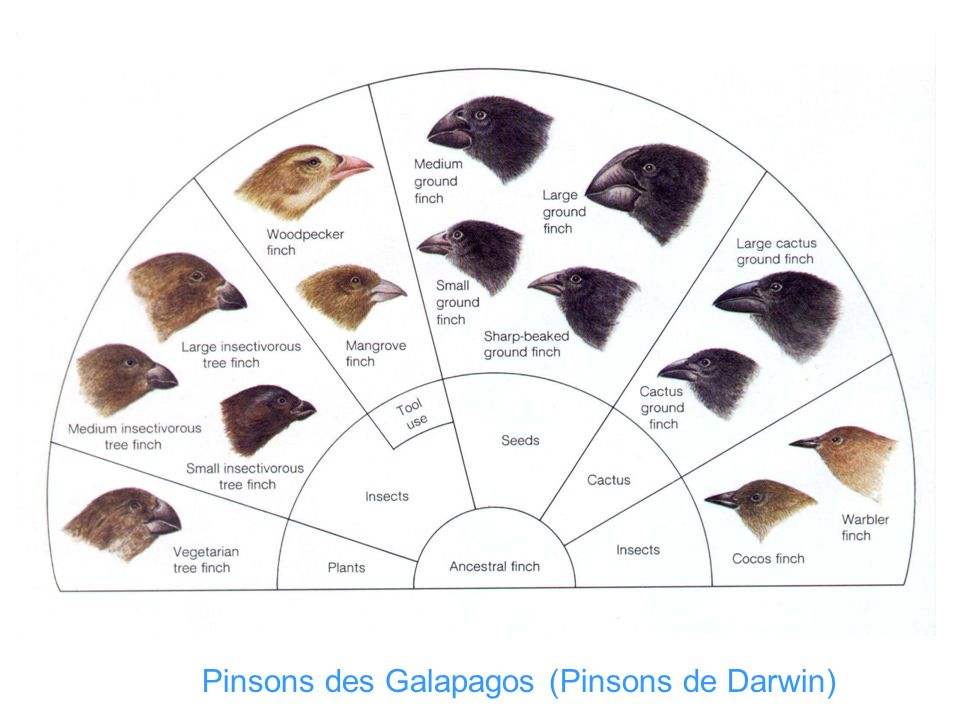


Il s’intéresse ensuite à la **sélection artificiel**, avec le tri orienté, notamment dans **l'agriculture et l'élevage canin.**

Puis il évoque pour la première le fait que tous **organisme vivant** à un **ancêtre commun**.


#### Principe de base du Darwinisme


* **Organisme** qui se **ressemblent** ont un **ancêtre commun**
* Il y a une grande **variabilité au seins des espèces**
* Les **caractères** acquis sont **héréditairement transmis au descendant**
* Le **moteur principale** de l'évolution est la _**sélection naturelle**_
* Un rôle complémentaire du à la **sélection sexuelle**


#### Sélection naturelle


* Sans limitation, une population s'accrois de façon exponentielle
* Les ressources du milieu de vie limitent l’excédant des populations
* Il y présence de compétition entres les individus d'une espèce et entre les espèces
* Seul les plus aptes à utiliser les ressources d'un milieu donné pourront survivre et se reproduire


#### Exemple Girafe

Nourriture plus rare donc il faut être plus grand pour avoir accès à plus de ressources. Les plus grands individus survivent donc plus longtemps et peuvent se reproduire et ainsi transmettre leur caractère de taille a la descendance.


Il y a donc **sélection** des plus grand individus  
**Tendance évolutive, graduelle**


#### Exemple papillon

En 1848 la forme pâle de ces papillons correspond à 98% des individus de l'espèces, cette couleur leur permet de se faire moins attraper par les prédateur, car l'écorce des boulots est blanche.  
Après 1848 et la révolution industrielle, le charbon est utilisé en grande quantité et laisse une grande quantité de particule noir dans l'environnement, la mélanique des papillons croit de manière exponentielle durant cette période.

#### Pour conclure


La sélection sexuelle, avec des attributs plus ou moins spectaculaire, attractif pour le partenaire



Les éléments déterminant de l'évolution est la compétition entre individus d'une espèces doué et variabilité, le milieux ayant rôle de sélection


C'est grâce à une lettre de Russel Wallace 1823 - 1913 envoyé à Charles Darwin en 1858, que Charles Darwin à présenté son travail avec une présentation commune de leur travaux.  
Russel Wallace a mis en place les fondement de la biogéographie, et les lignes de Wallace

#### Accueil réservé aux idées révolutionnaire de Darwin

* Gros succès librairie
* Forte opposition religieuse
* En 10 ans, sa théorie accepté par tous les philosophe et biologiste
* Le Vatican à accepté en 1996


La théorie de Charles Darwin est une révolution pour le domaine de la sciences. La philosophie, théologie et scientifique


Malgré ça, Darwin ne fournis aucune explication de la variabilité des espèces, pas de satisfaction de l'hérédité des caractères acquis.

### Gregor Mendel

Gregor Mendel \(1822-1884\) est un moine autrichien, il est à l'origine des lois de transmission des caractères par hérédité. L'information est sous forme de particules, transmise par chacun des parents

Il effectue ses expériences sur des croisements de poids. Les caractères **phénotypiques** des **parents** ne se **mélangent** **pas** chez les **descendants** \(pas de transition graduelle entre caractères parentaux\). Il existe des caractères **dominants** et des caractères **récessifs**. Ces recherches sur les hybrides végétaux \(1866\) sont restées méconnues jusqu’au début du 20ème siècle.

### Génétique

#### Hugo de Vries

Hugo de Vries \(1848-1935, botaniste néerlandais\): redécouvre les lois de l’hérédité de Mendel en 1900. Ses observations sur des plantes ornementales lui permettent de définir les **mutations** comme de **brusques transformations spontanées et héréditaires**. De Vries envisages l'existences des gènes. 

Le concept de **mutation** est proposé par **Lucien Connoté \(1856-1951\)** à partir de son travail sur les souris.

* Mutation utile
* Mutation nuisible
* Beaucoup de **mutation** **neutre**

#### William Bateson

William Bateson \(1861-1926, biologiste anglais\): Transpose les travaux de de Vries sur les animaux, il crée le terme génétique basé sur l'existence d'unités hypothétiques appelées "gènes", à partir d'une analyse formelle des produits d'un croisement de deux individus de génotype déterminé.

Bateson introduit dès 1902 la notion **d'allèle**, **d'homozygote**, et **d'hétérozygote**.  
Son collègue Johannsen \(1857 - 1927\) crée le terme et le concept opératoire de "génotype" et "phénotype", il introduit officiellement le terme gène en 1909

#### Thomas H. Morgan

Thomas H. Morgan \(1866-1945, biologiste américain\): transmission héréditaire étudiée sur des élevages de drosophiles avec une attention particulière accordée aux **mutations**. Il apporte des éléments nouveaux à la génétique


* Les gènes sont localisés dans le noyau sur les **chromosomes**
* Cela constitue le support de l'hérédité
* Des relations sont reconnues entre gènes et caractères
* 1910 Théorie de chromosomique de l'hérédité

**Mutationnisme** : **La sélection naturelle n'est pas prise en compte**. Il n'y a **pas** ici **d'orientation de l'évolution**, de **tri sous l'influence du milieu**. Les individus issue de la mutation sont **d’emblée adaptées a leur milieu** et **non soumis à la sélection**


#### Objection critique du mutationnisme

* L'étude des fossile relève des lignées évolutives
  * Transformations progressives et graduelles \(Ce qui va à l'encontre de la brutalité des mutations\)
  * Des orientations maintenues sur de longue périodes \(Ce qui va à l'encontre du caractère aléatoire des mutations\)

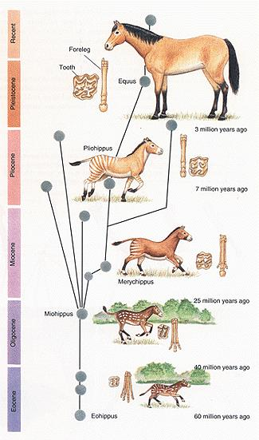

Il existe de nombreux conflits entre généticiens \(Mutationnisme\) et paléontologues \(Darwinisme\) jusqu'au année 1920, c'est l'essor de la génétique des populations qui va aider à concilier les deux tendances. Notamment grâce à 3 précurseur;    
- John B.S. Haldane \(1892-1964, biologiste anglais\) 1924 : premier modèle mathématique simple de sélection   
- Ronald A. Fischer \(1890-1962, biologiste anglais\)   
- Sewall Wright \(1889-1988, biologiste américain\)  
Haldane, Fischer et Wright situent le **problème** au niveau d’une **nouvelle** **unité** **évolutive** : la **population. Voici les différents principes**

* Un gènes peut présenter plusieurs allèles
* Certains d'entre eux favorisent l'organisme qui les portes faces à la sélection naturelle
* Les variations \(Graduelles\) peuvent être du à des facteurs mendéliens multiples


Des allèles mutants apparus **chez quelques individus** peuvent s’étendre à **l’ensemble** de la **population** s’ils confèrent un **avantage** **sélectif**, entraînant une modification **phénotypique** **graduelle** des populations. **Tout changement évolutif** réside dans les **variations** de **fréquences** **alléliques** et celles-ci sont **influencées** par **l’environnement** via la **sélection** **naturelle**.

**Mutationnisme et darwinisme se rencontrent !**


#### Théorie synthétique de l'évolution = néodarwinisme

* **Theodosius Dobzhansky** \(1900-1975, biologiste et généticien ukrainien, puis américain\): Travaux sur la variabilité et génétique des populations de coccinelles. **«Tous les phénomènes évolutifs résultent de changements dans les fréquences de gènes au sein des lignées, sous l’action de la sélection naturelle»**.
* **Ernst Mayr** \(1904-2005, ornithologue et systématicien allemand, puis américain\): Travaux sur la variabilité phénotypique des oiseaux et la spéciation.
* **George G. Simpson** \(1902-1984, paléontologue américain\): Travaux sur les mammifères fossiles. **Évolution = changement continu et lent des espèces fossiles**. **L’absence d’intermédiaires** \(les lignées sont incomplètes\) résulte du **manque d’archives paléontologiques**.


Grâce au cumul de ces travaux, la base de la théorie synthétique de l'évolution sont lancé. Voici les différent principes : 

* La **population** comme **unité** **évolutive**.
  * l’espèce, constituée de populations, manifeste une variabilité héréditaire. L’unité évolutive n’est pas le couple de géniteurs et sa descendance, mais la population.
* **Transformation** **évolutives** dues à des changements **génétiques** **aléatoire** _**Mutations**_, la _**Sexualité**_ entretenant la variabilité
* L'orientation du changement évolutif est du à la **Sélection** **Naturelle**
  * Un allèle est retenu ou éliminé en fonction de sa valeur adaptative
* L’effet amplificateur du temps: si une **mutation** **favorable** se produit en **grand** **nombre** dans une population et si elle se **répète** sur **plusieurs** **générations**, alors les **mutants** **favorisés** **envahissent** la **population** qui **évolue** naturellement vers une autre **espèce**.

**Fondamentalement Gradualiste \(Gradualisme phylétique, Simpson 1940\)**


### Modalité de la sélection naturelle

Il existe 3 modalités de base; Sélection directionnelle, sélection stabilisante, sélection diversifiante

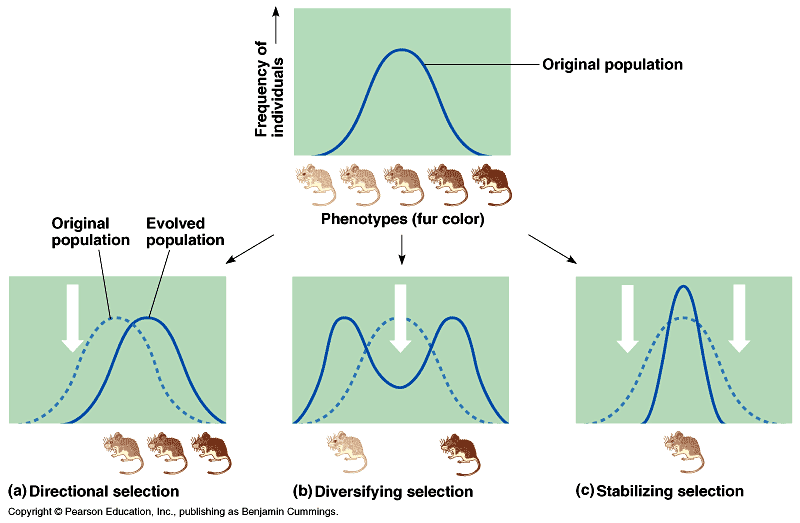

#### Sélection directionnelle

Favorise la survie de certains phénotypes par rapport à d’autres \(variation phénotypique déplacée dans la population\)

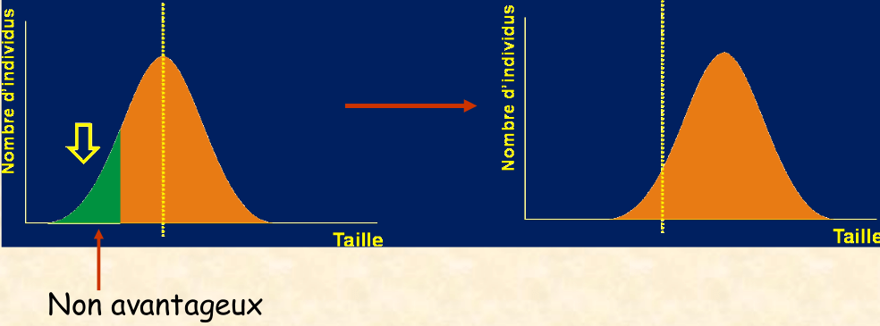

#### Sélection stabilisante

Est associée à une réduction de la variation phénotypique

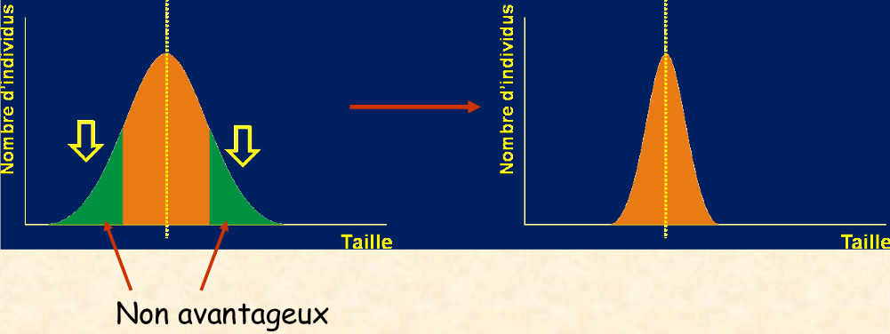

#### Sélection diversifiante

Favorise deux phénotypes au moins dans une population et augmente le niveau de variation phénotypique

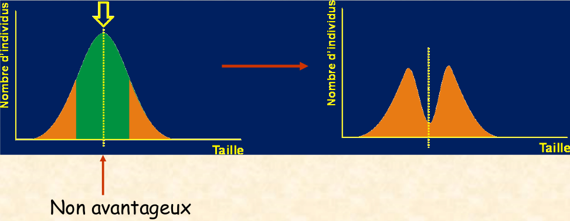

### L'état actuel de la question

* Biologie moléculaire
* Saltationnisme
* Équilibre ponctués
* Neutralisme
* Génétique du développement

#### Biologie moléculaire

**James D. Watson** \(1928- \) et **Francis H. C. Crick** \(1916-2007\) publient en 1953 leur travail décrivant la structure géométrique de l’ADN. Mais l’histoire a oublié le rôle de **Rosalind Franklin** \(1920-1958\)


L’acide désoxyribonucléique se présente sous la forme d’une double hélice. Chaque chaîne est constituée d'un squelette formé de phosphodiesters et de sucres \(ribose\) en alternance. Chaque sucre porte une «base azotée»: A \(adénine\), T \(thymine\), G \(guanine\) et C \(cytosine\). Les deux chaînes formant la double hélice sont complémentaires \(«paires de bases» A-T et G-C\).


#### Saltationnisme

Fondée par **Richard Goldschmidt** \(1878-1958\), généticien allemand, il propose une idée d’évolution discontinue par sauts morphologiques \(= saltations\), permettant le passage d’une organisation à une autre sans formes intermédiaires. Saltations déclenchées par des mutations impliquant des remaniements de grande ampleur du matériel génétique \(macromutations\). Notion de monstre prometteur. Théorie aujourd’hui abandonnée

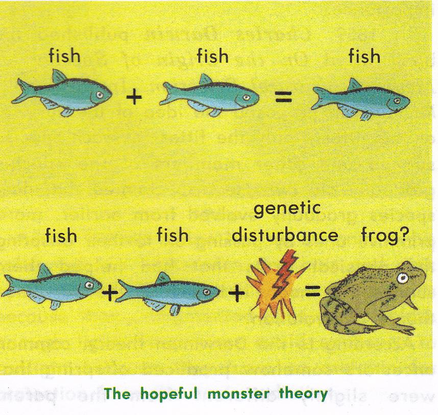

#### Équilibre ponctuée

**Niles Eldredge** \(1943 \) et **Stephen J. Gould** \(1941-2002\) \(paléontologues américains\): publient en 1972 une remise en cause du gradualisme phylétique et une «explication» des sauts évolutifs. Ils évoquent un problème, **dans le registre fossile, les formes intermédiaires manquent généralement.**

**Pourquoi ?**   
Leur explication est du au manque de sédiments  
Pour Eldredge et Gould: les intermédiaires sont très rares et la prépondérance de la spéciation allopatrique \(géographique\) va à l’encontre du gradualisme il instaure donc un modèle d'équilibre ponctué


Une fois formées par spéciation allopatrique, les espèces montrent de longues phases de stabilité morphologique \(**stases**\), suivies de brèves phases de **variation brutale** \(i.e. instantanées à l’échelle des temps géologiques\) au cours desquelles elles donnent naissance ****à de **nouvelles espèces**.


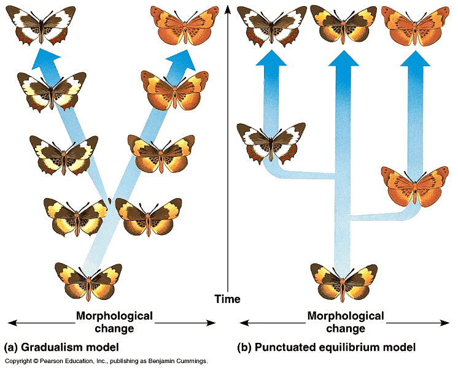

1. Un groupe réduit s’isole géographiquement d’une espèce souche
2. L’isolat montre une évolution différente de la souche \(dérive génique\), à terme, cet isolat peut conduire à une nouvelle espèce
3. La nouvelle espèce peut envahir le territoire de la population souche, qui s’éteint car moins compétitive

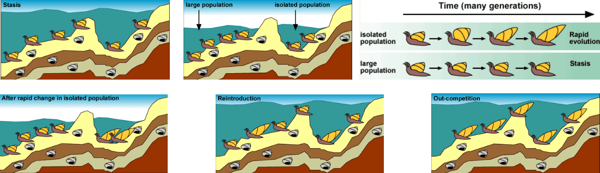

Ce modèle explique le remplacement brutal d'une espèce par une autre dans le registre fossile


Pour Eldredge et Gould, l'evolution n'est pas lente et régulière mais faite d’événement rares et complexe qui brise la stabilité et l'équilibre des espèces \("Équilibre ponctués"\). Ils ne nient pas le gradualisme, mais ils contestent l'universalité


#### Neutralisme

Motoo Kimura \(1924-1994, biochimiste japonais\):Travaille sur les enzymes et l’évolution moléculaire 1968 : Neutral Theory of Molecular Evolution. Sa théorie se compose de différent principe

* Pour une même protéine, le taux d’évolution \(= le nombre de substitutions des allèles\) est plus ou moins constant
* Les allèles sont sélectivement neutres \(ni avantageux, ni désavantageux
* Les mutations apparues se fixent au hasard: les allèles étant sélectivement neutres, les mutations ne sont pas éliminées \(mis à part les mutations létales\)
* La dérive génique est la composante majeure de l’évolution, mais comme elle conduit à l’homozygotie \(un individu est homozygote pour un gène quand il possède deux allèles identiques de ce gène\), le polymorphisme génétique est maintenu par les mutations et les migrations


Certains mutants, sans aucun avantage sélectif, peuvent se répandre dans une population selon les lois du hasard. Rôle mineur de la sélection naturelle: les mutations sont conservées ou non dans les générations successives au hasard des recombinaisons.


### A retenir !


* Antiquité - 19é siècle
  * Fixisme
  * Créationnisme
  * Génération Spontanées
* 19é siècle
  * Essai d'explication de la diversité du vivant
  * Catastrophisme \(Cuvie\)
  * Transformisme \(Lamark\)
  * Évolutionnisme \(Darwin\)
* Première moitié du 20e
  * Mutationnisme \(limite le rôle de la sélection naturelle\)
  * Théorie synthétique gradualiste
* Seconde moitié du 20e
  * Équilibre ponctués
  * Neutralisme

Aujourd’hui, l’évolution est plutôt vue comme un processus multifactoriel ayant pour matière première l’étonnante plasticité du matériel génétique \(Guillaume Lecointre, 2014\).


## Reconstructions phylogénétiques

### Définitions


**Systématique :** Science de la classification des taxons

**Phylogenèse :** Histoire évolutive d’une lignée

**Phylogénie :** Cours historique de la descendance des êtres vivants \(Haeckel, 1866\)  
La phylogénie est la science qui étudies les relations de parenté entre les êtres vivants, elle produit des reconstructions phylogénétiques.

**Taxons :** ensemble d’organismes regroupés en tant qu’unité formelle  
- Homo sapiens = taxon de rang spécifique \(unité espèce\)   
- Homo = taxon de rang générique \(unité genre\)   
- Hominidae = taxon de rang familial \(unité famille\)   
- Primate = taxon de rang ordinal \(unité ordre\)

**Taxinomie :** Science de la description des taxons et de la théorie et de la pratique de la classification. C’est l’identification des organismes et leur rangement dans une classification \(Différent de la phylogénie ! tandis que les phylogénies sont fondées sur la recherche de caractères partagés par les organismes. Les approches peuvent donc être différentes\)


### Systématique évolutionniste

On **regroupe** les organismes ayant des **caractéristiques** **communes**, **dérivées** de celle d'un **ancêtre** **commun**.  
Il n'y à pas de **méthode** **explicite** et l'approche est assez **subjective** :

* **Nature disparate des indices utilisés** \(Caractère morphologiques, distributions géographique et stratigraphique, similitude globale, similitude écologique...\)
  * **Relations phylogénétiques**
  * **Degrés de divergence entre taxons**
* Considération "**à priori**" sur les processus évolutifs \(**argument d'autorité : raisonnement circulaire**\)

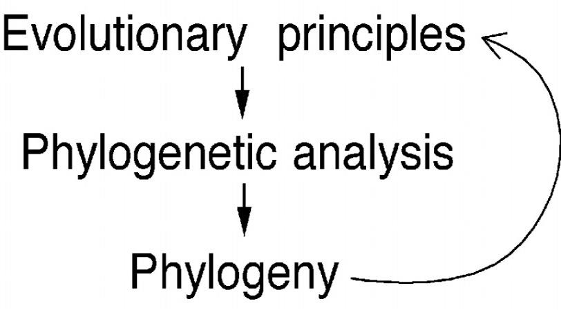

Le mode de représentation graphique est le **Phylogramme** \(C'est le schéma de relations de parenté exprimant les branchements et le degré de "divergence" associé à chaque branche \(Taxon\)

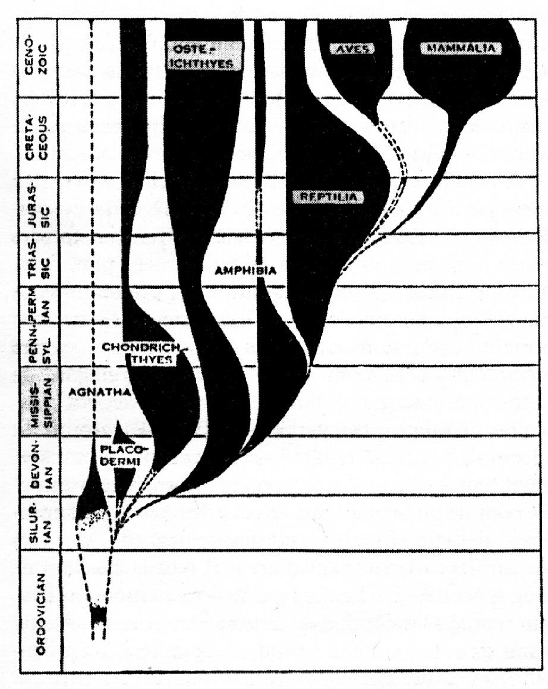

### Phénétique

Aussi appeler taxinomie numérique, est basé sur plusieurs principes

* Taxons regroupés sur la base du **degré de similitude globale** \(exprime le degré de divergence entre taxons\)
* Caractères utilisés **non polarisés** \(tous les caractères, **évolués** ou **primitifs**, sont **traités** **également**\)
* A partir de « présence » ou « absence » de caractère, ou de mesures quantitatives de caractères, on calcule un indice de similarité entre les taxons à classer.

Différences entre les caractères de 2 taxons mesurées globalement à l'aide d'une variable continue \(similitude globale\) = distance entre les taxons. Voici le protocole

1. Matrice taxons / caractères
2. Matrice de similitude globale comptabilisant les différences pour chaque couple de taxons
3. Utilisation d’algorithmes de calcul \(logiciels\) et représentation graphique
4. Le résultat est un **phénogramme**

Cette méthode permet d'avoir un taux en pourcentage de similitude.

### Cladistique

« Cladisme » ou « systématique phylogénétique » est mis en place par Willy HENNIG \(1913-1976\), entomologiste allemand, dans les année 1950. Pour lui la **systématique** se veut de refléter **strictement** la **phylogénie.** Cette méthode est utilisé sur les caractères morphologiques \(Actuel ou fossile\) et sur les caractères moléculaires \(Actuel ou sub-actuels\), Basé sur deux grand principe

* Partage des caractères dérivés
  * Seul le **partage** de caractères **évolués** permet de préciser les relations de parenté
  * Si **plusieurs** **taxons** possèdent un même caractère **évolué** \(**dérivé**\), ils l’ont **hérité d’un ancêtre commun**
  * Nécessité de **polariser** les **caractères**, avant toute analyse
* Parcimonie
  * Parmi **les arbres phylogénétiques possible** \(**cladogramme**\), seul le plus **parcimonieux** est retenu \(Celui impliquant le moins de transformation évolutives\)


Au préalable, identification des états **primitifs** \(= **plésiomorphes**\) et **dérivés** \(= **apomorphes**\) des **caractères**.

Le partage des caractères dérivés est appelé **synapomorphie**  
Le partage des caractères primitifs est appelé **symplésiomorphie**

**Seul** le partage de caractères **dérivés** \(**synapomorphies**\) permet de **préciser** les **relations** de **parenté**


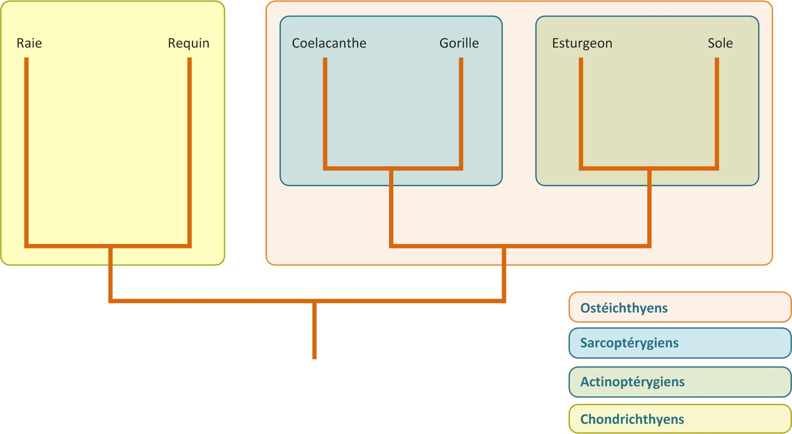

#### Polarisation des caractères

Polariser les caractères, c’est reconnaître leur état apomorphe ou plésiomorphe. On construit alors une matrice de caractères dans laquelle l’état de chaque caractère, pour chaque taxon, est codé \(généralement\) de façon binaire : 0 est le plésiomorphe et 1 l’apomorphe

#### Cladogramme 

Le cladogramme traduit des relations de **groupes-frères**

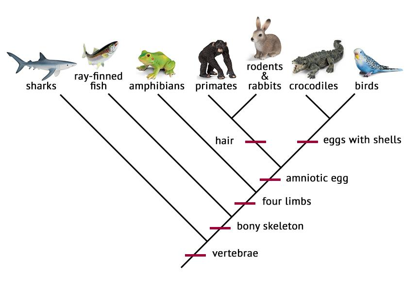

#### A retenir


* Apomorphie
  * Un caractère \(ou un état caractère\) dérivé
* Synapomorphie
  * Un caractère \(ou un état caractère\) dérivé partagé par au moins deux taxon
* Autapomorphie
  * Un caractère \(ou un état de caractère\) dérivé présent chez un seul taxon \(non informatif pour la phylogénie\)
* Plésiomorphie
  * un caractère \(ou un état de caractère\) primitif
* Symplésiomorphie
  * un caractère \(ou un état de caractère\) primitif partagé par plusieurs taxons


#### Comment "trier" les caractères

**L’homoplasie** est la similitude d’un état de caractère chez différentes espèces qui, contrairement à **l’homologie**, ne provient pas d’un ancêtre commun


Tenir compte de **l'Homologie**, éliminer ~~_**l'homoplasie**_~~


#### Homologie

**Structures homologues** \(ou organes, ou séq. d ’ADN, ou protéines...\) : structures qui **conservent**, **malgré** leurs **variations** **d’aspect**, la même **organisation fondamentale**, qui reflète l’héritage d’un ancêtre commun

Autre exemple d'homologie, avec le crane d'un homme et d'un rat

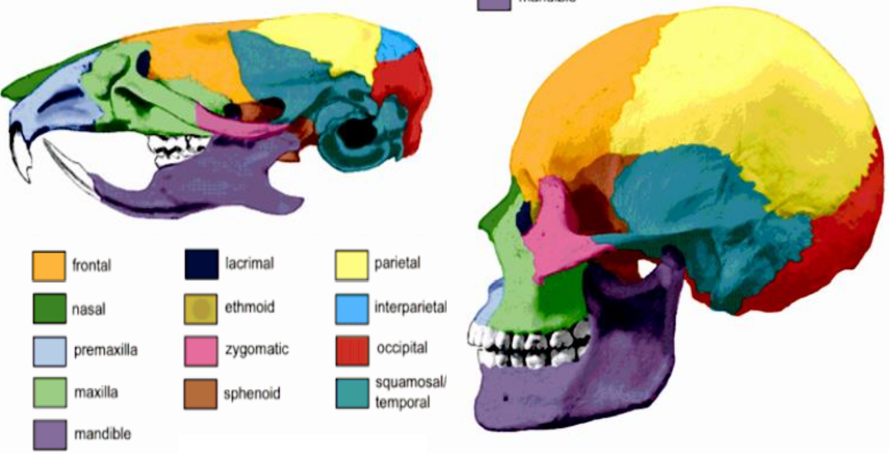

#### Homoplasie

Bien distinguer l'homoplasie et l'homologie. Qui est homoplasie tout ce qui n'est pas homologue.   
**Similitude** chez plusieurs **taxons**, de structures \(ou organes, parties d’organes, séq. d’ADN, protéines\) **ne reflétant pas l’héritage d’un ancêtre commun**.   
**Structures analogues** : structures ayant la **même fonction, sans avoir la même organisation** \(ne reflètent pas l’héritage d’un ancêtre commun\).

**Parallélisme :** **ressemblance apparue indépendamment** chez différents taxons à **partir** de la **même condition ancestrale** \(proches parents; au niveau de la famille, du genre, de l’espèce...\)

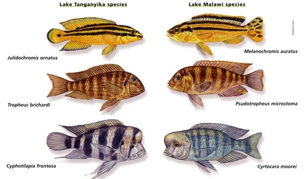

**Convergence :** **ressemblance** apparue **indépendamment** chez différents taxons à partir d’une condition **ancestrale** **différente** \(au niveau de l’Embranchement, Classe, Ordre...\)

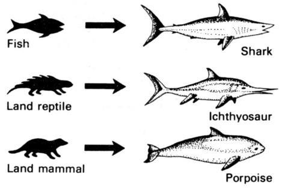

**Réversion :** l’état **évolué** \(**apomorphe**\) d’un caractère **morphologique** \(ou **moléculaire**\) **revient** à un état **primitif** \(**plésiomorphe**\).

#### Principe de parcimonie

A partir d’une même matrice : plusieurs cladogrammes possibles !

* 3 taxons : 3 possibles \(a\)
* 4 taxons : 15 possibles \(b\)
* 5 taxons : 105 possibles
* 9 taxons : + de 2 millions possibles !

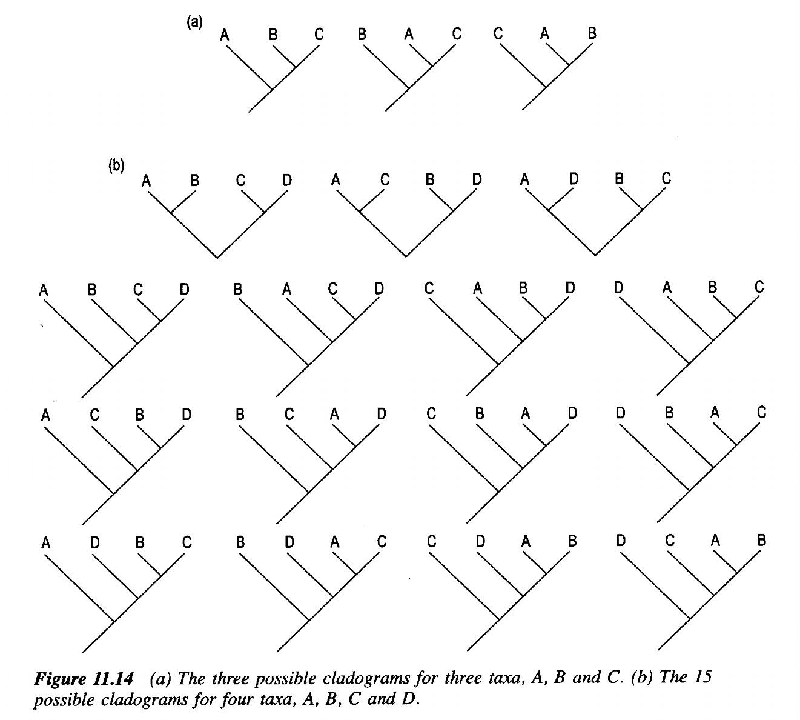


Est retenu celui qui suppose le moins de **transformations** **évolutives**, \(changements d'états des caractères\). C’est le principe de parcimonie

On **minimise** **l’homoplasie**, puisque les **changements** **d’états** des caractères sont **maintenus** à leur **minimum**


## Définitions


Mutation :

Gènes :

Allèle :

Homozygote : 

Hétérozygote :

Génotype :

Phénotype :

Facteur mendélien :

Population :

Sédiment :

Stase :

Gradualisme :

Universalité : 

Plésiomorphe :

Apomorphe : 


