# Evolution

## Théorie de l'évolution

### Histoire des premières pensée sur l'évolution

#### Antiquité

**Platon \(428 - 328 Av JC\)** instaure l'idée que chaque individus d'une espèces est une copie imparfaite d'un modèle parfait et **immuable** et appartient au **monde des idées.  
  
Aristote \(384 - 322 Av JC\)** instaure l'idée d'une hiérarchisation des espèces et de leur durée de vie, immuable. Il place en haut de sa hiérarchisation Dieu et classe les vivants ainsi que les non vivants.  
  
**Anaximandre \(610 - 545 Av JC\)** La vie est provient de l'eau et du soleil, l'homme était un poisson à la base.

#### Moyen Age

**Paracelse \(1493 - 1541\)** Dit que l'homme peut "pousser" dans une jarre grâce à du sang et du fumier de cheval, mais **son expérience n’étant pas reproductible** et donc n'est fondée sur rien. Cela entrave **la science**.  
  
**Pizoto \(\)** Le déluge est l'explication des fossiles présent sur les montagnes, utilise un fait religieux comme idée principale.  
  
**James Husher \(1586 - 1656\)** Dieux à crée la terre un dimanche 23 Octobre 4004 avant JC à midi. Cette version de la création de la terre enlève le temps profond \(La terre n'a alors que 5600 ans\)  
  
**Léonard de Vinci \(\)** Explique que la présence des fossile sur les montagne par empilement est du au fait que cette montagne était, dans les temps profond, une mer ou du moins un lieux de peuplement de ces différents fossiles.  
  
**Carl Von Linée \(\)** Créer le système de classification **Binomiale** des êtres vivants. Dans l'optique de trouver la solution à la création de dieu.  
  
**George Buffon \(\)** Remet en cause la Genèse, 1er fois que l'idée d'une évolution et donc des espèces non immuable est émise.  
  
Denis diderot, Erasmus Darwin, Jean et Pierre lois Morreaux, parlent d'évolutions du monde vivant.

#### Moitié 19é siècle marque les esprit

### Jean Baptiste Lamarck \(1744 - 1829\)

Naturaliste Français il exprime la **théorie transformiste,** publié dans philosophie Zoologique en 1809  
Il est aussi le créateur du mot **Biologie**, expliqué dans son livre "Histoire Naturelle"

#### La théorie transformiste à 4 grand principes


* Adaptation des êtres vivants à leur milieu, il n'y à **pas d'extinctions, pas de bifurcation, les espèces se transforment**
* **Ligne évolutive indépendantes**, les espèces apparues **spontanément**
* **Hérédités des caractères acquis**, sont forcément transmis à la descendance
* Tendance intrinsèque des **organismes au perfectionnement**, les organes utiles se développent et les organes inutiles s'atrophie **\(Principe d'usage et de non usage\)**


#### Exemple

Les yeux atrophiée des taupes et le long coup des girafe, apparue au fur et à mesure que celle ci souhaité atteindre des branches de plus en plus hautes.

Il émet donc que l’évolution à pour but de se perfectionner, or l'évolution n'a **aucun but**.

#### Accueil et critique

La théorie n'est pas accepté par les religieux

### Charles Darwin

Charles Darwin est un naturaliste anglais \(1809 - 1882\) qui à proposé la **théorie de l’évolution** au monde scientifique dans son livre **"L'origine des espèces" en 1859**.

C'est en **1831** que l'histoire commence durant un voyage en bateau autour de l’Amérique du sud et des **Îles Galápagos**.  
**Constituées de 45 îles**, datant de 0.7 à 5 millions d'années et se situant à environ **1000Km de l'Amérique**.  
L'inspiration de Darwin pour l’évolution des espèces viens du fait que sur ces îles, il existent des créature qui ne vivent nul part ailleurs en voici une liste.

* Tortue géante
* Iguane marin
* Pinson des Galápagos


Son interrogation vient principalement des **pinsons**, qui sur ces îles, on une diversité hors du commun, avec une **grande différences des types de becs, de nutrition.**

Il émet une **hypothèse** que **l’ancêtre commun** de ces différent pinsons est un **pinson d’Amérique.**

La multitudes de différences serai du au **manque de concurrence** sur les îles.  


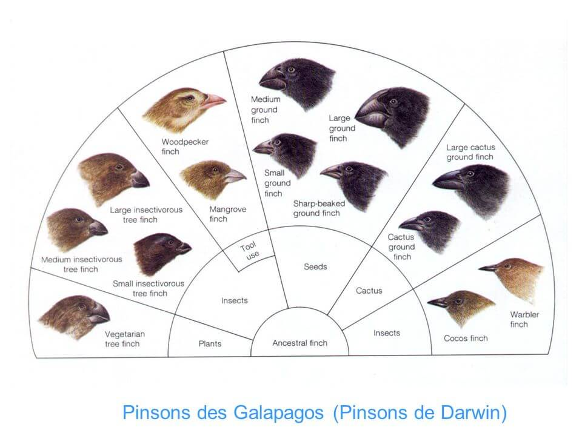


Il s’intéresse ensuite à la **sélection artificiel**, avec le tri orienté, notamment dans **l'agriculture et l'élevage canin.**

Puis il évoque pour la première le fait que tous **organisme vivant** à un **ancêtre commun**.


#### Principe de base du Darwinisme


* **Organisme** qui se **ressemblent** ont un **ancêtre commun**
* Il y a une grande **variabilité au seins des espèces**
* Les **caractères** acquis sont **héréditairement transmis au descendant**
* Le **moteur principale** de l'évolution est la _**sélection naturelle**_
* Un rôle complémentaire du à la **sélection sexuelle**


#### Sélection naturelle


* Sans limitation, une population s'accrois de façon exponentielle
* Les ressources du milieu de vie limitent l’excédant des populations
* Il y présence de compétition entres les individus d'une espèce et entre les espèces
* Seul les plus aptes à utiliser les ressources d'un milieu donné pourront survivre et se reproduire


#### Exemple Girafe

Nourriture plus rare donc il faut être plus grand pour avoir accès à plus de ressources. Les plus grands individus survivent donc plus longtemps et peuvent se reproduire et ainsi transmettre leur caractère de taille a la descendance.


Il y a donc **sélection** des plus grand individus  
**Tendance évolutive, graduelle**


#### Exemple papillon

En 1848 la forme pâle de ces papillons correspond à 98% des individus de l'espèces, cette couleur leur permet de se faire moins attraper par les prédateur, car l'écorce des boulots est blanche.  
Après 1848 et la révolution industrielle, le charbon est utilisé en grande quantité et laisse une grande quantité de particule noir dans l'environnement, la mélanique des papillons croit de manière exponentielle durant cette période.

#### Pour conclure


La sélection sexuelle, avec des attributs plus ou moins spectaculaire, attractif pour le partenaire



Les éléments déterminant de l'évolution est la compétition entre individus d'une espèces doué et variabilité, le milieux ayant rôle de sélection


C'est grâce à une lettre de Russel Wallace 1823 - 1913 envoyé à Charles Darwin en 1858, que Charles Darwin à présenté son travail avec une présentation commune de leur travaux.  
Russel Wallace a mis en place les fondement de la biogéographie, et les lignes de Wallace

#### Accueil réservé aux idées révolutionnaire de Darwin

* Gros succès librairie
* Forte opposition religieuse
* En 10 ans, sa théorie accepté par tous les philosophe et biologiste
* Le Vatican à accepté en 1996


La théorie de Charles Darwin est une révolution pour le domaine de la sciences. La philosophie, théologie et scientifique


Malgré ça, Darwin ne fournis aucune explication de la variabilité des espèces, pas de satisfaction de l'hérédité des caractères acquis.

### Gregor Mendel

Gregor Mendel \(1822-1884\) est un moine autrichien, il est à l'origine des lois de transmission des caractères par hérédité. L'information est sous forme de particules, transmise par chacun des parents

Il effectue ses expériences sur des croisements de poids. Les caractères **phénotypiques** des **parents** ne se **mélangent** **pas** chez les **descendants** \(pas de transition graduelle entre caractères parentaux\). Il existe des caractères **dominants** et des caractères **récessifs**. Ces recherches sur les hybrides végétaux \(1866\) sont restées méconnues jusqu’au début du 20ème siècle.

### Génétique

#### Hugo de Vries

Hugo de Vries \(1848-1935, botaniste néerlandais\): redécouvre les lois de l’hérédité de Mendel en 1900. Ses observations sur des plantes ornementales lui permettent de définir les **mutations** comme de **brusques transformations spontanées et héréditaires**. De Vries envisages l'existences des gènes. 

Le concept de **mutation** est proposé par **Lucien Connoté \(1856-1951\)** à partir de son travail sur les souris.

* Mutation utile
* Mutation nuisible
* Beaucoup de **mutation** **neutre**

#### William Bateson

William Bateson \(1861-1926, biologiste anglais\): Transpose les travaux de de Vries sur les animaux, il crée le terme génétique basé sur l'existence d'unités hypothétiques appelées "gènes", à partir d'une analyse formelle des produits d'un croisement de deux individus de génotype déterminé.

Bateson introduit dès 1902 la notion **d'allèle**, **d'homozygote**, et **d'hétérozygote**.  
Son collègue Johannsen \(1857 - 1927\) crée le terme et le concept opératoire de "génotype" et "phénotype", il introduit officiellement le terme gène en 1909

#### Thomas H. Morgan

Thomas H. Morgan \(1866-1945, biologiste américain\): transmission héréditaire étudiée sur des élevages de drosophiles avec une attention particulière accordée aux **mutations**. Il apporte des éléments nouveaux à la génétique


* Les gènes sont localisés dans le noyau sur les **chromosomes**
* Cela constitue le support de l'hérédité
* Des relations sont reconnues entre gènes et caractères
* 1910 Théorie de chromosomique de l'hérédité

**Mutationnisme** : **La sélection naturelle n'est pas prise en compte**. Il n'y a **pas** ici **d'orientation de l'évolution**, de **tri sous l'influence du milieu**. Les individus issue de la mutation sont **d’emblée adaptées a leur milieu** et **non soumis à la sélection**


#### Objection critique du mutationnisme

* L'étude des fossile relève des lignées évolutives
  * Transformations progressives et graduelles \(Ce qui va à l'encontre de la brutalité des mutations\)
  * Des orientations maintenues sur de longue périodes \(Ce qui va à l'encontre du caractère aléatoire des mutations\)

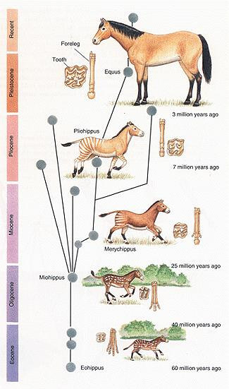

Il existe de nombreux conflits entre généticiens \(Mutationnisme\) et paléontologues \(Darwinisme\) jusqu'au année 1920, c'est l'essor de la génétique des populations qui va aider à concilier les deux tendances. Notamment grâce à 3 précurseur;    
- John B.S. Haldane \(1892-1964, biologiste anglais\) 1924 : premier modèle mathématique simple de sélection   
- Ronald A. Fischer \(1890-1962, biologiste anglais\)   
- Sewall Wright \(1889-1988, biologiste américain\)  
Haldane, Fischer et Wright situent le **problème** au niveau d’une **nouvelle** **unité** **évolutive** : la **population. Voici les différents principes**

* Un gènes peut présenter plusieurs allèles
* Certains d'entre eux favorisent l'organisme qui les portes faces à la sélection naturelle
* Les variations \(Graduelles\) peuvent être du à des facteurs mendéliens multiples


Des allèles mutants apparus **chez quelques individus** peuvent s’étendre à **l’ensemble** de la **population** s’ils confèrent un **avantage** **sélectif**, entraînant une modification **phénotypique** **graduelle** des populations. **Tout changement évolutif** réside dans les **variations** de **fréquences** **alléliques** et celles-ci sont **influencées** par **l’environnement** via la **sélection** **naturelle**.

**Mutationnisme et darwinisme se rencontrent !**


#### Théorie synthétique de l'évolution = néodarwinisme

* **Theodosius Dobzhansky** \(1900-1975, biologiste et généticien ukrainien, puis américain\): Travaux sur la variabilité et génétique des populations de coccinelles. **«Tous les phénomènes évolutifs résultent de changements dans les fréquences de gènes au sein des lignées, sous l’action de la sélection naturelle»**.
* **Ernst Mayr** \(1904-2005, ornithologue et systématicien allemand, puis américain\): Travaux sur la variabilité phénotypique des oiseaux et la spéciation.
* **George G. Simpson** \(1902-1984, paléontologue américain\): Travaux sur les mammifères fossiles. **Évolution = changement continu et lent des espèces fossiles**. **L’absence d’intermédiaires** \(les lignées sont incomplètes\) résulte du **manque d’archives paléontologiques**.


Grâce au cumul de ces travaux, la base de la théorie synthétique de l'évolution sont lancé. Voici les différent principes : 

* La **population** comme **unité** **évolutive**.
  * l’espèce, constituée de populations, manifeste une variabilité héréditaire. L’unité évolutive n’est pas le couple de géniteurs et sa descendance, mais la population.
* **Transformation** **évolutives** dues à des changements **génétiques** **aléatoire** _**Mutations**_, la _**Sexualité**_ entretenant la variabilité
* L'orientation du changement évolutif est du à la **Sélection** **Naturelle**
  * Un allèle est retenu ou éliminé en fonction de sa valeur adaptative
* L’effet amplificateur du temps: si une **mutation** **favorable** se produit en **grand** **nombre** dans une population et si elle se **répète** sur **plusieurs** **générations**, alors les **mutants** **favorisés** **envahissent** la **population** qui **évolue** naturellement vers une autre **espèce**.

**Fondamentalement Gradualiste \(Gradualisme phylétique, Simpson 1940\)**


### Modalité de la sélection naturelle

Il existe 3 modalités de base; Sélection directionnelle, sélection stabilisante, sélection diversifiante

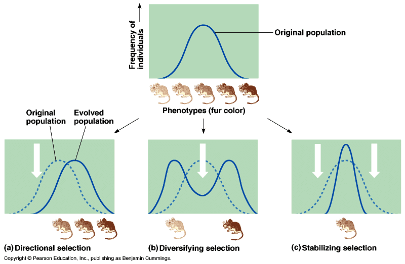

#### Sélection directionnelle

Favorise la survie de certains phénotypes par rapport à d’autres \(variation phénotypique déplacée dans la population\)

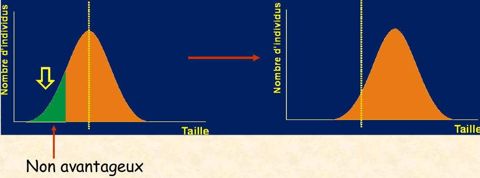

#### Sélection stabilisante

Est associée à une réduction de la variation phénotypique

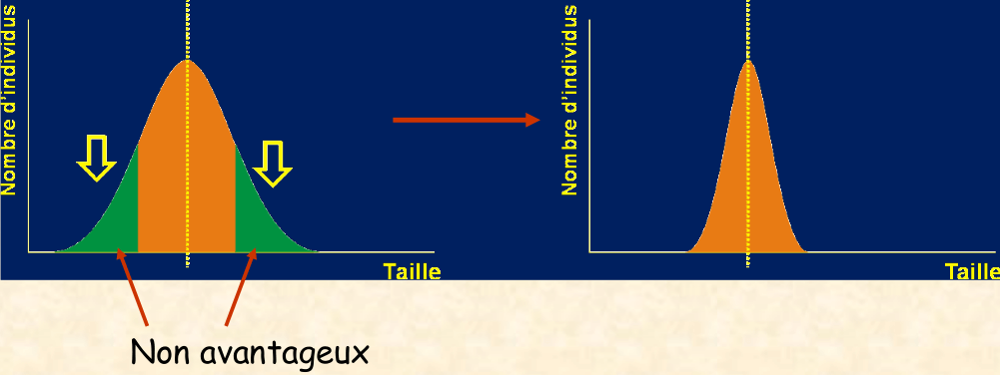

#### Sélection diversifiante

Favorise deux phénotypes au moins dans une population et augmente le niveau de variation phénotypique

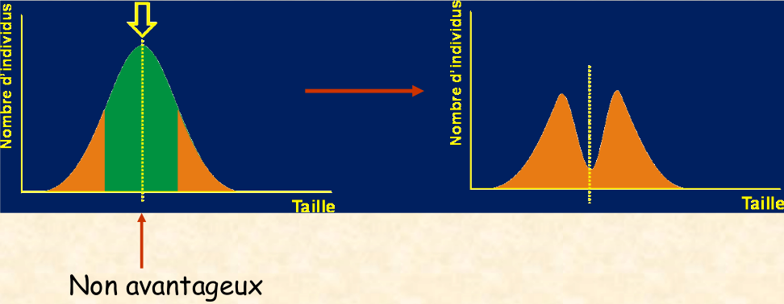

### L'état actuel de la question

* Biologie moléculaire
* Saltationnisme
* Équilibre ponctués
* Neutralisme
* Génétique du développement

#### Biologie moléculaire

**James D. Watson** \(1928- \) et **Francis H. C. Crick** \(1916-2007\) publient en 1953 leur travail décrivant la structure géométrique de l’ADN. Mais l’histoire a oublié le rôle de **Rosalind Franklin** \(1920-1958\)


L’acide désoxyribonucléique se présente sous la forme d’une double hélice. Chaque chaîne est constituée d'un squelette formé de phosphodiesters et de sucres \(ribose\) en alternance. Chaque sucre porte une «base azotée»: A \(adénine\), T \(thymine\), G \(guanine\) et C \(cytosine\). Les deux chaînes formant la double hélice sont complémentaires \(«paires de bases» A-T et G-C\).


#### Saltationnisme

Fondée par **Richard Goldschmidt** \(1878-1958\), généticien allemand, il propose une idée d’évolution discontinue par sauts morphologiques \(= saltations\), permettant le passage d’une organisation à une autre sans formes intermédiaires. Saltations déclenchées par des mutations impliquant des remaniements de grande ampleur du matériel génétique \(macromutations\). Notion de monstre prometteur. Théorie aujourd’hui abandonnée

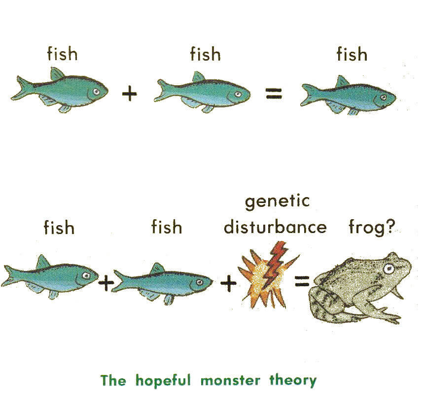

#### Équilibre ponctuée

**Niles Eldredge** \(1943 \) et **Stephen J. Gould** \(1941-2002\) \(paléontologues américains\): publient en 1972 une remise en cause du gradualisme phylétique et une «explication» des sauts évolutifs. Ils évoquent un problème, **dans le registre fossile, les formes intermédiaires manquent généralement.**

**Pourquoi ?**   
Leur explication est du au manque de sédiments  
Pour Eldredge et Gould: les intermédiaires sont très rares et la prépondérance de la spéciation allopatrique \(géographique\) va à l’encontre du gradualisme il instaure donc un modèle d'équilibre ponctué


Une fois formées par spéciation allopatrique, les espèces montrent de longues phases de stabilité morphologique \(**stases**\), suivies de brèves phases de **variation brutale** \(i.e. instantanées à l’échelle des temps géologiques\) au cours desquelles elles donnent naissance ****à de **nouvelles espèces**.


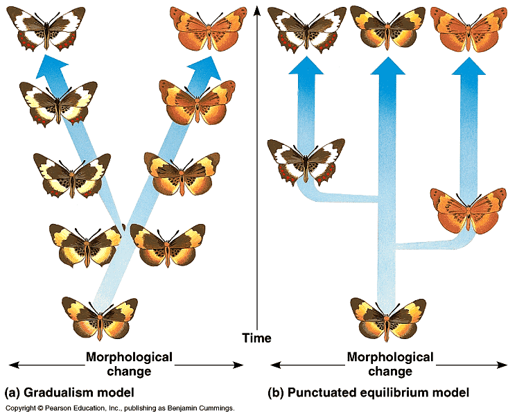

1. Un groupe réduit s’isole géographiquement d’une espèce souche
2. L’isolat montre une évolution différente de la souche \(dérive génique\), à terme, cet isolat peut conduire à une nouvelle espèce
3. La nouvelle espèce peut envahir le territoire de la population souche, qui s’éteint car moins compétitive

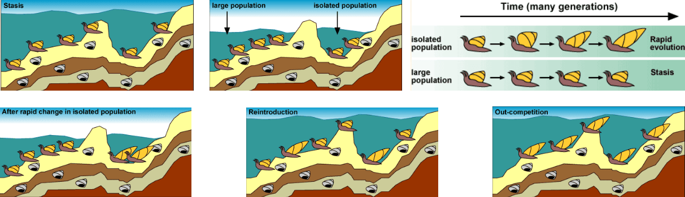

Ce modèle explique le remplacement brutal d'une espèce par une autre dans le registre fossile


Pour Eldredge et Gould, l'evolution n'est pas lente et régulière mais faite d’événement rares et complexe qui brise la stabilité et l'équilibre des espèces \("Équilibre ponctués"\). Ils ne nient pas le gradualisme, mais ils contestent l'universalité


#### Neutralisme

Motoo Kimura \(1924-1994, biochimiste japonais\):Travaille sur les enzymes et l’évolution moléculaire 1968 : Neutral Theory of Molecular Evolution. Sa théorie se compose de différent principe

* Pour une même protéine, le taux d’évolution \(= le nombre de substitutions des allèles\) est plus ou moins constant
* Les allèles sont sélectivement neutres \(ni avantageux, ni désavantageux
* Les mutations apparues se fixent au hasard: les allèles étant sélectivement neutres, les mutations ne sont pas éliminées \(mis à part les mutations létales\)
* La dérive génique est la composante majeure de l’évolution, mais comme elle conduit à l’homozygotie \(un individu est homozygote pour un gène quand il possède deux allèles identiques de ce gène\), le polymorphisme génétique est maintenu par les mutations et les migrations


Certains mutants, sans aucun avantage sélectif, peuvent se répandre dans une population selon les lois du hasard. Rôle mineur de la sélection naturelle: les mutations sont conservées ou non dans les générations successives au hasard des recombinaisons.


### A retenir !


* Antiquité - 19é siècle
  * Fixisme
  * Créationnisme
  * Génération Spontanées
* 19é siècle
  * Essai d'explication de la diversité du vivant
  * Catastrophisme \(Cuvie\)
  * Transformisme \(Lamark\)
  * Évolutionnisme \(Darwin\)
* Première moitié du 20e
  * Mutationnisme \(limite le rôle de la sélection naturelle\)
  * Théorie synthétique gradualiste
* Seconde moitié du 20e
  * Équilibre ponctués
  * Neutralisme

Aujourd’hui, l’évolution est plutôt vue comme un processus multifactoriel ayant pour matière première l’étonnante plasticité du matériel génétique \(Guillaume Lecointre, 2014\).


## Reconstructions phylogénétiques

### Définitions


**Systématique :** Science de la classification des taxons

**Phylogenèse :** Histoire évolutive d’une lignée

**Phylogénie :** Cours historique de la descendance des êtres vivants \(Haeckel, 1866\)  
La phylogénie est la science qui étudies les relations de parenté entre les êtres vivants, elle produit des reconstructions phylogénétiques.

**Taxons :** ensemble d’organismes regroupés en tant qu’unité formelle  
- Homo sapiens = taxon de rang spécifique \(unité espèce\)   
- Homo = taxon de rang générique \(unité genre\)   
- Hominidae = taxon de rang familial \(unité famille\)   
- Primate = taxon de rang ordinal \(unité ordre\)

**Taxinomie :** Science de la description des taxons et de la théorie et de la pratique de la classification. C’est l’identification des organismes et leur rangement dans une classification \(Différent de la phylogénie ! tandis que les phylogénies sont fondées sur la recherche de caractères partagés par les organismes. Les approches peuvent donc être différentes\)


### Systématique évolutionniste

On **regroupe** les organismes ayant des **caractéristiques** **communes**, **dérivées** de celle d'un **ancêtre** **commun**.  
Il n'y à pas de **méthode** **explicite** et l'approche est assez **subjective** :

* **Nature disparate des indices utilisés** \(Caractère morphologiques, distributions géographique et stratigraphique, similitude globale, similitude écologique...\)
  * **Relations phylogénétiques**
  * **Degrés de divergence entre taxons**
* Considération "**à priori**" sur les processus évolutifs \(**argument d'autorité : raisonnement circulaire**\)

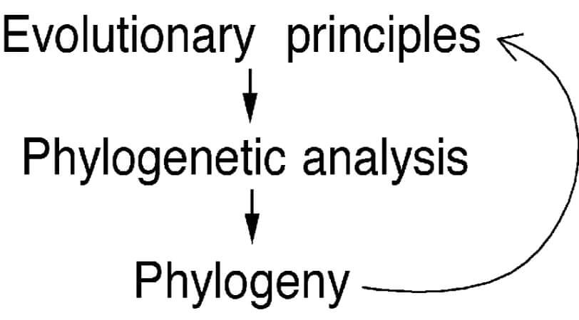

Le mode de représentation graphique est le **Phylogramme** \(C'est le schéma de relations de parenté exprimant les branchements et le degré de "divergence" associé à chaque branche \(Taxon\)

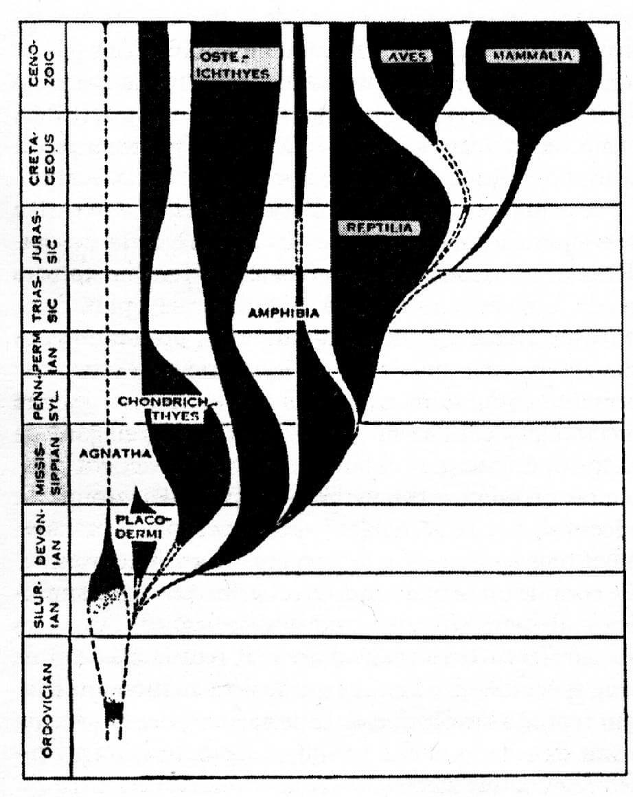

### Phénétique

Aussi appeler taxinomie numérique, est basé sur plusieurs principes

* Taxons regroupés sur la base du **degré de similitude globale** \(exprime le degré de divergence entre taxons\)
* Caractères utilisés **non polarisés** \(tous les caractères, **évolués** ou **primitifs**, sont **traités** **également**\)
* A partir de « présence » ou « absence » de caractère, ou de mesures quantitatives de caractères, on calcule un indice de similarité entre les taxons à classer.

Différences entre les caractères de 2 taxons mesurées globalement à l'aide d'une variable continue \(similitude globale\) = distance entre les taxons. Voici le protocole

1. Matrice taxons / caractères
2. Matrice de similitude globale comptabilisant les différences pour chaque couple de taxons
3. Utilisation d’algorithmes de calcul \(logiciels\) et représentation graphique
4. Le résultat est un **phénogramme**

Cette méthode permet d'avoir un taux en pourcentage de similitude.

### Cladistique

« Cladisme » ou « systématique phylogénétique » est mis en place par Willy HENNIG \(1913-1976\), entomologiste allemand, dans les année 1950. Pour lui la **systématique** se veut de refléter **strictement** la **phylogénie.** Cette méthode est utilisé sur les caractères morphologiques \(Actuel ou fossile\) et sur les caractères moléculaires \(Actuel ou sub-actuels\), Basé sur deux grand principe

* Partage des caractères dérivés
  * Seul le **partage** de caractères **évolués** permet de préciser les relations de parenté
  * Si **plusieurs** **taxons** possèdent un même caractère **évolué** \(**dérivé**\), ils l’ont **hérité d’un ancêtre commun**
  * Nécessité de **polariser** les **caractères**, avant toute analyse
* Parcimonie
  * Parmi **les arbres phylogénétiques possible** \(**cladogramme**\), seul le plus **parcimonieux** est retenu \(Celui impliquant le moins de transformation évolutives\)


Au préalable, identification des états **primitifs** \(= **plésiomorphes**\) et **dérivés** \(= **apomorphes**\) des **caractères**.

Le partage des caractères dérivés est appelé **synapomorphie**  
Le partage des caractères primitifs est appelé **symplésiomorphie**

**Seul** le partage de caractères **dérivés** \(**synapomorphies**\) permet de **préciser** les **relations** de **parenté**


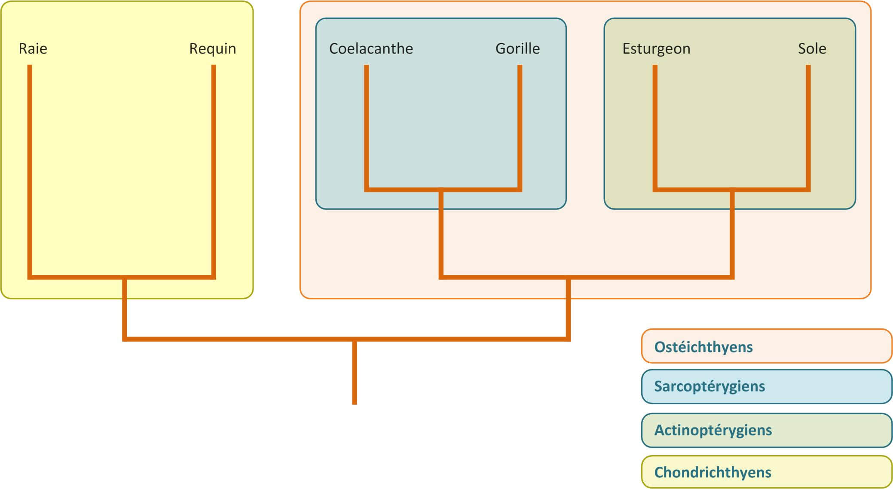

#### Polarisation des caractères

Polariser les caractères, c’est reconnaître leur état apomorphe ou plésiomorphe. On construit alors une matrice de caractères dans laquelle l’état de chaque caractère, pour chaque taxon, est codé \(généralement\) de façon binaire : 0 est le plésiomorphe et 1 l’apomorphe

#### Cladogramme 

Le cladogramme traduit des relations de **groupes-frères**

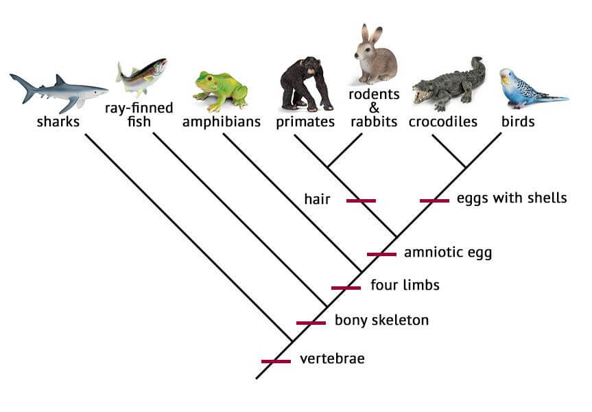

#### A retenir


* Apomorphie
  * Un caractère \(ou un état caractère\) dérivé
* Synapomorphie
  * Un caractère \(ou un état caractère\) dérivé partagé par au moins deux taxon
* Autapomorphie
  * Un caractère \(ou un état de caractère\) dérivé présent chez un seul taxon \(non informatif pour la phylogénie\)
* Plésiomorphie
  * un caractère \(ou un état de caractère\) primitif
* Symplésiomorphie
  * un caractère \(ou un état de caractère\) primitif partagé par plusieurs taxons


#### Comment "trier" les caractères

**L’homoplasie** est la similitude d’un état de caractère chez différentes espèces qui, contrairement à **l’homologie**, ne provient pas d’un ancêtre commun


Tenir compte de **l'Homologie**, éliminer ~~_**l'homoplasie**_~~


#### Homologie

**Structures homologues** \(ou organes, ou séq. d ’ADN, ou protéines...\) : structures qui **conservent**, **malgré** leurs **variations** **d’aspect**, la même **organisation fondamentale**, qui reflète l’héritage d’un ancêtre commun

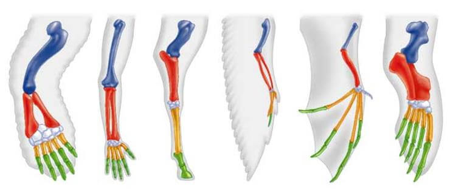

Autre exemple d'homologie, avec le crane d'un homme et d'un rat

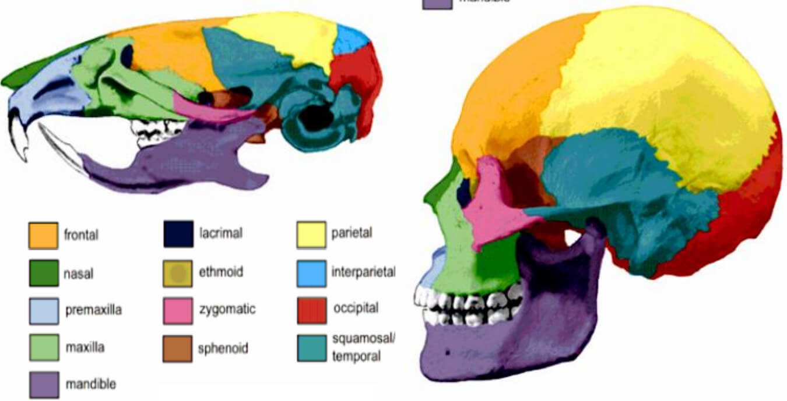

#### Homoplasie

Bien distinguer l'homoplasie et l'homologie. Qui est homoplasie tout ce qui n'est pas homologue.   
**Similitude** chez plusieurs **taxons**, de structures \(ou organes, parties d’organes, séq. d’ADN, protéines\) **ne reflétant pas l’héritage d’un ancêtre commun**.   
**Structures analogues** : structures ayant la **même fonction, sans avoir la même organisation** \(ne reflètent pas l’héritage d’un ancêtre commun\).

**Parallélisme :** **ressemblance apparue indépendamment** chez différents taxons à **partir** de la **même condition ancestrale** \(proches parents; au niveau de la famille, du genre, de l’espèce...\)

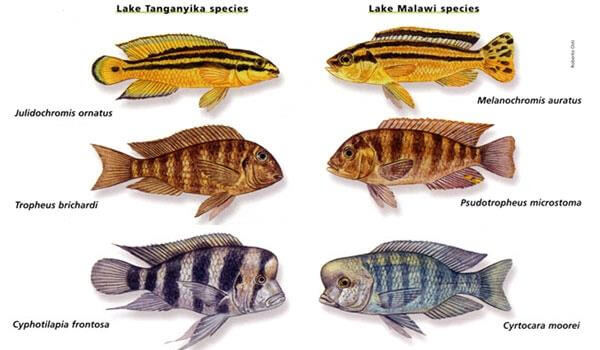

**Convergence :** **ressemblance** apparue **indépendamment** chez différents taxons à partir d’une condition **ancestrale** **différente** \(au niveau de l’Embranchement, Classe, Ordre...\)

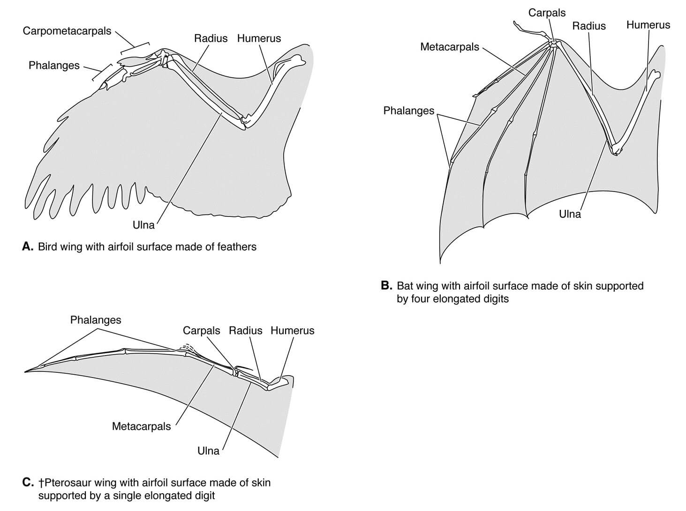

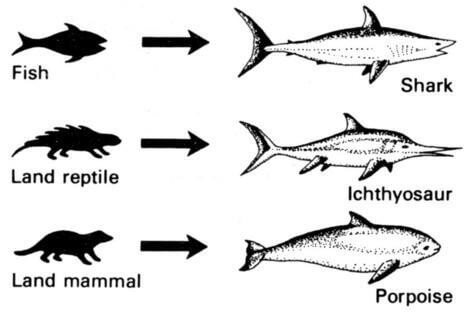

**Réversion :** l’état **évolué** \(**apomorphe**\) d’un caractère **morphologique** \(ou **moléculaire**\) **revient** à un état **primitif** \(**plésiomorphe**\).

#### Principe de parcimonie

A partir d’une même matrice : plusieurs cladogrammes possibles !

* 3 taxons : 3 possibles \(a\)
* 4 taxons : 15 possibles \(b\)
* 5 taxons : 105 possibles
* 9 taxons : + de 2 millions possibles !

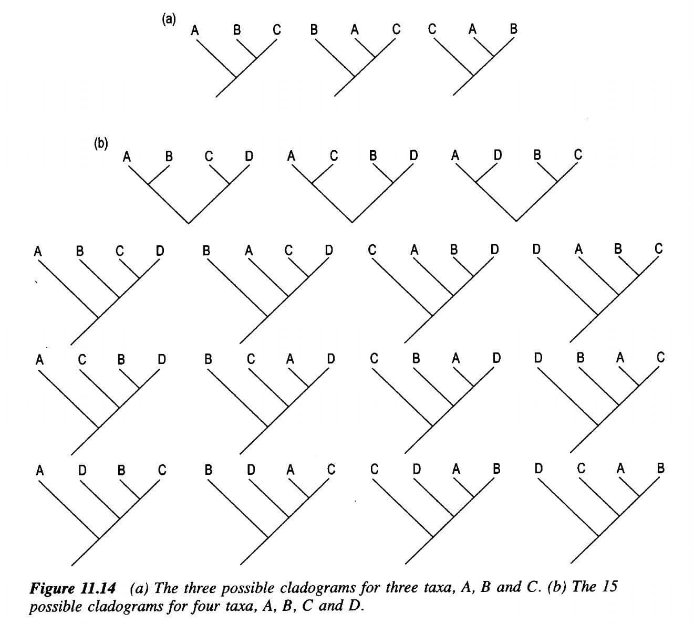


Est retenu celui qui suppose le moins de **transformations** **évolutives**, \(changements d'états des caractères\). C’est le principe de parcimonie

On **minimise** **l’homoplasie**, puisque les **changements** **d’états** des caractères sont **maintenus** à leur **minimum**


#### 3 types de grades

**Grade :** Ensemble d’êtres vivants partageant un même degré général d’organisation. Un stade de « progrès » ou de « perfection évolutive », il existe 3 type de grades


* Clade \(Le seul acceptable\) Groupe monophylétique
* Groupe paraphylétique
* Groupe polyphylétique



**Groupe** **monophylétique \(= clade\) :** groupe incluant **TOUS** les descendants Grades et clade d’un même ancêtre commun \(défini par au moins 1 synapomorphie\).


#### Pour conclure


Toute reconstitution phylogénétique est une hypothèse et un outil pour comprendre les mécanismes de l’évolution


## Développement et évolution

### Relation ontogenèse et phylogenèse

Il existe des relations étroites entre le développement individuel des organismes \(ontogenèse\) et l’histoire évolutive de la lignée \(phylogenèse\) à laquelle appartient cet organisme.


Direction moderne de recherche : **EVO-DEVO** \(Evolution and Developmental Biology\)

**Ontogenèse :** développement de l’individu, de l’œuf à l’adulte

**Phylogenèse :** histoire évolutive d’une lignée


#### Exemple

#### Mammifère


Qualification d'un mammifère, sur le plan fossile

* Neurocrâne synapside
* Mandibule = 1 seul os \(dentaire\)
* Articulation de la mâchoire inférieur entre squamosal et dentaire
* Oreille moyenne à 3 osselets \(marteau, enclume, étrier\)

En générale

* Dentition hétérodonte \(incisives, canines, prémolaires, molaires\)
* Dentition diphyodonte
* Pelage/endothermie
* Glandes lactéales
* Viviparité \(sauf Monotrèmes\)


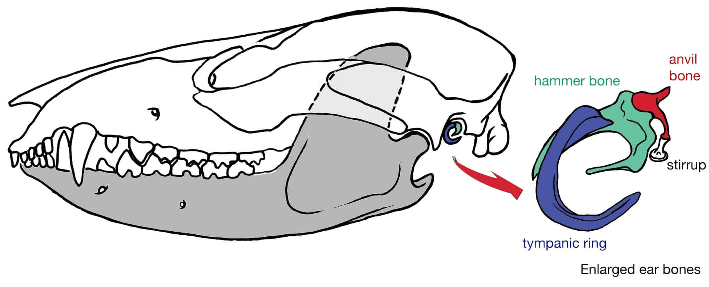

#### "Reptile"

A quoi ressemble la mâchoire et l’oreille moyenne des « reptiles » ?

* Mandibule = 4 à 6 os \(dents sur le dentaire\)
* Articulation de la mâchoire inférieure entre carré et articulaire
* Oreille moyenne: un seul os, le stapes \(étrier\)

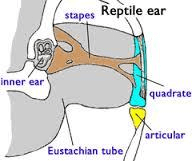

#### "Mammifère reptile"

A quoi ressemblaient la mâchoire et l’oreille moyenne des « reptiles Mammaliens » ?

* Mandibule = plusieurs os, réduits, en arrière du dentaire
* Migration du Squamosal qui se rapproche du dentaire
* Oreille moyenne : Toujours un seul os, le stapes

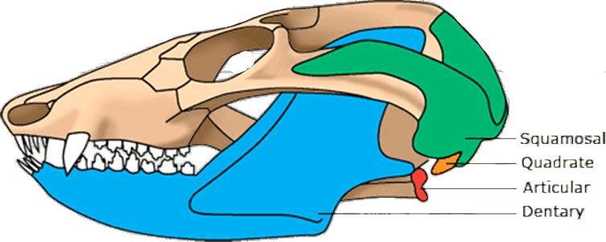


Transition Permien-Trias : des os de la mandibule « reptilienne » migrent pour constituer les pièces osseuses de l’oreille moyenne des mammifères :

* enclume dérivée du carré
* marteau dérivé de l’articulaire


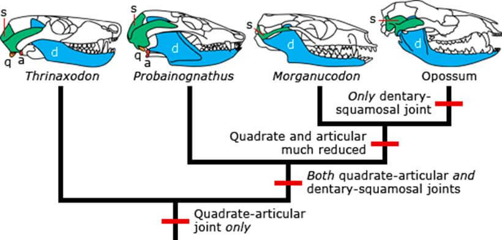



#### Ontogenèse mammifère

Observation de l’ontogenèse d’un mammifère : la sarigue \(morphogenèse de la mandibule et de l’oreille moyenne\), au cours du développement embryonnaire, les os de la mandibule « migrent » postérieurement, pour former ceux de l’oreille moyenne chez l’adulte !


Le **juvénile** du **descendant** \(la **sarigue**\), **ressemble** à **l’adulte** de son **ancêtre** \(le reptile mammalien\) : **Relation Ontogenèse - Phylogenèse**


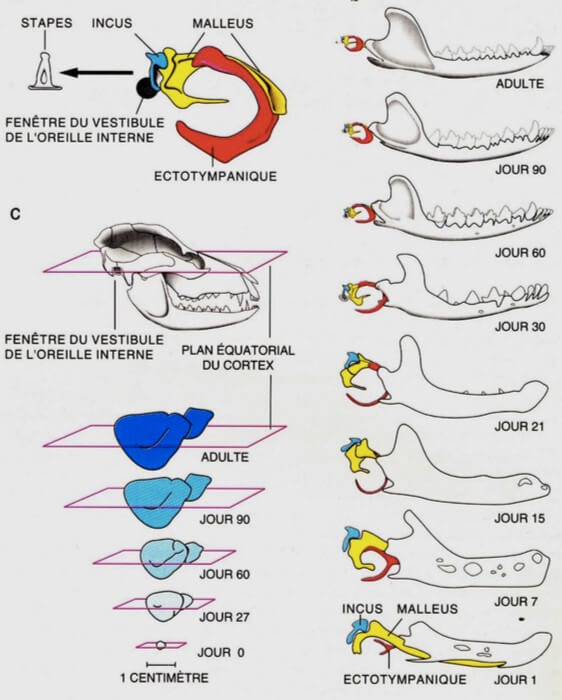

### Les lacunes de la théorie synthétique

Cependant, les contraintes développementales sont largement ignorées par la Théorie Synthétique de l’évolution \(TSE, néodarwinisme\) ! La sélection naturelle a réponse à tout et est l’unique moteur de l’évolution... Elle pilote tout !


**Mais** il y a une **incompatibilité** dans le domaine **macroévolutif** ! Comment expliquer  
 les grandes transformations à l’échelle des plans d’organisation ?

Les réponses vont venir de l'étude du développement des organismes



**Épigénétique :** L'ensemble des mécanismes moléculaires ayant lieu au niveau du génome et de la régulation de l'expression des gènes qui peuvent être influencés par l'environnement et l'histoire individuelle ainsi qu'être potentiellement transmissibles d'une génération à l'autre.


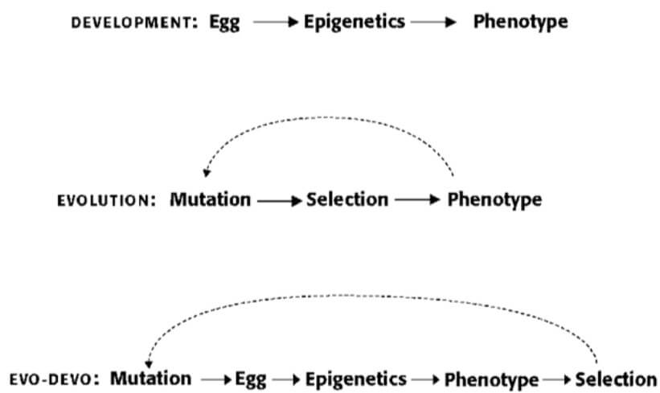

### Génétique du développement

« Le développement documente l’évolution » : validation récente dans la génétique du développement


Pour expliquer le fait que des cellules avec le même génomes créer des structure a des endroits particuliers, en 1980 la découverte de la hiérarchisation du génome et la découverte des gènes du développement


#### Hiérarchisation du génome

Les **différences** **phénotypiques** sont le résultat de **différences** **génétiques** entre les organismes qui s’expriment au travers de leur **développement**


**Gènes de structure** \(codant les protéines constitutives et les enzymes\)

* **Gènes du développement** 
  * Individualisation d’une série hiérarchisée de gènes du développement 
    * Gènes maternels: déterminent les axes de polarités de l’embryon
    * Gènes de segmentation: activés par les gènes maternels
    * **Gènes homéotiques**

Tous impliqués dans la morphogenèse en définissant l'identité et la position  
 de chacun des segments de l’organisme


#### Gènes homéotiques


**Gène homéotique :** Gène déterminant le plan d’organisation.  
 Sa mutation produit une **homéose** \(homeo en grec ancien = identique\) \(apparition d’un organe bien formé, mais mal positionné\)


#### Homéose \(Mutation homéotique\)

L’adresse des organes est mal déterminée, mais pas leur structure!

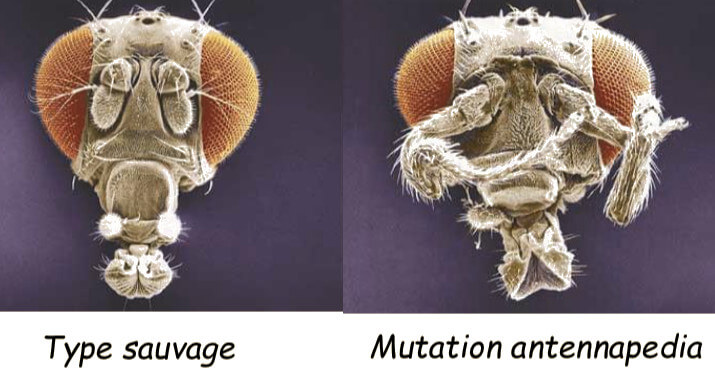

Un **gène homéotique** \(GH\) se caractérise par 1 séquence **nucléotidique** commune à tous les GH : **l'homéoboîte** qui code un **homéodomaine** capable de se lier à l’ADN. Ce dernier code un facteur de transcription qui active d’autres gènes en cascade.

#### Comment se présentent les gènes homéotiques ?


**Chez les arthropodes :** 8 gènes homéotiques \(**complexe Hom**\) déterminent l’identité de chaque segment de l’animal. Spécification des segments selon l’axe antéro-postérieur, de façon corrélée à l’ordre des 8 gènes homéotiques sur le chromosome.

**Chez les vertébrés :** Gène homéotique \(= gènes Hox\) regroupés en 4 complexes \(localisés sur 4 chromosomes différents\), déterminent la segmentation antéro-postérieure de l’embryon. \(colinéarité\)

**Règle de colinéarité :** Colinéarité de la disposition des gènes homéotiques sur le chromosome avec l'ordre des domaines d'expression dans l'embryon


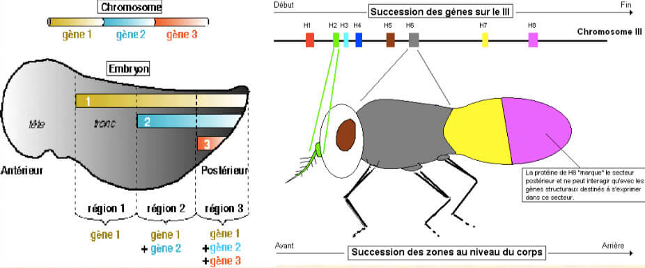

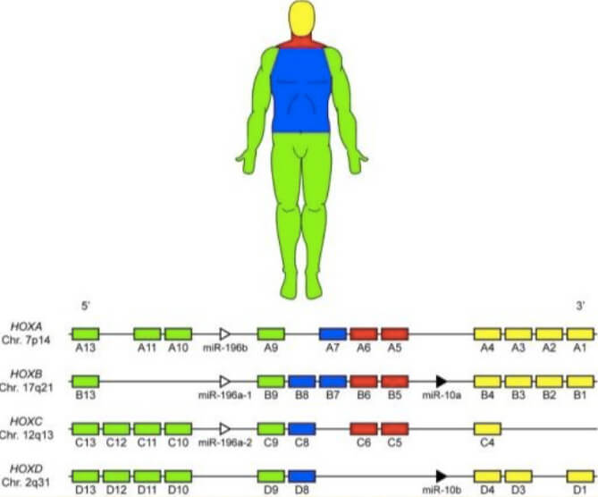

#### Quel rôle jouent les gènes homéotiques dans le développement des organismes ?


Gène homéotique d’Arthropodes, de Vertébrés, mais aussi d’Annélides, d’Echinodermes sont similaires en ce qui concerne leur structure \(séquence codante et ordre sur le chromosome\) et leur fonction \(développement selon l’axe antéro- postérieur\), les **gènes homéotiques** sont des **gènes architecte**, qui **contrôlent l'organisation architecturale** des métazoaire


#### Preuve

Modification de la séquence d’activation des gènes Hox par l’acide rétinoïque, administré à des fœtus de souris à différents stades de gestation

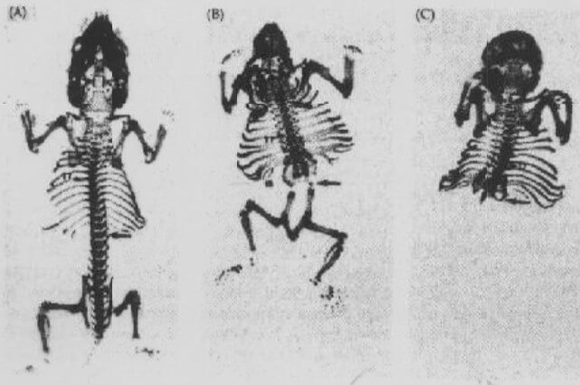


L’acide rétinoïque modifie les gènes Hox et leur **expression phénotypique**, puisque le squelette axial est modifié ! Gène homéotique est bien un gène architecte.


#### Complexe ancestral et diversité


Expériences de substitution de gènes, entre organismes différents :

* Le gène Hoxb-9 de la souris, inséré par transgenèse chez la drosophile, entraîne la transformation des antennes en pattes thoraciques.
* Le gène Small eye de la souris, inséré par transgenèse chez la drosophile, induit la construction d’yeux additionnels, sur la tête ou les pattes

Substitution fonctionnelle implique que le gène **small eye de vertébré** est **homologue du eyeless d’arthropode**!


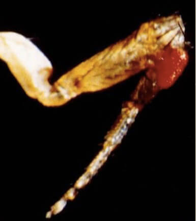


Les gènes homéotiques de vertébrés et d’arthropodes **sont homologues, ils dérivent d’un complexe ancestral commun**, dupliqué au cours de l’évolution

Les **duplications** et **délétions** **des gènes homéotiques** créent de la **diversité**


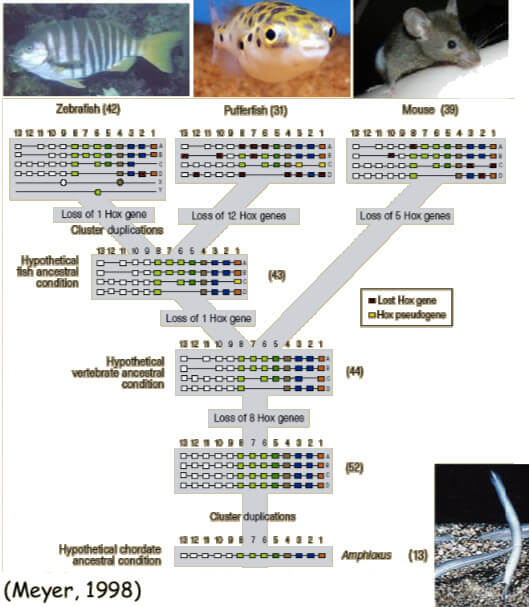

### Evolution et gènes Hox : 4 grands principes


* **Conservation :** les gènes Hox sont hautement conservés \(permet une analyse comparative du développement\)
* **Cooption :** au cours de l’évolution ils ont été cooptés et impliqués dans la formation de structures et organes totalement différents
* **Expression :** modifications du profil d’expression corrélé à des modifications morphologiques
* **Régulation :** modification de la régulation de l’expression des gènes Hox corrélée à des modifications morphologiques


#### Phylogénie des arthropodes


Les insectes ont perdu des pattes abdominales au cours de l’évolution, de ce fait est il possible de faire réapparaitre le phénotype disparu en modifiant l'expression des gènes impliqués dans le développement des pattes


Deux gènes Hom impliqués dans le développement des pattes les plus postérieur du thorax, Ubx et abd-A, l'expression de ces gènes peut être bloquée par un ARN inhibiteur.  
Le rôle de Ubx et abd-A est de réprimer l’expression d’un autre gène, distal less. Si distal less n’est pas réprimé, paires de pattes au niveau abdominal.

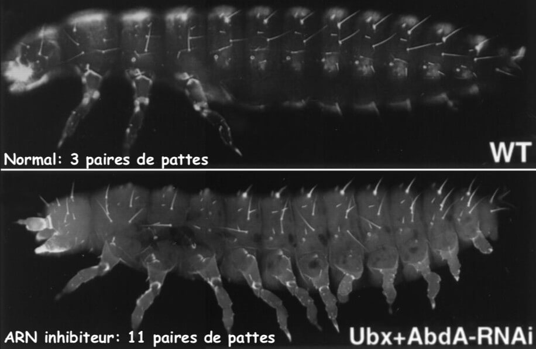

#### Exemple oiseaux

L'arbre phylogénétique qui suit est dit "adultocentrique", condition ancestrale sans palme, les palmes apparaissent à plusieurs reprises au cours de l’évolution.

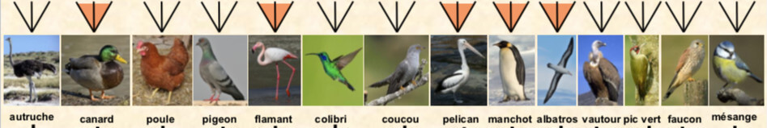

L'ontogenèse dans ce cas va montrer que la phylogénie plus le développement rend le pied palmé "condition par défaut"  à l'état embryonnaire qui perdure ou disparait à l'état adulte à plusieurs reprise au cours de l'évolution

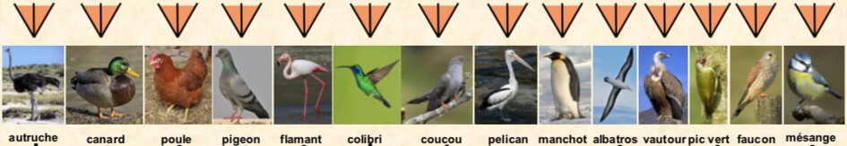

### Bricolage évolutif


**Mutation atavique :** Mutations qui font réapparaître des caractères disparus au cours de l’évolution \(mutations provoquant des dérèglements du développement\)

Les gènes induisant le développement de doigts multiples sont toujours présents chez les formes actuelles ! Il existe des mutations qui peuvent « réactiver » ces gènes

**Organes vestigiaux \(ou structures vestigiales\) :** Structures qui se présentent chez un groupe dans un état réduit et non fonctionnel par rapport à un autre groupe chez lequel elles sont fonctionnelles


#### Organes vestigiaux

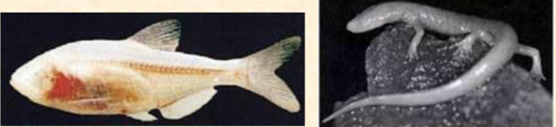

#### Chez le python


* Aucun signe de développement de membre antérieur
* Membres postérieurs vestigiaux: bassin et fémur tronqué
* Toutes les vertèbres antérieures ont des côtes, sauf l’atlas
* Corps d’un serpent : ressemble à un thorax allongé \(jusqu’à 400 paires de côtes\)



Hox-c6 et Hox-c8, sur le chromosome 15, associés au développement des vertèbres thoraciques chez les tétrapodes. Chez le python : Hox-c6 et Hox-c8 exprimés sur l’ensemble du tronc est l'expression des gènes hox consistante avec une identité thoracique

Importance de la **régulation des gènes homéotiques** dans les modifications de morphologie générale d’un organisme.


#### Exaptation


Nouvelle fonction d'un organe anciennement non fonctionnelle \(Aile des autruches qui ne servent plus à voler mais sont utilisées pour ventiler les petits\)



1. Exaptation **élément macro-évolutif marquant** \(Acquisition de plume\)
2. Fonction originelle des plume, qui est l'isolation thermique deviens un outil qui sert pour l'envol et qui garde sa fonction d'isolation thermique


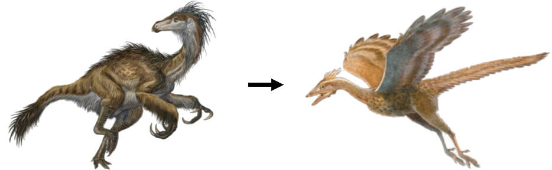

### Conclusion


* Grande unicité entre les plans d'organisation des métazoaires
* Aide à expliquer comment des transformations majeur et rapide ont pu se produire, cela permet d'expliquer l'inexplicable


## Allométrie

Concept mis en place part D'Arcy Thompson, il publie en 1917 : « On Growth and Form » ou il explique la théorie des coordonnées transformées

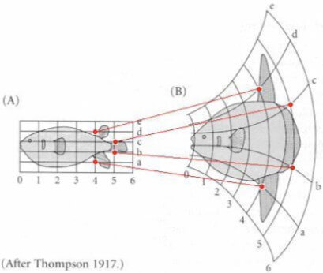


**Allométrie :** Changement de proportion associés à des changements de taille

* Allométrie positive : Organe visée grandi plus vite que le corps \(Phylogenèse\)
* Allométrie négative : Organe visée grandi peu voir diminue par rapport au corps \(Ontogenèse\)
* Isométrie : Changement de taille mais qui conserve ses proportions


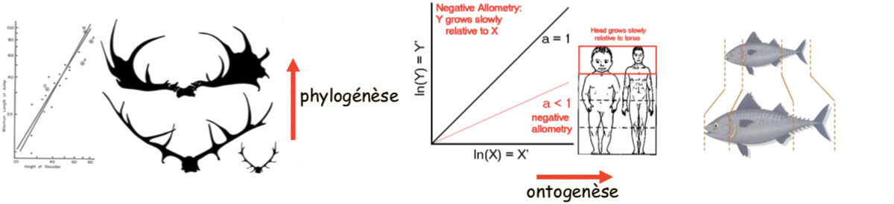

#### Allométrie ontogénétiques


* Ontogenèse de l'homme est une allométrie négative du crâne
* Ontogenèse du crabe violoniste est une allométrie positive de la pince droite
* Ontogenèse du chimpanzé allométrie positive des maxillaire et dentaire


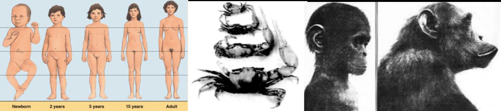

#### Allométrie phylogénétique


* Allométrie positive des canines \(première dent sur les maxillaires\) chez certains félidés
* Comment le nez \(l’évent\) de la baleine s’est retrouvé au sommet du crâne ? Nasal au sommet du crâne repoussé par le développement du pré-maxillaire ! Croissance allométrique des os pré-maxillaires a « poussée » le nasal vers le sommet du crâne ! \(spécialisation au mode de vie aquatique\)
  * chez l’embryon de Cétacé, l’évent a la position classique des mammifères terrestres \(l’ontogenèse récapitule la phylogenèse\)


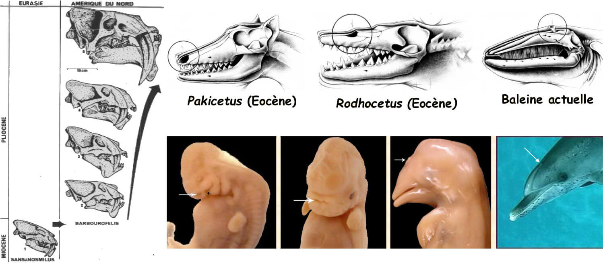

### Hétérochronie du développement

Stephen Jay GOULD \(1941-2002\) Publication de Ontogeny and Phylogeny \(1977\), Système rigoureux d’analyse des décalages entre ontogenèses et de leurs implications en termes évolutifs, c'est hétérochronies du développement


L'hétérochronie est toujours un rapport entre deux espèces !



**Hétérochronies du développement** sont des altérations de la chronologie des étapes du développement d’un organisme **par rapport à celui d’un autre pris comme référence.** Cela concerne. Se manifestent de façon évidente dans les **cas d’allométries de croissance**

* La **durée du développement** \(progenèse et hypermorphose\)
* Le **rythme du développement** \(néoténie et accélération\)


#### Exemple hétérochronie chat et chien


Pourquoi les races de chiens diffèrent-elles fortement les unes des autres, et celles de chats peu ?

* Chiens : fortes allométries de croissance dans le développement des os crâniens \(ex: maxillaire\)
* Chats : croissance ±isométrique de tous les os crâniens.


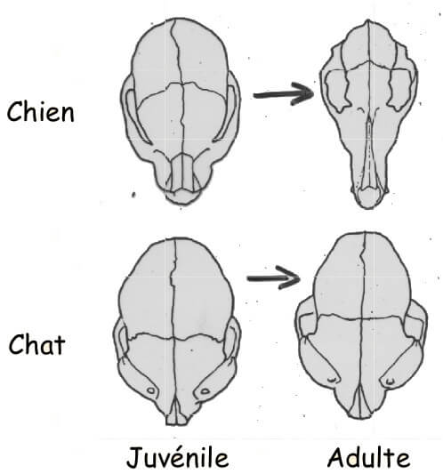

### Les paedomorphoses


Paedomorphoses : assurent la persistance, chez l’adulte, de caractères juvéniles



Il existe deux type fondamentaux de paedomorphose

**Progenèse :** affecte la durée du développement = apparition précoce de la maturité sexuelle **\(blocage de la croissance\)**. les adultes progénétiques ont une morphologie et une taille de juvéniles

**Néotenie :** affecte le rythme du développement est donc le ralentissement du développement de l’organisme **\(taille et maturité sexuelles non modifiées\)**. les adultes néoténiques ont une taille normale mais conservent des caractères juvéniles


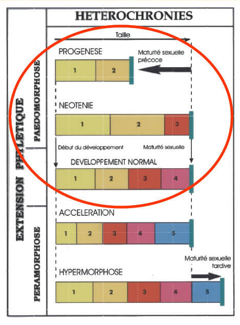

#### Exemple néoténie

Exemple de néoténie : Axolotl des lacs froids du Mexique. Axolotl est amphibien strictement aquatique, resté au stade larvaire, mais qui se reproduit !  
Expérimentalement : possible \(injection d’hormone thyroïdienne de croissance\) de provoquer la métamorphose !

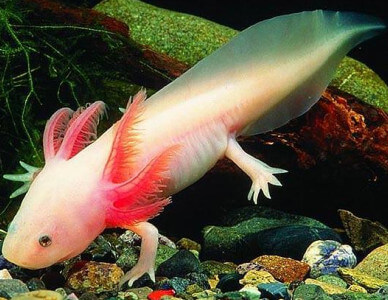

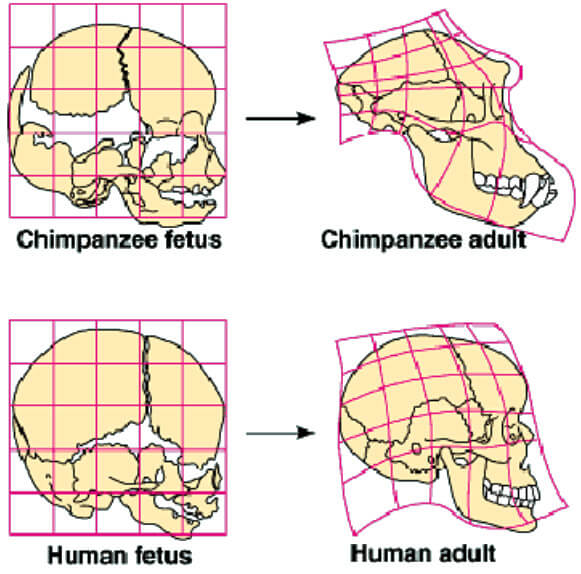

#### Les péramorphoses


**Péramorphoses :** permettent l’apparition de caractères nouveaux



Il existe deux types fondamentaux de péramorphoses 

**Accélération s.s.:** affecte le rythme du développement il y a donc accélération du développement somatique **\(taille et maturité sexuelle non modifiés\)**. Les formes accélérées matures ont une morphologie hyper-adulte, une taille normale

**Hypermorphose :** affecte la durée du développement = allongement du développement provoqué par un retard de la maturité sexuelle **\(pas de modification du développement somatique, juste une croissance plus longue\)**. Les adultes hypermorphiques ont une taille plus grande


#### Exemple Accélération

Ancêtre adulte ressemble au juvénile du descendant, sans différenciation de taille adulte : descendant accéléré !

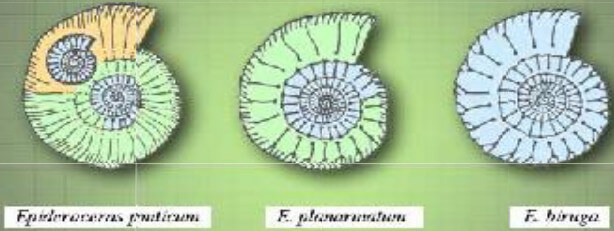

#### Exemple hypermorphose

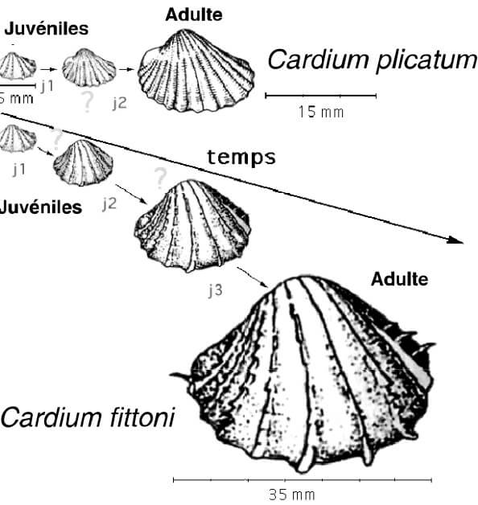


Hypermorphose lignée humaine.  
**H. sapiens : néoténie crânienne** par rapport à Pan troglodytes \(chimpanzé\) et Australopithecus africanus. Mais augmentation de la taille globale de l’homme, due à une **croissance prolongée** et un **retard de la maturité sexuelle** \(i.e. allongement de la durée de vie\). L’homme est dès lors également **hypermorphique** **par rapport** au chimpanzé et à l’Australopithèque...


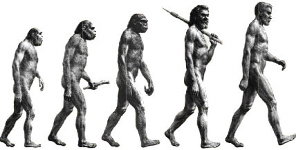

### Conclusion


L’évolution doit être envisagée comme un processus de modification des **développements morphologiques** plutôt que comme une simple accumulation de différences entre adultes. 

L’évolution est un **compromis** entre ce que propose le **développement** et ce que retient la **sélection** !


#### Evo-devo


Que nous dit l’EVO-DEVO ? L’évolution :

* Résulte de **mutations des gènes régulateurs du développement**, plutôt que de

  **l’accumulation de petites différences dans les gènes de structure**

* Résulte de **variations dans le programme de développement précoce.**

  **Variations du programme de développement correspondant au « réservoir » des**

  **changements évolutifs, en imposant des limites à la sélection naturelle.**\(diversité des espèces domestiques dépend plus des variations disponibles dans le

  programme de développement des espèces sauvages ancestrales, que des efforts des

  éleveurs !\)


## Espèces


L’espèce est l’unité de base de la classification systématique.C’est aussi l’unité de base des peuplements, des points de vue reproductif, génétique, écologique et évolutif.


### L'espèce en biologie

#### Concept de l'espèce


**Concept morphologique :** A la base un concept strictement morphologique basé sur les ressemblances. L’espèce est définie par référence à un type \(holotype\), décrit sous la forme d’une diagnose.

**Concept biologique :** Donne la primauté au critères d’interfécondité et d’isolement reproductif

L'idée moderne d'une espèces est le fait de partager un **même patrimoine génétique**, **interféconde**, suivi du partage de **caractère phénotypique communs** à **distribution** **gaussienne**

Pour des raisons d’inventaire, une espèce est toujours représentée par un **individu type** \(**holotype**\) selon un **caractère** **moyen**.


| Concept | Critère d'identification | Avantage | Désavantage |
| :--- | :--- | :--- | :--- |
| Biologique | Isolement reproductif | L’isolement reproductif implique une évolution indépendante | Ne s’applique pas aux espèces asexués et aux fossiles; Difficile à utiliser si des populations sont séparées géographiquement. |
| Morphologique | Populations morphologiquement distinctes | S’applique facilement à toutes sortes d’organismes | Approche subjective: les chercheurs peuvent ne pas être d’accord sur l’importance des variations morphologiques pour définir une nouvelle espèce. |

#### Les critères de l’espèce et les difficultés


**Polymorphisme :** Coexistence, au sein d’une **même population**, d’individus **interféconds** mais **morphologiquement différents**. Du fait de la variabilité, les populations sont très polymorphes. Certaines variations **ne répondent plus** à une **distribution gaussienne**. \(Il existe aussi du polymorphisme saisonnier\)

Dimorphisme sexuel : Différence morphologique entre les mâle et les femelles \(Ex : canard col vert\)

Espèces jumelles : 


## Définitions


Mutation :

Gènes :

Allèle :

Homozygote : 

Hétérozygote :

Génotype :

Phénotype :

Facteur mendélien :

Population :

Sédiment :

Stase :

Gradualisme :

Universalité : 

Plésiomorphe :

Apomorphe : 

Paraphylétique : 

Polyphylétique : 


