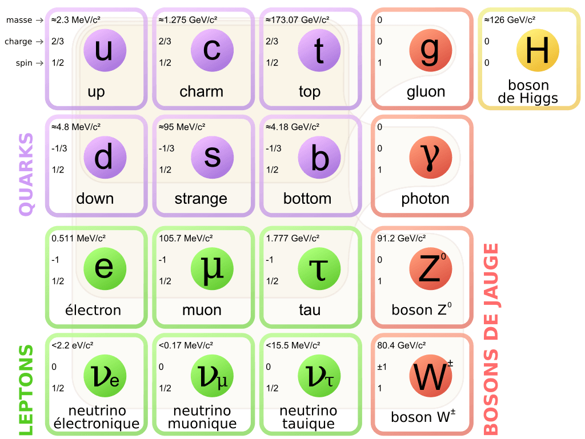
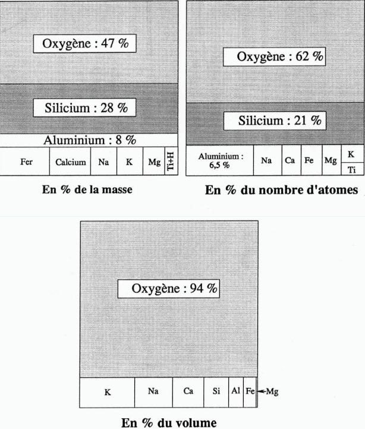
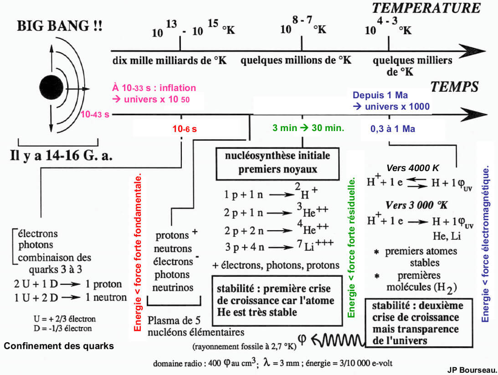
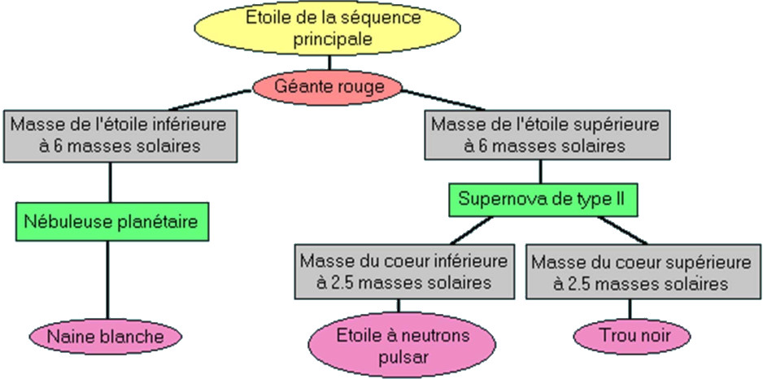
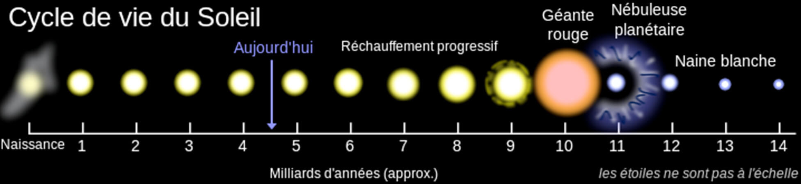
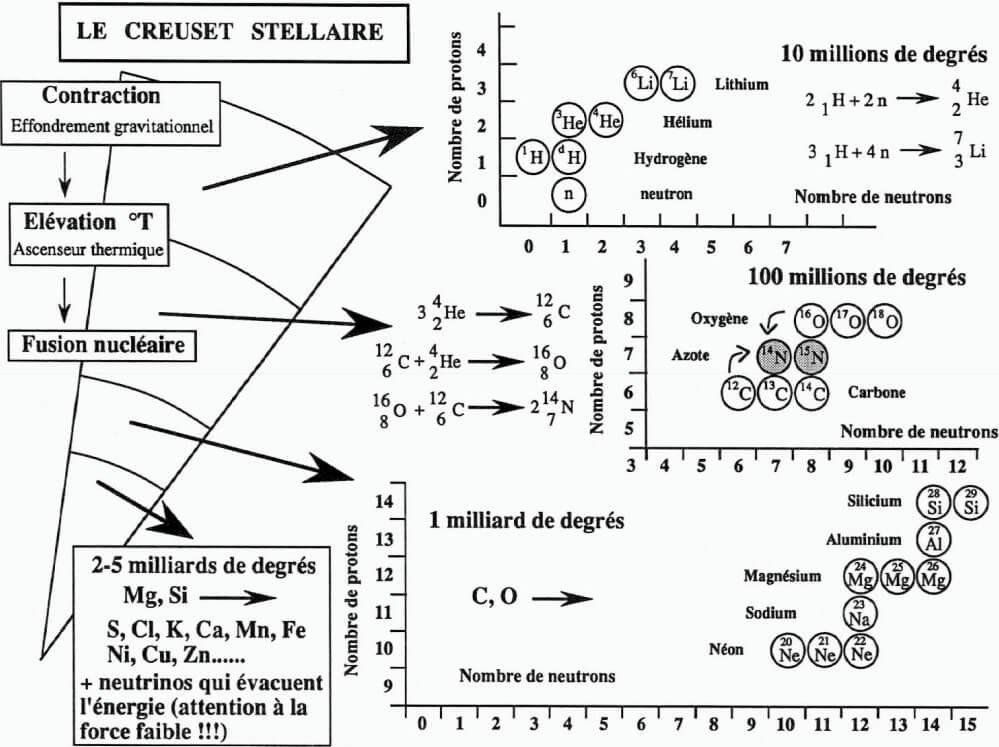
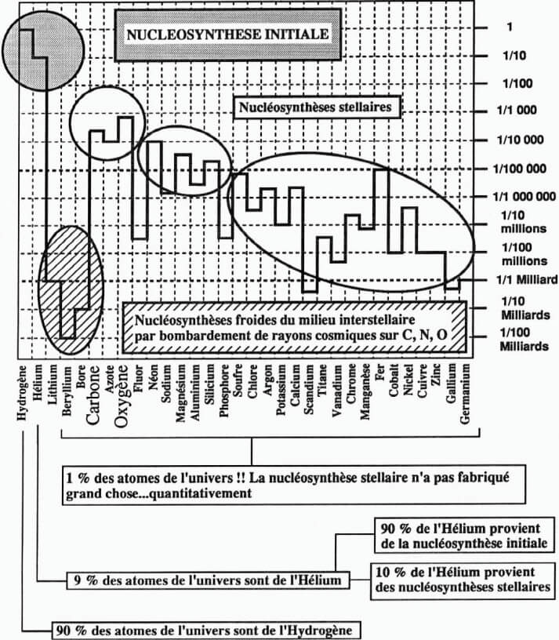
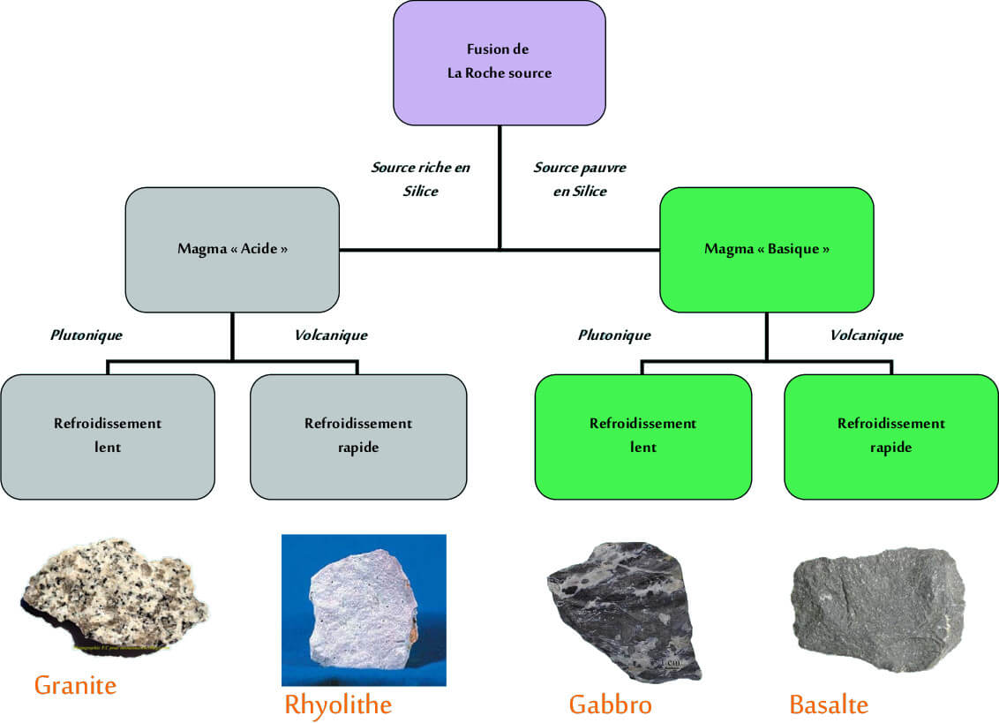

# Géologie

## Univers

### Particules et interactions

Les atomes sont constitué d'un noyaux et une couche d’électrons. Les neutrons et protons, constitués de 3 quarks forment le noyaux.

#### Théorie de la physique des particules


Le modèle standard englobe toutes les particules connus ainsi que les 3 interaction ayant un effet à l’échelle des particules : électromagnétique, forte et faible.


Le modèle standard permet d'expliquer tous les phénomène naturel sauf la gravitation qui, pour l'instant, résiste au théoriciens pour une théorie quantique.

#### Fermions

Composé de **leptons et quarks.** Les leptons sont des fermions "solitaires"  qui ne s'associent pas. Les quarks sont des fermions qui s'associent par paquet, nommé **hadrons.**   
Les fermions obéissent à la statistique de **Fermi-Dirac** et au principe d'exclusion de **Pauli.**  
Il existe les quarks U \(up, 2/3\) et D \(down, -1/3\). 


Il existe deux baryons très connus 

* U+U+D -&gt; 1 proton \(**nucleon**\)
* U+D+D -&gt; 1 neutron \(**nucleon**\)

Les fermions sont constituants de la matière


#### Bosons

Les bosons obéissent à la statistique de **Bose-Einstein.** Les bosons peuvent occuper à plusieurs le même état d'énergie. Aux 4 bosons du modèles standard \(**Photon, Gluons, Z et W**\), on ajoute le boson de Higgs. Et le gravitons en théorique.

Il y a **4 interactions \(forces\)** qui gouvernent la matière et l'évolution de l'univers.  
Il y a 4 types de particules d'interactions :

* **Electro-magnétique :** Photo 
* **Faible :** W+, W-, Zo
* **Forte :** Gluon
* **Gravité :** Graviton \(Théorique\)


Les bosons sont des particules d'interactions


#### Modèle standard

### Diversité des éléments chimiques

IL existe 90 éléments naturels, de 1 à 92 protons. Mendeleiv Dimitri, montra que les propriétés chimique des éléments dépendaient de leur poids atomique et qu'elle étaient des fonctions périodiques de ce poids.

#### Isotopes

Les isotopes sont des éléments qui ont les même propriétés chimiques -&gt; portent le même nom. Leur différence vient de leur masse, influencé par le nombre de neutrons


Selon le nombre relatif de protons et neutrons, les noyaux des isotopes sont stable ou instable 

* Les isotopes instable =&gt; radiochronologie ou chronologie isotopique
* Les isotopes stables =&gt; reconstituer les paléoenvironnement


**Isotopes Instables**  
Cuvier, Brongniart et d'Orbigny développent la **paléontologie stratigraphique.** Enerst Rhuterford propose d'utiliser la **constance de désintégration** pour mesurer le temps. Le Ga devient l'unité de mesure de l'âge de la Terre, comparé au Ma utilisé avant.  
En archéologie, le carbone 14 est utilisé pour la datation d'élément paléontologique

**Isotopes stable**  
Permet de retrouver la variation de température des océans au cours des temps géologiques

### Abondance des éléments chimique

#### Clarke

Les analyses chimiques des roches montre deux types d'éléments  
- Concentration en % $$\to$$élément majeurs  
- Concentration en Ppm $$\to$$élément en trace \(teneur &lt; 0.01%\)  
Il peuvent se substituer aux éléments majeurs dans les minéraux mais il ne déterminent pas l'apparition de minéraux supplémentaires  
La première estimation de la composition de la croûte continentale à était établie par Frank Clarke.


Le Clarke de O = 62%, Si = 21% et C=180ppm \(0.018%\)


#### Éléments majeurs


Sur 92 élément naturels, 8 seulement constituent les 99% de la masse des roches  
O, Si, Al, Fe, Ca, Na, K et Mg. Ils sont les constituants principaux des minéraux \(Silicates\)


Lors de la création des différentes planètes, seules quelques éléments est mis en place.  
**H, He**, O, Si, Al, Fe, Ca, Na, K et Mg  
**Pourquoi une telle parcimonie dans l’utilisation des éléments chimiques pour «construire» la Terre et les autres planètes du Système Solaire ?**


L’abondance d‘un élément est **inversement** **proportionnelle** **à son n° atomique**. Mais il y a 3 exceptions à cette généralité :

A DEMANDER !


### Origine des éléments chimique


Les éléments chimique proviennent de 3 grands événements   
- Nucléosynthèse primordiale  
- Nucléosynthèse Stellaire  
- Nucléosynthèse Interstellaire


#### Théorie du Big Bang

**Hubble** \(1929\) découvre que les galaxies s’éloignent les unes des autres avec une vitesse proportionnelle à leur distance au carré !  
- le décalage spectral des galaxies est proportionnel à leur distance  
- Plus la galaxie est lointaine, plus elle s'éloigne vite  
Cette découverte permet d'estimer un univers âgé de 15G, et la première observation d'un univers en expansion.


Théorie qui explique l'expansion de l'univers à partir du temps de plank \($$10^{-43}$$s\), limite conceptuelle. Parler du big bang revient à parler de l'évolution de l'univers.


En partant de cette idée d'expansion, et qu'on remonte le temps, les galaxies se rapprochent les unes des autres, de ce fait la température augmente, ainsi que leur densité. Soit à l'origine \($$10^{-43}$$s\), on assiste à un milieu très chaud et dense. On parle de **singularité**

**Ere TGU**  
Toutes les particules contenues dans ce point sont dissociées ; Toute associations éventuelle est instable  
**La matière = purée Quark + electron** dans une **énergie** énorme théoriquement unifiée.  
**Théorie du TOUT**  
Puis l'expansion débute, les particules vont alors se repousser mutuellement, l'expansion de l'univers commence, ainsi que le début du refroidissement.  
**Ere Hadronique**  
Suite à ça, il y a diminution de l'énergie des particules, et le découplage successifs des différentes forces. ****A partir d'une "Soupe" de quark et d’électrons \(Dans une énergie énorme TDT\) il y a formation des différentes particules \(Hadrons, Noyaux, Atomes et molécules\).  
A $$10^{-6}$$s, il y a **confinement \(regroupement par 3\)** des quarks, **hadrons = P et N \(nucléons\)**

#### **Nucléosynthèse primordiale**

**Ère radiative**  
Entre 3 min et 30 minutes, se passe la nucléosynthèse primordiale, ou l'association des Protons et Nucléons forment les noyaux des Hydrogènes. Suite à ça 2H + P + N forment 4 Hélium. **Première crise de croissance et l'apparition du gaz noble hélium.**

Vers 300 000 ans il y a naissance des premiers atomes non stable. Vers 380 000 ans =&gt; **Découplage matière-rayonnement**  
Les électrons n'interagissent plus avec le rayonnement : P + e -&gt; H et Photon \(Atome stable\), l'univers devient transparent ce qui permet à la lumière de parcourir l'espace sans entrave. C'est donc le début des **Rayonnement Cosmologique à 3000 Kelvin.** \(Rayonnement actuelles environ 2.7 Kelvin\) qui est du à la dilatation de l’univers d’un facteur 1000 entre 380 000 ans et aujourd’hui

**Ère Stellaire  
Gravité** $$\to$$ La matière se rassemble de place en place. Hiérarchisation : Etoiles, Galaxies. Première galaxie avant 1Ga, l'univers devient hétérogène.  
L'univers actuel est composé de **nébuleuse + galaxies + étoiles.**

* Nébuleuse -&gt; Vaste nuage de matière interstellaire où la densité est nettement supérieure à celle de l'espace interstellaire
* Galaxies -&gt; Plusieurs centaines de milliards de galaxies dans l'univers, et dans chacune plusieurs centaines de milliards d'étoiles

#### Nucléosynthèse stellaire

**Les étoiles : Le soleil**  
Les étoiles sont composées à 70% d'Hydrogène, 28% d'Hélium et 2% d'élément lourds. Au cœur de l'étoile se déroulent la fusion de l'Hydrogène et Hélium et libère de l’énergie lumineuse. On peut parler de **Réacteur Thermonucléaire.** \(Le noyaux est plus léger que l'ensemble de ses constituants pris séparément\)  
**Classification des étoiles**  
Le diagramme **Hertzsprung** représente les étoiles en fonction de leur température de surface et de leur luminosité \(Leur luminosité est directement dépendantes de sa masse\)


Les étoiles commence leur vie au cœur des **nébuleuses** \(Nuage de gaz dense, Hydrogène et molécule de Carbone\)  
Des fragments de ce nuage vont se condenser et former des protoétoiles  
C'est l'effondrement gravitationnel du nuage qui fournit l'énergie nécessaire au démarrage et à l'entretien des réactions de fusion \(H-&gt;He\) initiales.  
Au bout de quelques Ma, une grande partie du disque de gaz a été éjectée par les vents violents que génère la protoétoile \(**jets polaires**\).  
La jeune étoile au centre du nuage va devenir directement visible -&gt; T-Tauri


**Vie adulte des étoiles**  
Une fois l'étoile adulte, il y à un équilibre dynamique et l'étoile devient stable. De ce fait l'étoile se situe sur la séquence principale du diagramme de Hertzsprung-Russel. Elle va y passer environ 90% de sa vie. Pendant le quel l'hydrogène se change en Hélium  
**Déclin des étoiles**  
La fusion de l'Hydrogène s'arrête quand 10% de celui-ci à été consommé.  
- Une coquille d'hydrogène va se mettre en place autour du cœur, augmentant sa température, ce qui déclenche la fusion rapide des molécules d'Hélium en Carbone, Azote, Oxygène. Les couches périphérique augmente en taille.  
Le diamètre de l'étoile augmente de 100 fois, ce qui diminue sa température, ce qui se traduit vers un changement de rayonnement vers le rouge. Ce sont donc les **Géante Rouge.**


Lorsqu'une étoile se meure, il y a une contraction gravitationnelle au cœur de l'étoile. La température de 100M K, et provoque la réaction "triple alpha" = **Flash Hélium**. 3He -&gt; C stable. et 2He forme Be instable si la masse de l'étoile est supérieur à 0.5MS.


**Scénario pour les étoiles &lt; à 6Ms. \(Nébuleuse planétaire\)**  
L'arrêt du processus commence quand l'étoile est à court d'Hélium, le noyaux de Carbone devient inerte, l'étoile devient donc une **Naine Blanche \(5000 &lt; Température N &lt; 100 000K\),** le processus de fusion ralentit et l'étoile s'éteint. L'enveloppe externe de l'étoile est arrachée par les vents stellaires il y à donc apparition de **nébuleuse planétaire.**

**Scénario pour les étoiles &gt; à 6Ms. \(Supernova\)**  
La température au cœur de l'étoile dépasse les 100MK, ce qui entame la fusion du cœur en Carbone en Magnésium etc etc. Les éléments crées se disposent en différentes couche et forme une **structure en pelure d'oignon.**


**Liste des supergéante rouge \(Décroissant\)**  
Antares - Betelgeuse - Aldebaran - Rigel - Arcturus - Pollux - Sirilus - Sol



Au-delà du Fer, la synthèse des noyaux ne se fait pas dans un processus de fonctionnement « normal » de l’étoile, mais par son explosion, c'est la **supernova**  
Le Fe est l’élément le plus stable du damier nucléaire. Fusionner des éléments plus lourds que le Fe ferait perdre plus d’énergie que d’en gagner ; une sorte de banqueroute pour l’étoile.


#### Nucléosynthèse


**Récap origine élément chimique**

Big Bang -&gt; Gaz primordial \(Hydrogène 90% + Hélium 10%\) -&gt; Puis cycle condensation, étoiles, éjection de gaz et poussière enrichi. Ce cycle permet l'enrichissement progressif en élément lourds


### Organisation des éléments chimiques au sein des minéraux et les grands types de roches


Un minéral est un ensemble d'atomes, et un ensemble de minéraux forment une roche



**Minéral :** Espèce chimique naturelle se présentant le plus souvent sous forme de solide cristallin  
Composition chimique définie et structure atomique ordonnée. La classification des minéraux est donc basée sur leurs caractères chimiques et cristallographiques.

**Cristal :** Solide dont les divers atomes sont arrangés de manière régulière selon une disposition fondamentale \(la maille élémentaire\) dont la répétition dans l’espace dessine le réseau cristallin


#### Classification des minéraux

**Caractères chimiques**  
- Minéraux contenant du **Silicium** \(**Silice** et **Silicate**\) = 95% des roches des croûtes continentale et océanique et du manteau.  
**Famille de la Silice**, essentiellement sous forme de quartz  
**Famille des Silicates  
-** Minéraux ne contenant pas de Silicium \(Sulfates, Carbonates et phosphates\) très fréquents dans les sédiments.  
**Caractères cristallographiques**  
Le **réseau** est le résultat de la répétition par translation dans les 3 directions de l’espace, d’un motif géométrique = **la maille élémentaire.**  
La **maille élémentaire** est bâtie sur 3 vecteurs «a, b, c», les plus petits possibles, faisant entre eux 3 angles «alpha, béta, gamma» les plus proches de 90°.

**Notions de cristallochimie**  
Il existe 4 types de liaisons entres atomes  
- Liaison covalente : Le Diamant  
- Liaison Ionique : La Halite  
- Liaison métallique : Le Fer  
- Liaison Van Der Walls : Les feuillet de graphite  
La force de liaison influe sur l'augmentation de la dureté, la température de fusion et la diminution de l'expansion thermique  
**Les liaisons atomiques sont à l’origine des propriétés physico-chimiques des minéraux !  
Polyèdre de coordination**  
Charge et rayons des ions vont conditionner leur présence et leur disposition dans les édifices cristallins.  
**Polyèdre de coordination** = dans une espèce minérale donnée, les anions se groupent de façon géométrique constante autour des cations.  
Cet édifice sera un triangle ou un tétraèdre, ou un octaèdre, ou un cube. **Association de polyèdre** =&gt; Dans un cristal, les polyèdres de coordination sont associés.

#### Les silicates


L’élément commun à tous les silicates est le tétraèdre **\(SiO4\)4-**  
La **polymérisation** des tétraèdres se fait par les sommets \(**O de coordination**\)  
Les tétraèdres voisins peuvent avoir en commun 2, 3 ou 4 O. Ceci conduit à un nombre limité d’agencements qui sont -&gt;


* **Nésosilicates :**
  1. \(SiO4\)4- X2 / Olivine SiO4 \(Fe, Mg\)2 / Péridotites
* **Sorosilicates :**
  * \(Si207\)6- \(X3 ou Y2\) / Epidote / Roches métamorphiques
* **Cyclosilicates \(3, 4 & 6\) :**
  * \(Si309\)6- \(X3 ou Y2\) / Cordiérite, tourmaline, émeraude / Roches métamorphiques
* **Inosilicates :**
  * Si2O6\)4- \(X2\) / Pyroxènes Si2O6 \(Fe, Mg\)2 / Basaltes, gabbros
  * \(Si4O11\(OH\)\)7- \(Si3AlO11\(OH\)\)8 / Amphiboles Roches / magmatiques et métamorphiques
* Phyllosilicates :
  * \(Si4O10\(OH\)2\)6- \(Si3AlO10\(OH\)2\)7 / **Substitution du Si par Al fréquente /** Micas, minéraux argileux / Granite, argiles
* Tectosilicates :
  * SiO2 / Pour mettre des cations, il faut substituer au moins 1 Al à 1 Si / \(AlSi3O8\) K Quartz / Feldspath / Granite, gneiss.

#### Les roches \(Association minéralogique\)

Les minéraux résultent de la cristallisation à partir d’un magma ou d’une solution, ou se forment par l’intervention d’un organisme biologique \(squelettes, dents\)  
Granite exemple =&gt; Composé de Quartz, Feldspaths \(Orthose, plagioclases\), Micas \(Biotite, Muscovite\)  
**Minéraux \(Grains\)** visible à l'oeil nu, Roche avec **structure grenue**  
Une roche est composée de minéraux, les enveloppes solides du globe sont composées de roches

#### Roche magmatique


Magma solidifié peut donner des gros cristaux \(Texture grenue\) Plutonique, Granite OU Pâte vitreuse petits cristaux \(Microlithique\) Volcanique, Basalte


## Définition


**Minéral :** Qualificatif employé pour designer des molécules qui ne contiennent pas de carbone associé à des atomes d'hydrogène

**Galaxie :** 

**Creuset stellaire :** 

**Stable :**

**Radioactif :**


