# Géologie

## Univers

### Particules et interactions

Les atomes sont constitué d'un noyaux et une couche d’électrons. Les neutrons et protons, constitués de 3 quarks forment le noyaux.

#### Théorie de la physique des particules


Le modèle standard englobe toutes les particules connus ainsi que les 3 interaction ayant un effet à l’échelle des particules : électromagnétique, forte et faible.


Le modèle standard permet d'expliquer tous les phénomène naturel sauf la gravitation qui, pour l'instant, résiste au théoriciens pour une théorie quantique.

#### Fermions

Composé de **leptons et quarks.** Les leptons sont des fermions "solitaires"  qui ne s'associent pas. Les quarks sont des fermions qui s'associent par paquet, nommé **hadrons.**   
Les fermions obéissent à la statistique de **Fermi-Dirac** et au principe d'exclusion de **Pauli.**  
Il existe les quarks U \(up, 2/3\) et D \(down, -1/3\). 


Il existe deux baryons très connus 

* U+U+D -&gt; 1 proton \(**nucleon**\)
* U+D+D -&gt; 1 neutron \(**nucleon**\)

Les fermions sont constituants de la matière


#### Bosons

Les bosons obéissent à la statistique de **Bose-Einstein.** Les bosons peuvent occuper à plusieurs le même état d'énergie. Aux 4 bosons du modèles standard \(**Photon, Gluons, Z et W**\), on ajoute le boson de Higgs. Et le gravitons en théorique.

Il y a **4 interactions \(forces\)** qui gouvernent la matière et l'évolution de l'univers.  
Il y a 4 types de particules d'interactions :

* **Electro-magnétique :** Photo 
* **Faible :** W+, W-, Zo
* **Forte :** Gluon
* **Gravité :** Graviton \(Théorique\)


Les bosons sont des particules d'interactions


#### Modèle standard

### Diversité des éléments chimiques

IL existe 90 éléments naturels, de 1 à 92 protons. Mendeleiv Dimitri, montra que les propriétés chimique des éléments dépendaient de leur poids atomique et qu'elle étaient des fonctions périodiques de ce poids.

#### Isotopes

Les isotopes sont des éléments qui ont les même propriétés chimiques -&gt; portent le même nom. Leur différence vient de leur masse, influencé par le nombre de neutrons


Selon le nombre relatif de protons et neutrons, les noyaux des isotopes sont stable ou instable 

* Les isotopes instable =&gt; radiochronologie ou chronologie isotopique
* Les isotopes stables =&gt; reconstituer les paléoenvironnement


**Isotopes Instables**  
Cuvier, Brongniart et d'Orbigny développent la **paléontologie stratigraphique.** Enerst Rhuterford propose d'utiliser la **constance de désintégration** pour mesurer le temps. Le Ga devient l'unité de mesure de l'âge de la Terre, comparé au Ma utilisé avant.  
En archéologie, le carbone 14 est utilisé pour la datation d'élément paléontologique

**Isotopes stable**  
Permet de retrouver la variation de température des océans au cours des temps géologiques

### Abondance des éléments chimique

#### Clarke

Les analyses chimiques des roches montre deux types d'éléments  
- Concentration en % $$\to$$élément majeurs  
- Concentration en Ppm $$\to$$élément en trace \(teneur &lt; 0.01%\)  
Il peuvent se substituer aux éléments majeurs dans les minéraux mais il ne déterminent pas l'apparition de minéraux supplémentaires  
La première estimation de la composition de la croûte continentale à était établie par Frank Clarke.


Le Clarke de O = 62%, Si = 21% et C=180ppm \(0.018%\)


#### Éléments majeurs


Sur 92 élément naturels, 8 seulement constituent les 99% de la masse des roches  
O, Si, Al, Fe, Ca, Na, K et Mg. Ils sont les constituants principaux des minéraux \(Silicates\)


Lors de la création des différentes planètes, seules quelques éléments est mis en place.  
**H, He**, O, Si, Al, Fe, Ca, Na, K et Mg  
**Pourquoi une telle parcimonie dans l’utilisation des éléments chimiques pour «construire» la Terre et les autres planètes du Système Solaire ?**


L’abondance d‘un élément est **inversement** **proportionnelle** **à son n° atomique**. Mais il y a 3 exceptions à cette généralité :

A DEMANDER !


### Origine des éléments chimique


Les éléments chimique proviennent de 3 grands événements   
- Nucléosynthèse primordiale  
- Nucléosynthèse Stellaire  
- Nucléosynthèse Interstellaire


#### Théorie du Big Bang

**Hubble** \(1929\) découvre que les galaxies s’éloignent les unes des autres avec une vitesse proportionnelle à leur distance au carré !  
- le décalage spectral des galaxies est proportionnel à leur distance  
- Plus la galaxie est lointaine, plus elle s'éloigne vite  
Cette découverte permet d'estimer un univers âgé de 15G, et la première observation d'un univers en expansion.


Théorie qui explique l'expansion de l'univers à partir du temps de plank \($$10^{-43}$$s\), limite conceptuelle. Parler du big bang revient à parler de l'évolution de l'univers.


En partant de cette idée d'expansion, et qu'on remonte le temps, les galaxies se rapprochent les unes des autres, de ce fait la température augmente, ainsi que leur densité. Soit à l'origine \($$10^{-43}$$s\), on assiste à un milieu très chaud et dense. On parle de **singularité**

**Ere TGU**  
Toutes les particules contenues dans ce point sont dissociées ; Toute associations éventuelle est instable  
**La matière = purée Quark + electron** dans une **énergie** énorme théoriquement unifiée.  
**Théorie du TOUT**  
Puis l'expansion débute, les particules vont alors se repousser mutuellement, l'expansion de l'univers commence, ainsi que le début du refroidissement.  
**Ere Hadronique**  
Suite à ça, il y a diminution de l'énergie des particules, et le découplage successifs des différentes forces. ****A partir d'une "Soupe" de quark et d’électrons \(Dans une énergie énorme TDT\) il y a formation des différentes particules \(Hadrons, Noyaux, Atomes et molécules\).  
A $$10^{-6}$$s, il y a **confinement \(regroupement par 3\)** des quarks, **hadrons = P et N \(nucléons\)**

#### **Nucléosynthèse primordiale**

**Ère radiative**  
Entre 3 min et 30 minutes, se passe la nucléosynthèse primordiale, ou l'association des Protons et Nucléons forment les noyaux des Hydrogènes. Suite à ça 2H + P + N forment 4 Hélium. **Première crise de croissance et l'apparition du gaz noble hélium.**

Vers 300 000 ans il y a naissance des premiers atomes non stable. Vers 380 000 ans =&gt; **Découplage matière-rayonnement**  
Les électrons n'interagissent plus avec le rayonnement : P + e -&gt; H et Photon \(Atome stable\), l'univers devient transparent ce qui permet à la lumière de parcourir l'espace sans entrave. C'est donc le début des **Rayonnement Cosmologique à 3000 Kelvin.** \(Rayonnement actuelles environ 2.7 Kelvin\) qui est du à la dilatation de l’univers d’un facteur 1000 entre 380 000 ans et aujourd’hui

**Ère Stellaire  
Gravité** $$\to$$ La matière se rassemble de place en place. Hiérarchisation : Etoiles, Galaxies. Première galaxie avant 1Ga, l'univers devient hétérogène.  
L'univers actuel est composé de **nébuleuse + galaxies + étoiles.**

* Nébuleuse -&gt; Vaste nuage de matière interstellaire où la densité est nettement supérieure à celle de l'espace interstellaire
* Galaxies -&gt; Plusieurs centaines de milliards de galaxies dans l'univers, et dans chacune plusieurs centaines de milliards d'étoiles

#### Nucléosynthèse stellaire

**Les étoiles : Le soleil**  
Les étoiles sont composées à 70% d'Hydrogène, 28% d'Hélium et 2% d'élément lourds. Au cœur de l'étoile se déroulent la fusion de l'Hydrogène et Hélium et libère de l’énergie lumineuse. On peut parler de **Réacteur Thermonucléaire.** \(Le noyaux est plus léger que l'ensemble de ses constituants pris séparément\)  
**Classification des étoiles**  
Le diagramme **Hertzsprung** représente les étoiles en fonction de leur température de surface et de leur luminosité \(Leur luminosité est directement dépendantes de sa masse\)


Les étoiles commence leur vie au cœur des **nébuleuses** \(Nuage de gaz dense, Hydrogène et molécule de Carbone\)  
Des fragments de ce nuage vont se condenser et former des protoétoiles  
C'est l'effondrement gravitationnel du nuage qui fournit l'énergie nécessaire au démarrage et à l'entretien des réactions de fusion \(H-&gt;He\) initiales.  
Au bout de quelques Ma, une grande partie du disque de gaz a été éjectée par les vents violents que génère la protoétoile \(**jets polaires**\).  
La jeune étoile au centre du nuage va devenir directement visible -&gt; T-Tauri


**Vie adulte des étoiles**  
Une fois l'étoile adulte, il y à un équilibre dynamique et l'étoile devient stable. De ce fait l'étoile se situe sur la séquence principale du diagramme de Hertzsprung-Russel. Elle va y passer environ 90% de sa vie. Pendant le quel l'hydrogène se change en Hélium  
**Déclin des étoiles**  
La fusion de l'Hydrogène s'arrête quand 10% de celui-ci à été consommé.  
- Une coquille d'hydrogène va se mettre en place autour du cœur, augmentant sa température, ce qui déclenche la fusion rapide des molécules d'Hélium en Carbone, Azote, Oxygène. Les couches périphérique augmente en taille.  
Le diamètre de l'étoile augmente de 100 fois, ce qui diminue sa température, ce qui se traduit vers un changement de rayonnement vers le rouge. Ce sont donc les **Géante Rouge.**


Lorsqu'une étoile se meure, il y a une contraction gravitationnelle au cœur de l'étoile. La température de 100M K, et provoque la réaction "triple alpha" = **Flash Hélium**. 3He -&gt; C stable. et 2He forme Be instable si la masse de l'étoile est supérieur à 0.5MS.


**Scénario pour les étoiles &lt; à 6Ms. \(Nébuleuse planétaire\)**  
L'arrêt du processus commence quand l'étoile est à court d'Hélium, le noyaux de Carbone devient inerte, l'étoile devient donc une **Naine Blanche \(5000 &lt; Température N &lt; 100 000K\),** le processus de fusion ralentit et l'étoile s'éteint. L'enveloppe externe de l'étoile est arrachée par les vents stellaires il y à donc apparition de **nébuleuse planétaire.**

**Scénario pour les étoiles &gt; à 6Ms. \(Supernova\)**  
La température au cœur de l'étoile dépasse les 100MK, ce qui entame la fusion du cœur en Carbone en Magnésium etc etc. Les éléments crées se disposent en différentes couche et forme une **structure en pelure d'oignon.**


**Liste des supergéante rouge \(Décroissant\)**  
Antares - Betelgeuse - Aldebaran - Rigel - Arcturus - Pollux - Sirilus - Sol



Au-delà du Fer, la synthèse des noyaux ne se fait pas dans un processus de fonctionnement « normal » de l’étoile, mais par son explosion, c'est la **supernova**  
Le Fe est l’élément le plus stable du damier nucléaire. Fusionner des éléments plus lourds que le Fe ferait perdre plus d’énergie que d’en gagner ; une sorte de banqueroute pour l’étoile.


#### Nucléosynthèse


**Récap origine élément chimique**

Big Bang -&gt; Gaz primordial \(Hydrogène 90% + Hélium 10%\) -&gt; Puis cycle condensation, étoiles, éjection de gaz et poussière enrichi. Ce cycle permet l'enrichissement progressif en élément lourds


### Organisation des éléments chimiques au sein des minéraux et les grands types de roches


Un minéral est un ensemble d'atomes, et un ensemble de minéraux forment une roche



**Minéral :** Espèce chimique naturelle se présentant le plus souvent sous forme de solide cristallin  
Composition chimique définie et structure atomique ordonnée. La classification des minéraux est donc basée sur leurs caractères chimiques et cristallographiques.

**Cristal :** Solide dont les divers atomes sont arrangés de manière régulière selon une disposition fondamentale \(la maille élémentaire\) dont la répétition dans l’espace dessine le réseau cristallin


#### Classification des minéraux

**Caractères chimiques**  
- Minéraux contenant du **Silicium** \(**Silice** et **Silicate**\) = 95% des roches des croûtes continentale et océanique et du manteau.  
**Famille de la Silice**, essentiellement sous forme de quartz  
**Famille des Silicates  
-** Minéraux ne contenant pas de Silicium \(Sulfates, Carbonates et phosphates\) très fréquents dans les sédiments.  
**Caractères cristallographiques**  
Le **réseau** est le résultat de la répétition par translation dans les 3 directions de l’espace, d’un motif géométrique = **la maille élémentaire.**  
La **maille élémentaire** est bâtie sur 3 vecteurs «a, b, c», les plus petits possibles, faisant entre eux 3 angles «alpha, béta, gamma» les plus proches de 90°.

**Notions de cristallochimie**  
Il existe 4 types de liaisons entres atomes  
- Liaison covalente : Le Diamant  
- Liaison Ionique : La Halite  
- Liaison métallique : Le Fer  
- Liaison Van Der Walls : Les feuillet de graphite  
La force de liaison influe sur l'augmentation de la dureté, la température de fusion et la diminution de l'expansion thermique  
**Les liaisons atomiques sont à l’origine des propriétés physico-chimiques des minéraux !  
Polyèdre de coordination**  
Charge et rayons des ions vont conditionner leur présence et leur disposition dans les édifices cristallins.  
**Polyèdre de coordination** = dans une espèce minérale donnée, les anions se groupent de façon géométrique constante autour des cations.  
Cet édifice sera un triangle ou un tétraèdre, ou un octaèdre, ou un cube. **Association de polyèdre** =&gt; Dans un cristal, les polyèdres de coordination sont associés.

#### Les silicates


L’élément commun à tous les silicates est le tétraèdre **\(SiO4\)4-**  
La **polymérisation** des tétraèdres se fait par les sommets \(**O de coordination**\)  
Les tétraèdres voisins peuvent avoir en commun 2, 3 ou 4 O. Ceci conduit à un nombre limité d’agencements qui sont -&gt;


* **Nésosilicates :**
  1. \(SiO4\)4- X2 / Olivine SiO4 \(Fe, Mg\)2 / Péridotites
* **Sorosilicates :**
  * \(Si207\)6- \(X3 ou Y2\) / Epidote / Roches métamorphiques
* **Cyclosilicates \(3, 4 & 6\) :**
  * \(Si309\)6- \(X3 ou Y2\) / Cordiérite, tourmaline, émeraude / Roches métamorphiques
* **Inosilicates :**
  * Si2O6\)4- \(X2\) / Pyroxènes Si2O6 \(Fe, Mg\)2 / Basaltes, gabbros
  * \(Si4O11\(OH\)\)7- \(Si3AlO11\(OH\)\)8 / Amphiboles Roches / magmatiques et métamorphiques
* Phyllosilicates :
  * \(Si4O10\(OH\)2\)6- \(Si3AlO10\(OH\)2\)7 / **Substitution du Si par Al fréquente /** Micas, minéraux argileux / Granite, argiles
* Tectosilicates :
  * SiO2 / Pour mettre des cations, il faut substituer au moins 1 Al à 1 Si / \(AlSi3O8\) K Quartz / Feldspath / Granite, gneiss.

#### Les roches \(Association minéralogique\)

Les minéraux résultent de la cristallisation à partir d’un magma ou d’une solution, ou se forment par l’intervention d’un organisme biologique \(squelettes, dents\)  
Granite exemple =&gt; Composé de Quartz, Feldspaths \(Orthose, plagioclases\), Micas \(Biotite, Muscovite\)  
**Minéraux \(Grains\)** visible à l'oeil nu, Roche avec **structure grenue**  
Une roche est composée de minéraux, les enveloppes solides du globe sont composées de roches

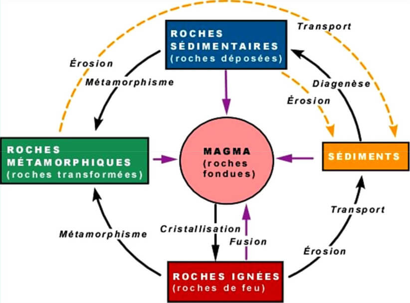

#### Roche magmatique


Magma solidifié peut donner des gros cristaux \(Texture grenue\) Plutonique, Granite OU Pâte vitreuse petits cristaux \(Microlithique\) Volcanique, Basalte


#### Roches métamorphiques


Transformation d'une roche à l'état solide du fait de l'élévation de la température et ou de la pression, avec cristallisation de nouveaux minéraux et acquisition de texture et structure particulière sous l’influence de conditions physiques et/ou chimiques différentes de celles ayant présidé à la formation de la roche originelle.  
La roche originelle \(**Protolithe**\) peut être sédimentaire, magmatique ou métamorphique  
Nommé : Para-métamorphique, Ortho-métamorphique et polymétamorphisme


Les roches métamorphique ont plusieurs structurations, **linéation, schistosité et foliation.  
Degrés de métamorphisme**  
Argile =&gt; Schiste =&gt; Gneiss =&gt; Migmatite =&gt; Fusion  
- La fusion partielle des roches métamorphiques forme de la **migmatite**  
- Fusion totale forme du **magma**

**Roche sédimentaires**

**Classification**  
Les roches sédimentaires se sépares en 4 catégories principales : **Silicoclastiques \(70%\), Carbonatées \(25%\), Évaporitiques \(4%\), Autres \(Carbonées, Siliceuse, 1%\)**  
Classification selon la genèse :  
- **Roches détritiques** terrigènes \(Par érosion de roche en place, ex : grès, silts, argile\) et roche détritique volcanique  
- **Roches chimiques** \(Par précipitation des sels minéraux\) les évaporites \(Halite, Gypse\), les résiduelle \(Bauxite\)  
- **Roches biochimiques** \(Par production des êtres vivants\). Les calcaires, les siliceuses, les phosphatées, les organiques \(Charbons, hydrocarbures\)

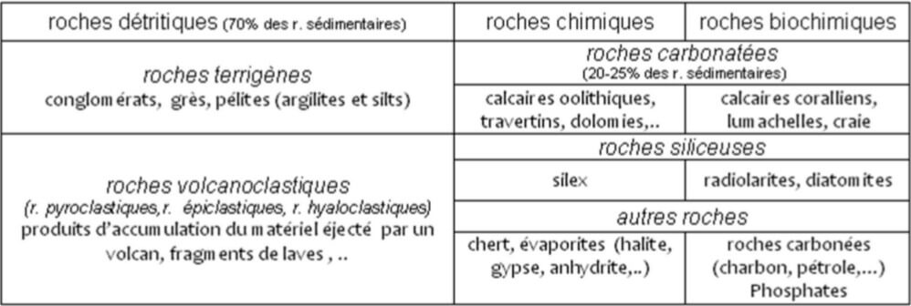

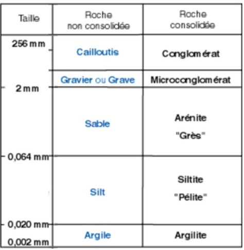

## Système solaire

### Diversité et unicité

Notre système solaire est composé du Soleil, de 8 planètes \(Mercure, Venus, Terre, Mars, Jupiter, Saturne, Uranus et Neptune\) ainsi que d'autre élément.  
On peut définir notre système solaire de différentes manières :   
- Etat de la matière : Plasma \(Soleil\), Roche \(Planète tellurique\), Gaz \(Géante Gazeuse\) et Glace \(Comète\)  
- Par la masse, $$2\times10^{31}Kg$$sois la masse du soleil.

#### Soleil

Le soleil est une étoile de catégorie G2, sa masse est de $$2\times10^{30}Kg$$, un volume de 1 392 000Km de diamètre \(109x le diamètre de la Terre\). Il est entièrement composé de gaz, Hydrogène à 70% et Hélium à 28%. On peut dire que le soleil est un réacteur Thermonucléaire en son cœur, par la fusion de l'hydrogène en Hélium 

#### Les planètes


Une planète est en orbite autour d'une étoile, suffisamment massive pour que l'effet de sa propre gravité lui confère une forme sphérique, soit une masse &gt; $$5\times10^{20}Kg$$ et un rayon &gt; 800Km. Dominant son environnement en ayant supprimé les différents élément dans son orbite, sinon planète naine


**Planète naine**  
Découverte en 1930, pluton est depuis 2006 considérée comme une planète naine  
**9è Planète**  
Des indices récents semble indiquer la présence d'une nouvelles planète après Neptune, elle serai gazeuse, 10 fois supérieure à la masse de la Terre, peut être 20 fois plus loin que Neptune, avec une orbite de 10/20 000 ans.  
**Exoplanète**  
En 2019 on recense 4109 exoplanètes dans 3059 systèmes planétaires.  
**Système planétaire équivalent au notre : TRAPPIST-1**  
Situé à environ 40 année lumière du système solaire, présence d'une étoile naine froide, constitué de 7 planètes de taille similaire à la Terre, et au moins 3 d'entres elles pourraient avoir de l'eau liquide à la surface  
**Planète K2-18b**  
Distante d'environs 110 année lumières du système solaire, qualifiée comme étant une Super-Terre, se situe dans dans le spectre ou l'eau est disponible. Vapeur d'eau détectée

#### Caractère fondamentaux des planètes


Les planètes possèdent plusieurs caractère, Taille, Masse, Densité, Composition, Champ magnétique et Orbite. Les plus importants sont la **Taille**, la **Masse** et leur **Orbite**.


Taille et masse sont des caractères liée l'un et l'autre.  
La masse d'une planète conditionne :   
- Son champ gravitationnel $$\to$$Capacité à garder les enveloppes fluides  
- Sa quantité d'énergie interne  
La dissipation de ce flux, forme la tectonique des plaques et permet la création de relief

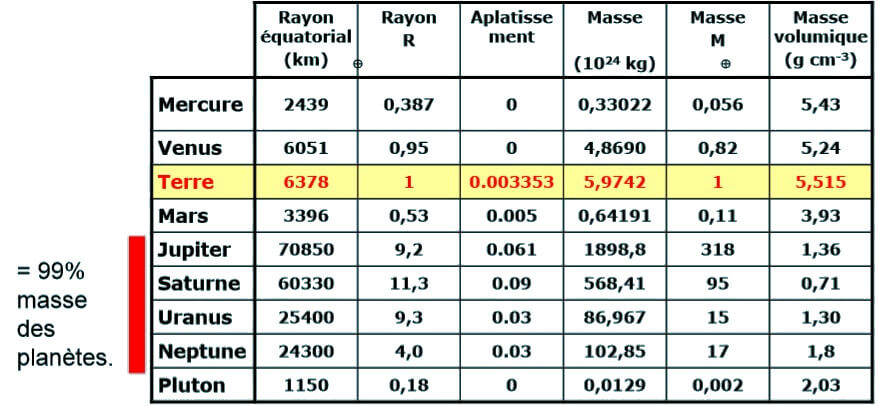

Quand on connait la masse, on connait la densité.  
Compression gravitaire :  
- Pour une même composition, plus une planète est grosse, plus la pression est forte et donc plus la densité est élevée  
- La porosité des corps à faible champs de gravité : "Vide" et donc faible densité  
La densité correspond à la composition moyenne.  
- Pour les planètes telluriques \(Roche et métaux\): Sillicates, O, Si, Al, Mg, Na, Ca, K, Fe, Ni et S  
- Pour les planètes gazeuse : 80-90 mol% **d'Hydrogène** et 10-20 mol% **d'Hélium** et un peu de méthane, composition très proche du Soleil

#### Relief

A la différence de Mercure, les surface de Venus, Terre et Mars présentent une faible densité de cratères mais des reliefs élevés et des volcans. Venus et Terre sont des planètes actives, Mars est inactive depuis environ 500Ma

#### Orbite

Les planètes sont séparé en deux grands groupes par rapport à leurs orbites, l'orbite de Mercure, Venus, Terre et Mars qui est à une unité astronomique et Jupiter, Saturne, Uranus et Neptune à environ 10 unité astronomique.  
L'orbite conditionne la quantité d'énergie reçue depuis le soleil \(360 w/m² au toit de l'atmosphère terrestre\)  
**L’énergie externe** est à l'origine de l’érosion -&gt; destruction des reliefs

#### Champ magnétique


Mars et Venus n'ont pas de champ magnétique. 


#### Mercure

Mercure n'a pas d'atmosphère, présence d'hydrogène et d'hélium \(Vent solaire\) temporairement gardés par Mercure. Vapeur de Na et K qui corresponde à l’interaction entre vent solaire et minéraux de surface. Pression totale &lt; $$10^{-12}$$ atmosphère, soit le vide. Planète trop proche du soleil \(Température 430°C\) et petite gravité \(Petite Masse\)  
Présence de lave et de volcans, c'est donc une planète active.  
Mercure à un noyaux métallique, constitué principalement de Fer, son noyau représente 40% de son volume totale et 2/3 de sa masse. Densité élevé 5,4.

#### Vénus

Planète avec une atmosphère très dense, 95 Bars, épaisse de 50 à 70 Km et constitué de 96% de CO2, cet effet de serre fait monté la température à 460°C.  
Vénus montre une présence forte en volcans et reliefs. Coulée de lave et impact de cratères

#### Terre

La terre présente une différences notable comparé aux autres planètes, sa biosphère, ainsi que l'atmosphère \(Vapeurs d'eau\), hydrosphère \(Liquide et Solide\) et des reliefs.  
**Lune**  
La terre est indissociable de son satellite la Lune  
**Météorite**  
Grace à différente méthode de séismologie et tomographie il est possible de détecter les anciens impact de météorite sur Terre, le diamètre de l'impact d'un météorite est égale à 20 fois le diamètre de celui-ci. Le plus gros météorite connus sur terre pèse 60 tonne et à été découvert en Namibie.  
Les météorite peuvent provenir de différents endroits, la ceinture d’astéroïde située entre Mars et Jupiter, météorite éjectée de la planète Mars par un impact sur celle-ci

#### Mars

Mars est une planète "fossile" , elle à deux satellites **Pheibos et Deimos,** c'est une planète inactive géologiquement.  
Mars est la planète la plus proche de la Terre avec 55Mkm. Son noyaux est de 1300 à 2000km de rayon, c'est un noyau solide, il n'y à donc pas de champ magnétique, on peut l'observer car mars est criblé de cratères d'impact, le cratère **Schiaparelli** est le plus grand. Ne pas confondre les cratères d'impact avec les cônes volcaniques présent sur la surface, reflétant l'ancienne activité géologique de Mars. Plusieurs faille sont présente sur la surface de Mars, dont le grand canyon de **Valles Marineris.** Le plus gros volcan de mars est le **Mont Olympe.**   
Hydrosphère =&gt; De par sa position dans le système solaire, Mars aurait du accumuler autant d'eau que la Terre au cours de sa formation. Mais son atmosphère n'a que **0,03% de vapeurs d'eau.** Il y a présence de calottes polaires. L'eau liquide n'existe plus à la surface de Mars. La présence certaines forme géologique prouve que l'eau était présente de façon liquide sur Mars.  
- Érosion sur mars et écoulement  
- Accumulation de sédiment comparable à la Terre  
- Chenal \(Fleuve et rivière\) ?  
Il y a 35Ma Mars aurai était recouvert d'eau dans l'hémisphère nord. Malgré ça, l'atmosphère de mars est composé à 95% de CO2 avec une pression de 0.01 bar \(Faible gravitation et pas de champs magnétique\)

#### Ceinture d’astéroïde

Contient plusieurs millions d'objets, allant du grain de sable à la protoplanète.  
**Cérès** est fortement cratérisé \(Surface ancienne donc pas d'activité géologique\)

#### Jupiter

Sur une phot récente, on peut distinguer 4 impact sur Jupiter, un impact à environ la taille de l’océan pacifique. Jupiter à 4 satellites galiléens =&gt; **Io, Europa, Ganymède et Callisto** dont la glace domine leur surface.  
Sur **IO** on peut distinguer des coulées volcaniques, **Europa** présente des couches de glace fissuré, **Ganymède** cratère d'impact fortement représenté, **Callisto** Cratère d'impact. On constate que de Io à Callisto l'activité géologique va en diminuant, cette activité rajeunis la surface. Ce cycle de satellites est une exception à la règle de dépendance de la taille sur l'activité d'une planète. Leur taille ne devrai pas leur fournir une activité géologique, leur activité géologique provient des **forces de marées**, qui engendre des déformation sur ces différents corps, ce qui provoque des friction et entrain la fusion partiels du noyaux qui s'exprime en surface par du volcanisme. La force de marées et provoqué par Jupiter.

#### Saturne

Saturne est la planète entourée d'un anneau, cet anneau est crée par le dégazage de certains satellites avec une activité volcanique, volcanisme aquatique \(H2O\) qui laisse des particules d'eau sur l'orbite,  l'un de ses satellites, **Mimas**, à inspiré l'étoile Noir de star wars. **Titan** est constitué de méthane, on peut le voir avec une rivière assécher et un lac de méthane en surface \(Température surface de -180°C\)

#### Uranus et Neptune

**Uranus et Neptune** sont deux géantes de glaces, composé essentiellement de méthane, ammoniac et d'eaux, l'ensemble de ces matériaux est appelée glace.

#### Comète

Les comètes proviennent de plusieurs endroit de l'univers, la **ceinture de Kuiper ou du nuage d'Oort.** Composée d'un noyaux de glace et de poussière. La sonde Rosetta rencontre la comète Chury

#### Récap

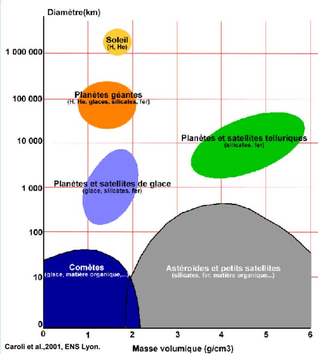

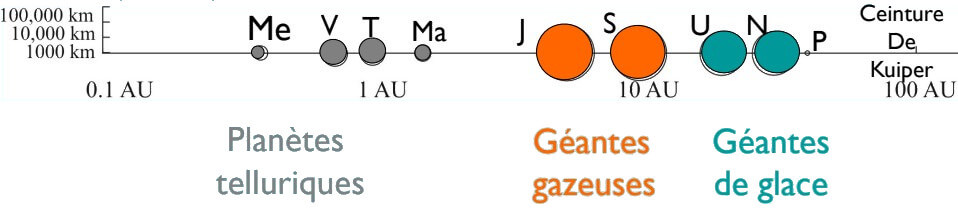

### Formation des planètes

#### De la condensation à la différenciation

Au moment de la **condensation du gaz nébulaire**, la **position orbitale des poussières** détermine la **composition chimique de la future planète**.  
Cette différence de nature chimique des poussières, associée aux phénomènes **d'accrétion**, expliquent la différence de composition chimique des planètes rocheuses, des satellites de glace, et de leurs environnements atmosphériques. A cela il faut ajouter le phase de **différenciation** \(et de **dégazage**\).

#### Composition des grains de poussière

Les différents grains de poussières vont former les planètes

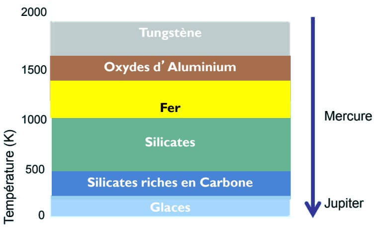

La séquence de condensation générale à partir de la nébuleuse solaire \(gaz enrichi en éléments lourds\).C’est le processus qui explique la zonation chimique du système solaire.

#### Séquence condensation partielle

Au moment de la phase T-tauri les régions les plus proches de la source de chaleur sont plus riches en réfractaires, les régions les plus éloignées du Soleil, plus riches en volatils.

#### Accrétion, des poussières aux planètes

Scénario valable pour les planètes telluriques

1. La nébuleuse proto-solaire voit sa vitesse de **rotation** augmentée
2. La **gravitation** agglutine les chondres et les poussières de Fe et Ni =&gt; planétisimaux \(I puis II\)
3. Créations d’anneaux de matières \(phénomènes de résonnance\).
4. Autour des plus gros **planétisimaux**, les champs de gravité s’amplifièrent et le processus d’accrétion prit de l’accélération =&gt;  naissance des protoplanètes Le phénomène d’accrétion s’accompagne d’une augmentation de la T° =&gt; zonation thermique dans les anneaux.
5. **Bombardement météoritique intense** pendant 500 à 800 Ma.

Les poussières s’attirent de manière électrostatique. Lorsqu'elles deviennent plus grosse : attraction gravitaire. Problème : petits corps \(&lt; 1km\) détruits facilement par les collisions Comment passer d’une poussière à un corps d’1km ? Les impacts géants peuvent détruire les planètes en formation.

## Terre

### Méthode d'exploration de l'intérieur de la Terre

Comment peut ont accéder à l'intérieur de la Terre ? Comment voir l'invisible ?  
Sismologie -&gt; Structure du globe  
Minéralogie -&gt; Composition du globe  
Géodésie -&gt; Forme du globe

#### Sismologie

La structure de la Terre est connue grâce à l'étude de la propagation des ondes sismiques. Près de l'épicentre, la déformation permanente et cassante provoque les failles. Plus loin de l'épicentre, des vibrations, des ondes se propagent. La déformation n'est pas permanente =&gt; Déformation élastique.  
Lors de la rupture, il y a libération d'énergie **dissipée sous forme de chaleur et d'ondes** qui se propagent au travers du globe.  
**Enregistrement des séisme**  
En 132 après JC, les chinois ont fabriqué le premier appareil d'observation des tremblement de terre \(**Sismoscope**\)  
C'est en 1875 que l'italien Feloppo Cecchi construit le premier sismographe, capable d'enregistrer le mouvement du sol en fonction du temps \(Sismographe Horizontale et Verticale\), le sismographe donne les sismogrammes.  
Depuis le milieu des années 70, les réseaux globaux de station sismique, le premiers réseaux développés par les USA -&gt; Réseau **IRIS**  
La France -&gt; Réseau **GEOSCOPE,** initié en 1982.


**Une onde** est la propagation d'une perturbation produisant sur son passage une variation réversible de propriétés physique locales.  
Elle transporte de l'énergie sans transporter de la matière, l'émission d'ondes se fait dans toutes les directions depuis la source. Lorsque le milieu traversé est **homogène,** le rai est **rectiligne.** Lorsqu'une onde rencontre une surface de discontinuité, il se produit une **réfraction** et une **réflexion**.


**Les ondes de volumes  
Ondes P "Première"** sont les plus rapides, elles se propagent dans tous les milieux, **onde compression** = ondes longitudinales déplacement des particules parallèle à la direction de propagation de l'onde.  
**Ondes S "Secondes"** ne se propagent pas dans les liquides. **Onde de cisaillement** = ondes transversales déplacement des particules perpendiculaire à la direction de propagation de l'onde.  
**Les ondes de surface  
Ondes Q = G "Ondes de Love"** . Se propagent seulement dans les solides non homogènes. Ondes transversales, polarisées dans le plan horizontal: résultent d'interférence constructives entres ondes S horizontales  
**Onde R "Ondes de Raleich".** Se propagent au voisinage de la surface de milieux homogènes et non homogènes. Ondes elliptiques rétrogrades polarisées dans le plan vertical de propagation \(sorte de houle\): résultent d'interférences entre ondes P et S verticales.


**Hodochrones :** Ce sont des courbes de propagation qui représentent les temps d'arrivée des différentes ondes sismiques à la station d'enregistrement, en fonction de la distance épicentrale


Pour **localiser** l'emplacement des **épicentres**, il faut déterminer les temps d'arrivée des ondes au niveau de plusieurs stations grâce à l'utilisation des hodochrones.  
Magnétique d'un séisme : Richter  
Les séisme ne libèrent pas tous la même quantité d'énergie. La magnitude sismique peut se référencer à l’échelle de Richter \(1935\) : le séisme est quantifié à partir du logarithme de l'amplitude des ondes de volume.  
L'echelle de Mercali \(1902\) ou MSK \(1964\) gradué de 1 à 12, basée sur l'observation des dégâts causés par un séisme \(Subjectif\)


La Terre été pensé à la base comme une sphère homogène, mais suite au enregistrement de plusieurs stations, on arrive à distinguer plusieurs enveloppes à l'intérieur du Globe limitées par des discontinuités.


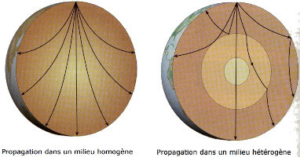

**PREM =&gt; Preliminary Reference Earth Model** est le plus connu des modèle sismologiques fournissant la distribution radiale des vitesse sismiques et de certaines autres propriétés physiques.

La Terre présente donc des discontinuités de vitesse et masse volumiques, ça provient de la chimie et/ou la structures matériaux qui changent en profondeur

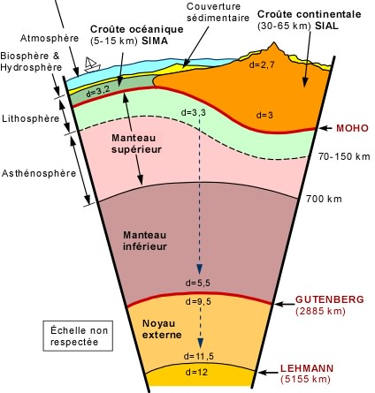


Discontinuité de Lehmann  
Discontinuité de Gutenberg  
Discontinuité de Mohorovic


**Tomographie sismique**  
Méthode des année 80 qui a permis le développement de **l'imagerie** de la Terre à partir de l'analyse des variations latérales de propriété sismiques.  
Une variation positive des vitesses sismiques, par rapport à un modèle de référence, se traduit comme la traversée par les ondes d’un milieu plus froid que celui présumé \(et inversement pour les variations négatives\).  
Si $$\Delta V>0$$, zone rapide donc plus dense ou relativement plus froide  
Si $$\Delta V < 0$$, zone lente donc moins dense ou relativement plus chaude  
La dichotomie de surface entre continents et océans se poursuit sismologiquement en profondeur jusqu'à 300 km. Le manteau sous-continental est en général plus épais et plus froid que celui des océans, du moins dans les zones cratoniques.

#### La minéralogie

L'étude de certains échantillons terrestres \(et des météorite\) permet de connaître la nature minéralogique, pétrographique et géochimique de certaines enveloppes.   
**Enclume de diamant**  
Le minérale étudier est placé entre 2 diamants dans un trou \(environ 200um de diamètre\).Permet de simuler une augmentation de chaleur et de pression  
La discontinuités sismique du manteau ont associés aux changements de phase de l'olivine.  
La compression d'une olivine, permet de le changer de phase allant de Olivine $$\alpha$$,Olivine $$\beta$$,Olivine $$\gamma$$=&gt; Pérovskite =&gt; Post-Pérovskite. C'est le composant principales des péridotites.

#### Géodésie

**Ellipsoïde**  
Science des formes et des dimensions de la Terre d'une part, de la structure interne du globe terrestre d'autre part. Rayon polaire = 6353.77km et Rayon équatorial = 6374.16Km.  
**Accélération de pesanteur**  
La gravimétrie a pour objet l'étude du champ de gravité de la Terre. De ce fait la gravité des pôles \(9.83m/ss\) et différentes que celle de l'équateur \(9.78m/ss\)  
**Surface équipotentielle**  
La surface des océans peut se concevoir comme une surface de niveau \(= « altitude gravitaire »\) qui est contrôlée essentiellement par g. La surface océanique représente à l'équilibre une partie de surface sur laquelle le potentiel de pesanteur est constant \(même g\) = **surface équipotentielle**  
Par la pensée, nous pouvons prolonger celle-ci sous les continents =&gt; **géoïde  
Géoïde**  
De nombreuses mesures gravimétriques et spatiales indiquent que le niveau zéro, correspondant au niveau moyen des mers, est en réalité une surface présentant d'importants creux et bosses \(entre -105m et +82m\)

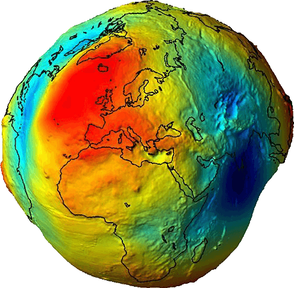


Le géoïde reflète les anomalies de répartition de masse à l'intérieur de la Terre


### Structure et composition des enveloppes internes

Les indices apportés par la géochimies, pétrologie, minéralogie cumulé à ceux de la sismologie font naître un modèle de la structure de notre planète =&gt; 

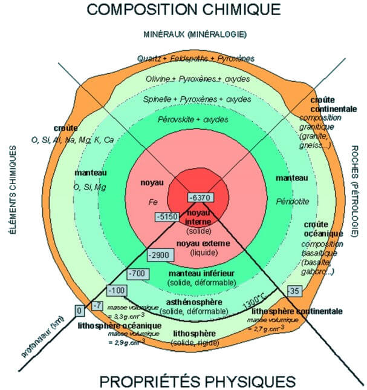

**La lithosphère continentale et océanique**  
- Enveloppe solide  
- Composée de roches variées  
- Lithosphère océanique \(100km\)  
- Lithosphère continentale \(Jusqu’à 300km d'épaisseur\)  
2 Parties sur la verticales : La croûte \(Partie supérieure de la lithosphère\) et la partie inférieure \(Partie supérieur et solide du manteau\)  
**Croûte continentale = Granite et Gneiss**  
Constitué d'une croûte superficielle \(Roche sédimentaire et volcanique\) suivi d'une croûte supérieure \(Roches métamorphiques + granitoïdes\) suivi d'une croûte inférieure \(Roche métamorphiques, granulites et roches intrusives\) suivi enfin du manteau supérieur \( Péridotites\)  
**Croûte océanique**  
Couche inférieur constitué de gabbro et supérieure de basalte

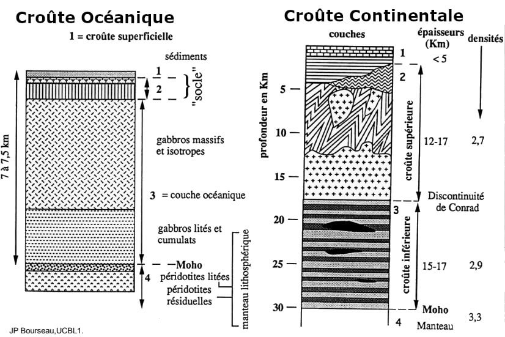

**Manteau inférieur et supérieur ?**  
Distinction déterminée par la discontinuité de la vitesse des ondes sismiques. Discontinuité liée à une transition de phases des minéraux. Zones de transition à **400 km. et 670 km.  
Manteaux lithosphérique/asthénosphérique**  
Dans la lithosphère, la chaleur se propage par conduction, alors que dans l'asthénosphère la chaleur est principalement transmise de manière convective.  
La lithosphère = couche limite thermique supérieure du système convectif mantellique. La limite lithosphère/asthénosphère correspond approximativement à l'isotherme 1300°C. La limite inférieure de l'asthénosphère est à -670 km.  
**LVZ = Low Velocity Zone**  
Au sommet de l'asthénosphère \(entre -100 et -200 km\)  =&gt; net ralentissement de la vitesse des ondes sismiques \(4,5 km/s au lieu de 5 km/s pour les ondes S\). Vitesses sismiques plus lentes car les conditions de T° et de P sont voisines de celles nécessaires à la fusion des péridotites du manteau.  
Il y a donc fusion partielle \(FP = 1% des roches\), donc diminution de la viscosité des matériaux, marque une partie plus ductile de l’asthénosphère. Sommet de LVZ = isotherme 1300°C  
**Les péridotites**  
Roche à l'état solide, sauf pour LVZ. Suivant l'échelle de temps que l'on considère, le manteau est :  
- Solide -&gt; les ondes S se propagent  
- Fluide -&gt; le manteau peut se déformer sur des échelles de temps longues  
Viscosité très élevée, mais à cause de sa grande dimension verticale, la convection est développée dans le manteau  
**Composition noyaux**  
Alliage métallique de Fer/Nickel, composé de deux parties :  
- Le noyaux externe, alliage dans un état fondu, les **ondes S** ne se propagent pas. Mouvement de convection donc champ magnétique terrestre  
- Le noyaux interne, l'alliage fondu se refroidit lentement et cristallise, donnant cette partie solide

#### Différence chimique des enveloppes de la Terre

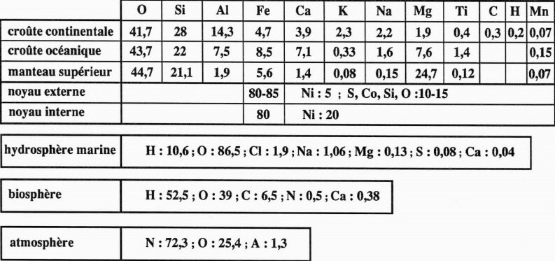

### Différenciation de la planète

**Accrétions homogène VS hétérogène**  
Accrétion homogène est le fait que la différenciation est un phénomène géologique \(Après création de la planète\)  
Accrétion hétérogène est le fait que la différenciation est un phénomène cosmologique \(Création et Différenciation en même temps\)  
L'argument majeur en faveur de l'accrétion homogène provient des météorite.

#### Apport des météorites

La proportion de métal détermine la classification pétrographique :  
- Météorites métalliques = 98% de Fer  
- Les mixtes = 50%  
- Les pierreuse = 20 à 27% \(93% des météorites découvertes\)  
Subdivision ensuite en sous-classes selon la composition, la structure et la minéralogie des météorites  
Deux types de météorite pierreuses : Les **chondrites** et les **achondrites  
Les Chondrites**  contiennent des chondres, de petites sphères silicatées, **4,55Ga ce sont les objets les plus vieux du système solaire.** Densité de 5.52, abondance des éléments réfractaire semblable à celle du soleil  
**Les achondrites**, pas de chondres, leurs composition originale à été effacée. Plus jeune de 0.02 à 0.05 Ga que les chondrites, et pas de chondrite de silicates  
**Formation des météorites**  
Le mode de formation des météorites détermine la **classification génétique**. Les mêmes classes de météorites se retrouvent dans ce système, mais elles sont distribuée différemment  
Météorites : Non différenciées \(Chondrites\) et différenciées \(Hexahédrites, Octahédrites, Ataxites Pallasites, Mésosidérites, Achondrites\)  
ou Météorite : Pierreuse \(Chondrites, Achondrites\), Métalliques \(Hexahédrites, Octahédrites, Ataxites\), Mixtes \(Pallasites, Mésosidérites\)  
Il y à donc deux type de météorite différenciées : les météorites de Fer = Sidérites et sidérolithes. Et les achondrites = Eucrites \(Basalte\) et aubrites \(péridotite\). Avec un age de 4,5 Ga

#### Différenciation noyaux / manteau

Vers 500 Km de profondeur, transition liquide/solide de la péridotite, le Fer restant liquide. Fer et Nickel sont tombé au fond par percolation, les autres éléments migrants vers la surface -&gt; Ségrégation par différence de densité. L'individualisation du noyau est inférieur à 30 Ma.   
Actuellement plusieurs millions de tonnes de Fer cristallisent chaque jour et tombent au centre du noyaux pour constituer la graine.  
**Différenciation Croûte / Manteau**  
Terre différenciée avec une proto-croûte, une atmosphère et un océan inférieur à 400 Ma. Le manteau appauvri en Fer et Nickel va ensuite se différencier avec les éléments les moins dense \(Silicates légers\) =&gt; Formation de la croûte terrestre  
**Moteur de différenciation**  
Il existent plusieurs moteurs de différenciations : Fusion partielle, contraste de densité, affinités chimiques, chaleur d'accrétion, contraction gravitationnelle, radioactivité manteau et effet de marée. Il faut une température supérieur à 2000°C =&gt; état plus ou moins fondu en profondeur.  
Contraste de densité et affinités chimiques, manteau riche en lithophiles et noyau riche en sidérophiles

#### Magnétosphère

90% du champ magnétique terrestre actuel est un dipôle géocentré, les 10% restant forme un champ non-dipôlaire. Les aurores polaire sont les témoins de ces collisions entre les particules solaire et le champ magnétique terrestre \(émissions de photons\). Le CMT protège la Terre du vent solaire.  
Les matériaux perdent leur aimantation au dessus de 600-1000°C, la température interne des planètes dépasse 1000°C à partir de 100 Km de profondeur. Il y à alors un **effet dynamo**, champ magnétique produit par les mouvements de convection d'un fluide conducteur. Dans le cas terrestre, le fluide conducteur est le fer liquide situé dans le noyau externe.

#### Convection du noyau

Origine interne -&gt; mouvement de matière dans le noyau liquide  
**La convection chimique**  
Gradients de concentration qui résultent de la cristallisation de la graine au dépend du noyau liquide, quand le fer liquide du noyau externe cristallise, le liquide résiduel s'enrichit un éléments légers et remonte.  
**La convection thermique**  
Gradients de température entre le bas et le haut du noyau externe génèrent des mouvements  
**La rotation de la Terre** a pour conséquence de structurer l'écoulement, mais pas de l'entretenir. \(Cf force de Coriolis\)  
**Force de Coriolis et géométrie de la convection dans le noyau  
Très faible viscosité** du noyau forme la dynamique dominée par la **force de Coriolis.** Etude variation du champ magnétique, modèle quantitatifs montant de grand "tourbillons" à la surface du noyau. Simulation convection dans sphère en rotation rapide, mouvement prolongés dans tout le volume du noyau, formant des **colonnes d'axe parallèle à l'axe de rotation de la Terre.**

#### Dynamo et électroaimant

L'ensemble de ces mouvement crée le C.M.T par combinaison d'un effet dynamo et d'un effet électroaimant  
**L'effet dynamo** crée un courant électrique par induction au sein d'un conducteur se déplaçant en présence d'un champ magnétique produit par un aimant permanent  
**Un électroaimant** génère un champ magnétique à partir d'un courant circulant dans un conducteur


La combinaison des deux effets permet de produire et d'entretenir un champ magnétique terrestre \(Larmor, 1919\)


### De la Terre à la vie

**Le règne d'Hadès**  
Zircons de Jacks Hills âgée  de 4,4 Ga. Le plus vieil élément terrestre connu. Ils ont des inclusions de Quartz, Biotite etc. Zircons généralement présents dans les granitoïdes. **Granitoïde** sont les principales roches de la croûte continentale, la **croûte continentale** existait bien il y a 4,4 Ga.  
**Archéen**  
Gneiss d'Acasta datés par zircons est la preuve de l'existence d'une croûte continentale à 4,06 Ga. **La plus vielle roche date de 4 Ga.** La plus grosse production de croûte continentale se passe après 2 Ga

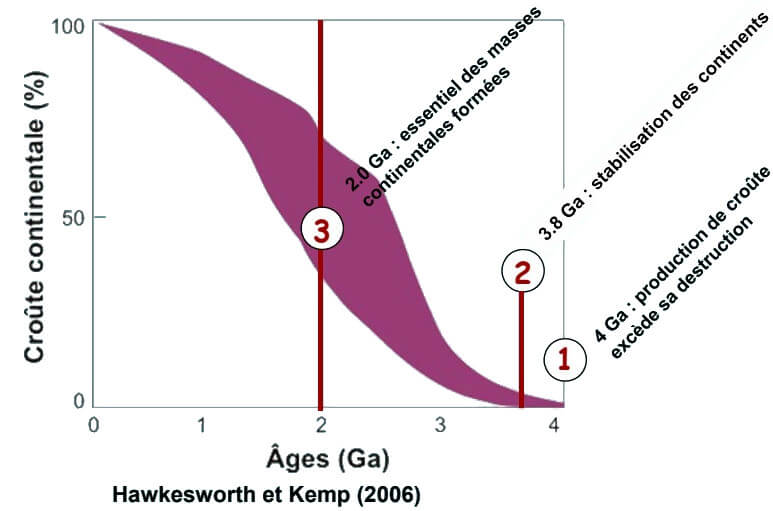

1. Elle est initiée vers 100 Ma. La croûte continentale s'est formée sur 400 Ma oour parvenir à 4 Ga à une production de croûte supérieur à sa destruction
2. A partir de 3.8 Ga, les zones de croûte continentale deviennent plus stable et ne sont plus constamment recyclée, c'est le début enregistrement
3. Pourquoi l'essentiel de la croûte continentale à été fabriquée vers 2 Ga ?

**Croûte océanique  
Roche vertes d'Isua =&gt;** Première témoignage, ceinture de roches vertes d'Isua, basaltes en coussins datés à 3,8 Ga  
**Enveloppes externes  
Atmosphère et Océan =&gt;** le dégazage de l'atmosphère et la condensation des océans, s'effectue très rapidement, moins de 400 Ma et une température de moins 1300°C.  
Dégazage =&gt; En 100 Ma, 85% de l'atmosphère était constituée \(95% de CO2\). Gâce à la présence d'océans et à la biosphère, le CO2 à été piégé dans les carbonates et l'atmosphère à été enrichie en O2. L'atmosphère primitive de la Terre ressemble à l'atmosphère actuelle de Mars et de Vénus.  
**Bombardement météorique**  
De 4,537 Ga à 3,9 Ga l'impacts des météorites, supérieur à 250 Km, vaporisent tous les océans. De ce fait la vie pérenne est possible qu'a partir de 3,9 Ga.   
**Biosphère, première trace de vie**  
Les microbes photosynthétiques présentent une anomalie en Carbone 13 négative de l'ordre de -25%°, alors que les calcaires auront des anomalie d'environ 0%°. =&gt; indice bio/géochimique  
Indice pétrochimique =&gt; Les plus vieux stromatolites 3,490 Ga. Les plus vieux micro-fossiles, 11 espèces de micro-fossiles décrites. Les plus vieux micro-fossiles sont daté de 3,465 Ga. \(Micro-fossiles se trouvent dans des brèches, à l'intérieur de veines hydrothermales\)  
**Comment passer de l’inerte à la vie ?  
La théorie de la soupe primitive :** \(Théorie d'Oparine\) Du monde minéral provient l'obtention des molécules organiques simple \(matière prébiotique\), HCN et HCHO. Expérience de Miller \(1953\), mais cette expérience n'explique pas l'apparition des molécules complexe présentent sur terre, il reste des incertitudes.

## Continent et océans

### La dérive des continents et les plaques lithosphériques

L'idée d'une dérive des continent est décrite par **Alfred Wegener** en janvier 1912, puis il la développe progressivement jusqu’à sa mort, en 1930. Wegener affirme que les continents, constitués de sial reposent sur un substratum de sima plus dense qui affleure directement au niveau des océans. Les continents, autrefois réunis en une seule masse continentale nommée Pangée, se sont dispersés pour atteindre leur position actuelle en fendant le sima qui les entoure.  
**Son modèle :** Les continents sont comme des radeaux circulant sur le manteau, fonctionne comme un brise-glace. Force motrices, marées / rotation. Les forces invoquées sont ridiculement faibles.  
**Reconstitutions**  
Ce ne sont pas les continents qui dérivent mais des plaques lithosphériques qui bougent.   
**Caractéristiques des plaques lithosphériques**  
Présence de la structure verticale, avec une lithosphère continentale et une lithosphère océanique. Xavier Le Pichon \(1968\) divisa la surface du globe en 6 plaques lithosphériques dont il détermina les frontières à partir de l’activité tectonique et calcula les pôles de rotation de leur mouvement relatif depuis 120 Ma  
En surface, leurs limites sont caractérisées par d'importants changement de reliefs \(Dorsales, Fosse océaniques, arcs insulaires, cordières, chaîne de montagnes etc\) et par la distribution des séismes et volcans actifs. Traduit aussi par le flux de chaleur dégagé par le globe. Avec une énergie dégagé de 0,08W/m2, 1% activité volcanique et sismique et 99% de flux géothermiques diffus.  
**Ages des croûtes**   
Les croûtes océaniques sont crées avant 200 Ma alors que les croûtes continentales sont âgées d'environs 2 Ga.

### La tectonique des plaques – les sites géodynamiques : du rift à la chaîne de montagne.

**Théorie de la tectonique des plaques**  
Une théorie c'est un ensemble d'hypothèse testées et "acceptées" qui prédit des faits observables, explique les observations initialement indépendantes à la théorie et qui peut être rejetée. **Dès 1930, Holmes** proposa un modèle prémonitoire au concept moderne, formalisé par Morgan en 1967.  
**Hypothèse et principes**  
La surface est composée de plaques rigides \(= lithosphérique environ 100km\). Ces plaques se déforment uniquement à leurs frontières : Rides et subduction : changement de forme. Faille transformantes : conservative. Les continents sont insubmersibles. **Les plaques naissent au niveau des rides et disparaissent au niveau des fosses.**   
**Les sites géodynamiques**  
Présent sur les dorsales, fosses, montagnes et points chauds.

#### **Zone de divergence - Du Rift à l'océan**

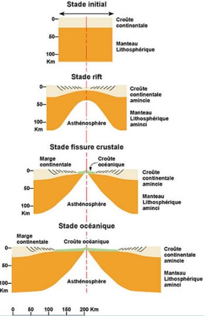

**Modèles d'extension lithosphérique**  
Le premier modèle est dérivé du modèle d’amincissement homogène de McKenzie \(1972\) : la lithosphère dans son ensemble s’amincit de manière symétrique dans la zone du rift. Ce modèle rend compte de l’évolution thermique mais ne définit pas la géométrie des structures.  
Le second modèle proposé par Lister & Davis \(1989\) est intermédiaire : la croûte s’amincit de manière asymétrique alors que le manteau supérieur s’amincit de manière symétrique.  
Le troisième modèle est dérivé des études de terrain de Wernicke \(1981\) dans le Névada : la lithosphère dans son ensemble s’amincit de manière asymétrique. Ce modèle rend compte de l’observation de grandes failles normales à faible pendage.  
Réponse isostatique asymétrique Le fonctionnement d’une faille de détachement crée une dénudation tectonique dans l’axe du rift. Le décalage du bombement thermique entraîne le soulèvement plus important d’une des marges.  
**Métamorphisme**  
Des roches métamorphiques de haute-température car amincissement crustal, granulite et cornéenne.

#### Zones en divergence - Accrétion océanique.

**Les dorsales**  
Relief sous-marin s'étirant sur 60 000 Km. Il existent 3 types de dorsales :  
- Lente, seule ce type de dorsale présente une vallée, Rift bien nette.  
- Intermédiaire \(Est pacifique\)  
- Rapide \( Vitesse d'accrétion est environ de 8 cm/an Est pacifique\), frontières en subduction, importance de la subduction dans la tectonique des plaques et, plus précisément, dans les mouvements de convection mantellique.  
**Failles transformantes**  
C’est l’activité de la dorsale qui est responsable du mouvement des failles. **Il n’y a pas décalage des segments de la dorsale parce qu’il y a des failles. Il y a des failles parce qu’il y a décalage initial des segments de la dorsale**. Une faille transformante ne décale donc pas 2 segments de ride. Elle est l’expression de l’extension d’une plaque dont la dorsale ne suit pas un cercle \(= n’est pas rectiligne\). C’est une faille géométriquement obligatoire dans l’hypothèse de plaques rigides. Deux grand type de faille, Dextre \(transformantes\) ou senestre \(Décrochantes, rides = marqueurs du déplacement\)  
Elle se trouvent le plus souvent dans la lithosphère océanique, elles permettent d’accommoder des différences dans les vitesses de déplacement des plaques, ou de faire le relais entre des limites divergentes et convergentes \(de là leur nom de failles transformantes\). **Faille de San Andreas.**


**Théorème d’Euler :** Failles transformantes = Petits cercles dont le centre est sur l’axe du pôle d’Euler


**Magmatisme**  
Décompression adiabatique -&gt; Fusion partielle des péridotites, formation de magma tholéitique avec une lave de composition basaltique, c'est du volcanisme effusif.  
**Anomalies magnétiques de la croûte océanique**  
La cartographie des fonds marins révèle des anomalies magnétiques symétriques par rapport à un axe. En 1963, Vine, Matthews et Morlay ont montré que l'existence de ces bandes d'anomalie magnétique venait supporter l'hypothèse de l’expansion océanique de **Hess**  
Le renouvellement des fonds océaniques revient à la théorie du tapis roulant de **Hess** en 1962. Ce renouvellement permet de prouver la dérive des continent. Il y à un zebre océanique

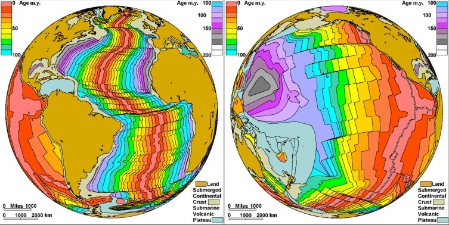

#### Zones de convergence – Subduction.

**Les Fosses**  
Répartition des fosses et vitesse de subduction.  
**Le devenir de la croûte océanique**  
La ceinture de feu du pacifique  
**Deux type de subduction**

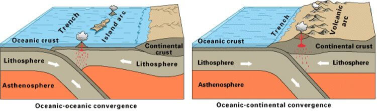

**Arc insulaires / Magmatisme / Volcanisme**  
Les foyers sismiques se répartissent le long du plan de Wadati-Benioff. Seisme superficiel \(0 -&gt; 100 km\), Intermédiaire \(100 km -&gt; 300 Km\), profond \(300 -&gt; 700 Km\). Zone de convergence création de relief, avec possibilité de faille oblique, chevauchement.  
**Géométrie arquée**  
Les courbures observées en surface ne sont qu'une partie d'un phénomène tri-dimensionnel, relié à la déformation d'une coquille sphérique plongeant vers l'intérieur d'une sphère = la lithosphère océanique subductant dans le manteau. Comparaisons avec la balle de ping-pong pliée. Selon une étude japonaise, la succession d'arcs en surface est le résultat de l'ondulation latérale du panneau plongeant. Bien entendu, chaque zone de subduction est différente et la tectonique des "coquilles sphériques" dépend également de l'épaisseur de la coquille \(= l'âge de la lithosphère\), de la longueur du segment qui plonge, mais aussi de la charge guidant la plongée \(densité de la plaque, ou/et force de traction du panneau plongeant \(slab\) déjà subducté\).  
**Structure thermique**  
Dépression des isothermes suite au transport de la lithosphère froide en profondeur \(c’est le courant froid de la convection\).

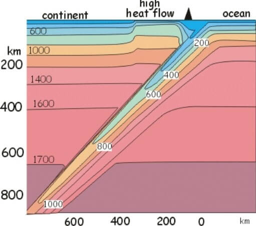

**Métamorphisme**  
Des roches métamorphique de haute pression et de faible température. Schiste verts, Schiste bleu et Eclogites. Réactions minérales de déshydratation & augmentation de la densité  
**Tomographie sismique**  
C'est par la tomographie sismique au début des années 90 que l'on a pu obtenir des images correspondant aux zones anormalement froides dans le manteau, c'est-à-dire aux plaques océaniques subductées \(Slab\). Des anomalies sismiques dans le manteau qui tracent la plaque froide et dense. Le panneau plongeant \(slab\) semble s'étaler sur la zone de transition pour la zone des Iles Kouriles \(B-B'\) et Izu Bonin \(CC’\), alors qu'il pénètre dans le manteau inférieur pour les autres cas. **La croûte océanique est plus dense que la croûte continentale.**  
**Subductions forcée vs spontanée**  
La subduction forcée, dans le cas d'une lithosphère océanique jeune et légère.  
Subduction spontanée, dans le cas d'une lithosphère océanique âgée et lourde.  
**Magmatisme**  
Avec une apport d'eau, il y a fusion partielle \(15 à 20%\) des péridotites avec une "Polution", ce qui créer un magma calco-alcalin. Lave de composition andésitique -&gt; volcanisme éruptif \(principalement émission de produits pyroclastiques, gaz\)  
**Volcanisme**  
Volcanisme explosif, mai 1980 explosion du mont St Helens \(USA\), avec 1 milliards de $$m^3$$d'éjectât et une puissance équivalent à 1600 fois Hiroshima. **Les supervolcans sont toujours associés au zones de subduction.**  
**Marge passive et Marge active**  
Volcanisme + Séisme = Marge actives. Zone d’accrétion VS zone de subduction. La terre à un volume constant.

#### Zones de convergence - collision

Zone de convergence du mont blanc à l’Everest, Himalaya et Alpes beaucoup étudié. Épaississement du à un raccourcissement, plis peuvent casser, anticlinal chevauche clinal.  
Deux grand ensemble de témoins, soit lier à la subduction soit lié à la collision. Lambeau de collision appelé ophiolite  
**Remonté de l'inde** et collision à 55Ma \(fin de la subduction océanique = entrée du continent dans la zone de collision\), plan de subduction doublé.  
**Chaine hymalayenne** magmatisme de marge continentale active  
**Obduction et Ophiolites** age variable de 2Ga à 2Ma, témoins de la collision sont notamment les granites, les chevauchements suivi d'un épaississement et des décrochements.  
Chaîne de collision vraiment différente de chaîne de subduction \(cordillères\)

#### Les points chauds

La convection thermique dans le manteau terrestre se manifeste en surface par la tectoniques des plaques mais aussi par le volcanisme de type "Point Chaud" dont l’Islande est un excellent exemple.  
Données tomographique, cette anomalie topographique est l'expression d'une anomalie de vitesse identifiée par tomographie jusqu’à 2800 km de profondeur. Ce panache qui remonte à l’état solide est plus chaud de quelques centaines de degrés que le manteau environnant. Il provoque le bombement de la surface lithosphère observé en surface sur plus de 1000 Km de diamètre.  
Dans la mer, comme prés d’Hawaï, cela ce traduit par un alignement d’île \(chapelet\). On retrouve ce genre de disposition d'île appelée chaînons volcaniques.  
**Le magmatisme,** magma de type alcalin, avec des laves de composition basaltique et avec un volcanisme effusif.  
Trapps du Deccan il y a 65Ma. Courtillot en 1995 aurai proposé l'hyposthèse qu'un lien existerai entre la mise en place des différent plateau basaltique, aurai changer la température de la terre et perturbé l’équilibre de la biosphère et des phase d'extinction.  
**Condition de métamorphisme**

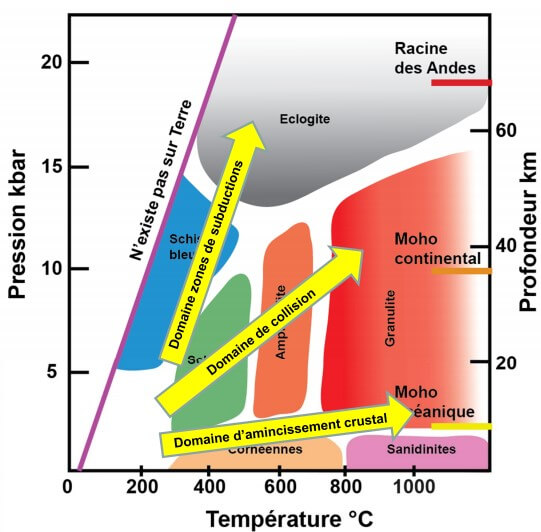

**Condition de la fusion**

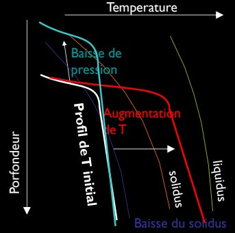

#### Convection mantellique

La théorie de la tectonique des plaques veut que la lithosphère soit constituée de plaques rigides en déplacement sur un manteau déformable en convection.  
**La tectonique des plaques est une manifestation en surface de la convection mantellique.** Un système convectif est un déplacement de matière lorsque la densité est plus élevé en haut qu'en bas, le principe de la poussée d'Archimède, le gradient de densité inverse peut intervenir par la salinisation des milieux \(Le sel ajoutant densité et faisant descendre la matière\), mais le plus souvent ce gradient est du à des différence de température, froid et dense descende et chaud est peu dense remonte.   
L'intensité de la convection dans un corps donné est fonction :   
- de l'énergie thermique à évacuer, c'est le moteur de la convection  
- de la capacité des matériaux à se déformer et à s'écouler \(Rhéologie\)  
La convection s'établit lorsque le rapport des **forces motrices** sur les **forces visqueuse,** rapport appelée nombre de Rayleigh, dépasse une certaine valeur. Si Ra &gt; 2000 alors la convection peut démarrer, sinon il ne se passe rien. **Pour le manteau de la Terre, Ra proche de la valeur critique -&gt; Convection extrêmement lente.**  
Chaleur initiale \(accrétion\) + radioactivité.  
L'allure du gradient de température dépend de la source de chaleur   
Différentes hypothèse de chauffage, en dessous ou interne, ne sont pas correct car non reproductible lors d'observation de terrain, chauffage mixte =&gt; 10% chauffe en dessous et 90% chauffe interne, couche   
**Tomographie**  
Convection mantellique, via la tomographique, tend à prouver que le manteau est mono-couche. Certains courants froids semblent s'étaler à la frontière Minf/Msup \(660km\), étape transitoire avant d'atteindre la limite Noyaux-Manteau  
**Géochimie,** confirme la présence d'un manteau géologique unique pour la planète  
**Effet des continents,** épais et froids, ils ont un effet de couvercle isolant sur la convection, en raison de sa faible épaisseur, la lithosphère océanique évacue un fort flux de chaleur \(100m&gt;/m2\)  
Les continents :   
- Organisent la convection chaotique en cellules convectives de dimensions comparables à celles des continents  
- peuvent avoir un rôle dans la formation des zones de subduction en bordure des continents  
- ont un rôle important dans la rupture des continents  
**Rhéologie** : pour une quantité de chaleur donnée à évacuer, l'intensité de la convection dépend de la capacité du corps à s'écouler \(viscosité\) -&gt; plus le corps est visqueux, plus il va convecter lentement. Malgré l'état solide des roches, à l’échelle du temps et de sa dimension, on considère que le manteau peut se déformer, lentement. L'eau à un effet très important sur la rhéologie. \(Plus une planète est grosse moins elle perd de chaleur en surface\)


La convection qui agite le manteau est déterminée par :  
- la quantité de chaleur produite par le manteau \(radioactivité\) -&gt; masse planète  
- les conditions aux limites, c'est à dire le flux de chaleur interne provenant du noyau à la limite M/N, et les conditions thermiques à la surface des lithosphères  
- les plaques en subduction \(le courant froid des cellules =&gt; le moteur\)  
- la capacité des roches à s'écouler =&gt; leur viscosité


La tectonique des plaques une théorie unificatrice  
Ce n'est qu'a partir de l'hypothèse de l'expansion océanique formulée par Hess \(1930, les fonds océaniques s'étalent de part et d'autre des dorsales\) et des travaux de Vine, Matthews et Morley \(début des année 60\) sur le paléomagnétisme \(anomalies de l'intensité magnétique sur les fond océaniques sont dues aux inversions de polarité magnétique\) qui ont abouti à la formulation de la théorie de la tectonique des plaques par Morgan, MacKenzie et Parker \( 1967-1968\), que la convection mantellique à pu recevoir un large écho dans la communauté scientifique.  
**Cyle de Wilson** , cycle orogénique \(orogénèse\), ensemble des événements géologique associés à l'ouverture puis à la fermeture d'un domaine océanique.  
**Les orogénèses en France,** orogenèse cadomienne \(660-540Ma\) Bretagne nord, orogenèse varisque \(400-250Ma\) Massif armoricain, massif central, Vosges et Ardennes, orogenèse Alpine \(100Ma - actuels\), Alpe et Pyréné.

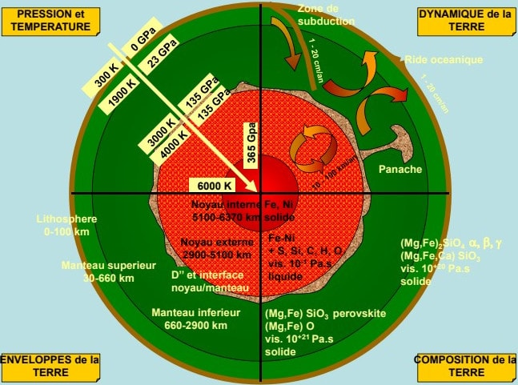

## Atmosphère - hydrosphère et climats

### Composition et structure des enveloppes fluides

#### Atmosphère

L'atmosphère est composé principalement d'azote et d'oxygène, de 0,04% de CO2 et 0,9% d'autre gaz. L'atmosphère contient également de la vapeur d'eau en provenance de la surface du globe par évaporation de l'eau, sublimation de la glace et évapotranspiration des végétaux. Cette quantité de vapeur d'eau décroît avec l’attitude, quantité plus grande vers l’équateur qu'aux pôles. L'atmosphère contient aussi des impuretés d'origine très variées.  
L'atmosphère est constitué de plusieurs structure : **Troposphère**, **stratosphère**, **mésosphère**, **thermosphère** et **exosphère**, structure résultante de **deux facteurs**, la **gravité** et la **température**.  
La température dépend de la distance terre soleil et est donc indépendant de la Terre. Les 9/10 de la masse de l'atmosphère sont situés dans les 16 premiers km, cette enveloppe ne forme donc qu'une mince pellicule gazeuse en comparaison des 6367 km du rayon terrestre, ce qui correspond à une fine pellicule. La pression est donc environ 1 kg pour 1 cm2, cette valeur diminue de moitié en haut du mont blanc et environ du tiers en haut de l’Everest.  
Les limites des différentes couches atmosphériques sont déterminées par les variations de températures qui sont liées à la composition chimique de cette enveloppe et de différents sources de chaleur entre le sol et les hautes altitudes.  
**Troposphère**  
La température de l'air y décroit de 6,5 degrés par km jusqu’à la tropopause. Ce gradient de température est lié au faut que cette partie de l'atmosphère est chauffée par le bas, c'est à dire par le rayonnement infrarouge terrestre émis par le sol et absorbé par le CO2 et la vapeur d'eau atmosphérique, absorption transformée en partie en chaleur. Avec l'altitude d'une part on s’éloigne de la source de rayonnement infra rouge et d'autre part l'air est moins concentré est donc moins absorbant aux IR. Vu le gradient de la température de la troposphère, l'air chaud peu dense est situé sous un air froid plus dense, ce gradient de densité inverse va entraîner une convection.  
**Stratosphère**  
La température est stable autour de -55°C puis augmente pour atteindre un maximum autour de 10°C vers 50Km d'altidude. Dans la stratosphère l'air est chauffé par le Soleil via l’absorption des UV. La stratosphère est donc plus **chaude dans sa partie supérieur** que dans sa partie inférieur où le rayonnement solaire UV est moindre \(car filtré par l'ozone\). L'air étant moins dense dans la partie supérieur, il n'y alors pas d gradient de densité inverse, ce qui rend cette enveloppe stable, stratifié \(d'ou son nom\), sans convection.  
**Mésosphère**  
Au niveau de la mésophère, les molécules sont rares, ce qui rend l'atmosphère quasi-transparente au rayonnement solaire, UV compris. L'absorbtion des rayons est donc faible et la T° de l'air diminue  
**Thermosphère**  
Au niveau de la thermosphère, le rayonnement solaire provoque la photo-dissociation et photo-ionisation des molécules d'oxygène qui dégage de la chaleur.

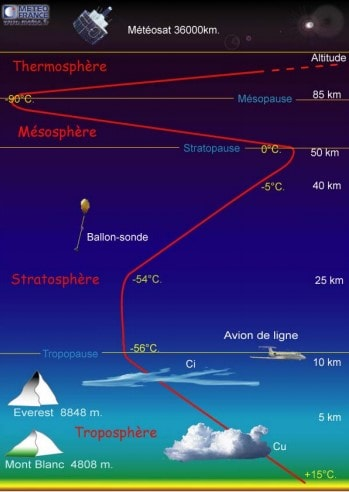

#### Hydrosphère

L'hydrosphère est essentiellement composé d'eaux salée, et 2,5% d'eau douce. Les **2/3 de l'eau douce est sous forme de glace**, **1/3 restant sont dans les sous sol** \(nappe phréatique\) et **0,39%** est sous forme de lac, vapeur d'eau etc etc.  
L'eaux salées recouvre 71% la surface de la terre sous forme d'océan.  
L'ocean =&gt; mince pellicule, l'eau de mer est à 96,5% pure + 3,5% d'autre substance comme les sels, les gaz dissous, les substances organiques et des particules solides.  
**Les sels dissous,** en moyenne la mer à une salinité de 35g/kg, principalement le Cl, le sulfate et le sodium. La concentration totale des sels dissous varie en fonction du lieu. Mais la proportion des composants les plus importants reste à peu près constante, ce qui permet de prouver un mélange des eaux océaniques. Il y a un équilibre entre les sels amenés par les cours d'eau et ceux extraits.  
50% des eaux océaniques ont une salinités compris entre 34,6 et 34,7. Les eaux sont plus salées dans les zone intertropicales \(37\) et moins salées aux hautes latitudes \(33\).   
Il y à 3 couche différentes dans l'océan :   
- **La couche de surface** \(couche de mélange\) de 50 à 200m d'épaisseur ou les température sont à peu près celle de la surface  
- **La couche thermocline** de 200 à 1000 m d'épaisseur, dans laquelle la température décroit rapidement avec la profondeur \(Sauf haute latitudes ou la T° de surface avoisine de celle du fond\)  
- **La zone profonde**, qui s'étend jusqu'au fond, caractérisé par des température faible et homogène

### Dynamique de surface et climats : Bilan radiatif

#### Le flux solaire \(Bilan radiatif\)

Le flux solaire reçu au niveau d'une planète dépend :   
- de la puissance intrinsèque de l'étoile  
- de la distance planète-Soleil \(1/d²\)  
à 1 unité Astronomique \(d = Terre-Soleil\), l'éclairement énergétique est de **1360 W/m²**. C'est la puissance reçue par une unité de surface.  
Le rayonnement solaire incident reçu au toit de l'atmosphère terrestre est seulement de 340 w/m² , qui correspond a la surface d'un cercle \( soit 1/4 de la sphère\).  
**Le soleil est donc la source d'énergie** principale qui règle les mouvement de l'océan et de l'atmosphère et donc notre climat. Les conditions de la vie sur terre dépendent aussi essentiellement de l'énergie reçue du soleil.  
Une partie du rayonnement solaire incident est réfléchie vers l'espace \(**environ** 110 W/m²\) à cause de l’albédo. L’absorption de la partie non réfléchie du rayonnement solaire **\(230 W/m²\)** réchauffe le système Terre.  
**Spectres du rayonnement solaire vs terrestre**  
Tout corps émet un rayonnement électromagnétique dont le spectre dépend  de la température de ce corps. Le rayonnement du soleil est émis par sa surface dont la température st environ 5800°K. A cette température, la puissance spectrale est maximale entre 0,3 um \(Violet\) à 0,7 um \(Rouge\), c'est à dire que le spectre du rayonnement solaire est centré sur le domaine de la lumière visible. La terre absorbe puis restitue l’énergie solaire en partie sous forme de rayonnement lumineux, puis que la température de la Terre au sol est environ de 255°K, notre planète émet de l'énergie dans le domaine infra rouge.  
**Mais la terre à une atmosphère avec une certaine composition chimique, notamment des gaz à effet de serre.** L'équilibre climatique de la Terre est assuré car l'ensemble Terre-atmosphère renvoie vers l'espace une énergie égale à celle reçue du soleil.  
**La terre possède une atmosphère,** dont la composition chimique définition spectre d’absorption. Les gaz de l'atmosphère sont transparents au rayonnement solaire et absorbent partiellement le rayonnement infra-rouge terrestre.

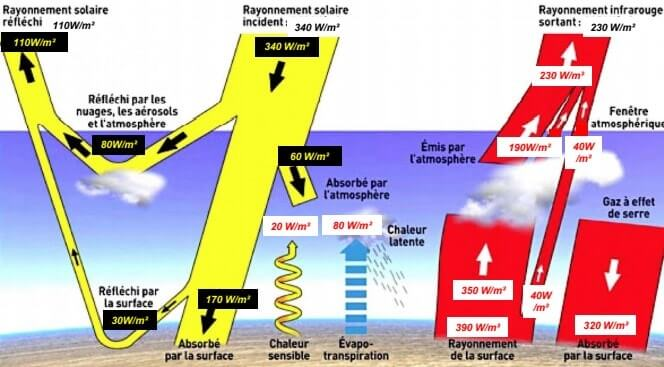

Les radiations émise vers la Terre la réchauffe et augmente la température de la surface terrestre de 33°C -&gt; C'est l'effet de serre.  
Ne pas confondre effet de serre naturel et l'effet de serre anthropique, qui pourrais aggraver l'équilibre des température et augmenter les températures de la terre.

###  Déséquilibre de température et circulations des masses fluides

L'ensoleillement est plus élevée aux tropiques qu'aux hautes latitudes. La terre n'est pas uniformément chauffée, il y a un déséquilibre thermique. La quantité totale d'énergie reçue en un jours et en un lieu dépend de 2 facteurs : l'angle d'incidence des rayons solaires et la durée d'insolation/jour  
**Effet de la rotondité  de la Terre :**   
- plus l'inclinaison des rayons solaires est importante, plus la surface balayée par la même quantité d'énergie est grande  
- Plus faible ensoleillement  
**Effet de l'inclinaison de l'axe de rotation de la Terre,** le phénomène des saisons détermine aussi la quantité d'énergie reçue à la surface de la Terre à chaque latitude. \(équinoxe de septembre, solstice de juin, équinoxe de mars, solstice de décembre\)Détermine aussi la durée du jour.  
La différence de quantité d'énergie solaire reçue entre les hémisphères boréale et australe sont liées aux variations de la distance terre-soleil au cours d'une révolution \(Périhélie vs Aphélie\)  
**Déséquilibre thermique**  
La variation latitudinale d'ensoleillement se traduit en un rayonnement solaire \(longueurs d'onde dans le domaine du visible\) qui excède le rayonnement infra-rouge tellurique émis par la terre dans la bande tropicale.  
L’excès de chaleur reçu par la ceinture tropicale est à l'origine des grands traits de la circulation de l'atmosphère \(les vents, les régions de hautes et basses pression, les vastes mouvement nuageux\) et les océans. Par ces mouvements, l'atmosphère et l'océan transportent d'énormes quantités de chaleur "nécessaires" à équilibrer en latitude le bilan radiatif terrestre.  
**Circulation méridienne**  
Si la vitesse de rotation de la terre était nulle, la cellule de Hadley serai parfaitement symétrique et s'étendrait au pôles, avec un système convectif qui ferai des courant chaud ascendant vers les pôles et courant descendant froid vers l’équateur =&gt; **Cependant la terre est en rotation !**  
Avec la vitesse réelle de rotation de la Terre, il y a l'effet de **Coriolis** qui va modifier la trajectoire des masses fluides.  
La force de Coriolis est une force inertielle agissant perpendiculairement à la direction du mouvement d'un corps en déplacement dans un milieu \(un référentiel\) lui-même en rotation uniforme, vu par un observateur partageant le même révérenciel.



**L'effet Coriolis**

Le trajet initial est bien suivi, mais comme la Terre à tourné l'objectif n'est pas atteint

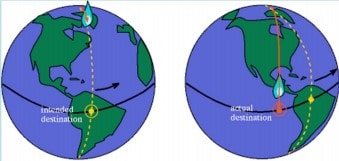

Déviation apparente des vents causée par la rotation de la Terre, vers la droite dans l’hémisphère nord et vers la gauche dans l’hémisphère sud. La force de Coriolis augmente avec la latitude \(Quasiment nulle à l'équateur\)  
L'effet de Coriolis fragmente le système convectif atmosphérique équateur-pôle en 3 cellules majeures -&gt; **Circulation Tricelluaire méridienne.** Cette circulation tri cellulaire méridienne définit les grandes zones climatiques. La présence de cellules est au Nord et au Sud de l'équateur, elle forment une zone de convergence au niveau de l'équateur, appelée **ZCIT, zone de convergence Inter-Tropicale** \(Equateur météorologique\), cette zone subis des mouvement au cours de l'année est peut donc être décalé par rapport à l'équateur, elle dépend de la quantité d'ensoleillement, donc des saisons. Cette graduation influe sur les chaleurs au zone impliqué et donc la végétation.  
**Les alizés**  
La forte rotation planétaire explique les composantes zonale \(= Vent Est et Alizés\), C'est à cause de la Force de Coriolis que les mouvement d'air de retour à basse altitude dévient vers l'Ouest.  
**Les dépressions,** influé par la force de Coriolis.  
**Circulation océanique de surface**  
Rôles des vents :   
- l'action des vents se fait sentir jusqu’à 800 m de profondeur  
- Alizés, vents ouest, vitesse moyenne courant de surface. En générale quelques cm/s ou dcm/s  
Rôle de la force de Coriolis : Gyres anticyclonique et cycloniques : les courants décrivent de grands mouvements tournants "Gyre"  
Rôle des continents : effet de la topographie, des bordures continentales  
**Circulation thermohaline \(Circulation profonde des océan\)**  
Température et salinité, paramètres permettant de déterminer la densité des eaux océaniques, densité, paramètre fondamental dans la dynamique des océans. Circulation océanique globale, profonde, liée à la température et à la salinité des masse d'eau. Vitesse moyenne courants profonds : ~mm/s  
Une molécule d'eau fait le circuit entier en environ 1000 ans, lorsque les eaux denses du Gulf Stream \(car salinité très élevée\) arrivent en mers de Norvège et du Groenland, elle subissent un brusque refroidissement qui augmente encore leur densité -&gt; plongée des eaux.  
Un courant d'eau caractérisée par une forte salinité, entre 2000 et 3500 m de profondeur, parcours tout l'océan Atlantique.

### Interactions entre enveloppe

Les enveloppes fluides sont différentes en termes de dimension physique, composition chimique mais aussi en capacité énergétique.  
Les océans ont 1200 fois la capacité de stockage de chaleur de l’atmosphère. ll faut donc 1200 fois plus d'énergie pour chauffer de 1°C l'océan que l'atmosphère.   
**Cyclone tropical**  
Le cyclone est une machine thermique dont l'énergie provient de la chaleur lente libérée par la condensation de la vapeur d'eau. Cette chaleur réchauffe l'air, il se produit une dépression près de la surface océanique à l'origine d'un flux d'air rapide vers le cœur de la dépression. En pénétrant sur terre, son énergie tend à décroître rapidement. Une forte humidité es indispensable. Les cyclones se forment au dessus des eaux tropicales entre 5° et 20° de latitude, à l'exception des régions du sud-est pacifique et de l'atlantique sud. Etre suffisamment éloigné de l'équateur de façon à ce que la force de Coriolis ne soit pas nulle.  
**Salinité élevée du Golf Stream**  
Les eaux qui s'évaporent de l'atlantique, essentiellement dans la mer des caraïbes, sont entraînée vers l'est par les Alizés, passent l'isthme de panama et retombent sous forme de pluie dans le pacifique équatorial est, perte d'eau pour l'atlantique, forte salinité des eaux du golf stream qui ont pour origine la mer des caraïbe. Il y a alors migration vers le nord, l'évaporation est importante.

#### Interactions atmosphère hydrosphère et lithosphère

Les reliefs de la lithosphère issus de la tectonique des plaques subissent une érosion liée à des processus physico-chimique de surface. LA dynamique interne de la terre fabrique des reliefs \(Orogenèse\) et la dynamique externe de la planète les détruit.  
Deux facteurs déterminant, l'énergie solaire et l'énergie gravitationnel, dans l'érosion, le transport et la sédimentation des particules arrachées aux continents.  
Dynamique interne -&gt; Tectonique -&gt; Pente -&gt; gravi té -&gt; transport et sédimentation  
Dynamique externe -&gt; Climat -&gt; Eau, vent -&gt; Processus physique-Chimique -&gt; érosion et transport  
**Cycle des roches**   
L'érosion \(altération chimique et mécanique, rôle du climat\), le transport \(eau, glacier, vent, pente, bilan des flux sédimentaire\), la sédimentation \(océanique détritique et biogène\), la diagénèse \(des sédiment à la roche\), Roche \(carbonaté et silicatées\) et climats.  
**Érosion des roches**  
L'érosion des roches comprend deux processus qui interagissent, l'altération chimique \(hydrolyse et dissolution\) et la désagrégation mécanique \(fracture, cryoclastie, thermoclastie, abrasion\), **l'eau est le principale agent de l’érosion.** Le climat est probablement le facteur le plus important dans le contrôle de l'altération chimique. Si l'on considère en effet l'aspect cinétique des réactions chimiques, une température élevée va les favoriser.  
Hydrolyse -&gt; échange de cations \(les plus solubles\) entre l'eau et les silicates. Il y a une altérabilité différentielle des silicates.  
**Arénisation** -&gt; formation du sable à partir d'une roche magmatique plutonique sous l'effet de l'hydrolyse. En climat tempéré humide, quartz et muscovite sont inaltérable.  
**Latérisation** -&gt; En climat tropical, dans les condition optimales de drainage, les minéraux sont fortement détruit, la silice peut être presque totalement éliminée de la zone superficielle où dominent par concentration relative les oxydes de Fe et Al formant des **cuirasses latéritiques**.

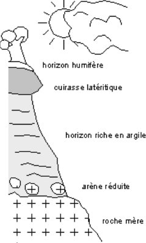

**Désagrégation mécanique**  
Elle prépare et amplifie le processus d'altération chimique. Les granites sont imperméable en tant que **roche** mais perméables en tant que **formation** par le réseau de fracture/cassures \(**faille, diaclases, fentes**\) qui les découpe \(perméabilité de fissures\)  
**Cryoclastie -&gt;** en devenant de la glace l'eau provoque des fissures dans les blocs de roches qui provoque leur chute.  
**Dissolution -&gt;** Le CO2 joue un rôle en déplaçant l'équilibre de dissociation de l'eau vers la production H+. La solubilité des minéraux croît avec la temérature sauf pour les carbonates  
**Karstification -&gt;** Aptitude des calcaire à la dissolution, modèle karstique ou **karst**. Les Karts se forment dans les zone de **fortes précipitations annuelles**. L’Europe est le continent le plus karstique \(13,5% de la surface\). L'Asie à le plus vaste Karst \(1,6 M de Km²\). **Lapiez** \(Couloir de dissolution\), **Dolines** \(Cuvertte de dissolution avec argiles de décalcification\), **Avens** \(Gouffre s'ouvrant sur cavité souterraine\), **Reliefs ruiniformes** \(Dissolution différentielle de calcaire dolomitiques\)

#### Transport

**Transport fluviatile**  
L'eau \(liquide\) est un agent de transport majeur. Fonction de la granulométrie des matériaux, sous 3 formes :   
- Charge de fond \(&gt;0.5mm, galets, graviers, par traction, saltation ou roulement\)  
- Suspension \(0.5mm - 0.5 um, sables moyen et fins, silts argiles\)  
- Dissoute \(en solution &lt; 0.5 um : ions\)  
Le flux solide \(80%\) domine largement le flux dissous \(20%\), zone de production &gt; 500t/km²/an \( Sud Est Asie\), les moins productrice &lt; 10t/km²/an, boucliers arctiques, région semi arides. Bonne corrélation entre transport sédimentaire et l’attitude moyenne des continents.  
Le transport des sédiments se fait aussi grâce aux glaciers \(Capable de déplacer de gros blocs\)  
**Formation péri-glaciaires**  
Les moraines sont des sédiments meubles, hétérométriques et non granoclassés, constitués de fragments de roches d'origine variés et de sables, souvent avec une composante argileuse importante. Le cordons morainiques indiquent l'avancée maximale du glacier à un moment donné.  
Les dépôts fluvio-glaciaires sont des accumulations de galets et de sables plus ou mins argileuses, issus du démantèlement de moraines par les eaux de fontes des glaciers. Déplacement de bloc erratiques.  
**Transport éolien** , le vent est aussi un agent de transport, celui-ci de petite particule et petite taille \(sable, argile\)  
**Le loess,** est un dépôt argilo-calcaire et silteux \(particule très fine\), souvent de couleur jaune, c'est un dépôt continentale et d'origine éolien. On parle souvent de limon des plateaux. Ces dépôts sont de nature périglaciaires. Leur présence témoigne de l'existence de glaciers. Trouvable même dans les zone périphérique.  
**Mouvement de pentes,** déplacement via la gravité.

#### **Sédimentation océanique**

**Fraction détritique**  
Vidéo Chap 5 Part 4.5  
**Fraction biogène**  
Sécrétion squelette carbonaté via la biosphère. Produit ainsi une boue carbonaté volatile et permet le déplacement. Production aussi de silice, par la création de té siliceuse.  
**Distribution des sédiments océaniques**  
La distributions des sédiments marins dépend principalement de 3 paramètre :  
- **La distance aux continent :** L'épaisseur des sédiments est généralement plus importante sur les PTF continentales, car celle-ci sont proches des continents que ne le sont les fonds marins. Ces endroits correspondent donc en générales aux taux d'accumulation sédimentaires les plus élevés. La contribution des particules détritiques diminue avec l'éloignement aux continent et correspond alors aux particule argileuse.  
- **La productivité primaire :** elle est représentée principalement par le phytoplancton et donc la chlorophylle. C'est une des plus grandes sources de sédiments. Cet apport sédimentaire biogène est donc localisé aux régions de plus grande productivité primaire, qu'elle soit carbonatée ou siliceuse. La distribution de la chlorophylle à la surface des océans dépend surtout de la disponibilité en nutriments et se développe donc dans les zone upwellings, dans les eaux de hautes latitudes et dans les contre-courants équatoriaux qui s'écoulent, d'est en ouest.  
- **La colonne d'eau :** La bathymétrie influence directement la nature des sédiment car elle co-varie avec la profondeur de compensation des carbonate \(CCD\), c'est à dire la profondeur à partir de laquelle les particules carbonatées sont toutes dissoutes. Cette profondeur varie pour chaque océan en fonction de la ventilation des eaux profondes atteignant les plus grandes profondeurs dans l'océan Atlantique.  
Les régions proches des continents sont caractérisées par des sédiments détritique. Les régions de productivité primaire élevée sont caractérisées par des sédiments biogénétique carbonatés ou siliceux. Les régions les plus profondes, qui se situent en dessous de la CCD, sont caractérisées par des dépôts de type argiles rouge.  
**Diagénèse**  
Processus chimiques et mécaniques qui affectent un sédiment après son dépôt. Après un dépôt, un sédiment subit une diagénèse et devient une roche sédimentaire. Elle se rapporte à l'ensemble des modifications physico-chimique que subit un sédiment après un dépôt, dans les conditions de pression et températures "faibles" qui règnent en environnement sub-surface. Phase de compactions puis une phase de lithification.

#### Roches et climats

Il y a une relation entre le CO2 et la variation de températures. Tous les modèles indiquent qu'une augmentation de CO2 atmosphérique induit un réchauffement climatique.  
**Roche carbonatées et teneur en CO2**  
La précipitation des carbonates pièges du carbone sous forme de roche calcaire, cette réaction libère une mole de CO2. La reaction d'altération des carbonates sur les continent est l'inverse de celle précipitation du carbonate océanique. A longue échelle de temps, le CO2 atmosphérique qui est prélevé de l'atmosphère par l'altération des carbonates est  libéré dans l'oc"an par la réaction de précipitation des carbonates. **A l'échelle géologique, la réaction d'altération des calcaires ne sert à rien pour la régulation du CO2 atmosphérique.**  
**Roche silicatées et teneur en CO2**  
L'altération des calciques et sodique consomment 2 moles de CO2. Mécanisme capable à très long terme de pomper efficacement du CO2 atmosphérique et précipité d'importante quantités de calcaires dans les océans. Autrement dit du CO2 atmosphérique à été transformé en CO2 lithosphérique \(calcaire\)  
**Tectonique et glaciation**  
Les variation de la teneur en CO2, via la théorie de Raymo \(1988\), suite à une orogenèse, il y aurai une altération des reliefs -&gt; consommation de CO2 atmosphérique -&gt; qui diminue l'effet de serre et la température atmosphérique -&gt; engendre des glaciation. A certaine période de la terre il y a eu une grande activité volcanique qui entraîne l'augmentation de l'effet de serre.

## Définition


**Minéral :** Qualificatif employé pour designer des molécules qui ne contiennent pas de carbone associé à des atomes d'hydrogène

**Galaxie :** Nébuleuse spirale dans laquelle se trouve notre soleil.

**Nucléosynthèse :** Formation des éléments chimiques dans l'Univers

**Radioactivité :** Propriété que possèdent certains éléments de se transformer  en un autre élément à la suite de la désintégration spontanée du noyau atomique par émission de rayonnement électromagnétiques ou corpusculaires

**Fusion :** Passage directe d'un corps  de l'état solide à l'état liquide

**Système solaire Interne / Externe :** Le Système solaire interne est une division du Système solaire. Il s'étend du Soleil, centre du Système solaire, jusqu'à l'orbite de Jupiter qui constitue sa limite extérieure, il contient donc les planètes Mercure, Vénus, Terre et Mars en planète tellurique. Par opposition, le Système solaire externe est constitué du reste du Système solaire, en particulier les géantes gazeuses, la planète naine Pluton, la ceinture de Kuiper et le nuage d'Oort.

**Ophiolites :** portions de lithosphère océanique mise en place tectoniquement sur la lithosphère continentale

**Albédo :** pouvoir réfléchissant d'une surface

**Crustal :** qui se rapport à la croûte terrestre

**Décrochement dextre** : lorsque l'observateur faisant face à la faille voit l'autre compartiment glisser vers sa droite


