# Math

## Base math

### Ensemble mathématique

| N | Ensemble des entiers naturels | 0,1,2,3 |
| :--- | :--- | :--- |
| Z | Ensemble des entiers relatifs | -3,-2,-1,0,1,2,3 |
| D | Ensemble des nombres décimaux relatifs | Nombre entiers relatifs ET nombre à virgule flottante, positifs ou négatifs |
| Q | Ensemble des nombre rationnels | Nombre décimaux relatifs et nombre, quotient de deux entiers relatifs. Le dénominateur étant non nul |
| R | Ensemble des nombres réels | Nombre rationnels et nombre avec décimal infini |

### Droite

Une droite est une fonction affine $$f(x) = ax+b$$ de coefficient directeur $$a$$ \(pente\) et d'ordonnée à l'origine $$b$$  
Le coefficient directeur a de la droite \(AB\) correspond à l'accroissement \(ou la diminution\) de y lorsque x augmente de 1  
L'ordonnée à l'origine b de la droite \(AB\) correspond au point de la droite d'abscisse 0


Soit $$A(x_a;y_a)$$ et $$B(x_b;y_b)$$ deux points \(avec $$x_A \neq x_B$$ \) alors la droite \(AB\) admet pour équation réduite :

$$y = ax+b$$ avec $$a = \frac{y_B-y_A}{x_B-x_A}$$ et $$b=y_A - ax_A$$ 


### Equation algébrique

#### Trois identité remarquable


$$(a+b)^2=a^2+b^2+2ab$$   
$$(a-b)^2=a^2+b^2-2ab$$   
$$(a+b)(a-b)=a^2-b^2$$ 


#### Résolution

Une équation du second degré est de la forme $$ax^2+bx+c=o$$ avec $$a \neq 0$$ 


On recherche les valeurs de $$x$$ qui annulent l'équation. Pour ce faire, on calcule le discriminant $$\Delta = b^2-4ac$$ 

Si $$\Delta < 0$$ , pas de solution  
Si $$\Delta = 0$$ , une solution unique : $$x= \frac{-b}{2a}$$   
Si $$\Delta > 0$$ , deux solutions : $$x_1=\frac{-b+\sqrt\Delta}{2a}$$ et $$x_2=\frac{-b-\sqrt\Delta}{2a}$$ 

Suite à ce discriminant la forme factorisé est donc $$(x-x_1)(x-x_2)$$ 


### Dérivées

#### Tableau dérivées usuelles

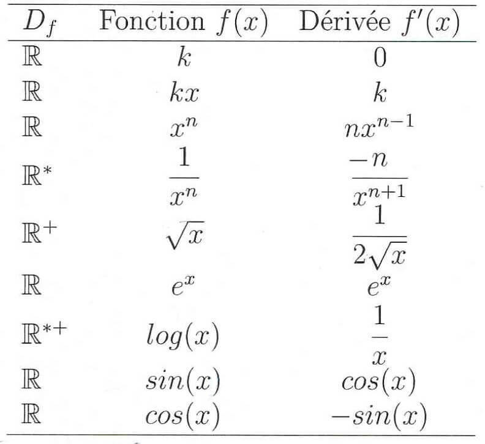

#### Opérations sur les dérivées

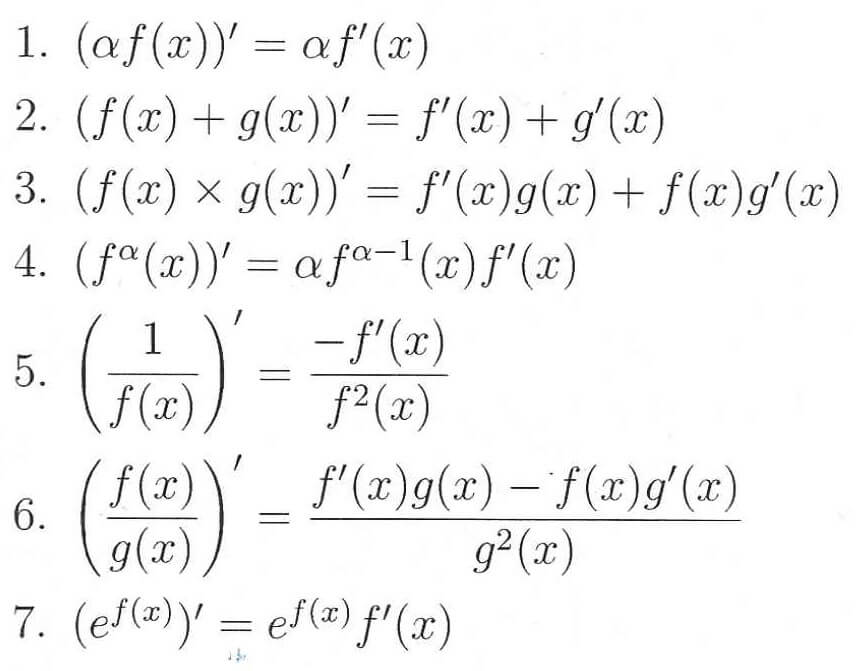

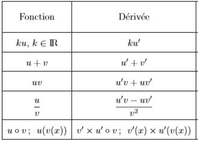

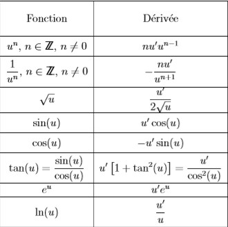

### Dénombrement


Le nombre de permutation $$n$$ éléments est appelé **factoriel** $$n$$ ou $$n \ factoriel$$est défini par : 

$$n!=n\times(n-1)\times(n-2)\times...\times2\times1$$ 

**Remarque :** $$0!=1$$\*\*\*\*


$$
(nk)=\frac{n!}{k!(n-k)!}
$$

### Probabilités


Dans un univers fini d'événements, une experience aléatoire associe à chaque éventualité notée $$\omega_i$$un nombre réel positif $$p_i$$tel que :

$$p_1+p_2+...p_n=1$$ ou $$\sum_{i=0}^n p_i=1$$


L'ensemble des couples \($$\omega_i , p_i$$\) est la loi de probabilité de l'experience aléatoire  
Remarque : Lorsque tous les réels $$p_i$$sont égaux \(à p\), on est dans une situation d'equiprobabilité $$p= \frac{1}{n}$$

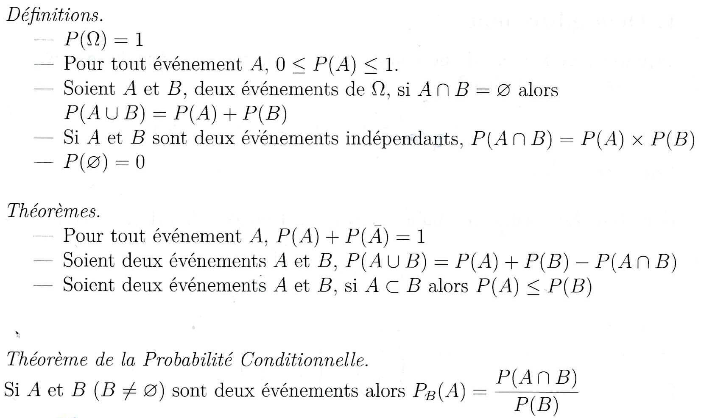

## Etudes de fonctions

### Définition


**Fonction réelle d’une variable réelle :** Une fonction réelle d'une variable réelle est une transformation qui à tout élément de $$x$$ d'une partie \(domaine\) $$D \subset \mathbb{R}$$ fait correspondre **un unique** élément de $$\mathbb {R}$$, noté $$f(x)$$ est appelé **image de x**

**Domaine de définition :** Le domaine de définition $$D_f$$ d'une fonction $$f$$ est l'ensemble des réels $$x$$ pour lesquels il existe une image unique de $$x$$ par la fonction $$f$$  
 $$Df = \{x ∈R|∃!y ∈R,y = f (x)\}$$ 

**Image du domaine de définition :** L'image du domaine de définition $$D_f$$d'une fonction $$f$$, notée $$f(D_f)$$, est l'ensemble des réels $$y$$ pour lesquels il existe **au moins** un antécédent $$x$$ par la fonction $$f$$

**Graphique d'une fonction :** Le graphe d'une fonction $$f$$ dans un repère cartésien \($$O_x$$,$$O_y$$\) est l'ensemble des points de coordonnées \($$x$$,$$f(x)$$\) avec $$x\in D_f$$ 


#### Étapes indispensables pour étudier une fonction


* Domaine de définition
* Parité / Périodicité
* Etudes des variations sur un intervalle approprié
  * Dérivation
  * Etudes des limites aux bornes de l'intervalle
  * Tableau de variation \(avec limite et extrema\)
* Point d'inflexion \(éventuellement\)
* Asymptotes obliques \(éventuellement\)
* Représentation graphique


### Opération sur les fonctions

$$f$$ et $$g$$ deux fonctions réelles définies sur $$D_f$$ et $$D_g$$

**Produit :** $$(fg)(x) = f (x)g(x)$$  
$$D_fg = D_f ∩D_g$$

**Somme :** $$(f + g)(x) = f (x) + g(x)$$  
$$D_{f+g} = D_f ∩D_g$$

**Inverse :** $$\frac1f (x) = \frac{1}{f(x)}$$  
$$D_\frac1f = \{x ∈ D_f |f (x) \neq 0\}$$

**Quotient :** $$\frac fg (x) = \frac{f(x)}{g(x)}$$  
$$D_\frac fg = {x ∈ (D_f ∩D_g) |g(x) \neq 0}$$

**Multiplication par un réel :** $$∀α ∈R, (αf )(x) = α×f (x)$$   
$$D_αf = D_f$$

**Opposé :** $$(−f )(x) = −f (x)$$   
$$D_{-f} = D_f$$

### Composition de fonctions

$$f$$ et $$g$$ deux fonction réelles définies sur $$D_g$$ et $$D_f$$ ---&gt; $$(f◦g)(x) = f (g(x))$$  
Avec $$D_{f◦g} = {x ∈ D_g |g(x) ∈ D_f}$$  
Et donc $$D_{g◦f} = {x ∈ D_f |f (x) ∈ D_g}$$

### Fonction réciproque

$$f$$ une fonction réelle définie sur $$I$$ telle que $$f(I) = J$$ $$f : I → J$$


* $$f$$ admet une fonction réciproque s’il existe une fonction $$g : J → I$$ telle que $$f ◦g = Id_J$$ **et** $$g ◦f = Id_I$$
* $$g$$ est notée $$f^{−1}$$
* Les graphes de $$f$$ et $$f^{−1}$$ sont **symétriques** par rapport à la première bissectrice d’équation $$y = x$$


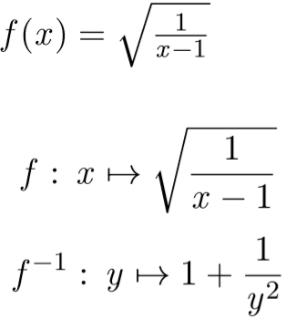

### Fonction logarithme et exponentielle

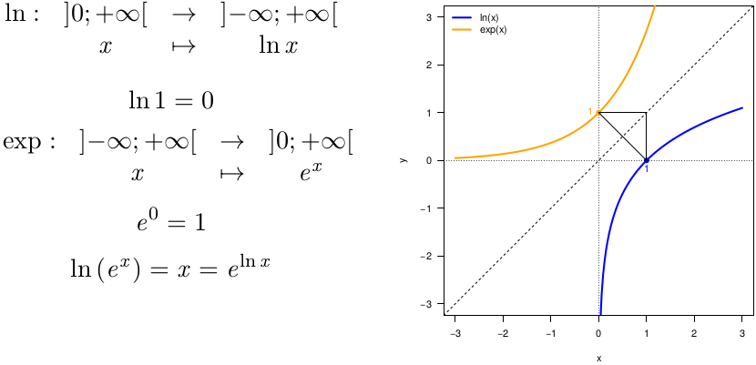

### Parité, périodicité

#### Parité : fonction paire

Soit $$f : D f → R$$ une fonction réelle d’une variable réelle.  
$$f$$ est **paire** si et seulement si :  
- $$∀x ∈ D f , (−x ) ∈ D f$$  
- $$∀x ∈ D f , f (−x ) = f (x )$$

Le graphe est symétrique par rapport à l'axe des ordonnées. $$D_f$$ est symétrique par rapport à 0.  
Exemple : $$f(x)=x^2$$

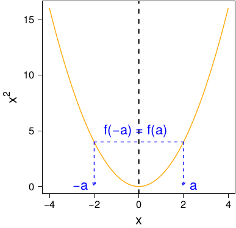

#### Fonction impaire

Soit $$f : D f → R$$ une fonction réelle d’une variable réelle.  
$$f$$ est **impaire** si et seulement si :  
- $$∀x ∈ D f , (−x ) ∈ D f$$  
- $$∀x ∈ D f , f (−x ) = −f (x )$$

Le graphe est symétrique par rapport à l’origine du repère. $$D_f$$ est symétrique par rapport à 0.  
Exemple : $$f(x)=x^3$$

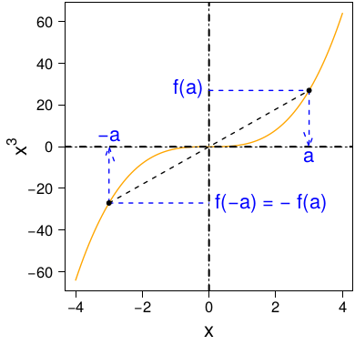

#### Périodicité

Soit $$f : D f → R$$ une fonction réelle d’une variable réelle.

$$f$$ est **périodique de période p** si et seulement si  
- $$∀x ∈ D f , (x + p) ∈ D f$$  
- $$∀x ∈ D f , f (x + p) = f (x )$$

Exemple : $$f (x ) = cos x$$ est paire et périodique de période $$2π$$   
$$∀x ∈ R, cos(x + 2π) = cos x$$

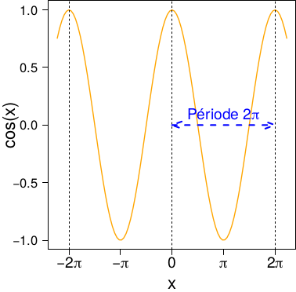

### Variation d'une fonction

#### Fonction croissante

Soit $$f : D_f → R$$ une fonction réelle d’une variable réelle.  
$$f$$ est croissante sur $$I ⊂ D_f$$ si et seulement si  
- $$∀(a, b) ∈ I 2 , a < b ⇒ f (a) 6 f (b)$$  
$$f$$ est strictement croissante sur $$I ⊂ D_f$$ si et seulement si  
- $$∀(a, b) ∈ I 2 , a < b ⇒ f (a) < f (b)$$  
Exemple : $$f (x ) = x^2$$ est strictement croissante sur $$[0, 5[$$

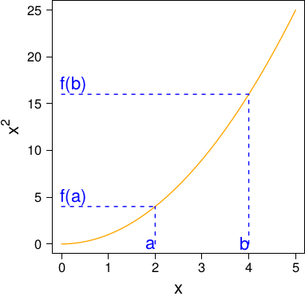

#### Fonction décroissante

Soit $$f : D_f → R $$une fonction réelle d’une variable réelle.   
$$f$$ est décroissante sur $$I ⊂ D_f$$ si et seulement si  
- $$∀(a, b) ∈ I 2 , a < b ⇒ f (a) > f (b)$$  
$$f$$ est strictement décroissante sur $$I ⊂ D_f$$ si et seulement si  
- $$∀(a, b) ∈ I 2 , a < b ⇒ f (a) > f (b)$$  
Exemple : $$f (x ) = x^2$$ est strictement décroissante sur $$[−5, 0[$$

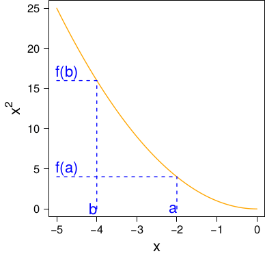

#### Taux d'accroissement

Soit $$f : D_f → R$$ une fonction réelle d’une variable réelle. Soit $$(a, b) ∈ D^2_f , a < b$$  
**Le taux d’accroissement de f entre a et b est**

$$
\frac{∆_f}{∆_x}=\frac{f(b)-f(a)}{b-a}
$$

Exemple : Le taux d’accroissement de $$f (x ) = x^2$$ entre 1 et 2 vaut 3

$$
\frac{∆_f}{∆_x}=\frac{f(2)-f(1)}{2-1}=\frac{4-1}{2-1}=3
$$

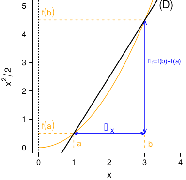

### Limite

#### Limite finie en $$a^-$$ \( $$a⁺$$ \)

Soit $$f$$ une fonction définie sur un domaine $$D_f ⊂ R$$, et $$a ∈ R$$.  
$$f $$admet une limite finie $$l ∈ R$$ **à gauche** en $$a$$ si et seulement si  
- $$a ∈ D_f $$ où a borne de $$D_f$$  
- Lorsque $$x → a − , f (x ) → l$$  
Mathématiquement, ces conditions s’écrivent : $$∀ε > 0, ∃δ > 0$$,   
\($$x ∈]a − δ, a[⇒ f (x ) ∈ [l− ε, l+ ε]$$\)  
On note alors $$ \lim_{x \to 0} f(x) = l$$  
Par analogie, on a la limite en $$a^+$$

Exemple : $$f (x ) = x^2 sin(100x )$$sur $$[−1, 0] : \lim_{x \to 0^-}f (x ) = 0$$

#### Limite finie en $$a$$ 

#### Limite infinie

#### Opérations sur les limites et formes indéterminées

#### Limites connues

#### Limites par comparaison

## Astuce


$$\frac{e^u}{e^v}=e^{u-v}$$ 

$$\log \frac{a}{b} = \log a - \log b = - \log \frac{b}{a}$$


## Définition


**Fonction affine :** En analyse, une fonction affine est une fonction obtenue par addition et multiplication de la variable par des constantes. Elle peut donc s'écrire sous la forme : $$f(x)=ax+b$$ où les paramètres a et b ne dépendent pas de x.


