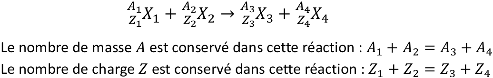

# Radioactivité

## Physique du noyau, unités associées, masse et énergie

### Noyau atomique \(radioactivité = physique du noyau ou nucléaire\)

1 atome neutre = 1 noyau \(charge totale +Ze\) + Z électrons \(charge totale −Ze\), avec e = charge élémentaire = $$1,6\times 10^{-19}$$C.


X = nom de l'élément chimique ou son isotope  
A = nombre de masse de l'atome  
Z = nombre de charge \(= nombre d'électrons de l'atome\) ou numéro atomique



Isotopes : ce sont deux noyaux ayant même Z \(donc même symbole chimique\) mais des valeurs de A différentes, donc N différents.

Isobare : ce sont deux noyaux différents \(donc des Z différents\) mais ayant même nombre de masse \(A identique\).


### Désexcitation gamme du noyau


On dit que le noyau est excité lorsqu'il à acquis un surplus d'énergie

* Un noyau dans un état excité peut être stable ou radioactif
* Un noyau dans un état excité prend le symbole étoile en exposant
* Un noyau dans un état excité veut retourner vers son état fondamental

Pour se désexciter, le noyau va émettre un photon γ qui emporte l’énergie en surplus entre l’état initial d’énergie Ei et l’état final d’énergie Ef avec Ei &gt; Ef


On a $$E_y = h \nu = E_i - E_f$$avec h est la constante de planck, avec h=$$6,62 \times 10^{-34}J.s$$ et $$\nu$$ou f est la fréquence du rayonnement gamma  
Pas de distinction entre rayonnement et matière ici.  
 Le photon γ est à la fois une onde \(rayonnement\) et une particule \(matière\).

### Unité d'énergie

Le joule \(J\) n'est pas une unité adapté pour les énergies de noyaux et de particules car leurs valeurs sont bien trop faibles. On utilise l'électron-Volt et ses multiples.


un électron-Volt est l’énergie d’une charge élémentaire e = $$1,6 \times 10^{-19}$$ C soumise à une d.d.p de 1 V donc 1 eV = $$1,6 \times 10^{-19}$$ J

Avec 1 MeV = 10^6 eV // 1KeV = 10^3 eV


### Unité de masse atomique

C’est l’unité utilisée pour les masses en radioactivité \(plutôt que le kilogramme, pas adapté\).


1 unité de masse atomique \(1 u.m.a\) est égale à la masse de l’atome de carbone 12 \( $$_{6}^{12}C^{6}$$\) divisée par 12.


**Exemple :**  
proton $$m_p = 1,007276 u.m.a$$  
neutron $$m_n = 1,008665u.m.a$$  
électron $$m_e = 0.0005486u.m.a$$

#### Masse d'un noyau

Masse du noyau = masse de son état fondamental. On donne la masse en u. m. a.  
Exemple : $$m(^{235}U)=234,99345u.m.a$$

### Energie de masse au repos

Principe d’équivalence masse-énergie énoncé par Einstein en 1905 : $$E=mc^2$$  
Avec E en joule, m en kg et $$c=3\times 10^8m/s$$  
Energie équivalente


 Dans les exercices il y a soit les masses en u.m.a , soit directement les énergies de masse au repos en MeV.


### Energie de masse au repos d'un noyau

Soit un noyau $$^A_ZX^N$$avec $$A=Z+N$$, l'énergie de masse au repos de ce noyau, dans son état fondamental, s'écrit : 

Remarque : si le noyau est dans un état excité d'énergie alors la masse au repos s’écrit :

## Lois de conservation, désintégrations radioactives

### Loi de conservation

Soit une réaction nucléaire au cours de laquelle deux noyaux $$X_1$$ et $$X_2$$ entrent en collision dans l’état initial pour former dans l’état final deux noyaux $$X_3$$ et $$X_4$$

### Chaleur de réaction

Cas générale  
Le bilan énergétique d’une réaction est défini comme étant égal à Q, appelé chaleur de réaction ou énergie libérée dans la réaction. Pour une réaction nucléaire de type \(cf dessus\) ou les $$X_i$$sont des noyaux, le bilan énergétique Q s’écrit soit à partir des masses m \(en u.m.a \), ou soit à partir des énergies de masse au repos $$mc^2$$ \(en MeV\).  
Q est égal à la somme des masses/énergies dans l’état initial moins la somme des masses/énergies dans l’état final. On écrit, en MeV :


* Si Q&gt;0 la réaction est dite exoénergetique : elle est spontanée et se produit sans apport d’énergie dans la voie d’entrée. Il y a de l’énergie libérée en voie de sortie.
* Si Q&lt;0 la réaction est dite endoénergétique : la réaction est impossible si on ne fournit pas d’énergie dans l’état initial, sous forme d’énergie cinétique $$E_c$$ donnée au projectile.


Cas particulier : Si la réaction ne contient que des noyaux \(dans ce cas, N est conservé\)   
Les deux premiers termes sont nuls et on peut écrire Q directement en fonction des énergies de liaison B des nucléons dans le noyau, mais attention à l’ordre : $$Q=B_3+B_4-B_1-B_2$$ \(en MeV\)

### Généralité sur les désintégration radioactive

* Un noyau radioactif, naturellement ou créé artificiellement, est un noyau instable. Il peut-être dans son état fondamental ou dans un état excité. Il cherche à retourner vers une forme plus stable : le noyau radioactif va se désintégrer afin de se transformer spontanément en un noyau stable \(en une ou plusieurs étapes\)
* Les désintégrations radioactives sont des réactions nucléaires particulières :
  * avec un seul noyau dans l’état initial ;
  * en général des particules sont présentes dans la réaction, souvent émises

    mais parfois capturées ;

  * si elle existe, la désintégration est spontanée, donc il faut avoir Q &gt; 0
* Il existe plusieurs types de désintégrations radioactives. Celles étudiées ici sont les plus courantes : α, $$\beta ^-$$ , $$\beta ^+$$ et c.e.
* Parmi ces désintégrations, **β- , β+ et c.e.** sont dites **isobariques** car le noyau père et le noyau fils ont même valeur de A, ce sont des noyaux isobares
* Neutrino $$\nu$$ et antineutrino $$\overline{\nu}$$, de charge électrique nulle, apparaisse dans les désintégration isobariques. Ce sont des antiparticule, donc ils ont la même masse. Elle est non nulle mais négligeable. $$m(\nu)=m(\overline{\nu}) \simeq 0$$ $$\nu$$et $$\overline{\nu}$$ dans les réactions β-, β+ et c.e., sinon l’énergie totale n’est pas conservée et donc ces réactions sont fausses !

### Désintégration alpha \($$\alpha$$\)

Un noyau père $$^A_ZX$$se transforme en un noyau fils $$^{A-2}_{Z-2}Y$$en émettant une particule $$\alpha$$  
La réaction s'écrit :

On calcule le Q de réaction et on doit avoir $$Q_\alpha$$&gt; 0. On connait l’énergie de masse au repos $$m_\alpha c^2=3727,5$$ MeV

### Désintégration Beta moins \($$\beta ^-$$\)

Un noyau père $$^A_ZX$$ se transforme en un noyau fils $$^A_{Z+1}Y$$ en émettant un électron $$e^-$$ et un antineutrino $$\overline{\nu}$$ qui se partagent l’énergie $$Q_{\beta -}$$ libérée dans la réaction. C’est une désintégration isobarique, qui s’écrit :


Remarque importante : ne pas oublier $$\overline{\nu}$$ dans la désintégration β- sinon elle est fausse


### Désintégration Beta plus \($$\beta^+$$\)

Un noyau père $$^A_ZX$$ se transforme en un noyau fils $$^A_{Z-1}Y$$ en émettant un positron $$e^+$$ et un neutrino $$\nu$$ qui se partagent l’énergie $$Q_{\beta +}$$ libérée dans la réaction. C’est une désintégration isobarique, qui s’écrit :


Remarque importante : ne pas oublier $$\nu$$ dans la désintégration β+ sinon elle est fausse


### Désintégration électronique \(c.e\)

Un noyau père $$^A_ZX$$ se transforme en un noyau fils $$^A_{Z-1}Y$$ en capturant un électron $$e^-$$ du cortège électronique de son atome et en émettant un neutrino $$\nu$$ qui emporte toute l’énergie $$Q_{c.e}$$ libérée dans la réaction. C’est une désintégration isobarique, qui s’écrit :


Remarque importante : ne pas oublier ν dans la réaction de c. e. sinon elle est fausse


## Loi de décroissance radioactive et activité

### Loi de désintégration radioactive


Soit un échantillon radioactif, contenant à l'instant initial $$N_0$$noyaux : c'est le nombre de noyaux radioactif présent dans l’échantillon à $$t=0$$


On cherche le nombre $$N(t)$$de noyaux radioactifs présent à un instant t&gt;0 dans l'échantillon.  
La probabilité pour que ces noyaux radioactifs se désintègrent par unité de temps est $$\lambda$$, en $$s^{-1}$$, aussi appelée constante radioactive de l'élément

### Période radioactive


La période radioactive d’un échantillon de noyaux radioactifs, appelée T \(ou $$T_{1/2}$$ \), est le temps au bout duquel il ne reste que la moitié des noyaux présents initialement. Elle est aussi appelée demi-vie.


#### Lien entre la période radioactive T et la constante radioactive $$\lambda$$


Bien penser à diviser $$N_0$$des deux coté  
- $$ln(\frac{1}{2}) = -ln(2)$$  
- $$ln(e^{-\lambda t} = -\lambda t$$


### Activité


L’activité A\(t\) d’un échantillon de noyaux radioactifs caractérise les noyaux qui se désintègrent à un instant t. C’est le nombre de désintégrations par unité de temps.


#### Lien entre activité A\(t\) et nombre de noyaux présents N\(t\)

Unité d'activité en SI : le Becquerel \(Bq\), avec 1Bq  = 1 désintégration / seconde

## Datation absolue par mesure de la radioactivité

### Généralité

* Plusieurs méthodes utilisent la radioactivité pour déterminer l’âge d’une matière.
* Roches, fossiles ou produits de l’activité humaine portent une dose naturelle de radioactivité : avec le temps ces atomes radioactifs se désintègrent en formant d’autres noyaux.
* Le processus de « désintégration-formation » se produit de manière régulière et mesurable. On peut donc mesurer l’activité A t d’un objet pour déterminer son âge.
* Plusieurs méthodes vont être présentées ici : la plus connue est la datation au carbone 14, mais limitée à des objets âgés de moins de 50000 ans.
* Pour dater les roches beaucoup plus anciennes on utilise la datation uranium- plomb, la datation potassium-argon ou la datation rubidium-strontium.

### Datation au carbone 14

Le carbone 14 à une période T = 5730 ans  
Le taux de carbone 14 est $$\frac{N(^{14}C)}{N(^{12}C)}=1.5\times 10^{-12}$$  
Après la mort d'un organisme, le carbone 14 radioactif n'est plus produit, il va seulement se désintégrer avec la période T, et la quantité de carbone 14 est de plus en plus faible au cours du temps : On peut donc dater un objet jusqu’à 35000 ans \(=6T\). \(Jusqu’à 5000 ans, 10T avec méthode très précise\)


A noter que pour les organismes vivants \(végétaux, animaux, êtres humains\), la datation par le processus de transformation du $$^{14}C$$ en $$^{14}N$$ ne peut être mesurée qu’à partir de la mort du sujet quand il n'y a plus de renouvellement du $$^{14}C$$

C'est une méthode destructive !! **At &lt; A0**


#### **Data Uranium-plomb \(**$$^{238}U - ^{206}Pb$$\)

La chaîne radioactive de l’uranium 238 \(T\($$^{238}U$$\) = 4,5$$\times 10^9$$ans\) conduit, après plusieurs désintégrations α et β ! , au plomb 206 stable \( $$^{206}Pb$$\)  
En mesurant la quantité de $$^{206}Pb$$ dans un échantillon de roche ancienne $$N_{Pb}(t_{ech})$$ et en considérant qu'il n'y en avait pas initialement $$N_{Pb}(0)=0$$ , on peut donc déterminer l'âge de la roche à partir de la courbe de décroissance radioactive du nombre de noyaux de $$^{238}U$$

#### Datation potassium-argon

#### Datation rubidium-strontium

## Traceurs radioactifs

### Définition, principe d’utilisation et caractéristiques


Un traceur radioactif \(ou radiotraceur\) est l’association :   
- d’un traceur, qui va se localiser de façon sélective sur une structure particulière de l’organisme.   
- d’un marqueur radioactif, qui sert d’émetteur de gammas \(désintégration radioactive donc émission de particules qu’il est possible de détecter par un détecteur externe\) et renseigne sur la localisation. 


La méthode des traceurs radioactifs consiste à suivre l’élément radiotraceur, identifiable grâce à la désintégration d’un de ses radioisotopes, le long de transformations physiques ou chimiques  
En médecine, il faut bien choisir son marqueur avec deux caractéristiques principales :   
- l'énergie des gammas émis, qui ne doit être ni trop faible, sinon tous les photons sont absorbés avant de sortir de l'organisme, ni être trop élevée pour que les détecteurs soient efficaces. En gamma caméra, 20 à 400 keV. En TEP les les 2 photons d’annihilation font 511 keV.   
- la période radioactive du marqueur, qui ne doit être ni trop courte, pour laisser à l'opérateur le temps d'effectuer la mesure avec une statistique suffisante, ni trop longue, pour des raisons de radioprotection. Une fois la mesure effectuée, inutile que le patient conserve de l'activité dans ses organes.

### Période effective

Elle caractérise le temps de présence effective du radiotraceur dans l’organisme : en pratique après quelques périodes effectives le radiotraceur n’a plus d’effet nocif car il a disparu par désintégration ou été éliminé biologiquement. La période effective dépend donc de 2 mécanismes indépendants :  
- la décroissance radioactive, caractéristique physique liée au radioisotope choisi \(période radioactive T\)  
- l’élimination biologique, liée au taux de renouvellement de l’élément \(période biologique Tb\).


C’est la plus petite des deux périodes qui domine le phénomène de durée effective d’élimination \(au sens où si T ≪ T R alors on aura Teff ~T\)  
- Si l'organisme élimine très rapidement \(Tb ≪ T\), alors Teff ~Tb  
- Si au contraire l'organisme élimine tres peu \(Tb ≫ T\), on aura Teff ~T


### Détection des traceurs radioactifs

**Gamma-Caméra :** la « gamma-caméra » détecte les scintillations produites par les rayons gamma émis par le traceur radioactif qui peut-être un émetteur beta moins ou c.e. A partir de l’observation d’un grand nombre de scintillations, permet de localiser le point d’émission des molécules radioactives et de réaliser du diagnostic médical.  
**Caméra TEP \(tomographie à émission de positrons\) :** dans ce cas le traceur radioactif est un émetteur beta plus. Le positron émis s’annihile avec un électron du milieu en produisant deux gammas de 0,511 MeV émis dos-à-dos, donc la localisation du point d’émission est beaucoup plus précise.

## Interaction rayonnement-matière et radioprotection

### Définition : les rayonnements ionisants


On appelle **rayonnement ionisant un rayonnement dont l’énergie est suffisante pour arracher un électron du cortège électronique d’un atome** \(il faut une énergie supérieure à 13,6 eV pour l’hydrogène, 115 keV pour l’uranium...\) **ou d’une molécule** \(énergie de liaison de l’ordre de quelques eV pour les molécules des tissus biologiques\).  
Une particule ionisante expulse un électron d’un atome rencontré sur son chemin. **L’atome qui a perdu un électron est devenu un ion, d’où le terme ionisation.** Les atomes ionisés se réorganisent en émettant des photons, parmi lesquels des rayons X caractéristiques.


Le phénomène d’ionisation dépend de la nature de la particule, de sa charge électrique, et aussi de sa masse :   
- Les rayonnements directement ionisants sont les particules chargées \(électrons, protons, alpha, ions\)  
- Les rayonnements indirectement ionisants sont les particules neutres \(photons ou gammas, neutrons\)

### Atténuation des photons et rayons X et radioprotection

#### Atténuation des photons et rayons X et radioprotection


On considère en général que **l’émission des rayonnements par une source ponctuelle est isotrope et homogène** \(c’est-à-dire que l’émission est la même dans toutes les directions de l’espace\).


A une distance **d** de cette source, le rayonnement émis est réparti sur une sphère de surface **4πd 2** . Si on s’intéresse au rayonnement reçu sur une petite surface **S** de cette sphère, donc à la distance d, on a le nombre de photons reçus **N** qui dépend du nombre initial de photons émis par la source **N0** et qui vaut :

#### Atténuation des photons et des rayons X dans la matière

On part d’une source ponctuelle de gammas et avec un collimateur, on obtient un faisceau monoénergétique et monodirectionnel. Soit un faisceau de **N0** photons traversant une épaisseur de matière **dx**. Après la traversée de cette épaisseur **dx**, il ne reste que **N** photons. La **loi d’atténuation** s’écrit :

#### Protection contre les rayonnements ionisants : exemple des gammas

## Mesure des rayonnements : les doses

### Dose absorbée


Au cours d’une interaction rayonnement-matière, les les rayonnements perturbent les atomes en arrachant des électrons, brisent des molécules, électrisent et échauffent le milieu, ce qui peut provoquer des dégâts, transitoires ou permanents. Pour les organismes vivants, les effets de l’ionisation peuvent être **bénéfiques** quand l’irradiation touche des **cellules malades** \(traitement de cancers par radiothérapie\), mais les effets sont **nocifs** si l’ionisation touche des **cellules saines**.


Pour mesurer l’effet des rayonnements sur la matière vivante, on calcule la dose **D d’énergie absorbée par le milieu** et on la compare à des doses « autorisées » en radioprotection. La dose **D** est l’énergie **E** des rayonnements absorbés par un milieu homogène ayant une masse **m** :


Son unité SI est le Gray \(symbole Gy\), qui correspond à la dose d’énergie absorbée par un milieu homogène ayant une masse de 1 kg, lorsqu’il est exposé à un rayonnement ionisant apportant une énergie de 1 J. On a donc $$1 Gy = 1 J/kg = 1 m^{-2}.s^{-2}$$


### Dose effective \(Dose efficace\)

La dangerosité dépend aussi de la **nature de la particule rayonnée.** On applique un **facteur de pondération FQ** aux doses d’énergie absorbée D pour en tenir compte. On peut ainsi définir une **dose effective Deff** \(aussi appelée dose efficace\), qui tient compte de la nature du rayonnement, telle que :

avec **Deff en Sievert** \(Sv\), donc 1 Sv = F X × 1 Gy et $$F_Q$$ en Sv/Gy

### Les effets biologique

L’énergie déposée dans un organisme vivant produit aussi des effets très différents suivant le type de tissu ou d’organe touché. Certains sont plus « fragiles » que d’autres.   
On voit ici par exemple que les poumons ou l’estomac sont 10 fois plus sensibles que la peau.

### Ordre de grandeur

Au niveaux des rayonnements naturels que nous subissons par an :  
- le rayonnement cosmique correspond à ≈ 0.3 mSv  
- la radioactivité naturelle correspond à ≈ 0.2 mSv  
- les sources radioactives internes au corps humain \( 14C, 40K,...\) correspondent à ≈ 0.2 mSv.


Actuellement la dose légale admise par an pour la population est de 1 mSv en France \(en plus des rayonnements naturels\) et ces limites d’exposition sont à la baisse. En 1992 elles étaient de 50 mSv aux USA, à comparer aux 4 mSv autorisés aujourd’hui.


