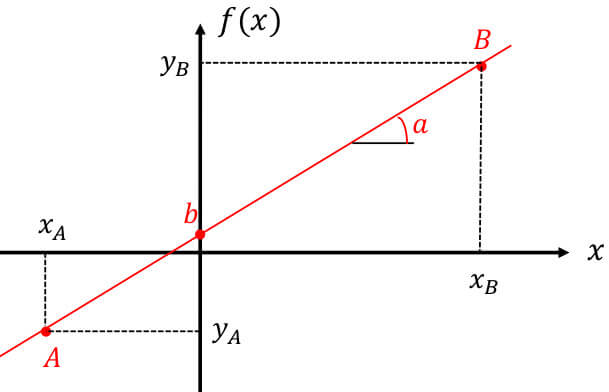
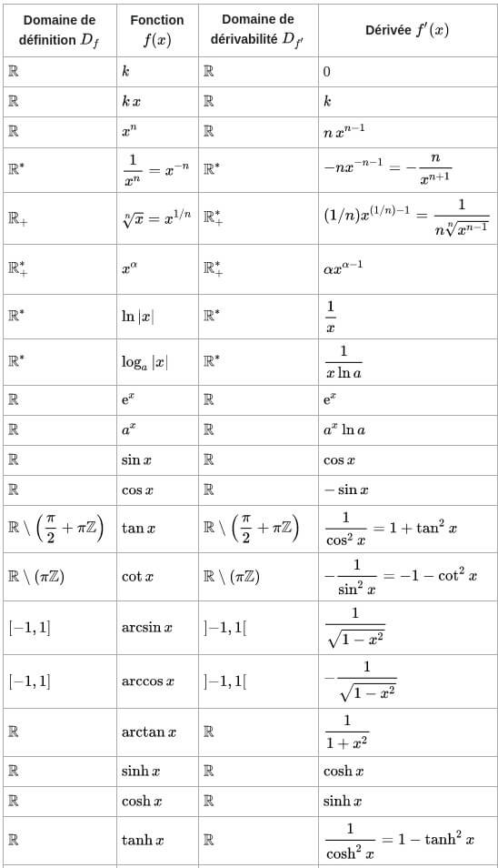
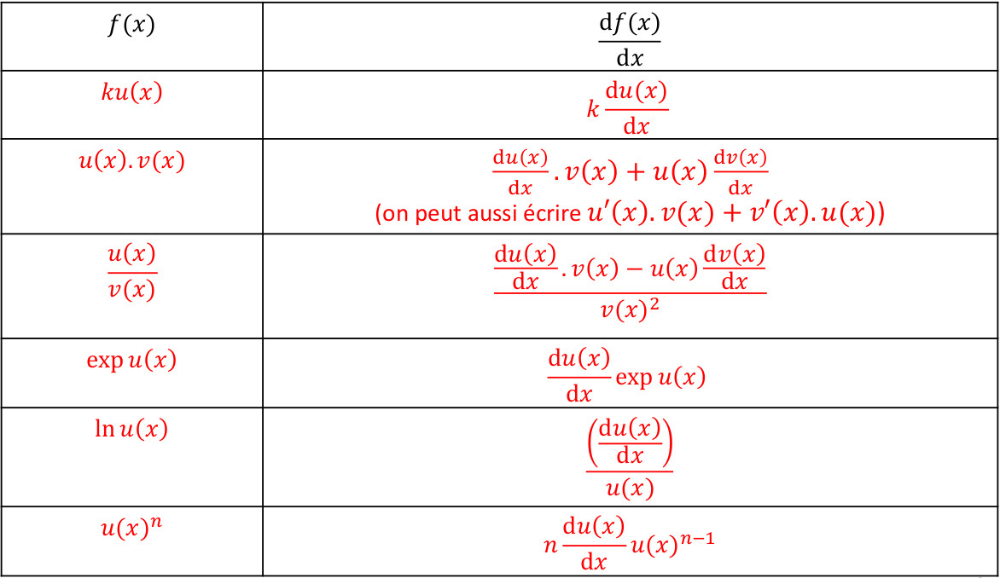
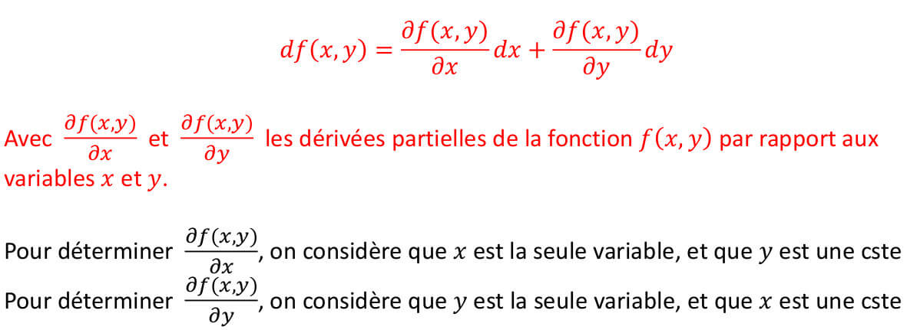
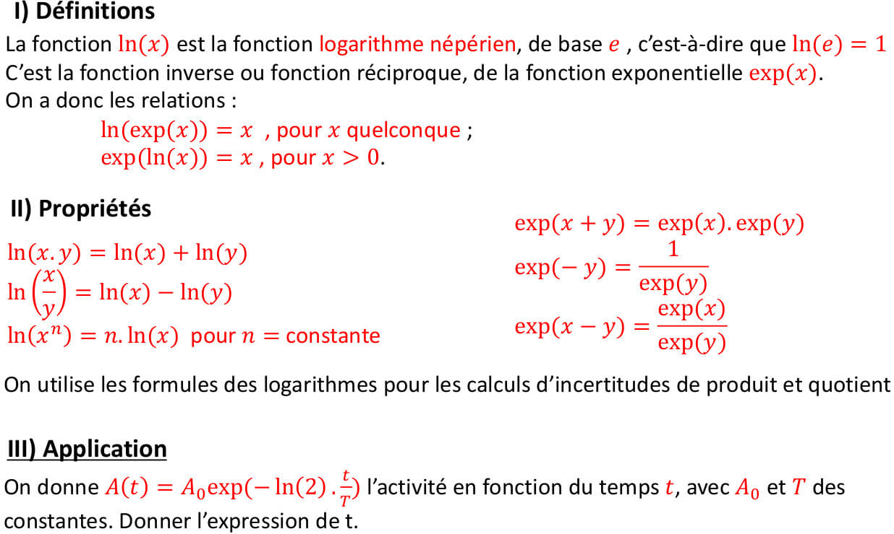

# Physique





## Base de math pour physique

### Fonction affine

Une fonction f\(x\) est affine si elle est de forme $$f(x)= ax+b$$ avec :  
- a le **coefficient directeur** ou la **pente**  
- b est **l'ordonnée à l'origine**  
Elle est représentée par une droite

Soit A et B deux point de la droite tels que A\(Xa,Ya\) et B\(Xb,Yb\), le coefficient directeur est donné par  
$$a=\frac{Y_B-Y_A}{X_B-X_A}$$  
Pour trouver l'ordonner à l'origine b on choisit un des deux point et on applique f\(x\) en ce point. Par exemple le point B

$$f(X_B)=Y_B=ax_B+b$$ donc $$b=y_B-a\times x_B$$

### Différentielle

Différence d'abscisse : $$\Delta_x=x_B-x_A$$

Différence entre f\(xa\) et f\(xb\) : $$\Delta f(x)= f(x_B)-f(x_A)$$

### Dérivée d'une fonction

### Différentielle d'une fonction à plusieurs variables

Soit une fonction f\(x,y\) à 2 variables. On ne peut plus utilisée les dérivée. La différentielle df\(x,y\) représente un accroissement infinitésimal de f\(x,y\) et s'écrit -&gt;

### Fonction exponentielle et logarithme népérien

### Incertitudes

### Présenter les résultats : 3 règle à suivre

### Équation différentielle du premier ordre en électricité / radioactivité

