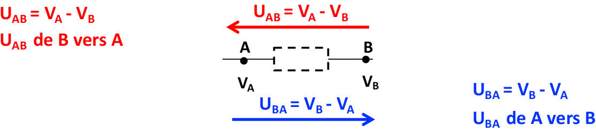

# Electricité et Radioactivité

## Électrostatique \(intro\)

### Définition


**Électrostatique :** études des charges électriques immobile \(attraction/répulsion\)

**Électrocinétique :** études des charges en mouvement \(ce cours\)


### Propriété en électrostatique

#### Champ et potentiel électrique

Une charge électrique Q crée en tout point  de l'espace un champ électrique $$\vec{E}$$**\(en V/m\)** et un potentiel électrique **V \(en V\)**

#### Force électrique

Une charge électrique q placée dans un champ $$\vec{E}$$subit une force électrique $$\vec{F}$$\(en N\) telle que : $$\vec{F}=q\times \vec{E}$$

Charge électrique élémentaire, porté par des électrons \(-e\) et les protons \(+e\) du noyau de l'atome avec $$e=1,6x10^{-19}C$$en coulomb.

## Potentiel, tension et courant électrique

### Potentiel

Le potentiel électrique définit l’énergie potentielle électrique qu’aurait une charge **q** en ce point, telle que : $$E_{pe}=q\times V$$avec Epe en joule, q en Coulomb et V en volt


**Potentiel :** Etat électrique d'un point dans l'espace

**Courant :** Différence de potentiel entre deux points

On appelle **d.d.p** ou **tension** : \(Va-Vb\), **si il y a tension il y a alors courant.**


**Propriété**

En électrocinétique, le potentiel électrique est constant le long des fils.On peut déplacer les points le long des fils : utile pour l’étude des circuits.

* Si Va &gt; Vb : courant de A vers B
* Si Va &lt; Vb : courant de B vers A 
* Si Va = Vb : pas de courant

### Tension \(Différence de potentiel\)


La tension entre deux points d’un circuit représente la différence de potentiel entre ces deux points.


**Convention**  
Soient A et B deux points d’un circuit tels que :

* On a $$U_{AB}=-U_{BA}$$
* La tension **Uab** est représentée par une flèche qui **pointe vers la 1 ère lettre donc de B vers A**
* L’unité de la tension est le volt, de symbole V.
* Les valeurs standards vont de quelques mV à quelques dizaines de kV

#### Répartition des tensions

### Courant électrique


Le courant électrique correspond au déplacement des charges électriques dans un matériau conducteur sous l’effet du champ électrique induit par une différence de potentiel.  
L’intensité $$i(t)$$ du courant mesure le débit des charges électriques $$dq(t)$$qui traversent la section S d’un conducteur pendant un temps $$dt$$ :

$$i(t)=\frac{dq(t)}{dt}$$ 

Si le courant est continu \(indépendant du temps\), l’intensité I \(en majuscules\) s’écrit :

$$I=\frac{\Delta Q}{\Delta t}$$


**Unité**  
Le courant électrique est mesuré en ampère \(A\), 1A -&gt; 1C/s , l’intensité électrique est proportionnelle au nombre de charges électriques qui traversent le conducteur \(fil\) par seconde.  
**Ordre de grandeur  
-** Installation domestique : 20 A   
- TGV : 1000 A au démarrage   
- Foudre : 1 à 100 kA   
- Electronique : mA, μA, nA  
L’intensité est mesurée par un ampèremètre placé en série dans le circuit.

#### Convention

* Le courant positif circule dans le sens des potentiels décroissants.
* Avec Va &gt; Vb on a I1 &gt; 0 et I2 &lt; 0
* Un courant positif dans un sens correspond à un courant négatif en sens inverse
* La valeur absolue de ces deux courants est la même.

#### Répartition des courants

## Circuits électriques

### Dipôle

Un dipôle AB est un élément d’un circuit électrique possédant deux bornes \(pôles\) placées en A et en B. Le dipôle peut être actif ou passif.  
La résistance est un dipôle passif. Chaque dipôle possède sa propre loi et ses propres conventions

### Branche \(de circuit\)

C’est une partie de circuit électrique situé entre 2 nœuds consécutifs. Le long d’une branche, tous les éléments sont en série  
**Propriété**  
Le courant traversant une branche de circuit est identique partout \(en tout point\) le long de cette branche.

### Noeud \(de circuit\)

C’est un point de connexion entre au moins deux branches d’un circuit.  
**Propriété**  
Loi des nœuds : la somme des courants qui arrivent en 1 nœud est égale à la somme des courants qui sortent de ce nœud.  
$$\sum{I_{entrant}}=\sum{I_{sortant}}$$

### Maille \(de circuit\)

 Une maille est un chemin fermé sur le circuit électrique. La maille peut être composée de plusieurs branches. Dans ce cas, le chemin fermé ne doit jamais passer deux fois au même endroit.  
**Propriété**  
Loi des mailles : à voir au chapitre lois de Kirchhoff

#### Exemple

## Résistivité, résistance et loi d’Ohm

### Résistivité


La résistivité $$\rho$$ d’un matériau représente sa capacité à s’opposer à la circulation d’un courant. Unité : ohm.mètre \($$\Omega$$.m\)  
On définit aussi la conductivité $$\sigma$$, qui est l’inverse de la résistivité, $$\sigma = \frac{1}{\rho}$$ en \($$\Omega^{-1}$$ .m -1 \)  
  
Pour un matériau conducteur, la résistivité $$\rho$$ est très faible \(ex : $$\rho$$Ag ~ $$16\times 10^{-9}\Omega.m$$\) Pour un matériau isolant, la résistivité $$\rho$$ est très élevée \(ex : $$\rho$$verre ~ $$10^{17}\Omega .m$$\)


### Résistance


Dipôle électrique qui s’oppose au passage du courant. Unité : Ohm \($$\Omega$$\)   
La résistance est **responsable d’une dissipation d’énergie sous forme de chaleur \(effet Joule\)**.


**Association de résistances – Résistance équivalente**  
Dans un circuit électrique comprenant plusieurs résistances, les résistances pourront être associées entre elles pour simplifier des montages complexes et déterminer simplement des grandeurs physiques \(par exemple déterminer le courant qui traverse une association de résistances: voir exo E1.3\)   
Les résistances associées seront remplacées dans le circuit par une résistance équivalente Req

#### Loi d'Ohm

En valeur absolue, la tension U aux bornes d’une résistance R est égale au produit de l’intensité I du courant qui la traverse par la valeur de la résistance.  
Convention \(très important\): le signe du produit R.I dépend des sens choisis pour U AB et I

## Générateur et moteur

### Générateur idéale \(parfait\) sans résistance interne

#### Définition


**Dipôle** capable de délivrer une **tension constante** quelque soit la charge reliée à ses bornes


#### Représentation et convention

Le générateur est caractérisé par une force électromotrice \(f.e.m.\) dont l’unité est le volt. C’est une tension \(donc une flèche sur le circuit\). La f.e.m. est une tension orientée **de la borne moins \(petite barre\) vers la borne plus \(grande barre\)**. Fem = tension constante = ddp  
Si dans un circuit on voit une f.e.m., on met directement une flèche dans le sens de la convention et cette **tension** est directement égale à **e**.   
Le générateur donne le sens du courant I si il n’y a qu’un seul générateur dans le circuit.

$$U_{BA}=e$$, donc $$U_{BA} = V_B-V_A>0$$et $$V_B>V_A$$

### Générateur réelle


Dipôle composé d'un générateur idéale F.e.m et d'une résistance interne r


#### Représentation

Pour un générateur réel, **la tension n’est pas constante** quelle que soit la charge \(la pente de la droite vaut –r\)  
**Loi de Pouillet :** $$U_{BA}=e-r\times I$$

### Moteur

#### Définition


Le moteur transforme l'énergie électrique en énergie mécanique. Il est caractérisé par sa force contre électromotrice e' \(F.c.e.m\), en Volts \(V\) et avec une résistance interne r'.


#### Représentation et convention

La f.c.e.m. e’ est une tension orientée de la borne moins \(petite barre\) vers la borne plus \(grande barre\). Même convention et représentation que pour le générateur. **Attention : la f.c.e.m. ne donne pas le sens du courant.**  
$$U_{BA}=e'+r'\times I$$

## Lois de Kirchhoff

### Lois des nœuds


La somme des courants arrivant à un nœud du circuit est égale à la somme des courants sortant de ce nœud.


### Lois des mailles


La somme des variations de potentiel rencontrées en parcourant une maille dans un sens donné est nulle.


## Puissance électrique

Pour un dipôle en convention récepteur, la puissance reçue par celui-ci vaut :  
1 W = 1 J/s : c’est donc une énergie par unité de temps

#### Résistance

Puissance reçue \(et dissipée\) par effet Joule par la résistance \(chaleur\)

#### Générateur réel

#### Moteur

## Condensateur


Un condensateur est un dipôle formé de deux conducteurs métalliques \(armatures en vert\) séparés par un matériau isolant \(souvent un diélectrique, en blanc\).


Lorsque les armatures du condensateur, initialement neutres \(q1 = q2 = 0\), sont soumises aux tensions V1 et V2 , elles se chargent.  
Les armatures portent des charges électriques de même valeur q, mais de signes opposés. Elles ont même valeur absolue. La charge q du condensateur est positive et égale à cette valeur absolue.  
**Ici, pour V1 &gt; V2 on a q = +q1 = –q2 avec q = C \(V1 – V2\)**  
Pendant la charge le courant i\(t\) varie. Quand elle est **terminée, le courant est de nouveau nul i = 0.**

Les condensateur sont utilisés pour stoker l'énergie, créer un champ électrique uniforme, Redresseur de tension, Déplace géographiquement une tension

#### **Notation et symbole**

#### **Loi et comportement  du condensateur**


La charge du condensateur est proportionnelle à la tension à ses bornes.

$$q(t) = C\times u_{AB}(t)$$ avec q\(t\) en coulomb, C en farad et uAB en volt.


**Capacité C**   
Représente la capacité du condensateur à condenser les charges électriques sur ses armatures. Dépend uniquement de la géométrie du condensateur. S’exprime en Farad \(F\).   
**Convention**   
Un condensateur doit toujours être branché en mode récepteur. La tension $$u_{AB}(t)=u_C(t)$$ à ses bornes doit toujours être opposée au sens du courant i\(t\)

### Condensateur plan

C’est un cas particulier pour lequel les armatures sont deux plans parallèles chargés. On note S la surface, et d la distance entre les deux plans.

Il existe un champ électrique uniforme $$\vec{E}$$ entre les bornes du condensateur, dirigé vers les \) 5 potentiels décroissants \(du + vers le -\) et de norme $$\vec{E}=\frac{u_{AB}}{d}$$ en V/m

#### **Energie stocker dans un condensateur**

Si ****$$u_{AB}$$ ****est la tension aux bornes du condensateur, q est sa charge et C sa capacité, l’énergie E stockée dans le condensateur est égale à :

### Association de condensateur

#### En série

Lorsque les condensateurs sont en série, la charge portée par chaque condensateur est identique.   
**Donc q1 = q2 = q**  
Or $$q_1=C_1.u_{C1}$$et $$q_2=C_2.u_{C2}$$ donc $$C_1.u_{C1}=C_2.u_{C2}$$  
De plus on à la loi des mailles donc $$e = u_{C1}+u_{C2}=\frac{q_1}{C_1}+\frac{q_2}{C_2}=\frac{q}{C_1}+\frac{q}{C_2}$$


L’inverse de la capacité équivalente à plusieurs capacités en parallèle est la somme des inverses des capacités \(comme résistances en parallèle\)


#### En parallèle

Lorsque les condensateurs sont en parallèle, la tension est la même aux bornes de chaque condensateur. Donc uC1 = uC2 = e  
Donc $$q_1= C_1.e$$ et $$q_2=C_2.e$$  
La charge totale est $$q=q_1+q_2$$donc $$q=C_1.e+C_2.e$$


Des capacités en parallèle s’additionnent \(comme les résistances en série\).


## Circuit RC

### Charge de condensateur

#### Schéma du circuit et principe

On dispose d’un générateur idéal, de type GBF, qui délivre un signal créneau \(u G \(t\) = 0 ou E, en volts\), de fréquence f et période T, d’un condensateur de capacité C et d’un résistance R.   
Avec l’échelon de tension, c’est comme si on disposait d’un interrupteur k permettant de couper \(0 V\) ou d’allumer la tension délivrée par le générateur \(fournir la tension E en volts\).

Initialement \(t = 0\), échelon de tension à 0, donc E = 0, uC\(0\) = 0, uR\(0\) = 0   
Echelon passe à E : le condensateur se charge ;   
Echelon repasse à 0 : le condensateur se décharge.... etc  
A t = 0, l’échelon passe à E, comme si on fermait un interrupteur, un courant i va circuler.

La charge q du condensateur augmente jusqu’à ce que le condensateur soit chargé entièrement.   
Lorsque la charge est terminée on a **q = qMax et i = 0 de nouveau.**

#### **Équation différentielle de la charge**

#### Solution de l’équation différentielle

#### Intensité du courant i\(t\)

### Décharge du condensateur

#### Schéma du circuit et principe

Cette fois l’échelon de tension passe à 0 \(on enlève E de la maille\). Le schéma équivalent devient :

#### Équation différentielle de la décharge

#### Solution de l’équation différentielle

#### Intensité du courant

### Constante de temps $$\tau$$ du circuit RC

#### Définition et propriété


* $$\tau$$ est le temps tel que $$\tau = RC$$
* Caractérise le temps de charge ou de décharge du circuit RC
* Plus $$\tau = RC$$ est grand, plus le temps de charge/décharge est important
* $$\tau$$est indépendant de E


#### Détermination arithmétique

#### Pendant la charge

#### Pendant la décharge

### Neurone et axone

* Le neurone est un système de communication qui met l’organisme en relation avec le monde extérieur. 
* Les entrées d’informations se font au niveau de récepteurs sensoriels qui transforment les infos des diverses sources d’énergie en signaux électriques, qui gagnent ensuite les centres nerveux \(encéphale, moelle épinière\) où ils sont traités et codés.
* Le neurone est capable d’émettre un potentiel électrique correspondant à une variation du potentiel membranaire. Il peut être partiel \(variation limitée d’un potentiel local\), ou au contraire maximal et donner un potentiel d'action : l’influx nerveux est donc le support de l’information. Ces variations de potentiel sont dues à des mouvements ioniques au travers de la membrane plasmique.

