# Optique

## Généralité optique géométrique

On distingue deux grande différence en optique, optique ondulatoire et géométrique.  
**Optique ondulatoire**  
- Phénomène des ondes  
- Diffraction et interférence  
**Optique géométrique**  
- Domaine du visible -&gt; Onde = Rayon lumineux, représenté par une droite  
3 lois fondamentales :  
- Propagation rectiline de la lumière dans un milieu homogène  
- Indépendance des rayons lumineux, constituant de base de la lumière, c'est le photon, il n'a pas de masse. Les rayons ne se voient pas et n'interagisse pas.

Vitesse de la lumière dans le vide : Célérité avec comme valeur $$C=3\times 10^{-8}m/s$$  
Dans un matériau d'indice n : $$V=\frac{C}{n}$$ avec C vitesse de la lumière en m/s et V vitesse de la lumière dans le milieu.

### Définition

* La lumière est fournie par une source lumineuse \(Soleil, Lampe, Laser, LED\)
* Un objet éclairé peut :
  * Stopper la lumière, l'objet est opaque \(Eclipse\)
  * Diffuser la lumière \(Brouillard\)
  * Absorber la lumière \(Filtre\)
  * Émettre de la lumière \(Luminescence, phosphorescence\)
* La lumière traverse le vide sans aucune modification
* Lorsque la source de lumière est infini, les rayons lumineux qui arrivent vers l'observateur sont parallèles
* Lorsque la source de lumière est à une distance fini et non collimée, les rayons vont diverger

### Principe fondamentaux de l'optique géométrique


* La propagation rectiligne de la lumière dans un milieu homogène \(-&gt; les propriétés de la lumière sont toutes identiques dans ce milieu\). Un milieu **homogène** est un milieu d**’indice de réfraction n constant**  Interface de séparation entre les deux milieux = dioptre plan n air = 1


3 principes :

* La propagation rectiligne de la lumière dans un milieu homogène
* L’indépendance des rayons lumineux \(On ne considère aucune interférence entre les rayons\)
* Le retour inverse de la lumière \(Le trajet lumineux de A vers B est identique au trajet de B vers A\)

### Réflexion et réfraction

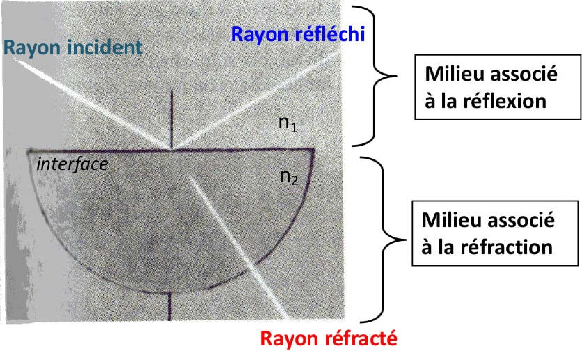

**Rayon réfracté :** rayon qui subit un changement de direction en traversant l’interface \(= surface de séparation\) entre deux milieux transparents d’indices de réfraction $$n_1$$ et $$n_2$$ différents

## Lois de Descartes et dispersion

### Lois de Descartes


Quand la **lumière change de milieu, elle change de direction.**   
Phénomène régis par les lois de Descartes


#### 3 Lois

* Les rayons incident, réfléchis et réfractés sont dans 1 seul plan, le plan d'incident, qui est défini par deux droites
* L’angle de réflexion est égal et opposé à l’angle d’incidence
* Pour deux milieux transparents donnés, d’indices de réfraction $$n_1$$ et $$n_2$$ , séparés par une interface de type dioptre plan, le rapport du sinus de l’angle d’incidence $$i_1$$ au sinus de l’angle de réfraction $$i_2$$est constant

#### Deuxième loi de Descartes \(relative à la réflexion\)

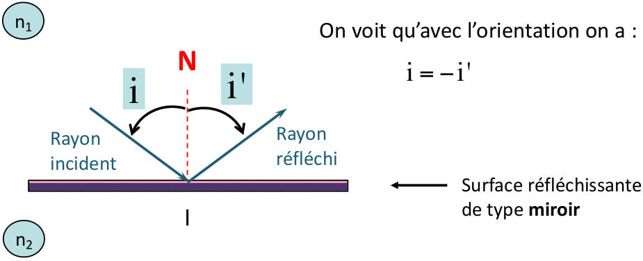

Mais on ne tient pas compte du signe des angles donc on écrira : i = i  
Les angles se définissent toujours par rapport à la **normale N \(**Perpendiculaire à la surface de séparation de l'interface\)

#### Troisième loi de Descartes \(relative à la réfraction\)


Pour deux milieux transparents donnés, d’indices de réfraction $$n_1$$ et $$n_2$$ , séparés par une interface de type dioptre plan, le rapport du sinus de l’angle d’incidence $$i_1$$ au sinus de l’angle de réfraction $$i_2$$ est constant

$$n_1\times \sin1=n_2\times \sin2$$

**Les angles se définissent entre les rayons et la normale N et pas entre les rayons et la surface de séparation**


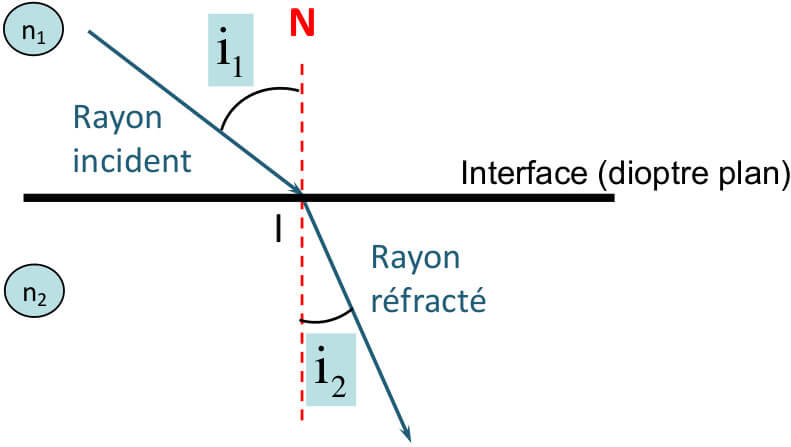

* Le rayon qui arrive perpendiculaire à l’interface ressort sans être dévié, pour $$i_1 = 0$$ et  $$i_2 = 0$$
* Pour $$i_1=90$$, incidence rasante, $$i_2$$est appelé **angle limite de réfraction**
* Angle limite $$i_l=\arcsin(\frac{n_-}{n_+})$$

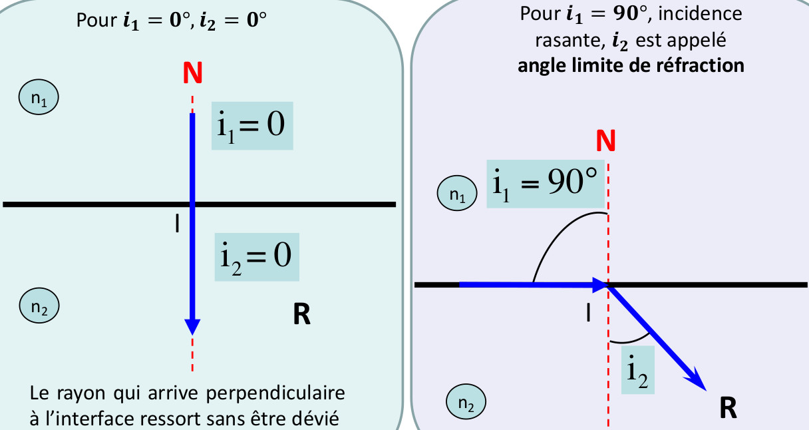


Il y à **réflexion** que dans le milieu d'**incidence le plus grand**

L'angle est **toujours plus petit** dans le milieu d'**indice le plus grand**

L'**angle limite** est **toujours** dans le milieu d'**indice le plus grand**


### **Prisme**

**Définition**


Milieu homogène et transparent d'indice n qui est limité par 2 dioptres plans qui sont non parallèle + une base \(triangle\) avec un angle A \(angle au sommet, arrête du prisme\)  
Objectif :  étaler les couleurs et dévier la lumière


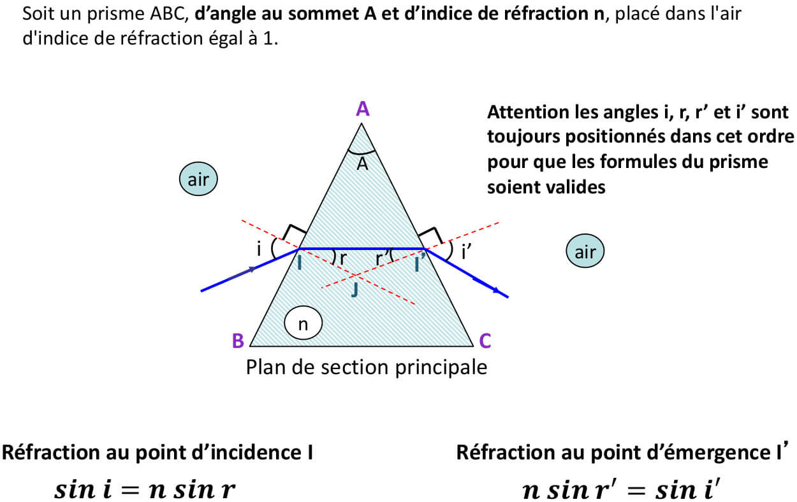

Dans le prisme l'angle **A = r + r'**

Si on prolonge le rayon incident vers l’avant et le rayon émergent vers l’arrière par rapport au sens de propagation de la lumière, les deux rayons se coupent au point K et définissent l’angle de déviation D.  
**D est l’angle de déviation du rayon incident après sa traversée du prisme**

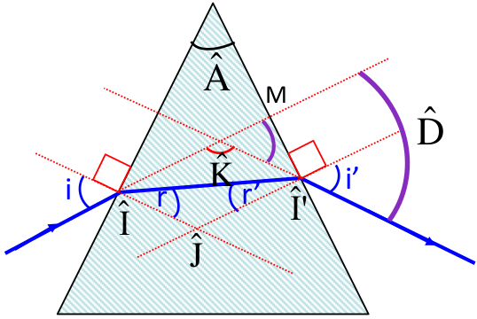

$$
D=i+i'-A
$$

## Système optique : généralité

### Stigmatisme et conditions de GAUSS


Un système optique est dit **stigmatique** pour deux points si l'ensemble des rayons lumineux issus d'un des points et traversant le système forment d'autres rayons lumineux dont les supports passent par le second point.

On parle de stigmatisme rigoureux quand tous les rayons issus d'un point objet A passent par un unique point A' après avoir traversé un système optique \(S.O\)


**Remarque :** Le seul système optique rigoureusement stigmate est le miroir plan.Mais le stigmatisme rigoureux n’est pas nécessaire pour la formation d’images.

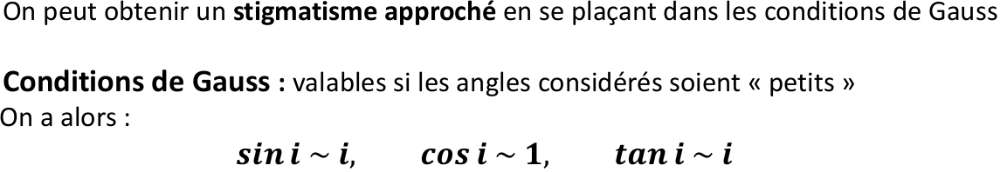

**Condition de GAUSS**  
- Les objets doivent être de faibles étendues \(petit\) et situé au voisinage de l'axe optique  
- Les faisceaux doivent traversés le système optique au voisinage du centre otpique  
- Les rayons sont faiblement inclinés par rapport à l'axe optique, donc les angles entres les rayons et l'axe optique sont petits =&gt; On peut donc utiliser les approximation de GAUSS vu ci dessus.

### Axe optique


Par convention l'axe optique est **orienté positivement** dans le **sens** de **propagation de la lumière.** Cet axe optique est **toujours** centré au **milieu du système optique**.   
Perpendiculairement à l'axe optique le **sens positif** est **toujours orienté vers le haut**.


### Points conjugués

Un système optique donne d'un point objet A un point image A'. On dit que A et A' sont conjugués pour le système optique, **1A -&gt; 1A'.**  
Image A' est conjugué de l'objet A pour le système optique.

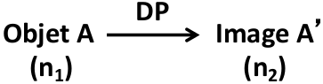


Relation de conjugaison : Soit un objet étendu AB et son image A'B' au travers d'un système optique tels que A-&gt;A' et B-&gt;B'. **L'objet étendu AB** et **son image A'B'** sont **toujours** représenté **perpendiculairement à l'axe optique** et **A et A' sont toujours positionné sur l'axe.**


### **Grandissement transversale**

Le grandissement noté $$\gamma$$est la grandeur algébrique et sans dimension qui relie la taille et le sens d'un objet AB et de son image A'B' soit

$$
\gamma = \frac{\overline{A'B'}}{\overline{AB}}
$$

### Faisceaux lumineux

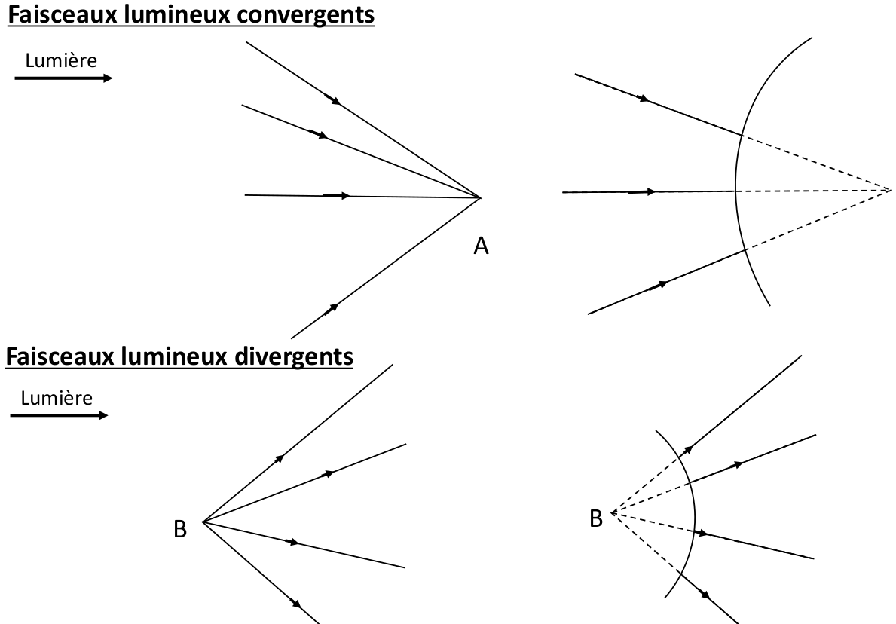

### Objet vs Image


* L'objet se trouve au croisement des rayons incident sur le système optique
* L'image se trouve toujours au croisement des rayons émergent du système optique


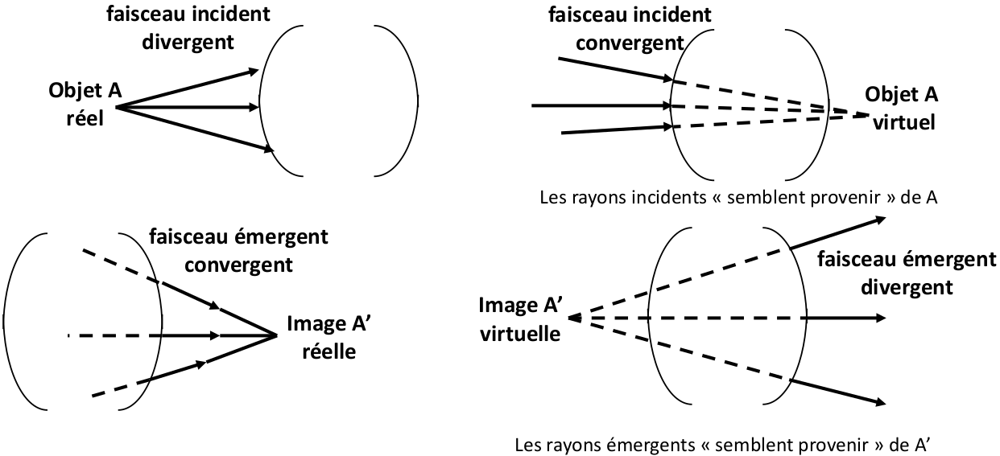

#### Espace objet ou image, réelle ou virtuelle \(nature objet image\)

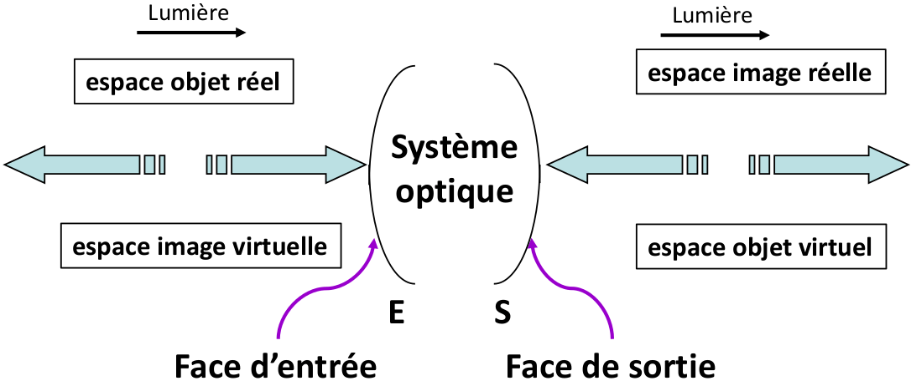

Une **image réelle** peut **toujours** être **projeté sur un écran** \(vidéoProj\)  
Une **image virtuelle** ne peut pas être projeté sur un écran, **il faut toujours la regarder au travers du système optique** \(loupe, aquarium\)

### Foyer d'un système optique

Le système optique à deux foyer, le foyer image et le foyer objet

#### Foyer image

Des rayons provenant de l'infini devant le système optique arrivant parallèlement à l'axe optique vont converger après avoir traversé le système optique en un point sur **l'axe optique** appelée foyer image F'

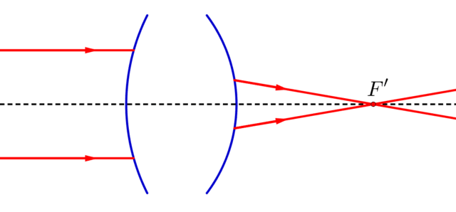

#### Foyer objet

Des rayons issus du points foyer objet F sur l'axe optique ressortiront parallèlement entre eux et par rapport à l'axe optique après traversé du système optique pour aller à l'infini \(image à l'infini\)

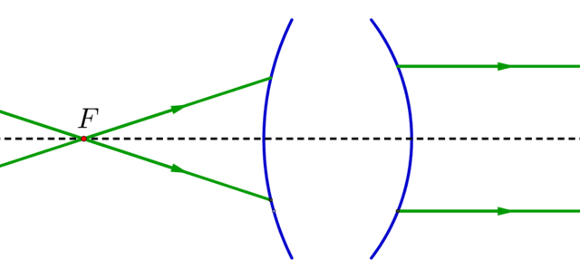

**Remarque :** Le dioptre plan n'a pas de foyer, des rayons parallèle entre eux qui arrivent sur le système optique émergent du dioptre plan en allant à l'infini, **le dioptre plan est afocale.**

## **Dioptre plan**

**Définition**


Le dioptre plan \(D.P\) est une interface plane qui sépare 2 milieux transparents d'indice optique n et n'


Trajet optique : Objet A dans n qui donne A' dans n'

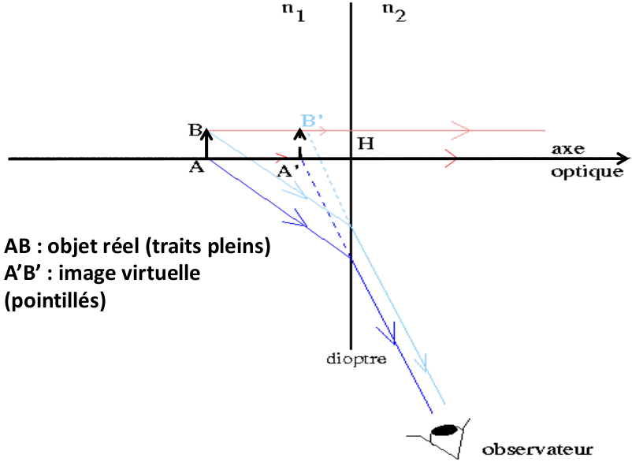


Nature objet image, toujours opposé dans un dioptre plan et l'axe optique. L'image fait la même taille que objet


#### Relation conjugaison du dioptre plan :

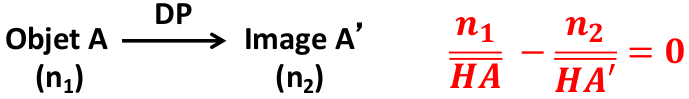

Il y a donc **l'image et l'objet du même coté du dioptre plan** donc **nature de l'image** et de l**'objet** sont **toujours opposé**; si l'un est réel l'autre est virtuel. Dans le dioptre plan uniquement

#### Grandissement du dioptre plan :

Dans un dioptre plan, uniquement !

$$
\gamma = \frac{\overline{A'B'}}{\overline{AB}}=1
$$

