# Optique

## Généralité optique géométrique

On distingue deux grande différence en optique, optique ondulatoire et géométrique.  
**Optique ondulatoire**  
- Phénomène des ondes  
- Diffraction et interférence  
**Optique géométrique**  
- Domaine du visible -&gt; Onde = Rayon lumineux, représenté par une droite  
3 lois fondamentales :  
- Propagation rectiline de la lumière dans un milieu homogène  
- Indépendance des rayons lumineux, constituant de base de la lumière, c'est le photon, il n'a pas de masse. Les rayons ne se voient pas et n'interagisse pas.

Vitesse de la lumière dans le vide : Célérité avec comme valeur $$C=3\times 10^{-8}m/s$$  
Dans un matériau d'indice n : $$V=\frac{C}{n}$$ avec C vitesse de la lumière en m/s et V vitesse de la lumière dans le milieu.

### Définition

* La lumière est fournie par une source lumineuse \(Soleil, Lampe, Laser, LED\)
* Un objet éclairé peut :
  * Stopper la lumière, l'objet est opaque \(Eclipse\)
  * Diffuser la lumière \(Brouillard\)
  * Absorber la lumière \(Filtre\)
  * Émettre de la lumière \(Luminescence, phosphorescence\)
* La lumière traverse le vide sans aucune modification
* Lorsque la source de lumière est infini, les rayons lumineux qui arrivent vers l'observateur sont parallèles
* Lorsque la source de lumière est à une distance fini et non collimée, les rayons vont diverger

### Principe fondamentaux de l'optique géométrique


* La propagation rectiligne de la lumière dans un milieu homogène \(-&gt; les propriétés de la lumière sont toutes identiques dans ce milieu\). Un milieu **homogène** est un milieu d**’indice de réfraction n constant**  Interface de séparation entre les deux milieux = dioptre plan n air = 1


3 principes :

* La propagation rectiligne de la lumière dans un milieu homogène
* L’indépendance des rayons lumineux \(On ne considère aucune interférence entre les rayons\)
* Le retour inverse de la lumière \(Le trajet lumineux de A vers B est identique au trajet de B vers A\)

### Réflexion et réfraction

**Rayon réfracté :** rayon qui subit un changement de direction en traversant l’interface \(= surface de séparation\) entre deux milieux transparents d’indices de réfraction $$n_1$$ et $$n_2$$ différents

## Lois de Descartes et dispersion

### Lois de Descartes


Quand la **lumière change de milieu, elle change de direction.**   
Phénomène régis par les lois de Descartes


#### 3 Lois

* Les rayons incident, réfléchis et réfractés sont dans 1 seul plan, le plan d'incident, qui est défini par deux droites
* L’angle de réflexion est égal et opposé à l’angle d’incidence
* Pour deux milieux transparents donnés, d’indices de réfraction $$n_1$$ et $$n_2$$ , séparés par une interface de type dioptre plan, le rapport du sinus de l’angle d’incidence $$i_1$$ au sinus de l’angle de réfraction $$i_2$$est constant

#### Deuxième loi de Descartes \(relative à la réflexion\)

Mais on ne tient pas compte du signe des angles donc on écrira : i = i  
Les angles se définissent toujours par rapport à la **normale N \(**Perpendiculaire à la surface de séparation de l'interface\)

#### Troisième loi de Descartes \(relative à la réfraction\)


Pour deux milieux transparents donnés, d’indices de réfraction $$n_1$$ et $$n_2$$ , séparés par une interface de type dioptre plan, le rapport du sinus de l’angle d’incidence $$i_1$$ au sinus de l’angle de réfraction $$i_2$$ est constant

$$n_1\times \sin1=n_2\times \sin2$$

**Les angles se définissent entre les rayons et la normale N et pas entre les rayons et la surface de séparation**


* Le rayon qui arrive perpendiculaire à l’interface ressort sans être dévié, pour $$i_1 = 0$$ et  $$i_2 = 0$$
* Pour $$i_1=90$$, incidence rasante, $$i_2$$est appelé **angle limite de réfraction**
* Angle limite $$i_l=\arcsin(\frac{n_-}{n_+})$$


Il y à **réflexion** que dans le milieu d'**incidence le plus grand**

L'angle est **toujours plus petit** dans le milieu d'**indice le plus grand**

L'**angle limite** est **toujours** dans le milieu d'**indice le plus grand**


### **Prisme**

**Définition**


Milieu homogène et transparent d'indice n qui est limité par 2 dioptres plans qui sont non parallèle + une base \(triangle\) avec un angle A \(angle au sommet, arrête du prisme\)  
Objectif :  étaler les couleurs et dévier la lumière


Dans le prisme l'angle **A = r + r'**

Si on prolonge le rayon incident vers l’avant et le rayon émergent vers l’arrière par rapport au sens de propagation de la lumière, les deux rayons se coupent au point K et définissent l’angle de déviation D.  
**D est l’angle de déviation du rayon incident après sa traversée du prisme**

$$
D=i+i'-A
$$

## Système optique : généralité

### Stigmatisme et conditions de GAUSS


Un système optique est dit **stigmatique** pour deux points si l'ensemble des rayons lumineux issus d'un des points et traversant le système forment d'autres rayons lumineux dont les supports passent par le second point.

On parle de stigmatisme rigoureux quand tous les rayons issus d'un point objet A passent par un unique point A' après avoir traversé un système optique \(S.O\)


**Remarque :** Le seul système optique rigoureusement stigmate est le miroir plan.Mais le stigmatisme rigoureux n’est pas nécessaire pour la formation d’images.

**Condition de GAUSS**  
- Les objets doivent être de faibles étendues \(petit\) et situé au voisinage de l'axe optique  
- Les faisceaux doivent traversés le système optique au voisinage du centre otpique  
- Les rayons sont faiblement inclinés par rapport à l'axe optique, donc les angles entres les rayons et l'axe optique sont petits =&gt; On peut donc utiliser les approximation de GAUSS vu ci dessus.

### Axe optique


Par convention l'axe optique est **orienté positivement** dans le **sens** de **propagation de la lumière.** Cet axe optique est **toujours** centré au **milieu du système optique**.   
Perpendiculairement à l'axe optique le **sens positif** est **toujours orienté vers le haut**.


### Points conjugués

Un système optique donne d'un point objet A un point image A'. On dit que A et A' sont conjugués pour le système optique, **1A -&gt; 1A'.**  
Image A' est conjugué de l'objet A pour le système optique.


Relation de conjugaison : Soit un objet étendu AB et son image A'B' au travers d'un système optique tels que A-&gt;A' et B-&gt;B'. **L'objet étendu AB** et **son image A'B'** sont **toujours** représenté **perpendiculairement à l'axe optique** et **A et A' sont toujours positionné sur l'axe.**


### **Grandissement transversale**

Le grandissement noté $$\gamma$$est la grandeur algébrique et sans dimension qui relie la taille et le sens d'un objet AB et de son image A'B' soit

$$
\gamma = \frac{\overline{A'B'}}{\overline{AB}}
$$

### Faisceaux lumineux

### Objet vs Image


* L'objet se trouve au croisement des rayons incident sur le système optique
* L'image se trouve toujours au croisement des rayons émergent du système optique


#### Espace objet ou image, réelle ou virtuelle \(nature objet image\)

Une **image réelle** peut **toujours** être **projeté sur un écran** \(vidéoProj\)  
Une **image virtuelle** ne peut pas être projeté sur un écran, **il faut toujours la regarder au travers du système optique** \(loupe, aquarium\)

### Foyer d'un système optique

Le système optique à deux foyer, le foyer image et le foyer objet

#### Foyer image

Des rayons provenant de l'infini devant le système optique arrivant parallèlement à l'axe optique vont converger après avoir traversé le système optique en un point sur **l'axe optique** appelée foyer image F'

#### Foyer objet

Des rayons issus du points foyer objet F sur l'axe optique ressortiront parallèlement entre eux et par rapport à l'axe optique après traversé du système optique pour aller à l'infini \(image à l'infini\)

**Remarque :** Le dioptre plan n'a pas de foyer, des rayons parallèle entre eux qui arrivent sur le système optique émergent du dioptre plan en allant à l'infini, **le dioptre plan est afocale.**

## **Dioptre plan**

**Définition**


Le dioptre plan \(D.P\) est une interface plane qui sépare 2 milieux transparents d'indice optique n et n'


Trajet optique : Objet A dans n qui donne A' dans n'


Nature objet image, toujours opposé dans un dioptre plan et l'axe optique. L'image fait la même taille que objet


### Relation conjugaison du dioptre plan :

Il y a donc **l'image et l'objet du même coté du dioptre plan** donc **nature de l'image** et de l**'objet** sont **toujours opposé**; si l'un est réel l'autre est virtuel. Dans le dioptre plan uniquement

#### Grandissement du dioptre plan :

Dans un dioptre plan, uniquement !

$$
\gamma = \frac{\overline{A'B'}}{\overline{AB}}=1
$$

## Dioptre sphérique

#### Définition


Un dioptre sphérique est une interface sphérique qui sépare 2 milieux transparent d'indice différent n et n'


#### Généralité


Des rayons parallèles arrivant sur un système optique sont considérés comme issus d’un point objet situé à l’infini.

Des rayons parallèles sortant d’un système optique sont considérés comme donnant un point image situé à l’infini.

En particulier, tous les rayons parallèles à l’axe optique peuvent être considérés comme provenant d’un point objet situé à l’infini sur l’axe optique.


Les points important dans le dioptre sphérique sont le centre C, son sommet S. La valeur absolue de SC est appelée le rayon de courbure du dioptre.

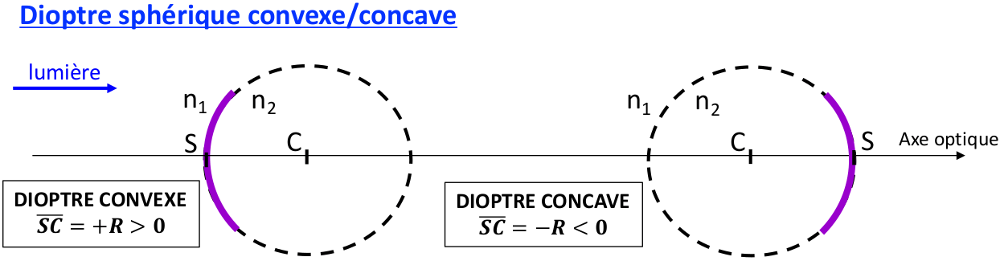


* La valeur absolue SC est appelée rayon de **courbure R du dioptre** : **ce nombre est positif.** 
* Toutes les distances seront données en mesures algébriques avec l’origine au **sommet S**. 
* Les termes **« concave » et « convexe »** sont utilisés seulement par rapport au signe de **SC.** 
* On a vu que le DS n’est pas rigoureusement stigmatique. En pratique, on se place dans les conditions de Gauss pour avoir un stigmatisme approché.


#### Représentation schématique

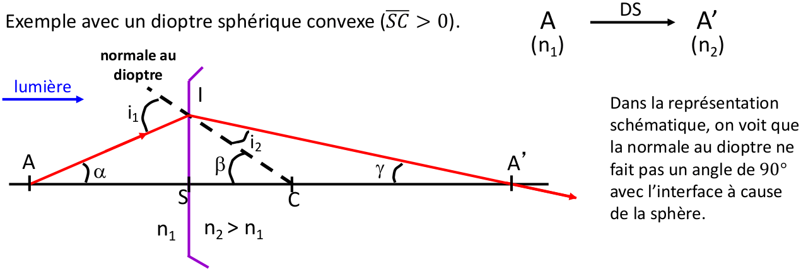

Les rayons qui arrivent sur l’interface en passant par le centre de la sphère ne seront pas déviés par le DS =&gt; **Tout rayon passant par le centre optique C est non dévié !**

### **Relation de conjugaison du dioptre sphérique**

Pour un objet AB associé à un milieu incident d’indice $$n_1$$et donnant par un DS de sommet S et de centre C une image A′B′ associée à un milieu émergent d’indice $$n_2$$ on écrit :

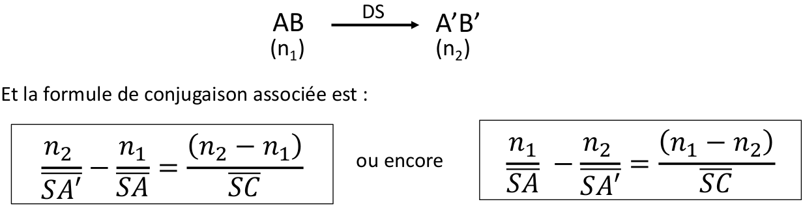


* à bien associer la position de l’image SA′ avec $$n_2$$ 
* à bien associer la position de l’objet SA avec $$n_1$$
* à l’ordre des indices de réfraction entre les deux membres de l’égalité suivant l’égalité choisie
* Toute reltion pour le D.S seront exprimé par rapport à son sommet S


#### Distances focales objet et image du DS – DS convergence ou divergent

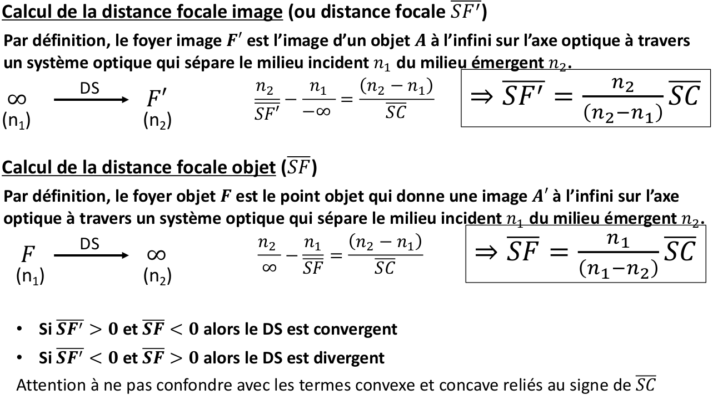

#### Relations remarquables du DS

La position respective des 4 points : **S, C, F et F′** n’est pas quelconque.

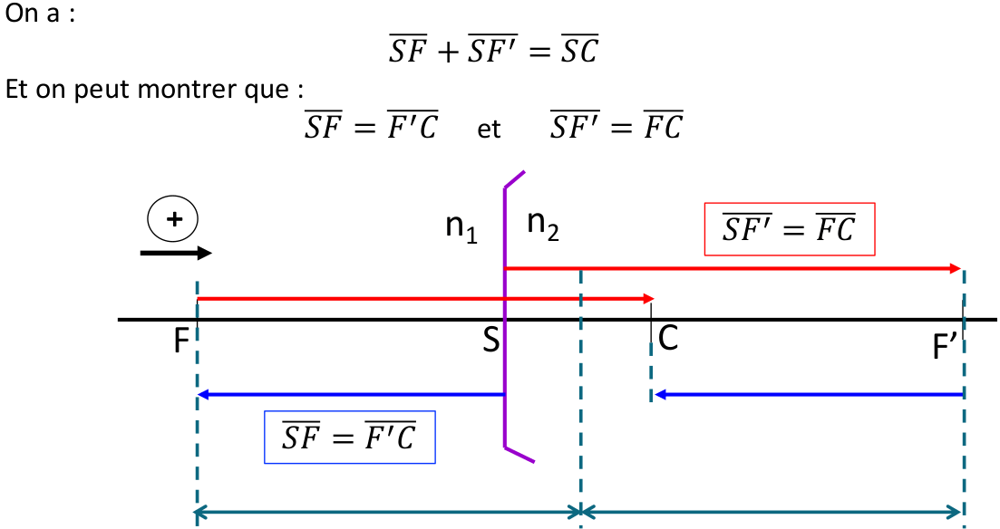


Les foyers objet et image sont toujours symétriques par rapport au milieu du segment SC Cette propriété est à utiliser pour la cohérence du tracé des images.


#### Grandissement du dioptre sphérique

Pour le dioptre sphérique, le grandissement se calcule comme le rapport de la position de l’image à celle de l’objet, multiplié par le rapport des indices. Attention à l’ordre

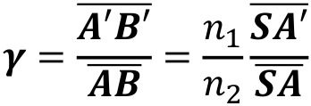

### Construction de l’image d’un objet AB perpendiculaire à l’axe optique et grandissement

#### Dioptre sphérique convergent

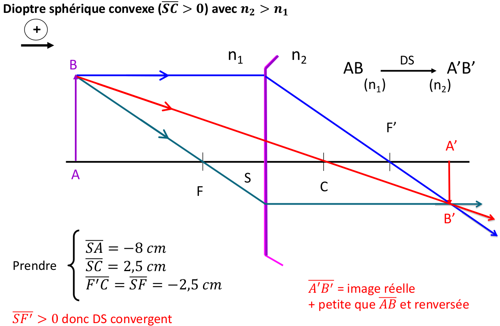

#### Dioptre sphérique divergent

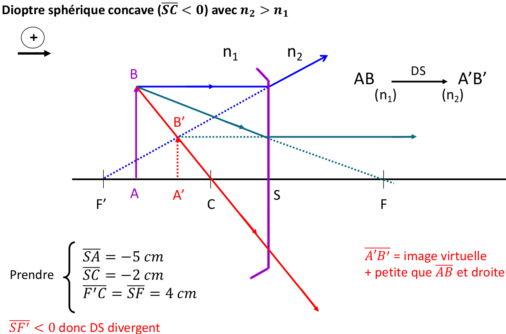

## Lentille mince


Une lentille mince est un système optique \(dioptrique\) centrée constitué d'un milieu transparent homogène et isotrope d'indice n et délimité par deux dioptre dont au moins 1 est sphérique.


#### Schéma principe

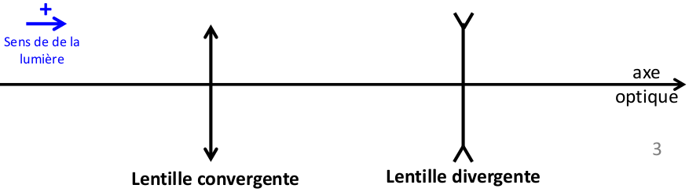

#### Point remarquable des lentilles

* Centre O sur l'axe optique
* Foyer objet F
* Foyer objet F'

$$\overline{OF'}=-\overline{OF}$$, les foyers F et F' sont symétrique par rapport au centre O

#### Nature d'une lentille


$$OF'>0$$alors présence d'une lentille convergente

$$OF'<0$$alors présence d'une lentille divergente


#### Relation de conjugaison d'une lentille

$$\frac{1}{\overline{OA'}}-\frac{1}{\overline{OA}}=\frac{1}{\overline{OF'}}$$

#### Vergence d'une lentille

$$V=\frac{1}{\overline{OF'}}$$Si V&gt;0 alors la lentille est convergente. Si V&lt;0 alors lentille divergent.  
Unité de base en **mètre** 

#### Grandissement lentille

$$\gamma = \frac{\overline{A'B'}}{AB} = \frac{OA'}{OA}$$

#### Lentille accolées

La lentille équivalente à un ensemble de lentilles minces accolées de même centre optique O est la somme des vergences individuelles.

$$Veq=\sum V_i$$et $$\frac{1}{\overline{OF'_{eq}}} = \frac{1}{\overline{OF'_i}}$$unité en **mètre**

#### **Tracé de rayon**

-Le noyau qui passe par le centre O du système optique n'est pas dévier  
-Le noyau incident parallèle à l'axe optique qui passe par B, il passe par le foyer image F' après traversé de la lentille  
-Le rayon passant par B et le foyer objet F, il sort de la lentille parallèle à l'axe optique est vers l'infini

## Loupe

### Grandeur caractéristique

Puissance P en δ dioptrie $$m^{-1}$$

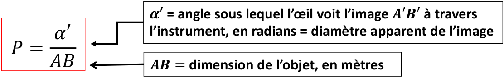

Le grossissement G sans unité

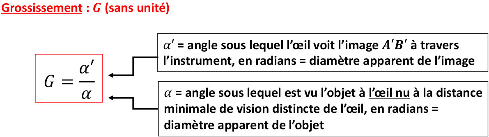

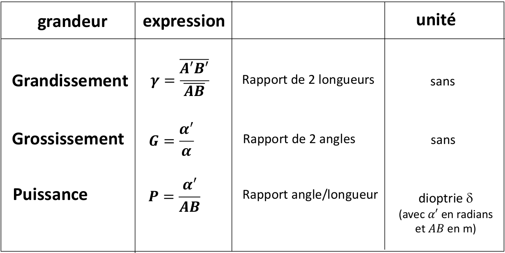

### Définition


La loupe est une **lentille convergente** avec en distance focale entre 2 et 20 cm


#### Propriété de la loupe

L'objet AB doit être situé entre le centre optique O de la lentille et le foyer objet F =&gt; Forme une image virtuelle

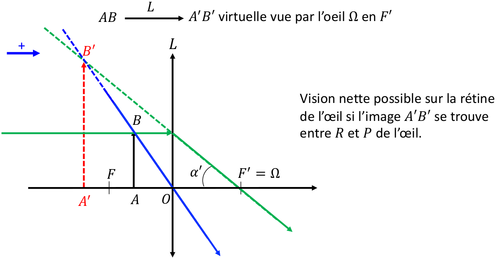

### Latitude de mise au point


La latitude de mise au point \(ou profondeur de champ\) est la distance $$\overline{A_R A_P}$$ entre les positions extrêmes des objets qui donnent des images observables nettes par l’oeil, donc des images situées entre R et P de l’œil.


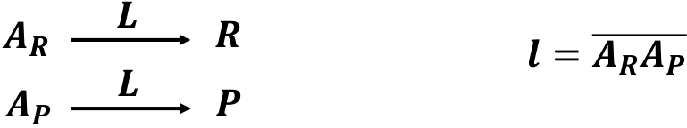

$$\frac{1}{\overline{OR}} - \frac{1}{\overline{OA_R}} = \frac{1}{\overline{OF'}}$$=&gt; $$l=\overline{A_R A_P}$$

Latitude de mise au point pour l'oeil normal  
P = 25 cm   
R = infini  
Sommet de l'oeil = $$\Omega$$  
$$\overline{\Omega P} = -25 cm$$  
$$\overline{\Omega R} = - \infty$$

### Puissance et grossissement d'une loupe


La puissance de la loupe dépend :   
- Sa distance focale  
- La position de l'objet AB  
- La position de l'oeil $$\Omega$$par rapport à la loupe


Deux cas particulier : Objet au foyer objet F \(A'B' est à l'infini\) et oeil en F'

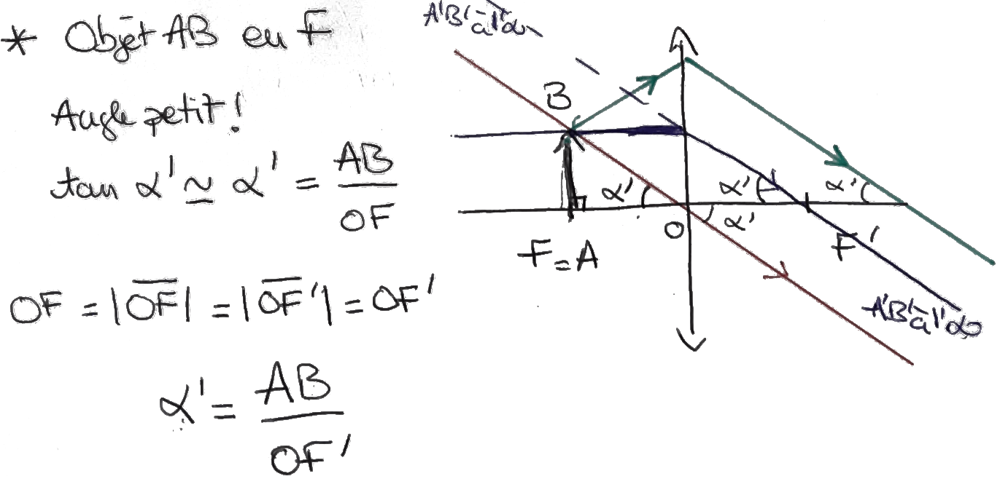

Oeil en F'

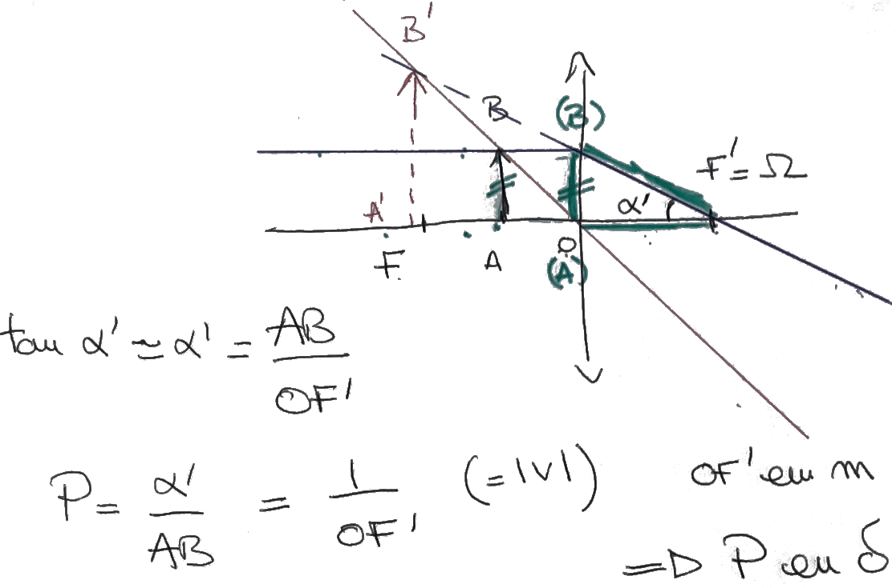

#### Puissance intrinsèque de la loupe


Pour les deux cas particulier, objet en F et Oeil en F', la puissance de la loupe ne dépend que de la distance focale


$$P_i = \frac{1}{OF'}$$

Pour une loupe de focale entre 2 cm et 20 cm =&gt; 5δ &lt; $$P_i$$&lt; 50δ

### Grossissement

$$G=\frac{\alpha '}{\alpha}$$ avec $$\alpha$$angle sous lequel l'objet est vu à l'oeil nu =&gt; Objet est au proximum de l'oeil.

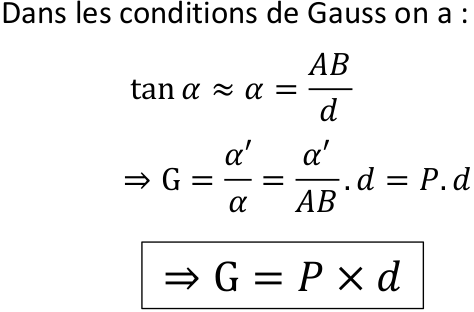

#### Grossissement commercial

Si l’observation se fait dans un des 2 cas particuliers, objet en F de la loupe ou œil au foyer image F′ de la loupe, on utilise la puissance intrinsèque : $$P_i= \frac{1}{OF'}$$

Le grossissement devient alors $$G=\frac{d}{OF'}$$  
Si de plus l’œil est normal \(emmétrope\) alors la distance minimale de vision distincte est d = 25 cm = 0,25 m   
On définit alors le grossissement commercial G C comme la puissance intrinsèque divisée par 4, avec P \) en d et G + sans unité.

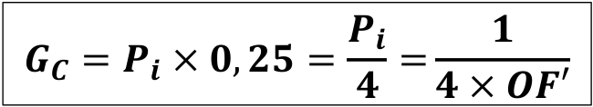

### Pouvoir séparateur du système \(Oeil + Loupe\)

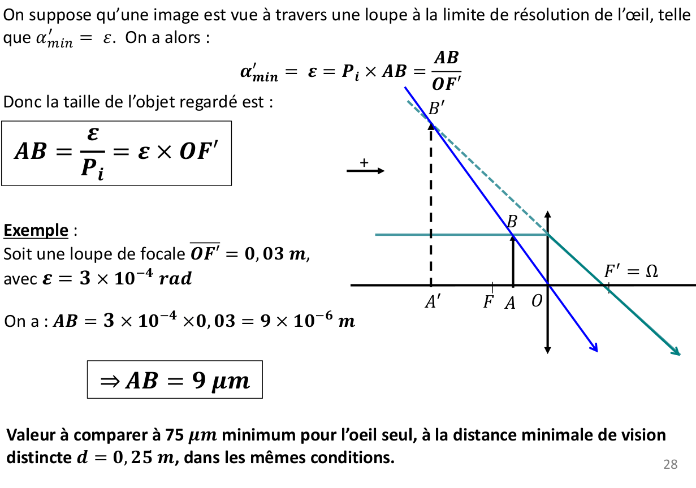

