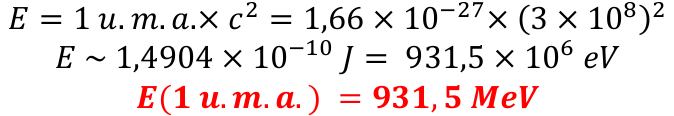
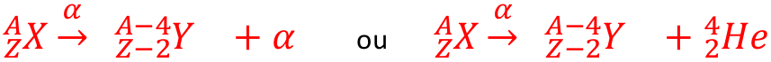
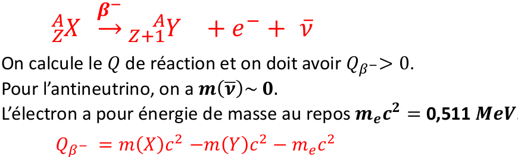
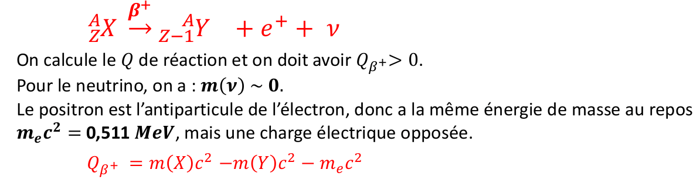
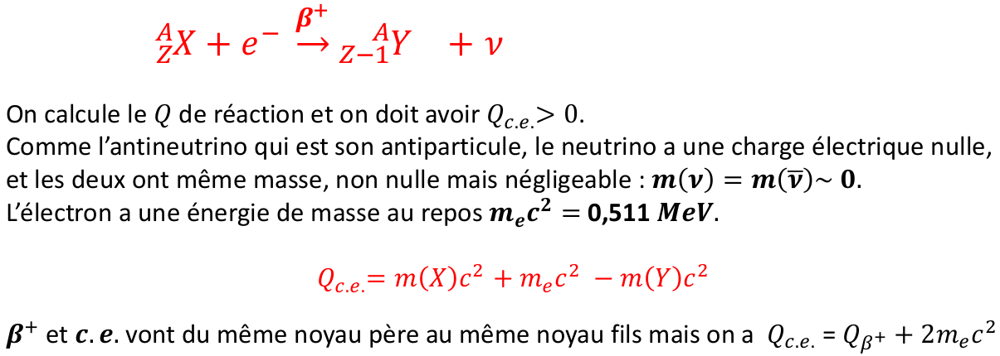

# Radioactivité

## Physique du noyau, unités associées, masse et énergie

### Noyau atomique \(radioactivité = physique du noyau ou nucléaire\)

1 atome neutre = 1 noyau \(charge totale +Ze\) + Z électrons \(charge totale −Ze\), avec e = charge élémentaire = $$1,6\times 10^{-19}$$C.


X = nom de l'élément chimique ou son isotope  
A = nombre de masse de l'atome  
Z = nombre de charge \(= nombre d'électrons de l'atome\) ou numéro atomique



Isotopes : ce sont deux noyaux ayant même Z \(donc même symbole chimique\) mais des valeurs de A différentes, donc N différents.

Isobare : ce sont deux noyaux différents \(donc des Z différents\) mais ayant même nombre de masse \(A identique\).


### Désexcitation gamme du noyau


On dit que le noyau est excité lorsqu'il à acquis un surplus d'énergie

* Un noyau dans un état excité peut être stable ou radioactif
* Un noyau dans un état excité prend le symbole étoile en exposant
* Un noyau dans un état excité veut retourner vers son état fondamental

Pour se désexciter, le noyau va émettre un photon γ qui emporte l’énergie en surplus entre l’état initial d’énergie Ei et l’état final d’énergie Ef avec Ei &gt; Ef


On a $$E_y = h \nu = E_i - E_f$$avec h est la constante de planck, avec h=$$6,62 \times 10^{-34}J.s$$ et $$\nu$$ou f est la fréquence du rayonnement gamma  
Pas de distinction entre rayonnement et matière ici.  
 Le photon γ est à la fois une onde \(rayonnement\) et une particule \(matière\).

### Unité d'énergie

Le joule \(J\) n'est pas une unité adapté pour les énergies de noyaux et de particules car leurs valeurs sont bien trop faibles. On utilise l'électron-Volt et ses multiples.


un électron-Volt est l’énergie d’une charge élémentaire e = $$1,6 \times 10^{-19}$$ C soumise à une d.d.p de 1 V donc 1 eV = $$1,6 \times 10^{-19}$$ J

Avec 1 MeV = 10^6 eV // 1KeV = 10^3 eV


### Unité de masse atomique

C’est l’unité utilisée pour les masses en radioactivité \(plutôt que le kilogramme, pas adapté\).


1 unité de masse atomique \(1 u.m.a\) est égale à la masse de l’atome de carbone 12 \( $$_{6}^{12}C^{6}$$\) divisée par 12.


**Exemple :**  
proton $$m_p = 1,007276 u.m.a$$  
neutron $$m_n = 1,008665u.m.a$$  
électron $$m_e = 0.0005486u.m.a$$

#### Masse d'un noyau

Masse du noyau = masse de son état fondamental. On donne la masse en u. m. a.  
Exemple : $$m(^{235}U)=234,99345u.m.a$$

### Energie de masse au repos

Principe d’équivalence masse-énergie énoncé par Einstein en 1905 : $$E=mc^2$$  
Avec E en joule, m en kg et $$c=3\times 10^8m/s$$  
Energie équivalente


 Dans les exercices il y a soit les masses en u.m.a , soit directement les énergies de masse au repos en MeV.


### Energie de masse au repos d'un noyau

Soit un noyau $$^A_ZX^N$$avec $$A=Z+N$$, l'énergie de masse au repos de ce noyau, dans son état fondamental, s'écrit : 

Remarque : si le noyau est dans un état excité d'énergie alors la masse au repos s’écrit :

## Lois de conservation, désintégrations radioactives

### Loi de conservation

Soit une réaction nucléaire au cours de laquelle deux noyaux $$X_1$$ et $$X_2$$ entrent en collision dans l’état initial pour former dans l’état final deux noyaux $$X_3$$ et $$X_4$$

### Chaleur de réaction

Cas générale  
Le bilan énergétique d’une réaction est défini comme étant égal à Q, appelé chaleur de réaction ou énergie libérée dans la réaction. Pour une réaction nucléaire de type \(cf dessus\) ou les $$X_i$$sont des noyaux, le bilan énergétique Q s’écrit soit à partir des masses m \(en u.m.a \), ou soit à partir des énergies de masse au repos $$mc^2$$ \(en MeV\).  
Q est égal à la somme des masses/énergies dans l’état initial moins la somme des masses/énergies dans l’état final. On écrit, en MeV :


* Si Q&gt;0 la réaction est dite exoénergetique : elle est spontanée et se produit sans apport d’énergie dans la voie d’entrée. Il y a de l’énergie libérée en voie de sortie.
* Si Q&lt;0 la réaction est dite endoénergétique : la réaction est impossible si on ne fournit pas d’énergie dans l’état initial, sous forme d’énergie cinétique $$E_c$$ donnée au projectile.


Cas particulier : Si la réaction ne contient que des noyaux \(dans ce cas, N est conservé\)   
Les deux premiers termes sont nuls et on peut écrire Q directement en fonction des énergies de liaison B des nucléons dans le noyau, mais attention à l’ordre : $$Q=B_3+B_4-B_1-B_2$$ \(en MeV\)

### Généralité sur les désintégration radioactive

* Un noyau radioactif, naturellement ou créé artificiellement, est un noyau instable. Il peut-être dans son état fondamental ou dans un état excité. Il cherche à retourner vers une forme plus stable : le noyau radioactif va se désintégrer afin de se transformer spontanément en un noyau stable \(en une ou plusieurs étapes\)
* Les désintégrations radioactives sont des réactions nucléaires particulières :
  * avec un seul noyau dans l’état initial ;
  * en général des particules sont présentes dans la réaction, souvent émises

    mais parfois capturées ;

  * si elle existe, la désintégration est spontanée, donc il faut avoir Q &gt; 0
* Il existe plusieurs types de désintégrations radioactives. Celles étudiées ici sont les plus courantes : α, $$\beta ^-$$ , $$\beta ^+$$ et c.e.
* Parmi ces désintégrations, **β- , β+ et c.e.** sont dites **isobariques** car le noyau père et le noyau fils ont même valeur de A, ce sont des noyaux isobares
* Neutrino $$\nu$$ et antineutrino $$\overline{\nu}$$, de charge électrique nulle, apparaisse dans les désintégration isobariques. Ce sont des antiparticule, donc ils ont la même masse. Elle est non nulle mais négligeable. $$m(\nu)=m(\overline{\nu}) \simeq 0$$ $$\nu$$et $$\overline{\nu}$$ dans les réactions β-, β+ et c.e., sinon l’énergie totale n’est pas conservée et donc ces réactions sont fausses !

### Désintégration alpha \($$\alpha$$\)

Un noyau père $$^A_ZX$$se transforme en un noyau fils $$^{A-2}_{Z-2}Y$$en émettant une particule $$\alpha$$  
La réaction s'écrit :

On calcule le Q de réaction et on doit avoir $$Q_\alpha$$&gt; 0. On connait l’énergie de masse au repos $$m_\alpha c^2=3727,5$$ MeV

### Désintégration Beta moins \($$\beta ^-$$\)

Un noyau père $$^A_ZX$$ se transforme en un noyau fils $$^A_{Z+1}Y$$ en émettant un électron $$e^-$$ et un antineutrino $$\overline{\nu}$$ qui se partagent l’énergie $$Q_{\beta -}$$ libérée dans la réaction. C’est une désintégration isobarique, qui s’écrit :


Remarque importante : ne pas oublier $$\overline{\nu}$$ dans la désintégration β- sinon elle est fausse


### Désintégration Beta plus \($$\beta^+$$\)

Un noyau père $$^A_ZX$$ se transforme en un noyau fils $$^A_{Z-1}Y$$ en émettant un positron $$e^+$$ et un neutrino $$\nu$$ qui se partagent l’énergie $$Q_{\beta +}$$ libérée dans la réaction. C’est une désintégration isobarique, qui s’écrit :


Remarque importante : ne pas oublier $$\nu$$ dans la désintégration β+ sinon elle est fausse


### Désintégration électronique \(c.e\)

Un noyau père $$^A_ZX$$ se transforme en un noyau fils $$^A_{Z-1}Y$$ en capturant un électron $$e^-$$ du cortège électronique de son atome et en émettant un neutrino $$\nu$$ qui emporte toute l’énergie $$Q_{c.e}$$ libérée dans la réaction. C’est une désintégration isobarique, qui s’écrit :


Remarque importante : ne pas oublier ν dans la réaction de c. e. sinon elle est fausse


## Loi de décroissance radioactive et activité

## Datation absolue par mesure de la radioactivité

## Traceurs radioactifs

## Interaction rayonnement-matière et radioprotection

## Mesure des rayonnements : les doses

